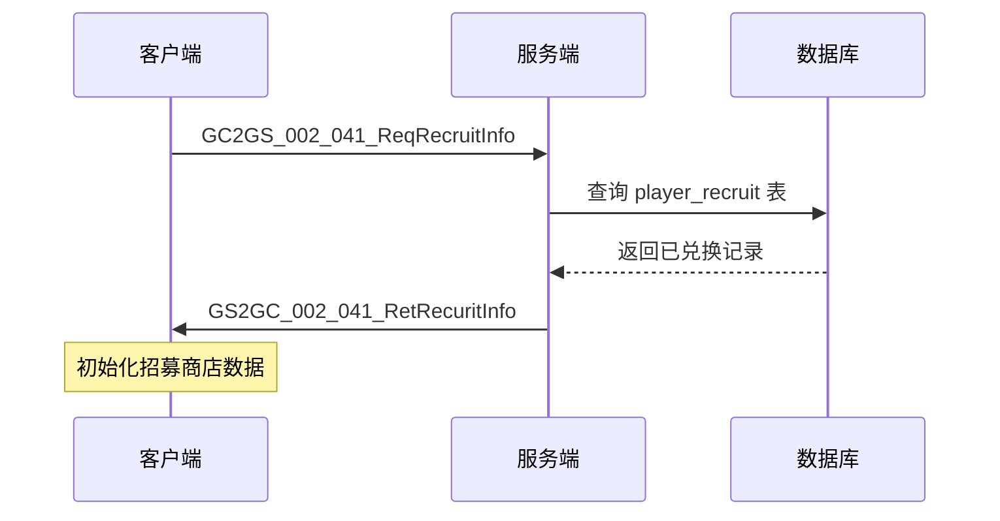
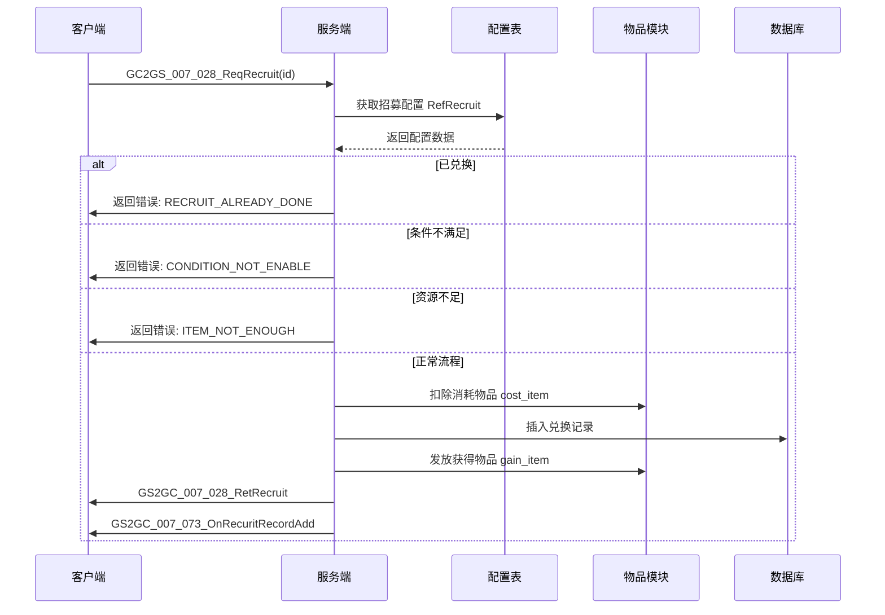

# 招募模块协议文档

## 协议模块编号: p002 / p007

招募系统主要使用 `InitOp (p002)` 进行初始化数据同步，使用 `CommOp (p007)` 进行招募操作。

---

## 一、客户端请求协议 (GC2GS)

### 1.1 初始化协议

#### GC2GS_002_041_ReqRecruitInfo - 请求招募信息

**功能说明**: 请求玩家招募初始化信息，获取已兑换的招募项ID列表

**协议编号**: 主序号 2，子序号 41

**请求参数**: 无

**服务端处理流程**:
1. 获取玩家招募组件
2. 查询数据库中已兑换记录
3. 返回已兑换ID列表

**响应**: `GS2GC_002_041_RetRecuritInfo`

---

### 1.2 招募操作协议

#### GC2GS_007_028_ReqRecruit - 请求招募兑换

**功能说明**: 请求兑换指定招募项

**协议编号**: 主序号 18，子序号 28

**请求参数**:

| 序号 | 字段名 | 类型 | 说明 | 示例 |
|------|--------|------|------|------|
| 1 | id | long | 招募ID | 10001 |

**服务端处理流程**:
1. 获取招募配置 `RefRecruit`
2. 检查是否已兑换
3. 检查兑换条件是否满足
4. 扣除消耗物品
5. 记录兑换数据到数据库
6. 发放获得物品
7. 推送兑换成功通知

**响应**: `GS2GC_007_028_RetRecruit`

---

## 二、服务端响应协议 (GS2GC)

### 2.1 初始化响应

#### GS2GC_002_041_RetRecuritInfo - 返回招募信息

**功能说明**: 返回玩家招募初始化信息

**协议编号**: 主序号 2，子序号 41

**响应字段**:

| 序号 | 字段名 | 类型 | 说明 |
|------|--------|------|------|
| 1 | hadRecuritIdList | List\<long\> | 已兑换招募ID列表 |

---

### 2.2 操作响应

#### GS2GC_007_028_RetRecruit - 返回招募结果

**功能说明**: 返回招募兑换结果

**协议编号**: 主序号 7，子序号 28

**响应字段**: 无（仅表示操作成功）

---

### 2.3 推送通知协议

#### GS2GC_007_073_OnRecuritRecordAdd - 新增兑换记录通知

**功能说明**: 通知客户端新增了一条兑换记录

**协议编号**: 主序号 7，子序号 73

**推送字段**:

| 序号 | 字段名 | 类型 | 说明 |
|------|--------|------|------|
| 1 | recuritId | long | 新兑换的招募ID |

---

## 三、协议时序图

### 3.1 招募初始化流程



### 3.2 招募兑换流程



---

## 四、错误码定义

| 错误码 | 错误信息 | 说明 |
|--------|----------|------|
| REF_NOT_FOUND | 配置不存在 | 招募配置ID无效 |
| RECRUIT_ALREADY_DONE | 已兑换过 | 该招募项已被兑换 |
| CONDITION_NOT_ENABLE | 条件不满足 | 玩家未满足兑换条件 |
| ITEM_NOT_ENOUGH | 物品不足 | 消耗物品数量不足 |

---

## 五、协议数据结构

### 5.1 协议类定义

#### GC2GS_007_028_ReqRecruit

```csharp
public class GC2GS_007_028_ReqRecruit : _IALProtocolStructure
{
    private long id;  // 兑换id

    public byte getMainOrder() { return (byte)18; }
    public byte getSubOrder() { return (byte)28; }

    public long getId() { return id; }
    public void setId(long _id) { id = _id; }
}
```

#### GS2GC_002_041_RetRecuritInfo

```csharp
public class GS2GC_002_041_RetRecuritInfo : _IALProtocolStructure
{
    private List<long> hadRecuritIdList;  // 已兑换id列表

    public byte getMainOrder() { return (byte)2; }
    public byte getSubOrder() { return (byte)41; }

    public List<long> getHadRecuritIdList() { return hadRecuritIdList; }
}
```

#### GS2GC_007_073_OnRecuritRecordAdd

```csharp
public class GS2GC_007_073_OnRecuritRecordAdd : _IALProtocolStructure
{
    private long recuritId;  // 招募id

    public byte getMainOrder() { return (byte)7; }
    public byte getSubOrder() { return (byte)73; }

    public long getRecuritId() { return recuritId; }
}
```

---

## 六、协议发送示例

### 6.1 客户端发送请求

```csharp
// 发送初始化请求
NPGSClientListener.sendMsg(GSWriter_002_InitOp.make_002_041_ReqRecruitInfo());

// 发送招募请求
NPGSClientListener.sendRequest(
    GSWriter_007_CommOp.make_028_ReqRecruit(recruitId),
    new CommonRequestCallbackProtocolDealer<GS2GC_007_028_RetRecruit>(
        (msg) => {
            // 招募成功
            Debug.Log("招募成功");
        },
        (error) => {
            // 招募失败
            Debug.LogError($"招募失败: {error}");
        }
    )
);
```

### 6.2 服务端发送推送

```java
// 推送兑换记录新增
userData.sendMsgToGC(US2GCWriter_007_CommOp.make_073_OnRecuritRecordAdd(recruitId));

// 返回招募结果
_committer.commitSucRes(US2GCWriter_007_CommOp.make_028_RetRecruit());
```

---

## 七、协议汇总表

### 7.1 请求协议

| 协议名 | 主序号 | 子序号 | 说明 |
|--------|--------|--------|------|
| GC2GS_002_041_ReqRecruitInfo | 2 | 41 | 请求招募信息 |
| GC2GS_007_028_ReqRecruit | 18 | 28 | 请求招募兑换 |

### 7.2 响应协议

| 协议名 | 主序号 | 子序号 | 说明 |
|--------|--------|--------|------|
| GS2GC_002_041_RetRecuritInfo | 2 | 41 | 返回招募信息 |
| GS2GC_007_028_RetRecruit | 7 | 28 | 返回招募结果 |
| GS2GC_007_073_OnRecuritRecordAdd | 7 | 73 | 新增兑换记录通知 |

---

*文档生成时间: 2026-04-11*
