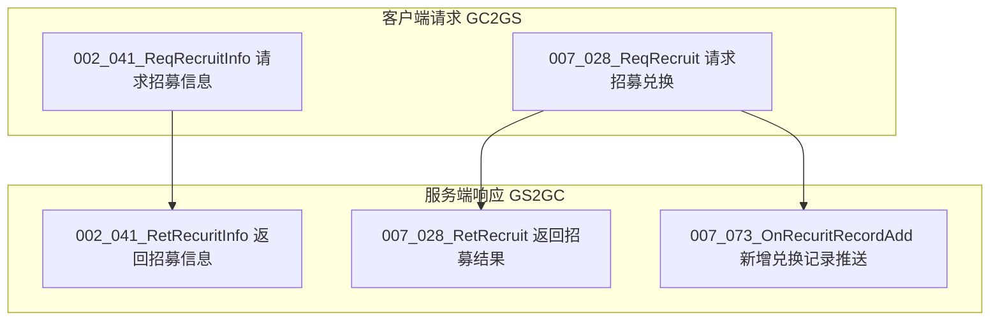
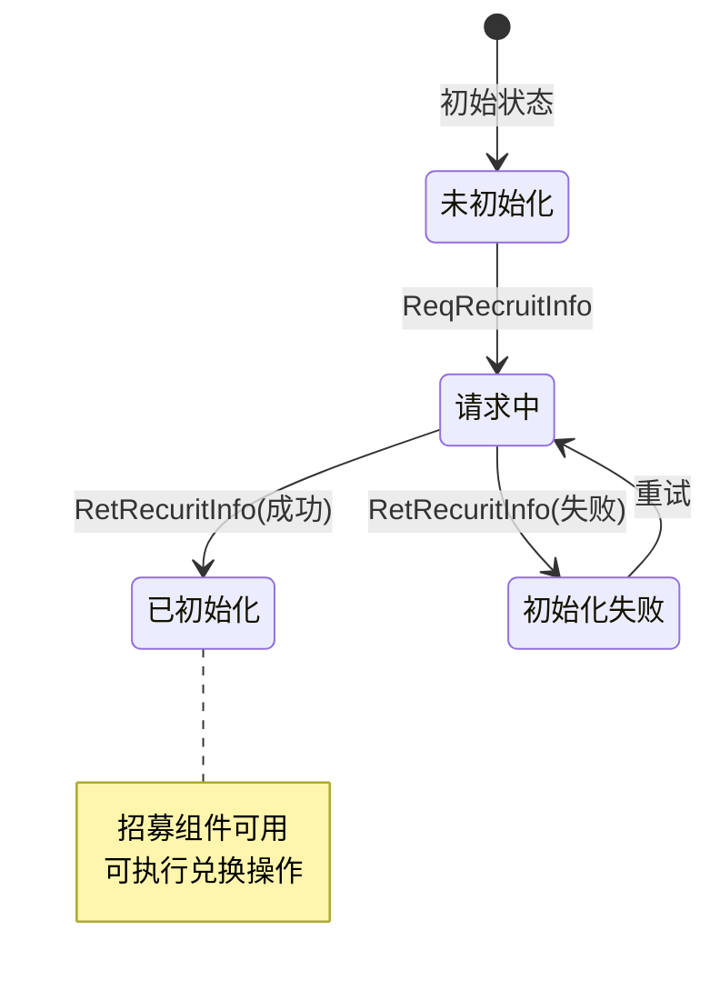
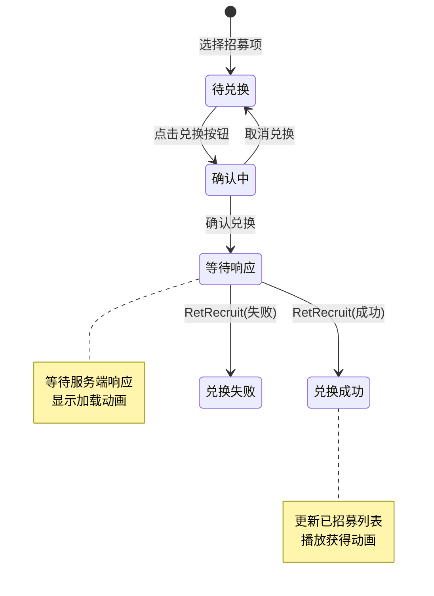
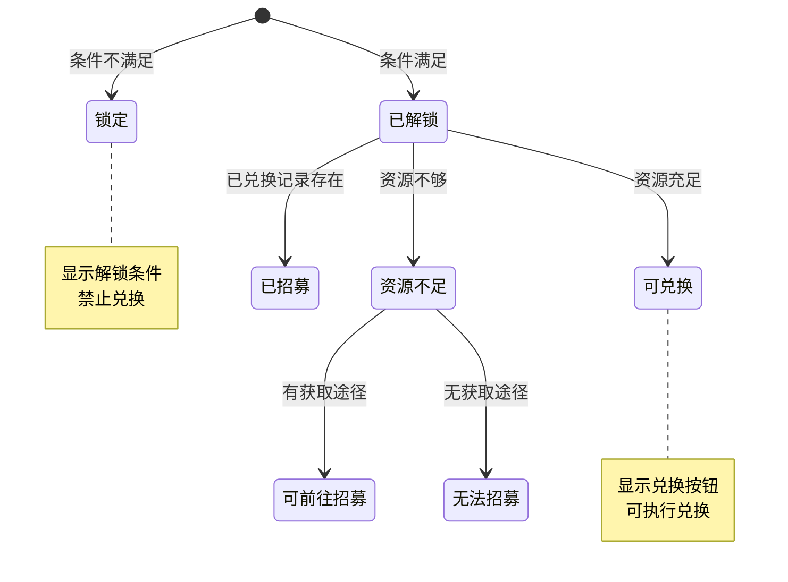
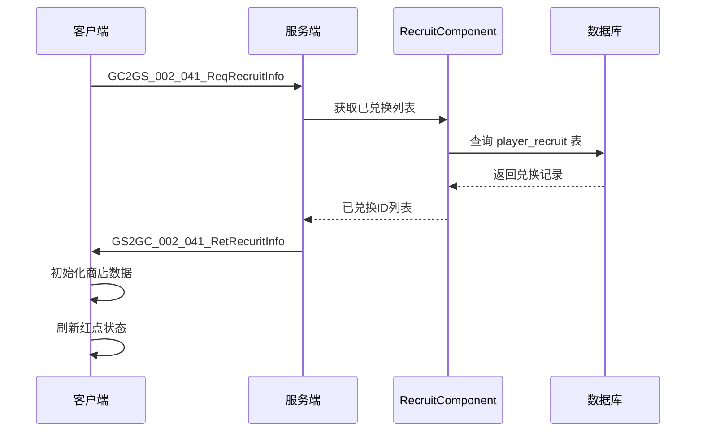
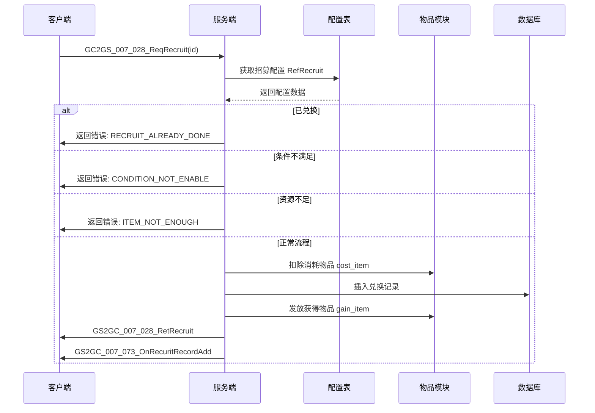
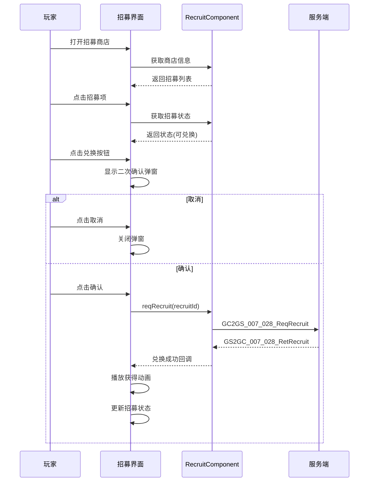
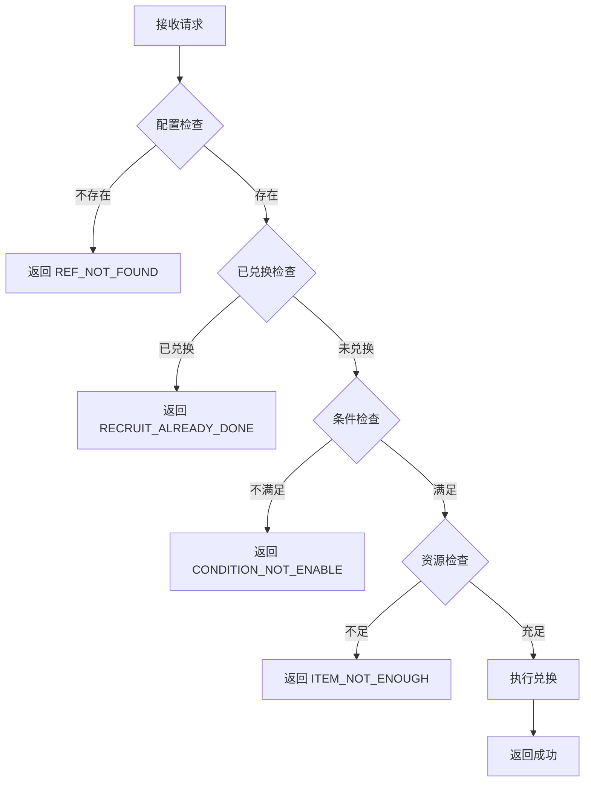

# 招募模块协议文档

**模块名称**: Recruit（招募模块）
**模块编号**: p002 / p007
**文档版本**: 2.0
**更新日期**: 2026-04-11

## 协议模块编号: p002 / p007

招募系统主要使用 `InitOp (p002)` 进行初始化数据同步，使用 `CommOp (p007)` 进行招募操作。

**源码路径**:
- 客户端请求: `ClientProtocol/GC2GS/p002_InitOp/`, `ClientProtocol/GC2GS/p007_CommOp/`
- 服务端响应: `ClientProtocol/GS2GC/p002_InitOp/`, `ClientProtocol/GS2GC/p007_CommOp/`

---

## 一、协议总览

### 1.1 协议分类

| 分类 | 主序号 | 说明 |
|------|--------|------|
| 初始化协议 | 2 | 招募初始化数据同步 |
| 招募操作协议 | 7 | 招募兑换请求/响应 |

### 1.2 协议架构图



---

## 二、请求协议 (GC2GS)

### 2.1 初始化协议

#### GC2GS_002_041_ReqRecruitInfo - 请求招募信息

**功能说明**: 请求玩家招募初始化信息，获取已兑换的招募项ID列表

**协议编号**: 主序号 2，子序号 41

**请求参数**: 无

**请求示例**:
```csharp
// 发送初始化请求
NPGSClientListener.sendMsg(GSWriter_002_InitOp.make_002_041_ReqRecruitInfo());
```

**服务端处理流程**:
1. 获取玩家招募组件
2. 查询数据库中已兑换记录
3. 返回已兑换ID列表

**响应**: `GS2GC_002_041_RetRecuritInfo`

---

### 2.2 招募操作协议

#### GC2GS_007_028_ReqRecruit - 请求招募兑换

**功能说明**: 请求兑换指定招募项

**协议编号**: 主序号 7，子序号 28

| 字段名 | 类型 | 说明 | 必填 | 校验规则 |
|--------|------|------|------|----------|
| id | long | 招募ID | 是 | > 0 |

**请求示例**:
```csharp
// 发送招募请求
NPGSClientListener.sendRequest(
    GSWriter_007_CommOp.make_028_ReqRecruit(recruitId),
    new CommonRequestCallbackProtocolDealer<GS2GC_007_028_RetRecruit>(
        (msg) => {
            // 招募成功
            Debug.Log("招募成功");
            _refreshWnd();
        },
        (error) => {
            // 招募失败
            Debug.LogError($"招募失败: {error}");
        }
    )
);
```

**服务端处理流程**:
1. 获取招募配置 `RefRecruit`
2. 检查是否已兑换
3. 检查兑换条件是否满足
4. 扣除消耗物品
5. 记录兑换数据到数据库
6. 发放获得物品
7. 推送兑换成功通知

**响应**: `GS2GC_007_028_RetRecruit`

---

## 三、响应协议 (GS2GC)

### 3.1 初始化响应

#### GS2GC_002_041_RetRecuritInfo - 返回招募信息

**功能说明**: 返回玩家招募初始化信息

**协议编号**: 主序号 2，子序号 41

| 字段名 | 类型 | 说明 |
|--------|------|------|
| hadRecuritIdList | List\<long\> | 已兑换招募ID列表 |

**响应示例**:
```csharp
// 处理初始化响应
private void OnRecruitInfoResult(GS2GC_002_041_RetRecuritInfo _proto)
{
    List<long> recruitedIds = _proto.getHadRecuritIdList();

    // 更新已招募列表
    foreach (long recruitId in recruitedIds)
    {
        RecruitShopInfo shopInfo = GetShopInfoByRecruitId(recruitId);
        shopInfo?.addRecruitId(recruitId);
    }

    // 刷新红点
    _refreshAllRedTip();
}
```

---

### 3.2 操作响应

#### GS2GC_007_028_RetRecruit - 返回招募结果

**功能说明**: 返回招募兑换结果

**协议编号**: 主序号 7，子序号 28

**响应字段**: 无（仅表示操作成功）

**响应示例**:
```csharp
// 处理招募结果
private void OnRecruitResult(GS2GC_007_028_RetRecruit _proto)
{
    // 招募成功，刷新界面
    _refreshWnd();

    // 发送成功消息
    WinMsg.SendMsg(WinMsgType.ON_RECRUIT_EXCHANGE_SUCC);
}
```

---

### 3.3 推送通知协议

#### GS2GC_007_073_OnRecuritRecordAdd - 新增兑换记录通知

**功能说明**: 通知客户端新增了一条兑换记录

**协议编号**: 主序号 7，子序号 73

| 字段名 | 类型 | 说明 |
|--------|------|------|
| recuritId | long | 新兑换的招募ID |

**响应示例**:
```csharp
// 处理新增兑换记录推送
private void OnRecruitRecordAdd(GS2GC_007_073_OnRecuritRecordAdd _proto)
{
    long recruitId = _proto.getRecuritId();

    // 更新已招募列表
    RecruitShopInfo shopInfo = GetShopInfoByRecruitId(recruitId);
    if (shopInfo != null)
    {
        shopInfo.addRecruitId(recruitId);
    }

    // 刷新界面
    _refreshWnd();
}
```

---

## 四、协议状态机图

### 4.1 招募初始化状态机



### 4.2 招募兑换状态机



### 4.3 招募项状态机



---

## 五、协议交互流程图

### 5.1 招募初始化流程



### 5.2 招募兑换流程



### 5.3 完整兑换流程（含UI交互）



---

## 六、错误码定义

### 6.1 招募模块错误码

| 错误码 | 常量名 | 说明 | 触发场景 |
|--------|--------|------|----------|
| REF_NOT_FOUND | 配置不存在 | 招募配置ID无效 | 招募ID不存在 |
| RECRUIT_ALREADY_DONE | 已兑换过 | 该招募项已被兑换 | 重复兑换请求 |
| CONDITION_NOT_ENABLE | 条件不满足 | 玩家未满足兑换条件 | 条件检查失败 |
| ITEM_NOT_ENOUGH | 物品不足 | 消耗物品数量不足 | 资源检查失败 |

### 6.2 错误处理流程



### 6.3 客户端错误处理

```csharp
// 请求招募时的错误处理
NPPlayer.instance.recruitComp.reqRecruit(recruitId, (msg) =>
{
    // 成功处理
    Debug.Log("招募成功");
    _refreshWnd();
}, () =>
{
    // 失败处理
    // 错误提示已在组件内通过 NPGUIAddSceneCenterTip 显示
});
```

---

## 七、协议数据结构

### 7.1 协议类定义

#### GC2GS_007_028_ReqRecruit

```csharp
public class GC2GS_007_028_ReqRecruit : _IALProtocolStructure
{
    private long id;  // 兑换id

    public byte getMainOrder() { return (byte)7; }
    public byte getSubOrder() { return (byte)28; }

    public long getId() { return id; }
    public void setId(long _id) { id = _id; }
}
```

#### GS2GC_002_041_RetRecuritInfo

```csharp
public class GS2GC_002_041_RetRecuritInfo : _IALProtocolStructure
{
    private List<long> hadRecuritIdList;  // 已兑换id列表

    public byte getMainOrder() { return (byte)2; }
    public byte getSubOrder() { return (byte)41; }

    public List<long> getHadRecuritIdList() { return hadRecuritIdList; }
}
```

#### GS2GC_007_073_OnRecuritRecordAdd

```csharp
public class GS2GC_007_073_OnRecuritRecordAdd : _IALProtocolStructure
{
    private long recuritId;  // 招募id

    public byte getMainOrder() { return (byte)7; }
    public byte getSubOrder() { return (byte)73; }

    public long getRecuritId() { return recuritId; }
}
```

---

## 八、协议发送示例

### 8.1 客户端发送请求

```csharp
// 发送初始化请求
NPGSClientListener.sendMsg(GSWriter_002_InitOp.make_002_041_ReqRecruitInfo());

// 发送招募请求
NPGSClientListener.sendRequest(
    GSWriter_007_CommOp.make_028_ReqRecruit(recruitId),
    new CommonRequestCallbackProtocolDealer<GS2GC_007_028_RetRecruit>(
        (msg) => {
            // 招募成功
            Debug.Log("招募成功");
        },
        (error) => {
            // 招募失败
            Debug.LogError($"招募失败: {error}");
        }
    )
);
```

### 8.2 服务端发送推送

```java
// 推送兑换记录新增
userData.sendMsgToGC(US2GCWriter_007_CommOp.make_073_OnRecuritRecordAdd(recruitId));

// 返回招募结果
_committer.commitSucRes(US2GCWriter_007_CommOp.make_028_RetRecruit());
```

---

## 九、协议汇总表

### 9.1 请求协议

| 协议名 | 主序号 | 子序号 | 说明 |
|--------|--------|--------|------|
| GC2GS_002_041_ReqRecruitInfo | 2 | 41 | 请求招募信息 |
| GC2GS_007_028_ReqRecruit | 7 | 28 | 请求招募兑换 |

### 9.2 响应协议

| 协议名 | 主序号 | 子序号 | 类型 | 说明 |
|--------|--------|--------|------|------|
| GS2GC_002_041_RetRecuritInfo | 2 | 41 | 响应 | 返回招募信息 |
| GS2GC_007_028_RetRecruit | 7 | 28 | 响应 | 返回招募结果 |
| GS2GC_007_073_OnRecuritRecordAdd | 7 | 73 | 推送 | 新增兑换记录通知 |

---

## 十、协议注册示例

### 10.1 客户端协议注册

```csharp
// 协议处理器注册
public void RegisterProtocols()
{
    // 响应协议监听
    networkManager.AddListener<GS2GC_002_041_RetRecuritInfo>(OnRecruitInfoResult);
    networkManager.AddListener<GS2GC_007_028_RetRecruit>(OnRecruitResult);
    networkManager.AddListener<GS2GC_007_073_OnRecuritRecordAdd>(OnRecruitRecordAdd);
}
```

### 10.2 客户端消息处理示例

```csharp
/// <summary>
/// 处理招募信息结果
/// </summary>
private void OnRecruitInfoResult(GS2GC_002_041_RetRecuritInfo _proto)
{
    List<long> recruitedIds = _proto.getHadRecuritIdList();
    if (recruitedIds == null)
        recruitedIds = new List<long>();

    // 更新已招募列表
    foreach (long recruitId in recruitedIds)
    {
        RecruitShopInfo shopInfo = GetShopInfoByRecruitId(recruitId);
        shopInfo?.addRecruitId(recruitId);
    }

    // 刷新红点
    _refreshAllRedTip();

    // 标记初始化完成
    setInited();
}

/// <summary>
/// 处理招募结果
/// </summary>
private void OnRecruitResult(GS2GC_007_028_RetRecruit _proto)
{
    // 招募成功，刷新界面
    _refreshWnd();

    // 发送成功消息
    WinMsg.SendMsg(WinMsgType.ON_RECRUIT_EXCHANGE_SUCC);
}

/// <summary>
/// 处理新增兑换记录推送
/// </summary>
private void OnRecruitRecordAdd(GS2GC_007_073_OnRecuritRecordAdd _proto)
{
    long recruitId = _proto.getRecuritId();

    // 更新已招募列表
    RecruitShopInfo shopInfo = GetShopInfoByRecruitId(recruitId);
    if (shopInfo != null)
    {
        shopInfo.addRecruitId(recruitId);
    }

    // 刷新界面
    _refreshWnd();
}
```

---

## 十一、服务端协议处理器实现

### 11.1 初始化协议处理器

```java
/**
 * 处理招募初始化请求
 */
@Override
protected void _dealMessage(_ANPUSUserBasicMsgItem _committer, GC2GS_002_041_ReqRecruitInfo _msg)
{
    NPUSUserData userData = _committer.getUserData();
    if (userData == null)
        return;

    // 获取已兑换列表
    List<Long> recruitList = userData.getRecruitComponent().getRecruitList();

    // 返回初始化信息
    _committer.commitSucRes(US2GCWriter_002_InitOp.make_041_RetRecuritInfo(recruitList));
}
```

### 11.2 招募兑换处理器

```java
/**
 * 处理招募兑换请求
 */
@Override
protected void _dealMessage(_ANPUSUserBasicMsgItem _committer, GC2GS_007_028_ReqRecruit _msg)
{
    NPUSUserData userData = _committer.getUserData();
    if (userData == null)
        return;

    // 创建上下文
    NPPlayerContext context = NPPlayerContext.createNew(ENPGameEvent.RECRUIT);

    // 执行招募
    Result result = userData.getRecruitComponent().tryRecruit(_msg.getId(), context);

    if (!result.isSucc())
    {
        _committer.commitFailRes(result.getCode());
        return;
    }

    // 发送物品变化通知
    userData.sendMsgToGC(context.getCollector().toProto());

    // 返回招募结果
    _committer.commitSucRes(US2GCWriter_007_CommOp.make_028_RetRecruit());
}
```

---

## 十二、协议调试技巧

### 12.1 协议日志打印

```csharp
// 客户端协议日志
public void LogProtocol<T>(T proto, bool isSend) where T : _IALProtocolStructure
{
    string direction = isSend ? "SEND" : "RECV";
    Debug.Log($"[{direction}] {proto.GetType().Name}: {JsonUtility.ToJson(proto)}");
}

// 使用示例
NetworkManager.OnProtocolReceived += (proto) => LogProtocol(proto, false);
NetworkManager.OnProtocolSent += (proto) => LogProtocol(proto, true);
```

### 12.2 协议模拟测试

```csharp
// 模拟招募请求
public void TestRecruitRequest(long recruitId)
{
    GC2GS_007_028_ReqRecruit req = new GC2GS_007_028_ReqRecruit();
    req.setId(recruitId);
    NetworkManager.Send(req);
}
```

---

## 十三、协议字段速查表

### 13.1 请求协议字段速查

| 协议名 | 必填字段 | 可选字段 | 备注 |
|--------|----------|----------|------|
| ReqRecruitInfo | - | - | 无参数请求 |
| ReqRecruit | id | - | 招募ID必填 |

### 13.2 响应协议字段速查

| 协议名 | 核心字段 | 说明 |
|--------|----------|------|
| RetRecuritInfo | hadRecuritIdList | 已兑换ID列表 |
| RetRecruit | - | 仅表示成功 |
| OnRecuritRecordAdd | recuritId | 新兑换的招募ID |

---

## 十四、协议完整示例代码

### 14.1 完整招募流程

```csharp
/// <summary>
/// 招募管理器 - 完整招募流程
/// </summary>
public class RecruitManager : MonoBehaviour
{
    private bool isInited = false;

    /// <summary>
    /// 初始化招募模块
    /// </summary>
    public void InitRecruit()
    {
        // 检查是否已初始化
        if (isInited)
        {
            Debug.LogWarning("招募模块已初始化");
            return;
        }

        // 发送初始化请求
        NPGSClientListener.sendMsg(GSWriter_002_InitOp.make_002_041_ReqRecruitInfo());
    }

    /// <summary>
    /// 执行招募
    /// </summary>
    public void DoRecruit(long recruitId)
    {
        // 1. 获取招募配置
        RecruitRefObj recruitRef = GRefdataCoreMgr.instance.recruitRefCore.getRef(recruitId);
        if (recruitRef == null)
        {
            Debug.LogError("招募配置不存在");
            return;
        }

        // 2. 获取招募项信息
        _ARecruitItemInfo itemInfo = _ARecruitItemInfo.getRecruitItemInfo(recruitRef);

        // 3. 检查招募状态
        ERecruitState state = NPPlayer.instance.recruitComponent.getRecruitState(itemInfo);

        switch (state)
        {
            case ERecruitState.LOCK:
                // 显示解锁条件
                ShowLockTip(recruitRef);
                break;

            case ERecruitState.RECRUITED:
                // 已招募
                ShowAlreadyRecruitedTip();
                break;

            case ERecruitState.CAN_EXCHANGE_RECRUIT:
                // 可以招募，显示二次确认
                ShowConfirmDialog(recruitRef, () => {
                    SendRecruitRequest(recruitId);
                });
                break;

            case ERecruitState.CAN_GO_TO_RECRUIT:
                // 前往获取资源
                recruitRef.can_goto_recruit_goto_effect?.dealEffect();
                break;

            case ERecruitState.UNLOCK_CANNOT_RECRUIT:
                // 资源不足，显示获取途径
                ShowGetResourceTip(recruitRef);
                break;
        }
    }

    /// <summary>
    /// 发送招募请求
    /// </summary>
    private void SendRecruitRequest(long recruitId)
    {
        NPGSClientListener.sendRequest(
            GSWriter_007_CommOp.make_028_ReqRecruit(recruitId),
            new CommonRequestCallbackProtocolDealer<GS2GC_007_028_RetRecruit>(
                (msg) => {
                    // 招募成功
                    OnRecruitSuccess(recruitId);
                },
                (error) => {
                    // 招募失败
                    OnRecruitFailed(error);
                }
            )
        );
    }

    /// <summary>
    /// 招募成功处理
    /// </summary>
    private void OnRecruitSuccess(long recruitId)
    {
        // 播放获得动画
        RecruitRefObj recruitRef = GRefdataCoreMgr.instance.recruitRefCore.getRef(recruitId);
        if (recruitRef != null)
        {
            PlayRewardAnimation(recruitRef.gain_item);
        }

        // 刷新界面
        UIManager.RefreshWindow<GGUIWndRecruitShop>();
    }

    /// <summary>
    /// 招募失败处理
    /// </summary>
    private void OnRecruitFailed(int errorCode)
    {
        string errorMsg = GetErrorMessage(errorCode);
        UIManager.ShowToast(errorMsg);
    }

    /// <summary>
    /// 获取错误消息
    /// </summary>
    private string GetErrorMessage(int errorCode)
    {
        switch (errorCode)
        {
            case CommErr.REF_NOT_FOUND:
                return "招募配置不存在";
            case PlayerErr.RECRUIT_ALREADY_DONE:
                return "已兑换过";
            case CommErr.CONDITION_NOT_ENABLE:
                return "条件不满足";
            case CommErr.ITEM_NOT_ENOUGH:
                return "资源不足";
            default:
                return $"招募失败({errorCode})";
        }
    }
}
```

---

## 十五、协议测试用例

### 15.1 单元测试示例

```csharp
/// <summary>
/// 招募协议单元测试
/// </summary>
public class RecruitProtocolTest
{
    [Test]
    public void TestRecruitRequest()
    {
        // 准备数据
        long recruitId = 10001;

        // 构建请求
        GC2GS_007_028_ReqRecruit req = new GC2GS_007_028_ReqRecruit();
        req.setId(recruitId);

        // 验证字段
        Assert.AreEqual(recruitId, req.getId());
    }

    [Test]
    public void TestRecruitInfoResponse()
    {
        // 模拟响应数据
        List<long> recruitedIds = new List<long> { 10001, 10002, 20001 };

        // 验证数据
        Assert.AreEqual(3, recruitedIds.Count);
        Assert.Contains(10001L, recruitedIds);
    }
}
```

### 15.2 集成测试示例

```csharp
/// <summary>
/// 招募集成测试
/// </summary>
public class RecruitIntegrationTest : MonoBehaviour
{
    private bool initCompleted = false;
    private bool recruitCompleted = false;

    [UnityTest]
    public IEnumerator TestRecruitFlow()
    {
        // 注册监听
        NetworkManager.AddListener<GS2GC_002_041_RetRecuritInfo>(OnInitResult);
        NetworkManager.AddListener<GS2GC_007_028_RetRecruit>(OnRecruitResult);

        // 发送初始化请求
        RecruitManager.Instance.InitRecruit();

        // 等待初始化完成
        float timeout = 10f;
        while (!initCompleted && timeout > 0)
        {
            timeout -= Time.deltaTime;
            yield return null;
        }

        Assert.IsTrue(initCompleted, "初始化超时");

        // 发送招募请求
        RecruitManager.Instance.DoRecruit(10001);

        // 等待招募完成
        timeout = 5f;
        while (!recruitCompleted && timeout > 0)
        {
            timeout -= Time.deltaTime;
            yield return null;
        }

        Assert.IsTrue(recruitCompleted, "招募超时");
    }

    private void OnInitResult(GS2GC_002_041_RetRecuritInfo _proto)
    {
        initCompleted = true;
        Assert.IsNotNull(_proto.getHadRecuritIdList());
    }

    private void OnRecruitResult(GS2GC_007_028_RetRecruit _proto)
    {
        recruitCompleted = true;
    }
}
```

---

*文档生成时间: 2026-04-11*
*源码参考路径: `/game_server/ClientProtocol/GC2GS/p002_InitOp/`*
*源码参考路径: `/game_server/ClientProtocol/GC2GS/p007_CommOp/`*