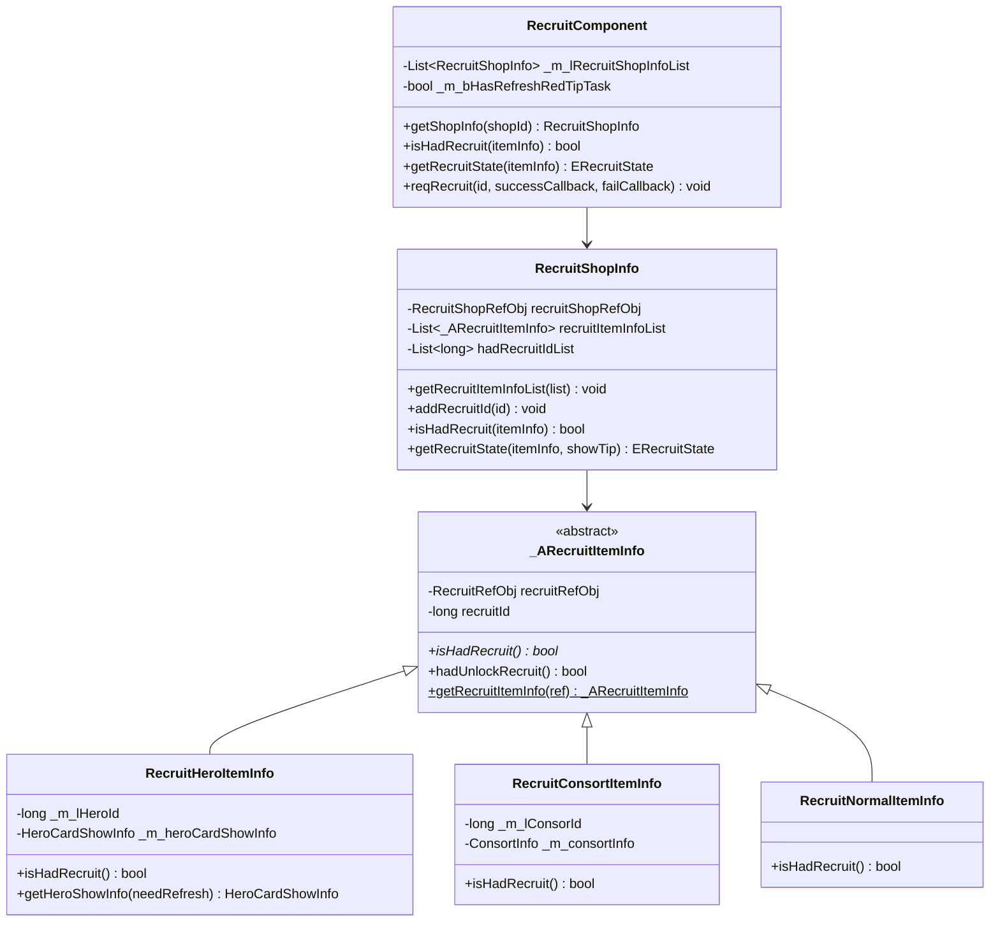
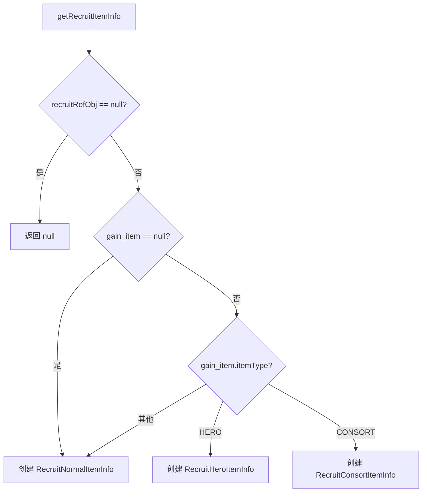
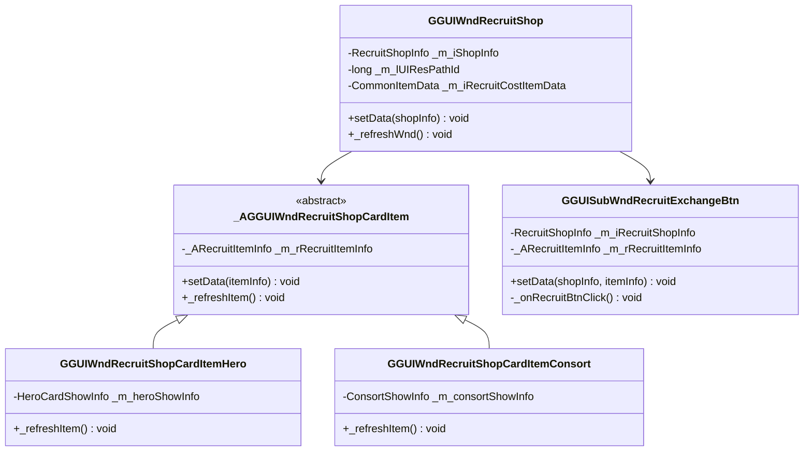
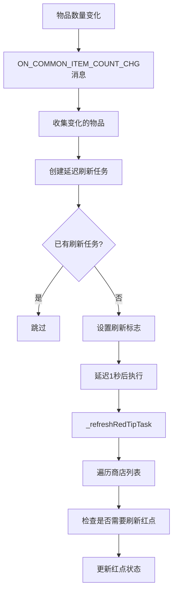
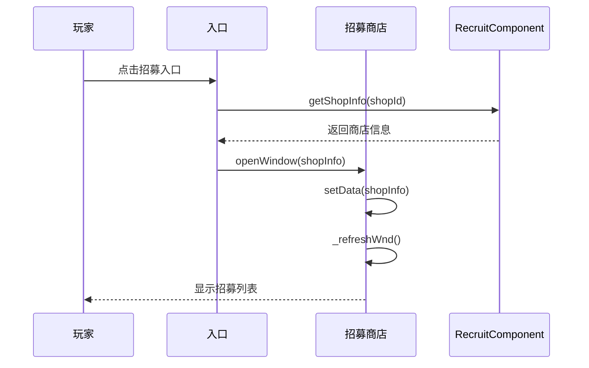
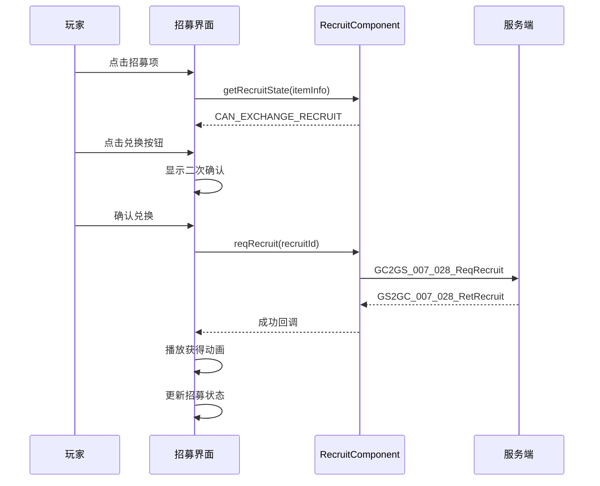

# 招募系统 - 客户端开发

**模块名称**: Recruit（招募模块）
**模块编号**: p002 / p007
**文档版本**: 2.0
**更新日期**: 2026-04-11

---

## 一、组件结构

### 1.1 目录结构

```
GameComponent/Recruit/
├── RecruitComponent.cs          # 招募组件（主入口）
├── RecruitShopInfo.cs           # 招募商店信息
└── RecruitItem/
    ├── _ARecruitItemInfo.cs     # 招募项基类（抽象类）
    ├── RecruitNormalItemInfo.cs # 普通道具招募项
    ├── RecruitHeroItemInfo.cs   # 英雄招募项
    └── RecruitConsortItemInfo.cs # 伴侣招募项
```

### 1.2 类图



---

## 二、核心类详解

### 2.1 RecruitComponent - 招募组件

**继承关系**: `RecruitComponent : _ANPBasicPlayerComponent`

**组件类型**: `ENPPlayerCompType.RECRUIT`

**主要职责**:
- 管理所有招募商店信息
- 处理招募协议请求/响应
- 管理红点刷新

**核心属性**:

| 属性名 | 类型 | 说明 |
|--------|------|------|
| isMustInit | bool | 是否必须初始化（true） |
| canPreInit | bool | 是否可预初始化（true） |
| _m_lRecruitShopInfoList | List\<RecruitShopInfo\> | 商店信息列表 |

**核心方法**:

| 方法名 | 参数 | 返回值 | 说明 |
|--------|------|--------|------|
| getShopInfo | shopId: long | RecruitShopInfo | 获取商店信息 |
| getShopInfoWithCreate | shopId: long | RecruitShopInfo | 获取或创建商店信息 |
| isHadRecruit | itemInfo: _ARecruitItemInfo | bool | 是否已招募 |
| getRecruitState | itemInfo: _ARecruitItemInfo | ERecruitState | 获取招募状态 |
| reqRecruit | id: long, doneCallback, failCallback | void | 请求招募 |

**初始化代码**:

```csharp
protected override void _dealInit()
{
    if (_m_lRecruitShopInfoList == null)
        _m_lRecruitShopInfoList = new List<RecruitShopInfo>();
    _m_lRecruitShopInfoList.Clear();

    // 遍历配置创建商店信息
    foreach (var shopRefObj in GRefdataCoreMgr.instance.recruitShopRefCore.refList)
    {
        if (shopRefObj != null)
            _m_lRecruitShopInfoList.Add(new RecruitShopInfo(shopRefObj));
    }

    // 监听物品变化消息
    WinMsg.RegisterMsg(WinMsgType.ON_COMMON_ITEM_COUNT_CHG, _onCommonItemChg);
}
```

**代码示例**:

```csharp
// 获取招募组件
RecruitComponent recruitComp = NPPlayer.instance.recruitComponent;

// 获取商店信息
RecruitShopInfo shopInfo = recruitComp.getShopInfo(shopId);

// 检查是否已招募
bool isRecruited = recruitComp.isHadRecruit(recruitItemInfo);

// 获取招募状态
ERecruitState state = recruitComp.getRecruitState(recruitItemInfo);

// 请求招募
recruitComp.reqRecruit(recruitId, (msg) => {
    Debug.Log("招募成功");
}, () => {
    Debug.Log("招募失败");
});
```

---

### 2.2 RecruitShopInfo - 招募商店信息

**主要职责**:
- 管理商店下的所有招募项
- 判断招募状态
- 管理已招募ID列表

**核心属性**:

| 属性名 | 类型 | 说明 |
|--------|------|------|
| recruitShopRefObj | RecruitShopRefObj | 商店配置引用 |
| recruitItemInfoList | List\<_ARecruitItemInfo\> | 招募项列表 |
| shopId | long | 商店ID |
| hadRecruitIdList | List\<long\> | 已招募ID列表 |
| hadRecruitCount | int | 已招募数量 |

**核心方法**:

| 方法名 | 参数 | 返回值 | 说明 |
|--------|------|--------|------|
| getRecruitItemInfoList | list: List\<_ARecruitItemInfo\> | void | 获取招募项列表 |
| addRecruitId | id: long | void | 添加已招募ID |
| isHadRecruit | itemInfo: _ARecruitItemInfo | bool | 是否已招募 |
| getRecruitState | itemInfo: _ARecruitItemInfo, showTip: bool | ERecruitState | 获取招募状态 |

**状态判断代码**:

```csharp
public ERecruitState getRecruitState(_ARecruitItemInfo _recruitItemInfo, bool _needShowTip)
{
    if (_recruitItemInfo == null || _recruitItemInfo.recruitRefObj == null)
        return ERecruitState.NONE;

    // 1. 检查解锁条件
    if (!_recruitItemInfo.hadUnlockRecruit())
    {
        if (_needShowTip)
            NPGUIAddSceneCenterTip.instance.showTextInfo(
                TextTranslate.instance.getLanguage(
                    _recruitItemInfo.recruitRefObj.condition_desc,
                    _recruitItemInfo.recruitRefObj.condition_desc_args_list
                )
            );
        return ERecruitState.LOCK;
    }

    // 2. 检查是否已招募
    if (isHadRecruit(_recruitItemInfo))
        return ERecruitState.RECRUITED;

    // 3. 检查是否有前往招募条件
    if (_recruitItemInfo.recruitRefObj.canGotoRecruit())
        return ERecruitState.CAN_GO_TO_RECRUIT;

    // 4. 检查资源是否足够
    if (!GCommon.isItemEnough(_recruitItemInfo.recruitRefObj.cost_item, _needShowTip))
        return ERecruitState.UNLOCK_CANNOT_RECRUIT;

    // 5. 可兑换
    return ERecruitState.CAN_EXCHANGE_RECRUIT;
}
```

**代码示例**:

```csharp
// 获取商店下所有招募项
List<_ARecruitItemInfo> itemList = new List<_ARecruitItemInfo>();
shopInfo.getRecruitItemInfoList(itemList);

// 遍历招募项
foreach (var item in itemList)
{
    ERecruitState state = shopInfo.getRecruitState(item, false);
    if (state == ERecruitState.CAN_EXCHANGE_RECRUIT)
    {
        // 可以招募
    }
}
```

---

### 2.3 _ARecruitItemInfo - 招募项基类

**继承关系**: `_ARecruitItemInfo` (抽象类)

**主要职责**:
- 定义招募项通用接口
- 工厂方法创建具体类型

**核心属性**:

| 属性名 | 类型 | 说明 |
|--------|------|------|
| recruitRefObj | RecruitRefObj | 招募配置引用 |
| recruitId | long | 招募ID |
| recruitItemType | ERecruitItemType | 招募项类型（抽象属性） |

**核心方法**:

| 方法名 | 参数 | 返回值 | 说明 |
|--------|------|--------|------|
| isHadRecruit | 无 | bool | 是否已招募（抽象方法） |
| hadUnlockRecruit | 无 | bool | 是否解锁招募 |
| getRecruitItemInfo | recruitRefObj: RecruitRefObj | _ARecruitItemInfo | 工厂方法 |

**工厂方法逻辑**:



```csharp
public static _ARecruitItemInfo getRecruitItemInfo(RecruitRefObj _recruitRefObj)
{
    if (_recruitRefObj == null)
        return null;

    if (_recruitRefObj.gain_item == null)
        return new RecruitNormalItemInfo(_recruitRefObj);

    switch (_recruitRefObj.gain_item.getItemType())
    {
        case ENPItemType.HERO:
            return new RecruitHeroItemInfo(_recruitRefObj);
        case ENPItemType.CONSORT:
            return new RecruitConsortItemInfo(_recruitRefObj);
        default:
            return new RecruitNormalItemInfo(_recruitRefObj);
    }
}
```

---

### 2.4 招募项子类

#### RecruitHeroItemInfo - 英雄招募项

```csharp
public class RecruitHeroItemInfo : _ARecruitItemInfo
{
    private long _m_lHeroId;                    // 英雄ID
    private HeroCardShowInfo _m_heroCardShowInfo; // 英雄展示信息

    public override ERecruitItemType recruitItemType { get { return ERecruitItemType.HERO; } }

    // 是否已招募：检查玩家是否拥有该英雄
    public override bool isHadRecruit()
    {
        return NPPlayer.instance.heroComponent.getHeroInfo(_m_lHeroId) != null;
    }

    // 获取英雄展示信息
    public HeroCardShowInfo getHeroShowInfo(bool _needRefreshData);
}
```

#### RecruitConsortItemInfo - 伴侣招募项

```csharp
public class RecruitConsortItemInfo : _ARecruitItemInfo
{
    private long _m_lConsorId;      // 伴侣ID
    private ConsortInfo _m_consortInfo; // 伴侣信息

    public override ERecruitItemType recruitItemType { get { return ERecruitItemType.CONSORT; } }

    // 是否已招募：检查伴侣是否已解锁
    public override bool isHadRecruit()
    {
        return _m_consortInfo != null &&
               _m_consortInfo.unlockType == EGameCommonUnlockType.UNLOCK;
    }
}
```

#### RecruitNormalItemInfo - 普通道具招募项

```csharp
public class RecruitNormalItemInfo : _ARecruitItemInfo
{
    public override ERecruitItemType recruitItemType { get { return ERecruitItemType.NORMAL; } }

    // 是否已招募：检查道具数量是否大于0
    public override bool isHadRecruit()
    {
        return _m_rRecruitRefObj != null &&
               _m_rRecruitRefObj.gain_item != null &&
               GCommon.getItemCount(_m_rRecruitRefObj.gain_item.item) > 0;
    }
}
```

---

## 三、UI 窗口结构

### 3.1 窗口类层次

```
GGUIWndRecruitMain              # 招募主界面
├── GGUIWndRecruitShop          # 招募商店界面
│   ├── GGUIWndRecruitShopCardItemContainer  # 卡片容器
│   │   └── _AGGUIWndRecruitShopCardItem     # 卡片项基类
│   │       ├── GGUIWndRecruitShopCardItemHero    # 英雄卡片
│   │       └── GGUIWndRecruitShopCardItemConsort # 伴侣卡片
│   └── GGUIWndRecruitShopIconItemContainer  # 图标容器
│       └── _AGGUIWndRecruitShopIconItem     # 图标项基类
│           ├── GGUIWndRecruitShopIconItem_Hero   # 英雄图标
│           ├── GGUIWndRecruitShopIconItem_Consort # 伴侣图标
│           └── GGUIWndRecruitShopIconItem_Normal # 普通道具图标
└── GGUISubWndRecruitExchangeBtn           # 兑换按钮组件
```

### 3.2 UI 类图



### 3.3 GGUIWndRecruitShop - 招募商店界面

```csharp
public class GGUIWndRecruitShop : _ANPGGUIBasicWnd<GGUIMonoRecruitShop>
{
    private RecruitShopInfo _m_iShopInfo;        // 商店信息
    private long _m_lUIResPathId;                // UI资源路径ID
    private CommonItemData _m_iRecruitCostItemData; // 消耗物品数据

    // 设置数据
    public void setData(RecruitShopInfo _shopInfo, long _uiResPathId)
    {
        _m_iShopInfo = _shopInfo;
        _m_lUIResPathId = _uiResPathId;
        _refreshWnd();
    }

    // 刷新窗口
    private void _refreshWnd()
    {
        _refreshRecruitCostItem();
        _m_wRecruitShopCardItemContainer.showWnd();
        _m_wRecruitShopCardItemContainer.setData(_m_iShopInfo, _m_iShopInfo.recruitShopRefObj.recruitRefObjList);
    }
}
```

### 3.4 GGUISubWndRecruitExchangeBtn - 兑换按钮

```csharp
public class GGUISubWndRecruitExchangeBtn : _ATALBasicUISubWnd<GGUISubMonoRecruitExchangeBtn>
{
    protected RecruitShopInfo _m_iRecruitShopInfo;
    protected _ARecruitItemInfo _m_rRecruitItemInfo;

    // 设置数据
    public void setData(RecruitShopInfo _recruitShopInfo, _ARecruitItemInfo _recruitItemInfo);

    // 点击招募按钮
    protected virtual void _onRecruitBtnClick(GameObject _go)
    {
        ERecruitState recruitState = _m_iRecruitShopInfo?.getRecruitState(_m_rRecruitItemInfo, true);
        if (recruitState == ERecruitState.CAN_EXCHANGE_RECRUIT)
        {
            // 显示二次确认弹窗
            NPMesMgr.instance.showCostItemMes(_m_rRecruitItemInfo.recruitRefObj.cost_item, () =>
            {
                NPPlayer.instance.recruitComp.reqRecruit(_m_rRecruitItemInfo.recruitId, (_msg) =>
                {
                    // 招募成功
                }, null);
            }, null, TransKeyConst.recruit_exchangeSecondCheckWndTitle_none,
               _m_rRecruitItemInfo.recruitRefObj.exchange_second_check_content);
        }
    }
}
```

---

## 四、红点系统

### 4.1 红点刷新机制



### 4.2 红点刷新代码

```csharp
// 监听物品变化消息
WinMsg.RegisterMsg(WinMsgType.ON_COMMON_ITEM_COUNT_CHG, _onCommonItemChg);

// 物品变化时创建延迟刷新任务
private void _onCommonItemChg(params object[] _objs)
{
    // 收集变化的物品
    chgCommonItem.itemType = itemType;
    chgCommonItem.itemId = subId;
    _m_lChgItemList.Add(chgCommonItem);

    // 创建延迟刷新任务
    _createRefreshRedTipTask();
}

// 延迟刷新红点（避免频繁刷新）
private void _createRefreshRedTipTask()
{
    if (_m_bHasRefreshRedTipTask)
        return;

    _m_bHasRefreshRedTipTask = true;
    ALCommonTaskController.CommonActionAddMonoTask(() =>
    {
        _m_bHasRefreshRedTipTask = false;
        _refreshRedTipTask();
    }, 1f); // 延迟1秒刷新
}
```

### 4.3 红点判断逻辑

```csharp
private void _refreshRedTipTask()
{
    foreach (var recruitShopInfo in _m_lRecruitShopInfoList)
    {
        bool hasUnRecruitItem = false;

        foreach (var recruitItemInfo in recruitShopInfo.recruitItemInfoList)
        {
            // 跳过不在变化列表中的物品
            if (!_m_lChgItemList.Contains(recruitItemInfo.recruitRefObj.cost_item.item))
                continue;

            // 跳过已招募的
            if (isHadRecruit(recruitItemInfo))
                continue;

            // 检查资源是否足够
            if (GCommon.isItemEnough(recruitItemInfo.recruitRefObj.cost_item, false))
            {
                hasUnRecruitItem = true;
                break;
            }
        }

        // 更新红点
        RedTipMgr.instance.setCountByRefRedTipId(
            recruitShopInfo.recruitShopRefObj.red_tip_id,
            hasUnRecruitItem ? 1 : 0
        );
    }
}
```

---

## 五、消息系统

### 5.1 消息类型

| 消息类型 | 说明 | 参数 |
|----------|------|------|
| ON_COMMON_ITEM_COUNT_CHG | 物品数量变化 | itemType, subId |
| ON_RECRUIT_EXCHANGE_SUCC | 招募兑换成功 | recruitId |
| ON_BAG_ITEM_ADD | 背包物品增加 | BagItem |
| ON_BAG_ITEM_REMOVE | 背包物品移除 | BagItem |
| ON_BAG_ITEM_UPDATE | 背包物品更新 | BagItem |

### 5.2 消息使用示例

```csharp
// 注册消息
WinMsg.RegisterMsg(WinMsgType.ON_RECRUIT_EXCHANGE_SUCC, _onRecruitExchangeSucc);

// 处理消息
private void _onRecruitExchangeSucc(params object[] _objs)
{
    // 刷新窗口
    _refreshWnd();
}

// 发送消息
WinMsg.SendMsg(WinMsgType.ON_RECRUIT_EXCHANGE_SUCC, recruitId);
```

---

## 六、完整使用流程

### 6.1 打开招募商店



```csharp
// 通过入口打开
public void openRecruitShop(long shopId)
{
    RecruitShopRefObj shopRef = GRefdataCoreMgr.instance.recruitShopRefCore.getRef(shopId);
    if (shopRef == null)
        return;

    RecruitShopInfo shopInfo = NPPlayer.instance.recruitComponent.getShopInfo(shopId);
    if (shopInfo == null)
        return;

    // 打开商店界面
    UIManager.openWindow<GGUIWndRecruitShop>(shopInfo, uiResPathId);
}
```

### 6.2 执行招募



```csharp
// 完整招募流程
public void doRecruit(long recruitId)
{
    // 1. 获取招募配置
    RecruitRefObj recruitRef = GRefdataCoreMgr.instance.recruitRefCore.getRef(recruitId);
    if (recruitRef == null)
    {
        Debug.LogError("招募配置不存在");
        return;
    }

    // 2. 获取招募项信息
    _ARecruitItemInfo itemInfo = _ARecruitItemInfo.getRecruitItemInfo(recruitRef);

    // 3. 检查招募状态
    ERecruitState state = NPPlayer.instance.recruitComponent.getRecruitState(itemInfo);

    switch (state)
    {
        case ERecruitState.LOCK:
            // 显示解锁条件
            break;
        case ERecruitState.RECRUITED:
            // 已招募
            break;
        case ERecruitState.CAN_EXCHANGE_RECRUIT:
            // 可以招募，发送请求
            NPPlayer.instance.recruitComponent.reqRecruit(recruitId, (msg) => {
                // 招募成功，播放动画
                playRecruitSuccessAnimation(recruitRef.gain_item);
            }, () => {
                // 招募失败
            });
            break;
        case ERecruitState.CAN_GO_TO_RECRUIT:
            // 前往获取资源
            recruitRef.can_goto_recruit_goto_effect?.dealEffect();
            break;
        case ERecruitState.UNLOCK_CANNOT_RECRUIT:
            // 资源不足，显示获取途径
            break;
    }
}
```

---

## 七、完整代码示例

### 7.1 招募管理器

```csharp
/// <summary>
/// 招募管理器
/// </summary>
public class RecruitManager : MonoBehaviour
{
    private static RecruitManager _instance;
    public static RecruitManager Instance { get { return _instance; } }

    private void Awake()
    {
        _instance = this;
    }

    /// <summary>
    /// 获取商店下可兑换的招募项数量
    /// </summary>
    public int GetCanExchangeCount(long shopId)
    {
        RecruitShopInfo shopInfo = NPPlayer.instance.recruitComponent.getShopInfo(shopId);
        if (shopInfo == null || shopInfo.recruitItemInfoList == null)
            return 0;

        int count = 0;
        foreach (var item in shopInfo.recruitItemInfoList)
        {
            ERecruitState state = shopInfo.getRecruitState(item, false);
            if (state == ERecruitState.CAN_EXCHANGE_RECRUIT)
                count++;
        }
        return count;
    }

    /// <summary>
    /// 检查商店是否有红点
    /// </summary>
    public bool HasShopRedPoint(long shopId)
    {
        return GetCanExchangeCount(shopId) > 0;
    }

    /// <summary>
    /// 获取招募项详细信息
    /// </summary>
    public RecruitItemDetailInfo GetRecruitDetailInfo(long recruitId)
    {
        RecruitRefObj recruitRef = GRefdataCoreMgr.instance.recruitRefCore.getRef(recruitId);
        if (recruitRef == null)
            return null;

        _ARecruitItemInfo itemInfo = _ARecruitItemInfo.getRecruitItemInfo(recruitRef);
        RecruitShopInfo shopInfo = NPPlayer.instance.recruitComponent.getShopInfo(recruitRef.shop_id);
        ERecruitState state = shopInfo?.getRecruitState(itemInfo, false) ?? ERecruitState.NONE;

        return new RecruitItemDetailInfo
        {
            RecruitId = recruitId,
            RecruitRef = recruitRef,
            ItemInfo = itemInfo,
            ShopInfo = shopInfo,
            State = state,
            IsRecruited = NPPlayer.instance.recruitComponent.isHadRecruit(itemInfo)
        };
    }

    /// <summary>
    /// 执行招募兑换
    /// </summary>
    public void DoExchange(long recruitId, System.Action onSuccess = null, System.Action onFail = null)
    {
        RecruitRefObj recruitRef = GRefdataCoreMgr.instance.recruitRefCore.getRef(recruitId);
        if (recruitRef == null)
        {
            onFail?.Invoke();
            return;
        }

        // 显示二次确认
        NPMesMgr.instance.showCostItemMes(recruitRef.cost_item, () =>
        {
            NPPlayer.instance.recruitComp.reqRecruit(recruitId, (msg) =>
            {
                // 成功
                onSuccess?.Invoke();
                // 播放动画
                PlayRewardAnimation(recruitRef.gain_item);
            }, () =>
            {
                // 失败
                onFail?.Invoke();
            });
        }, null, TransKeyConst.recruit_exchangeSecondCheckWndTitle_none,
           recruitRef.exchange_second_check_content);
    }

    /// <summary>
    /// 播放获得奖励动画
    /// </summary>
    private void PlayRewardAnimation(NPCommonCostItem gainItem)
    {
        // 播放获得物品动画
        UIManager.ShowRewardAnimation(gainItem);
    }
}
```

### 7.2 招募项详情信息类

```csharp
/// <summary>
/// 招募项详情信息
/// </summary>
public class RecruitItemDetailInfo
{
    public long RecruitId { get; set; }
    public RecruitRefObj RecruitRef { get; set; }
    public _ARecruitItemInfo ItemInfo { get; set; }
    public RecruitShopInfo ShopInfo { get; set; }
    public ERecruitState State { get; set; }
    public bool IsRecruited { get; set; }

    /// <summary>
    /// 是否可以兑换
    /// </summary>
    public bool CanExchange => State == ERecruitState.CAN_EXCHANGE_RECRUIT;

    /// <summary>
    /// 是否锁定
    /// </summary>
    public bool IsLocked => State == ERecruitState.LOCK;

    /// <summary>
    /// 获取消耗物品数量
    /// </summary>
    public long CostCount => RecruitRef?.cost_item?.count ?? 0;

    /// <summary>
    /// 获取当前拥有数量
    /// </summary>
    public long CurrentCount
    {
        get
        {
            if (RecruitRef?.cost_item?.item == null)
                return 0;
            return GCommon.getItemCount(RecruitRef.cost_item.item);
        }
    }

    /// <summary>
    /// 是否资源足够
    /// </summary>
    public bool IsResourceEnough => CurrentCount >= CostCount;
}
```

---

## 八、注意事项

### 8.1 开发注意事项

1. **初始化依赖**: 招募组件需要先完成初始化才能使用，通过 `isInited` 属性检查
2. **红点延迟刷新**: 使用延迟机制避免频繁刷新红点
3. **物品类型区分**: 不同类型的招募项（英雄/伴侣/道具）有不同的已招募判断逻辑
4. **二次确认**: 招募前需要显示二次确认弹窗
5. **资源检查**: 招募前需要检查资源是否足够

### 8.2 性能优化

1. **对象池使用**: 使用 `ObjectPool<NPCommonItem>` 管理临时对象
2. **延迟刷新**: 红点刷新使用延迟任务机制
3. **配置预加载**: 商店初始化时预加载配置数据

### 8.3 常见问题

| 问题 | 原因 | 解决方案 |
|------|------|----------|
| 招募状态不正确 | 未初始化完成 | 检查 `isInited` 属性 |
| 红点不更新 | 物品变化未触发 | 检查消息监听 |
| 已招募判断错误 | 类型判断逻辑 | 检查招募项类型 |

---

*文档生成时间: 2026-04-11*
*源码参考路径: `/game_client/Assets/Scripts/LogicScripts/GameComponent/Recruit/`*