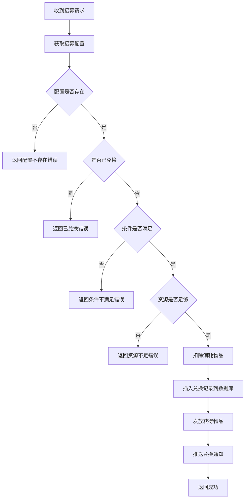
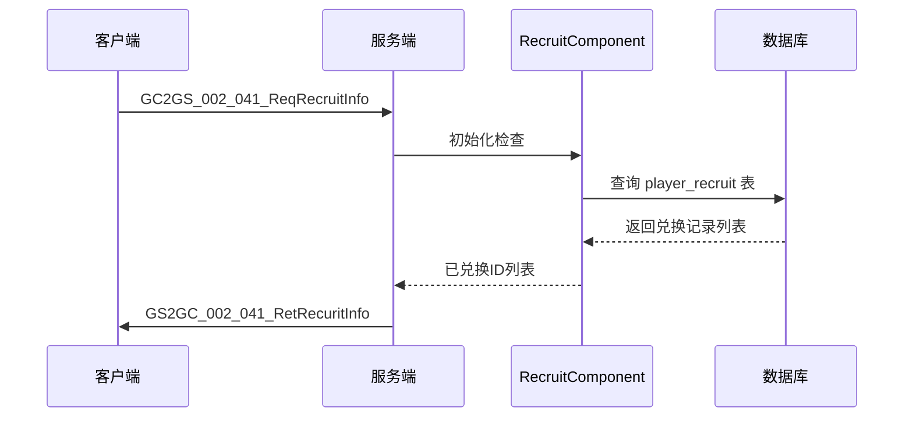

# 招募系统 - 服务端开发

## 一、模块架构

```
game_server/UserServer/src/NPUSServer/
├── NPUSUserMgr/UserComp/RecruitComp/
│   └── RecruitComponent.java       # 招募组件
├── NPUserMsgDispather/p002_InitOp/
│   └── MsgDealer_GC2GS_002_041_ReqRecruitInfo.java  # 初始化协议处理
├── NPUserMsgDispather/p007_CommOp/
│   └── MsgDealer_GC2GS_007_028_ReqRecruit.java     # 招募协议处理
└── NPUserMsgDispather/Write/
    └── US2GCWriter_007_CommOp.java # 协议发送工具

game_server/GameRes/src/NPGameRes/Refs/
└── RefRecruit.java                 # 招募配置

game_server/USDB/Bo/
└── PlayerRecruitBO.java            # 玩家招募数据
```

---

## 二、核心类详解

### 2.1 RecruitComponent - 招募组件

**继承关系**: `RecruitComponent extends _ANPUserComponent`

**组件类型**: `ENPPlayerCompType.RECRUIT`

**主要职责**:
- 管理玩家已兑换招募ID列表
- 处理招募兑换逻辑
- 与数据库交互存储兑换记录

**核心属性**:

| 属性名 | 类型 | 说明 |
|--------|------|------|
| _m_recruitList | List\<Long\> | 已兑换招募ID列表 |

**核心方法**:

| 方法名 | 参数 | 返回值 | 说明 |
|--------|------|--------|------|
| getRecruitList | 无 | List\<Long\> | 获取已兑换列表 |
| tryRecruit | recruitId: long, context: NPPlayerContext | Result | 尝试兑换 |

**完整代码**:

```java
package NPUSServer.NPUSUserMgr.UserComp.RecruitComp;

import NPCommon.ErrMain.Result.Result;
import NPGameRes.Refs.RefRecruit;
import NPUSServer.Common.Context.NPPlayerContext;
import NPUSServer.NPUSUserMgr.ConditionDealer.NPPlayerConditionDealerMgr;
import NPUSServer.NPUSUserMgr.NPUSUserData;
import NPUSServer.NPUSUserMgr.UserComp._ANPUserComponent;
import NPUSServer.NPUserMsgDispather.Write.US2GCWriter_007_CommOp;
import USDB.Bo.PlayerRecruitBO;

import java.util.ArrayList;
import java.util.List;

public class RecruitComponent extends _ANPUserComponent
{
    private List<Long> _m_recruitList;

    public RecruitComponent(NPUSUserData _userData)
    {
        super(_userData, ENPPlayerCompType.RECRUIT);
        _m_recruitList = new ArrayList<>();
    }

    @Override
    protected void _init()
    {
        // 从数据库加载已兑换记录
        getUSServer().getBM().getBM(PlayerRecruitBO.class)
            .findAll("cid", getUserData().getCid(),
                new _ASelectCallback<List<PlayerRecruitBO>>()
                {
                    @Override
                    public void dealSuc(List<PlayerRecruitBO> _boList)
                    {
                        for (PlayerRecruitBO bo : _boList)
                        {
                            _m_recruitList.add(bo.getRecruitId());
                        }
                        setInited();
                    }

                    @Override
                    public void dealFail()
                    {
                        getUserData().setDataLoadFail();
                    }
                });
    }

    @Override
    public ENPPlayerCompType[] getDependCompList()
    {
        return null;
    }

    @Override
    public void onInited() { }

    @Override
    public void dispose() { }

    /**
     * 获取已兑换列表
     */
    public List<Long> getRecruitList()
    {
        return _m_recruitList;
    }

    /**
     * 尝试兑换
     */
    public Result tryRecruit(long _recruitId, NPPlayerContext _context)
    {
        // 1. 获取招募配置
        RefRecruit refRecruit = RefRecruit.getMgr().get(_recruitId);
        if (refRecruit == null)
            return CommErr.REF_NOT_FOUND;

        // 2. 判断是否已兑换
        if (_m_recruitList.contains(_recruitId))
            return PlayerErr.RECRUIT_ALREADY_DONE;

        // 3. 判断是否满足条件
        if (!NPPlayerConditionDealerMgr.IsEnable(refRecruit.condition, getUserData(), null))
            return CommErr.CONDITION_NOT_ENABLE;

        // 4. 消耗道具
        if (!getUserData().spendItem(refRecruit.cost_item, _context))
            return CommErr.ITEM_NOT_ENOUGH;

        // 5. 记录兑换到数据库
        PlayerRecruitBO bo = new PlayerRecruitBO();
        bo.setCid(getUserData().getUSServer().getBM(), getUserData().getCid());
        bo.setRecruitId(getUserData().getUSServer().getBM(), _recruitId);
        bo.insert(getUserData().getUSServer().getBM());

        // 6. 记录到内存
        _m_recruitList.add(_recruitId);

        // 7. 发放奖励
        getUserData().gainItem(refRecruit.gain_item, _context);

        // 8. 推送通知
        getUserData().sendMsgToGC(US2GCWriter_007_CommOp.make_073_OnRecuritRecordAdd(_recruitId));

        return Result.SUCC;
    }
}
```

---

### 2.2 RefRecruit - 招募配置

**继承关系**: `RefRecruit extends RefBase`

**配置表名**: `recruit`

**核心属性**:

| 属性名 | 类型 | 说明 |
|--------|------|------|
| id | long | 招募ID |
| cost_item | NPCommonCostItem | 兑换消耗 |
| gain_item | NPCommonCostItem | 获得物品 |
| condition | NPPlayerConditionGroupObj | 兑换条件 |

**完整代码**:

```java
package NPGameRes.Refs;

import NPCommon.CommonObj.NPCommonCostItem;
import NPCommon.RefData.Ref.RefBase;
import NPCommon.RefData.Ref.RefTable;
import NPCommon.RefData.RefContainer.RefContainerBase;
import NPCommon.RefData.RefContainer.RefListContainer;
import NPGameRes.GameObjs.PlayerCondition.NPPlayerConditionGroupObj;

@RefTable(tableName = "recruit")
public class RefRecruit extends RefBase
{
    private static RefListContainer<RefRecruit> _g_mgr = new RefListContainer<>();

    public static RefListContainer<RefRecruit> getMgr()
    {
        return _g_mgr;
    }

    @Override
    public RefListContainer<RefRecruit> getStaticContainer()
    {
        return getMgr();
    }

    @Override
    public long Id()
    {
        return id;
    }

    public long id;
    public NPCommonCostItem cost_item;    // 兑换消耗
    public NPCommonCostItem gain_item;    // 获得物品
    public NPPlayerConditionGroupObj condition; // 条件
}
```

---

### 2.3 PlayerRecruitBO - 玩家招募数据

**数据表**: `player_recruit`

**表结构**:

| 字段名 | 类型 | 说明 |
|--------|------|------|
| id | BIGINT | 主键ID |
| cid | BIGINT | 角色ID |
| recruit_id | BIGINT | 招募ID |
| create_time | DATETIME | 创建时间 |

**主要方法**:

```java
// 插入兑换记录
PlayerRecruitBO bo = new PlayerRecruitBO();
bo.setCid(bm, cid);
bo.setRecruitId(bm, recruitId);
bo.insert(bm);
```

---

## 三、协议处理

### 3.1 MsgDealer_GC2GS_002_041_ReqRecruitInfo - 初始化协议处理

```java
package NPUSServer.NPUserMsgDispather.p002_InitOp;

import GC2GS.p002_InitOp.GC2GS_002_041_ReqRecruitInfo;
import NPUSServer.Common.Context.NPPlayerContext;
import NPUSServer.NPUSUserMgr.NPUSUserData;
import NPUSServer.NPUSUserMgr.UserMsgMgr.MsgItem._ANPUSUserBasicMsgItem;
import NPUSServer.NPUserMsgDispather.NPUserMsgDealer;
import NPUSServer.NPUserMsgDispather.Write.US2GCWriter_002_InitOp;

public class MsgDealer_GC2GS_002_041_ReqRecruitInfo extends NPUserMsgDealer<GC2GS_002_041_ReqRecruitInfo>
{
    @Override
    protected void _dealMessage(_ANPUSUserBasicMsgItem _committer, GC2GS_002_041_ReqRecruitInfo _msg)
    {
        NPUSUserData userData = _committer.getUserData();
        if (userData == null)
            return;

        // 获取已兑换列表
        List<Long> recruitList = userData.getRecruitComponent().getRecruitList();

        // 返回初始化信息
        _committer.commitSucRes(US2GCWriter_002_InitOp.make_041_RetRecuritInfo(recruitList));
    }
}
```

### 3.2 MsgDealer_GC2GS_007_028_ReqRecruit - 招募协议处理

```java
package NPUSServer.NPUserMsgDispather.p007_CommOp;

import GC2GS.p007_CommOp.GC2GS_007_028_ReqRecruit;
import NPCommon.ErrMain.Result.Result;
import NPEnum.ENPGameEvent;
import NPUSServer.Common.Context.NPPlayerContext;
import NPUSServer.NPUSUserMgr.NPUSUserData;
import NPUSServer.NPUSUserMgr.UserMsgMgr.MsgItem._ANPUSUserBasicMsgItem;
import NPUSServer.NPUserMsgDispather.NPUserMsgDealer;
import NPUSServer.NPUserMsgDispather.Write.US2GCWriter_007_CommOp;

public class MsgDealer_GC2GS_007_028_ReqRecruit extends NPUserMsgDealer<GC2GS_007_028_ReqRecruit>
{
    @Override
    protected void _dealMessage(_ANPUSUserBasicMsgItem _committer, GC2GS_007_028_ReqRecruit _msg)
    {
        NPUSUserData userData = _committer.getUserData();
        if (userData == null)
            return;

        // 创建上下文
        NPPlayerContext context = NPPlayerContext.createNew(ENPGameEvent.RECRUIT);

        // 执行招募
        Result result = userData.getRecruitComponent().tryRecruit(_msg.getId(), context);

        if (!result.isSucc())
        {
            _committer.commitFailRes(result.getCode());
            return;
        }

        // 发送物品变化通知
        userData.sendMsgToGC(context.getCollector().toProto());

        // 返回招募结果
        _committer.commitSucRes(US2GCWriter_007_CommOp.make_028_RetRecruit());
    }
}
```

---

## 四、业务流程图

### 4.1 招募兑换流程



### 4.2 初始化流程



---

## 五、错误处理

### 5.1 错误码定义

| 错误码 | 错误类 | 说明 |
|--------|--------|------|
| REF_NOT_FOUND | CommErr | 招募配置不存在 |
| RECRUIT_ALREADY_DONE | PlayerErr | 已经兑换过 |
| CONDITION_NOT_ENABLE | CommErr | 条件不满足 |
| ITEM_NOT_ENOUGH | CommErr | 物品数量不足 |

### 5.2 错误处理示例

```java
// 处理招募错误
Result result = userData.getRecruitComponent().tryRecruit(recruitId, context);

if (!result.isSucc())
{
    switch (result.getCode())
    {
        case CommErr.REF_NOT_FOUND:
            // 配置不存在，可能是数据错误
            logger.error("招募配置不存在: " + recruitId);
            break;
        case PlayerErr.RECRUIT_ALREADY_DONE:
            // 已兑换，客户端状态不同步
            break;
        case CommErr.CONDITION_NOT_ENABLE:
            // 条件不满足，客户端应该已检查
            break;
        case CommErr.ITEM_NOT_ENOUGH:
            // 资源不足，客户端应该已检查
            break;
    }
    _committer.commitFailRes(result.getCode());
}
```

---

## 六、数据库设计

### 6.1 player_recruit 表

```sql
CREATE TABLE `player_recruit` (
    `id` BIGINT NOT NULL AUTO_INCREMENT COMMENT '主键ID',
    `cid` BIGINT NOT NULL COMMENT '角色ID',
    `recruit_id` BIGINT NOT NULL COMMENT '招募ID',
    `create_time` DATETIME NOT NULL DEFAULT CURRENT_TIMESTAMP COMMENT '创建时间',
    PRIMARY KEY (`id`),
    KEY `idx_cid` (`cid`),
    KEY `idx_recruit_id` (`recruit_id`),
    UNIQUE KEY `uk_cid_recruit_id` (`cid`, `recruit_id`)
) ENGINE=InnoDB DEFAULT CHARSET=utf8mb4 COMMENT='玩家招募记录表';
```

### 6.2 索引说明

| 索引名 | 索引类型 | 字段 | 说明 |
|--------|----------|------|------|
| PRIMARY | 主键 | id | 主键索引 |
| idx_cid | 普通 | cid | 按角色查询 |
| idx_recruit_id | 普通 | recruit_id | 按招募ID查询 |
| uk_cid_recruit_id | 唯一 | cid, recruit_id | 防止重复兑换 |

---

## 七、GM命令

### 7.1 热修复招募数据

```java
// CmdRecruit_Hotfix.java
package NPUSServer.GMCommand.Cmds;

public class CmdRecruit_Hotfix
{
    // 重置招募数据
    public void resetRecruit(long cid)
    {
        // 删除所有兑换记录
        getUSServer().getBM().getBM(PlayerRecruitBO.class)
            .deleteAll("cid", cid);

        // 清空内存数据
        getUserData(cid).getRecruitComponent().getRecruitList().clear();
    }

    // 添加兑换记录
    public void addRecruit(long cid, long recruitId)
    {
        PlayerRecruitBO bo = new PlayerRecruitBO();
        bo.setCid(getUSServer().getBM(), cid);
        bo.setRecruitId(getUSServer().getBM(), recruitId);
        bo.insert(getUSServer().getBM());

        getUserData(cid).getRecruitComponent().getRecruitList().add(recruitId);
    }
}
```

---

## 八、注意事项

1. **并发安全**: 招募操作需要保证原子性，避免重复兑换
2. **数据一致性**: 内存数据与数据库数据需要保持同步
3. **条件检查**: 服务端需要二次校验条件，不能完全信任客户端
4. **日志记录**: 招募操作需要记录日志，便于追踪问题
5. **性能优化**: 批量查询已兑换记录，避免多次数据库访问

---

*文档生成时间: 2026-04-11*