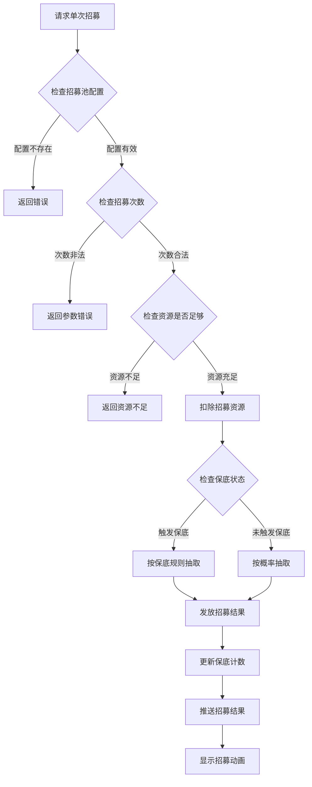
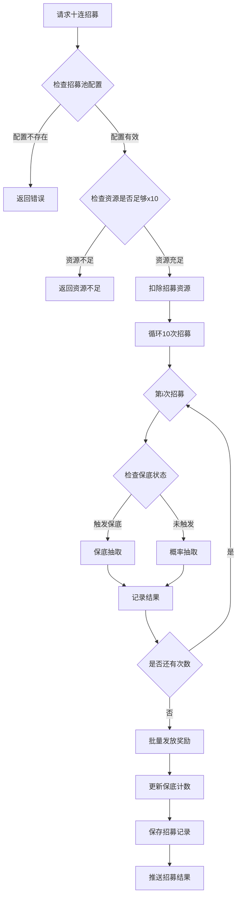
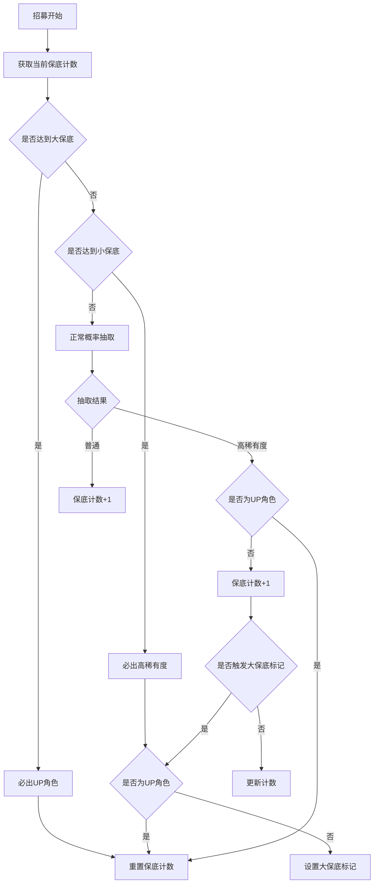
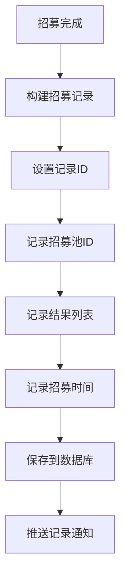

# 招募模块完整说明

## 一、模块概述

### 1.1 业务背景

招募模块是 K2C 游戏的抽卡系统，负责管理玩家的招募行为和招募结果。玩家可以通过招募获得英雄、伴侣、道具等游戏资源。招募系统是游戏的核心玩法之一，也是重要的商业变现途径。

### 1.2 目标用户

- **所有游戏玩家**：每位玩家都可以参与招募
- **付费玩家**：通过付费获得更多招募机会
- **收集型玩家**：追求收集所有角色

### 1.3 核心价值

1. **角色获取**：获得英雄、伴侣等核心角色
2. **付费转化**：是主要的付费点之一
3. **游戏乐趣**：抽卡的期待感和惊喜感
4. **公平机制**：保底机制保障玩家利益

---

## 二、功能清单

### 2.1 招募操作功能

| 功能名称 | 功能描述 | 用户价值 |
|---------|---------|---------|
| 单次招募 | 进行一次招募 | 小额尝试 |
| 十连招募 | 连续招募十次 | 高效招募 |
| 招募预览 | 预览可招募的物品 | 了解招募池内容 |
| 招募记录 | 查看历史招募记录 | 追溯招募结果 |

### 2.2 招募池类型功能

| 功能名称 | 功能描述 | 用户价值 |
|---------|---------|---------|
| 普通招募 | 使用普通货币招募 | 基础招募渠道 |
| 英雄招募 | 获得英雄角色 | 获取战斗伙伴 |
| 伴侣招募 | 获得伴侣角色 | 获取情感系统角色 |
| 限定招募 | 限时UP池 | 获取稀有角色 |

### 2.3 保底机制功能

| 功能名称 | 功能描述 | 用户价值 |
|---------|---------|---------|
| 小保底 | 一定次数必出高稀有度 | 保障最低收益 |
| 大保底 | 一定次数必出UP角色 | 确保目标获取 |
| 保底继承 | 保底计数跨池继承 | 不浪费招募投入 |

---

## 三、业务流程详解

### 3.1 单次招募流程



**详细步骤说明**：

1. **配置验证**
   - 验证招募池ID是否有效
   - 获取招募池配置信息

2. **资源检查**
   - 检查招募所需资源
   - 验证资源是否充足

3. **概率抽取**
   - 检查是否触发保底
   - 根据概率表随机抽取

4. **结果处理**
   - 发放抽取到的物品
   - 更新保底计数
   - 记录招募历史

### 3.2 十连招募流程



**详细步骤说明**：

1. **批量处理**
   - 一次性扣除十次资源
   - 逐次执行招募逻辑

2. **保底检查**
   - 每次招募独立检查保底
   - 保底计数逐次更新

3. **结果汇总**
   - 汇总十次招募结果
   - 批量发放物品
   - 显示汇总结果

### 3.3 保底机制流程



### 3.4 招募记录保存流程



---

## 四、关键规则

### 4.1 招募规则

1. **次数规则**
   - 单次招募：1次
   - 十连招募：10次
   - 只支持这两种次数

2. **资源规则**
   - 不同招募池消耗不同资源
   - 十连招募一次性扣除资源

### 4.2 概率规则

1. **概率配置**
   - 每个物品配置独立权重
   - 概率 = 物品权重 / 总权重

2. **稀有度概率**
   - 不同稀有度有不同概率区间
   - 高稀有度概率较低

### 4.3 保底规则

1. **小保底**
   - 每90次招募必出高稀有度
   - 出高稀有度后计数重置

2. **大保底**
   - 小保底出非UP角色后触发
   - 下次高稀有度必为UP角色

---

## 五、用户故事

### 5.1 免费玩家故事

> 作为一名免费玩家，我每天使用游戏赠送的免费招募机会。虽然次数不多，但我相信积少成多。今天我终于攒够了十连招募的资源，期待能抽到一个强力的英雄。结果抽到了一个普通英雄，虽然不是最想要的，但也提升了我的实力。

### 5.2 付费玩家故事

> 作为一名付费玩家，我购买了招募礼包来抽卡。我瞄准了当期限定UP的英雄，听说保底是180抽。我准备了足够的资源，开始招募。前100抽都没出货，但我没有放弃。最终在第158抽的时候，金色光芒闪耀，我抽到了限定的UP英雄！

### 5.3 收集型玩家故事

> 作为一名收集型玩家，我的目标是收集游戏中的所有英雄。每次有新英雄上线，我都会参与招募。虽然有时候运气不好，但保底机制确保我最终能获得想要的英雄。看到图鉴中越来越多的角色，我感到非常有成就感。

---

## 六、示例

### 6.1 单次招募示例

**输入数据**：
- 玩家ID：20001
- 招募池ID：1001（英雄池）
- 招募次数：1

**配置数据**：
```json
{
  "pool_id": 1001,
  "pool_name": "英雄招募池",
  "pool_type": 2,
  "guarantee_config": {
    "small_guarantee": 90,
    "big_guarantee": 180
  }
}
```

**招募结果**：
```
招募ID：1001
结果列表：
  - 物品ID：3001（英雄）
  - 物品类型：HERO
  - 稀有度：4（紫色）
  - 是否新获得：true
保底计数：1/90
```

### 6.2 十连招募示例

**输入数据**：
- 玩家ID：20001
- 招募池ID：1001
- 招募次数：10

**招募结果**：
```
招募ID：1001
结果列表：
  1. 物品ID：5001（道具），稀有度：2
  2. 物品ID：5002（道具），稀有度：2
  3. 物品ID：3002（英雄），稀有度：3
  4. 物品ID：5001（道具），稀有度：2
  5. 物品ID：5003（道具），稀有度：2
  6. 物品ID：5002（道具），稀有度：2
  7. 物品ID：5001（道具），稀有度：2
  8. 物品ID：5004（道具），稀有度：3
  9. 物品ID：5002（道具），稀有度：2
  10. 物品ID：3003（英雄），稀有度：5（金色）
保底计数：重置（第10抽出金色）
```

### 6.3 保底触发示例

**初始状态**：
```
当前保底计数：89
大保底标记：否
```

**招募操作**：
- 进行1次招募

**抽取过程**：
```
保底计数达到90，触发小保底
必出高稀有度角色
随机结果：UP角色
大保底标记：否
保底计数重置为：0
```

**结果**：
```
获得UP角色（5星）
保底计数：0/90
```

---

*文档生成时间: 2026-04-07*
