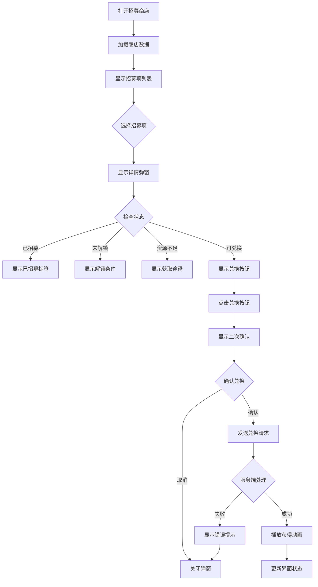
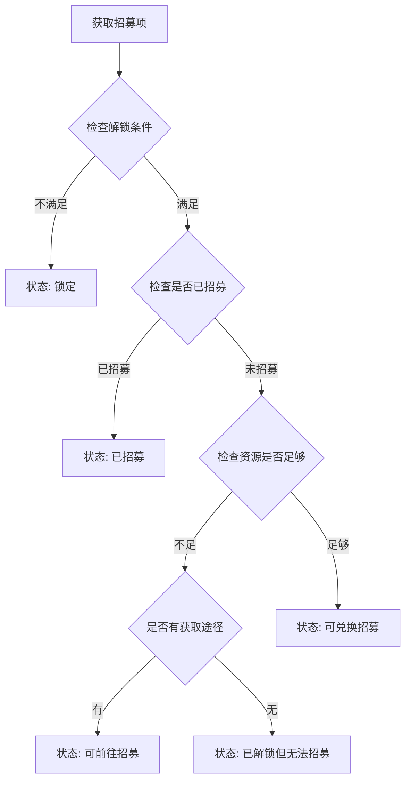
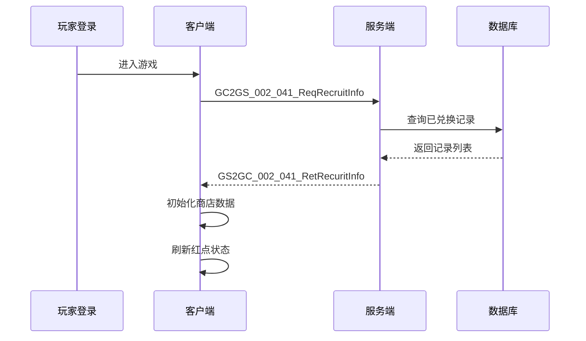
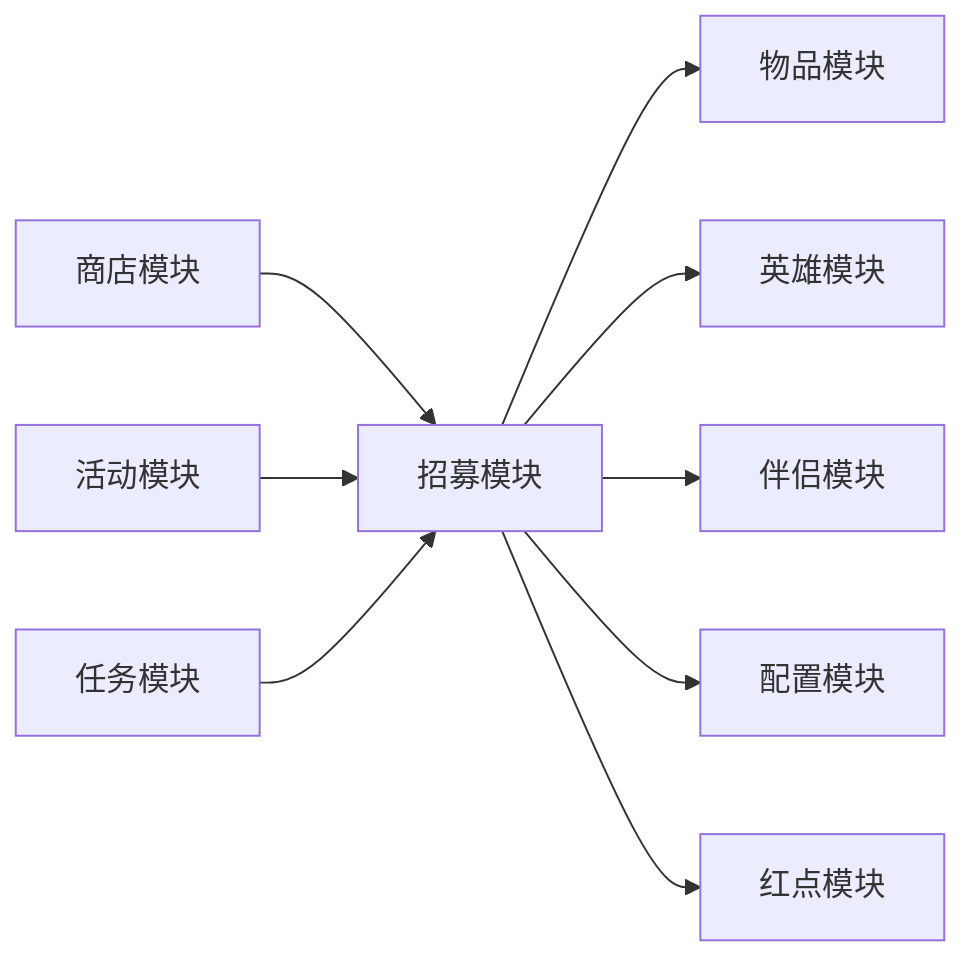

# 招募模块完整说明

## 一、模块概述

### 1.1 业务背景

招募模块是 K2C 游戏的兑换系统，玩家可以通过消耗特定道具来获得英雄、伴侣或其他游戏道具。与传统的抽卡系统不同，本系统采用固定兑换模式，玩家可以明确知道兑换结果，更加透明和公平。

### 1.2 目标用户

- **所有游戏玩家**：每位玩家都可以参与招募
- **收集型玩家**：追求收集所有英雄和伴侣
- **策略型玩家**：根据需求选择兑换目标

### 1.3 核心价值

1. **目标明确**：玩家清楚知道能获得什么
2. **公平透明**：固定兑换，无随机性
3. **资源规划**：帮助玩家合理规划资源
4. **进度可控**：玩家可以控制获取进度

---

## 二、功能清单

### 2.1 招募商店功能

| 功能名称 | 功能描述 | 用户价值 |
|---------|---------|---------|
| 商店列表 | 展示所有招募商店 | 分类管理招募项 |
| 商店入口 | 红点提示可招募项 | 引导玩家关注 |
| 商店资源 | 显示所需资源数量 | 资源规划参考 |

### 2.2 招募兑换功能

| 功能名称 | 功能描述 | 用户价值 |
|---------|---------|---------|
| 招募预览 | 查看招募项详情 | 了解兑换内容 |
| 条件检查 | 显示解锁条件 | 明确获取路径 |
| 资源检查 | 显示资源是否充足 | 快速判断可行性 |
| 二次确认 | 确认兑换操作 | 防止误操作 |
| 兑换执行 | 执行兑换并发放奖励 | 获得目标物品 |

### 2.3 引导功能

| 功能名称 | 功能描述 | 用户价值 |
|---------|---------|---------|
| 前往获取 | 跳转到资源获取途径 | 快速获取资源 |
| 条件引导 | 显示解锁条件达成方式 | 帮助玩家达成目标 |

---

## 三、业务流程详解

### 3.1 招募兑换完整流程



### 3.2 招募状态判断流程



### 3.3 初始化流程



---

## 四、关键规则

### 4.1 兑换规则

1. **一次性兑换**
   - 每个招募项只能兑换一次
   - 兑换后状态变为已招募
   - 不可重复兑换

2. **资源消耗**
   - 兑换时扣除指定数量的指定物品
   - 资源不足时无法兑换
   - 支持多种物品类型作为消耗

### 4.2 条件规则

1. **解锁条件**
   - 玩家需要满足特定条件才能解锁招募项
   - 条件可以是等级、关卡进度、任务完成等
   - 不满足条件时显示锁定状态和条件描述

2. **获取引导**
   - 可配置前往获取途径
   - 点击后跳转到对应的获取界面
   - 支持多种跳转效果

### 4.3 物品类型

| 类型 | 说明 | 已招募判断 |
|------|------|-----------|
| 英雄 | 获得英雄角色 | 玩家是否拥有该英雄 |
| 伴侣 | 获得伴侣角色 | 伴侣是否已解锁 |
| 道具 | 获得游戏道具 | 道具数量是否大于0 |

---

## 五、用户故事

### 5.1 新玩家故事

> 作为一名新玩家，我刚进入游戏不久。在主界面看到招募入口有红点提示，点击进入后发现英雄商店。我看到第一个英雄需要100个英雄碎片，而我目前只有20个。界面上显示可以通过主线关卡获取碎片，于是我点击前往按钮，开始推图之旅。

### 5.2 收集型玩家故事

> 作为一名收集型玩家，我的目标是收集所有英雄。我打开招募商店，仔细查看每个英雄的获取条件。有些英雄需要通关特定关卡，有些需要收集足够的碎片。我根据自己的资源情况，制定了收集计划，优先获取条件已经满足的英雄。

### 5.3 活动玩家故事

> 作为一名参与限时活动的玩家，我通过活动获得了大量兑换道具。我打开招募商店，发现有几个英雄可以直接兑换。我点击兑换按钮，确认后获得了心仪已久的英雄，同时解锁了该英雄的专属皮肤。

---

## 六、示例

### 6.1 英雄兑换示例

**输入数据**：
- 玩家ID：20001
- 招募ID：10001（英雄招募项）
- 英雄ID：10001（名将赵云）

**配置数据**：
```json
{
  "id": 10001,
  "shop_id": 1,
  "cost_item": {
    "itemType": "BAG_ITEM",
    "subId": 1001,
    "count": 100
  },
  "gain_item": {
    "itemType": "HERO",
    "subId": 10001,
    "count": 1
  },
  "condition": {
    "type": "LEVEL",
    "value": 10
  },
  "condition_desc": "玩家等级达到10级"
}
```

**兑换流程**：
```
1. 检查条件：玩家等级15级 > 10级 ✓
2. 检查资源：英雄碎片120个 > 100个 ✓
3. 扣除资源：120 - 100 = 20个
4. 发放英雄：获得英雄赵云
5. 更新状态：标记为已招募
```

**兑换结果**：
```
获得英雄：赵云（名将）
剩余碎片：20个
招募状态：已招募
```

### 6.2 伴侣兑换示例

**输入数据**：
- 玩家ID：20001
- 招募ID：20001（伴侣招募项）
- 伴侣ID：20001（美人貂蝉）

**配置数据**：
```json
{
  "id": 20001,
  "shop_id": 2,
  "cost_item": {
    "itemType": "BAG_ITEM",
    "subId": 1002,
    "count": 150
  },
  "gain_item": {
    "itemType": "CONSORT",
    "subId": 20001,
    "count": 1
  },
  "condition": {
    "type": "CHAPTER",
    "value": 3
  },
  "condition_desc": "通关第3章"
}
```

**兑换结果**：
```
获得伴侣：貂蝉（美人）
伴侣状态：已解锁
```

### 6.3 道具兑换示例

**输入数据**：
- 玩家ID：20001
- 招募ID：30001（道具招募项）

**配置数据**：
```json
{
  "id": 30001,
  "shop_id": 3,
  "cost_item": {
    "itemType": "BAG_ITEM",
    "subId": 1003,
    "count": 50
  },
  "gain_item": {
    "itemType": "BAG_ITEM",
    "subId": 5001,
    "count": 10
  },
  "condition": null
}
```

**兑换结果**：
```
获得道具：经验丹 x10
```

---

## 七、模块关联

### 7.1 关联模块图



### 7.2 依赖关系

| 模块 | 依赖类型 | 说明 |
|------|----------|------|
| 物品模块 | 强依赖 | 消耗和发放物品 |
| 英雄模块 | 弱依赖 | 发放英雄时调用 |
| 伴侣模块 | 弱依赖 | 发放伴侣时调用 |
| 配置模块 | 强依赖 | 读取招募配置 |
| 红点模块 | 弱依赖 | 更新红点状态 |

### 7.3 被依赖关系

| 模块 | 被依赖方式 | 说明 |
|------|------------|------|
| 商店模块 | 购买入口 | 商店出售招募资源 |
| 活动模块 | 活动奖励 | 活动赠送招募资源 |
| 任务模块 | 任务奖励 | 任务奖励招募资源 |

---

## 八、配置说明

### 8.1 商店配置

| 字段 | 类型 | 必填 | 说明 |
|------|------|------|------|
| id | long | 是 | 商店ID |
| name | string | 是 | 商店名称 |
| recruit_cost_show_item | NPCommonItem | 否 | 展示的消耗物品 |
| red_tip_id | long | 是 | 红点配置ID |

### 8.2 招募项配置

| 字段 | 类型 | 必填 | 说明 |
|------|------|------|------|
| id | long | 是 | 招募ID |
| shop_id | long | 是 | 所属商店ID |
| cost_item | NPCommonCostItem | 是 | 消耗物品 |
| gain_item | NPCommonCostItem | 是 | 获得物品 |
| condition | Condition | 否 | 解锁条件 |
| condition_desc | string | 否 | 条件描述 |
| sort_id | int | 是 | 排序ID |

---

*文档生成时间: 2026-04-11*
