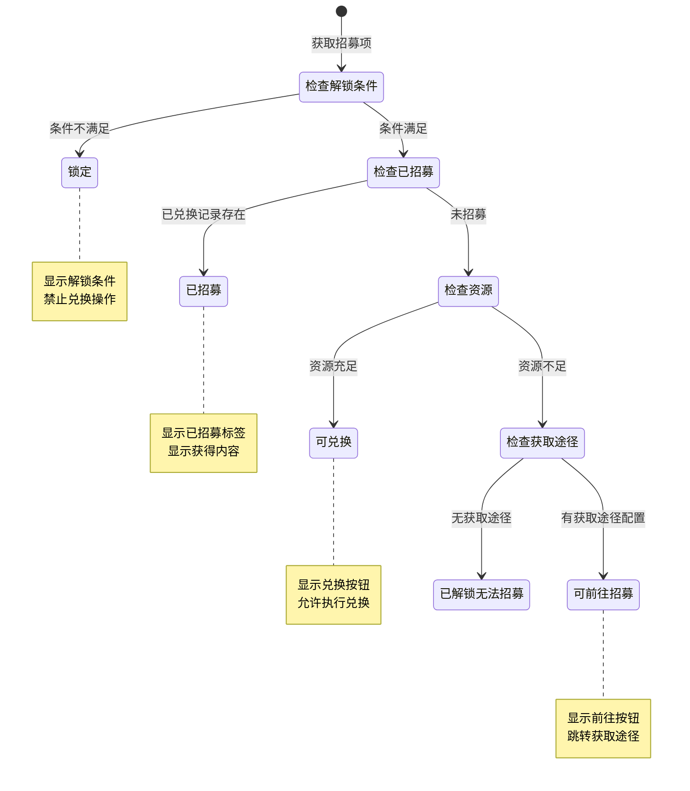
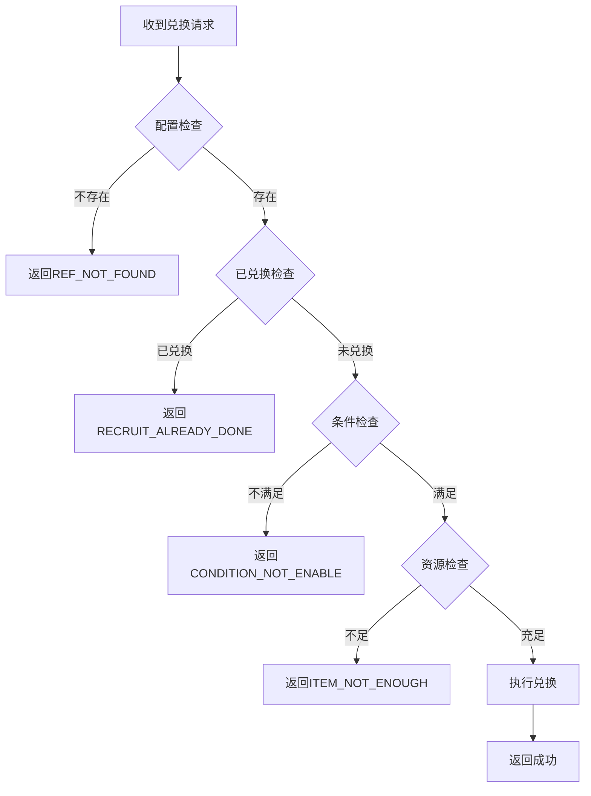

# 招募模块实现细节

## 一、数据结构

### 1.1 招募项工厂方法

招募项根据获得物品类型自动创建对应类型的实例：

```csharp
public static _ARecruitItemInfo getRecruitItemInfo(RecruitRefObj _recruitRefObj)
{
    if (_recruitRefObj == null)
        return null;

    if (_recruitRefObj.gain_item == null)
        return new RecruitNormalItemInfo(_recruitRefObj);

    switch (_recruitRefObj.gain_item.getItemType())
    {
        case ENPItemType.HERO:
            return new RecruitHeroItemInfo(_recruitRefObj);
        case ENPItemType.CONSORT:
            return new RecruitConsortItemInfo(_recruitRefObj);
        default:
            return new RecruitNormalItemInfo(_recruitRefObj);
    }
}
```

### 1.2 已招募判断逻辑

不同类型的招募项有不同的判断方式：

```csharp
// 英雄招募项：检查玩家是否拥有该英雄
public override bool isHadRecruit()
{
    return NPPlayer.instance.heroComponent.getHeroInfo(_m_lHeroId) != null;
}

// 伴侣招募项：检查伴侣是否已解锁
public override bool isHadRecruit()
{
    return _m_consortInfo != null &&
           _m_consortInfo.unlockType == EGameCommonUnlockType.UNLOCK;
}

// 普通道具招募项：检查道具数量是否大于0
public override bool isHadRecruit()
{
    return _m_rRecruitRefObj != null &&
           _m_rRecruitRefObj.gain_item != null &&
           GCommon.getItemCount(_m_rRecruitRefObj.gain_item.item) > 0;
}
```

---

## 二、状态机定义

### 2.1 招募状态机



### 2.2 状态枚举定义

```csharp
public enum ERecruitState
{
    NONE,                   // 无状态（默认）
    LOCK,                   // 锁定状态（条件未满足）
    RECRUITED,              // 已招募状态
    CAN_GO_TO_RECRUIT,      // 可前往招募状态
    UNLOCK_CANNOT_RECRUIT,  // 已解锁但无法招募状态
    CAN_EXCHANGE_RECRUIT,   // 可兑换招募状态
}
```

### 2.3 状态判断代码

```csharp
public ERecruitState getRecruitState(_ARecruitItemInfo _recruitItemInfo, bool _needShowTip)
{
    if (_recruitItemInfo == null || _recruitItemInfo.recruitRefObj == null)
        return ERecruitState.NONE;

    // 1. 检查解锁条件
    if (!_recruitItemInfo.hadUnlockRecruit())
    {
        if (_needShowTip)
            NPGUIAddSceneCenterTip.instance.showTextInfo(
                TextTranslate.instance.getLanguage(
                    _recruitItemInfo.recruitRefObj.condition_desc,
                    _recruitItemInfo.recruitRefObj.condition_desc_args_list
                )
            );
        return ERecruitState.LOCK;
    }

    // 2. 检查是否已招募
    if (isHadRecruit(_recruitItemInfo))
        return ERecruitState.RECRUITED;

    // 3. 检查是否有前往招募条件
    if (_recruitItemInfo.recruitRefObj.canGotoRecruit())
        return ERecruitState.CAN_GO_TO_RECRUIT;

    // 4. 检查资源是否足够
    if (!GCommon.isItemEnough(_recruitItemInfo.recruitRefObj.cost_item, _needShowTip))
        return ERecruitState.UNLOCK_CANNOT_RECRUIT;

    // 5. 可兑换
    return ERecruitState.CAN_EXCHANGE_RECRUIT;
}
```

---

## 三、数据约束

### 3.1 招募配置约束

| 字段名 | 数据类型 | 取值范围 | 必填 | 唯一性 | 说明 |
|--------|----------|----------|------|--------|------|
| id | long | > 0 | 是 | 是 | 招募ID |
| shop_id | long | > 0 | 是 | 否 | 商店ID |
| cost_item | NPCommonCostItem | 非空 | 是 | 否 | 消耗物品 |
| gain_item | NPCommonCostItem | 非空 | 是 | 否 | 获得物品 |
| condition | object | - | 否 | 否 | 解锁条件 |
| sort_id | int | >= 0 | 是 | 否 | 排序ID |

### 3.2 商店配置约束

| 字段名 | 数据类型 | 取值范围 | 必填 | 唯一性 | 说明 |
|--------|----------|----------|------|--------|------|
| id | long | > 0 | 是 | 是 | 商店ID |
| name | string | 1-50字符 | 是 | 否 | 商店名称 |
| red_tip_id | long | > 0 | 是 | 否 | 红点ID |

### 3.3 数据库表约束

| 字段名 | 数据类型 | 取值范围 | 必填 | 说明 |
|--------|----------|----------|------|------|
| id | BIGINT | > 0 | 是 | 主键ID |
| cid | BIGINT | > 0 | 是 | 角色ID |
| recruit_id | BIGINT | > 0 | 是 | 招募ID |
| create_time | DATETIME | - | 是 | 创建时间 |

---

## 四、错误处理策略

### 4.1 招募模块错误码

| 错误码 | 错误信息 | 处理策略 | 用户提示 |
|--------|----------|----------|----------|
| REF_NOT_FOUND | 配置不存在 | 检查招募ID | "招募项不存在" |
| RECRUIT_ALREADY_DONE | 已兑换过 | 刷新状态 | "已兑换过" |
| CONDITION_NOT_ENABLE | 条件不满足 | 显示条件 | "条件未满足" |
| ITEM_NOT_ENOUGH | 物品不足 | 显示获取途径 | "资源不足" |

### 4.2 错误处理流程



### 4.3 客户端错误处理

```csharp
// 请求招募时的错误处理
NPPlayer.instance.recruitComp.reqRecruit(recruitId, (msg) =>
{
    // 成功处理
    Debug.Log("招募成功");
    _refreshWnd();
}, () =>
{
    // 失败处理
    // 错误提示已在组件内通过 NPGUIAddSceneCenterTip 显示
});
```

---

## 五、关键代码示例

### 5.1 客户端初始化代码

```csharp
// RecruitComponent.cs
protected override void _dealInit()
{
    if (_m_lRecruitShopInfoList == null)
        _m_lRecruitShopInfoList = new List<RecruitShopInfo>();
    _m_lRecruitShopInfoList.Clear();

    // 遍历配置创建商店信息
    foreach (var shopRefObj in GRefdataCoreMgr.instance.recruitShopRefCore.refList)
    {
        if (shopRefObj != null)
            _m_lRecruitShopInfoList.Add(new RecruitShopInfo(shopRefObj));
    }

    // 监听物品变化消息
    WinMsg.RegisterMsg(WinMsgType.ON_COMMON_ITEM_COUNT_CHG, _onCommonItemChg);
}
```

### 5.2 服务端兑换代码

```java
// RecruitComponent.java
public Result tryRecruit(long _recruitId, NPPlayerContext _context)
{
    // 1. 获取配置
    RefRecruit refRecruit = RefRecruit.getMgr().get(_recruitId);
    if (refRecruit == null)
        return CommErr.REF_NOT_FOUND;

    // 2. 检查是否已兑换
    if (_m_recruitList.contains(_recruitId))
        return PlayerErr.RECRUIT_ALREADY_DONE;

    // 3. 检查条件
    if (!NPPlayerConditionDealerMgr.IsEnable(refRecruit.condition, getUserData(), null))
        return CommErr.CONDITION_NOT_ENABLE;

    // 4. 扣除资源
    if (!getUserData().spendItem(refRecruit.cost_item, _context))
        return CommErr.ITEM_NOT_ENOUGH;

    // 5. 记录数据
    PlayerRecruitBO bo = new PlayerRecruitBO();
    bo.setCid(getUserData().getUSServer().getBM(), getUserData().getCid());
    bo.setRecruitId(getUserData().getUSServer().getBM(), _recruitId);
    bo.insert(getUserData().getUSServer().getBM());
    _m_recruitList.add(_recruitId);

    // 6. 发放奖励
    getUserData().gainItem(refRecruit.gain_item, _context);

    // 7. 推送通知
    getUserData().sendMsgToGC(US2GCWriter_007_CommOp.make_073_OnRecuritRecordAdd(_recruitId));

    return Result.SUCC;
}
```

### 5.3 红点刷新代码

```csharp
// RecruitComponent.cs
private void _refreshRedTipTask()
{
    if (_m_lChgItemList.Count > 0 && _m_lRecruitShopInfoList != null)
    {
        foreach (var recruitShopInfo in _m_lRecruitShopInfoList)
        {
            if (recruitShopInfo == null || recruitShopInfo.recruitShopRefObj == null)
                continue;

            bool needChgRed = false;
            bool hasUnRecruitItem = false;

            if (recruitShopInfo.recruitItemInfoList != null)
            {
                foreach (var recruitItemInfo in recruitShopInfo.recruitItemInfoList)
                {
                    if (recruitItemInfo == null || recruitItemInfo.recruitRefObj == null)
                        continue;

                    // 检查是否需要刷新红点
                    if (recruitItemInfo.recruitRefObj.cost_item != null &&
                        !_m_lChgItemList.Contains(recruitItemInfo.recruitRefObj.cost_item.item))
                        continue;

                    needChgRed = true;

                    // 跳过已招募的
                    if (isHadRecruit(recruitItemInfo))
                        continue;

                    // 检查资源是否足够
                    if (GCommon.isItemEnough(recruitItemInfo.recruitRefObj.cost_item, false))
                    {
                        hasUnRecruitItem = true;
                        break;
                    }
                }
            }

            if (needChgRed)
                RedTipMgr.instance.setCountByRefRedTipId(
                    recruitShopInfo.recruitShopRefObj.red_tip_id,
                    hasUnRecruitItem ? 1 : 0
                );
        }

        _pushBackAllCommonItem();
    }
}
```

---

## 六、跨模块依赖

### 6.1 依赖模块

| 模块名称 | 依赖类型 | 依赖说明 |
|----------|----------|----------|
| Item模块 | 强依赖 | 扣除消耗、发放奖励 |
| Config模块 | 强依赖 | 读取招募配置 |
| Hero模块 | 弱依赖 | 发放英雄时调用 |
| Consort模块 | 弱依赖 | 发放伴侣时调用 |
| RedTip模块 | 弱依赖 | 更新红点状态 |

### 6.2 被依赖关系

| 模块名称 | 被依赖方式 | 说明 |
|----------|------------|------|
| 商店模块 | 购买入口 | 商店出售招募资源 |
| 活动模块 | 活动奖励 | 活动赠送招募资源 |
| 任务模块 | 任务奖励 | 任务奖励招募资源 |

### 6.3 接口定义

```csharp
// 供其他模块调用的接口
public interface IRecruitService
{
    // 获取商店信息
    RecruitShopInfo GetShopInfo(long shopId);

    // 获取招募状态
    ERecruitState GetRecruitState(long recruitId);

    // 检查是否已招募
    bool IsHadRecruit(long recruitId);

    // 获取招募配置
    RecruitRefObj GetRecruitConfig(long recruitId);

    // 添加已招募记录（供GM等特殊调用）
    void AddRecruitRecord(long recruitId);
}
```

---

## 七、性能优化

### 7.1 客户端优化

1. **对象池使用**
   - 使用 `ObjectPool<NPCommonItem>` 管理临时对象
   - 避免频繁创建销毁对象

```csharp
[NotNull] private ObjectPool<NPCommonItem> _m_commonItemPool =
    new ObjectPool<NPCommonItem>(() => new NPCommonItem(), null, null, null, false, 1);
```

2. **延迟刷新**
   - 红点刷新使用延迟任务机制
   - 避免频繁刷新造成的性能问题

```csharp
ALCommonTaskController.CommonActionAddMonoTask(() =>
{
    _refreshRedTipTask();
}, 1f); // 延迟1秒刷新
```

3. **配置预加载**
   - 商店初始化时预加载配置数据
   - 避免运行时频繁读取配置

### 7.2 服务端优化

1. **批量查询**
   - 初始化时一次性查询所有兑换记录
   - 避免多次数据库访问

```java
getUSServer().getBM().getBM(PlayerRecruitBO.class)
    .findAll("cid", getUserData().getCid(), callback);
```

2. **内存缓存**
   - 兑换记录缓存在内存中
   - 查询时直接从内存读取

```java
private List<Long> _m_recruitList; // 内存缓存
```

---

## 八、注意事项

### 8.1 开发注意事项

1. **类型区分**
   - 注意区分英雄、伴侣、道具三种招募类型
   - 不同类型的已招募判断逻辑不同

2. **状态同步**
   - 兑换成功后需要及时更新界面状态
   - 红点状态需要与实际数据同步

3. **条件检查**
   - 服务端需要二次校验条件
   - 不能完全信任客户端的状态

### 8.2 测试注意事项

1. **边界测试**
   - 测试资源刚好足够的情况
   - 测试已兑换后再次请求的情况

2. **并发测试**
   - 测试同时兑换多个招募项
   - 测试高并发兑换请求

3. **数据一致性**
   - 验证数据库记录与内存数据一致
   - 验证客户端状态与服务端状态一致

---

## 九、扩展说明

### 9.1 如何添加新招募项

1. 在配置表中添加招募项数据
2. 配置消耗物品和获得物品
3. 配置解锁条件（可选）
4. 设置排序ID
5. 关联到对应商店

### 9.2 如何添加新商店

1. 在配置表中添加商店数据
2. 配置商店名称和红点ID
3. 添加招募项关联
4. 在界面中添加商店入口

### 9.3 如何扩展招募类型

1. 在 `ERecruitItemType` 中添加新类型
2. 创建新的 `_ARecruitItemInfo` 子类
3. 在工厂方法中添加新类型的创建逻辑
4. 实现对应的已招募判断逻辑

---

*文档生成时间: 2026-04-11*