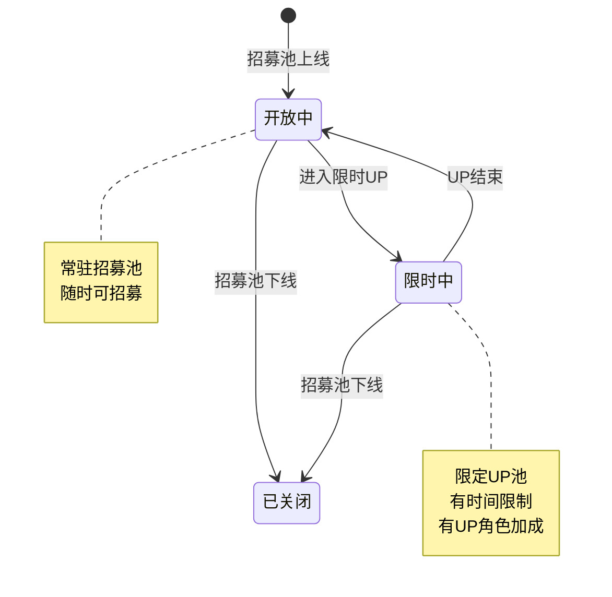
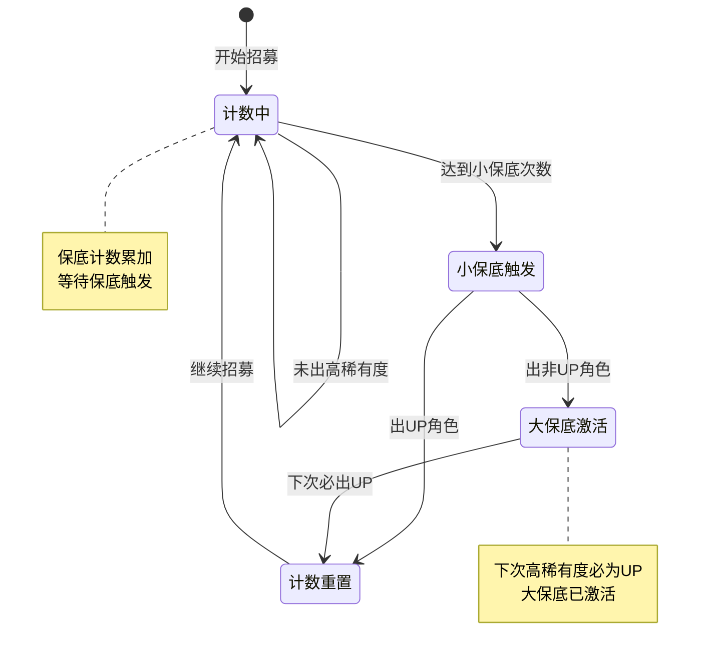
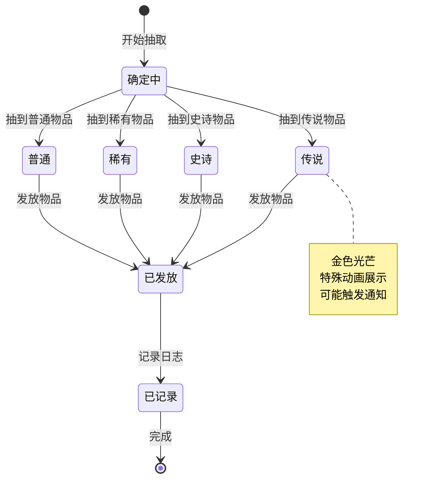
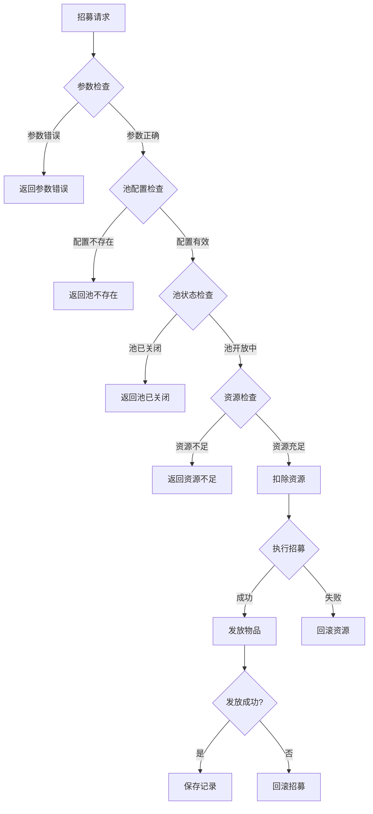

# 招募模块实现细节

## 一、计算公式

### 1.1 概率计算公式

```
物品概率 = 物品权重 / 总权重
```

**参数说明**：
- `物品权重`：配置表中单个物品的权重值
- `总权重`：该池所有物品权重之和

**示例计算**：
```
物品列表：
  - 英雄A：权重1000（5星）
  - 英雄B：权重2000（4星）
  - 英雄C：权重3000（4星）
  - 道具D：权重40000（3星）

总权重 = 1000 + 2000 + 3000 + 40000 = 46000

概率：
  - 英雄A概率 = 1000/46000 = 2.17%
  - 英雄B概率 = 2000/46000 = 4.35%
  - 英雄C概率 = 3000/46000 = 6.52%
  - 道具D概率 = 40000/46000 = 86.96%
```

### 1.2 保底概率提升公式

```
实际概率 = 基础概率 × (1 + 保底加成)
保底加成 = max(0, (当前计数 - 软保底阈值) × 加成系数)
```

**示例计算**：
```
基础5星概率：0.6%
软保底阈值：75抽
加成系数：0.02
当前计数：80

保底加成 = (80 - 75) × 0.02 = 0.1
实际概率 = 0.6% × (1 + 0.1) = 0.66%
```

### 1.3 随机抽取算法

```
1. 生成随机数 rand ∈ [0, 总权重)
2. 遍历物品列表，累加权重
3. 当累加权重 > rand 时，返回当前物品
```

---

## 二、状态机定义

### 2.1 招募池状态机



### 2.2 保底状态机



### 2.3 招募结果状态机



---

## 三、数据约束

### 3.1 招募池配置约束

| 字段名 | 数据类型 | 取值范围 | 必填 | 唯一性 | 说明 |
|--------|----------|----------|------|--------|------|
| pool_id | int | > 0 | 是 | 是 | 招募池ID |
| pool_name | string | 1-50字符 | 是 | 否 | 招募池名称 |
| pool_type | int | 1-4 | 是 | 否 | 招募池类型 |
| item_list | array | 非空 | 是 | 否 | 物品列表 |
| guarantee_config | object | - | 是 | 否 | 保底配置 |

### 3.2 招募项配置约束

| 字段名 | 数据类型 | 取值范围 | 必填 | 说明 |
|--------|----------|----------|------|------|
| item_id | int | > 0 | 是 | 物品ID |
| item_type | int | 1-10 | 是 | 物品类型 |
| weight | int | > 0 | 是 | 抽取权重 |
| rarity | int | 1-5 | 是 | 稀有度 |
| is_up | bool | - | 否 | 是否为UP物品 |

### 3.3 保底配置约束

| 字段名 | 数据类型 | 取值范围 | 必填 | 说明 |
|--------|----------|----------|------|------|
| small_guarantee | int | > 0 | 是 | 小保底次数 |
| big_guarantee | int | >= small_guarantee | 是 | 大保底次数 |
| soft_guarantee | int | >= 0 | 否 | 软保底阈值 |

### 3.4 招募记录约束

| 字段名 | 数据类型 | 取值范围 | 必填 | 说明 |
|--------|----------|----------|------|------|
| id | BIGINT | > 0 | 是 | 记录ID |
| player_id | BIGINT | > 0 | 是 | 玩家ID |
| pool_id | INT | > 0 | 是 | 招募池ID |
| result_list | JSON | 非空 | 是 | 结果列表 |
| recruit_time | DATETIME | - | 是 | 招募时间 |

### 3.5 玩家招募数据约束

| 字段名 | 数据类型 | 取值范围 | 必填 | 说明 |
|--------|----------|----------|------|------|
| player_id | BIGINT | > 0 | 是 | 玩家ID |
| pool_id | INT | > 0 | 是 | 招募池ID |
| total_count | INT | >= 0 | 是 | 总招募次数 |
| guarantee_count | INT | >= 0 | 是 | 当前保底计数 |
| big_guarantee_flag | TINYINT | 0-1 | 是 | 大保底标记 |
| last_recruit_time | DATETIME | - | 是 | 最后招募时间 |

---

## 四、错误处理策略

### 4.1 招募模块错误码

| 错误码 | 错误信息 | 处理策略 | 用户提示 |
|--------|----------|----------|----------|
| 65001 | 招募池不存在 | 检查池ID | "招募池不存在" |
| 65002 | 招募次数无效 | 检查次数参数 | "招募次数无效" |
| 65003 | 资源不足 | 检查资源数量 | "资源不足" |
| 65004 | 招募池已关闭 | 检查池状态 | "招募池已关闭" |
| 65005 | 物品发放失败 | 回滚招募 | "系统错误，请重试" |

### 4.2 招募错误处理流程



### 4.3 保底处理策略

| 异常情况 | 处理策略 | 说明 |
|----------|----------|------|
| 保底计数异常 | 重置为安全值 | 防止数据错误 |
| 大保底标记异常 | 重置为false | 保守处理 |
| 概率配置错误 | 使用默认概率 | 保证可用性 |

---

## 五、关键代码示例

### 5.1 执行招募伪代码

```csharp
public RecruitResult Recruit(long playerId, int poolId, int count)
{
    // 1. 验证参数
    if (count != 1 && count != 10)
        return RecruitResult.Error(65002, "招募次数无效");

    // 2. 获取招募池配置
    RecruitPoolConfig config = recruitConfigDao.getPoolById(poolId);
    if (config == null)
        return RecruitResult.Error(65001, "招募池不存在");

    if (!config.is_open)
        return RecruitResult.Error(65004, "招募池已关闭");

    // 3. 检查并扣除资源
    List<ItemInfo> costList = CalculateCost(config, count);
    if (!itemService.checkItems(playerId, costList))
        return RecruitResult.Error(65003, "资源不足");

    itemService.consumeItems(playerId, costList, "招募");

    // 4. 获取玩家招募数据
    PlayerRecruit playerRecruit = recruitDao.getByPlayerAndPool(playerId, poolId);
    if (playerRecruit == null)
    {
        playerRecruit = new PlayerRecruit
        {
            PlayerId = playerId,
            PoolId = poolId,
            TotalCount = 0,
            GuaranteeCount = 0,
            BigGuaranteeFlag = false
        };
    }

    // 5. 执行招募
    List<RecruitItemResult> resultList = new List<RecruitItemResult>();

    for (int i = 0; i < count; i++)
    {
        RecruitItemResult result = DoSingleRecruit(playerId, config, playerRecruit);
        resultList.Add(result);
    }

    // 6. 更新招募数据
    playerRecruit.TotalCount += count;
    playerRecruit.LastRecruitTime = DateTime.Now;
    recruitDao.saveOrUpdate(playerRecruit);

    // 7. 保存招募记录
    SaveRecruitRecord(playerId, poolId, resultList);

    // 8. 推送结果
    PushRecruitResult(playerId, poolId, resultList);

    return RecruitResult.Success(resultList, playerRecruit.GuaranteeCount);
}
```

### 5.2 单次招募抽取伪代码

```csharp
private RecruitItemResult DoSingleRecruit(long playerId, RecruitPoolConfig config, PlayerRecruit playerRecruit)
{
    bool isGuaranteed = false;
    int targetRarity = 0;

    // 1. 检查是否触发保底
    if (playerRecruit.GuaranteeCount >= config.guarantee_config.big_guarantee - 1 ||
        (playerRecruit.BigGuaranteeFlag && playerRecruit.GuaranteeCount >= config.guarantee_config.small_guarantee - 1))
    {
        // 大保底触发，必出UP
        isGuaranteed = true;
        targetRarity = 5;
        return DrawFromPool(playerId, config, targetRarity, true, isGuaranteed);
    }
    else if (playerRecruit.GuaranteeCount >= config.guarantee_config.small_guarantee - 1)
    {
        // 小保底触发，必出高稀有度
        isGuaranteed = true;
        targetRarity = 5;
    }

    // 2. 随机抽取
    RecruitItemResult result = DrawFromPool(playerId, config, targetRarity, false, isGuaranteed);

    // 3. 更新保底计数
    if (result.Rarity >= 5)
    {
        // 出高稀有度，检查是否为UP
        bool isUp = config.item_list.Any(x => x.item_id == result.ItemId && x.is_up);

        if (isUp)
        {
            // 出UP角色，重置保底
            playerRecruit.GuaranteeCount = 0;
            playerRecruit.BigGuaranteeFlag = false;
        }
        else
        {
            // 出非UP角色，激活大保底
            playerRecruit.GuaranteeCount = 0;
            playerRecruit.BigGuaranteeFlag = true;
        }
    }
    else
    {
        // 未出高稀有度，保底计数+1
        playerRecruit.GuaranteeCount++;
    }

    return result;
}
```

### 5.3 从池中抽取伪代码

```csharp
private RecruitItemResult DrawFromPool(long playerId, RecruitPoolConfig config, int minRarity, bool mustUp, bool isGuaranteed)
{
    // 1. 筛选可用物品
    List<RecruitItem> availableItems = config.item_list
        .Where(x => minRarity == 0 || x.rarity >= minRarity)
        .Where(x => !mustUp || x.is_up)
        .ToList();

    // 2. 计算总权重
    int totalWeight = availableItems.Sum(x => x.weight);

    // 3. 生成随机数
    Random random = new Random();
    int rand = random.Next(totalWeight);

    // 4. 遍历找出中奖物品
    int accumulated = 0;
    RecruitItem selectedItem = null;

    foreach (var item in availableItems)
    {
        accumulated += item.weight;
        if (accumulated > rand)
        {
            selectedItem = item;
            break;
        }
    }

    // 5. 发放物品
    bool isNew = itemService.giveItem(playerId, selectedItem.item_id, 1, "招募");

    return new RecruitItemResult
    {
        ItemId = selectedItem.item_id,
        ItemType = selectedItem.item_type,
        ItemCount = 1,
        Rarity = selectedItem.rarity,
        IsNew = isNew,
        IsGuaranteed = isGuaranteed
    };
}
```

### 5.4 计算招募消耗伪代码

```csharp
private List<ItemInfo> CalculateCost(RecruitPoolConfig config, int count)
{
    List<ItemInfo> costList = new List<ItemInfo>();

    foreach (var cost in config.cost_list)
    {
        costList.Add(new ItemInfo
        {
            ItemId = cost.item_id,
            Count = cost.count * count
        });
    }

    // 十连可能有折扣
    if (count == 10 && config.ten_cost_discount > 0)
    {
        foreach (var cost in costList)
        {
            cost.Count = (int)(cost.Count * config.ten_cost_discount);
        }
    }

    return costList;
}
```

### 5.5 保存招募记录伪代码

```csharp
private void SaveRecruitRecord(long playerId, int poolId, List<RecruitItemResult> resultList)
{
    RecruitRecord record = new RecruitRecord
    {
        Id = idGenerator.NextId(),
        PlayerId = playerId,
        PoolId = poolId,
        ResultList = JsonSerializer.Serialize(resultList),
        RecruitTime = DateTime.Now
    };

    recruitRecordDao.insert(record);
}
```

---

## 六、跨模块依赖

### 6.1 依赖模块

| 模块名称 | 依赖类型 | 依赖说明 |
|----------|----------|----------|
| Item模块 | 强依赖 | 发放招募获得的物品 |
| Config模块 | 强依赖 | 需要读取招募配置 |
| Hero模块 | 弱依赖 | 招募可能获得英雄 |
| Player模块 | 弱依赖 | 更新玩家数据 |

### 6.2 被依赖关系

| 模块名称 | 被依赖方式 | 说明 |
|----------|------------|------|
| 商店模块 | 购买入口 | 商店出售招募资源 |
| 活动模块 | 活动奖励 | 活动赠送招募机会 |
| 任务模块 | 任务奖励 | 任务奖励招募资源 |

### 6.3 接口定义

```csharp
// 供其他模块调用的接口
public interface IRecruitService
{
    // 执行招募
    RecruitResult Recruit(long playerId, int poolId, int count);

    // 获取招募记录
    List<RecruitRecord> GetRecruitRecords(long playerId, int poolId, int limit);

    // 获取玩家招募数据
    PlayerRecruit GetPlayerRecruitData(long playerId, int poolId);

    // 获取招募池配置
    RecruitPoolConfig GetPoolConfig(int poolId);

    // 检查资源是否足够
    bool CheckRecruitResource(long playerId, int poolId, int count);
}
```

---

*文档生成时间: 2026-04-07*
