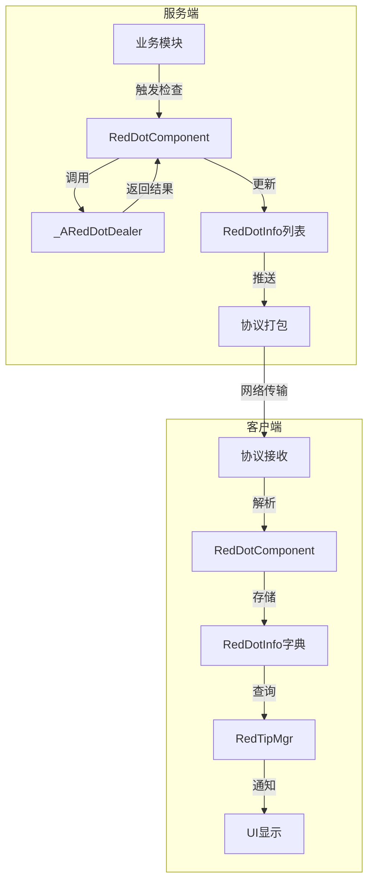

# 红点系统数据配表文档

## 配表说明

红点系统相关的配置数据主要存储在以下配表中:

---

## 一、红点类型枚举

### ERedDotType - 红点类型

**路径**: `game_server/ServerProtocol/src/CommonEnum/ERedDotType.java`

| 枚举值 | 值 | 说明 |
|--------|-----|------|
| NONE | 0 | 无 |

> **注意**: 当前枚举仅定义了基础值，业务红点类型需在项目中扩展定义。

---

## 二、红点数据结构

### 2.1 Common_RedDotInfo - 通用红点信息

**路径**: `game_server/ServerProtocol/src/Common/Common_RedDotInfo.java`

| 字段名 | 类型 | 说明 | 默认值 |
|--------|------|------|--------|
| redDotType | ERedDotType | 红点类型 | NONE |
| needCheckTimeMs | long | 需要检查的时间点(毫秒时间戳)，0表示无需定时检查 | 0 |

**数据包大小**: 12 字节

### 2.2 RedDotInfo - 服务端红点信息

**路径**: `game_server/UserServer/src/NPUSServer/NPUSUserMgr/UserComp/RedDotComp/RedDotInfo.java`

| 字段名 | 类型 | 说明 |
|--------|------|------|
| _m_comp | RedDotComponent | 所属红点组件 |
| _m_redDotType | ERedDotType | 红点类型 |
| _m_needCheckTimeMs | long | 需要检查的时间点(毫秒时间戳) |

### 2.3 RedDotInfo - 客户端红点信息

**路径**: `game_client/Assets/Scripts/LogicScripts/GameComponent/RedDot/RedDotInfo.cs`

| 字段名 | 类型 | 说明 |
|--------|------|------|
| _m_eType | ERedDotType | 红点类型 |
| _m_lNeedCheckTimeMs | long | 需要检查的时间点(毫秒时间戳) |
| _m_bIsChecking | bool | 是否正在请求检查 |

---

## 三、红点组件数据结构

### 3.1 RedDotComponent - 服务端红点组件

**路径**: `game_server/UserServer/src/NPUSServer/NPUSUserMgr/UserComp/RedDotComp/RedDotComponent.java`

| 字段名 | 类型 | 说明 |
|--------|------|------|
| _m_dealerList | _ARedDotDealer[] | 红点处理器数组（通过枚举ordinal索引） |
| _m_redDotList | List&lt;RedDotInfo&gt; | 当前激活的红点集合 |

### 3.2 RedDotComponent - 客户端红点组件

**路径**: `game_client/Assets/Scripts/LogicScripts/GameComponent/RedDot/RedDotComponent.cs`

| 字段名 | 类型 | 说明 |
|--------|------|------|
| _m_lRedDotDic | Dictionary&lt;ERedDotType, RedDotInfo&gt; | 需要展示的红点字典 |
| _m_iTickTask | ALCommonEnableTaskController | 定时任务控制器 |

---

## 四、红点处理器结构

### 4.1 _ARedDotDealer - 红点处理器基类

**路径**: `game_server/UserServer/src/NPUSServer/NPUSUserMgr/UserComp/RedDotComp/_ARedDotDealer.java`

| 字段名 | 类型 | 说明 |
|--------|------|------|
| _m_comp | RedDotComponent | 持有的红点组件引用 |

| 方法名 | 返回类型 | 说明 |
|--------|----------|------|
| getRedDotType() | ERedDotType | 返回当前处理器处理的红点类型 |
| checkRedDot() | WCGPair&lt;Boolean, Long&gt; | 检查是否应该显示红点，返回(是否显示, 过期时间) |
| getUserData() | NPUSUserData | 获取玩家数据对象 |
| getUSServer() | NPUserServer | 获取UserServer对象 |

---

## 五、数据流程图

### 5.1 红点数据流转图



### 5.2 红点初始化流程图

```mermaid
sequenceDiagram
    participant C as 客户端
    participant S as 服务端
    participant RC as RedDotComponent
    participant D as _ARedDotDealer

    C->>S: GC2GS_002_080_ReqRedDotInit
    S->>RC: getAllRedDots()
    RC->>RC: 遍历 _m_redDotList
    RC-->>S: List&lt;Common_RedDotInfo&gt;
    S-->>C: GS2GC_002_080_RetRedDotInit
    C->>C: retRedDotInit()
    C->>C: 更新 _m_lRedDotDic
    C->>C: 触发 UI 刷新
```

---

## 六、配表加载方式

红点系统是内存系统，不需要从配置表加载数据。

红点状态由各模块的处理器动态计算得出。

---

## 七、红点管理

### 7.1 红点处理器注册

```java
// 注册红点处理器
private void regDealer(_ARedDotDealer _dealer)
{
    _m_dealerList[_dealer.getRedDotType().ordinal()] = _dealer;
}
```

### 7.2 红点刷新机制

红点状态由各业务模块触发刷新，而非定时轮询：

- 条件变化时触发
- 状态变化时触发
- 数量变化时触发

---

## 八、客户端红点管理器

### 8.1 RedTipMgr - 全局红点管理器

**路径**: `game_client/Assets/Scripts/LogicScripts/Common/RedTip/RedTipMgr.cs`

| 字段名 | 类型 | 说明 |
|--------|------|------|
| _g_instance | RedTipMgr | 单例实例 |
| _m_dRefRedTipDic | Dictionary&lt;long, _ARedTipNode&gt; | 配表红点字典（键为表中红点Id） |
| _m_refDataTipList | List&lt;RefdataRedTipNode&gt; | 配表红点列表 |
| _m_dSimpleUnlockTriggerRecalDic | Dictionary&lt;long, Action&gt; | 配置了simpleUnlock的红点刷新字典 |

### 8.2 RedTipMgr 主要方法

| 方法名 | 参数 | 返回值 | 说明 |
|--------|------|--------|------|
| getNodeByRefRedTipId | long _refId | _ARedTipNode | 根据配表id获取红点数据 |
| setCountByRefRedTipId | long _refId, long _count | bool | 设置红点数量 |
| addCountByRefRedTipId | long _refId, long _count | bool | 增加红点数量 |
| addRedTipNodeWithParent | _ARedTipNode _node, long _parentRedRefId | void | 动态/静态单个红点注册（带上父节点） |
| recalculateRedTipWithFuncUnlock | - | void | 重新计算带有FuncUnlock配置的红点 |

---

*文档生成时间: 2026-04-12*
