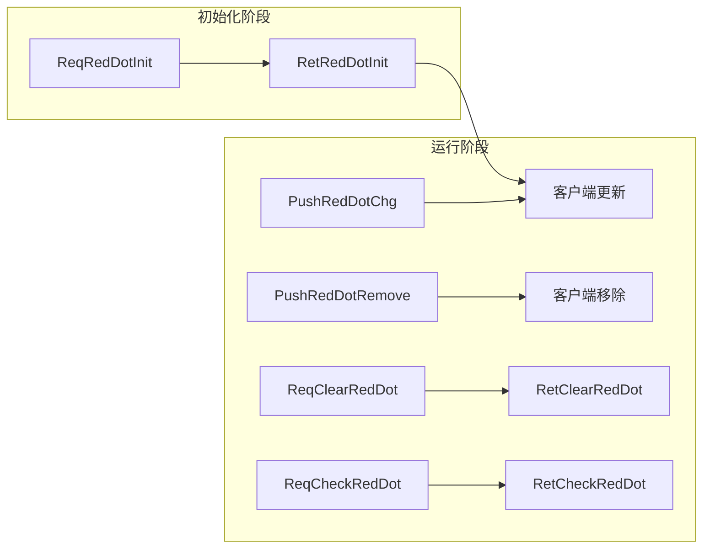

# 红点系统协议文档

## 协议模块编号: p002 (InitOp) / p007 (CommOp)

---

## 一、协议总览

### 1.1 协议分类

| 协议方向 | 协议模块 | 协议编号 | 协议名称 |
|----------|----------|----------|----------|
| GC2GS | p002_InitOp | 080 | ReqRedDotInit - 红点初始化请求 |
| GS2GC | p002_InitOp | 080 | RetRedDotInit - 红点初始化响应 |
| GC2GS | p007_CommOp | 031 | ReqClearRedDot - 清除红点请求 |
| GS2GC | p007_CommOp | 031 | RetClearRedDot - 清除红点响应 |
| GC2GS | p007_CommOp | 032 | ReqCheckRedDot - 检查红点请求 |
| GS2GC | p007_CommOp | 032 | RetCheckRedDot - 检查红点响应 |
| GS2GC | p007_CommOp | 059 | PushRedDotChg - 红点变化推送 |
| GS2GC | p007_CommOp | 060 | PushRedDotRemove - 红点移除推送 |

### 1.2 协议流程图



---

## 二、客户端请求协议 (GC2GS)

### 2.1 GC2GS_002_080_ReqRedDotInit - 请求红点初始化

**路径**: `game_server/ServerProtocol/src/GC2GS/p002_InitOp/GC2GS_002_080_ReqRedDotInit.java`

**功能说明**: 请求获取玩家所有红点状态

**协议编号**: 主协议=2, 子协议=80

| 字段名 | 类型 | 说明 |
|--------|------|------|
| (无参数) | - | - |

**数据包大小**: 0 字节

---

### 2.2 GC2GS_007_031_ReqClearRedDot - 清除红点请求

**路径**: `game_server/ServerProtocol/src/GC2GS/p007_CommOp/GC2GS_007_031_ReqClearRedDot.java`

**功能说明**: 清除指定类型的红点列表

**协议编号**: 主协议=7, 子协议=31

| 字段名 | 类型 | 说明 |
|--------|------|------|
| redDotTypes | ArrayList&lt;ERedDotType&gt; | 要清除的红点类型列表 |

**数据包大小**: 2 + (redDotTypes.size() * 4) 字节

**代码示例**:

```java
// 构造清除红点请求
ArrayList<ERedDotType> types = new ArrayList<>();
types.add(ERedDotType.RED_MAIL_NEW);
types.add(ERedDotType.RED_TASK_DAILY);

GC2GS_007_031_ReqClearRedDot req = new GC2GS_007_031_ReqClearRedDot(types);
```

---

### 2.3 GC2GS_007_032_ReqCheckRedDot - 检查红点请求

**路径**: `game_server/ServerProtocol/src/GC2GS/p007_CommOp/GC2GS_007_032_ReqCheckRedDot.java`

**功能说明**: 检查指定类型的红点状态

**协议编号**: 主协议=7, 子协议=32

| 字段名 | 类型 | 说明 |
|--------|------|------|
| redDotType | ERedDotType | 要检查的红点类型 |

**数据包大小**: 4 字节

**代码示例**:

```java
// 构造检查红点请求
GC2GS_007_032_ReqCheckRedDot req = new GC2GS_007_032_ReqCheckRedDot(ERedDotType.RED_MAIL_NEW);
```

---

## 三、服务端响应协议 (GS2GC)

### 3.1 GS2GC_002_080_RetRedDotInit - 返回红点初始化数据

**路径**: `game_server/ServerProtocol/src/GS2GC/p002_InitOp/GS2GC_002_080_RetRedDotInit.java`

**功能说明**: 返回玩家所有红点状态

**协议编号**: 主协议=2, 子协议=80

| 字段名 | 类型 | 说明 |
|--------|------|------|
| redDotList | ArrayList&lt;Common_RedDotInfo&gt; | 红点列表 |

**数据包大小**: 2 + (redDotList.size() * 16) 字节

**Common_RedDotInfo 结构**:

| 字段名 | 类型 | 说明 |
|--------|------|------|
| redDotType | ERedDotType | 红点类型 |
| needCheckTimeMs | long | 需要检查的时间点(毫秒) |

---

### 3.2 GS2GC_007_031_RetClearRedDot - 清除红点结果

**功能说明**: 返回清除红点结果

**协议编号**: 主协议=7, 子协议=31

| 字段名 | 类型 | 说明 |
|--------|------|------|
| (无参数) | - | 成功即表示清除完成 |

---

### 3.3 GS2GC_007_032_RetCheckRedDot - 检查红点结果

**功能说明**: 返回检查红点结果

**协议编号**: 主协议=7, 子协议=32

| 字段名 | 类型 | 说明 |
|--------|------|------|
| (无参数) | - | 成功即表示检查完成，状态变化通过推送协议通知 |

---

### 3.4 GS2GC_007_059_PushRedDotChg - 红点变化推送

**路径**: `game_server/ServerProtocol/src/GS2GC/p007_CommOp/GS2GC_007_059_PushRedDotChg.java`

**功能说明**: 推送红点添加或更新

**协议编号**: 主协议=7, 子协议=59

| 字段名 | 类型 | 说明 |
|--------|------|------|
| redDotInfo | Common_RedDotInfo | 红点信息 |

**数据包大小**: 16 字节

**代码示例**:

```java
// 构造红点变化推送
Common_RedDotInfo info = new Common_RedDotInfo();
info.setRedDotType(ERedDotType.RED_MAIL_NEW);
info.setNeedCheckTimeMs(0);

GS2GC_007_059_PushRedDotChg push = new GS2GC_007_059_PushRedDotChg(info);
```

---

### 3.5 GS2GC_007_060_PushRedDotRemove - 红点移除推送

**路径**: `game_server/ServerProtocol/src/GS2GC/p007_CommOp/GS2GC_007_060_PushRedDotRemove.java`

**功能说明**: 推送红点移除

**协议编号**: 主协议=7, 子协议=60

| 字段名 | 类型 | 说明 |
|--------|------|------|
| redDotType | ERedDotType | 移除的红点类型 |

**数据包大小**: 4 字节

**代码示例**:

```java
// 构造红点移除推送
GS2GC_007_060_PushRedDotRemove push = new GS2GC_007_060_PushRedDotRemove(ERedDotType.RED_MAIL_NEW);
```

---

## 四、协议序列图

### 4.1 红点初始化流程

```mermaid
sequenceDiagram
    participant C as 客户端 RedDotComponent
    participant N as 网络
    participant S as 服务端 MsgDealer_002_080
    participant R as RedDotComponent
    participant U as NPUSUserData

    C->>N: GC2GS_002_080_ReqRedDotInit
    Note right of C: presendInitProtocol()

    N->>S: 接收请求
    S->>U: 获取玩家数据
    S->>R: getAllRedDots()

    R->>R: lockUser()
    R->>R: 遍历 _m_redDotList
    R->>R: 转换为 Common_RedDotInfo
    R->>R: unlockUser()
    R-->>S: List&lt;Common_RedDotInfo&gt;

    S->>N: GS2GC_002_080_RetRedDotInit
    N->>C: 接收响应

    C->>C: retRedDotInit()
    C->>C: 存储到 _m_lRedDotDic
    C->>C: _dealRedDot() 处理显示
    C->>C: _checkNeedStartTickTask()
    C->>C: setInitDone()
```

### 4.2 红点清除流程

```mermaid
sequenceDiagram
    participant C as 客户端
    participant N as 网络
    participant S as 服务端 MsgDealer_007_031
    participant R as RedDotComponent

    C->>N: GC2GS_007_031_ReqClearRedDot
    Note right of C: reqClearRedDot(List&lt;ERedDotType&gt;)

    N->>S: 接收请求
    S->>S: 获取 redDotTypes 列表
    S->>R: clearRedDots(types, true)

    R->>R: 遍历类型列表
    R->>R: removeRedDot(type, true)
    R->>R: 从 _m_redDotList 移除
    R->>N: GS2GC_007_060_PushRedDotRemove (每个类型)

    N->>C: 接收推送
    C->>C: pushRedDotRemove()
    C->>C: 从 _m_lRedDotDic 移除
    C->>C: _dealRedDot(type, false) 隐藏

    S->>N: GS2GC_007_031_RetClearRedDot
    N->>C: 接收响应
```

### 4.3 红点检查流程

```mermaid
sequenceDiagram
    participant C as 客户端
    participant N as 网络
    participant S as 服务端 MsgDealer_007_032
    participant R as RedDotComponent
    participant D as _ARedDotDealer

    C->>N: GC2GS_007_032_ReqCheckRedDot
    Note right of C: reqCheckRedDot(ERedDotType)

    N->>S: 接收请求
    S->>R: checkAndUpdateRedDot(type, true)

    R->>D: getDealer(type)
    D-->>R: 返回处理器
    R->>D: checkRedDot()

    D->>D: 检查业务条件
    D-->>R: Pair&lt;Boolean, Long&gt;

    alt 应显示红点
        R->>R: 创建/更新 RedDotInfo
        R->>N: GS2GC_007_059_PushRedDotChg
        N->>C: pushRedDotChg()
        C->>C: 更新 _m_lRedDotDic
        C->>C: _dealRedDot(type, true) 显示
    else 不应显示红点
        R->>R: removeRedDot(type, true)
        R->>N: GS2GC_007_060_PushRedDotRemove
        N->>C: pushRedDotRemove()
        C->>C: 从 _m_lRedDotDic 移除
        C->>C: _dealRedDot(type, false) 隐藏
    end

    S->>N: GS2GC_007_032_RetCheckRedDot
    N->>C: 接收响应
```

### 4.4 服务端主动推送流程

```mermaid
sequenceDiagram
    participant B as 业务模块
    participant R as RedDotComponent
    participant D as _ARedDotDealer
    participant N as 网络
    participant C as 客户端

    B->>R: 检测到条件变化
    B->>R: checkAndUpdateRedDot(type, true)

    R->>D: getDealer(type)
    R->>D: checkRedDot()
    D-->>R: Pair&lt;Boolean, Long&gt;

    alt 应显示红点
        R->>R: 创建/更新 RedDotInfo
        R->>N: GS2GC_007_059_PushRedDotChg
        N->>C: 接收推送
        C->>C: pushRedDotChg()
        C->>C: 存储到 _m_lRedDotDic
        C->>C: _dealRedDot(type, true) 显示
    else 不应显示红点
        R->>R: removeRedDot(type, true)
        R->>N: GS2GC_007_060_PushRedDotRemove
        N->>C: 接收推送
        C->>C: pushRedDotRemove()
        C->>C: 从 _m_lRedDotDic 移除
        C->>C: _dealRedDot(type, false) 隐藏
    end
```

---

## 五、客户端协议处理代码

### 5.1 初始化响应处理

```csharp
/// <summary>
/// 初始化响应处理
/// </summary>
public void retRedDotInit(GS2GC_002_080_RetRedDotInit _msg)
{
    if (_msg == null)
        return;

    // 存储所有红点信息
    for (int i = 0; i < _msg.getRedDotList().Count; i++)
    {
        RedDotInfo info = new RedDotInfo(_msg.getRedDotList()[i]);
        _m_lRedDotDic[_msg.getRedDotList()[i].getRedDotType()] = info;
    }

    // 处理每个红点类型的显示
    for (int i = 0; i < ERedDotTypeComparer.g_iEnumCount; i++)
    {
        ERedDotType type = (ERedDotType)i;
        if (type != ERedDotType.NONE)
        {
            _dealRedDot(type, _m_lRedDotDic.ContainsKey(type));
        }
    }

    // 检查是否需要开启定时任务
    _checkNeedStartTickTask();
    setInitDone();
}
```

### 5.2 红点变化推送处理

```csharp
/// <summary>
/// 新增红点推送处理
/// </summary>
public void pushRedDotChg(GS2GC_007_059_PushRedDotChg _msg)
{
    if (_msg == null)
        return;

    ERedDotType type = _msg.getRedDotInfo().getRedDotType();

    if (_m_lRedDotDic.ContainsKey(type))
    {
        // 更新已存在的红点
        _m_lRedDotDic[type].updateInfo(_msg.getRedDotInfo());
    }
    else
    {
        // 添加新红点
        RedDotInfo info = new RedDotInfo(_msg.getRedDotInfo());
        _m_lRedDotDic[type] = info;
    }

    // 检查定时任务
    _checkNeedStartTickTask();

    // 触发显示
    _dealRedDot(type, true);
}
```

### 5.3 红点移除推送处理

```csharp
/// <summary>
/// 移除红点推送处理
/// </summary>
public void pushRedDotRemove(GS2GC_007_060_PushRedDotRemove _msg)
{
    if (_msg == null)
        return;

    ERedDotType redDotType = _msg.getRedDotType();

    if (_m_lRedDotDic.ContainsKey(redDotType))
    {
        _m_lRedDotDic.Remove(redDotType);
    }

    // 检查定时任务
    _checkNeedStartTickTask();

    // 触发隐藏
    _dealRedDot(redDotType, false);
}
```

---

## 六、红点特性

### 6.1 内存存储

红点系统只在内存中维护数据，不进行数据库持久化。

### 6.2 自动推送

当红点状态变化时，服务端自动推送到客户端。

### 6.3 过期机制

红点支持过期时间(needCheckTimeMs)，客户端定时检查过期状态：

- needCheckTimeMs > 0：表示需要定时检查
- needCheckTimeMs = 0：表示无需定时检查
- 当 needCheckTimeMs <= 当前服务器时间时，客户端主动请求检查

---

## 七、协议字段完整对照表

| 协议名称 | 方向 | 主协议 | 子协议 | 字段1 | 字段2 |
|----------|------|--------|--------|-------|-------|
| ReqRedDotInit | GC2GS | 2 | 80 | - | - |
| RetRedDotInit | GS2GC | 2 | 80 | redDotList | - |
| ReqClearRedDot | GC2GS | 7 | 31 | redDotTypes | - |
| RetClearRedDot | GS2GC | 7 | 31 | - | - |
| ReqCheckRedDot | GC2GS | 7 | 32 | redDotType | - |
| RetCheckRedDot | GS2GC | 7 | 32 | - | - |
| PushRedDotChg | GS2GC | 7 | 59 | redDotInfo | - |
| PushRedDotRemove | GS2GC | 7 | 60 | redDotType | - |

---

*文档生成时间: 2026-04-12*