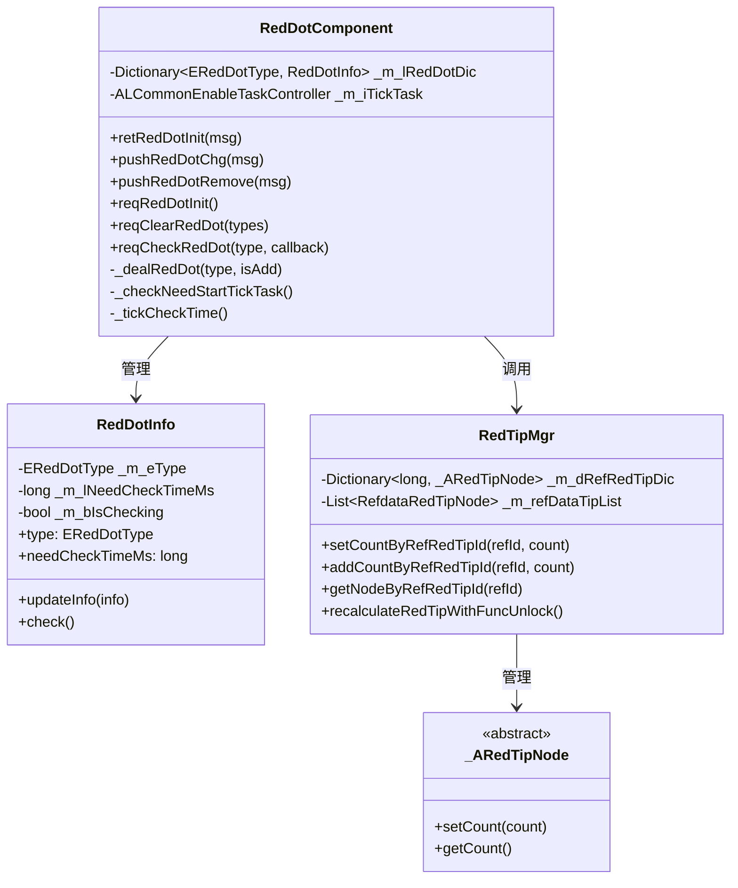
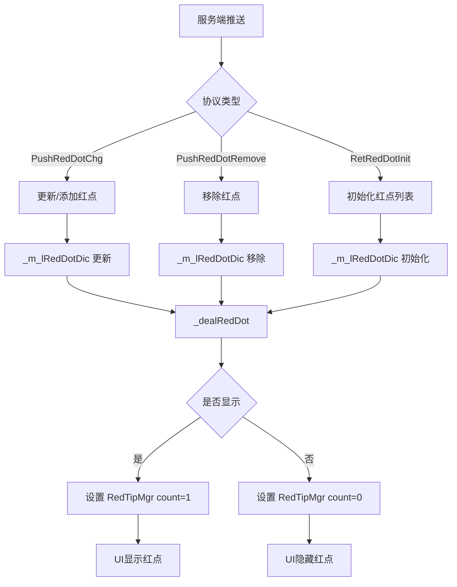
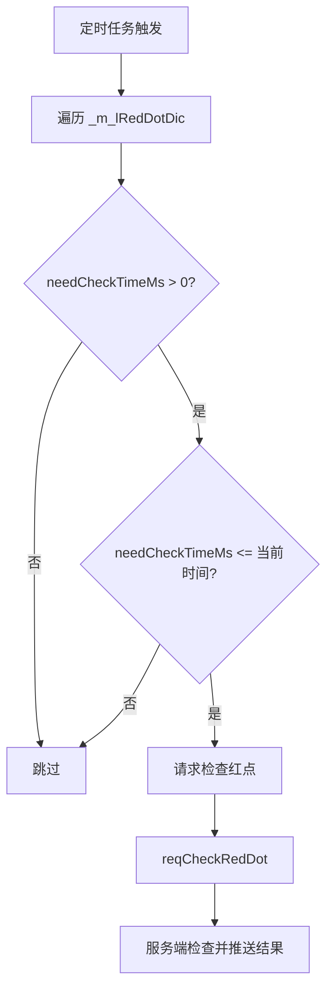
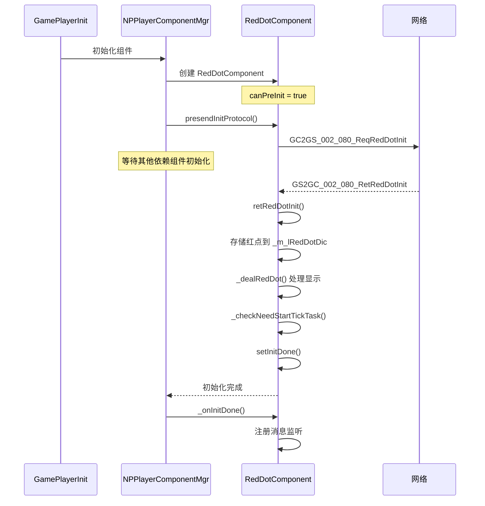

# 红点系统客户端开发文档

## 一、模块架构

### 1.1 模块概述

红点系统客户端负责：
- 接收并存储服务端推送的红点状态
- 管理本地红点显示逻辑
- 提供红点查询和清除接口

### 1.2 架构图



---

## 二、组件数据层

### 2.1 RedDotComponent - 红点组件

**路径**: `game_client/Assets/Scripts/LogicScripts/GameComponent/RedDot/RedDotComponent.cs`

**组件类型**: `ENPPlayerCompType.RED_DOT`

**依赖组件**: `ENPPlayerCompType.GUILD`

| 字段名 | 类型 | 说明 |
|--------|------|------|
| _m_lRedDotDic | Dictionary&lt;ERedDotType, RedDotInfo&gt; | 需要展示的红点字典 |
| _m_iTickTask | ALCommonEnableTaskController | 定时任务控制器 |

**主要方法**:

| 方法名 | 参数 | 返回值 | 说明 |
|--------|------|--------|------|
| retRedDotInit | GS2GC_002_080_RetRedDotInit | void | 初始化响应处理 |
| pushRedDotChg | GS2GC_007_059_PushRedDotChg | void | 红点变化推送处理 |
| pushRedDotRemove | GS2GC_007_060_PushRedDotRemove | void | 红点移除推送处理 |
| reqRedDotInit | - | void | 请求红点初始化 |
| reqClearRedDot | List&lt;ERedDotType&gt; | void | 请求清除红点 |
| reqCheckRedDot | ERedDotType, Action | void | 请求检查红点状态 |

### 2.2 RedDotInfo - 红点信息

**路径**: `game_client/Assets/Scripts/LogicScripts/GameComponent/RedDot/RedDotInfo.cs`

| 字段名 | 类型 | 说明 |
|--------|------|------|
| _m_eType | ERedDotType | 红点类型 |
| _m_lNeedCheckTimeMs | long | 需要检查的时间点(毫秒) |
| _m_bIsChecking | bool | 是否正在请求检查 |

**属性**:

| 属性名 | 类型 | 说明 |
|--------|------|------|
| type | ERedDotType | 红点类型 |
| needCheckTimeMs | long | 需要检查的时间点 |

**主要方法**:

| 方法名 | 参数 | 返回值 | 说明 |
|--------|------|--------|------|
| updateInfo | Common_RedDotInfo | void | 更新红点数据 |
| check | - | void | 检查红点（触发服务端检查） |

---

## 三、RedTipMgr - 全局红点管理器

### 3.1 概述

RedTipMgr 是基于配表的红点管理器，负责管理客户端所有配表定义的红点状态。

**路径**: `game_client/Assets/Scripts/LogicScripts/Common/RedTip/RedTipMgr.cs`

### 3.2 字段列表

| 字段名 | 类型 | 说明 |
|--------|------|------|
| _g_instance | RedTipMgr | 单例实例 |
| _m_dRefRedTipDic | Dictionary&lt;long, _ARedTipNode&gt; | 配表红点字典（键为表中红点Id） |
| _m_refDataTipList | List&lt;RefdataRedTipNode&gt; | 配表红点列表 |
| _m_dSimpleUnlockTriggerRecalDic | Dictionary&lt;long, Action&gt; | 配置了simpleUnlock的红点刷新字典 |

### 3.3 主要方法

| 方法名 | 参数 | 返回值 | 说明 |
|--------|------|--------|------|
| getNodeByRefRedTipId | long _refId | _ARedTipNode | 根据配表id获取红点数据 |
| setCountByRefRedTipId | long _refId, long _count | bool | 设置红点数量 |
| addCountByRefRedTipId | long _refId, long _count | bool | 增加红点数量 |
| addRedTipNodeWithParent | _ARedTipNode, long _parentRedRefId | void | 动态注册红点（带父节点） |
| recalculateRedTipWithFuncUnlock | - | void | 重新计算带有FuncUnlock配置的红点 |

---

## 四、红点使用示例

### 4.1 设置红点数量

```csharp
// 设置红点数量
RedTipMgr.instance.setCountByRefRedTipId(RedTipConst.RED_PRIVILEGE_CARD, 1);

// 增加红点数量
RedTipMgr.instance.addCountByRefRedTipId(RedTipConst.RED_PRIVILEGE_CARD, 1);

// 清除红点
RedTipMgr.instance.setCountByRefRedTipId(RedTipConst.RED_PRIVILEGE_CARD, 0);
```

### 4.2 刷新红点

```csharp
// 在模块数据变化时刷新红点
private void _refreshRedTip()
{
    long redTipCount = 0;
    foreach (var item in itemList)
    {
        if (item.needShowRedTip)
            redTipCount++;
    }
    RedTipMgr.instance.setCountByRefRedTipId(RedTipConst.MY_MODULE, redTipCount);
}
```

### 4.3 请求清除红点

```csharp
// 清除单个红点
List<ERedDotType> types = new List<ERedDotType>();
types.Add(ERedDotType.RED_MAIL_NEW);
NPPlayer.instance.redDotComp.reqClearRedDot(types);

// 清除多个红点
List<ERedDotType> types = new List<ERedDotType>();
types.Add(ERedDotType.RED_MAIL_NEW);
types.Add(ERedDotType.RED_TASK_DAILY);
NPPlayer.instance.redDotComp.reqClearRedDot(types);
```

### 4.4 请求检查红点

```csharp
// 检查红点状态
NPPlayer.instance.redDotComp.reqCheckRedDot(ERedDotType.RED_MAIL_NEW, () =>
{
    Debug.Log("红点检查完成");
});
```

---

## 五、红点显示

### 5.1 UI绑定示例

红点通常绑定在UI元素上：

```csharp
// 红点组件绑定
public class RedTipMono : MonoBehaviour
{
    [SerializeField] private int _redTipId;
    [SerializeField] private GameObject _redTipObj;

    private void OnEnable()
    {
        _refreshRedTip();
        WinMsg.RegisterMsgAct(WinMsgType.ON_RED_TIP_CHG, _onRedTipChg);
    }

    private void OnDisable()
    {
        WinMsg.UnregisterMsgAct(WinMsgType.ON_RED_TIP_CHG, _onRedTipChg);
    }

    private void _refreshRedTip()
    {
        long count = RedTipMgr.instance.getNodeByRefRedTipId(_redTipId)?.getCount() ?? 0;
        _redTipObj.SetActive(count > 0);
    }

    private void _onRedTipChg(int redTipId)
    {
        if (redTipId == _redTipId)
            _refreshRedTip();
    }
}
```

### 5.2 红点组件处理流程



---

## 六、消息事件

### 6.1 红点相关消息

| 消息类型 | 说明 |
|----------|------|
| ON_RED_TIP_CHG | 红点变化 |
| ON_CROSS_DAY | 跨天事件(触发红点刷新) |
| ON_JOIN_GUILD | 加入联盟 |
| ON_LEAVE_GUILD | 退出联盟 |
| ON_GUILD_MEMBER_WEEK_DATA_CHG | 联盟成员每周数据变更 |
| ON_NEW_FUNCTION_UNLOCK_SHOW | 新功能解锁 |

### 6.2 消息注册示例

```csharp
// 组件加载完成时注册消息
protected override void _onInitDone()
{
    WinMsg.RegisterMsg(WinMsgType.ON_JOIN_GUILD, _onJoinGuild);
    WinMsg.RegisterMsg(WinMsgType.ON_LEAVE_GUILD, _onLeaveGuild);
    WinMsg.RegisterMsgAct(WinMsgType.ON_GUILD_MEMBER_WEEK_DATA_CHG, _onGuildMemberWeekDataChg);
}

// 组件释放时注销消息
protected override void _discard()
{
    WinMsg.UnregisterMsg(WinMsgType.ON_JOIN_GUILD, _onJoinGuild);
    WinMsg.UnregisterMsg(WinMsgType.ON_LEAVE_GUILD, _onLeaveGuild);
    WinMsg.UnregisterMsgAct(WinMsgType.ON_GUILD_MEMBER_WEEK_DATA_CHG, _onGuildMemberWeekDataChg);
}
```

---

## 七、定时检查机制

### 7.1 过期检查

客户端定时检查红点的过期状态：

```csharp
/// <summary>
/// 检查是否需要开启定时任务
/// </summary>
private void _checkNeedStartTickTask()
{
    _m_iTickTask.setDisable();

    bool needCheck = false;
    foreach (RedDotInfo redDotInfo in _m_lRedDotDic.Values)
    {
        if (redDotInfo != null && redDotInfo.needCheckTimeMs > 0)
        {
            needCheck = true;
            break;
        }
    }

    if (needCheck)
        _m_iTickTask = ALCommonTaskController.CommonEnableDurationActionAddMonoTask(_tickCheckTime, 1.0f);
}

/// <summary>
/// 定时检查时间
/// </summary>
private void _tickCheckTime()
{
    foreach (RedDotInfo redDotInfo in _m_lRedDotDic.Values)
    {
        redDotInfo?.check();
    }
}
```

### 7.2 过期检查流程



---

## 八、红点处理器

### 8.1 客户端红点处理器

各模块可实现自己的红点处理器：

```csharp
public class RedTipDealer
{
    private PlayerTitleComponent _comp;

    public RedTipDealer(PlayerTitleComponent _comp)
    {
        this._comp = _comp;
    }

    public void onAddTitle(long titleId)
    {
        // 新称号添加红点
        RedTipMgr.instance.addCountByRefRedTipId(RedTipConst.TITLE_NEW, 1);
    }

    public void readTitle(long titleId)
    {
        // 称号已读，减少红点
        RedTipMgr.instance.addCountByRefRedTipId(RedTipConst.TITLE_NEW, -1);
    }
}
```

### 8.2 处理器示例 - 权益卡红点

```csharp
public class PrivilegeCardComponent
{
    private void _refreshRedTip()
    {
        long count = 0;
        foreach (var card in _m_cardList)
        {
            if (card.canGetRewardToday())
                count++;
        }
        RedTipMgr.instance.setCountByRefRedTipId(RedTipConst.RED_PRIVILEGE_CARD, count);
    }
}
```

---

## 九、组件初始化流程



---

*文档生成时间: 2026-04-12*