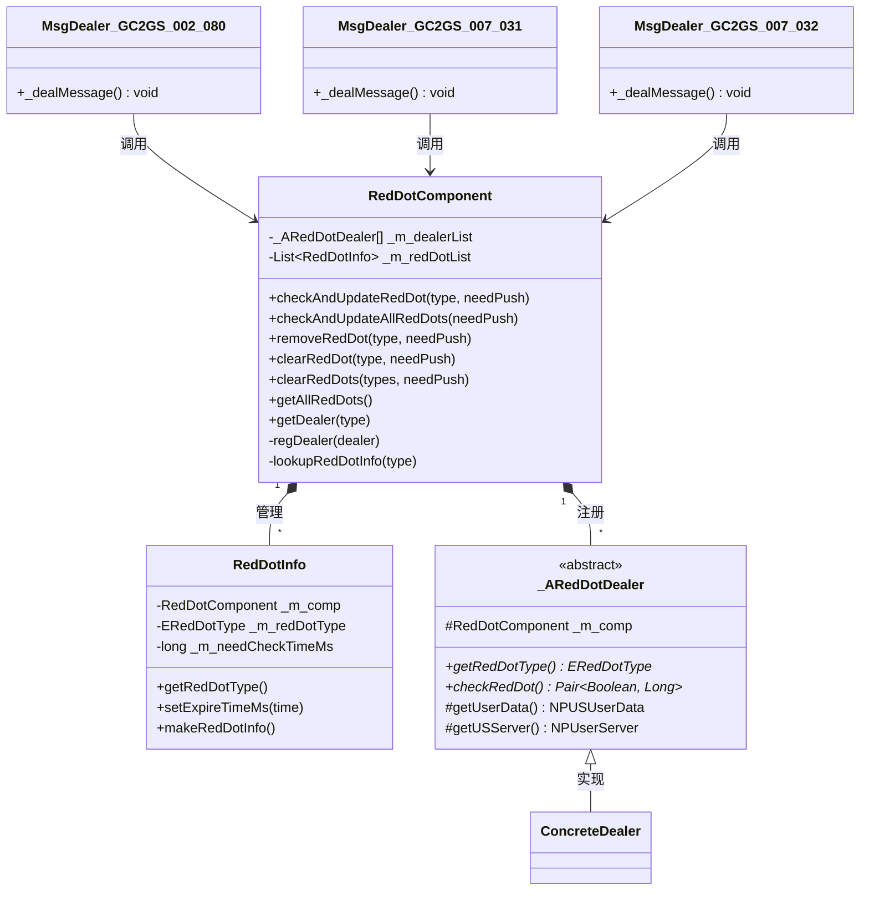
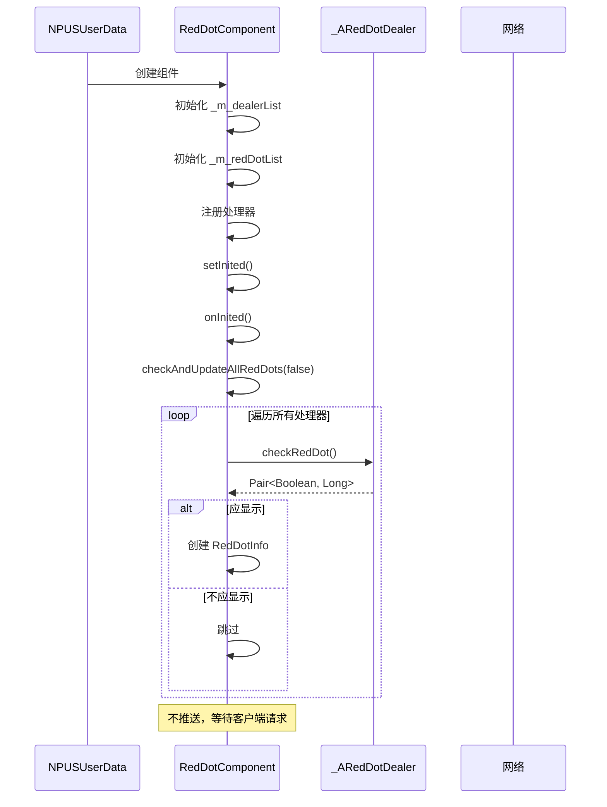
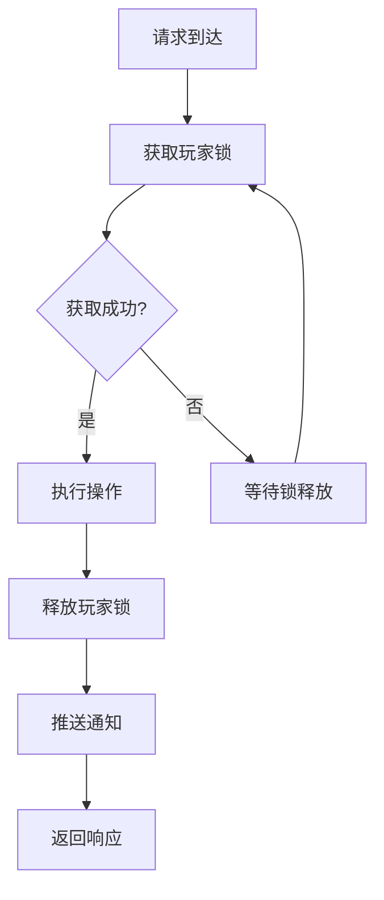

# 红点系统服务端开发文档

## 一、模块架构

### 1.1 模块概述

红点系统（RedDot System）负责管理玩家的红点状态，特点如下：
- 内存维护，无数据库开销
- 自动推送状态变化到客户端
- 支持扩展的红点处理器机制

### 1.2 架构图



### 1.3 组件类型

组件类型: `ENPPlayerCompType.RED_DOT_COMP`

---

## 二、核心数据结构

### 2.1 红点组件 (RedDotComponent)

**路径**: `game_server/UserServer/src/NPUSServer/NPUSUserMgr/UserComp/RedDotComp/RedDotComponent.java`

| 字段名 | 类型 | 说明 |
|--------|------|------|
| _m_dealerList | _ARedDotDealer[] | 红点处理器数组（通过枚举ordinal索引） |
| _m_redDotList | List&lt;RedDotInfo&gt; | 当前激活的红点集合 |

### 2.2 红点信息 (RedDotInfo)

**路径**: `game_server/UserServer/src/NPUSServer/NPUSUserMgr/UserComp/RedDotComp/RedDotInfo.java`

| 字段名 | 类型 | 说明 |
|--------|------|------|
| _m_comp | RedDotComponent | 所属红点组件 |
| _m_redDotType | ERedDotType | 红点类型 |
| _m_needCheckTimeMs | long | 需要检查的时间点(毫秒时间戳) |

| 方法名 | 返回类型 | 说明 |
|--------|----------|------|
| getRedDotType() | ERedDotType | 获取红点类型 |
| setExpireTimeMs(Long) | void | 设置过期时间 |
| makeRedDotInfo() | Common_RedDotInfo | 转换为协议结构 |

---

## 三、设计特点

### 3.1 数组索引模式

通过枚举ordinal()快速访问处理器：

```java
_m_dealerList = new _ARedDotDealer[ERedDotType.ERedDotType_Length];
```

**优势**：
- O(1) 时间复杂度访问处理器
- 无需维护额外的映射表

### 3.2 扩展性

新增红点类型只需：
1. 添加枚举值到 ERedDotType
2. 实现 _ARedDotDealer 子类
3. 在 RedDotComponent 构造函数中注册处理器

### 3.3 轻量级

只在内存维护，无数据库开销：
- 登录时重新计算所有红点状态
- 状态变化时实时推送

### 3.4 自动推送

状态变化时自动通知客户端：
- checkAndUpdateRedDot 方法在更新后自动推送
- removeRedDot 方法在移除后自动推送

---

## 四、核心逻辑

### 4.1 添加红点

```java
/**
 * 通过处理器检查并更新红点状态
 */
public void checkAndUpdateRedDot(ERedDotType _type, boolean _needPush)
{
    // 1. 获取处理器
    _ARedDotDealer dealer = getDealer(_type);
    if (dealer == null)
    {
        return;
    }

    // 2. 通过处理器检查红点是否应该显示
    WCGPair<Boolean, Long> showInfo = dealer.checkRedDot();
    if (showInfo == null || !showInfo.first)
    {
        // 3. 不应该显示，移除红点
        removeRedDot(_type, _needPush);
    }
    else
    {
        // 4. 应该显示，创建或更新红点
        RedDotInfo redDotInfo = lookupRedDotInfo(_type);
        if (redDotInfo == null)
        {
            // 创建新红点
            redDotInfo = new RedDotInfo(this, _type, showInfo.second);
            _m_redDotList.add(redDotInfo);
        }
        else
        {
            // 更新过期时间
            redDotInfo.setExpireTimeMs(showInfo.second);
        }

        // 5. 推送红点变化
        if (_needPush)
            getUserData().pushMsgToGC(US2GCWriter_007_CommOp.make_059_PushRedDotChg(redDotInfo.makeRedDotInfo()));
    }
}
```

### 4.2 移除红点

```java
/**
 * 移除红点
 */
public void removeRedDot(ERedDotType _type, boolean _needPush)
{
    if (_type == null || _type == ERedDotType.NONE)
    {
        return;
    }

    // 加锁保护并发访问
    getUserData().lockUser();
    try
    {
        RedDotInfo redDotInfo = lookupRedDotInfo(_type);
        if (redDotInfo == null)
            return;

        // 如果红点存在且被移除，推送到客户端
        if (_m_redDotList.remove(redDotInfo) && _needPush)
        {
            getUserData().pushMsgToGC(US2GCWriter_007_CommOp.make_060_PushRedDotRemove(_type));
        }
    }
    finally
    {
        getUserData().unlockUser();
    }
}
```

### 4.3 清除红点

```java
/**
 * 清除单个红点（客户端已读后调用）
 */
public void clearRedDot(ERedDotType _type, boolean _needPush)
{
    removeRedDot(_type, _needPush);
}

/**
 * 批量清除红点
 */
public void clearRedDots(List<ERedDotType> _types, boolean _needPush)
{
    if (_types == null || _types.isEmpty())
    {
        return;
    }

    for (ERedDotType type : _types)
    {
        clearRedDot(type, _needPush);
    }
}
```

### 4.4 获取所有红点

```java
/**
 * 获取所有激活的红点（用于初始化协议）
 */
public List<Common_RedDotInfo> getAllRedDots()
{
    getUserData().lockUser();
    try
    {
        List<Common_RedDotInfo> list = new ArrayList<>();
        for (RedDotInfo redDotInfo : _m_redDotList)
        {
            list.add(redDotInfo.makeRedDotInfo());
        }
        return list;
    }
    finally
    {
        getUserData().unlockUser();
    }
}
```

---

## 五、红点处理器

### 5.1 处理器基类

```java
/**
 * 红点处理器抽象基类
 *
 * 设计模式：策略模式 - 不同红点类型对应不同的检查策略
 */
public abstract class _ARedDotDealer
{
    // 持有红点组件引用
    protected RedDotComponent _m_comp;

    /**
     * 构造函数
     */
    public _ARedDotDealer(RedDotComponent _comp) {
        _m_comp = _comp;
    }

    /**
     * 返回当前处理器处理的红点类型
     */
    public abstract ERedDotType getRedDotType();

    /**
     * 检查当前是否应该显示红点（核心扩展方法）
     * @return Pair<是否显示, 过期时间(毫秒)>
     */
    public abstract WCGPair<Boolean, Long> checkRedDot();

    /**
     * 获取玩家数据对象
     */
    protected NPUSUserData getUserData() {
        return _m_comp.getUserData();
    }

    /**
     * 获取UserServer对象
     */
    protected NPUserServer getUSServer() {
        return _m_comp.getUSServer();
    }
}
```

### 5.2 注册处理器

```java
/**
 * 注册红点处理器
 */
private void regDealer(_ARedDotDealer _dealer)
{
    _m_dealerList[_dealer.getRedDotType().ordinal()] = _dealer;
}
```

### 5.3 处理器实现示例

```java
/**
 * 权益卡红点处理器
 */
public class PrivilegeCardRedDotDealer extends _ARedDotDealer
{
    public PrivilegeCardRedDotDealer(RedDotComponent comp)
    {
        super(comp);
    }

    @Override
    public ERedDotType getRedDotType()
    {
        return ERedDotType.RED_PRIVILEGE_CARD;
    }

    @Override
    public WCGPair<Boolean, Long> checkRedDot()
    {
        // 获取权益卡组件
        PrivilegeCardComponent cardComp = getUserData().getPrivilegeCardComponent();

        // 检查是否有可领取的每日奖励
        for (PrivilegeCard card : cardComp.getAllCards())
        {
            if (card.canGetRewardToday())
            {
                // 有可领取奖励，显示红点
                // 过期时间为次日零点
                long expireTime = getNextDayZeroTime();
                return new WCGPair<>(true, expireTime);
            }
        }

        // 无可领取奖励，不显示红点
        return new WCGPair<>(false, 0L);
    }

    private long getNextDayZeroTime()
    {
        // 计算次日零点时间戳
        Calendar calendar = Calendar.getInstance();
        calendar.add(Calendar.DAY_OF_MONTH, 1);
        calendar.set(Calendar.HOUR_OF_DAY, 0);
        calendar.set(Calendar.MINUTE, 0);
        calendar.set(Calendar.SECOND, 0);
        calendar.set(Calendar.MILLISECOND, 0);
        return calendar.getTimeInMillis();
    }
}
```

---

## 六、初始化流程

### 6.1 组件初始化

```java
@Override
protected void _init()
{
    // 内存维护，无需从数据库加载数据
    // 直接标记为初始化完成
    setInited();
}

@Override
public void onInited()
{
    // 首次检查所有红点状态
    checkAndUpdateAllRedDots(false);
}
```

### 6.2 初始化流程图



---

## 七、消息处理器

### 7.1 初始化请求处理器

**路径**: `game_server/UserServer/src/NPUSServer/NPUserMsgDispather/p002_InitOp/MsgDealer_GC2GS_002_080_ReqRedDotInit.java`

```java
/**
 * 红点初始化请求处理器
 */
public class MsgDealer_GC2GS_002_080_ReqRedDotInit extends NPUserMsgDealer<GC2GS_002_080_ReqRedDotInit> {

    @Override
    protected void _dealMessage(_ANPUSUserBasicMsgItem _commiter, GC2GS_002_080_ReqRedDotInit _msg) {
        NPUSUserData userData = _commiter.getUserData();
        if (null == userData) {
            return;
        }

        // 获取所有激活的红点列表
        List<Common_RedDotInfo> redDotList = userData.getRedDotComponent().getAllRedDots();

        // 返回初始化响应
        _commiter.commitSucRes(US2GCWriter_002_InitOp.make_080_RetRedDotInit(redDotList));
    }
}
```

### 7.2 清除红点请求处理器

**路径**: `game_server/UserServer/src/NPUSServer/NPUserMsgDispather/p007_CommOp/MsgDealer_GC2GS_007_031_ReqClearRedDot.java`

```java
/**
 * 清除红点请求处理器
 */
public class MsgDealer_GC2GS_007_031_ReqClearRedDot extends NPUserMsgDealer<GC2GS_007_031_ReqClearRedDot> {

    @Override
    protected void _dealMessage(_ANPUSUserBasicMsgItem _commiter, GC2GS_007_031_ReqClearRedDot _msg) {
        NPUSUserData userData = _commiter.getUserData();
        if (null == userData) {
            return;
        }

        // 获取要清除的红点类型列表
        List<ERedDotType> redDotTypes = _msg.getRedDotTypes();
        if (redDotTypes == null || redDotTypes.isEmpty()) {
            _commiter.commitSucRes(US2GCWriter_007_CommOp.make_031_RetClearRedDot());
            return;
        }

        // 批量清除红点
        userData.getRedDotComponent().clearRedDots(redDotTypes, true);

        // 返回清除响应
        _commiter.commitSucRes(US2GCWriter_007_CommOp.make_031_RetClearRedDot());
    }
}
```

### 7.3 检查红点请求处理器

**路径**: `game_server/UserServer/src/NPUSServer/NPUserMsgDispather/p007_CommOp/MsgDealer_GC2GS_007_032_ReqCheckRedDot.java`

```java
/**
 * 检查红点状态请求处理器
 */
public class MsgDealer_GC2GS_007_032_ReqCheckRedDot extends NPUserMsgDealer<GC2GS_007_032_ReqCheckRedDot> {

    @Override
    protected void _dealMessage(_ANPUSUserBasicMsgItem _commiter, GC2GS_007_032_ReqCheckRedDot _msg) {
        NPUSUserData userData = _commiter.getUserData();
        if (null == userData) {
            return;
        }

        ERedDotType redDotType = _msg.getRedDotType();
        if (redDotType == null || redDotType == ERedDotType.NONE) {
            _commiter.commitSucRes(US2GCWriter_007_CommOp.make_032_RetCheckRedDot());
            return;
        }

        RedDotComponent redDotComp = userData.getRedDotComponent();

        // 检查红点是否应该显示（自动推送变化）
        redDotComp.checkAndUpdateRedDot(redDotType, true);

        // 返回成功响应
        _commiter.commitSucRes(US2GCWriter_007_CommOp.make_032_RetCheckRedDot());
    }
}
```

---

## 八、线程安全

### 8.1 锁机制

所有公开方法都使用玩家锁保护：

```java
public void removeRedDot(ERedDotType _type, boolean _needPush)
{
    // ...
    getUserData().lockUser();
    try
    {
        // 操作红点列表
    }
    finally
    {
        getUserData().unlockUser();
    }
}

public List<Common_RedDotInfo> getAllRedDots()
{
    getUserData().lockUser();
    try
    {
        // 读取红点列表
    }
    finally
    {
        getUserData().unlockUser();
    }
}
```

### 8.2 线程安全流程图



---

## 九、扩展指南

### 9.1 新增红点类型步骤

1. **添加枚举值**

```java
// ERedDotType.java
public enum ERedDotType {
    NONE,
    RED_NEW_TYPE,  // 新增红点类型
}
```

2. **实现处理器**

```java
public class NewTypeRedDotDealer extends _ARedDotDealer
{
    public NewTypeRedDotDealer(RedDotComponent comp)
    {
        super(comp);
    }

    @Override
    public ERedDotType getRedDotType()
    {
        return ERedDotType.RED_NEW_TYPE;
    }

    @Override
    public WCGPair<Boolean, Long> checkRedDot()
    {
        // 实现检查逻辑
        boolean shouldShow = checkCondition();
        long expireTime = calculateExpireTime();
        return new WCGPair<>(shouldShow, expireTime);
    }
}
```

3. **注册处理器**

```java
// RedDotComponent 构造函数
public RedDotComponent(NPUSUserData _userData)
{
    // ...
    regDealer(new NewTypeRedDotDealer(this));
}
```

---

*文档生成时间: 2026-04-12*