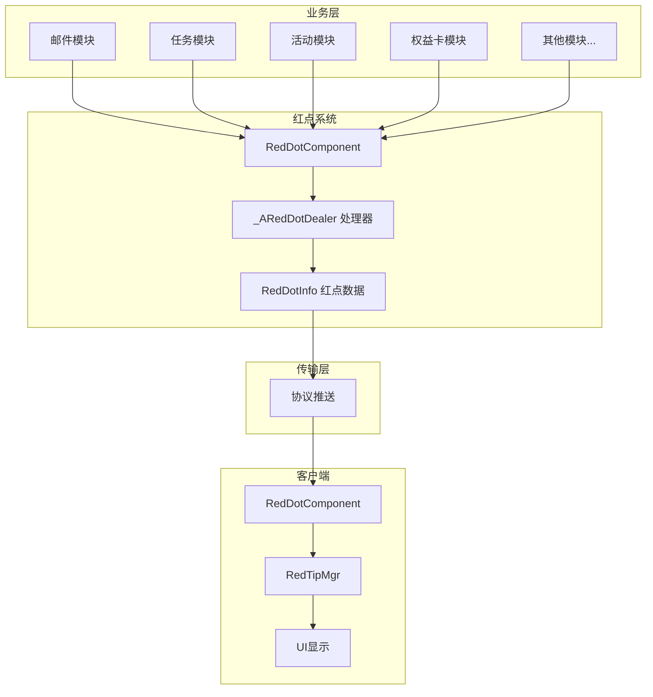
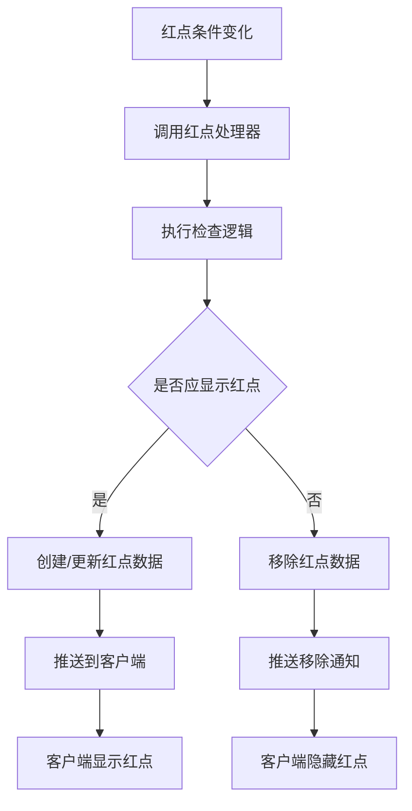
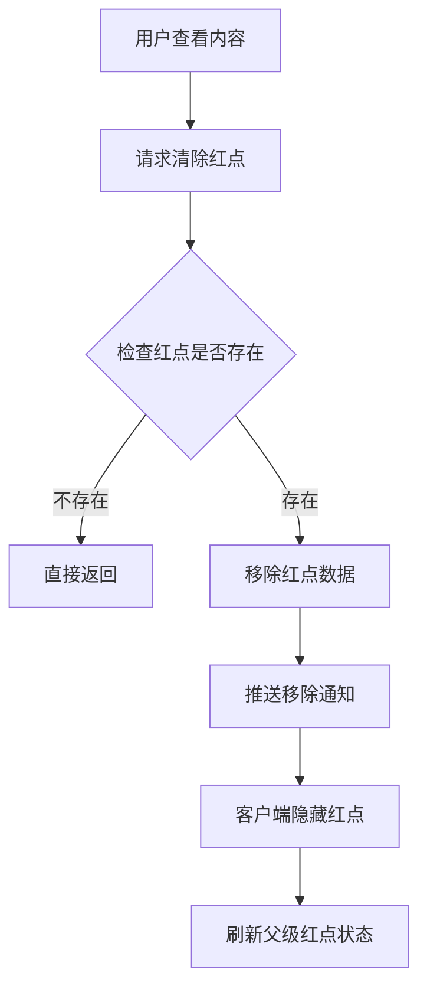
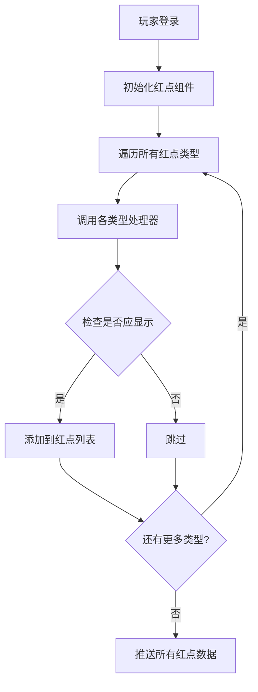
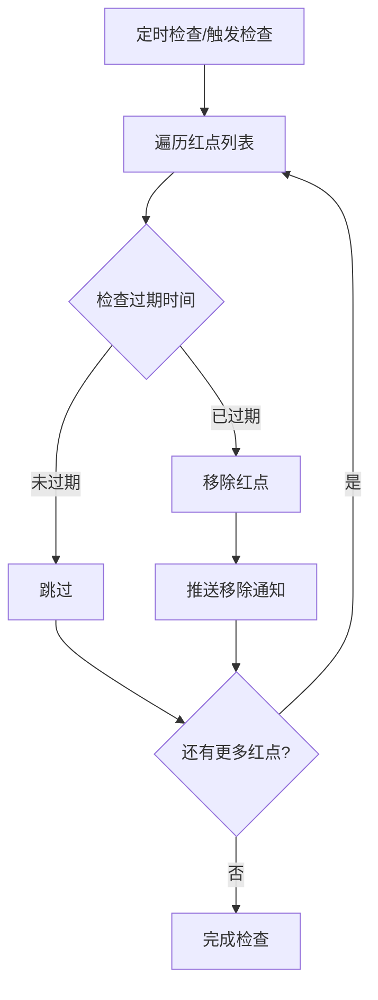
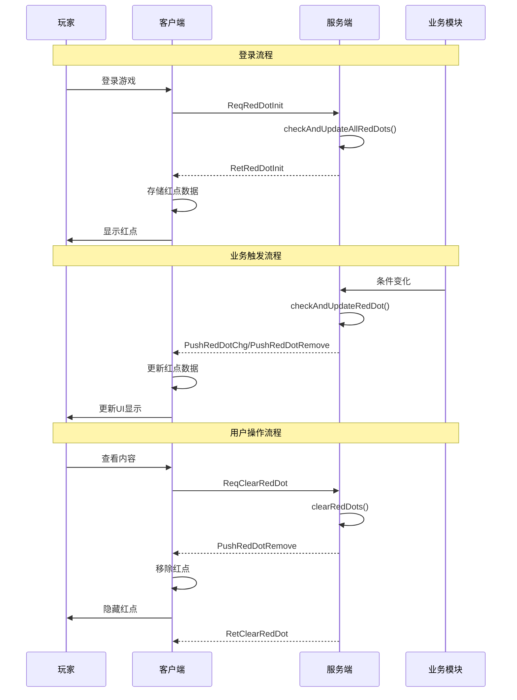

# 红点模块完整说明

## 一、模块概述

### 1.1 业务背景

红点模块是 K2C 游戏的提示引导系统，负责管理各类游戏内容的红点提示状态。红点系统帮助玩家快速发现有新内容、可领取奖励或未完成事项，是提升用户体验和引导玩家行为的重要工具。

### 1.2 目标用户

- **所有游戏玩家**：红点帮助玩家发现新内容
- **UI/UX设计师**：设计红点展示逻辑
- **运营人员**：配置活动红点提示
- **开发人员**：实现红点功能

### 1.3 核心价值

1. **内容提示**：帮助玩家发现有新内容
2. **行为引导**：引导玩家关注重要功能
3. **减少遗漏**：降低玩家错过奖励的概率
4. **提升体验**：减少玩家查找成本

### 1.4 系统架构



---

## 二、功能清单

### 2.1 红点管理功能

| 功能名称 | 功能描述 | 用户价值 |
|---------|---------|---------|
| 红点显示 | 在UI上显示红点标记 | 提示有新内容 |
| 红点隐藏 | 清除红点标记 | 表示已处理 |
| 红点计数 | 显示具体数量 | 了解内容数量 |
| 红点过期 | 自动过期消失 | 避免过期提示 |

### 2.2 红点类型功能

| 功能名称 | 功能描述 | 用户价值 |
|---------|---------|---------|
| 新内容红点 | 有新内容时的提示 | 发现新功能 |
| 奖励红点 | 有可领取奖励的提示 | 及时领取奖励 |
| 任务红点 | 有未完成任务的提示 | 引导完成任务 |
| 活动红点 | 有新活动的提示 | 参与活动 |

### 2.3 红点层级功能

| 功能名称 | 功能描述 | 用户价值 |
|---------|---------|---------|
| 一级红点 | 主界面入口红点 | 发现有内容待处理 |
| 二级红点 | 子页面入口红点 | 定位具体位置 |
| 三级红点 | 具体功能红点 | 找到具体内容 |

---

## 三、核心数据结构

### 3.1 Common_RedDotInfo - 通用红点信息

| 字段名 | 类型 | 说明 |
|--------|------|------|
| redDotType | ERedDotType | 红点类型 |
| needCheckTimeMs | long | 需要检查的时间点(毫秒)，0表示无需定时检查 |

### 3.2 RedDotInfo - 服务端红点信息

| 字段名 | 类型 | 说明 |
|--------|------|------|
| _m_comp | RedDotComponent | 所属红点组件 |
| _m_redDotType | ERedDotType | 红点类型 |
| _m_needCheckTimeMs | long | 需要检查的时间点(毫秒) |

### 3.3 RedDotInfo - 客户端红点信息

| 字段名 | 类型 | 说明 |
|--------|------|------|
| _m_eType | ERedDotType | 红点类型 |
| _m_lNeedCheckTimeMs | long | 需要检查的时间点(毫秒) |
| _m_bIsChecking | bool | 是否正在请求检查 |

### 3.4 RedDotComponent - 服务端

| 字段名 | 类型 | 说明 |
|--------|------|------|
| _m_dealerList | _ARedDotDealer[] | 红点处理器数组 |
| _m_redDotList | List&lt;RedDotInfo&gt; | 当前激活的红点集合 |

### 3.5 RedDotComponent - 客户端

| 字段名 | 类型 | 说明 |
|--------|------|------|
| _m_lRedDotDic | Dictionary&lt;ERedDotType, RedDotInfo&gt; | 需要展示的红点字典 |
| _m_iTickTask | ALCommonEnableTaskController | 定时任务控制器 |

---

## 四、业务流程详解

### 4.1 红点触发流程



**详细步骤说明**：

1. **条件检测**
   - 各业务模块触发红点检查
   - 调用对应的红点处理器

2. **逻辑判断**
   - 执行处理器中的检查逻辑
   - 判断是否应该显示红点

3. **状态更新**
   - 显示：创建或更新红点数据
   - 隐藏：移除红点数据

4. **通知推送**
   - 推送红点变化到客户端
   - 客户端更新UI显示

### 4.2 红点清除流程



**详细步骤说明**：

1. **请求处理**
   - 接收清除红点请求
   - 验证红点类型

2. **数据操作**
   - 从红点列表中移除
   - 不持久化到数据库

3. **通知下发**
   - 推送移除通知
   - 级联更新父级红点

### 4.3 红点初始化流程



### 4.4 红点过期流程



### 4.5 完整交互序列图



---

## 五、关键规则

### 5.1 红点显示规则

1. **条件规则**
   - 红点由各业务模块的条件决定
   - 条件满足时自动显示

2. **层级规则**
   - 子红点聚合到父级红点
   - 任一子红点显示则父红点显示

3. **时效规则**
   - 部分红点有过期时间
   - 过期后自动消失

### 5.2 红点清除规则

1. **手动清除**
   - 用户查看内容后手动清除
   - 需要发送清除请求

2. **自动清除**
   - 条件不再满足时自动清除
   - 过期时间到期自动清除

### 5.3 数据存储规则

1. **内存存储**
   - 红点数据只存在内存中
   - 不持久化到数据库

2. **登录初始化**
   - 每次登录重新计算红点状态
   - 确保数据准确性

---

## 六、协议列表

### 6.1 客户端请求协议 (GC2GS)

| 协议名称 | 协议编号 | 说明 |
|----------|----------|------|
| GC2GS_002_080_ReqRedDotInit | 主=2,子=80 | 请求红点初始化 |
| GC2GS_007_031_ReqClearRedDot | 主=7,子=31 | 清除红点请求 |
| GC2GS_007_032_ReqCheckRedDot | 主=7,子=32 | 检查红点请求 |

### 6.2 服务端响应/推送协议 (GS2GC)

| 协议名称 | 协议编号 | 说明 |
|----------|----------|------|
| GS2GC_002_080_RetRedDotInit | 主=2,子=80 | 返回红点初始化数据 |
| GS2GC_007_031_RetClearRedDot | 主=7,子=31 | 清除红点响应 |
| GS2GC_007_032_RetCheckRedDot | 主=7,子=32 | 检查红点响应 |
| GS2GC_007_059_PushRedDotChg | 主=7,子=59 | 红点变化推送 |
| GS2GC_007_060_PushRedDotRemove | 主=7,子=60 | 红点移除推送 |

---

## 七、用户故事

### 7.1 新玩家故事

> 作为一名新玩家，我刚进入游戏，看到主界面有很多红点。这些红点引导我完成了新手任务，领取了首充奖励，打开了邮件。红点帮助我不遗漏任何重要的内容，让我快速融入游戏。

### 7.2 活跃玩家故事

> 作为一名活跃玩家，我每天登录游戏，红点告诉我今天有哪些事情可以做。有任务红点提醒我完成日常，有活动红点提醒我参与限时活动，有奖励红点提醒我领取挂机收益。红点让我的游戏生活更加井井有条。

### 7.3 休闲玩家故事

> 作为一名休闲玩家，我可能几天才登录一次游戏。登录后，红点帮我快速了解这几天有什么新内容。有新活动红点、有可领取奖励红点，我不用担心错过任何东西。清理完红点后，我对当前的游戏状态就了如指掌了。

---

## 八、示例

### 8.1 红点类型示例

**红点配置**：
```
RED_MAIL_NEW = 1      // 新邮件
RED_TASK_DAILY = 2    // 每日任务
RED_TASK_ACHIEVE = 3  // 成就任务
RED_ACTIVITY_NEW = 4  // 新活动
RED_PRIVILEGE_CARD = 5 // 权益卡奖励
RED_TITLE_NEW = 6     // 新称号
```

### 8.2 红点初始化示例

**登录时红点检查结果**：
```
红点列表：
  - 类型：RED_MAIL_NEW，过期时间：无
  - 类型：RED_TASK_DAILY，过期时间：今日24:00
  - 类型：RED_PRIVILEGE_CARD，过期时间：无

推送数据：
[
  {"redDotType": 1, "needCheckTimeMs": 0},
  {"redDotType": 2, "needCheckTimeMs": 1712534400000},
  {"redDotType": 5, "needCheckTimeMs": 0}
]
```

### 8.3 红点变化示例

**场景：获得新称号**

```
触发：玩家获得新称号
处理：
  1. 称号模块调用红点组件
  2. 红点组件检查新称号红点处理器
  3. 处理器返回应显示红点
  4. 添加红点数据
  5. 推送红点变化

推送数据：
{
  "redDotType": 6,
  "needCheckTimeMs": 0
}

客户端效果：
  - 角色入口显示红点
  - 称号页面显示红点
```

### 8.4 红点清除示例

**场景：查看新称号**

```
操作：玩家进入称号页面查看

请求：
{
  "redDotTypes": [6]
}

处理：
  1. 接收清除请求
  2. 从红点列表移除类型6
  3. 推送移除通知

推送数据：
{
  "redDotType": 6
}

客户端效果：
  - 称号页面红点消失
  - 角色入口红点可能仍存在（如果还有其他子红点）
```

### 8.5 过期检查示例

**场景：每日任务红点过期**

```
客户端定时检查：
  needCheckTimeMs = 1712534400000 (今日24:00)
  当前时间 = 1712534400000

检查结果：
  needCheckTimeMs <= 当前时间

处理：
  1. 客户端调用 reqCheckRedDot(RED_TASK_DAILY)
  2. 服务端重新检查每日任务条件
  3. 如果还有可领取任务，返回显示
  4. 如果没有，推送移除通知
```

---

## 九、性能优化

### 9.1 服务端优化

1. **数组索引**：处理器使用数组索引，O(1) 时间访问
2. **内存存储**：不涉及数据库IO
3. **按需推送**：只推送变化的红点

### 9.2 客户端优化

1. **字典存储**：O(1) 时间查找红点
2. **定时检查**：只在有过期红点时启动定时任务
3. **消息监听**：使用事件机制，减少轮询

---

*文档生成时间: 2026-04-12*