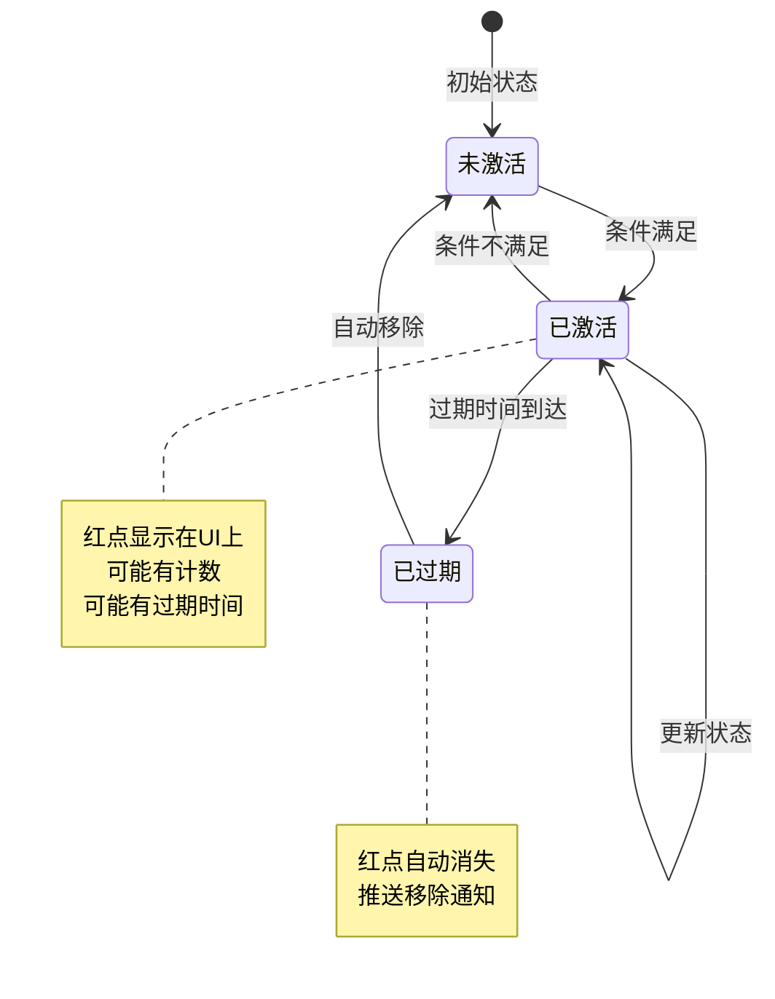
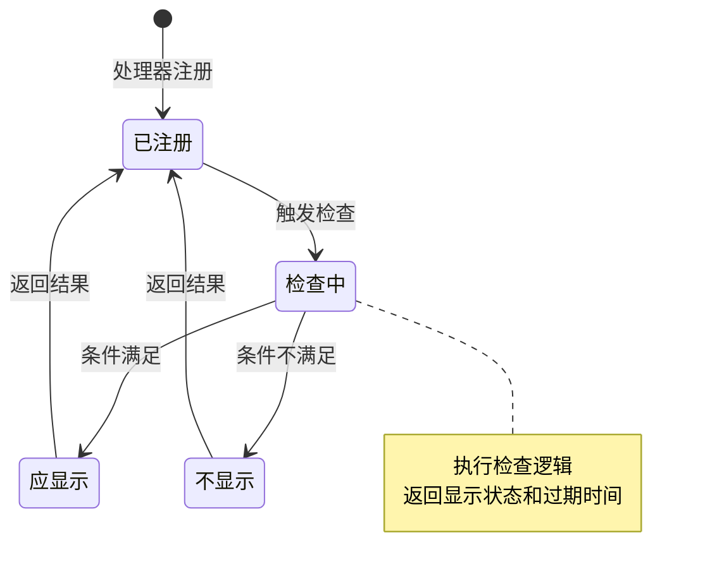
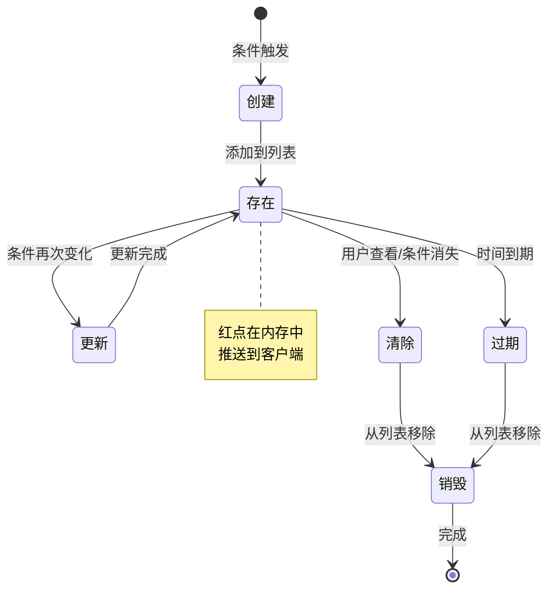
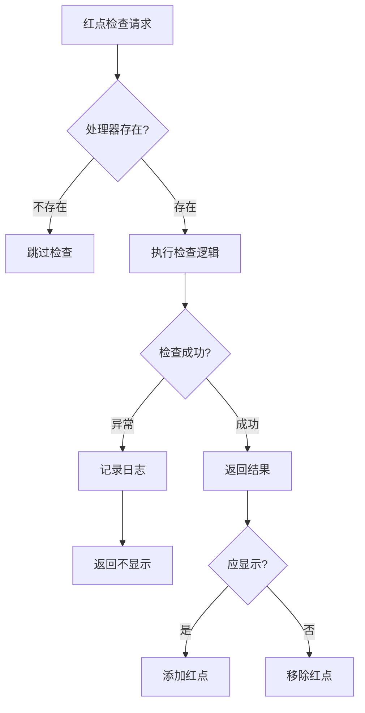

# 红点模块实现细节

## 一、计算公式

### 1.1 红点显示判断公式

```
显示红点 = 处理器检查结果
结果 = (是否显示, 过期时间)
```

**处理器返回值**：
- `Pair<true, expireTime>`：显示红点，过期时间为expireTime
- `Pair<false, _>`：不显示红点

**示例计算**：
```
新邮件检查：
  未读邮件数量 = 5
  结果 = (true, 0)  // 有未读邮件，永久不过期

每日任务检查：
  可领取任务数 = 0
  结果 = (false, 0)  // 无可领取任务，不显示

活动检查：
  有进行中的活动 = true
  活动结束时间 = 2026-04-10 00:00:00
  结果 = (true, 1712697600000)  // 显示红点，活动结束过期
```

### 1.2 父级红点聚合公式

```
父级红点显示 = OR(所有子红点显示状态)
父级红点计数 = SUM(所有子红点计数)
父级过期时间 = MIN(所有子红点过期时间)
```

### 1.3 红点过期判断公式

```
红点已过期 = (expireTimeMs > 0) AND (expireTimeMs <= 当前时间戳)
```

---

## 二、状态机定义

### 2.1 红点状态机



### 2.2 红点处理器状态机



### 2.3 红点生命周期状态机



---

## 三、数据约束

### 3.1 红点类型枚举约束

| 枚举值 | 值 | 说明 |
|--------|-----|------|
| NONE | 0 | 无效类型 |
| RED_MAIL_NEW | 1 | 新邮件 |
| RED_TASK_DAILY | 2 | 每日任务 |
| RED_TASK_ACHIEVE | 3 | 成就任务 |
| RED_ACTIVITY_NEW | 4 | 新活动 |
| RED_PRIVILEGE_CARD | 5 | 权益卡奖励 |
| RED_TITLE_NEW | 6 | 新称号 |

### 3.2 红点信息约束

| 字段名 | 数据类型 | 取值范围 | 必填 | 说明 |
|--------|----------|----------|------|------|
| redDotType | ERedDotType | > 0 | 是 | 红点类型 |
| expireTimeMs | long | >= 0 | 是 | 过期时间（0表示不过期） |

### 3.3 红点处理器约束

| 方法名 | 返回类型 | 说明 |
|--------|----------|------|
| getRedDotType | ERedDotType | 返回处理的红点类型 |
| checkRedDot | Pair&lt;Boolean, Long&gt; | 返回是否显示和过期时间 |

### 3.4 红点组件数据约束

| 字段名 | 数据类型 | 说明 |
|--------|----------|------|
| _m_dealerList | _ARedDotDealer[] | 红点处理器数组 |
| _m_redDotList | List&lt;RedDotInfo&gt; | 当前激活的红点集合 |

---

## 四、错误处理策略

### 4.1 红点模块错误码

| 错误码 | 错误信息 | 处理策略 | 用户提示 |
|--------|----------|----------|----------|
| 66001 | 无效的红点类型 | 检查类型枚举 | 系统错误 |
| 66002 | 红点不存在 | 忽略操作 | 无提示 |
| 66003 | 处理器未注册 | 跳过检查 | 无提示 |

### 4.2 红点检查错误处理流程



### 4.3 异常处理策略

| 异常情况 | 处理策略 | 说明 |
|----------|----------|------|
| 处理器未注册 | 跳过检查 | 不影响其他红点 |
| 检查逻辑异常 | 返回不显示 | 保守处理 |
| 内存不足 | 清理过期红点 | 自动恢复 |

---

## 五、关键代码示例

### 5.1 红点组件初始化伪代码

```csharp
public class RedDotComponent : _ANPUserComponent
{
    private _ARedDotDealer[] _m_dealerList;
    private List<RedDotInfo> _m_redDotList;

    protected override void _init()
    {
        // 1. 初始化处理器数组
        _m_dealerList = new _ARedDotDealer[(int)ERedDotType.ERedDotType_Length];
        _m_redDotList = new List<RedDotInfo>();

        // 2. 注册各类型处理器
        registerDealer(new MailRedDotDealer(this));
        registerDealer(new TaskRedDotDealer(this));
        registerDealer(new ActivityRedDotDealer(this));
        registerDealer(new PrivilegeCardRedDotDealer(this));
        registerDealer(new TitleRedDotDealer(this));

        // 3. 设置初始化完成（不读取数据库）
        setInited();
    }

    public override void onInited()
    {
        // 4. 首次检查所有红点状态
        checkAndUpdateAllRedDots(false);
    }

    private void registerDealer(_ARedDotDealer dealer)
    {
        _m_dealerList[(int)dealer.getRedDotType()] = dealer;
    }
}
```

### 5.2 检查并更新红点伪代码

```csharp
public void CheckAndUpdateRedDot(ERedDotType type, bool needPush)
{
    // 1. 获取处理器
    _ARedDotDealer dealer = getDealer(type);
    if (dealer == null) return;

    // 2. 执行检查
    Pair<bool, long> showInfo = dealer.checkRedDot();

    if (showInfo == null || !showInfo.first)
    {
        // 3. 不显示，移除红点
        RemoveRedDot(type, needPush);
    }
    else
    {
        // 4. 显示，添加或更新红点
        RedDotInfo redDotInfo = lookupRedDotInfo(type);

        if (redDotInfo == null)
        {
            // 创建新红点
            redDotInfo = new RedDotInfo(this, type, showInfo.second);
            _m_redDotList.Add(redDotInfo);
        }
        else
        {
            // 更新过期时间
            redDotInfo.setExpireTimeMs(showInfo.second);
        }

        // 5. 推送变化
        if (needPush)
        {
            PushRedDotChange(redDotInfo);
        }
    }
}
```

### 5.3 移除红点伪代码

```csharp
public void RemoveRedDot(ERedDotType type, bool needPush)
{
    if (type == ERedDotType.NONE) return;

    getUserData().lockUser();
    try
    {
        RedDotInfo redDotInfo = lookupRedDotInfo(type);
        if (redDotInfo == null) return;

        if (_m_redDotList.Remove(redDotInfo) && needPush)
        {
            // 推送红点移除通知
            PushRedDotRemove(type);
        }
    }
    finally
    {
        getUserData().unlockUser();
    }
}
```

### 5.4 获取所有红点伪代码

```csharp
public List<Common_RedDotInfo> GetAllRedDots()
{
    getUserData().lockUser();
    try
    {
        List<Common_RedDotInfo> list = new List<Common_RedDotInfo>();

        foreach (RedDotInfo redDotInfo in _m_redDotList)
        {
            list.Add(redDotInfo.makeRedDotInfo());
        }

        return list;
    }
    finally
    {
        getUserData().unlockUser();
    }
}
```

### 5.5 红点处理器基类伪代码

```csharp
public abstract class _ARedDotDealer
{
    protected RedDotComponent _comp;

    public _ARedDotDealer(RedDotComponent comp)
    {
        this._comp = comp;
    }

    /// <summary>
    /// 获取处理的红点类型
    /// </summary>
    public abstract ERedDotType getRedDotType();

    /// <summary>
    /// 检查红点是否应该显示
    /// </summary>
    /// <returns>Pair<是否显示, 过期时间(毫秒)></returns>
    public abstract Pair<bool, long> checkRedDot();
}
```

### 5.6 具体处理器实现示例伪代码

```csharp
public class PrivilegeCardRedDotDealer : _ARedDotDealer
{
    public PrivilegeCardRedDotDealer(RedDotComponent comp) : base(comp) { }

    public override ERedDotType getRedDotType()
    {
        return ERedDotType.RED_PRIVILEGE_CARD;
    }

    public override Pair<bool, long> checkRedDot()
    {
        // 获取权益卡组件
        PrivilegeCardComponent cardComp = _comp.getUserData().getPrivilegeCardComponent();

        // 检查是否有可领取的每日奖励
        foreach (var card in cardComp.getAllCards())
        {
            if (card.canGetRewardToday())
            {
                // 有可领取奖励，显示红点
                // 过期时间为次日零点
                long expireTime = DateTime.Today.AddDays(1).Ticks / TimeSpan.TicksPerMillisecond;
                return new Pair<bool, long>(true, expireTime);
            }
        }

        // 无可领取奖励，不显示红点
        return new Pair<bool, long>(false, 0);
    }
}
```

---

## 六、跨模块依赖

### 6.1 依赖模块

| 模块名称 | 依赖类型 | 依赖说明 |
|----------|----------|----------|
| Player模块 | 强依赖 | 需要获取玩家数据 |
| Config模块 | 弱依赖 | 需要红点类型配置 |

### 6.2 被依赖关系

| 模块名称 | 被依赖方式 | 说明 |
|----------|------------|------|
| 所有业务模块 | 红点触发 | 业务模块触发红点检查 |
| UI模块 | 红点显示 | UI模块读取红点状态 |
| 邮件模块 | 新邮件红点 | 新邮件触发红点 |
| 任务模块 | 任务红点 | 任务完成触发红点 |
| 活动模块 | 活动红点 | 新活动触发红点 |

### 6.3 接口定义

```csharp
// 供其他模块调用的接口
public interface IRedDotService
{
    // 检查并更新红点
    void CheckAndUpdateRedDot(ERedDotType type, bool needPush);

    // 移除红点
    void RemoveRedDot(ERedDotType type, bool needPush);

    // 清除红点（用户查看后调用）
    void ClearRedDot(ERedDotType type);

    // 获取所有红点
    List<Common_RedDotInfo> GetAllRedDots();

    // 检查红点是否存在
    bool HasRedDot(ERedDotType type);
}
```

### 6.4 处理器扩展接口

```csharp
// 红点处理器接口，各业务模块实现
public interface IRedDotDealer
{
    // 获取处理的红点类型
    ERedDotType GetRedDotType();

    // 检查红点是否应该显示
    // 返回: Pair<是否显示, 过期时间(毫秒)>
    Pair<bool, long> CheckRedDot();
}
```

---

*文档生成时间: 2026-04-07*
