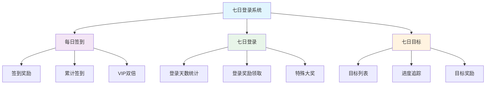
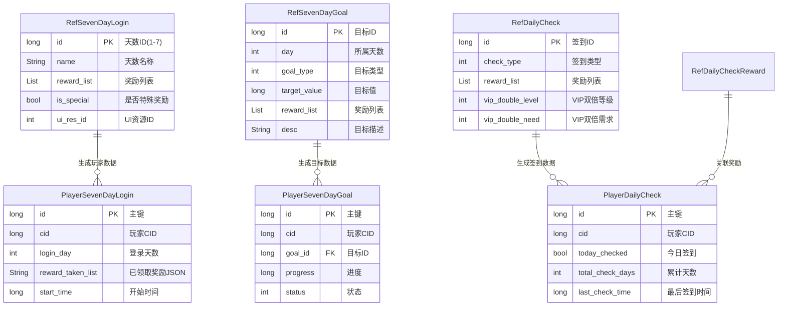
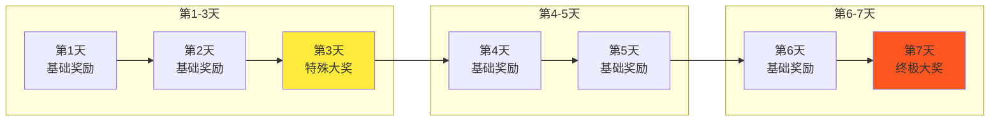
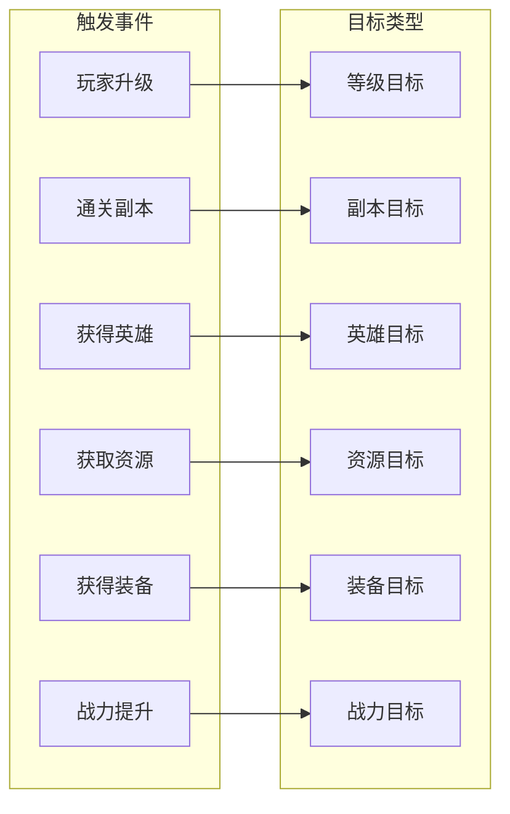
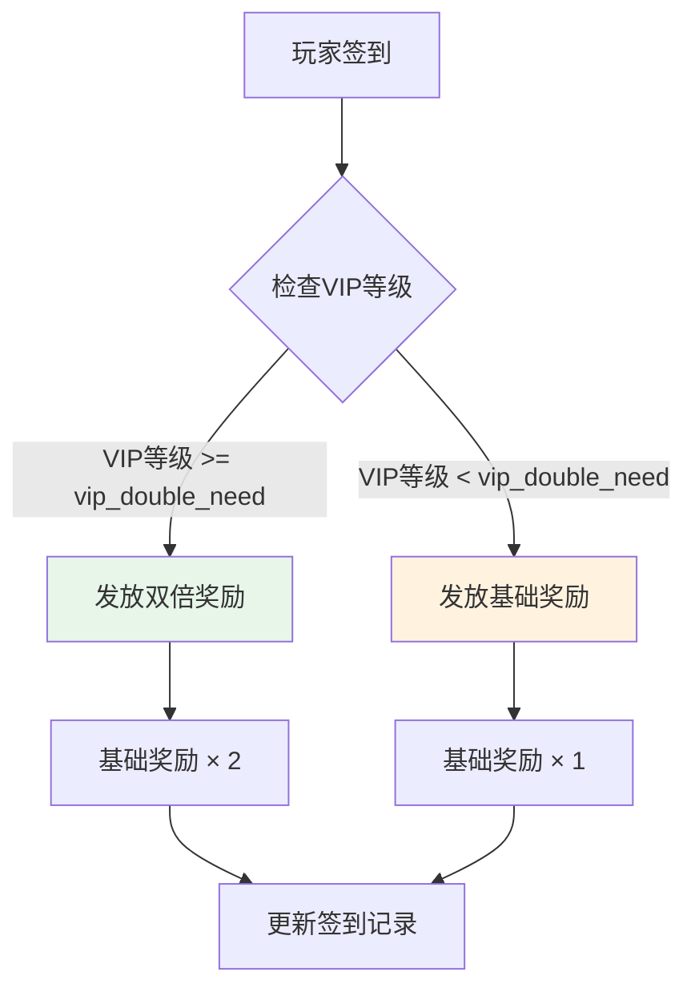
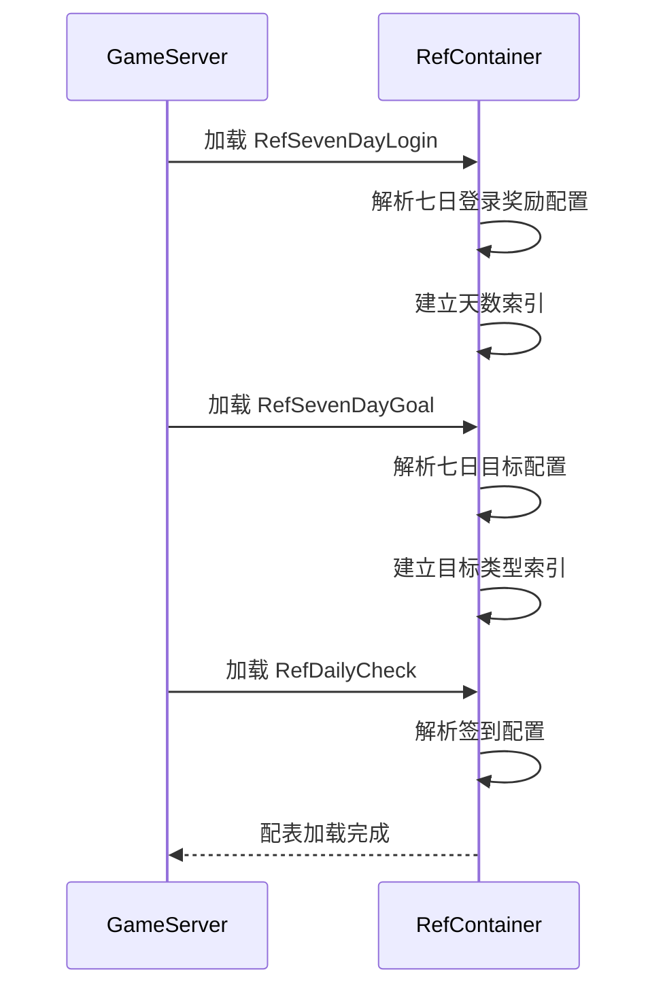
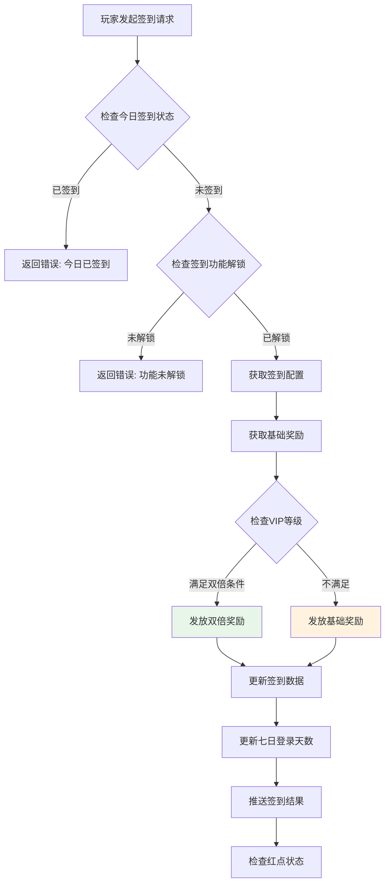
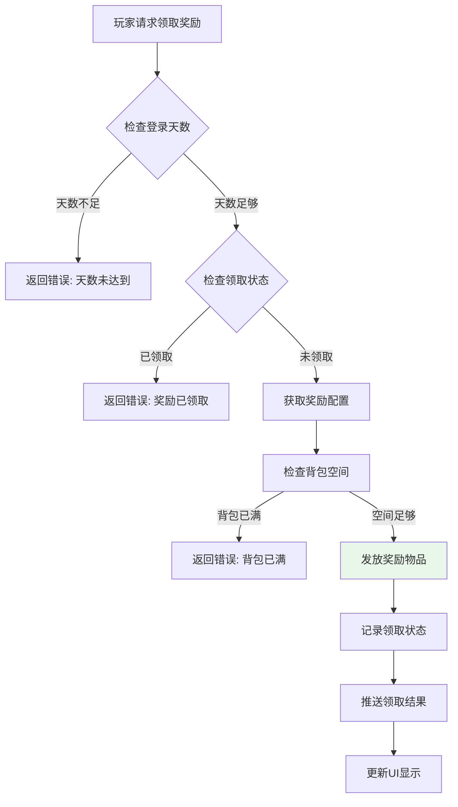
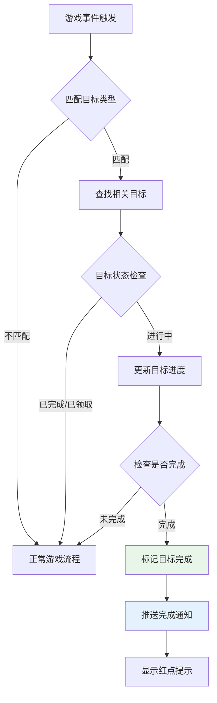

# 七日登录系统 - 数据配表

## 模块概述

**模块编号**: p002 (InitOp) / p021 (PlayerInfoOp)
**模块名称**: SevenDayLogin (七日登录系统)
**主要功能**: 提供每日签到、七日登录奖励、七日目标等功能

---

## 核心概念



---

## 配表文件列表

| 配表名称 | 文件路径 | 说明 |
|---------|---------|------|
| RefSevenDayLogin | GameRes/Refs/SevenDayLogin/RefSevenDayLogin.java | 七日登录奖励配置 |
| RefSevenDayGoal | GameRes/Refs/SevenDayLogin/RefSevenDayGoal.java | 七日目标配置 |
| RefDailyCheck | GameRes/Refs/SevenDayLogin/RefDailyCheck.java | 每日签到配置 |
| RefDailyCheckReward | GameRes/Refs/SevenDayLogin/RefDailyCheckReward.java | 签到奖励配置 |

---

## 配表关系图



---

## 1. 七日登录配置 (RefSevenDayLogin)

**配表名**: `seven_day_login`

### 完整字段列表

| 字段名 | 类型 | 必填 | 默认值 | 说明 |
|--------|------|------|--------|------|
| id | long | 是 | - | 天数ID（主键，范围1-7） |
| name | String | 是 | - | 天数名称（如"第一天"、"第七天"） |
| reward_list | List\<NPCommonCostItem\> | 是 | - | 登录奖励列表 |
| is_special | bool | 否 | false | 是否为特殊奖励（第3天、第7天） |
| ui_res_id | int | 否 | 0 | UI资源ID |
| desc | String | 否 | "" | 奖励描述 |
| sort_id | long | 否 | 0 | 排序ID |

### 天数与奖励关系图



### 配置示例

```json
{
    "id": 1,
    "name": "第一天",
    "reward_list": [
        {
            "item": { "itemType": 2, "itemId": 0 },
            "count": 100
        },
        {
            "item": { "itemType": 1, "itemId": 1 },
            "count": 5000
        }
    ],
    "is_special": false,
    "ui_res_id": 0,
    "desc": "登录首日奖励",
    "sort_id": 1
}
```

### 代码示例

```java
// 获取七日登录配置
RefSevenDayLogin loginRef = RefSevenDayLogin.getMgr().get(day);
if (loginRef == null) {
    return CommErr.REF_NOT_FOUND;
}

// 获取奖励列表
List<NPCommonCostItem> rewards = loginRef.reward_list;

// 检查是否为特殊奖励
if (loginRef.is_special) {
    // 播放特殊奖励动画
    playSpecialRewardAnimation(rewards);
}
```

```csharp
// 客户端获取七日登录配置
NPSevenDayLoginRefObj loginRef = GRefdataCoreMgr.instance.sevenDayLoginMap.getRef(day);
if (loginRef == null)
{
    Debug.LogError($"七日登录配置不存在: {day}");
    return;
}

// 获取奖励列表
List<NPCommonCostItem> rewards = loginRef.reward_list;

// 检查是否为特殊奖励
bool isSpecial = loginRef.is_special;
```

---

## 2. 七日目标配置 (RefSevenDayGoal)

**配表名**: `seven_day_goal`

### 完整字段列表

| 字段名 | 类型 | 必填 | 默认值 | 说明 |
|--------|------|------|--------|------|
| id | long | 是 | - | 目标ID（主键） |
| day | int | 是 | - | 所属天数（1-7） |
| name | String | 是 | - | 目标名称 |
| goal_type | int | 是 | - | 目标类型（ENPGoalType） |
| target_value | long | 是 | - | 目标值 |
| reward_list | List\<NPCommonCostItem\> | 是 | - | 完成奖励列表 |
| desc | String | 否 | "" | 目标描述 |
| ui_res_id | int | 否 | 0 | UI资源ID |
| sort_id | long | 否 | 0 | 排序ID |

### 目标类型枚举 (ENPGoalType)

| 枚举值 | 数值 | 说明 | 进度更新触发 |
|--------|------|------|--------------|
| LEVEL | 1 | 等级目标 | 玩家升级 |
| DUNGEON | 2 | 副本目标 | 通关副本 |
| HERO | 3 | 英雄目标 | 获得英雄 |
| RESOURCE | 4 | 资源目标 | 获取资源 |
| EQUIPMENT | 5 | 装备目标 | 获得装备 |
| POWER | 6 | 战力目标 | 战力提升 |
| ARENA | 7 | 竞技场目标 | 竞技场胜利 |
| GUILD | 8 | 公会目标 | 公会活动 |

### 目标类型与进度更新关系



### 配置示例

```json
{
    "id": 101,
    "day": 1,
    "name": "达到10级",
    "goal_type": 1,
    "target_value": 10,
    "reward_list": [
        {
            "item": { "itemType": 1, "itemId": 100 },
            "count": 10
        }
    ],
    "desc": "累计提升至10级",
    "ui_res_id": 0,
    "sort_id": 1
}
```

### 代码示例

```java
// 获取某天的所有目标
List<RefSevenDayGoal> goals = RefSevenDayGoal.getMgr().getByDay(day);

// 检查目标是否完成
public boolean isGoalComplete(PlayerSevenDayGoal playerGoal, RefSevenDayGoal goalRef) {
    return playerGoal.progress >= goalRef.target_value;
}

// 更新目标进度
public void updateGoalProgress(long cid, int goalType, long value) {
    List<RefSevenDayGoal> goals = RefSevenDayGoal.getMgr().getByType(goalType);
    for (RefSevenDayGoal goal : goals) {
        PlayerSevenDayGoal playerGoal = playerGoalDao.getByCidAndGoalId(cid, goal.id);
        if (playerGoal != null && playerGoal.status == 0) { // 进行中
            playerGoal.progress += value;
            if (playerGoal.progress >= goal.target_value) {
                playerGoal.status = 1; // 已完成
                pushGoalComplete(cid, goal);
            }
            playerGoalDao.update(playerGoal);
        }
    }
}
```

---

## 3. 每日签到配置 (RefDailyCheck)

**配表名**: `daily_check`

### 完整字段列表

| 字段名 | 类型 | 必填 | 默认值 | 说明 |
|--------|------|------|--------|------|
| id | long | 是 | - | 签到ID（主键） |
| check_type | int | 是 | 1 | 签到类型 |
| reward_list | List\<NPCommonCostItem\> | 是 | - | 签到奖励列表 |
| vip_double_need | int | 否 | 0 | VIP双倍需求等级 |
| vip_double_limit | int | 否 | 1 | VIP双倍上限倍数 |
| ui_res_id | int | 否 | 0 | UI资源ID |
| desc | String | 否 | "" | 签到描述 |

### VIP双倍规则



### 配置示例

```json
{
    "id": 1,
    "check_type": 1,
    "reward_list": [
        {
            "item": { "itemType": 2, "itemId": 0 },
            "count": 50
        }
    ],
    "vip_double_need": 2,
    "vip_double_limit": 2,
    "ui_res_id": 0,
    "desc": "每日基础签到"
}
```

### 代码示例

```java
// 获取签到配置
RefDailyCheck checkRef = RefDailyCheck.getMgr().getByType(1);

// 计算签到奖励
public List<NPCommonCostItem> calculateCheckReward(NPUSUserData userData, RefDailyCheck checkRef) {
    List<NPCommonCostItem> rewards = new ArrayList<>(checkRef.reward_list);

    // 检查VIP双倍
    int vipLevel = userData.getPlayerComponent().getVipLevel();
    if (vipLevel >= checkRef.vip_double_need) {
        // 双倍奖励
        List<NPCommonCostItem> doubleRewards = new ArrayList<>();
        for (NPCommonCostItem item : rewards) {
            doubleRewards.add(new NPCommonCostItem(item.item, item.count * 2));
        }
        return doubleRewards;
    }

    return rewards;
}
```

---

## 协议数据结构

### SevenDayLoginInfo - 七日登录信息

**路径**: `ClientProtocol/Common/SevenDayLoginObj/SevenDayLogin_Info.cs`

| 字段名 | 类型 | 说明 | 示例值 |
|--------|------|------|--------|
| loginDay | int | 当前登录天数 | 5 |
| rewardTakenList | List\<int\> | 已领取奖励天数列表 | [1, 2, 3, 4] |
| goalProgressList | List\<SevenDayGoalProgress\> | 目标进度列表 | [...] |
| startTime | long | 活动开始时间戳 | 1640000000000 |

```csharp
public class SevenDayLogin_Info : _IALProtocolStructure
{
    private int loginDay;                                    // 登录天数
    private List<int> rewardTakenList;                       // 已领取奖励列表
    private List<SevenDayGoalProgress> goalProgressList;     // 目标进度列表
    private long startTime;                                  // 开始时间

    public byte getMainOrder() { return (byte)2; }
    public byte getSubOrder() { return (byte)0; }
}
```

### SevenDayGoalProgress - 七日目标进度

**路径**: `ClientProtocol/Common/SevenDayLoginObj/SevenDayGoalProgress.cs`

| 字段名 | 类型 | 说明 | 示例值 |
|--------|------|------|--------|
| goalId | long | 目标ID | 101 |
| progress | long | 当前进度 | 8 |
| targetValue | long | 目标值 | 10 |
| status | int | 状态：0进行中，1已完成，2已领取 | 0 |

```csharp
public class SevenDayGoalProgress : _IALProtocolStructure
{
    private long goalId;          // 目标ID
    private long progress;        // 当前进度
    private long targetValue;     // 目标值
    private int status;           // 状态

    public byte getMainOrder() { return (byte)2; }
    public byte getSubOrder() { return (byte)0; }
}
```

### DailyCheckInfo - 每日签到信息

**路径**: `ClientProtocol/Common/SevenDayLoginObj/DailyCheck_Info.cs`

| 字段名 | 类型 | 说明 | 示例值 |
|--------|------|------|--------|
| todayChecked | bool | 今日是否已签到 | true |
| totalCheckDays | int | 累计签到天数 | 15 |
| lastCheckTime | long | 最后签到时间戳 | 1640000000000 |

```csharp
public class DailyCheck_Info : _IALProtocolStructure
{
    private bool todayChecked;      // 今日是否签到
    private int totalCheckDays;     // 累计签到天数
    private long lastCheckTime;     // 最后签到时间

    public byte getMainOrder() { return (byte)2; }
    public byte getSubOrder() { return (byte)0; }
}
```

---

## 数据库表结构

### player_seven_day_login（七日登录数据表）

```sql
CREATE TABLE IF NOT EXISTS `player_seven_day_login` (
    `id` bigint(20) NOT NULL AUTO_INCREMENT COMMENT '自增主键',
    `cid` bigint(20) NOT NULL DEFAULT '0' COMMENT '玩家CID',
    `login_day` int(11) NOT NULL DEFAULT '0' COMMENT '当前登录天数',
    `reward_taken_list` varchar(255) NOT NULL DEFAULT '[]' COMMENT '已领取奖励天数JSON',
    `start_time` bigint(20) NOT NULL DEFAULT '0' COMMENT '活动开始时间戳',
    `create_time` datetime DEFAULT CURRENT_TIMESTAMP COMMENT '创建时间',
    `update_time` datetime DEFAULT CURRENT_TIMESTAMP ON UPDATE CURRENT_TIMESTAMP COMMENT '更新时间',
    PRIMARY KEY (`id`),
    UNIQUE KEY `uk_cid` (`cid`),
    KEY `idx_start_time` (`start_time`)
) COMMENT='玩家七日登录数据' engine=InnoDB DEFAULT CHARSET=utf8mb4;
```

### player_seven_day_goal（七日目标数据表）

```sql
CREATE TABLE IF NOT EXISTS `player_seven_day_goal` (
    `id` bigint(20) NOT NULL AUTO_INCREMENT COMMENT '自增主键',
    `cid` bigint(20) NOT NULL DEFAULT '0' COMMENT '玩家CID',
    `goal_id` bigint(20) NOT NULL DEFAULT '0' COMMENT '目标ID',
    `day` int(11) NOT NULL DEFAULT '0' COMMENT '所属天数',
    `progress` bigint(20) NOT NULL DEFAULT '0' COMMENT '当前进度',
    `target_value` bigint(20) NOT NULL DEFAULT '0' COMMENT '目标值',
    `status` int(11) NOT NULL DEFAULT '0' COMMENT '状态(0进行中,1已完成,2已领取)',
    `create_time` datetime DEFAULT CURRENT_TIMESTAMP COMMENT '创建时间',
    `update_time` datetime DEFAULT CURRENT_TIMESTAMP ON UPDATE CURRENT_TIMESTAMP COMMENT '更新时间',
    PRIMARY KEY (`id`),
    UNIQUE KEY `uk_cid_goal` (`cid`, `goal_id`),
    KEY `idx_cid` (`cid`),
    KEY `idx_status` (`status`)
) COMMENT='玩家七日目标数据' engine=InnoDB DEFAULT CHARSET=utf8mb4;
```

### player_daily_check（每日签到数据表）

```sql
CREATE TABLE IF NOT EXISTS `player_daily_check` (
    `id` bigint(20) NOT NULL AUTO_INCREMENT COMMENT '自增主键',
    `cid` bigint(20) NOT NULL DEFAULT '0' COMMENT '玩家CID',
    `today_checked` tinyint(1) NOT NULL DEFAULT '0' COMMENT '今日是否签到',
    `total_check_days` int(11) NOT NULL DEFAULT '0' COMMENT '累计签到天数',
    `last_check_time` bigint(20) NOT NULL DEFAULT '0' COMMENT '最后签到时间戳',
    `create_time` datetime DEFAULT CURRENT_TIMESTAMP COMMENT '创建时间',
    `update_time` datetime DEFAULT CURRENT_TIMESTAMP ON UPDATE CURRENT_TIMESTAMP COMMENT '更新时间',
    PRIMARY KEY (`id`),
    UNIQUE KEY `uk_cid` (`cid`),
    KEY `idx_last_check_time` (`last_check_time`)
) COMMENT='玩家每日签到数据' engine=InnoDB DEFAULT CHARSET=utf8mb4;
```

---

## 枚举定义

### ENPSevenDayLoginStatus (七日登录状态)

| 枚举值 | 数值 | 说明 |
|--------|------|------|
| IN_PROGRESS | 0 | 进行中 |
| COMPLETED | 1 | 已完成 |
| REWARD_TAKEN | 2 | 已领取奖励 |

### ENPGoalStatus (目标状态)

| 枚举值 | 数值 | 说明 |
|--------|------|------|
| IN_PROGRESS | 0 | 进行中 |
| COMPLETED | 1 | 已完成 |
| REWARD_TAKEN | 2 | 已领取 |
| EXPIRED | 3 | 已过期 |

### ENPCheckStatus (签到状态)

| 枚举值 | 数值 | 说明 |
|--------|------|------|
| NOT_CHECKED | 0 | 未签到 |
| CHECKED | 1 | 已签到 |

---

## 配表加载流程



---

## 数据字典

### 奖励类型映射

| 奖励类型ID | 枚举名 | 说明 | 存储位置 |
|------------|--------|------|----------|
| 1 | ITEM | 普通道具 | 背包 |
| 2 | CURRENCY | 货币 | 货币组件 |
| 3 | HERO | 英雄 | 英雄列表 |
| 4 | EQUIPMENT | 装备 | 装备栏 |
| 5 | SKIN | 皮肤 | 皮肤列表 |
| 6 | FRAGMENT | 碎片 | 背包 |

### 目标类型触发映射

| 目标类型 | 触发事件 | 参数格式 | 示例 |
|----------|----------|----------|------|
| 等级(1) | 玩家升级 | {goalType:1, value:1} | 升级到10级 |
| 副本(2) | 通关副本 | {goalType:2, value:1} | 通关指定副本 |
| 英雄(3) | 获得英雄 | {goalType:3, value:heroId} | 获得指定英雄 |
| 资源(4) | 获取资源 | {goalType:4, value:count} | 获取10000银两 |
| 装备(5) | 获得装备 | {goalType:5, value:equipId} | 获得指定装备 |
| 战力(6) | 战力提升 | {goalType:6, value:power} | 战力达到10000 |

---

## 配表校验规则

### 七日登录配置校验

| 字段名 | 校验规则 | 异常处理 |
|--------|----------|----------|
| id | 范围1-7，必须唯一 | 加载时报错 |
| reward_list | 非空列表 | 使用默认奖励 |
| is_special | 第3天、第7天必须为true | 自动修正 |

### 七日目标配置校验

| 字段名 | 校验规则 | 异常处理 |
|--------|----------|----------|
| id | 必须唯一 | 加载时报错 |
| day | 范围1-7 | 使用默认值1 |
| goal_type | 枚举值范围1-8 | 使用默认值1 |
| target_value | 大于0 | 加载时报错 |

### 签到配置校验

| 字段名 | 校验规则 | 异常处理 |
|--------|----------|----------|
| id | 必须唯一 | 加载时报错 |
| reward_list | 非空列表 | 加载时报错 |
| vip_double_need | 范围0-15 | 使用默认值0 |

---

## 配置文件位置

```
game_server/GameRes/src/NPGameRes/Refs/SevenDayLogin/
├── RefSevenDayLogin.java      # 七日登录配置
├── RefSevenDayGoal.java       # 七日目标配置
├── RefDailyCheck.java         # 每日签到配置
└── RefDailyCheckReward.java   # 签到奖励配置

game_server/GameRes/src/NPGameRes/GameObjs/SevenDayLogin/
├── SevenDayLoginInfo.java     # 七日登录信息对象
├── SevenDayGoalInfo.java      # 七日目标信息对象
└── DailyCheckInfo.java        # 签到信息对象

game_server/DBTool/source_db/UserServer/
├── player_seven_day_login.py  # 七日登录表定义
├── player_seven_day_goal.py   # 七日目标表定义
└── player_daily_check.py      # 签到数据表定义
```

---

## 签到完整流程



---

## 七日登录奖励领取流程



---

## 七日目标进度更新流程



---

## 完整代码示例

### Java服务端 - 七日登录服务

```java
/**
 * 七日登录服务实现
 */
public class SevenDayLoginService
{
    /**
     * 获取七日登录信息
     */
    public SevenDayLoginInfo getSevenDayLoginInfo(long cid)
    {
        PlayerSevenDayLogin login = sevenDayLoginDao.getByCid(cid);
        if (login == null) {
            login = initPlayerSevenDayLogin(cid);
        }
        return login.toInfo();
    }

    /**
     * 领取七日登录奖励
     */
    public TakeRewardResult takeSevenDayReward(long cid, int day)
    {
        TakeRewardResult result = new TakeRewardResult();

        // 参数校验
        if (day < 1 || day > 7) {
            result.setError(CommErr.PARAM_ERROR, "天数参数错误");
            return result;
        }

        // 获取玩家数据
        PlayerSevenDayLogin login = sevenDayLoginDao.getByCid(cid);
        if (login == null) {
            result.setError(CommErr.DATA_NOT_FOUND, "玩家数据不存在");
            return result;
        }

        // 检查登录天数
        if (login.loginDay < day) {
            result.setError(SevenDayLoginErr.DAY_NOT_REACHED, "登录天数未达到");
            return result;
        }

        // 检查领取状态
        if (login.rewardTakenList.contains(day)) {
            result.setError(SevenDayLoginErr.REWARD_ALREADY_TAKEN, "奖励已领取");
            return result;
        }

        // 获取奖励配置
        RefSevenDayLogin loginRef = RefSevenDayLogin.getMgr().get(day);
        if (loginRef == null) {
            result.setError(CommErr.REF_NOT_FOUND, "配置不存在");
            return result;
        }

        // 发放奖励
        List<NPCommonCostItem> rewards = loginRef.reward_list;
        bagService.addItems(cid, rewards, "七日登录奖励");

        // 记录领取
        login.rewardTakenList.add(day);
        sevenDayLoginDao.update(login);

        result.setSuccess(rewards);
        return result;
    }

    /**
     * 更新目标进度
     */
    public void updateGoalProgress(long cid, int goalType, long value)
    {
        List<RefSevenDayGoal> goals = RefSevenDayGoal.getMgr().getByType(goalType);
        for (RefSevenDayGoal goalRef : goals) {
            PlayerSevenDayGoal goal = playerGoalDao.getByCidAndGoalId(cid, goalRef.id);
            if (goal == null || goal.status != ENPGoalStatus.IN_PROGRESS.ordinal()) {
                continue;
            }

            goal.progress += value;
            if (goal.progress >= goalRef.target_value) {
                goal.progress = goalRef.target_value;
                goal.status = ENPGoalStatus.COMPLETED.ordinal();
                pushGoalComplete(cid, goal);
            }
            playerGoalDao.update(goal);
        }
    }
}
```

### C#客户端 - 七日登录组件

```csharp
/// <summary>
/// 七日登录组件扩展
/// </summary>
public static class SevenDayLoginExtension
{
    /// <summary>
    /// 获取可领取的天数列表
    /// </summary>
    public static List<int> GetAvailableDays(this SevenDayLoginComponent comp)
    {
        List<int> available = new List<int>();
        int loginDay = comp.loginDay;

        for (int day = 1; day <= 7; day++)
        {
            if (day <= loginDay && !comp.isRewardTaken(day))
            {
                available.Add(day);
            }
        }
        return available;
    }

    /// <summary>
    /// 获取目标进度百分比
    /// </summary>
    public static float GetGoalProgressPercent(this SevenDayGoalInfo goal)
    {
        if (goal.targetValue <= 0) return 0f;
        return Mathf.Min((float)goal.progress / goal.targetValue, 1f);
    }

    /// <summary>
    /// 检查是否有可领取的奖励
    /// </summary>
    public static bool HasAvailableReward(this SevenDayLoginComponent comp)
    {
        return comp.GetAvailableDays().Count > 0;
    }
}
```

---

## 性能优化建议

### 1. 缓存策略

```java
// 七日登录数据缓存配置
public class SevenDayLoginCacheConfig
{
    public static final String CACHE_PREFIX = "seven_day_login:";
    public static final int CACHE_TTL = 300; // 5分钟

    public static String getCacheKey(long cid) {
        return CACHE_PREFIX + cid;
    }
}
```

### 2. 目标进度批量更新

```java
/**
 * 批量更新目标进度
 */
public void batchUpdateGoalProgress(long cid, Map<Integer, Long> progressMap)
{
    List<PlayerSevenDayGoal> goals = playerGoalDao.getByCid(cid);
    for (PlayerSevenDayGoal goal : goals) {
        if (progressMap.containsKey(goal.goalType)) {
            goal.progress += progressMap.get(goal.goalType);
            playerGoalDao.update(goal);
        }
    }
}
```

---

*文档生成时间: 2026-04-12*
*文档版本: v1.4.0*
