# 七日登录系统 - 协议文档

## 协议模块编号: p002 (InitOp) / p021 (PlayerInfoOp)

**源码路径**:
- 客户端请求: `ClientProtocol/GC2GS/p002_InitOp/` / `ClientProtocol/GC2GS/p021_PlayerInfoOp/`
- 服务端响应: `ClientProtocol/GS2GC/p002_InitOp/` / `ClientProtocol/GS2GC/p021_PlayerInfoOp/`

---

## 一、协议总览

### 1.1 协议模块架构图

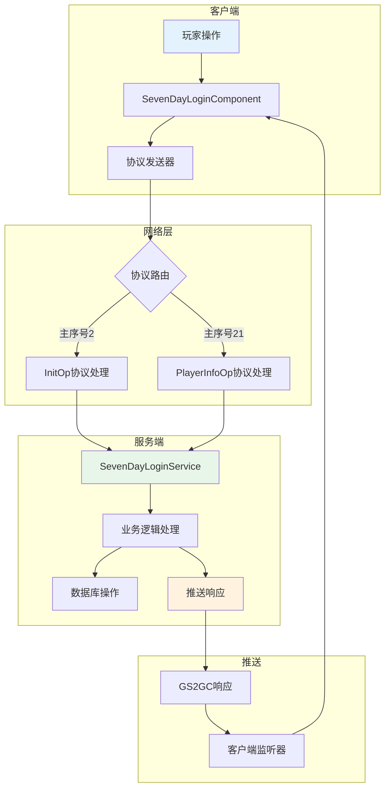

### 1.2 协议序号分配

| 子序号范围 | 用途 | 示例协议 |
|------------|------|----------|
| 026-030 | 签到操作 | 026请求签到信息, 027执行签到 |
| 031-040 | 七日登录操作 | 031请求七日登录信息, 032领取奖励 |
| 041-050 | 七日目标操作 | 041请求目标列表, 042领取目标奖励 |

### 1.3 协议分类一览表

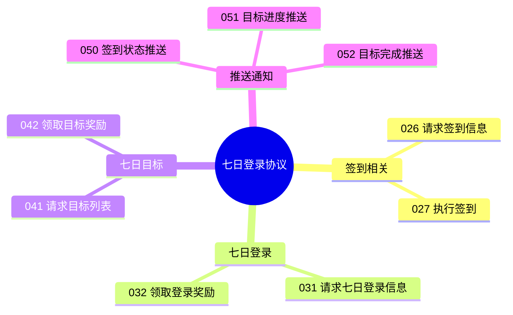

---

## 二、请求协议 (GC2GS)

### 2.1 GC2GS_002_026_ReqDailyCheckInfo - 请求每日签到信息

**主序号**: 2 | **子序号**: 26

#### 协议字段

| 字段名 | 类型 | 说明 | 必填 | 校验规则 |
|--------|------|------|------|----------|
| - | - | 无参数 | - | - |

#### 协议源码

```csharp
public class GC2GS_002_026_ReqDailyCheckInfo : _IALProtocolStructure
{
    public byte getMainOrder() { return (byte)2; }
    public byte getSubOrder() { return (byte)26; }
}
```

#### 请求示例

```csharp
// 通过组件发送请求
NPPlayer.instance.sevenDayLoginComp.reqDailyCheckInfo(() => {
    Debug.Log("获取签到信息成功");
});
```

---

### 2.2 GC2GS_021_027_ReqDailyCheck - 执行每日签到

**主序号**: 21 | **子序号**: 27

#### 协议字段

| 字段名 | 类型 | 说明 | 必填 | 校验规则 |
|--------|------|------|------|----------|
| - | - | 无参数 | - | - |

#### 协议源码

```csharp
public class GC2GS_021_027_ReqDailyCheck : _IALProtocolStructure
{
    public byte getMainOrder() { return (byte)21; }
    public byte getSubOrder() { return (byte)27; }
}
```

#### 请求示例

```csharp
// 执行签到
NPPlayer.instance.sevenDayLoginComp.reqDailyCheck((rewards, vipDouble) => {
    if (vipDouble) {
        Debug.Log("签到成功，获得VIP双倍奖励");
    } else {
        Debug.Log("签到成功");
    }
});
```

---

### 2.3 GC2GS_002_031_ReqSevenDayLoginInfo - 请求七日登录信息

**主序号**: 2 | **子序号**: 31

#### 协议字段

| 字段名 | 类型 | 说明 | 必填 | 校验规则 |
|--------|------|------|------|----------|
| - | - | 无参数 | - | - |

#### 协议源码

```csharp
public class GC2GS_002_031_ReqSevenDayLoginInfo : _IALProtocolStructure
{
    public byte getMainOrder() { return (byte)2; }
    public byte getSubOrder() { return (byte)31; }
}
```

#### 请求示例

```csharp
// 获取七日登录信息
NPPlayer.instance.sevenDayLoginComp.reqSevenDayLoginInfo((info) => {
    Debug.Log($"当前登录天数: {info.loginDay}");
});
```

---

### 2.4 GC2GS_021_032_ReqTakeSevenDayReward - 领取七日登录奖励

**主序号**: 21 | **子序号**: 32

#### 协议字段

| 字段名 | 类型 | 说明 | 必填 | 校验规则 |
|--------|------|------|------|----------|
| day | int | 天数(1-7) | 是 | 范围1-7 |

#### 协议源码

```csharp
public class GC2GS_021_032_ReqTakeSevenDayReward : _IALProtocolStructure
{
    private int day;  // 天数

    public void setDay(int day) { this.day = day; }
    public int getDay() { return day; }

    public byte getMainOrder() { return (byte)21; }
    public byte getSubOrder() { return (byte)32; }
}
```

#### 请求示例

```csharp
// 领取第1天奖励
NPPlayer.instance.sevenDayLoginComp.reqTakeSevenDayReward(1, (rewards) => {
    Debug.Log("领取奖励成功");
    foreach (var reward in rewards) {
        Debug.Log($"获得: {reward.item.itemId} x{reward.count}");
    }
});
```

---

### 2.5 GC2GS_021_041_ReqSevenDayGoalList - 请求七日目标列表

**主序号**: 21 | **子序号**: 41

#### 协议字段

| 字段名 | 类型 | 说明 | 必填 | 校验规则 |
|--------|------|------|------|----------|
| day | int | 天数(0表示全部) | 否 | 范围0-7 |

#### 协议源码

```csharp
public class GC2GS_021_041_ReqSevenDayGoalList : _IALProtocolStructure
{
    private int day;  // 天数(0表示全部)

    public void setDay(int day) { this.day = day; }
    public int getDay() { return day; }

    public byte getMainOrder() { return (byte)21; }
    public byte getSubOrder() { return (byte)41; }
}
```

---

### 2.6 GC2GS_021_042_ReqTakeGoalReward - 领取目标奖励

**主序号**: 21 | **子序号**: 42

#### 协议字段

| 字段名 | 类型 | 说明 | 必填 | 校验规则 |
|--------|------|------|------|----------|
| goalId | long | 目标ID | 是 | 大于0 |

#### 协议源码

```csharp
public class GC2GS_021_042_ReqTakeGoalReward : _IALProtocolStructure
{
    private long goalId;  // 目标ID

    public void setGoalId(long goalId) { this.goalId = goalId; }
    public long getGoalId() { return goalId; }

    public byte getMainOrder() { return (byte)21; }
    public byte getSubOrder() { return (byte)42; }
}
```

---

### 2.7 完整请求协议列表

| 协议名 | 主序号 | 子序号 | 说明 | 触发时机 |
|--------|--------|--------|------|----------|
| GC2GS_002_026_ReqDailyCheckInfo | 2 | 26 | 请求签到信息 | 登录后/进入签到界面 |
| GC2GS_021_027_ReqDailyCheck | 21 | 27 | 执行签到 | 点击签到按钮 |
| GC2GS_002_031_ReqSevenDayLoginInfo | 2 | 31 | 请求七日登录信息 | 登录后/进入七日登录界面 |
| GC2GS_021_032_ReqTakeSevenDayReward | 21 | 32 | 领取七日登录奖励 | 点击领取按钮 |
| GC2GS_021_041_ReqSevenDayGoalList | 21 | 41 | 请求目标列表 | 进入目标界面 |
| GC2GS_021_042_ReqTakeGoalReward | 21 | 42 | 领取目标奖励 | 点击领取目标奖励 |

---

## 三、响应协议 (GS2GC)

### 3.1 GS2GC_002_026_RetDailyCheckInfo - 签到信息响应

**主序号**: 2 | **子序号**: 26

#### 协议字段

| 字段名 | 类型 | 说明 |
|--------|------|------|
| result | int | 结果码（0表示成功） |
| todayChecked | bool | 今日是否已签到 |
| totalCheckDays | int | 累计签到天数 |
| lastCheckTime | long | 最后签到时间戳 |
| checkRewardList | List\<NPCommonCostItem\> | 签到奖励列表 |

#### 协议源码

```csharp
public class GS2GC_002_026_RetDailyCheckInfo : _IALProtocolStructure
{
    private int result;                                    // 结果码
    private bool todayChecked;                             // 今日是否签到
    private int totalCheckDays;                            // 累计签到天数
    private long lastCheckTime;                            // 最后签到时间
    private List<NPCommonCostItem> checkRewardList;        // 签到奖励列表

    public byte getMainOrder() { return (byte)2; }
    public byte getSubOrder() { return (byte)26; }
}
```

---

### 3.2 GS2GC_021_027_RetDailyCheck - 签到响应

**主序号**: 21 | **子序号**: 27

#### 协议字段

| 字段名 | 类型 | 说明 |
|--------|------|------|
| result | int | 结果码（0表示成功） |
| rewardList | List\<NPCommonCostItem\> | 获得的奖励列表 |
| vipDouble | bool | 是否VIP双倍 |
| totalCheckDays | int | 累计签到天数 |

#### 协议源码

```csharp
public class GS2GC_021_027_RetDailyCheck : _IALProtocolStructure
{
    private int result;                               // 结果码
    private List<NPCommonCostItem> rewardList;        // 奖励列表
    private bool vipDouble;                           // VIP双倍标识
    private int totalCheckDays;                       // 累计签到天数

    public byte getMainOrder() { return (byte)21; }
    public byte getSubOrder() { return (byte)27; }
}
```

---

### 3.3 GS2GC_002_031_RetSevenDayLoginInfo - 七日登录信息响应

**主序号**: 2 | **子序号**: 31

#### 协议字段

| 字段名 | 类型 | 说明 |
|--------|------|------|
| result | int | 结果码（0表示成功） |
| loginDay | int | 当前登录天数 |
| rewardTakenList | List\<int\> | 已领取奖励天数列表 |
| goalProgressList | List\<SevenDayGoalProgress\> | 目标进度列表 |
| startTime | long | 活动开始时间戳 |

#### 协议源码

```csharp
public class GS2GC_002_031_RetSevenDayLoginInfo : _IALProtocolStructure
{
    private int result;                                    // 结果码
    private int loginDay;                                  // 登录天数
    private List<int> rewardTakenList;                     // 已领取奖励列表
    private List<SevenDayGoalProgress> goalProgressList;   // 目标进度列表
    private long startTime;                                // 开始时间

    public byte getMainOrder() { return (byte)2; }
    public byte getSubOrder() { return (byte)31; }
}
```

---

### 3.4 GS2GC_021_032_RetTakeSevenDayReward - 领取奖励响应

**主序号**: 21 | **子序号**: 32

#### 协议字段

| 字段名 | 类型 | 说明 |
|--------|------|------|
| result | int | 结果码（0表示成功） |
| day | int | 领取的天数 |
| rewardList | List\<NPCommonCostItem\> | 获得的奖励列表 |

---

### 3.5 GS2GC_021_041_RetSevenDayGoalList - 目标列表响应

**主序号**: 21 | **子序号**: 41

#### 协议字段

| 字段名 | 类型 | 说明 |
|--------|------|------|
| result | int | 结果码（0表示成功） |
| goalList | List\<SevenDayGoalProgress\> | 目标进度列表 |

---

### 3.6 GS2GC_021_042_RetTakeGoalReward - 领取目标奖励响应

**主序号**: 21 | **子序号**: 42

#### 协议字段

| 字段名 | 类型 | 说明 |
|--------|------|------|
| result | int | 结果码（0表示成功） |
| goalId | long | 目标ID |
| rewardList | List\<NPCommonCostItem\> | 获得的奖励列表 |

---

## 四、推送协议 (GS2GC)

### 4.1 GS2GC_021_050_OnDailyCheckStatus - 签到状态推送

**主序号**: 21 | **子序号**: 50

#### 协议字段

| 字段名 | 类型 | 说明 |
|--------|------|------|
| todayChecked | bool | 今日是否已签到 |
| totalCheckDays | int | 累计签到天数 |

#### 协议源码

```csharp
public class GS2GC_021_050_OnDailyCheckStatus : _IALProtocolStructure
{
    private bool todayChecked;      // 今日是否签到
    private int totalCheckDays;     // 累计签到天数

    public byte getMainOrder() { return (byte)21; }
    public byte getSubOrder() { return (byte)50; }
}
```

#### 客户端处理

```csharp
// 监听器处理
public class GSSubDealer_021_050_OnDailyCheckStatus : _AGSSubDealerBase
{
    public override void deal(NPPlayer _player, GS2GC_021_050_OnDailyCheckStatus _msg)
    {
        _player.sevenDayLoginComp.retOnDailyCheckStatus(_msg);
    }
}

// 组件处理
public void retOnDailyCheckStatus(GS2GC_021_050_OnDailyCheckStatus _msg)
{
    _m_todayChecked = _msg.getTodayChecked();
    _m_totalCheckDays = _msg.getTotalCheckDays();
    WinMsg.SendMsg(WinMsgType.DAILY_CHECK_STATUS_CHG);
}
```

---

### 4.2 GS2GC_021_051_OnGoalProgressUpdate - 目标进度更新推送

**主序号**: 21 | **子序号**: 51

#### 协议字段

| 字段名 | 类型 | 说明 |
|--------|------|------|
| goalId | long | 目标ID |
| progress | long | 当前进度 |
| status | int | 状态 |

#### 协议源码

```csharp
public class GS2GC_021_051_OnGoalProgressUpdate : _IALProtocolStructure
{
    private long goalId;        // 目标ID
    private long progress;      // 当前进度
    private int status;         // 状态

    public byte getMainOrder() { return (byte)21; }
    public byte getSubOrder() { return (byte)51; }
}
```

#### 客户端处理

```csharp
// 监听器处理
public class GSSubDealer_021_051_OnGoalProgressUpdate : _AGSSubDealerBase
{
    public override void deal(NPPlayer _player, GS2GC_021_051_OnGoalProgressUpdate _msg)
    {
        _player.sevenDayLoginComp.retOnGoalProgressUpdate(_msg);
    }
}

// 组件处理
public void retOnGoalProgressUpdate(GS2GC_021_051_OnGoalProgressUpdate _msg)
{
    SevenDayGoalInfo goal = getGoal(_msg.getGoalId());
    if (goal != null)
    {
        goal.progress = _msg.getProgress();
        goal.status = _msg.getStatus();
        WinMsg.SendMsg(WinMsgType.SEVEN_DAY_GOAL_PROGRESS_CHG, _msg.getGoalId());
    }
}
```

---

### 4.3 GS2GC_021_052_OnGoalComplete - 目标完成推送

**主序号**: 21 | **子序号**: 52

#### 协议字段

| 字段名 | 类型 | 说明 |
|--------|------|------|
| goalId | long | 目标ID |
| goalName | String | 目标名称 |
| rewardList | List\<NPCommonCostItem\> | 奖励列表 |

---

### 4.4 完整推送协议列表

| 协议名 | 主序号 | 子序号 | 说明 | 触发时机 |
|--------|--------|--------|------|----------|
| GS2GC_021_050_OnDailyCheckStatus | 21 | 50 | 签到状态推送 | 签到成功后 |
| GS2GC_021_051_OnGoalProgressUpdate | 21 | 51 | 目标进度更新 | 目标进度变化 |
| GS2GC_021_052_OnGoalComplete | 21 | 52 | 目标完成推送 | 目标完成时 |

---

## 五、协议交互流程

### 5.1 每日签到完整流程

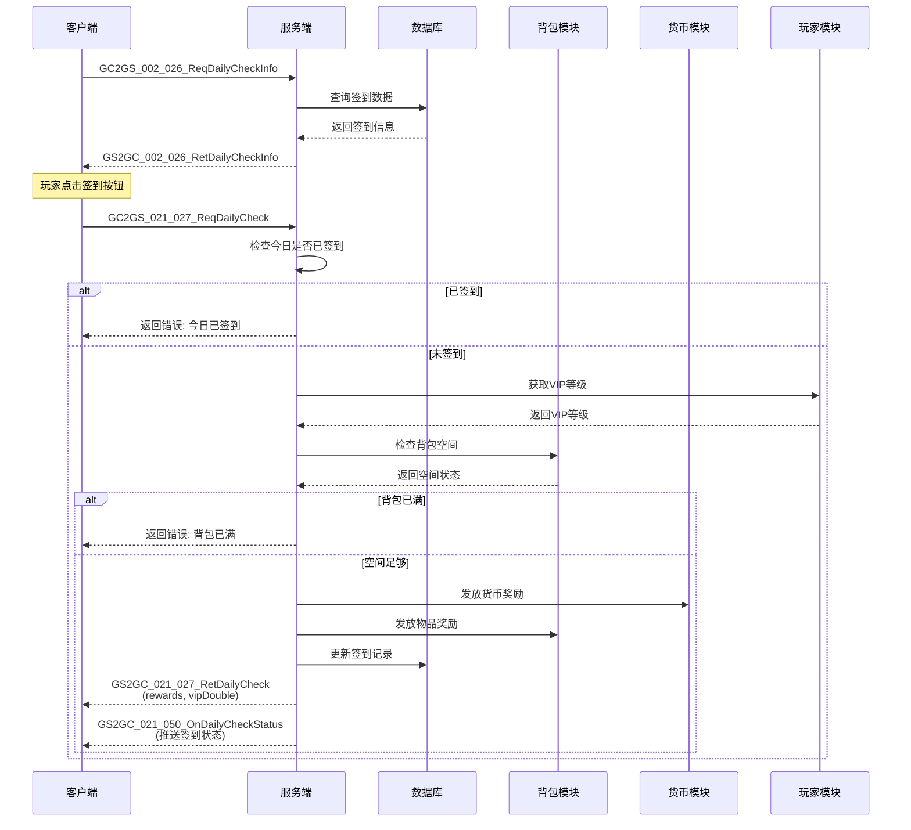

### 5.2 七日登录奖励领取流程

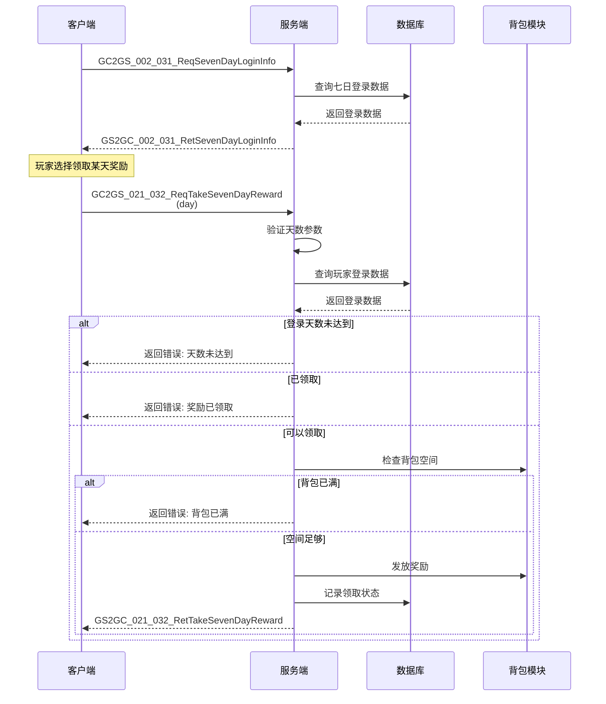

### 5.3 七日目标进度更新流程

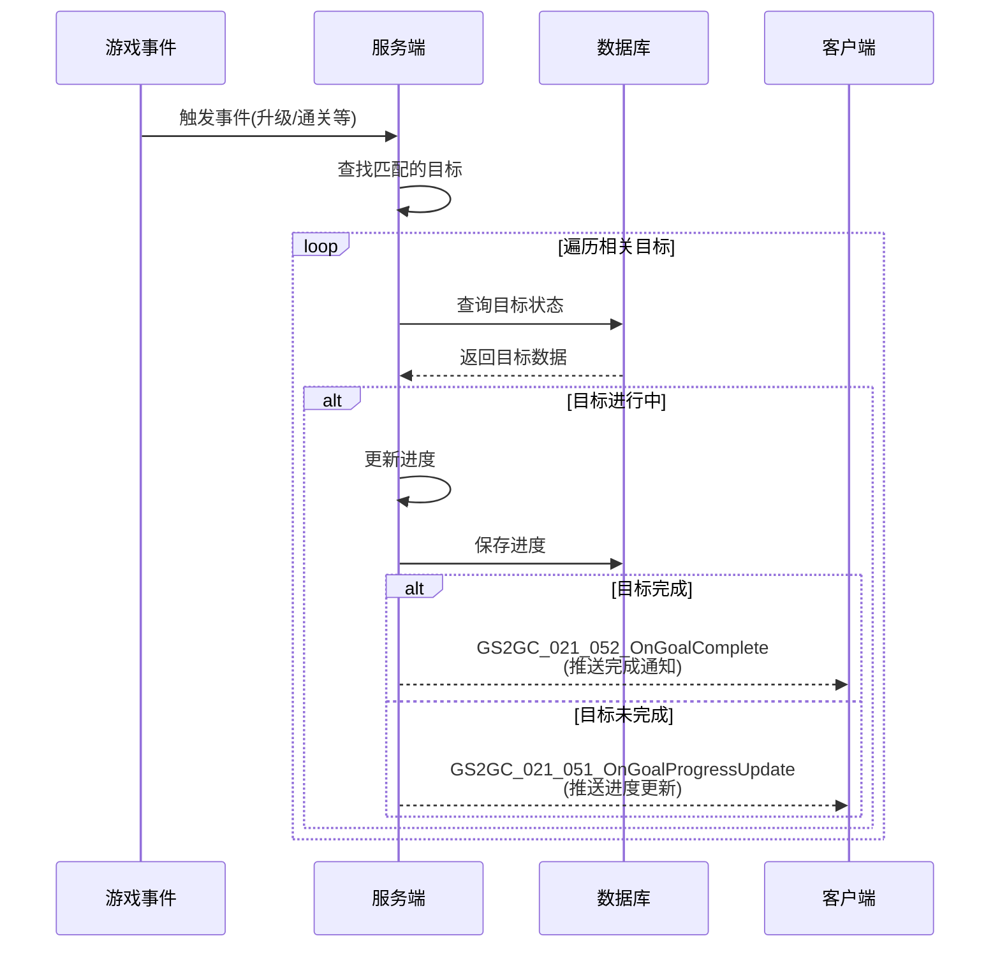

### 5.4 登录初始化流程

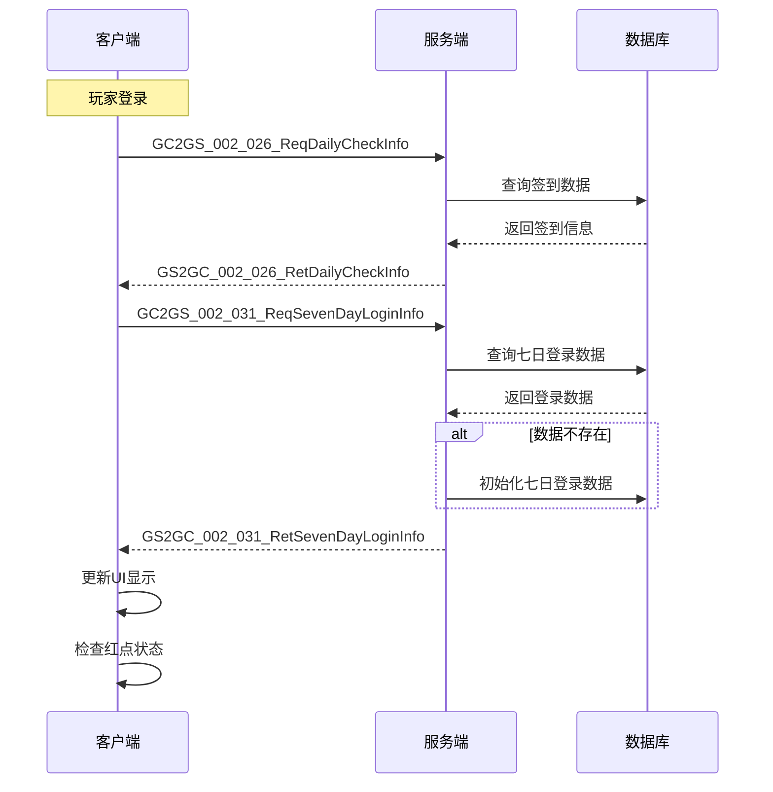

---

## 六、协议错误码

### 6.1 七日登录模块错误码定义

| 错误码 | 常量名 | 说明 | 触发场景 | 用户提示 |
|--------|--------|------|----------|----------|
| 21001 | ALREADY_CHECKED | 今日已签到 | 重复签到 | "今日已签到，请明日再来" |
| 21002 | CHECK_DAY_NOT_REACHED | 签到天数未达到 | 签到天数不足 | "累计签到天数不足" |
| 21003 | REWARD_ALREADY_TAKEN | 奖励已领取 | 重复领取 | "该奖励已领取" |
| 21004 | LOGIN_DAY_NOT_REACHED | 登录天数未达到 | 领取奖励 | "登录天数未达到，请继续登录" |
| 21005 | GOAL_NOT_COMPLETE | 目标未完成 | 领取目标奖励 | "目标尚未完成" |
| 21006 | GOAL_REWARD_TAKEN | 目标奖励已领取 | 重复领取 | "该目标奖励已领取" |
| 21007 | ACTIVITY_ENDED | 活动已结束 | 操作时 | "七日活动已结束" |
| 21008 | BAG_FULL | 背包已满 | 发放奖励 | "背包已满，请清理背包" |

### 6.2 错误码分类

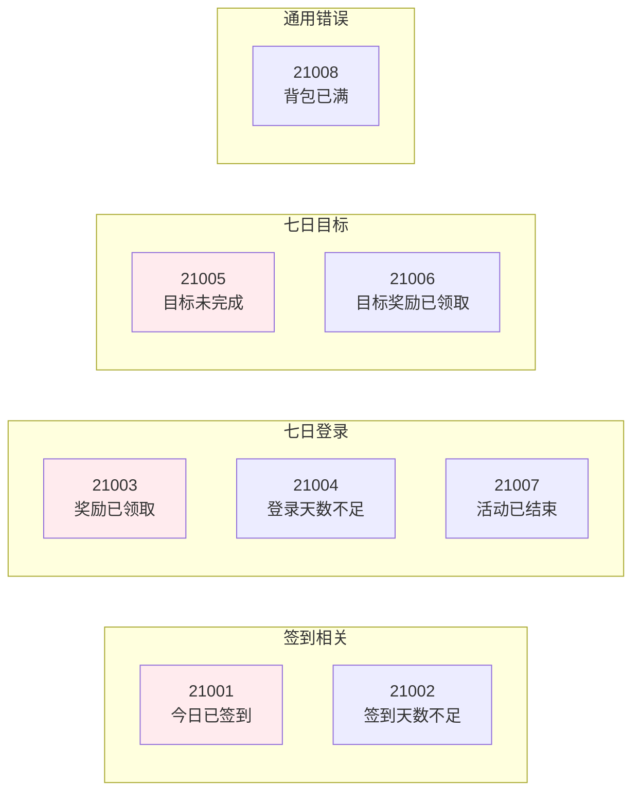

### 6.3 错误处理流程

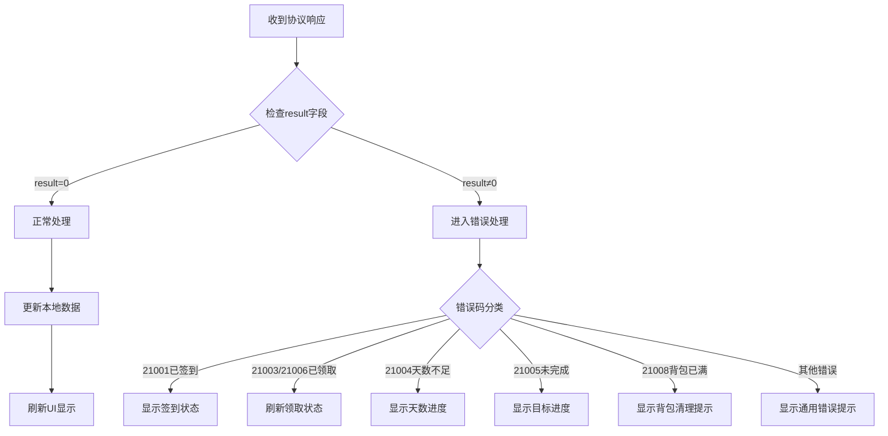

---

## 七、协议安全机制

### 7.1 请求频率限制

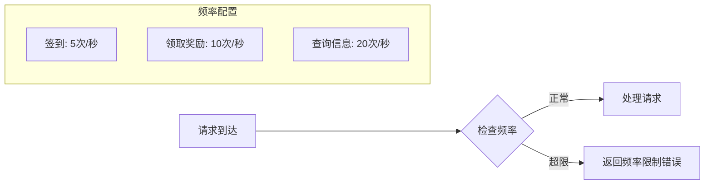

| 协议类型 | 频率限制 | 限制策略 | 超限处理 |
|----------|----------|----------|----------|
| 签到操作 | 5次/秒 | 滑动窗口 | 返回"操作过于频繁" |
| 领取奖励 | 10次/秒 | 滑动窗口 | 返回"操作过于频繁" |
| 查询信息 | 20次/秒 | 滑动窗口 | 返回"请稍后重试" |

### 7.2 参数校验规则

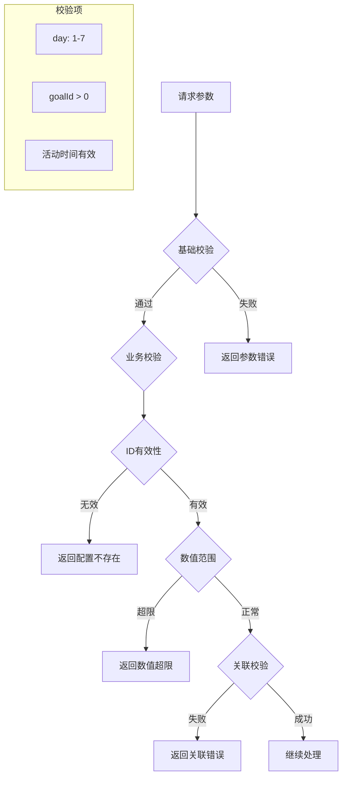

### 7.3 幂等性设计

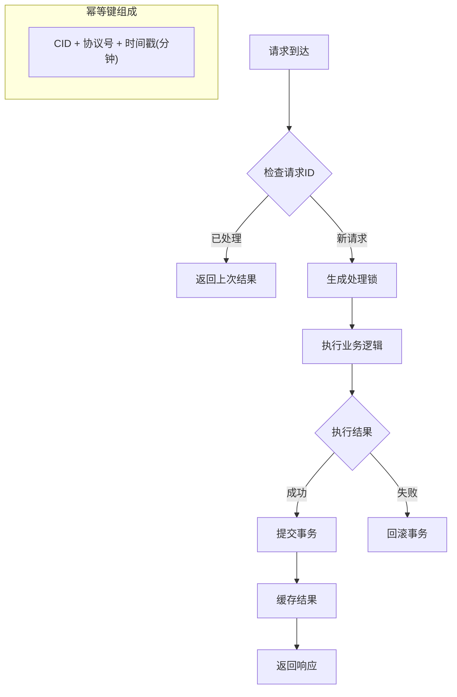

---

## 八、客户端协议封装

### 8.1 协议发送器

```csharp
// GSWriter_021_PlayerInfoOp.cs - 协议发送封装
public static class GSWriter_021_PlayerInfoOp
{
    /// <summary>
    /// 执行每日签到
    /// </summary>
    public static GC2GS_021_027_ReqDailyCheck make_027_ReqDailyCheck()
    {
        GC2GS_021_027_ReqDailyCheck req = new GC2GS_021_027_ReqDailyCheck();
        return req;
    }

    /// <summary>
    /// 领取七日登录奖励
    /// </summary>
    public static GC2GS_021_032_ReqTakeSevenDayReward make_032_ReqTakeSevenDayReward(int day)
    {
        GC2GS_021_032_ReqTakeSevenDayReward req = new GC2GS_021_032_ReqTakeSevenDayReward();
        req.setDay(day);
        return req;
    }

    /// <summary>
    /// 领取目标奖励
    /// </summary>
    public static GC2GS_021_042_ReqTakeGoalReward make_042_ReqTakeGoalReward(long goalId)
    {
        GC2GS_021_042_ReqTakeGoalReward req = new GC2GS_021_042_ReqTakeGoalReward();
        req.setGoalId(goalId);
        return req;
    }
}
```

### 8.2 组件封装调用

```csharp
// SevenDayLoginComponent.cs - 组件层封装
public partial class SevenDayLoginComponent : _ANPBasicPlayerComponent
{
    /// <summary>
    /// 请求每日签到
    /// </summary>
    public void reqDailyCheck(Action<List<NPCommonCostItem>, bool> _backAction = null)
    {
        NPGSClientListener.sendRequestByLog(
            GSWriter_021_PlayerInfoOp.make_027_ReqDailyCheck(),
            new CommonErrCodeRequestCallbackProtocolDealer<GS2GC_021_027_RetDailyCheck>((info) =>
            {
                _m_todayChecked = true;
                _m_totalCheckDays = info.getTotalCheckDays();
                _backAction?.Invoke(info.getRewardList(), info.getVipDouble());
            }));
    }

    /// <summary>
    /// 领取七日登录奖励
    /// </summary>
    public void reqTakeSevenDayReward(int _day, Action<List<NPCommonCostItem>> _backAction = null)
    {
        NPGSClientListener.sendRequestByLog(
            GSWriter_021_PlayerInfoOp.make_032_ReqTakeSevenDayReward(_day),
            new CommonErrCodeRequestCallbackProtocolDealer<GS2GC_021_032_RetTakeSevenDayReward>((info) =>
            {
                _m_rewardTakenList.Add(_day);
                WinMsg.SendMsg(WinMsgType.SEVEN_DAY_REWARD_TAKEN, _day);
                _backAction?.Invoke(info.getRewardList());
            }));
    }

    /// <summary>
    /// 领取目标奖励
    /// </summary>
    public void reqTakeGoalReward(long _goalId, Action<List<NPCommonCostItem>> _backAction = null)
    {
        NPGSClientListener.sendRequestByLog(
            GSWriter_021_PlayerInfoOp.make_042_ReqTakeGoalReward(_goalId),
            new CommonErrCodeRequestCallbackProtocolDealer<GS2GC_021_042_RetTakeGoalReward>((info) =>
            {
                SevenDayGoalInfo goal = getGoal(_goalId);
                if (goal != null)
                {
                    goal.status = ENPGoalStatus.REWARD_TAKEN.ordinal();
                }
                _backAction?.Invoke(info.getRewardList());
            }));
    }
}
```

### 8.3 监听器注册

```csharp
// 协议监听器注册
public void RegisterSevenDayLoginProtocolListeners()
{
    // 签到状态推送
    NPGSClientListener.registSubDealer(
        new GSSubDealer_021_050_OnDailyCheckStatus());

    // 目标进度更新推送
    NPGSClientListener.registSubDealer(
        new GSSubDealer_021_051_OnGoalProgressUpdate());

    // 目标完成推送
    NPGSClientListener.registSubDealer(
        new GSSubDealer_021_052_OnGoalComplete());
}
```

---

## 九、协议监控与日志

### 9.1 协议监控指标

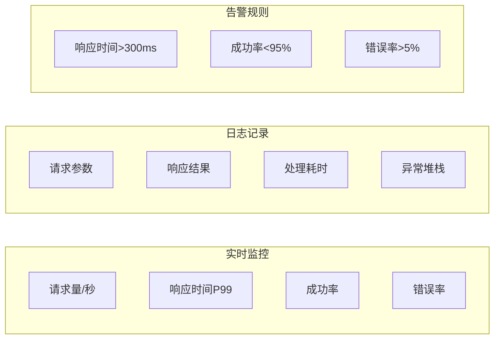

### 9.2 协议日志格式

```json
{
    "timestamp": "2026-04-12T10:30:00.000Z",
    "protocol": "GC2GS_021_032_ReqTakeSevenDayReward",
    "mainOrder": 21,
    "subOrder": 32,
    "cid": 12345678,
    "request": {
        "day": 3
    },
    "response": {
        "result": 0,
        "rewardList": [...]
    },
    "duration": 35,
    "serverIp": "192.168.1.100"
}
```

### 9.3 关键指标监控

| 指标名称 | 计算方式 | 告警阈值 | 说明 |
|----------|----------|----------|------|
| 签到成功率 | 成功数/总请求数 | <95% | 核心业务指标 |
| 平均响应时间 | 总耗时/请求数 | >150ms | 性能指标 |
| P99响应时间 | 第99百分位耗时 | >300ms | 极端情况监控 |
| 错误率 | 错误数/总请求数 | >5% | 稳定性指标 |

---

## 十、协议详细字段说明

### 10.1 SevenDayLogin_Info 完整字段

**路径**: `ClientProtocol/Common/SevenDayLoginObj/SevenDayLogin_Info.cs`

| 字段名 | 类型 | 必填 | 默认值 | 说明 |
|--------|------|------|--------|------|
| loginDay | int | 是 | 0 | 当前登录天数（1-7） |
| rewardTakenList | List\<int\> | 是 | null | 已领取奖励天数列表 |
| goalProgressList | List\<SevenDayGoalProgress\> | 是 | null | 目标进度列表 |
| startTime | long | 是 | 0 | 活动开始时间戳（毫秒） |

**字段联动关系**:
- `loginDay` 与 `startTime` 联动计算
- `rewardTakenList` 包含的天数必须 <= `loginDay`

```csharp
// 客户端解析示例
public void ParseSevenDayLoginInfo(SevenDayLogin_Info info)
{
    int loginDay = info.getLoginDay();
    List<int> takenList = info.getRewardTakenList();
    List<SevenDayGoalProgress> goals = info.getGoalProgressList();
    long startTime = info.getStartTime();

    // 计算活动剩余天数
    long currentTime = FpsAndPingMgr.instance.serverTimeTag;
    long elapsedDays = (currentTime - startTime) / 86400000;
    int remainDays = Math.Max(0, 7 - (int)elapsedDays);
}
```

### 10.2 SevenDayGoalProgress 完整字段

**路径**: `ClientProtocol/Common/SevenDayLoginObj/SevenDayGoalProgress.cs`

| 字段名 | 类型 | 必填 | 默认值 | 说明 |
|--------|------|------|--------|------|
| goalId | long | 是 | 0 | 目标ID |
| progress | long | 是 | 0 | 当前进度 |
| targetValue | long | 是 | 0 | 目标值 |
| status | int | 是 | 0 | 状态：0进行中，1已完成，2已领取 |

**状态转换图**:

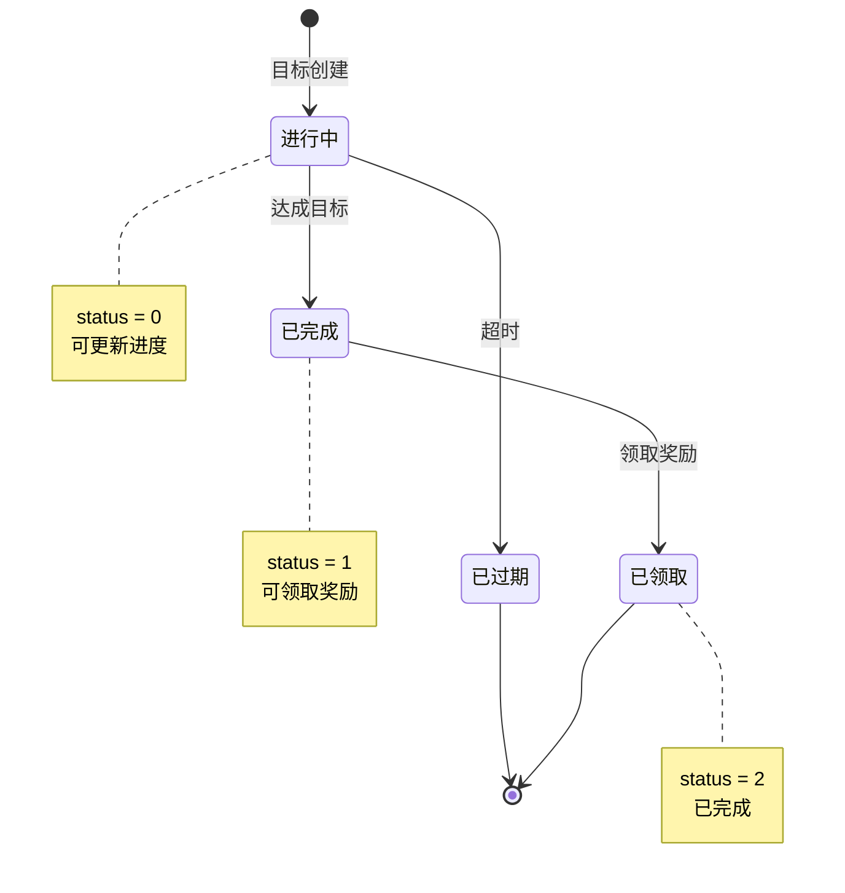

---

## 十一、协议使用完整示例

### 11.1 签到功能完整实现

```csharp
/// <summary>
/// 签到管理器
/// </summary>
public class DailyCheckManager
{
    /// <summary>
    /// 执行签到
    /// </summary>
    public void DoCheck()
    {
        var comp = NPPlayer.instance.sevenDayLoginComp;

        // 检查今日是否已签到
        if (comp.todayChecked)
        {
            UIMessageBox.Show("今日已签到，请明日再来");
            return;
        }

        // 发送签到请求
        comp.reqDailyCheck((rewards, vipDouble) =>
        {
            // 显示签到结果
            ShowCheckResult(rewards, vipDouble);
        });
    }

    /// <summary>
    /// 显示签到结果
    /// </summary>
    private void ShowCheckResult(List<NPCommonCostItem> rewards, bool vipDouble)
    {
        // 播放签到动画
        PlayCheckAnimation();

        // 显示奖励列表
        ShowRewardList(rewards);

        // VIP双倍提示
        if (vipDouble)
        {
            UIMessageBox.Show("签到成功！VIP双倍奖励已发放");
        }
        else
        {
            UIMessageBox.Show("签到成功！");
        }

        // 刷新红点
        RedDotManager.Refresh(ERedDotType.DailyCheck);
    }
}
```

### 11.2 七日登录奖励领取完整实现

```csharp
/// <summary>
/// 七日登录奖励管理器
/// </summary>
public class SevenDayLoginRewardManager
{
    /// <summary>
    /// 领取指定天数奖励
    /// </summary>
    public void TakeReward(int day)
    {
        var comp = NPPlayer.instance.sevenDayLoginComp;

        // 检查登录天数
        if (comp.loginDay < day)
        {
            UIMessageBox.Show($"登录天数未达到，还需{day - comp.loginDay}天");
            return;
        }

        // 检查是否已领取
        if (comp.isRewardTaken(day))
        {
            UIMessageBox.Show("该奖励已领取");
            return;
        }

        // 检查背包空间
        var rewards = GetRewardConfig(day);
        if (!BagManager.HasSpace(rewards))
        {
            UIMessageBox.Show("背包已满，请清理背包");
            return;
        }

        // 发送领取请求
        comp.reqTakeSevenDayReward(day, (actualRewards) =>
        {
            OnTakeRewardSuccess(day, actualRewards);
        });
    }

    /// <summary>
    /// 领取成功处理
    /// </summary>
    private void OnTakeRewardSuccess(int day, List<NPCommonCostItem> rewards)
    {
        // 播放领取动画
        PlayTakeRewardAnimation(day);

        // 显示奖励
        ShowRewardList(rewards);

        // 检查是否为特殊奖励
        if (day == 3 || day == 7)
        {
            PlaySpecialRewardEffect();
        }

        // 刷新UI
        WinMsg.SendMsg(WinMsgType.SEVEN_DAY_LOGIN_CHG);

        // 更新红点
        RedDotManager.Refresh(ERedDotType.SevenDayLogin);
    }

    /// <summary>
    /// 获取奖励配置
    /// </summary>
    private List<NPCommonCostItem> GetRewardConfig(int day)
    {
        var loginRef = GRefdataCoreMgr.instance.sevenDayLoginMap.getRef(day);
        return loginRef?.reward_list ?? new List<NPCommonCostItem>();
    }
}
```

### 11.3 七日目标管理器

```csharp
/// <summary>
/// 七日目标管理器
/// </summary>
public class SevenDayGoalManager
{
    /// <summary>
    /// 领取目标奖励
    /// </summary>
    public void TakeGoalReward(long goalId)
    {
        var comp = NPPlayer.instance.sevenDayLoginComp;
        var goal = comp.getGoal(goalId);

        if (goal == null)
        {
            UIMessageBox.Show("目标不存在");
            return;
        }

        // 检查目标状态
        if (goal.status == ENPGoalStatus.IN_PROGRESS.ordinal())
        {
            UIMessageBox.Show("目标尚未完成");
            return;
        }

        if (goal.status == ENPGoalStatus.REWARD_TAKEN.ordinal())
        {
            UIMessageBox.Show("奖励已领取");
            return;
        }

        // 发送领取请求
        comp.reqTakeGoalReward(goalId, (rewards) =>
        {
            UIMessageBox.Show("领取成功");
            WinMsg.SendMsg(WinMsgType.SEVEN_DAY_GOAL_CHG, goalId);
        });
    }

    /// <summary>
    /// 获取目标进度描述
    /// </summary>
    public string GetGoalProgressText(SevenDayGoalInfo goal)
    {
        if (goal.targetValue <= 0) return "0/0";

        if (goal.progress >= goal.targetValue)
        {
            return "已完成";
        }

        return $"{goal.progress}/{goal.targetValue}";
    }

    /// <summary>
    /// 获取目标进度百分比
    /// </summary>
    public float GetGoalProgressPercent(SevenDayGoalInfo goal)
    {
        if (goal.targetValue <= 0) return 0f;
        return Mathf.Min((float)goal.progress / goal.targetValue, 1f);
    }
}
```

---

## 十二、协议调试技巧

### 12.1 协议抓包分析

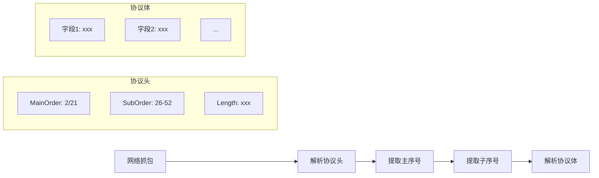

### 12.2 常见协议错误排查

| 错误现象 | 可能原因 | 排查方法 |
|----------|----------|----------|
| 协议解析失败 | 版本不匹配 | 检查协议版本号 |
| 字段值异常 | 字节序错误 | 检查大小端配置 |
| 请求无响应 | 协议路由错误 | 检查主序号配置 |
| 响应数据错乱 | 字段类型错误 | 检查协议定义 |

---

## 十三、协议版本兼容

### 13.1 版本兼容策略

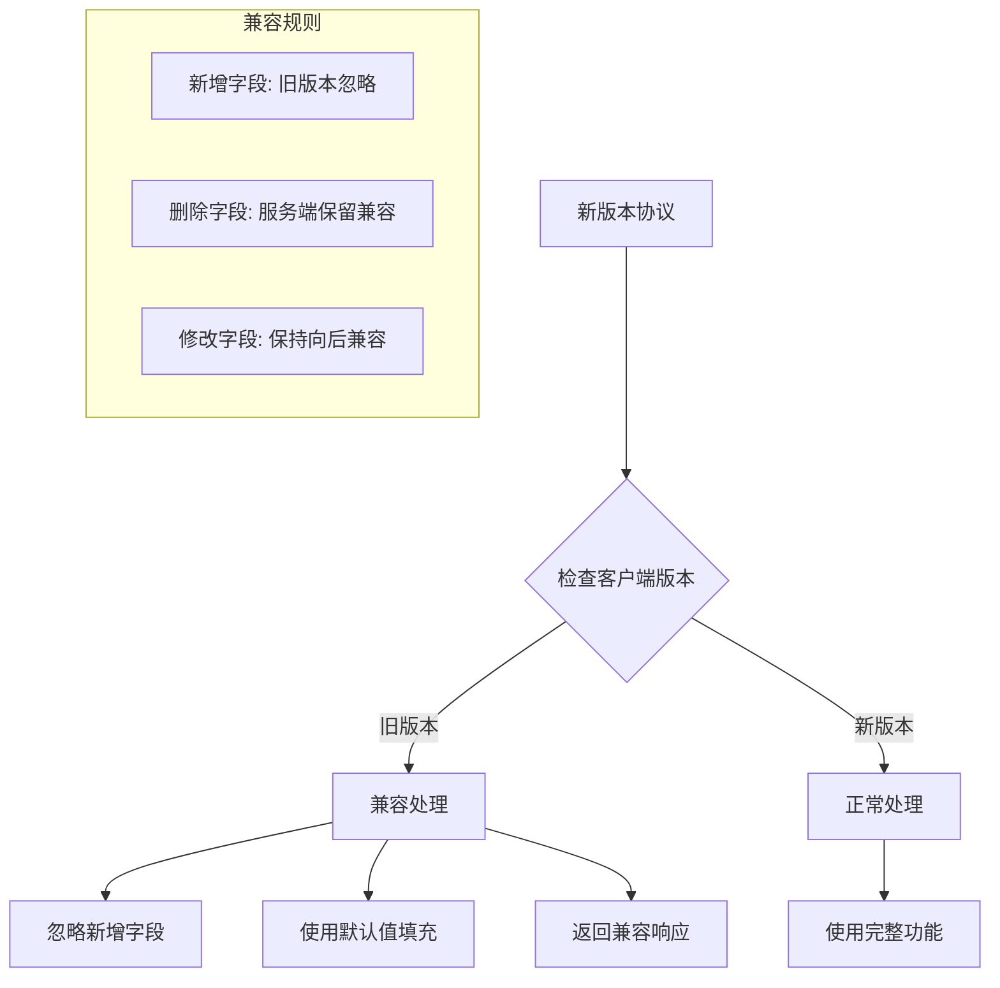

### 13.2 协议升级指南

| 升级类型 | 兼容性 | 处理方式 |
|----------|--------|----------|
| 新增字段 | 向后兼容 | 旧版本忽略，新版本使用 |
| 新增协议 | 向后兼容 | 旧版本不调用，新版本使用 |
| 删除字段 | 不兼容 | 需要强制更新 |
| 修改字段类型 | 不兼容 | 需要强制更新 |

---

*文档生成时间: 2026-04-12*
*文档版本: v1.4.0*
