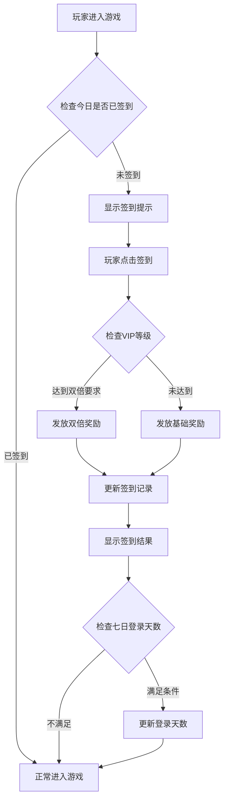
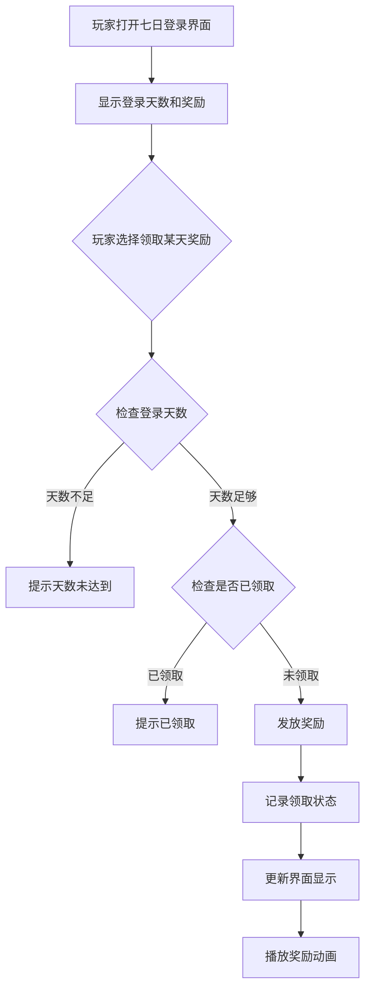
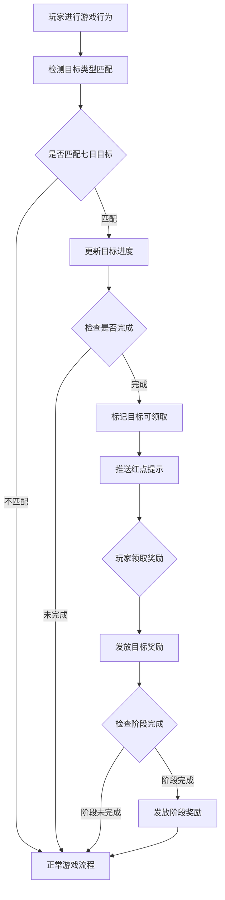

# 七日登录模块完整说明

## 一、模块概述

### 1.1 业务背景

七日登录模块是 K2C 游戏的新手引导和留存激励系统，通过连续登录奖励和目标达成机制，引导新玩家快速融入游戏，提升游戏初期的活跃度和留存率。该模块结合每日签到、七日大奖和七日目标，形成完整的新手激励体系。

### 1.2 目标用户

- **新注册玩家**：首次进入游戏的新用户，是本模块的核心用户群体
- **回流玩家**：重新进入游戏的流失玩家，通过奖励引导重新体验游戏
- **运营人员**：通过签到数据分析玩家留存情况，优化奖励配置

### 1.3 核心价值

1. **提升留存**：通过连续登录奖励机制，激励玩家每日登录
2. **新手引导**：通过七日目标引导玩家了解游戏核心玩法
3. **价值感知**：通过丰厚奖励让玩家感知游戏价值
4. **习惯养成**：培养玩家每日登录的游戏习惯

---

## 二、功能清单

### 2.1 每日签到功能

| 功能名称 | 功能描述 | 用户价值 |
|---------|---------|---------|
| 每日签到 | 每日首次登录进行签到 | 获得每日基础奖励 |
| 累计签到 | 记录累计签到天数 | 追踪长期活跃度 |
| VIP双倍 | VIP玩家签到奖励翻倍 | VIP特权体验 |
| 签到奖励预览 | 查看未来签到奖励 | 激励持续登录 |

### 2.2 七日登录功能

| 功能名称 | 功能描述 | 用户价值 |
|---------|---------|---------|
| 登录天数统计 | 记录玩家连续登录天数 | 追踪登录进度 |
| 七日大奖领取 | 领取每日登录奖励 | 获得丰厚奖励 |
| 奖励预览 | 查看各天奖励内容 | 规划领取策略 |
| 特殊奖励标注 | 高价值奖励特殊展示 | 提升期待感 |

### 2.3 七日目标功能

| 功能名称 | 功能描述 | 用户价值 |
|---------|---------|---------|
| 目标列表 | 展示每日目标及进度 | 了解目标内容 |
| 进度追踪 | 实时更新目标完成进度 | 追踪完成情况 |
| 目标奖励 | 完成目标领取奖励 | 获得额外奖励 |
| 阶段奖励 | 完成阶段目标领取大奖 | 获得高额奖励 |

---

## 三、业务流程详解

### 3.1 每日签到流程



**详细步骤说明**：

1. **签到检查**
   - 检查玩家今日是否已签到
   - 检查签到功能是否已解锁

2. **奖励发放**
   - 根据累计签到天数获取对应奖励配置
   - 检查VIP等级是否满足双倍条件
   - 发放奖励到玩家背包

3. **数据更新**
   - 更新累计签到天数
   - 标记今日已签到
   - 记录签到时间

### 3.2 七日登录奖励领取流程



**详细步骤说明**：

1. **资格检查**
   - 检查玩家登录天数是否达到要求
   - 检查该天奖励是否已领取

2. **奖励发放**
   - 根据天数获取奖励配置
   - 发放奖励物品到玩家背包
   - 记录领取状态

3. **界面更新**
   - 更新奖励领取状态显示
   - 播放领取动画效果

### 3.3 七日目标完成流程



**详细步骤说明**：

1. **进度更新**
   - 监听玩家游戏行为
   - 匹配对应的目标类型
   - 更新目标进度值

2. **完成检测**
   - 检查进度是否达到目标值
   - 标记目标完成状态
   - 推送通知给客户端

3. **奖励发放**
   - 验证领取资格
   - 发放目标奖励
   - 检查阶段完成情况

---

## 四、关键规则

### 4.1 签到规则

1. **签到时间**
   - 每日 00:00 重置签到状态
   - 当天首次登录即可签到

2. **累计天数**
   - 签到天数累加计算，不重置
   - 断签不影响已累计天数

3. **VIP双倍**
   - 需达到指定VIP等级才可享受双倍
   - 双倍仅针对签到基础奖励

### 4.2 七日登录规则

1. **时间计算**
   - 从玩家首次登录开始计算
   - 连续7天为一个周期
   - 每天只能领取当天奖励

2. **奖励领取**
   - 登录天数达到即可领取
   - 奖励需手动领取
   - 可补领错过的奖励

3. **特殊奖励**
   - 第3天、第7天为特殊大奖
   - 特殊奖励有专属展示

### 4.3 七日目标规则

1. **目标类型**
   - 等级目标：达到指定等级
   - 副本目标：通关指定副本
   - 英雄目标：获得指定英雄
   - 资源目标：获取指定资源

2. **完成条件**
   - 必须在七日周期内完成
   - 超时未完成视为失败

3. **奖励规则**
   - 目标奖励可单独领取
   - 阶段奖励需完成全部子目标

---

## 五、用户故事

### 5.1 新玩家故事

> 作为一名刚下载游戏的新玩家，我第一次进入游戏就看到了七日登录活动。界面显示第一天登录就能获得一个稀有英雄，这让我非常期待。我点击签到，立刻获得了100钻石和5000银两，还有VIP双倍加成。我迫不及待地开始了游戏之旅，期待着明天的奖励。

### 5.2 活跃玩家故事

> 作为一名活跃玩家，我已经连续登录了6天。每天上线第一件事就是签到领取奖励。七日目标引导我完成了许多我可能忽略的玩法，比如英雄培养和装备强化。今天是第七天，我领取了终极大奖——一个SSR级别的英雄，这让我对游戏充满了热情。

### 5.3 回流玩家故事

> 作为一名回流玩家，我重新进入游戏后发现七日登录活动重新开始了。虽然错过了之前的进度，但新的七日目标帮助我快速了解游戏的新内容。奖励也很丰厚，让我能够快速追上进度。

---

## 六、示例

### 6.1 每日签到示例

**输入数据**：
- 玩家ID：20001
- VIP等级：3
- 累计签到天数：15

**签到配置**：
```
第16天签到奖励：
  - 银两 × 5000
  - 钻石 × 100
  - VIP双倍需求：VIP 2
```

**签到结果**：
```
获得奖励：
  - 银两 × 10000（基础5000 + VIP双倍5000）
  - 钻石 × 200（基础100 + VIP双倍100）
累计签到天数：16
今日签到状态：已签到
```

### 6.2 七日登录奖励示例

**初始状态**：
```
登录天数：5
已领取奖励：[1, 2, 3, 4]
```

**操作**：领取第5天奖励

**第5天奖励配置**：
```
银两 × 20000
钻石 × 200
体力药水 × 2
```

**领取结果**：
```
获得奖励：银两 × 20000, 钻石 × 200, 体力药水 × 2
已领取奖励：[1, 2, 3, 4, 5]
```

### 6.3 七日目标示例

**目标配置**：
```
目标ID：101
目标类型：等级
目标值：20级
奖励：英雄碎片 × 10
```

**初始状态**：
```
当前等级：18
进度：18/20
状态：进行中
```

**完成操作**：玩家升级到20级

**完成结果**：
```
进度：20/20
状态：已完成
可领取奖励：英雄碎片 × 10
```

---

*文档生成时间: 2026-04-07*
