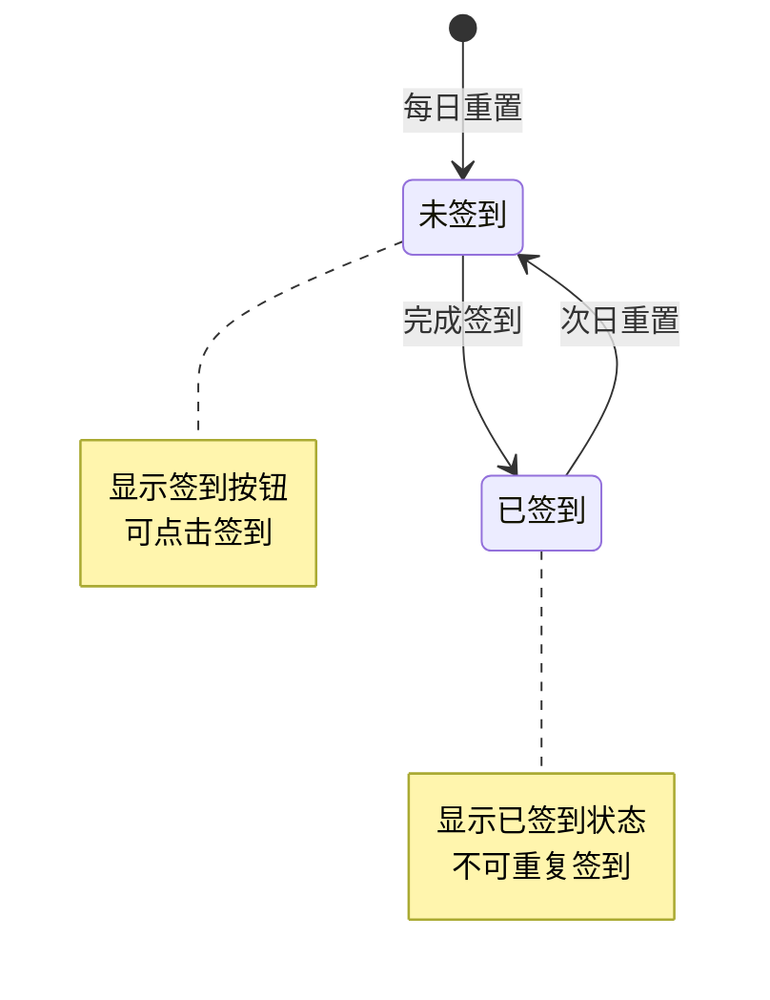
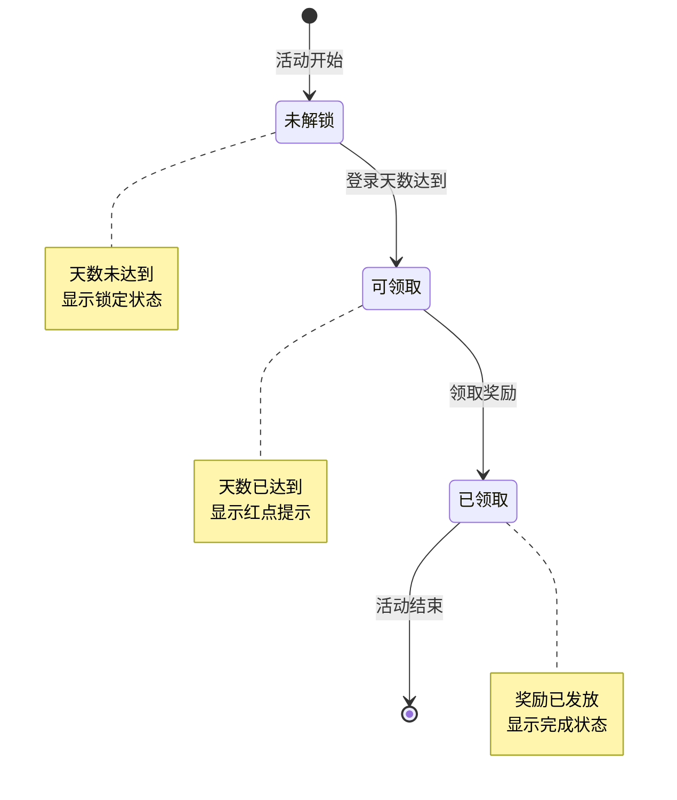
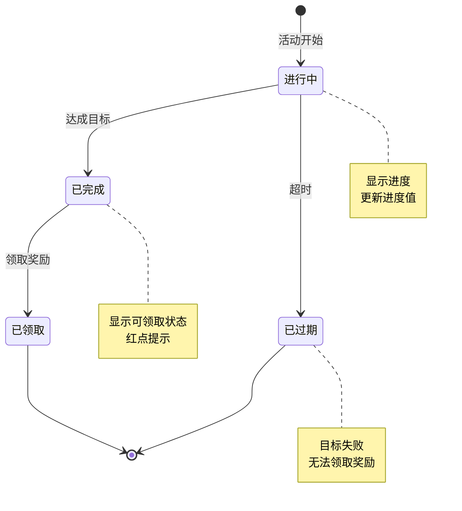
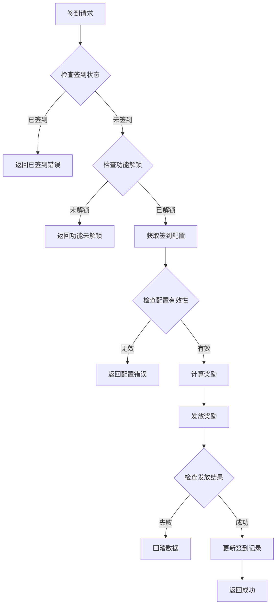

# 七日登录模块实现细节

## 一、计算公式

### 1.1 签到奖励计算公式

```
实际奖励 = 基础奖励 × (1 + VIP双倍加成)
```

**参数说明**：
- `基础奖励`：配置表中的签到奖励
- `VIP双倍加成`：VIP等级满足条件时为1，否则为0

**示例计算**：
```
基础奖励：银两 × 5000
VIP双倍需求：VIP 2
玩家VIP等级：3

VIP双倍加成 = 1（满足条件）
实际奖励 = 5000 × (1 + 1) = 10000银两
```

### 1.2 登录天数计算公式

```
登录天数 = min(floor((当前时间 - 开始时间) / 86400) + 1, 7)
```

**参数说明**：
- `开始时间`：玩家首次登录时间戳
- `86400`：一天的秒数

**示例计算**：
```
开始时间：2026-04-01 10:00:00
当前时间：2026-04-05 15:00:00

经过秒数：4天5小时 = 373200秒
登录天数 = floor(373200 / 86400) + 1 = 5
```

### 1.3 目标进度计算公式

```
当前进度百分比 = min(当前值 / 目标值 × 100%, 100%)
```

**参数说明**：
- `当前值`：玩家当前达成值
- `目标值`：配置表中的目标值

---

## 二、状态机定义

### 2.1 签到状态机



### 2.2 七日登录奖励状态机



### 2.3 目标状态机



### 2.4 七日活动周期状态机

```mermaid
stateDiagram-v2
    [*] --> Day1: 首次登录
    Day1 --> Day2: 次日登录
    Day2 --> Day3: 次日登录
    Day3 --> Day4: 次日登录
    Day4 --> Day5: 次日登录
    Day5 --> Day6: 次日登录
    Day6 --> Day7: 次日登录
    Day7 --> 已结束: 活动完成

    note right of DayN
        可领取当天奖励
        显示进度指示
    end note
```

---

## 三、数据约束

### 3.1 签到数据约束

| 字段名 | 数据类型 | 取值范围 | 必填 | 说明 |
|--------|----------|----------|------|------|
| player_id | bigint | > 0 | 是 | 玩家ID |
| today_checked | tinyint | 0-1 | 是 | 今日是否签到 |
| total_check_days | int | >= 0 | 是 | 累计签到天数 |
| last_check_time | datetime | - | 是 | 最后签到时间 |

### 3.2 七日登录数据约束

| 字段名 | 数据类型 | 取值范围 | 必填 | 说明 |
|--------|----------|----------|------|------|
| player_id | bigint | > 0 | 是 | 玩家ID |
| login_day | int | 1-7 | 是 | 当前登录天数 |
| reward_taken_list | json | - | 是 | 已领取奖励列表 |
| start_time | datetime | - | 是 | 开始时间 |

### 3.3 七日目标数据约束

| 字段名 | 数据类型 | 取值范围 | 必填 | 说明 |
|--------|----------|----------|------|------|
| player_id | bigint | > 0 | 是 | 玩家ID |
| goal_id | int | > 0 | 是 | 目标ID |
| progress | long | >= 0 | 是 | 当前进度 |
| target_value | long | > 0 | 是 | 目标值 |
| status | int | 0-2 | 是 | 状态：0进行中，1已完成，2已领取 |
| day | int | 1-7 | 是 | 所属天数 |

### 3.4 配置数据约束

| 字段名 | 数据类型 | 取值范围 | 必填 | 说明 |
|--------|----------|----------|------|------|
| day | int | 1-7 | 是 | 天数 |
| reward_list | array | 非空 | 是 | 奖励列表 |
| is_special | bool | - | 否 | 是否特殊奖励 |
| vip_double_need | int | 0-15 | 否 | VIP双倍需求等级 |

---

## 四、错误处理策略

### 4.1 七日登录模块错误码

| 错误码 | 错误信息 | 处理策略 | 用户提示 |
|--------|----------|----------|----------|
| 21001 | 今日已签到 | 检查签到状态 | "今日已签到，请明日再来" |
| 21002 | 签到天数未达到 | 检查天数配置 | "累计签到天数不足" |
| 21003 | 奖励已领取 | 检查领取记录 | "该奖励已领取" |
| 21004 | 登录天数未达到 | 检查登录天数 | "登录天数未达到，请继续登录" |
| 21005 | 目标未完成 | 检查目标进度 | "目标尚未完成" |
| 21006 | 目标奖励已领取 | 检查领取状态 | "该目标奖励已领取" |
| 21007 | 活动已结束 | 检查活动时间 | "七日活动已结束" |

### 4.2 签到错误处理流程



### 4.3 奖励领取错误处理

| 错误场景 | 处理策略 | 数据处理 |
|----------|----------|----------|
| 背包空间不足 | 返回错误，提示清理背包 | 不扣减奖励 |
| 奖励配置缺失 | 记录日志，跳过该奖励 | 发放其他奖励 |
| 网络超时 | 重试机制，最多3次 | 事务保证 |
| 数据库异常 | 事务回滚 | 恢复原始状态 |

---

## 五、关键代码示例

### 5.1 每日签到伪代码

```csharp
public Result DailyCheck(long playerId)
{
    // 1. 获取玩家数据
    PlayerDailyCheck check = dailyCheckDao.selectById(playerId);
    if (check == null)
    {
        check = new PlayerDailyCheck { playerId = playerId };
        dailyCheckDao.insert(check);
    }

    // 2. 检查今日是否已签到
    if (check.todayChecked)
    {
        return Result.Error(21001, "今日已签到");
    }

    // 3. 获取签到配置
    int nextDay = check.totalCheckDays + 1;
    DailyCheckConfig config = dailyCheckConfigDao.getByDay(nextDay);
    if (config == null)
    {
        // 循环或使用默认配置
        config = dailyCheckConfigDao.getDefault();
    }

    // 4. 发放基础奖励
    List<RewardItem> rewards = new List<RewardItem>(config.rewardList);
    itemService.giveItems(playerId, rewards);

    // 5. VIP双倍检查
    PlayerBase player = playerDao.selectById(playerId);
    if (player.vipLevel >= config.vipDoubleNeed)
    {
        itemService.giveItems(playerId, rewards);
    }

    // 6. 更新签到数据
    check.todayChecked = true;
    check.totalCheckDays = nextDay;
    check.lastCheckTime = DateTime.Now;
    dailyCheckDao.updateById(check);

    // 7. 更新七日登录天数
    UpdateSevenDayLogin(playerId);

    // 8. 推送签到结果
    PushCheckResult(playerId, rewards, player.vipLevel >= config.vipDoubleNeed);

    return Result.Success(new { rewards, vipDouble = player.vipLevel >= config.vipDoubleNeed });
}
```

### 5.2 七日登录奖励领取伪代码

```csharp
public Result TakeSevenDayReward(long playerId, int day)
{
    // 1. 参数校验
    if (day < 1 || day > 7)
    {
        return Result.Error(ErrorCode.PARAM_ERROR, "天数参数错误");
    }

    // 2. 获取七日登录数据
    PlayerSevenDayLogin loginData = sevenDayLoginDao.selectById(playerId);
    if (loginData == null)
    {
        return Result.Error(ErrorCode.DATA_NOT_FOUND, "玩家数据不存在");
    }

    // 3. 检查登录天数
    if (loginData.loginDay < day)
    {
        return Result.Error(21004, "登录天数未达到");
    }

    // 4. 检查是否已领取
    if (loginData.rewardTakenList.Contains(day))
    {
        return Result.Error(21003, "奖励已领取");
    }

    // 5. 获取奖励配置
    SevenDayLoginConfig config = sevenDayConfigDao.getByDay(day);
    if (config == null)
    {
        return Result.Error(ErrorCode.CONFIG_ERROR, "配置不存在");
    }

    // 6. 发放奖励
    itemService.giveItems(playerId, config.rewardList);

    // 7. 记录领取
    loginData.rewardTakenList.Add(day);
    sevenDayLoginDao.updateById(loginData);

    // 8. 推送领取结果
    PushTakeRewardResult(playerId, day, config.rewardList);

    return Result.Success(config.rewardList);
}
```

### 5.3 目标进度更新伪代码

```csharp
public void UpdateGoalProgress(long playerId, int goalType, long value)
{
    // 1. 获取相关目标列表
    List<SevenDayGoal> goals = sevenDayGoalDao.getByType(playerId, goalType);
    if (goals == null || goals.Count == 0)
    {
        return;
    }

    foreach (var goal in goals)
    {
        // 2. 检查目标状态
        if (goal.status != 0) // 0=进行中
        {
            continue;
        }

        // 3. 检查是否在活动周期内
        if (!IsInActivityPeriod(playerId, goal.day))
        {
            continue;
        }

        // 4. 更新进度
        goal.progress += value;

        // 5. 检查是否完成
        if (goal.progress >= goal.targetValue)
        {
            goal.progress = goal.targetValue;
            goal.status = 1; // 已完成

            // 推送目标完成通知
            PushGoalComplete(playerId, goal);
        }

        sevenDayGoalDao.updateById(goal);
    }
}
```

### 5.4 每日重置伪代码

```csharp
@Scheduled(cron = "0 0 0 * * ?")
public void DailyReset()
{
    // 1. 重置所有玩家的今日签到状态
    dailyCheckDao.resetTodayChecked();

    // 2. 检查七日目标过期
    List<PlayerSevenDayLogin> expiredList = sevenDayLoginDao.getExpiredList();
    foreach (var login in expiredList)
    {
        // 标记未完成目标为过期
        List<SevenDayGoal> goals = sevenDayGoalDao.getByPlayerId(login.playerId);
        foreach (var goal in goals)
        {
            if (goal.status == 0)
            {
                goal.status = 3; // 已过期
                sevenDayGoalDao.updateById(goal);
            }
        }
    }

    // 3. 记录日志
    logger.info("每日签到重置完成");
}
```

---

## 六、跨模块依赖

### 6.1 模块依赖关系

| 依赖模块 | 依赖内容 | 说明 |
|----------|----------|------|
| Player模块 | 玩家基础数据、VIP等级 | 用于VIP双倍判断 |
| Bag模块 | 背包空间检查、物品发放 | 奖励发放依赖 |
| Item模块 | 物品配置、物品创建 | 奖励物品创建 |
| Notice模块 | 红点提示、推送通知 | 状态变更通知 |
| Task模块 | 任务进度触发 | 目标类型复用 |

### 6.2 接口依赖

```csharp
// 玩家模块接口
interface IPlayerService
{
    PlayerInfo GetPlayer(long playerId);
    int GetVipLevel(long playerId);
}

// 背包模块接口
interface IBagService
{
    bool HasSpace(long playerId, List<RewardItem> items);
    void AddItems(long playerId, List<RewardItem> items);
}

// 通知模块接口
interface INoticeService
{
    void PushRedDot(long playerId, string dotType);
    void PushMessage(long playerId, object message);
}
```

### 6.3 事件依赖

| 事件类型 | 触发时机 | 处理逻辑 |
|----------|----------|----------|
| 玩家登录 | 玩家进入游戏 | 检查签到状态、更新登录天数 |
| 玩家升级 | 等级提升 | 更新等级目标进度 |
| 副本通关 | 完成副本 | 更新副本目标进度 |
| 获得英雄 | 新英雄入队 | 更新英雄目标进度 |

---

*文档生成时间: 2026-04-07*
