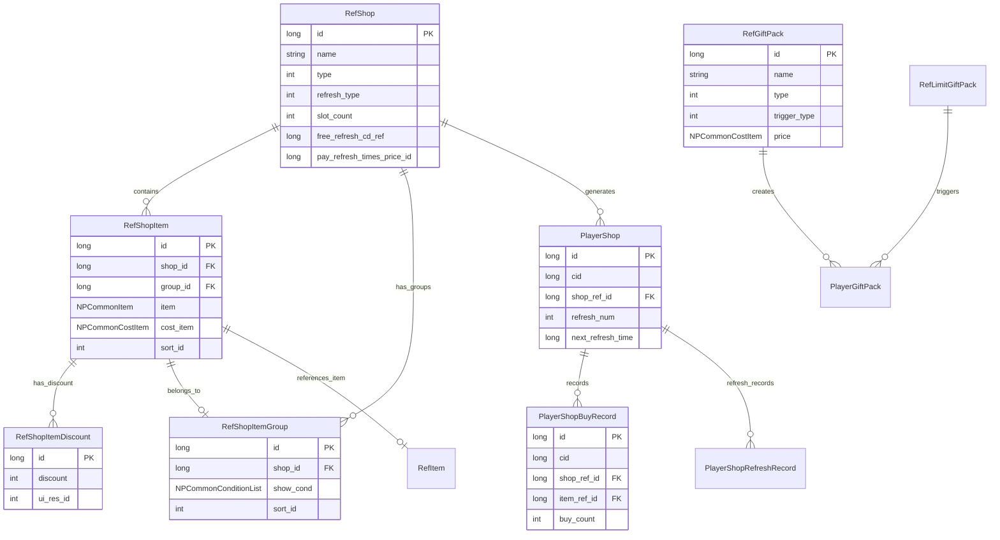
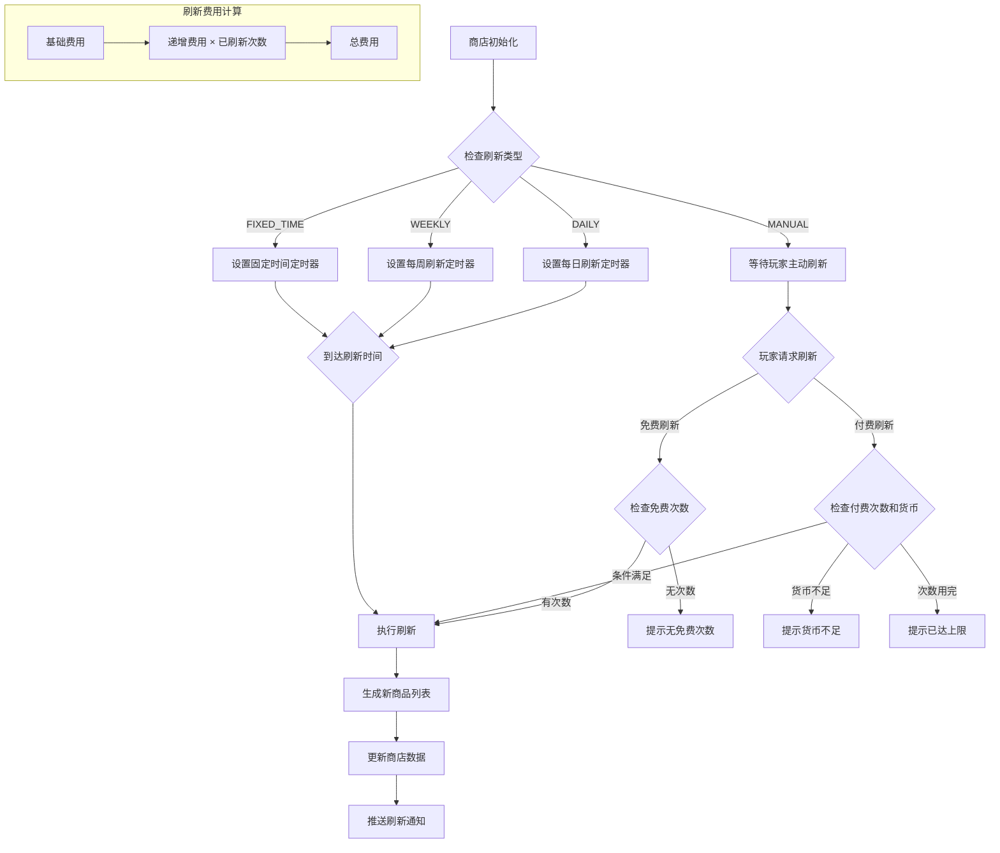
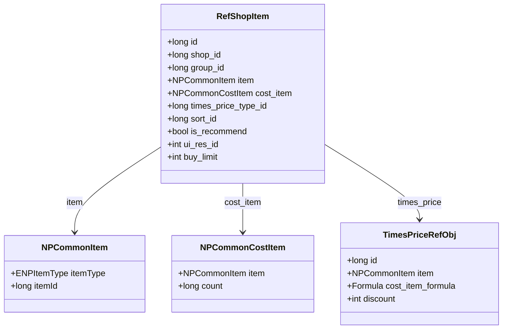
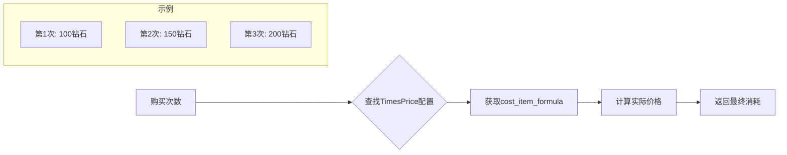
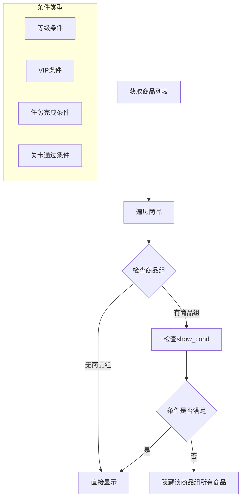
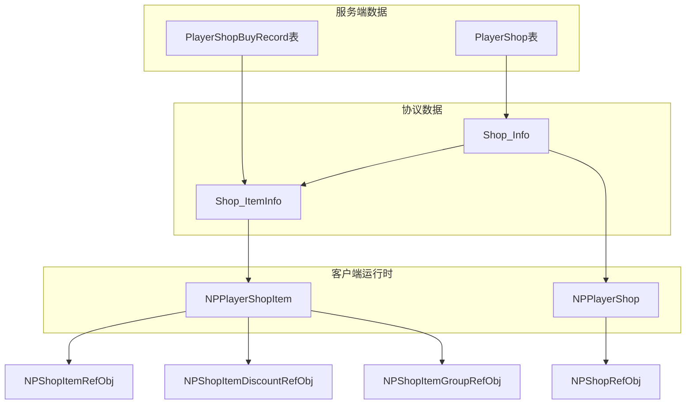
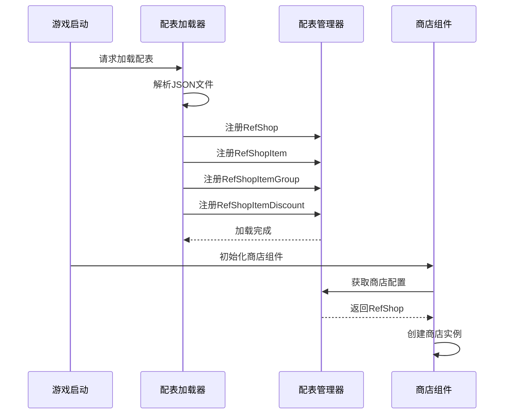
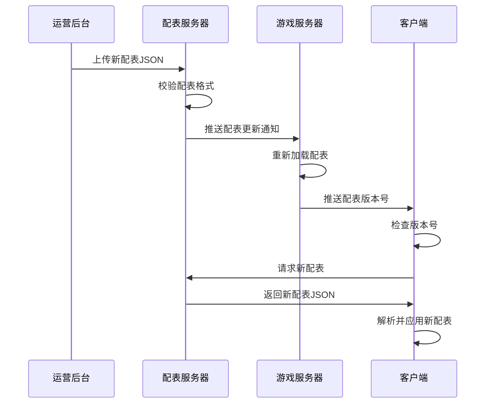

# 商店模块数据配表文档

## 协议模块编号: p030

**源码路径**:
- 配表数据: `/game_server/RefData/`
- 协议对象: `/ClientProtocol/Common/ShopObj/`

---

## 一、配表总览

### 1.1 配表清单

| 配表名称 | 文件名 | 说明 | 核心用途 |
|---------|--------|------|----------|
| RefShop | shop_ref.json | 商店基础配置 | 定义商店类型、刷新规则 |
| RefShopItem | shop_item_ref.json | 商品配置 | 定义商品内容、价格 |
| RefShopItemGroup | shop_item_group_ref.json | 商品组配置 | 定义商品分组、显示条件 |
| RefShopItemDiscount | shop_item_discount_ref.json | 商品折扣配置 | 定义折扣比例、时效 |
| RefGiftPack | gift_pack_ref.json | 礼包配置 | 定义礼包内容、触发条件 |
| RefLimitGiftPack | limit_gift_pack_ref.json | 限时礼包配置 | 定义限时礼包规则 |

### 1.2 配表关系图



---

## 二、商店配表 (RefShop)

### 2.1 完整字段列表

**文件**: `shop_ref.json`

| 字段名 | 类型 | 必填 | 默认值 | 说明 |
|--------|------|------|--------|------|
| id | long | 是 | - | 商店配置ID（主键） |
| name | string | 是 | - | 商店名称 |
| type | int | 是 | 1 | 商店类型(ENPShopType) |
| refresh_type | int | 是 | 1 | 刷新类型(ENPShopRefreshType) |
| slot_count | int | 是 | 6 | 商品槽数量 |
| free_refresh_cd | NPCommonItem | 否 | null | 免费刷新CD配置（引用LAZY_CD或FIXED_CD） |
| pay_refresh_times_price_id | long | 否 | 0 | 付费刷新递增价格配置ID |
| pay_refresh_limit | int | 否 | 0 | 付费刷新次数上限 |
| auto_refresh_time_list | List\<int\> | 否 | [] | 自动刷新时间点列表(小时) |
| ui_res_id | int | 否 | 0 | UI资源ID |
| desc | string | 否 | "" | 商店描述 |

### 2.2 商店类型枚举 (ENPShopType)

```csharp
public enum ENPShopType
{
    NORMAL = 1,      // 普通商店
    ARENA = 2,       // 竞技场商店
    GUILD = 3,       // 公会商店
    ACTIVITY = 4,    // 活动商店
    MYSTERY = 5,     // 神秘商店
    VIP = 6,         // VIP商店
    HONOR = 7,       // 荣誉商店
    FRIENDSHIP = 8,  // 友情商店
}
```

| 类型ID | 枚举名 | 说明 | 货币类型 | 特点 |
|--------|--------|------|----------|------|
| 1 | NORMAL | 普通商店 | 银两 | 固定商品，每日刷新 |
| 2 | ARENA | 竞技场商店 | 竞技币 | PVP奖励兑换 |
| 3 | GUILD | 公会商店 | 公会贡献 | 公会福利兑换 |
| 4 | ACTIVITY | 活动商店 | 活动货币 | 限时活动兑换 |
| 5 | MYSTERY | 神秘商店 | 钻石 | 随机刷新，折扣力度大 |
| 6 | VIP | VIP商店 | 钻石 | VIP专属商品 |
| 7 | HONOR | 荣誉商店 | 荣誉点 | 成就奖励兑换 |
| 8 | FRIENDSHIP | 友情商店 | 友情点 | 社交奖励兑换 |

### 2.3 刷新类型枚举 (ENPShopRefreshType)

```csharp
public enum ENPShopRefreshType
{
    MANUAL = 1,     // 手动刷新
    DAILY = 2,      // 每日刷新
    WEEKLY = 3,     // 每周刷新
    FIXED_TIME = 4, // 固定时间刷新
}
```

| 类型ID | 枚举名 | 说明 | 刷新时机 | 使用场景 |
|--------|--------|------|----------|----------|
| 1 | MANUAL | 手动刷新 | 玩家主动点击 | 高级商店、神秘商店 |
| 2 | DAILY | 每日刷新 | 每日固定时间点 | 大部分商店 |
| 3 | WEEKLY | 每周刷新 | 每周固定时间 | 周常商店 |
| 4 | FIXED_TIME | 固定时间 | 指定时间点 | 活动商店 |

### 2.4 商店刷新机制流程图



### 2.5 商店配置示例

```json
{
  "id": 1001,
  "name": "神秘商店",
  "type": 5,
  "refresh_type": 2,
  "slot_count": 6,
  "free_refresh_cd": {
    "itemType": 12,
    "itemId": 10001
  },
  "pay_refresh_times_price_id": 50001,
  "pay_refresh_limit": 10,
  "auto_refresh_time_list": [0, 12, 18],
  "ui_res_id": 1001,
  "desc": "每日刷新稀有商品，折扣力度大"
}
```

---

## 三、商品配表 (RefShopItem)

### 3.1 完整字段列表

**文件**: `shop_item_ref.json`

| 字段名 | 类型 | 必填 | 默认值 | 说明 |
|--------|------|------|--------|------|
| id | long | 是 | - | 商品ID（主键） |
| shop_id | long | 是 | - | 所属商店ID（外键） |
| group_id | long | 否 | 0 | 商品组ID（外键） |
| item | NPCommonItem | 是 | - | 商品内容物品 |
| cost_item | NPCommonCostItem | 是 | - | 购买消耗物品 |
| times_price_type_id | long | 否 | 0 | 递增价格配置ID |
| sort_id | long | 否 | 0 | 排序ID |
| is_recommend | bool | 否 | false | 是否推荐商品 |
| ui_res_id | int | 否 | 0 | UI资源ID |
| buy_limit | int | 否 | 0 | 购买次数上限（0表示无限制） |

### 3.2 商品数据结构



### 3.3 递增价格机制



### 3.4 商品配置示例

```json
{
  "id": 20001,
  "shop_id": 1001,
  "group_id": 0,
  "item": {
    "itemType": 1,
    "itemId": 30001
  },
  "cost_item": {
    "item": {
      "itemType": 2,
      "itemId": 0
    },
    "count": 500
  },
  "times_price_type_id": 0,
  "sort_id": 1,
  "is_recommend": true,
  "ui_res_id": 0,
  "buy_limit": 2
}
```

---

## 四、商品组配表 (RefShopItemGroup)

### 4.1 完整字段列表

**文件**: `shop_item_group_ref.json`

| 字段名 | 类型 | 必填 | 默认值 | 说明 |
|--------|------|------|--------|------|
| id | long | 是 | - | 商品组ID（主键） |
| shop_id | long | 是 | - | 所属商店ID（外键） |
| show_cond | NPCommonConditionList | 否 | [] | 显示条件列表 |
| sort_id | long | 否 | 0 | 排序ID |

### 4.2 商品组显示条件流程



### 4.3 商品组配置示例

```json
{
  "id": 30001,
  "shop_id": 1001,
  "show_cond": [
    {
      "condType": 1,
      "condValue": 30
    }
  ],
  "sort_id": 1
}
```

---

## 五、商品折扣配表 (RefShopItemDiscount)

### 5.1 完整字段列表

**文件**: `shop_item_discount_ref.json`

| 字段名 | 类型 | 必填 | 默认值 | 说明 |
|--------|------|------|--------|------|
| id | long | 是 | - | 折扣ID（主键） |
| discount | int | 是 | 10000 | 折扣比例（万分比，10000=100%） |
| ui_res_id | int | 否 | 0 | UI资源ID |

### 5.2 折扣计算公式

```
实际价格 = 原价 × discount / 10000
```

**示例**:
| discount值 | 折扣 | 计算示例 |
|------------|------|----------|
| 10000 | 100%（无折扣） | 500 × 10000/10000 = 500 |
| 8000 | 80%（8折） | 500 × 8000/10000 = 400 |
| 5000 | 50%（5折） | 500 × 5000/10000 = 250 |
| 3000 | 30%（3折） | 500 × 3000/10000 = 150 |

---

## 六、协议数据结构

### 6.1 Shop_Info - 商店信息

**路径**: `ClientProtocol/Common/ShopObj/Shop_Info.cs`

```csharp
public class Shop_Info : _IALProtocolStructure
{
    /// <summary>
    /// 商店配置id
    /// </summary>
    private long shopRefId;

    /// <summary>
    /// 下一次刷新时间戳(毫秒)
    /// </summary>
    private long nextRefreshTimeMs;

    /// <summary>
    /// 已刷新次数
    /// </summary>
    private int refreshNum;

    /// <summary>
    /// 商品列表
    /// </summary>
    private List<Shop_ItemInfo> goodsList;
}
```

| 字段名 | 类型 | 说明 | 示例值 |
|--------|------|------|--------|
| shopRefId | long | 商店配置ID | 1001 |
| nextRefreshTimeMs | long | 下一次刷新时间戳(毫秒) | 1640000000000 |
| refreshNum | int | 已刷新次数 | 2 |
| goodsList | List\<Shop_ItemInfo\> | 商品列表 | [item1, item2...] |

### 6.2 Shop_ItemInfo - 商品信息

**路径**: `ClientProtocol/Common/ShopObj/Shop_ItemInfo.cs`

```csharp
public class Shop_ItemInfo : _IALProtocolStructure
{
    /// <summary>
    /// 商品实例id
    /// </summary>
    private long instanceId;

    /// <summary>
    /// 商店商品配置id
    /// </summary>
    private long shopItemRefId;

    /// <summary>
    /// 已购买次数
    /// </summary>
    private long hasBuyNum;

    /// <summary>
    /// 折扣配置id
    /// </summary>
    private long discountRefId;

    /// <summary>
    /// 商品组id
    /// </summary>
    private long shopItemGroupId;

    /// <summary>
    /// 限购次数
    /// </summary>
    private long canBuyNum;
}
```

| 字段名 | 类型 | 说明 | 示例值 |
|--------|------|------|--------|
| instanceId | long | 商品实例ID（唯一标识） | 123456789 |
| shopItemRefId | long | 商品配置ID | 20001 |
| hasBuyNum | long | 已购买次数 | 1 |
| discountRefId | long | 折扣配置ID（0表示无折扣） | 5001 |
| shopItemGroupId | long | 商品组ID（0表示无分组） | 30001 |
| canBuyNum | long | 限购次数 | 2 |

### 6.3 协议数据关系图



---

## 七、数据库设计

### 7.1 商店数据表 (player_shop)

| 字段名 | 类型 | 说明 | 索引 |
|--------|------|------|------|
| id | BIGINT | 主键(自增) | PRIMARY |
| cid | BIGINT | 玩家CID | INDEX |
| shop_ref_id | BIGINT | 商店配置ID | INDEX |
| refresh_num | INT | 刷新次数 | - |
| goods_data | TEXT | 商品数据(JSON) | - |
| next_refresh_time | BIGINT | 下次刷新时间(毫秒) | - |
| create_time | DATETIME | 创建时间 | - |
| update_time | DATETIME | 更新时间 | - |

```sql
CREATE TABLE IF NOT EXISTS `player_shop` (
    `id` bigint(20) NOT NULL AUTO_INCREMENT COMMENT '自增主键',
    `cid` bigint(20) NOT NULL DEFAULT '0' COMMENT '玩家CID',
    `shop_ref_id` bigint(20) NOT NULL DEFAULT '0' COMMENT '商店配置ID',
    `refresh_num` int(11) NOT NULL DEFAULT '0' COMMENT '刷新次数',
    `goods_data` text COMMENT '商品数据(JSON)',
    `next_refresh_time` bigint(20) NOT NULL DEFAULT '0' COMMENT '下次刷新时间(毫秒)',
    `create_time` datetime DEFAULT CURRENT_TIMESTAMP COMMENT '创建时间',
    `update_time` datetime DEFAULT CURRENT_TIMESTAMP ON UPDATE CURRENT_TIMESTAMP COMMENT '更新时间',
    KEY `idx_cid` (`cid`),
    KEY `idx_shop_ref_id` (`shop_ref_id`),
    KEY `idx_cid_shop` (`cid`, `shop_ref_id`),
    PRIMARY KEY (`id`)
) COMMENT='玩家商店数据' engine=InnoDB DEFAULT CHARSET=utf8mb4;
```

### 7.2 购买记录表 (player_shop_buy_record)

| 字段名 | 类型 | 说明 | 索引 |
|--------|------|------|------|
| id | BIGINT | 主键(自增) | PRIMARY |
| cid | BIGINT | 玩家CID | INDEX |
| shop_ref_id | BIGINT | 商店配置ID | INDEX |
| item_ref_id | BIGINT | 商品配置ID | INDEX |
| instance_id | BIGINT | 商品实例ID | - |
| buy_count | INT | 购买数量 | - |
| cost_value | BIGINT | 消耗货币数量 | - |
| cost_type | INT | 消耗货币类型 | - |
| buy_time | DATETIME | 购买时间 | INDEX |

```sql
CREATE TABLE IF NOT EXISTS `player_shop_buy_record` (
    `id` bigint(20) NOT NULL AUTO_INCREMENT COMMENT '自增主键',
    `cid` bigint(20) NOT NULL DEFAULT '0' COMMENT '玩家CID',
    `shop_ref_id` bigint(20) NOT NULL DEFAULT '0' COMMENT '商店配置ID',
    `item_ref_id` bigint(20) NOT NULL DEFAULT '0' COMMENT '商品配置ID',
    `instance_id` bigint(20) NOT NULL DEFAULT '0' COMMENT '商品实例ID',
    `buy_count` int(11) NOT NULL DEFAULT '0' COMMENT '购买数量',
    `cost_value` bigint(20) NOT NULL DEFAULT '0' COMMENT '消耗货币数量',
    `cost_type` int(11) NOT NULL DEFAULT '0' COMMENT '消耗货币类型',
    `buy_time` datetime DEFAULT CURRENT_TIMESTAMP COMMENT '购买时间',
    KEY `idx_cid` (`cid`),
    KEY `idx_shop_ref_id` (`shop_ref_id`),
    KEY `idx_item_ref_id` (`item_ref_id`),
    KEY `idx_buy_time` (`buy_time`),
    KEY `idx_cid_shop_item` (`cid`, `shop_ref_id`, `item_ref_id`),
    PRIMARY KEY (`id`)
) COMMENT='商店购买记录' engine=InnoDB DEFAULT CHARSET=utf8mb4;
```

### 7.3 礼包数据表 (player_gift_pack)

| 字段名 | 类型 | 说明 | 索引 |
|--------|------|------|------|
| id | BIGINT | 主键(自增) | PRIMARY |
| cid | BIGINT | 玩家CID | INDEX |
| gift_pack_id | BIGINT | 礼包配置ID | INDEX |
| instance_id | BIGINT | 礼包实例ID | INDEX |
| buy_count | INT | 购买次数 | - |
| expire_time | DATETIME | 过期时间 | INDEX |
| trigger_time | DATETIME | 触发时间 | - |
| status | INT | 状态 | - |

```sql
CREATE TABLE IF NOT EXISTS `player_gift_pack` (
    `id` bigint(20) NOT NULL AUTO_INCREMENT COMMENT '自增主键',
    `cid` bigint(20) NOT NULL DEFAULT '0' COMMENT '玩家CID',
    `gift_pack_id` bigint(20) NOT NULL DEFAULT '0' COMMENT '礼包配置ID',
    `instance_id` bigint(20) NOT NULL DEFAULT '0' COMMENT '礼包实例ID',
    `buy_count` int(11) NOT NULL DEFAULT '0' COMMENT '购买次数',
    `expire_time` datetime DEFAULT NULL COMMENT '过期时间',
    `trigger_time` datetime DEFAULT NULL COMMENT '触发时间',
    `status` int(11) NOT NULL DEFAULT '0' COMMENT '状态',
    KEY `idx_cid` (`cid`),
    KEY `idx_gift_pack_id` (`gift_pack_id`),
    KEY `idx_expire_time` (`expire_time`),
    KEY `idx_cid_gift` (`cid`, `gift_pack_id`),
    PRIMARY KEY (`id`)
) COMMENT='玩家礼包数据' engine=InnoDB DEFAULT CHARSET=utf8mb4;
```

---

## 八、数据字典

### 8.1 货币类型映射

| 货币类型ID | 枚举名 | 说明 | 获取途径 | 消耗场景 |
|------------|--------|------|----------|----------|
| 1 | SILVER | 银两 | 任务、副本、出售 | 普通商店、强化 |
| 2 | DIAMOND | 钻石 | 充值、活动 | 神秘商店、VIP商店、刷新 |
| 3 | ARENA_COIN | 竞技币 | 竞技场奖励 | 竞技场商店 |
| 4 | GUILD_CONTRIBUTE | 公会贡献 | 公会活动 | 公会商店 |
| 5 | ACTIVITY_COIN | 活动货币 | 活动奖励 | 活动商店 |
| 6 | HONOR_POINT | 荣誉点 | 成就奖励 | 荣誉商店 |
| 7 | FRIENDSHIP_POINT | 友情点 | 社交互动 | 友情商店 |

### 8.2 条件类型映射

| 条件类型ID | 说明 | 参数格式 | 示例 |
|------------|------|----------|------|
| 1 | 等级条件 | `{condType:1, condValue:30}` | 达到30级解锁 |
| 2 | VIP等级条件 | `{condType:2, condValue:5}` | VIP5解锁 |
| 3 | 关卡通关条件 | `{condType:3, condValue:10001}` | 通关关卡10001 |
| 4 | 任务完成条件 | `{condType:4, condValue:20001}` | 完成任务20001 |
| 5 | 英雄条件 | `{condType:5, condValue:heroId}` | 拥有指定英雄 |
| 6 | 活动条件 | `{condType:6, condValue:activityId}` | 参与指定活动 |
| 7 | 累计充值条件 | `{condType:7, condValue:1000}` | 累计充值1000元 |
| 8 | 累计消费条件 | `{condType:8, condValue:500}` | 累计消费500钻石 |
| 9 | 登录天数条件 | `{condType:9, condValue:7}` | 累计登录7天 |
| 10 | 战力条件 | `{condType:10, condValue:10000}` | 战力达到10000 |

### 8.3 物品类型映射

| 物品类型ID | 枚举名 | 说明 | 存储位置 |
|------------|--------|------|----------|
| 1 | ITEM | 普通道具 | 背包 |
| 2 | CURRENCY | 货币 | 货币组件 |
| 3 | HERO | 英雄 | 英雄列表 |
| 4 | EQUIPMENT | 装备 | 装备栏 |
| 5 | SKIN | 皮肤 | 皮肤列表 |
| 6 | FRAGMENT | 碎片 | 背包 |
| 7 | MATERIAL | 材料 | 背包 |
| 12 | LAZY_CD | 懒CD | CD组件 |
| 13 | FIXED_CD | 固定CD | CD组件 |

---

## 九、配表加载流程

### 9.1 配表加载时序图



### 9.2 客户端配表访问示例

```csharp
// 获取商店配置
NPShopRefObj shopRef = GRefdataCoreMgr.instance.shopMap.getRef(shopId);
if (shopRef == null)
{
    Debug.LogError($"商店配置不存在: {shopId}");
    return;
}

// 获取商品配置
NPShopItemRefObj itemRef = GRefdataCoreMgr.instance.shopItemMap.getRef(itemId);

// 获取商品组配置
NPShopItemGroupRefObj groupRef = GRefdataCoreMgr.instance.shopItemGroupMap.getRef(groupId);

// 获取折扣配置
NPShopItemDiscountRefObj discountRef = GRefdataCoreMgr.instance.shopItemDiscountMap.getRef(discountId);

// 获取递增价格配置
TimesPriceRefObj timesPriceRef = GRefdataCoreMgr.instance.getTimesPriceRefObj(timesPriceId, buyCount);
```

### 9.3 服务端配表访问示例

```java
// 获取商店配置
NPShopRefObj shopRef = NPShopRefObj.getMgr().get(shopId);
if (shopRef == null) {
    return Result.Error(ErrorCode.CONFIG_ERROR, "商店配置不存在");
}

// 获取商品配置
NPShopItemRefObj itemRef = NPShopItemRefObj.getMgr().get(itemId);

// 获取递增价格配置
TimesPriceRefObj timesPriceRef = TimesPriceRefObj.getMgr().getByTimes(timesPriceId, buyCount);
```

---

## 十、配表校验规则

### 10.1 商店配置校验

| 字段名 | 校验规则 | 异常处理 |
|--------|----------|----------|
| id | 必须唯一，范围 > 0 | 配表加载时去重 |
| type | 枚举值范围 1-8 | 使用默认值1 |
| refresh_type | 枚举值范围 1-4 | 使用默认值1 |
| slot_count | 范围 1-20 | 强制限制范围 |
| free_refresh_cd | 必须关联有效的CD配置 | 加载时校验关联 |

### 10.2 商品配置校验

| 字段名 | 校验规则 | 异常处理 |
|--------|----------|----------|
| id | 必须唯一，范围 > 0 | 配表加载时去重 |
| shop_id | 必须关联有效商店 | 加载时校验关联 |
| item | 必须配置 | 加载时报错 |
| cost_item | 必须配置，count > 0 | 加载时报错 |
| group_id | 必须关联有效商品组 | 加载时校验关联 |

### 10.3 折扣配置校验

| 字段名 | 校验规则 | 异常处理 |
|--------|----------|----------|
| id | 必须唯一，范围 > 0 | 配表加载时去重 |
| discount | 范围 1-10000 | 强制限制范围 |

---

## 十一、配表热更新机制

### 11.1 配表更新流程



### 11.2 配表更新影响范围

| 配表类型 | 更新影响 | 需要处理 |
|----------|----------|----------|
| RefShop | 已有商店数据不变 | 新商店需初始化 |
| RefShopItem | 商品池变化 | 下次刷新生效 |
| RefShopItemDiscount | 折扣变化 | 实时生效 |
| RefGiftPack | 新礼包显示 | 已购买记录不变 |
| RefLimitGiftPack | 触发规则变化 | 新触发生效 |

---

*文档生成时间: 2026-04-11*
*源码参考路径: `/game_server/RefData/`*
*协议参考路径: `/ClientProtocol/Common/ShopObj/`*
