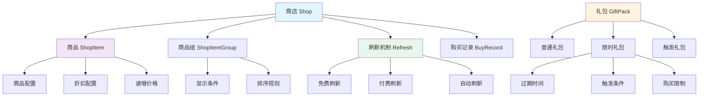
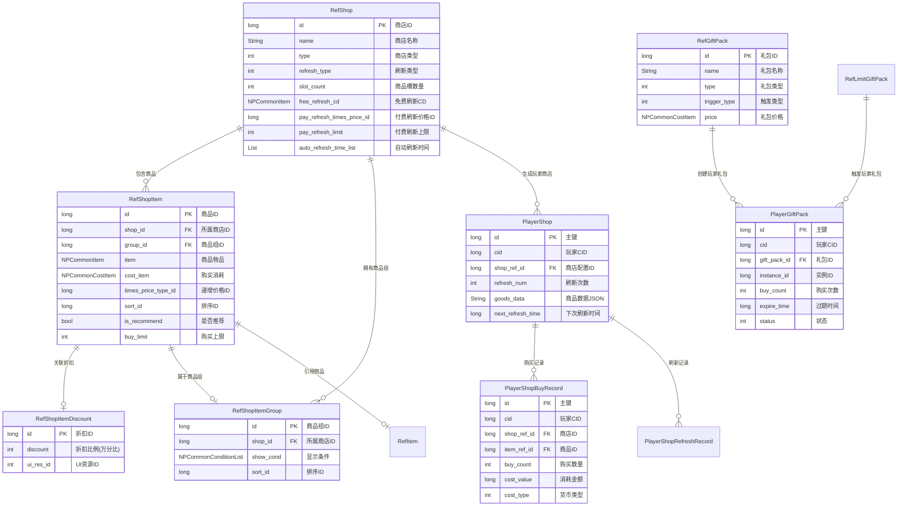
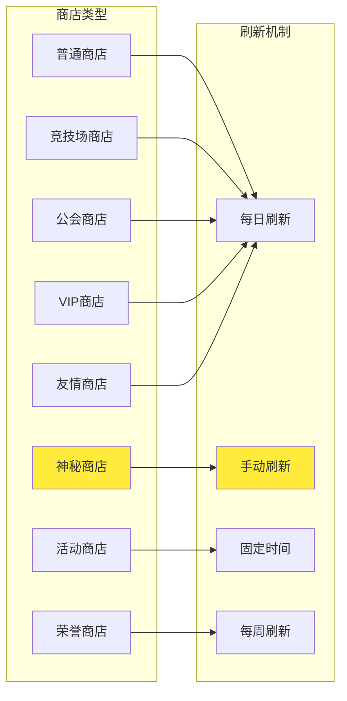
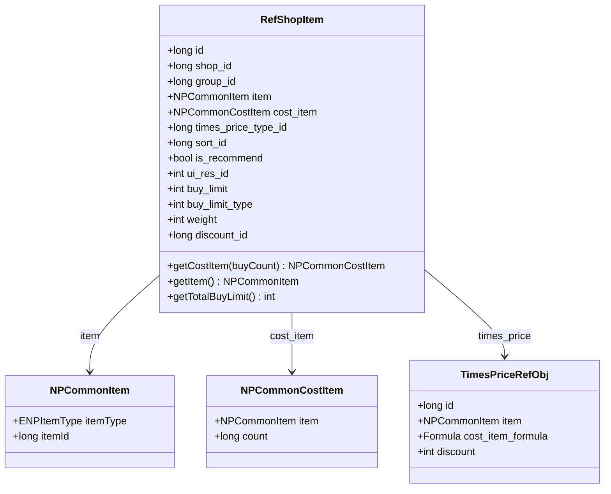
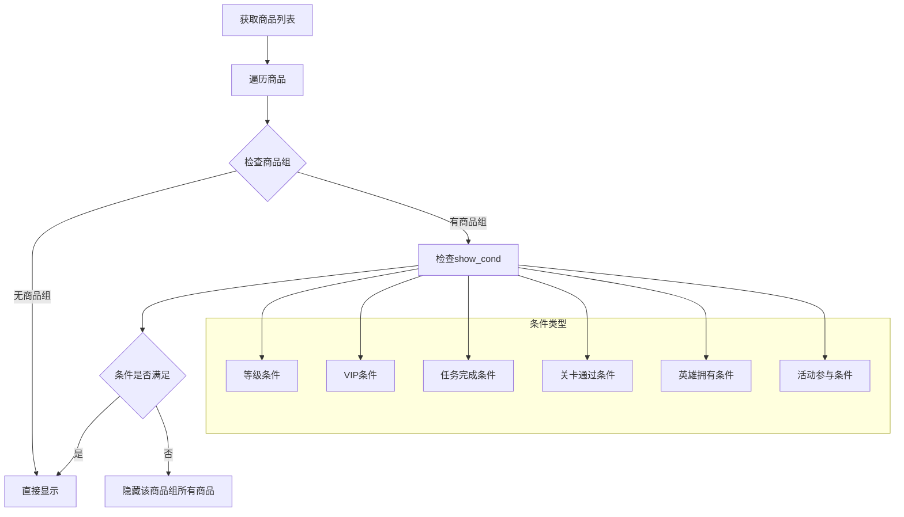
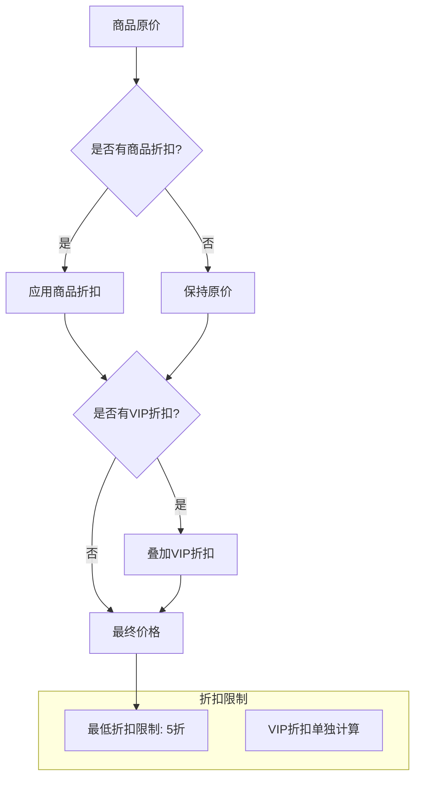
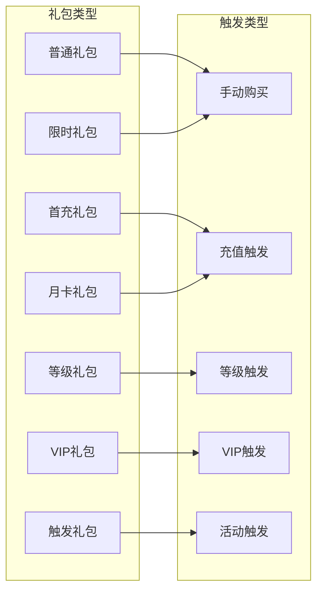
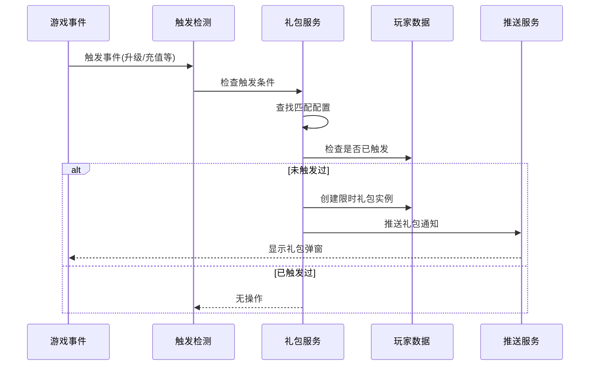
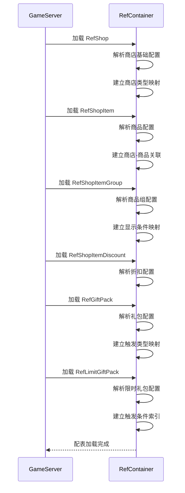

# 商店模块 - 数据配表

## 模块概述

**模块编号**: p030
**模块名称**: ShopOp (商店操作)
**主要功能**: 提供商品购买、商店刷新、礼包系统、限时礼包推送等功能

---

## 核心概念



---

## 配表文件列表

| 配表名称 | 文件路径 | 说明 |
|---------|---------|------|
| RefShop | GameRes/Refs/Shop/RefShop.java | 商店基础配置 |
| RefShopItem | GameRes/Refs/Shop/RefShopItem.java | 商品配置 |
| RefShopItemGroup | GameRes/Refs/Shop/RefShopItemGroup.java | 商品组配置 |
| RefShopItemDiscount | GameRes/Refs/Shop/RefShopItemDiscount.java | 商品折扣配置 |
| RefGiftPack | GameRes/Refs/Shop/RefGiftPack.java | 礼包配置 |
| RefLimitGiftPack | GameRes/Refs/Shop/RefLimitGiftPack.java | 限时礼包配置 |

---

## 配表关系图



---

## 1. 商店基础配置 (RefShop)

**配表名**: `shop`

### 完整字段列表

| 字段名 | 类型 | 必填 | 默认值 | 说明 |
|--------|------|------|--------|------|
| id | long | 是 | - | 商店配置ID（主键） |
| name | String | 是 | - | 商店名称 |
| type | int | 是 | 1 | 商店类型 (ENPShopType) |
| refresh_type | int | 是 | 1 | 刷新类型 (ENPShopRefreshType) |
| slot_count | int | 是 | 6 | 商品槽数量 |
| free_refresh_cd | NPCommonItem | 否 | null | 免费刷新CD配置（引用LAZY_CD或FIXED_CD） |
| pay_refresh_times_price_id | long | 否 | 0 | 付费刷新递增价格配置ID |
| pay_refresh_limit | int | 否 | 0 | 付费刷新次数上限（0表示无限制） |
| auto_refresh_time_list | List\<Integer\> | 否 | [] | 自动刷新时间点列表(小时) |
| ui_res_id | int | 否 | 0 | UI资源ID |
| desc | String | 否 | "" | 商店描述 |
| unlock_cond | NPCommonConditionList | 否 | [] | 解锁条件列表 |
| vip_level | int | 否 | 0 | 所需VIP等级 |
| sort_id | long | 否 | 0 | 排序ID |

### 商店类型枚举 (ENPShopType)

| 枚举值 | 数值 | 说明 | 货币类型 | 特点 |
|--------|------|------|----------|------|
| NORMAL | 1 | 普通商店 | 银两 | 固定商品，每日刷新 |
| ARENA | 2 | 竞技场商店 | 竞技币 | PVP奖励兑换 |
| GUILD | 3 | 公会商店 | 公会贡献 | 公会福利兑换 |
| ACTIVITY | 4 | 活动商店 | 活动货币 | 限时活动兑换 |
| MYSTERY | 5 | 神秘商店 | 钻石 | 随机刷新，折扣力度大 |
| VIP | 6 | VIP商店 | 钻石 | VIP专属商品 |
| HONOR | 7 | 荣誉商店 | 荣誉点 | 成就奖励兑换 |
| FRIENDSHIP | 8 | 友情商店 | 友情点 | 社交奖励兑换 |
| CROSS_SERVER | 9 | 跨服商店 | 跨服币 | 跨服活动兑换 |
| ARENA_RANK | 10 | 排位商店 | 排位积分 | 排位赛奖励兑换 |

```java
public enum ENPShopType {
    NORMAL = 1,       // 普通商店
    ARENA = 2,        // 竞技场商店
    GUILD = 3,        // 公会商店
    ACTIVITY = 4,     // 活动商店
    MYSTERY = 5,      // 神秘商店
    VIP = 6,          // VIP商店
    HONOR = 7,        // 荣誉商店
    FRIENDSHIP = 8,   // 友情商店
    CROSS_SERVER = 9, // 跨服商店
    ARENA_RANK = 10,  // 排位商店
}
```

### 刷新类型枚举 (ENPShopRefreshType)

| 枚举值 | 数值 | 说明 | 刷新时机 | 使用场景 |
|--------|------|------|----------|----------|
| MANUAL | 1 | 手动刷新 | 玩家主动点击 | 高级商店、神秘商店 |
| DAILY | 2 | 每日刷新 | 每日固定时间点 | 大部分商店 |
| WEEKLY | 3 | 每周刷新 | 每周固定时间 | 周常商店 |
| FIXED_TIME | 4 | 固定时间 | 指定时间点 | 活动商店 |
| MONTHLY | 5 | 每月刷新 | 每月固定时间 | 月卡商店 |

```java
public enum ENPShopRefreshType {
    MANUAL = 1,     // 手动刷新
    DAILY = 2,      // 每日刷新
    WEEKLY = 3,     // 每周刷新
    FIXED_TIME = 4, // 固定时间刷新
    MONTHLY = 5,    // 每月刷新
}
```

### 商店类型与刷新机制关系图



### 配置示例

```json
{
    "id": 1001,
    "name": "神秘商店",
    "type": 5,
    "refresh_type": 2,
    "slot_count": 6,
    "free_refresh_cd": {
        "itemType": 12,
        "itemId": 10001
    },
    "pay_refresh_times_price_id": 50001,
    "pay_refresh_limit": 10,
    "auto_refresh_time_list": [0, 12, 18],
    "ui_res_id": 1001,
    "desc": "每日刷新稀有商品，折扣力度大",
    "unlock_cond": [
        {
            "condType": 1,
            "condValue": 20
        }
    ],
    "vip_level": 0,
    "sort_id": 1
}
```

### 代码示例

```java
// 获取商店配置
RefShop shopRef = RefShop.getMgr().get(shopId);
if (shopRef == null) {
    return CommErr.REF_NOT_FOUND;
}

// 获取商店类型
ENPShopType shopType = ENPShopType.values()[shopRef.type];

// 检查刷新类型
if (shopRef.refresh_type == ENPShopRefreshType.DAILY.ordinal()) {
    // 每日刷新逻辑
    List<Integer> refreshHours = shopRef.auto_refresh_time_list;
}

// 获取商品槽位数量
int slotCount = shopRef.slot_count;

// 获取免费刷新配置
NPCommonItem freeRefreshCd = shopRef.free_refresh_cd;
if (freeRefreshCd != null) {
    // 获取当前免费刷新次数
    int freeCount = NPPlayer.instance.lazyCdComp.getItemCount(freeRefreshCd.itemId);
}

// 检查解锁条件
if (shopRef.unlock_cond != null && !shopRef.unlock_cond.isEmpty()) {
    boolean unlocked = shopRef.unlock_cond.IsEnable(userData);
    if (!unlocked) {
        return ShopErr.SHOP_NOT_UNLOCKED;
    }
}
```

```csharp
// 客户端获取商店配置
NPShopRefObj shopRef = GRefdataCoreMgr.instance.shopMap.getRef(shopId);
if (shopRef == null)
{
    Debug.LogError($"商店配置不存在: {shopId}");
    return;
}

// 获取商店名称
string shopName = shopRef.name;

// 获取商品槽位数量
int slotCount = shopRef.slot_count;

// 获取免费刷新次数
int freeRefreshCount = NPPlayer.instance.lazyCdComp.getItemCount(shopRef.free_refresh_cd.itemId);

// 获取付费刷新上限
int refreshLimit = shopRef.pay_refresh_limit;

// 获取自动刷新时间
List<int> refreshTimes = shopRef.auto_refresh_time_list;
```

---

## 2. 商品配置 (RefShopItem)

**配表名**: `shop_item`

### 完整字段列表

| 字段名 | 类型 | 必填 | 默认值 | 说明 |
|--------|------|------|--------|------|
| id | long | 是 | - | 商品ID（主键） |
| shop_id | long | 是 | - | 所属商店ID（外键） |
| group_id | long | 否 | 0 | 商品组ID（外键） |
| item | NPCommonItem | 是 | - | 商品内容物品 |
| cost_item | NPCommonCostItem | 是 | - | 购买消耗物品 |
| times_price_type_id | long | 否 | 0 | 递增价格配置ID |
| sort_id | long | 否 | 0 | 排序ID |
| is_recommend | bool | 否 | false | 是否推荐商品 |
| ui_res_id | int | 否 | 0 | UI资源ID |
| buy_limit | int | 否 | 0 | 购买次数上限（0表示无限制） |
| buy_limit_type | int | 否 | 1 | 限购类型：1每日，2每周，3永久 |
| weight | int | 否 | 100 | 商品权重（用于随机刷新） |
| discount_id | long | 否 | 0 | 关联折扣ID |

### 商品数据结构



### 限购类型枚举 (ENPBuyLimitType)

| 枚举值 | 数值 | 说明 | 重置时机 |
|--------|------|------|----------|
| DAILY | 1 | 每日限购 | 每日0点 |
| WEEKLY | 2 | 每周限购 | 每周一0点 |
| MONTHLY | 3 | 每月限购 | 每月1日0点 |
| FOREVER | 4 | 永久限购 | 永不重置 |

### 配置示例

```json
{
    "id": 20001,
    "shop_id": 1001,
    "group_id": 0,
    "item": {
        "itemType": 1,
        "itemId": 30001
    },
    "cost_item": {
        "item": {
            "itemType": 2,
            "itemId": 0
        },
        "count": 500
    },
    "times_price_type_id": 0,
    "sort_id": 1,
    "is_recommend": true,
    "ui_res_id": 0,
    "buy_limit": 2,
    "buy_limit_type": 1,
    "weight": 100,
    "discount_id": 5001
}
```

### 代码示例

```java
// 获取商品配置
RefShopItem itemRef = RefShopItem.getMgr().get(itemId);
if (itemRef == null) {
    return CommErr.REF_NOT_FOUND;
}

// 获取商品内容
NPCommonItem gainItem = itemRef.item;
NPCommonCostItem costItem = itemRef.cost_item;

// 获取购买价格（支持递增价格）
NPCommonCostItem actualCost = itemRef.getCostItem(buyCount);

// 检查购买限制
if (itemRef.buy_limit > 0 && currentBuyCount >= itemRef.buy_limit) {
    return ShopErr.BUY_LIMIT_REACHED;
}

// 检查限购类型
ENPBuyLimitType limitType = ENPBuyLimitType.values()[itemRef.buy_limit_type];
int resetTime = getBuyLimitResetTime(limitType);

// 获取权重（用于随机刷新）
int weight = itemRef.weight;
```

```csharp
// 客户端获取商品配置
NPShopItemRefObj itemRef = GRefdataCoreMgr.instance.shopItemMap.getRef(itemId);

// 获取商品内容
NPCommonCostItem gainItem = itemRef.item;

// 获取购买价格
NPCommonCostItem costItem = itemRef.cost_item;

// 检查是否推荐
bool isRecommend = itemRef.is_recommend;

// 获取购买上限
int buyLimit = itemRef.buy_limit;

// 获取限购类型
ENPBuyLimitType limitType = (ENPBuyLimitType)itemRef.buy_limit_type;

// 获取权重
int weight = itemRef.weight;
```

---

## 3. 商品组配置 (RefShopItemGroup)

**配表名**: `shop_item_group`

### 完整字段列表

| 字段名 | 类型 | 必填 | 默认值 | 说明 |
|--------|------|------|--------|------|
| id | long | 是 | - | 商品组ID（主键） |
| shop_id | long | 是 | - | 所属商店ID（外键） |
| show_cond | NPCommonConditionList | 否 | [] | 显示条件列表 |
| sort_id | long | 否 | 0 | 排序ID |
| group_name | String | 否 | "" | 商品组名称 |
| ui_res_id | int | 否 | 0 | UI资源ID |

### 商品组显示流程



### 配置示例

```json
{
    "id": 30001,
    "shop_id": 1001,
    "show_cond": [
        {
            "condType": 1,
            "condValue": 30
        }
    ],
    "sort_id": 1,
    "group_name": "高级商品组",
    "ui_res_id": 1001
}
```

---

## 4. 商品折扣配置 (RefShopItemDiscount)

**配表名**: `shop_item_discount`

### 完整字段列表

| 字段名 | 类型 | 必填 | 默认值 | 说明 |
|--------|------|------|--------|------|
| id | long | 是 | - | 折扣ID（主键） |
| discount | int | 是 | 10000 | 折扣比例（万分比，10000=100%） |
| ui_res_id | int | 否 | 0 | UI资源ID |
| discount_name | String | 否 | "" | 折扣名称 |
| start_time | long | 否 | 0 | 折扣开始时间（毫秒时间戳） |
| end_time | long | 否 | 0 | 折扣结束时间（毫秒时间戳） |
| vip_level | int | 否 | 0 | 所需VIP等级 |

### 折扣计算公式

```
实际价格 = 原价 × discount / 10000
```

**示例计算**:

| discount值 | 折扣 | 计算示例 |
|------------|------|----------|
| 10000 | 100%（无折扣） | 500 × 10000/10000 = 500 |
| 8000 | 80%（8折） | 500 × 8000/10000 = 400 |
| 5000 | 50%（5折） | 500 × 5000/10000 = 250 |
| 3000 | 30%（3折） | 500 × 3000/10000 = 150 |

### 折扣叠加规则



### 代码示例

```java
// 获取折扣配置
RefShopItemDiscount discountRef = RefShopItemDiscount.getMgr().get(discountId);
if (discountRef != null) {
    // 检查时间有效性
    long currentTime = System.currentTimeMillis();
    if (discountRef.start_time > 0 && currentTime < discountRef.start_time) {
        // 折扣未开始
        return originalPrice;
    }
    if (discountRef.end_time > 0 && currentTime > discountRef.end_time) {
        // 折扣已结束
        return originalPrice;
    }

    // 应用折扣
    long actualPrice = originalPrice * discountRef.discount / 10000;

    // 检查最低折扣限制
    long minPrice = originalPrice * 5000 / 10000; // 最低5折
    return Math.max(actualPrice, minPrice);
}
```

---

## 5. 礼包配置 (RefGiftPack)

**配表名**: `gift_pack`

### 完整字段列表

| 字段名 | 类型 | 必填 | 默认值 | 说明 |
|--------|------|------|--------|------|
| id | long | 是 | - | 礼包ID（主键） |
| name | String | 是 | - | 礼包名称 |
| type | int | 是 | 1 | 礼包类型 |
| trigger_type | int | 否 | 0 | 触发类型 |
| price | NPCommonCostItem | 是 | - | 礼包价格 |
| content | List\<NPCommonCostItem\> | 是 | - | 礼包内容 |
| buy_limit | int | 否 | 1 | 购买限制 |
| duration | long | 否 | 0 | 限时持续时间(秒，0表示永久) |
| ui_res_id | int | 否 | 0 | UI资源ID |
| desc | String | 否 | "" | 礼包描述 |
| sort_id | long | 否 | 0 | 排序ID |
| icon_res_id | int | 否 | 0 | 图标资源ID |
| show_cond | NPCommonConditionList | 否 | [] | 显示条件 |

### 礼包类型枚举 (ENPGiftPackType)

| 枚举值 | 数值 | 说明 |
|--------|------|------|
| NORMAL | 1 | 普通礼包 |
| LIMITED | 2 | 限时礼包 |
| TRIGGER | 3 | 触发礼包 |
| FIRST_CHARGE | 4 | 首充礼包 |
| MONTHLY | 5 | 月卡礼包 |
| WEEKLY | 6 | 周卡礼包 |
| LEVEL | 7 | 等级礼包 |
| VIP | 8 | VIP礼包 |

### 触发类型枚举 (ENPGiftPackTriggerType)

| 枚举值 | 数值 | 说明 |
|--------|------|------|
| NONE | 0 | 无触发条件 |
| FIRST_CHARGE | 1 | 首次充值 |
| LEVEL_UP | 2 | 等级提升 |
| VIP_UP | 3 | VIP等级提升 |
| TOTAL_CHARGE | 4 | 累计充值 |
| TOTAL_COST | 5 | 累计消费 |
| HERO_GET | 6 | 获得英雄 |
| DUNGEON_CLEAR | 7 | 通关副本 |
| POWER_REACH | 8 | 战力达到 |
| ARENA_RANK | 9 | 竞技场排名 |
| GUILD_JOIN | 10 | 加入公会 |

### 礼包类型与触发关系



---

## 6. 限时礼包配置 (RefLimitGiftPack)

**配表名**: `limit_gift_pack`

### 完整字段列表

| 字段名 | 类型 | 必填 | 默认值 | 说明 |
|--------|------|------|--------|------|
| id | long | 是 | - | 礼包ID（主键） |
| name | String | 是 | - | 礼包名称 |
| trigger_type | int | 是 | - | 触发类型 |
| trigger_value | long | 否 | 0 | 触发参数值 |
| price | NPCommonCostItem | 是 | - | 礼包价格 |
| content | List\<NPCommonCostItem\> | 是 | - | 礼包内容 |
| buy_limit | int | 否 | 1 | 购买限制 |
| duration | long | 是 | - | 限时持续时间(秒) |
| priority | int | 否 | 0 | 推送优先级 |
| max_show_count | int | 否 | 3 | 最大显示数量 |
| ui_res_id | int | 否 | 0 | UI资源ID |
| desc | String | 否 | "" | 礼包描述 |
| cooldown | long | 否 | 0 | 触发冷却时间(秒) |

### 限时礼包触发流程



### 限时礼包触发条件配置示例

| trigger_type | trigger_value | 说明 |
|--------------|---------------|------|
| 2 (LEVEL_UP) | 30 | 达到30级触发 |
| 3 (VIP_UP) | 5 | VIP等级达到5触发 |
| 4 (TOTAL_CHARGE) | 10000 | 累计充值100元触发 |
| 5 (TOTAL_COST) | 5000 | 累计消费500钻石触发 |
| 6 (HERO_GET) | 10001 | 获得英雄ID 10001触发 |
| 8 (POWER_REACH) | 100000 | 战力达到10万触发 |

---

## 协议数据结构

### Shop_Info - 商店信息

**路径**: `ClientProtocol/Common/ShopObj/Shop_Info.cs`

| 字段名 | 类型 | 说明 | 示例值 |
|--------|------|------|--------|
| shopRefId | long | 商店配置ID | 1001 |
| nextRefreshTimeMs | long | 下一次刷新时间戳(毫秒) | 1640000000000 |
| refreshNum | int | 已刷新次数 | 2 |
| goodsList | List\<Shop_ItemInfo\> | 商品列表 | [item1, item2...] |

```csharp
public class Shop_Info : _IALProtocolStructure
{
    private long shopRefId;           // 商店配置ID
    private long nextRefreshTimeMs;   // 下次刷新时间(毫秒)
    private int refreshNum;           // 已刷新次数
    private List<Shop_ItemInfo> goodsList;  // 商品列表

    public byte getMainOrder() { return (byte)30; }
    public byte getSubOrder() { return (byte)0; }
}
```

### Shop_ItemInfo - 商品信息

**路径**: `ClientProtocol/Common/ShopObj/Shop_ItemInfo.cs`

| 字段名 | 类型 | 说明 | 示例值 |
|--------|------|------|--------|
| instanceId | long | 商品实例ID（唯一标识） | 123456789 |
| shopItemRefId | long | 商品配置ID | 20001 |
| hasBuyNum | long | 已购买次数 | 1 |
| discountRefId | long | 折扣配置ID（0表示无折扣） | 5001 |
| shopItemGroupId | long | 商品组ID（0表示无分组） | 30001 |
| canBuyNum | long | 限购次数 | 2 |

```csharp
public class Shop_ItemInfo : _IALProtocolStructure
{
    private long instanceId;       // 商品实例ID
    private long shopItemRefId;    // 商品配置ID
    private long hasBuyNum;        // 已购买次数
    private long discountRefId;    // 折扣配置ID
    private long shopItemGroupId;  // 商品组ID
    private long canBuyNum;        // 可购买次数

    public byte getMainOrder() { return (byte)30; }
    public byte getSubOrder() { return (byte)0; }
}
```

### GiftPack_Info - 礼包信息

**路径**: `ClientProtocol/Common/ShopObj/GiftPack_Info.cs`

| 字段名 | 类型 | 说明 | 示例值 |
|--------|------|------|--------|
| giftPackRefId | long | 礼包配置ID | 40001 |
| instanceId | long | 礼包实例ID | 987654321 |
| buyCount | int | 已购买次数 | 0 |
| expireTimeMs | long | 过期时间戳(毫秒) | 1640000000000 |
| status | int | 状态：0可购买，1已购买，2已过期 | 0 |

```csharp
public class GiftPack_Info : _IALProtocolStructure
{
    private long giftPackRefId;    // 礼包配置ID
    private long instanceId;       // 礼包实例ID
    private int buyCount;          // 已购买次数
    private long expireTimeMs;     // 过期时间(毫秒)
    private int status;            // 状态

    public byte getMainOrder() { return (byte)30; }
    public byte getSubOrder() { return (byte)0; }
}
```

---

## 数据库表结构

### player_shop（商店数据表）

```sql
CREATE TABLE IF NOT EXISTS `player_shop` (
    `id` bigint(20) NOT NULL AUTO_INCREMENT COMMENT '自增主键',
    `cid` bigint(20) NOT NULL DEFAULT '0' COMMENT '玩家CID',
    `shop_ref_id` bigint(20) NOT NULL DEFAULT '0' COMMENT '商店配置ID',
    `refresh_num` int(11) NOT NULL DEFAULT '0' COMMENT '刷新次数',
    `goods_data` text COMMENT '商品数据(JSON)',
    `next_refresh_time` bigint(20) NOT NULL DEFAULT '0' COMMENT '下次刷新时间(毫秒)',
    `free_refresh_used` int(11) NOT NULL DEFAULT '0' COMMENT '已使用免费刷新次数',
    `create_time` datetime DEFAULT CURRENT_TIMESTAMP COMMENT '创建时间',
    `update_time` datetime DEFAULT CURRENT_TIMESTAMP ON UPDATE CURRENT_TIMESTAMP COMMENT '更新时间',
    PRIMARY KEY (`id`),
    KEY `idx_cid` (`cid`),
    KEY `idx_shop_ref_id` (`shop_ref_id`),
    KEY `idx_cid_shop` (`cid`, `shop_ref_id`),
    KEY `idx_next_refresh_time` (`next_refresh_time`)
) COMMENT='玩家商店数据' engine=InnoDB DEFAULT CHARSET=utf8mb4;
```

### player_shop_buy_record（购买记录表）

```sql
CREATE TABLE IF NOT EXISTS `player_shop_buy_record` (
    `id` bigint(20) NOT NULL AUTO_INCREMENT COMMENT '自增主键',
    `cid` bigint(20) NOT NULL DEFAULT '0' COMMENT '玩家CID',
    `shop_ref_id` bigint(20) NOT NULL DEFAULT '0' COMMENT '商店配置ID',
    `item_ref_id` bigint(20) NOT NULL DEFAULT '0' COMMENT '商品配置ID',
    `instance_id` bigint(20) NOT NULL DEFAULT '0' COMMENT '商品实例ID',
    `buy_count` int(11) NOT NULL DEFAULT '0' COMMENT '购买数量',
    `cost_value` bigint(20) NOT NULL DEFAULT '0' COMMENT '消耗货币数量',
    `cost_type` int(11) NOT NULL DEFAULT '0' COMMENT '消耗货币类型',
    `discount` int(11) NOT NULL DEFAULT '10000' COMMENT '折扣(万分比)',
    `buy_time` datetime DEFAULT CURRENT_TIMESTAMP COMMENT '购买时间',
    PRIMARY KEY (`id`),
    KEY `idx_cid` (`cid`),
    KEY `idx_shop_ref_id` (`shop_ref_id`),
    KEY `idx_item_ref_id` (`item_ref_id`),
    KEY `idx_buy_time` (`buy_time`),
    KEY `idx_cid_shop_item` (`cid`, `shop_ref_id`, `item_ref_id`)
) COMMENT='商店购买记录' engine=InnoDB DEFAULT CHARSET=utf8mb4;
```

### player_gift_pack（礼包数据表）

```sql
CREATE TABLE IF NOT EXISTS `player_gift_pack` (
    `id` bigint(20) NOT NULL AUTO_INCREMENT COMMENT '自增主键',
    `cid` bigint(20) NOT NULL DEFAULT '0' COMMENT '玩家CID',
    `gift_pack_id` bigint(20) NOT NULL DEFAULT '0' COMMENT '礼包配置ID',
    `instance_id` bigint(20) NOT NULL DEFAULT '0' COMMENT '礼包实例ID',
    `buy_count` int(11) NOT NULL DEFAULT '0' COMMENT '购买次数',
    `expire_time` datetime DEFAULT NULL COMMENT '过期时间',
    `trigger_time` datetime DEFAULT NULL COMMENT '触发时间',
    `status` int(11) NOT NULL DEFAULT '0' COMMENT '状态(0-可购买,1-已购买,2-已过期)',
    `create_time` datetime DEFAULT CURRENT_TIMESTAMP COMMENT '创建时间',
    `update_time` datetime DEFAULT CURRENT_TIMESTAMP ON UPDATE CURRENT_TIMESTAMP COMMENT '更新时间',
    PRIMARY KEY (`id`),
    KEY `idx_cid` (`cid`),
    KEY `idx_gift_pack_id` (`gift_pack_id`),
    KEY `idx_expire_time` (`expire_time`),
    KEY `idx_cid_gift` (`cid`, `gift_pack_id`),
    KEY `idx_status` (`status`)
) COMMENT='玩家礼包数据' engine=InnoDB DEFAULT CHARSET=utf8mb4;
```

---

## 枚举定义

### ENPShopItemStatus (商品状态)

| 枚举值 | 数值 | 说明 |
|--------|------|------|
| AVAILABLE | 0 | 可购买 |
| SOLD_OUT | 1 | 已售罄 |
| OFF_SHELF | 2 | 已下架 |
| LOCKED | 3 | 已锁定 |

### ENPGiftPackStatus (礼包状态)

| 枚举值 | 数值 | 说明 |
|--------|------|------|
| AVAILABLE | 0 | 可购买 |
| BOUGHT | 1 | 已购买 |
| EXPIRED | 2 | 已过期 |
| OFF_SHELF | 3 | 已下架 |

### ENPCurrencyType (货币类型)

| 枚举值 | 数值 | 说明 |
|--------|------|------|
| SILVER | 1 | 银两 |
| DIAMOND | 2 | 钻石 |
| ARENA_COIN | 3 | 竞技币 |
| GUILD_CONTRIBUTE | 4 | 公会贡献 |
| ACTIVITY_COIN | 5 | 活动货币 |
| HONOR_POINT | 6 | 荣誉点 |
| FRIENDSHIP_POINT | 7 | 友情点 |
| CROSS_SERVER_COIN | 8 | 跨服币 |
| ARENA_RANK_POINT | 9 | 排位积分 |

---

## 配表加载流程



---

## 数据字典

### 货币类型映射

| 货币类型ID | 枚举名 | 说明 | 获取途径 | 消耗场景 |
|------------|--------|------|----------|----------|
| 1 | SILVER | 银两 | 任务、副本、出售 | 普通商店、强化 |
| 2 | DIAMOND | 钻石 | 充值、活动 | 神秘商店、VIP商店、刷新 |
| 3 | ARENA_COIN | 竞技币 | 竞技场奖励 | 竞技场商店 |
| 4 | GUILD_CONTRIBUTE | 公会贡献 | 公会活动 | 公会商店 |
| 5 | ACTIVITY_COIN | 活动货币 | 活动奖励 | 活动商店 |
| 6 | HONOR_POINT | 荣誉点 | 成就奖励 | 荣誉商店 |
| 7 | FRIENDSHIP_POINT | 友情点 | 社交互动 | 友情商店 |
| 8 | CROSS_SERVER_COIN | 跨服币 | 跨服活动 | 跨服商店 |
| 9 | ARENA_RANK_POINT | 排位积分 | 排位赛 | 排位商店 |

### 条件类型映射

| 条件类型ID | 说明 | 参数格式 | 示例 |
|------------|------|----------|------|
| 1 | 等级条件 | `{condType:1, condValue:30}` | 达到30级解锁 |
| 2 | VIP等级条件 | `{condType:2, condValue:5}` | VIP5解锁 |
| 3 | 关卡通关条件 | `{condType:3, condValue:10001}` | 通关关卡10001 |
| 4 | 任务完成条件 | `{condType:4, condValue:20001}` | 完成任务20001 |
| 5 | 英雄条件 | `{condType:5, condValue:heroId}` | 拥有指定英雄 |
| 6 | 活动条件 | `{condType:6, condValue:activityId}` | 参与指定活动 |
| 7 | 累计充值条件 | `{condType:7, condValue:1000}` | 累计充值1000元 |
| 8 | 累计消费条件 | `{condType:8, condValue:500}` | 累计消费500钻石 |
| 9 | 登录天数条件 | `{condType:9, condValue:7}` | 累计登录7天 |
| 10 | 战力条件 | `{condType:10, condValue:10000}` | 战力达到10000 |
| 11 | 公会条件 | `{condType:11, condValue:1}` | 加入公会 |
| 12 | 成就条件 | `{condType:12, condValue:achieveId}` | 完成成就 |

### 物品类型映射

| 物品类型ID | 枚举名 | 说明 | 存储位置 |
|------------|--------|------|----------|
| 1 | ITEM | 普通道具 | 背包 |
| 2 | CURRENCY | 货币 | 货币组件 |
| 3 | HERO | 英雄 | 英雄列表 |
| 4 | EQUIPMENT | 装备 | 装备栏 |
| 5 | SKIN | 皮肤 | 皮肤列表 |
| 6 | FRAGMENT | 碎片 | 背包 |
| 7 | MATERIAL | 材料 | 背包 |
| 8 | PET | 宠物 | 宠物列表 |
| 9 | MOUNT | 坐骑 | 坐骑列表 |
| 10 | TITLE | 称号 | 称号列表 |
| 12 | LAZY_CD | 懒CD | CD组件 |
| 13 | FIXED_CD | 固定CD | CD组件 |

---

## 配表校验规则

### 商店配置校验

| 字段名 | 校验规则 | 异常处理 |
|--------|----------|----------|
| id | 必须唯一，范围 > 0 | 配表加载时去重 |
| type | 枚举值范围 1-10 | 使用默认值1 |
| refresh_type | 枚举值范围 1-5 | 使用默认值1 |
| slot_count | 范围 1-20 | 强制限制范围 |
| free_refresh_cd | 必须关联有效的CD配置 | 加载时校验关联 |
| pay_refresh_times_price_id | 必须关联有效的价格配置 | 加载时校验关联 |

### 商品配置校验

| 字段名 | 校验规则 | 异常处理 |
|--------|----------|----------|
| id | 必须唯一，范围 > 0 | 配表加载时去重 |
| shop_id | 必须关联有效商店 | 加载时校验关联 |
| item | 必须配置 | 加载时报错 |
| cost_item | 必须配置，count > 0 | 加载时报错 |
| group_id | 必须关联有效商品组 | 加载时校验关联 |
| weight | 范围 1-10000 | 使用默认值100 |

### 折扣配置校验

| 字段名 | 校验规则 | 异常处理 |
|--------|----------|----------|
| id | 必须唯一，范围 > 0 | 配表加载时去重 |
| discount | 范围 1-10000 | 强制限制范围 |
| start_time | 必须小于 end_time | 加载时报错 |

---

## 配置文件位置

```
game_server/GameRes/src/NPGameRes/Refs/Shop/
├── RefShop.java              # 商店配置
├── RefShopItem.java          # 商品配置
├── RefShopItemGroup.java     # 商品组配置
├── RefShopItemDiscount.java  # 折扣配置
├── RefGiftPack.java          # 礼包配置
└── RefLimitGiftPack.java     # 限时礼包配置

game_server/GameRes/src/NPGameRes/GameObjs/Shop/
├── ShopInfo.java             # 商店信息对象
├── ShopItemInfo.java         # 商品信息对象
├── ShopItemGroupInfo.java    # 商品组信息对象
└── GiftPackInfo.java         # 礼包信息对象

game_server/DBTool/source_db/UserServer/
├── player_shop.py            # 商店数据表定义
├── player_shop_buy_record.py # 购买记录表定义
└── player_gift_pack.py       # 礼包数据表定义
```

---

*文档生成时间: 2026-04-11*
