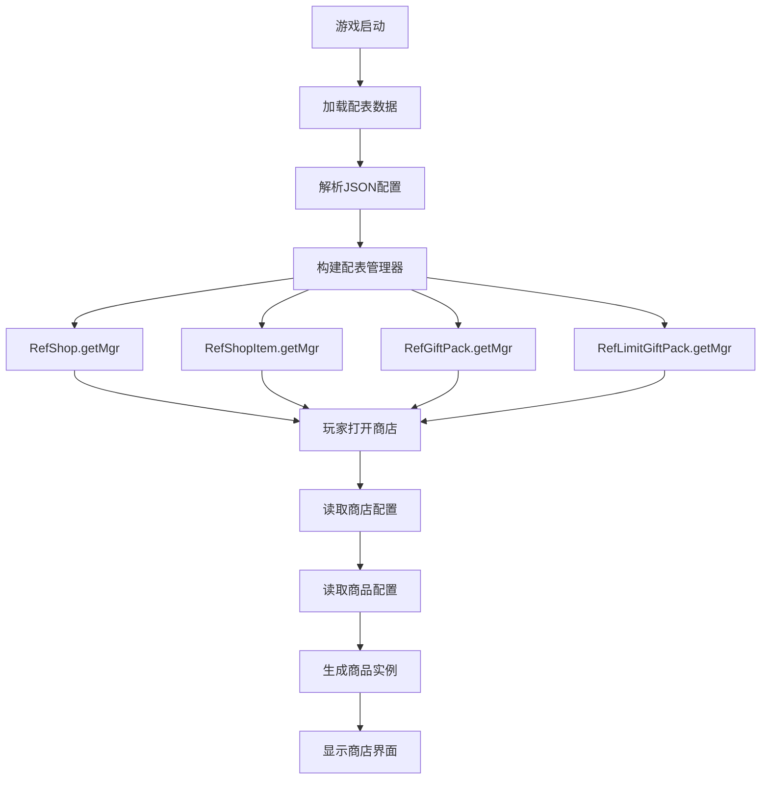
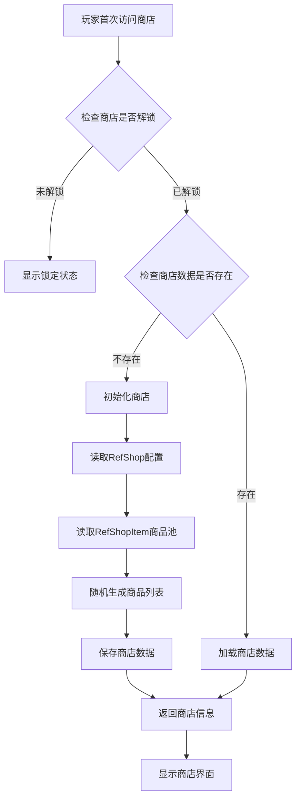
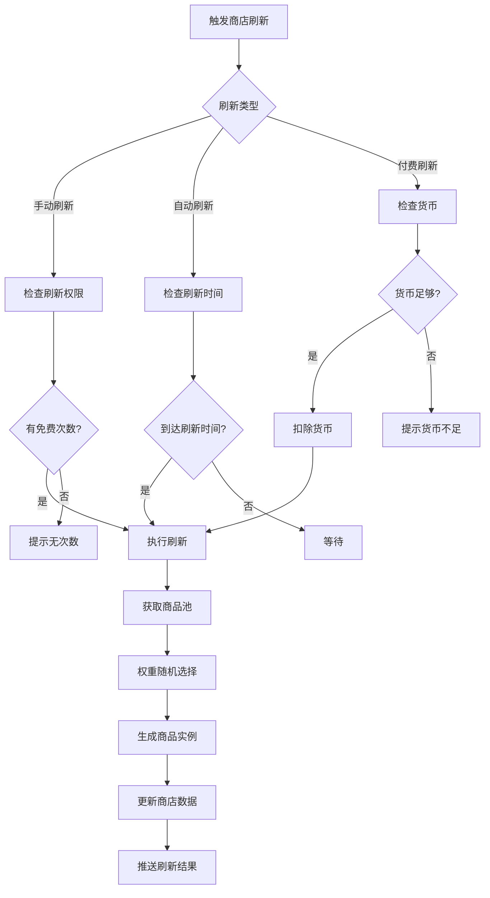
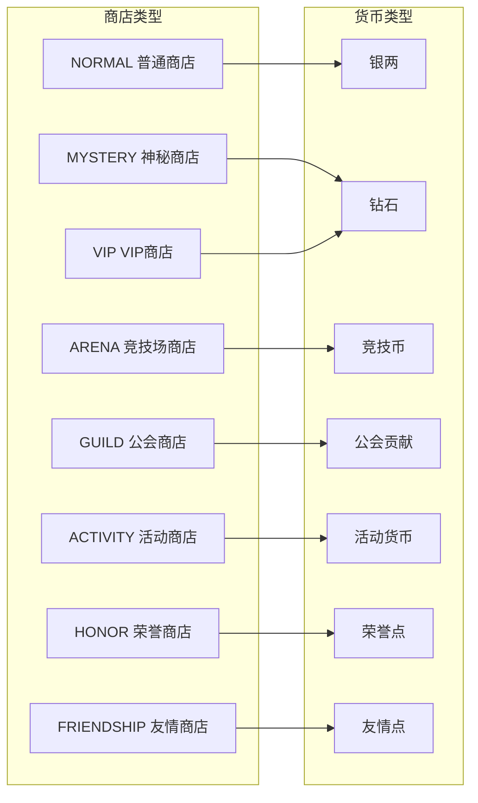
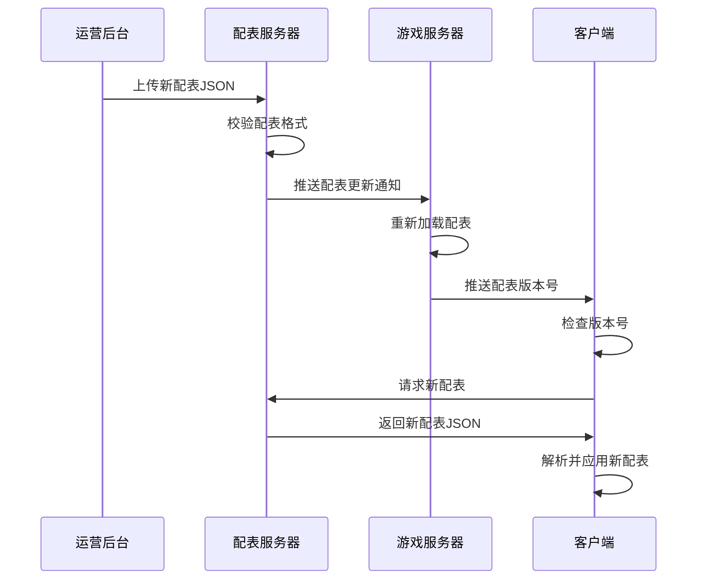
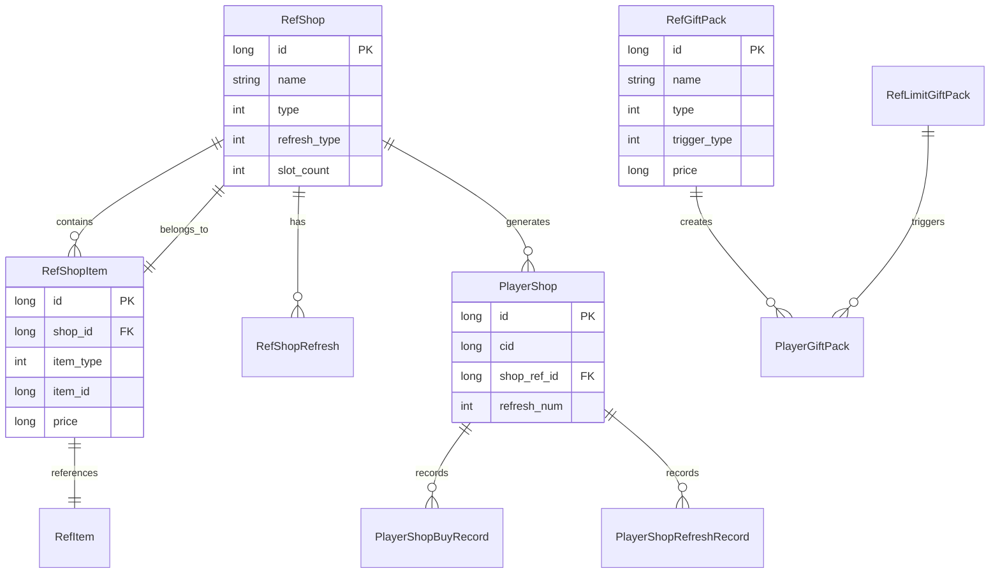
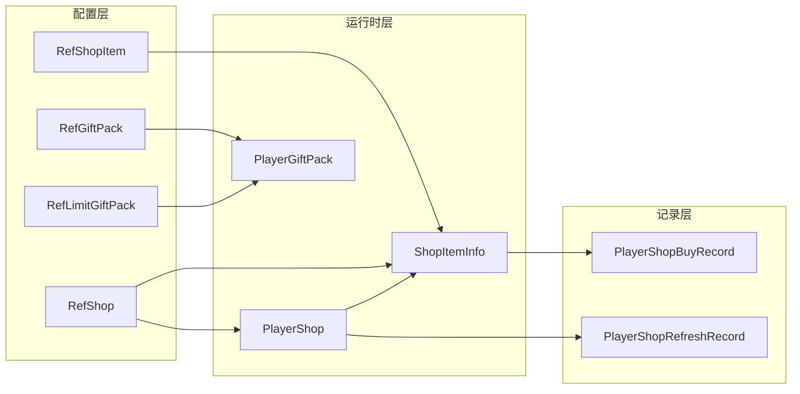

# 商店模块数据配表文档

## 配表说明

商店模块相关的配置数据主要存储在以下配表中:

| 配表名称 | 文件名 | 说明 |
|---------|--------|------|
| RefShop | shop_ref.json | 商店基础配置 |
| RefShopItem | shop_item_ref.json | 商品配置 |
| RefGiftPack | gift_pack_ref.json | 礼包配置 |
| RefLimitGiftPack | limit_gift_pack_ref.json | 限时礼包配置 |
| RefShopRefresh | shop_refresh_ref.json | 商店刷新配置 |

---

## 一、商店基础配表

### RefShop - 商店配置
**文件**: `shop_ref.json`

#### 完整字段列表

| 字段名 | 类型 | 必填 | 默认值 | 说明 | 示例值 |
|--------|------|------|--------|------|--------|
| id | long | 是 | - | 商店配置ID（主键） | 1001 |
| name | string | 是 | - | 商店名称（用于显示） | "神秘商店" |
| type | int | 是 | 1 | 商店类型(ENPShopType) | 5 |
| refresh_type | int | 是 | 1 | 刷新类型(ENPShopRefreshType) | 2 |
| refresh_cost | NPCommon_CostInfo | 否 | null | 刷新消耗配置 | `{type:2, id:0, count:50}` |
| free_refresh_count | int | 否 | 0 | 每日免费刷新次数 | 1 |
| slot_count | int | 是 | 6 | 商品槽数量 | 6 |
| unlock_level | int | 否 | 0 | 解锁等级 | 10 |
| unlock_vip | int | 否 | 0 | 解锁VIP等级 | 0 |
| base_refresh_cost | long | 否 | 0 | 基础刷新费用 | 50 |
| increment_refresh_cost | long | 否 | 0 | 递增刷新费用 | 50 |
| refresh_cost_type | int | 否 | 2 | 刷新货币类型 | 2 |
| auto_refresh_time | List\<int\> | 否 | [] | 自动刷新时间点(小时) | `[0, 12, 18]` |
| icon | string | 否 | "" | 商店图标资源名 | "shop_mystery" |
| desc | string | 否 | "" | 商店描述文本 | "每日刷新稀有商品" |
| sort_order | int | 否 | 0 | 显示排序权重 | 100 |
| is_open | boolean | 否 | true | 是否开放 | true |

### 商店类型枚举 (ENPShopType)

**源码路径**: `ClientProtocol/NPEnum/ENPShopType.cs`

```csharp
public enum ENPShopType
{
    NORMAL = 1,      // 普通商店
    ARENA = 2,       // 竞技场商店
    GUILD = 3,       // 公会商店
    ACTIVITY = 4,    // 活动商店
    MYSTERY = 5,     // 神秘商店
    VIP = 6,         // VIP商店
    HONOR = 7,       // 荣誉商店
    FRIENDSHIP = 8,  // 友情商店
}
```

| 类型ID | 枚举名 | 说明 | 特点 | 货币类型 |
|--------|--------|------|------|----------|
| 1 | NORMAL | 普通商店 | 固定商品，银两购买 | 银两 |
| 2 | ARENA | 竞技场商店 | 竞技币兑换，PVP奖励 | 竞技币 |
| 3 | GUILD | 公会商店 | 公会贡献兑换，公会福利 | 公会贡献 |
| 4 | ACTIVITY | 活动商店 | 活动货币兑换，限时开放 | 活动货币 |
| 5 | MYSTERY | 神秘商店 | 随机刷新，钻石购买 | 钻石 |
| 6 | VIP | VIP商店 | VIP专属，稀有道具 | 钻石 |
| 7 | HONOR | 荣誉商店 | 荣誉点兑换，成就奖励 | 荣誉点 |
| 8 | FRIENDSHIP | 友情商店 | 友情点兑换，社交奖励 | 友情点 |

### 刷新类型枚举 (ENPShopRefreshType)

**源码路径**: `ClientProtocol/NPEnum/ENPShopRefreshType.cs`

```csharp
public enum ENPShopRefreshType
{
    MANUAL = 1,     // 手动刷新
    DAILY = 2,      // 每日刷新
    WEEKLY = 3,     // 每周刷新
    FIXED_TIME = 4, // 固定时间刷新
}
```

| 类型ID | 枚举名 | 说明 | 刷新时机 | 使用场景 |
|--------|--------|------|----------|----------|
| 1 | MANUAL | 手动刷新 | 玩家主动点击刷新 | 高级商店 |
| 2 | DAILY | 每日刷新 | 每日固定时间点刷新 | 大部分商店 |
| 3 | WEEKLY | 每周刷新 | 每周固定时间刷新 | 周常商店 |
| 4 | FIXED_TIME | 固定时间 | 指定时间点刷新 | 活动商店 |

### 商店配置示例

```json
{
  "id": 1001,
  "name": "神秘商店",
  "type": 5,
  "refresh_type": 2,
  "refresh_cost": {
    "type": 2,
    "id": 0,
    "count": 50
  },
  "free_refresh_count": 1,
  "slot_count": 6,
  "unlock_level": 10,
  "unlock_vip": 0,
  "base_refresh_cost": 50,
  "increment_refresh_cost": 50,
  "refresh_cost_type": 2,
  "auto_refresh_time": [0, 12, 18],
  "icon": "shop_mystery",
  "desc": "每日刷新稀有商品，折扣力度大",
  "sort_order": 100,
  "is_open": true
}
```

---

## 二、商品配表

### RefShopItem - 商品配置
**文件**: `shop_item_ref.json`

#### 完整字段列表

| 字段名 | 类型 | 必填 | 默认值 | 说明 | 示例值 |
|--------|------|------|--------|------|--------|
| id | long | 是 | - | 商品ID（主键） | 20001 |
| shop_id | long | 是 | - | 所属商店ID（外键） | 1001 |
| item_type | int | 是 | - | 物品类型(ENPItemType) | 1 |
| item_id | long | 是 | - | 物品配置ID | 30001 |
| item_count | long | 是 | 1 | 物品数量 | 10 |
| price | NPCommon_CostInfo | 是 | - | 价格配置 | `{type:2, id:0, count:500}` |
| original_price | long | 否 | 0 | 原价(显示用) | 1000 |
| discount | float | 否 | 1.0 | 折扣(0.1-1.0) | 0.8 |
| buy_limit_type | int | 否 | 0 | 限购类型(ENPBuyLimitType) | 1 |
| buy_limit | int | 否 | 0 | 购买限制次数 | 2 |
| daily_buy_limit | int | 否 | 0 | 每日购买限制 | 5 |
| weight | int | 否 | 100 | 出现权重 | 100 |
| unlock_level | int | 否 | 0 | 解锁等级 | 0 |
| unlock_vip | int | 否 | 0 | 解锁VIP等级 | 0 |
| unlock_condition | NPCommon_ConditionList | 否 | [] | 解锁条件列表 | `[{type:1, value:10}]` |
| show_order | int | 否 | 0 | 显示顺序 | 1 |
| start_time | long | 否 | 0 | 上架开始时间(秒) | 1640000000 |
| end_time | long | 否 | 0 | 上架结束时间(秒) | 1672425600 |
| tag | int | 否 | 0 | 商品标签(ENPShopItemTag) | 1 |
| icon | string | 否 | "" | 商品图标 | "item_hero_shard" |
| desc | string | 否 | "" | 商品描述 | "英雄碎片×10" |
| is_hot | boolean | 否 | false | 是否热门商品 | true |

### 限购类型枚举 (ENPBuyLimitType)

**源码路径**: `ClientProtocol/NPEnum/ENPBuyLimitType.cs`

```csharp
public enum ENPBuyLimitType
{
    NONE = 0,    // 无限制
    DAILY = 1,   // 每日限购
    WEEKLY = 2,  // 每周限购
    MONTHLY = 3, // 每月限购
    FOREVER = 4, // 永久限购
}
```

| 类型ID | 枚举名 | 说明 | 重置规则 | 使用场景 |
|--------|--------|------|----------|----------|
| 0 | NONE | 无限制 | 不限制购买次数 | 普通常驻商品 |
| 1 | DAILY | 每日限购 | 每日0点重置 | 日常商品 |
| 2 | WEEKLY | 每周限购 | 每周一0点重置 | 周常商品 |
| 3 | MONTHLY | 每月限购 | 每月1日0点重置 | 月常商品 |
| 4 | FOREVER | 永久限购 | 终身限制，不重置 | 限定商品 |

### 商品标签枚举 (ENPShopItemTag)

**源码路径**: `ClientProtocol/NPEnum/ENPShopItemTag.cs`

```csharp
public enum ENPShopItemTag
{
    NONE = 0,      // 无标签
    HOT = 1,       // 热销
    NEW = 2,       // 新品
    LIMITED = 3,   // 限量
    DISCOUNT = 4,  // 折扣
    VIP = 5,       // VIP专属
    RECOMMEND = 6, // 推荐
}
```

| 标签ID | 枚举名 | 说明 | 显示样式 | 使用场景 |
|--------|--------|------|----------|----------|
| 0 | NONE | 无标签 | 正常显示 | 普通商品 |
| 1 | HOT | 热销 | 红色"热销"角标 | 销量高的商品 |
| 2 | NEW | 新品 | 绿色"新品"角标 | 新上架商品 |
| 3 | LIMITED | 限量 | 金色"限量"角标 | 稀有商品 |
| 4 | DISCOUNT | 折扣 | 橙色折扣标签 | 打折商品 |
| 5 | VIP | VIP专属 | 紫色"VIP"标签 | VIP特权商品 |
| 6 | RECOMMEND | 推荐 | 蓝色"推荐"标签 | 运营推荐商品 |

### 商品配置示例

```json
{
  "id": 20001,
  "shop_id": 1001,
  "item_type": 1,
  "item_id": 30001,
  "item_count": 10,
  "price": {
    "type": 2,
    "id": 0,
    "count": 400
  },
  "original_price": 500,
  "discount": 0.8,
  "buy_limit_type": 1,
  "buy_limit": 2,
  "daily_buy_limit": 5,
  "weight": 100,
  "unlock_level": 10,
  "unlock_vip": 0,
  "unlock_condition": [],
  "show_order": 1,
  "start_time": 0,
  "end_time": 0,
  "tag": 4,
  "icon": "item_hero_shard",
  "desc": "英雄碎片×10，收集可合成英雄",
  "is_hot": true
}
```

---

## 三、礼包配表

### RefGiftPack - 礼包配置
**文件**: `gift_pack_ref.json`

#### 完整字段列表

| 字段名 | 类型 | 必填 | 默认值 | 说明 | 示例值 |
|--------|------|------|--------|------|--------|
| id | long | 是 | - | 礼包ID（主键） | 30001 |
| name | string | 是 | - | 礼包名称 | "首充大礼包" |
| type | int | 是 | - | 礼包类型(ENPGiftPackType) | 1 |
| price | NPCommon_CostInfo | 是 | - | 价格配置 | `{type:2, id:0, count:98}` |
| original_price | long | 否 | 0 | 原价 | 980 |
| content | NPCommon_ItemInfoList | 是 | - | 礼包内容 | `[item1, item2]` |
| buy_limit | int | 否 | 1 | 购买限制 | 1 |
| show_time_start | long | 否 | 0 | 显示开始时间(秒) | 1640000000 |
| show_time_end | long | 否 | 0 | 显示结束时间(秒) | 1672425600 |
| trigger_type | int | 否 | 0 | 触发类型(ENPGiftPackTriggerType) | 0 |
| trigger_condition | NPCommon_ConditionList | 否 | [] | 触发条件 | `[]` |
| duration | long | 否 | 0 | 限时持续时间(秒) | 0 |
| icon | string | 否 | "" | 礼包图标 | "gift_first_recharge" |
| desc | string | 否 | "" | 礼包描述 | "首充超值礼包" |
| priority | int | 否 | 0 | 显示优先级 | 100 |
| is_recommend | boolean | 否 | false | 是否推荐 | true |

### 礼包类型枚举 (ENPGiftPackType)

**源码路径**: `ClientProtocol/NPEnum/ENPGiftPackType.cs`

```csharp
public enum ENPGiftPackType
{
    FIRST_RECHARGE = 1, // 首充礼包
    MONTHLY = 2,        // 月卡礼包
    WEEKLY = 3,         // 周卡礼包
    GROWTH = 4,         // 成长礼包
    LEVEL = 5,          // 等级礼包
    ACTIVITY = 6,       // 活动礼包
    LIMITED = 7,        // 限时礼包
    TRIGGER = 8,        // 触发礼包
}
```

| 类型ID | 枚举名 | 说明 | 购买货币 | 特点 |
|--------|--------|------|----------|------|
| 1 | FIRST_RECHARGE | 首充礼包 | 人民币/钻石 | 首次充值触发 |
| 2 | MONTHLY | 月卡礼包 | 人民币/钻石 | 30天内每日领取 |
| 3 | WEEKLY | 周卡礼包 | 人民币/钻石 | 7天内每日领取 |
| 4 | GROWTH | 成长礼包 | 钻石 | 等级提升购买 |
| 5 | LEVEL | 等级礼包 | 钻石 | 达到等级购买 |
| 6 | ACTIVITY | 活动礼包 | 钻石/活动货币 | 活动期间购买 |
| 7 | LIMITED | 限时礼包 | 钻石 | 限时优惠购买 |
| 8 | TRIGGER | 触发礼包 | 钻石 | 条件触发购买 |

### 礼包触发类型枚举 (ENPGiftPackTriggerType)

**源码路径**: `ClientProtocol/NPEnum/ENPGiftPackTriggerType.cs`

```csharp
public enum ENPGiftPackTriggerType
{
    NONE = 0,          // 无触发
    FIRST_RECHARGE = 1, // 首充触发
    LEVEL_UP = 2,      // 升级触发
    VIP_UP = 3,        // VIP升级触发
    POWER_REACH = 4,   // 战力触发
    DEFEAT_BOSS = 5,   // 击败Boss触发
    LOGIN_DAYS = 6,    // 登录天数触发
    CONSUME = 7,       // 消费触发
}
```

| 类型ID | 枚举名 | 说明 | 触发时机 | 参数说明 |
|--------|--------|------|----------|----------|
| 0 | NONE | 无触发 | 始终显示 | - |
| 1 | FIRST_RECHARGE | 首充触发 | 首次充值成功 | 充值金额 |
| 2 | LEVEL_UP | 升级触发 | 达到指定等级 | 目标等级 |
| 3 | VIP_UP | VIP升级触发 | VIP等级提升 | 目标VIP等级 |
| 4 | POWER_REACH | 战力触发 | 战力达到阈值 | 战力阈值 |
| 5 | DEFEAT_BOSS | 击败Boss触发 | 通过指定关卡 | 关卡ID |
| 6 | LOGIN_DAYS | 登录天数触发 | 累计登录天数 | 登录天数 |
| 7 | CONSUME | 消费触发 | 累计消费钻石 | 消费金额 |

### 礼包配置示例

```json
{
  "id": 30001,
  "name": "首充大礼包",
  "type": 1,
  "price": {
    "type": 2,
    "id": 0,
    "count": 98
  },
  "original_price": 980,
  "content": [
    {"itemType": 2, "itemId": 0, "count": 980},
    {"itemType": 3, "itemId": 10001, "count": 1},
    {"itemType": 1, "itemId": 50001, "count": 5}
  ],
  "buy_limit": 1,
  "show_time_start": 0,
  "show_time_end": 0,
  "trigger_type": 0,
  "trigger_condition": [],
  "duration": 0,
  "icon": "gift_first_recharge",
  "desc": "首充超值礼包，获得SSR英雄",
  "priority": 100,
  "is_recommend": true
}
```

---

## 四、限时礼包配表

### RefLimitGiftPack - 限时礼包配置
**文件**: `limit_gift_pack_ref.json`

#### 完整字段列表

| 字段名 | 类型 | 必填 | 默认值 | 说明 | 示例值 |
|--------|------|------|--------|------|--------|
| id | long | 是 | - | 礼包ID（主键） | 40001 |
| name | string | 是 | - | 礼包名称 | "英雄进阶礼包" |
| trigger_type | int | 是 | - | 触发类型 | 2 |
| trigger_condition | NPCommon_ConditionList | 是 | - | 触发条件 | `[{type:5, value:10}]` |
| trigger_param | long | 否 | 0 | 触发参数 | 30001 |
| duration | long | 是 | - | 持续时间(秒) | 86400 |
| max_show_count | int | 否 | 1 | 最大显示次数 | 3 |
| content | NPCommon_ItemInfoList | 是 | - | 礼包内容 | `[item1, item2]` |
| price | NPCommon_CostInfo | 是 | - | 价格 | `{type:2, id:0, count:200}` |
| original_price | long | 否 | 0 | 原价 | 500 |
| discount | float | 否 | 1.0 | 折扣 | 0.4 |
| buy_limit | int | 否 | 1 | 购买限制 | 1 |
| icon | string | 否 | "" | 图标 | "gift_hero_advance" |
| desc | string | 否 | "" | 描述 | "英雄进阶必备" |
| priority | int | 否 | 0 | 显示优先级 | 50 |
| cooldown | long | 否 | 0 | 再次触发冷却时间(秒) | 86400 |

### 限时礼包配置示例

```json
{
  "id": 40001,
  "name": "英雄进阶礼包",
  "trigger_type": 2,
  "trigger_condition": [
    {"type": 5, "value": 10}
  ],
  "trigger_param": 30001,
  "duration": 86400,
  "max_show_count": 3,
  "content": [
    {"itemType": 1, "itemId": 30001, "count": 50},
    {"itemType": 1, "itemId": 30002, "count": 20},
    {"itemType": 2, "itemId": 0, "count": 100}
  ],
  "price": {
    "type": 2,
    "id": 0,
    "count": 200
  },
  "original_price": 500,
  "discount": 0.4,
  "buy_limit": 1,
  "icon": "gift_hero_advance",
  "desc": "英雄进阶必备材料，限时特惠",
  "priority": 50,
  "cooldown": 86400
}
```

---

## 五、商店刷新配表

### RefShopRefresh - 商店刷新配置
**文件**: `shop_refresh_ref.json`

#### 完整字段列表

| 字段名 | 类型 | 必填 | 默认值 | 说明 | 示例值 |
|--------|------|------|--------|------|--------|
| id | long | 是 | - | 配置ID（主键） | 50001 |
| shop_id | long | 是 | - | 商店ID（外键） | 1001 |
| refresh_count | int | 是 | - | 刷新次数档位 | 1 |
| cost | NPCommon_CostInfo | 是 | - | 刷新消耗 | `{type:2, id:0, count:50}` |
| cost_increment | long | 否 | 0 | 消耗递增值 | 50 |
| vip_free_count | int | 否 | 0 | VIP免费刷新加成 | 0 |
| max_refresh_count | int | 否 | 0 | 最大刷新次数 | 10 |

---

## 六、商店数据结构对象

### Shop_Info - 商店信息
**路径**: `ClientProtocol/Common/ShopObj/Shop_Info.cs`

```csharp
public class Shop_Info : _IALProtocolStructure
{
    public long shopRefId;           // 商店配置ID
    public long nextRefreshTimeMs;   // 下一次刷新时间戳(毫秒)
    public int refreshNum;           // 已刷新次数
    public List<Shop_ItemInfo> goodsList; // 商品列表
    public int freeRefreshUsed;      // 今日已用免费刷新次数
}
```

| 字段名 | 类型 | 说明 | 示例值 |
|--------|------|------|--------|
| shopRefId | long | 商店配置ID | 1001 |
| nextRefreshTimeMs | long | 下一次刷新时间戳(毫秒) | 1640000000000 |
| refreshNum | int | 已刷新次数 | 2 |
| goodsList | List\<Shop_ItemInfo\> | 商品列表 | `[item1, item2...]` |
| freeRefreshUsed | int | 今日已用免费刷新次数 | 1 |

### Shop_ItemInfo - 商品信息
**路径**: `ClientProtocol/Common/ShopObj/Shop_ItemInfo.cs`

```csharp
public class Shop_ItemInfo : _IALProtocolStructure
{
    public long instanceId;  // 商品实例ID(唯一标识)
    public long refId;       // 商品配置ID
    public int buyCount;     // 已购买数量
    public int status;       // 商品状态(ENPShopItemStatus)
    public float discount;   // 当前折扣
}
```

| 字段名 | 类型 | 说明 | 示例值 |
|--------|------|------|--------|
| instanceId | long | 商品实例ID(唯一标识) | 123456789 |
| refId | long | 商品配置ID | 20001 |
| buyCount | int | 已购买数量 | 1 |
| status | int | 商品状态(ENPShopItemStatus) | 0 |
| discount | float | 当前折扣 | 0.8 |

### 商品状态枚举 (ENPShopItemStatus)

**源码路径**: `ClientProtocol/NPEnum/ENPShopItemStatus.cs`

```csharp
public enum ENPShopItemStatus
{
    AVAILABLE = 0,  // 可购买
    SOLD_OUT = 1,   // 已售罄
    OFF_SHELF = 2,  // 已下架
}
```

| 状态ID | 枚举名 | 说明 | UI表现 |
|--------|--------|------|--------|
| 0 | AVAILABLE | 可购买 | 显示购买按钮 |
| 1 | SOLD_OUT | 已售罄 | 显示"已售罄"，禁用按钮 |
| 2 | OFF_SHELF | 已下架 | 不显示或灰色显示 |

### Shop_GiftPackInfo - 礼包信息
**路径**: `ClientProtocol/Common/ShopObj/Shop_GiftPackInfo.cs`

```csharp
public class Shop_GiftPackInfo : _IALProtocolStructure
{
    public long giftPackId;    // 礼包配置ID
    public long instanceId;    // 礼包实例ID(限时礼包)
    public int buyCount;       // 已购买次数
    public long expireTimeMs;  // 过期时间(毫秒)
    public int status;         // 礼包状态
}
```

| 字段名 | 类型 | 说明 | 示例值 |
|--------|------|------|--------|
| giftPackId | long | 礼包配置ID | 30001 |
| instanceId | long | 礼包实例ID(限时礼包) | 123456789 |
| buyCount | int | 已购买次数 | 0 |
| expireTimeMs | long | 过期时间(毫秒) | 1640000000000 |
| status | int | 礼包状态 | 0 |

---

## 七、数据库设计

### 7.1 商店数据表 (player_shop)

| 字段名 | 类型 | 说明 | 索引 |
|--------|------|------|------|
| id | BIGINT | 主键(自增) | PRIMARY |
| cid | BIGINT | 玩家CID | INDEX |
| shop_ref_id | BIGINT | 商店配置ID | INDEX |
| refresh_num | INT | 刷新次数 | - |
| free_refresh_used | INT | 今日已用免费刷新次数 | - |
| goods_data | TEXT | 商品数据(JSON) | - |
| next_refresh_time | BIGINT | 下次刷新时间(毫秒) | - |
| create_time | DATETIME | 创建时间 | - |
| update_time | DATETIME | 更新时间 | - |

```sql
CREATE TABLE IF NOT EXISTS `player_shop` (
    `id` bigint(20) NOT NULL AUTO_INCREMENT COMMENT '自增主键',
    `cid` bigint(20) NOT NULL DEFAULT '0' COMMENT '玩家CID',
    `shop_ref_id` bigint(20) NOT NULL DEFAULT '0' COMMENT '商店配置ID',
    `refresh_num` int(11) NOT NULL DEFAULT '0' COMMENT '刷新次数',
    `free_refresh_used` int(11) NOT NULL DEFAULT '0' COMMENT '今日已用免费刷新次数',
    `goods_data` text COMMENT '商品数据(JSON)',
    `next_refresh_time` bigint(20) NOT NULL DEFAULT '0' COMMENT '下次刷新时间(毫秒)',
    `create_time` datetime DEFAULT CURRENT_TIMESTAMP COMMENT '创建时间',
    `update_time` datetime DEFAULT CURRENT_TIMESTAMP ON UPDATE CURRENT_TIMESTAMP COMMENT '更新时间',
    KEY `idx_cid` (`cid`),
    KEY `idx_shop_ref_id` (`shop_ref_id`),
    KEY `idx_cid_shop` (`cid`, `shop_ref_id`),
    PRIMARY KEY (`id`)
) COMMENT='玩家商店数据' engine=InnoDB DEFAULT CHARSET=utf8mb4;
```

### 7.2 购买记录表 (player_shop_buy_record)

| 字段名 | 类型 | 说明 | 索引 |
|--------|------|------|------|
| id | BIGINT | 主键(自增) | PRIMARY |
| cid | BIGINT | 玩家CID | INDEX |
| shop_ref_id | BIGINT | 商店配置ID | INDEX |
| item_ref_id | BIGINT | 商品配置ID | INDEX |
| instance_id | BIGINT | 商品实例ID | - |
| buy_count | INT | 购买数量 | - |
| cost_value | BIGINT | 消耗货币数量 | - |
| cost_type | INT | 消耗货币类型 | - |
| buy_time | DATETIME | 购买时间 | INDEX |

```sql
CREATE TABLE IF NOT EXISTS `player_shop_buy_record` (
    `id` bigint(20) NOT NULL AUTO_INCREMENT COMMENT '自增主键',
    `cid` bigint(20) NOT NULL DEFAULT '0' COMMENT '玩家CID',
    `shop_ref_id` bigint(20) NOT NULL DEFAULT '0' COMMENT '商店配置ID',
    `item_ref_id` bigint(20) NOT NULL DEFAULT '0' COMMENT '商品配置ID',
    `instance_id` bigint(20) NOT NULL DEFAULT '0' COMMENT '商品实例ID',
    `buy_count` int(11) NOT NULL DEFAULT '0' COMMENT '购买数量',
    `cost_value` bigint(20) NOT NULL DEFAULT '0' COMMENT '消耗货币数量',
    `cost_type` int(11) NOT NULL DEFAULT '0' COMMENT '消耗货币类型',
    `buy_time` datetime DEFAULT CURRENT_TIMESTAMP COMMENT '购买时间',
    KEY `idx_cid` (`cid`),
    KEY `idx_shop_ref_id` (`shop_ref_id`),
    KEY `idx_item_ref_id` (`item_ref_id`),
    KEY `idx_buy_time` (`buy_time`),
    KEY `idx_cid_shop_item` (`cid`, `shop_ref_id`, `item_ref_id`),
    PRIMARY KEY (`id`)
) COMMENT='商店购买记录' engine=InnoDB DEFAULT CHARSET=utf8mb4;
```

### 7.3 礼包数据表 (player_gift_pack)

| 字段名 | 类型 | 说明 | 索引 |
|--------|------|------|------|
| id | BIGINT | 主键(自增) | PRIMARY |
| cid | BIGINT | 玩家CID | INDEX |
| gift_pack_id | BIGINT | 礼包配置ID | INDEX |
| instance_id | BIGINT | 礼包实例ID | INDEX |
| buy_count | INT | 购买次数 | - |
| expire_time | DATETIME | 过期时间 | INDEX |
| trigger_time | DATETIME | 触发时间 | - |
| status | INT | 状态(0-正常,1-已购买,2-已过期) | - |

```sql
CREATE TABLE IF NOT EXISTS `player_gift_pack` (
    `id` bigint(20) NOT NULL AUTO_INCREMENT COMMENT '自增主键',
    `cid` bigint(20) NOT NULL DEFAULT '0' COMMENT '玩家CID',
    `gift_pack_id` bigint(20) NOT NULL DEFAULT '0' COMMENT '礼包配置ID',
    `instance_id` bigint(20) NOT NULL DEFAULT '0' COMMENT '礼包实例ID',
    `buy_count` int(11) NOT NULL DEFAULT '0' COMMENT '购买次数',
    `expire_time` datetime DEFAULT NULL COMMENT '过期时间',
    `trigger_time` datetime DEFAULT NULL COMMENT '触发时间',
    `status` int(11) NOT NULL DEFAULT '0' COMMENT '状态',
    KEY `idx_cid` (`cid`),
    KEY `idx_gift_pack_id` (`gift_pack_id`),
    KEY `idx_expire_time` (`expire_time`),
    KEY `idx_cid_gift` (`cid`, `gift_pack_id`),
    PRIMARY KEY (`id`)
) COMMENT='玩家礼包数据' engine=InnoDB DEFAULT CHARSET=utf8mb4;
```

### 7.4 刷新记录表 (player_shop_refresh_record)

| 字段名 | 类型 | 说明 | 索引 |
|--------|------|------|------|
| id | BIGINT | 主键(自增) | PRIMARY |
| cid | BIGINT | 玩家CID | INDEX |
| shop_ref_id | BIGINT | 商店配置ID | INDEX |
| refresh_type | INT | 刷新类型(0-免费,1-付费,2-自动) | - |
| cost_value | BIGINT | 消耗货币数量 | - |
| refresh_time | DATETIME | 刷新时间 | INDEX |

```sql
CREATE TABLE IF NOT EXISTS `player_shop_refresh_record` (
    `id` bigint(20) NOT NULL AUTO_INCREMENT COMMENT '自增主键',
    `cid` bigint(20) NOT NULL DEFAULT '0' COMMENT '玩家CID',
    `shop_ref_id` bigint(20) NOT NULL DEFAULT '0' COMMENT '商店配置ID',
    `refresh_type` int(11) NOT NULL DEFAULT '0' COMMENT '刷新类型(0-免费,1-付费,2-自动)',
    `cost_value` bigint(20) NOT NULL DEFAULT '0' COMMENT '消耗货币数量',
    `refresh_time` datetime DEFAULT CURRENT_TIMESTAMP COMMENT '刷新时间',
    KEY `idx_cid` (`cid`),
    KEY `idx_shop_ref_id` (`shop_ref_id`),
    KEY `idx_refresh_time` (`refresh_time`),
    PRIMARY KEY (`id`)
) COMMENT='商店刷新记录' engine=InnoDB DEFAULT CHARSET=utf8mb4;
```

---

## 八、配表数据流程图

### 8.1 配表加载流程



### 8.2 商店初始化流程



### 8.3 商品刷新流程



### 8.4 商店类型与货币关系



---

## 九、字段校验规则

### 9.1 商店配置校验

| 字段名 | 校验规则 | 异常处理 |
|--------|----------|----------|
| id | 必须唯一，范围 > 0 | 配表加载时去重 |
| type | 枚举值范围 1-8 | 使用默认值1 |
| refresh_type | 枚举值范围 1-4 | 使用默认值1 |
| slot_count | 范围 1-20 | 强制限制范围 |
| free_refresh_count | 范围 0-10 | 强制限制范围 |
| unlock_level | 范围 0-100 | 使用默认值0 |
| unlock_vip | 范围 0-15 | 使用默认值0 |

### 9.2 商品配置校验

| 字段名 | 校验规则 | 异常处理 |
|--------|----------|----------|
| id | 必须唯一，范围 > 0 | 配表加载时去重 |
| shop_id | 必须关联有效商店 | 加载时校验关联 |
| price | 必须配置，count > 0 | 加载时报错 |
| discount | 范围 0.1-1.0 | 强制限制范围 |
| buy_limit | 范围 0-999 | 使用默认值0 |
| weight | 范围 0-10000 | 使用默认值100 |

### 9.3 礼包配置校验

| 字段名 | 校验规则 | 异常处理 |
|--------|----------|----------|
| id | 必须唯一，范围 > 0 | 配表加载时去重 |
| content | 必须非空，至少1项 | 加载时报错 |
| price | 必须配置 | 加载时报错 |
| buy_limit | 范围 0-999 | 使用默认值1 |
| duration | 范围 0-2592000(30天) | 使用默认值86400 |

---

## 十、配表加载方式

### 10.1 客户端加载

```csharp
// 获取商店配置
RefShop shopRef = RefShop.getMgr().get(shopId);
if (shopRef == null)
{
    Debug.LogError($"商店配置不存在: {shopId}");
    return;
}

// 获取商店商品池
List<RefShopItem> itemPool = RefShopItem.getMgr().getByShopId(shopId);

// 获取礼包配置
RefGiftPack giftRef = RefGiftPack.getMgr().get(giftId);

// 获取限时礼包配置
RefLimitGiftPack limitGiftRef = RefLimitGiftPack.getMgr().get(limitGiftId);

// 获取限时礼包触发配置
List<RefLimitGiftPack> triggerConfigs = RefLimitGiftPack.getMgr().getByTriggerType(triggerType);
```

### 10.2 服务端加载

```java
// 获取商店配置
RefShop shopRef = RefShop.getMgr().get(shopId);
if (shopRef == null) {
    return Result.Error(ErrorCode.CONFIG_ERROR, "商店配置不存在");
}

// 获取商品配置
RefShopItem itemRef = RefShopItem.getMgr().get(itemId);
if (itemRef == null) {
    return Result.Error(ErrorCode.CONFIG_ERROR, "商品配置不存在");
}

// 获取礼包配置
RefGiftPack giftRef = RefGiftPack.getMgr().get(giftId);

// 获取限时礼包触发配置
List<RefLimitGiftPack> triggerConfigs = RefLimitGiftPack.getMgr().getByTriggerType(triggerType);
```

---

## 十一、完整枚举定义

### 11.1 商店状态枚举 (ENPShopStatus)

**源码路径**: `ClientProtocol/NPEnum/ENPShopStatus.cs`

```csharp
public enum ENPShopStatus
{
    LOCKED = 0,     // 未解锁
    UNLOCKED = 1,   // 已解锁
    REFRESHING = 2, // 刷新中
    CLOSED = 3,     // 已关闭
}
```

| 状态ID | 枚举名 | 说明 | UI表现 | 转换条件 |
|--------|--------|------|--------|----------|
| 0 | LOCKED | 未解锁 | 显示锁定图标，灰显 | 等级/VIP达到解锁条件 → UNLOCKED |
| 1 | UNLOCKED | 已解锁 | 正常显示，可购买/刷新 | 定时刷新 → REFRESHING |
| 2 | REFRESHING | 刷新中 | 显示刷新动画 | 刷新完成 → UNLOCKED |
| 3 | CLOSED | 已关闭 | 不显示或提示已结束 | 活动商店到期 |

### 11.2 商品状态枚举 (ENPShopItemStatus)

**源码路径**: `ClientProtocol/NPEnum/ENPShopItemStatus.cs`

```csharp
public enum ENPShopItemStatus
{
    AVAILABLE = 0,  // 可购买
    SOLD_OUT = 1,   // 已售罄
    OFF_SHELF = 2,  // 已下架
    LOCKED = 3,     // 未解锁
}
```

| 状态ID | 枚举名 | 说明 | UI表现 | 可执行操作 |
|--------|--------|------|--------|------------|
| 0 | AVAILABLE | 可购买 | 显示购买按钮 | 可购买 |
| 1 | SOLD_OUT | 已售罄 | 显示"已售罄"，禁用按钮 | 无 |
| 2 | OFF_SHELF | 已下架 | 不显示或灰色显示 | 无 |
| 3 | LOCKED | 未解锁 | 显示解锁条件 | 需先解锁 |

### 11.3 商店类型枚举 (ENPShopType) - 完整定义

```csharp
public enum ENPShopType
{
    NORMAL = 1,      // 普通商店 - 固定商品，银两购买
    ARENA = 2,       // 竞技场商店 - 竞技币兑换，PVP奖励
    GUILD = 3,       // 公会商店 - 公会贡献兑换，公会福利
    ACTIVITY = 4,    // 活动商店 - 活动货币兑换，限时开放
    MYSTERY = 5,     // 神秘商店 - 随机刷新，钻石购买
    VIP = 6,         // VIP商店 - VIP专属，稀有道具
    HONOR = 7,       // 荣誉商店 - 荣誉点兑换，成就奖励
    FRIENDSHIP = 8,  // 友情商店 - 友情点兑换，社交奖励
}
```

### 11.4 刷新类型枚举 (ENPShopRefreshType) - 完整定义

```csharp
public enum ENPShopRefreshType
{
    MANUAL = 1,     // 手动刷新 - 玩家主动点击刷新
    DAILY = 2,      // 每日刷新 - 每日固定时间点刷新
    WEEKLY = 3,     // 每周刷新 - 每周固定时间刷新
    FIXED_TIME = 4, // 固定时间 - 指定时间点刷新
}
```

### 11.5 限购类型枚举 (ENPBuyLimitType) - 完整定义

```csharp
public enum ENPBuyLimitType
{
    NONE = 0,    // 无限制 - 不限制购买次数
    DAILY = 1,   // 每日限购 - 每日0点重置
    WEEKLY = 2,  // 每周限购 - 每周一0点重置
    MONTHLY = 3, // 每月限购 - 每月1日0点重置
    FOREVER = 4, // 永久限购 - 终身限制，不重置
}
```

### 11.6 商品标签枚举 (ENPShopItemTag) - 完整定义

```csharp
public enum ENPShopItemTag
{
    NONE = 0,      // 无标签 - 正常显示
    HOT = 1,       // 热销 - 红色"热销"角标
    NEW = 2,       // 新品 - 绿色"新品"角标
    LIMITED = 3,   // 限量 - 金色"限量"角标
    DISCOUNT = 4,  // 折扣 - 橙色折扣标签
    VIP = 5,       // VIP专属 - 紫色"VIP"标签
    RECOMMEND = 6, // 推荐 - 蓝色"推荐"标签
}
```

### 11.7 礼包类型枚举 (ENPGiftPackType) - 完整定义

```csharp
public enum ENPGiftPackType
{
    FIRST_RECHARGE = 1, // 首充礼包 - 首次充值触发
    MONTHLY = 2,        // 月卡礼包 - 30天内每日领取
    WEEKLY = 3,         // 周卡礼包 - 7天内每日领取
    GROWTH = 4,         // 成长礼包 - 等级提升购买
    LEVEL = 5,          // 等级礼包 - 达到等级购买
    ACTIVITY = 6,       // 活动礼包 - 活动期间购买
    LIMITED = 7,        // 限时礼包 - 限时优惠购买
    TRIGGER = 8,        // 触发礼包 - 条件触发购买
}
```

### 11.8 礼包触发类型枚举 (ENPGiftPackTriggerType) - 完整定义

```csharp
public enum ENPGiftPackTriggerType
{
    NONE = 0,          // 无触发 - 始终显示
    FIRST_RECHARGE = 1, // 首充触发 - 首次充值成功
    LEVEL_UP = 2,      // 升级触发 - 达到指定等级
    VIP_UP = 3,        // VIP升级触发 - VIP等级提升
    POWER_REACH = 4,   // 战力触发 - 战力达到阈值
    DEFEAT_BOSS = 5,   // 击败Boss触发 - 通过指定关卡
    LOGIN_DAYS = 6,    // 登录天数触发 - 累计登录天数
    CONSUME = 7,       // 消费触发 - 累计消费钻石
}
```

---

## 十二、完整枚举值映射表

### 12.1 商店类型与货币关系

| 商店类型 | 枚举值 | 货币类型 | 货币ID | 获取途径 | 刷新机制 |
|----------|--------|----------|--------|----------|----------|
| 普通商店 | 1 | 银两 | 1 | 任务、副本、出售 | 每日刷新 |
| 竞技场商店 | 2 | 竞技币 | 3 | 竞技场奖励 | 每日刷新 |
| 公会商店 | 3 | 公会贡献 | 4 | 公会活动 | 每周刷新 |
| 活动商店 | 4 | 活动货币 | 5 | 活动奖励 | 固定时间 |
| 神秘商店 | 5 | 钻石 | 2 | 充值、活动 | 手动刷新 |
| VIP商店 | 6 | 钻石 | 2 | 充值、活动 | 手动刷新 |
| 荣誉商店 | 7 | 荣誉点 | 6 | 成就奖励 | 每周刷新 |
| 友情商店 | 8 | 友情点 | 7 | 社交互动 | 每日刷新 |

### 12.2 限购类型重置规则

| 限购类型 | 枚举值 | 重置时间点 | 重置逻辑 | 数据存储 |
|----------|--------|------------|----------|----------|
| 无限制 | 0 | 不重置 | 无限制 | 不记录 |
| 每日限购 | 1 | 每日0点 | 清空当日记录 | 按日期存储 |
| 每周限购 | 2 | 每周一0点 | 清空当周记录 | 按周存储 |
| 每月限购 | 3 | 每月1日0点 | 清空当月记录 | 按月存储 |
| 永久限购 | 4 | 不重置 | 终身记录 | 永久存储 |

---

## 十三、配表热更新机制

### 11.1 配表更新流程



### 11.2 配表版本管理

```json
{
  "version": "1.0.5",
  "updateTime": "2026-04-11 10:00:00",
  "tables": {
    "shop_ref": "hash_md5_1",
    "shop_item_ref": "hash_md5_2",
    "gift_pack_ref": "hash_md5_3",
    "limit_gift_pack_ref": "hash_md5_4"
  }
}
```

### 11.3 配表更新影响范围

| 配表类型 | 更新影响 | 需要处理 |
|----------|----------|----------|
| shop_ref | 已有商店数据不变 | 新商店需初始化 |
| shop_item_ref | 商品池变化 | 下次刷新生效 |
| gift_pack_ref | 新礼包显示 | 已购买记录不变 |
| limit_gift_pack_ref | 触发规则变化 | 新触发生效 |

---

## 十四、数据字典

### 14.1 货币类型映射

| 货币类型ID | 枚举名 | 说明 | 获取途径 | 消耗场景 |
|------------|--------|------|----------|----------|
| 1 | SILVER | 银两 | 任务、副本、出售 | 普通商店、强化 |
| 2 | DIAMOND | 钻石 | 充值、活动 | 神秘商店、VIP商店、刷新 |
| 3 | ARENA_COIN | 竞技币 | 竞技场奖励 | 竞技场商店 |
| 4 | GUILD_CONTRIBUTE | 公会贡献 | 公会活动 | 公会商店 |
| 5 | ACTIVITY_COIN | 活动货币 | 活动奖励 | 活动商店 |
| 6 | HONOR_POINT | 荣誉点 | 成就奖励 | 荣誉商店 |
| 7 | FRIENDSHIP_POINT | 友情点 | 社交互动 | 友情商店 |

### 14.2 条件类型映射

| 条件类型ID | 说明 | 参数格式 | 示例 |
|------------|------|----------|------|
| 1 | 等级条件 | `{type:1, value:30}` | 达到30级解锁 |
| 2 | VIP等级条件 | `{type:2, value:5}` | VIP5解锁 |
| 3 | 关卡通关条件 | `{type:3, value:10001}` | 通关关卡10001 |
| 4 | 任务完成条件 | `{type:4, value:20001}` | 完成任务20001 |
| 5 | 英雄条件 | `{type:5, value:heroId}` | 拥有指定英雄 |
| 6 | 活动条件 | `{type:6, value:activityId}` | 参与指定活动 |
| 7 | 累计充值条件 | `{type:7, value:1000}` | 累计充值1000元 |
| 8 | 累计消费条件 | `{type:8, value:500}` | 累计消费500钻石 |
| 9 | 登录天数条件 | `{type:9, value:7}` | 累计登录7天 |
| 10 | 战力条件 | `{type:10, value:10000}` | 战力达到10000 |

### 14.3 物品类型映射

| 物品类型ID | 枚举名 | 说明 | 存储位置 |
|------------|--------|------|----------|
| 1 | ITEM | 普通道具 | 背包 |
| 2 | CURRENCY | 货币 | 货币组件 |
| 3 | HERO | 英雄 | 英雄列表 |
| 4 | EQUIPMENT | 装备 | 装备栏 |
| 5 | SKIN | 皮肤 | 皮肤列表 |
| 6 | FRAGMENT | 碎片 | 背包 |
| 7 | MATERIAL | 材料 | 背包 |
| 8 | CONSUME | 消耗品 | 背包 |

### 14.4 折扣标签样式

| 折扣范围 | 标签颜色 | 显示文本 | 推荐场景 |
|----------|----------|----------|----------|
| 1.0 | 无标签 | 原价 | 普通商品 |
| 0.9 | 橙色 | 9折 | 小幅优惠 |
| 0.8 | 橙色 | 8折 | 中等优惠 |
| 0.7 | 红色 | 7折 | 较大优惠 |
| 0.6 | 红色 | 6折 | 大幅优惠 |
| 0.5 | 红色加粗 | 5折 | 超值优惠 |
| <0.5 | 金色加粗 | X折 | 限时特惠 |

---

## 十五、配置数据关系图

### 15.1 配表关联关系



### 15.2 数据流转关系



---

## 十六、配置示例集合

### 16.1 完整商店配置示例

```json
{
  "id": 1001,
  "name": "神秘商店",
  "type": 5,
  "refresh_type": 2,
  "refresh_cost": {
    "type": 2,
    "id": 0,
    "count": 50
  },
  "free_refresh_count": 1,
  "slot_count": 6,
  "unlock_level": 10,
  "unlock_vip": 0,
  "base_refresh_cost": 50,
  "increment_refresh_cost": 50,
  "refresh_cost_type": 2,
  "auto_refresh_time": [0, 12, 18],
  "icon": "shop_mystery",
  "desc": "每日刷新稀有商品，折扣力度大",
  "sort_order": 100,
  "is_open": true,
  "max_refresh_count": 10,
  "vip_refresh_bonus": [
    {"vip_level": 3, "free_count": 1},
    {"vip_level": 5, "free_count": 2},
    {"vip_level": 8, "free_count": 3}
  ]
}
```

### 16.2 完整商品配置示例

```json
{
  "id": 20001,
  "shop_id": 1001,
  "item_type": 1,
  "item_id": 30001,
  "item_count": 10,
  "price": {
    "type": 2,
    "id": 0,
    "count": 400
  },
  "original_price": 500,
  "discount": 0.8,
  "buy_limit_type": 1,
  "buy_limit": 2,
  "daily_buy_limit": 5,
  "weight": 100,
  "unlock_level": 10,
  "unlock_vip": 0,
  "unlock_condition": [],
  "show_order": 1,
  "start_time": 0,
  "end_time": 0,
  "tag": 4,
  "icon": "item_hero_shard",
  "desc": "英雄碎片×10，收集可合成英雄",
  "is_hot": true,
  "quality": 3,
  "category": 1
}
```

### 16.3 完整礼包配置示例

```json
{
  "id": 30001,
  "name": "首充大礼包",
  "type": 1,
  "price": {
    "type": 2,
    "id": 0,
    "count": 98
  },
  "original_price": 980,
  "content": [
    {"itemType": 2, "itemId": 0, "count": 980},
    {"itemType": 3, "itemId": 10001, "count": 1},
    {"itemType": 1, "itemId": 50001, "count": 5}
  ],
  "buy_limit": 1,
  "show_time_start": 0,
  "show_time_end": 0,
  "trigger_type": 1,
  "trigger_condition": [
    {"type": 7, "value": 6}
  ],
  "duration": 0,
  "icon": "gift_first_recharge",
  "desc": "首充超值礼包，获得SSR英雄",
  "priority": 100,
  "is_recommend": true,
  "show_effect": "first_recharge_effect",
  "buy_effect": "get_hero_effect"
}
```

### 16.4 完整限时礼包配置示例

```json
{
  "id": 40001,
  "name": "英雄进阶礼包",
  "trigger_type": 2,
  "trigger_condition": [
    {"type": 5, "value": 10}
  ],
  "trigger_param": 30001,
  "duration": 86400,
  "max_show_count": 3,
  "content": [
    {"itemType": 1, "itemId": 30001, "count": 50},
    {"itemType": 1, "itemId": 30002, "count": 20},
    {"itemType": 2, "itemId": 0, "count": 100}
  ],
  "price": {
    "type": 2,
    "id": 0,
    "count": 200
  },
  "original_price": 500,
  "discount": 0.4,
  "buy_limit": 1,
  "icon": "gift_hero_advance",
  "desc": "英雄进阶必备材料，限时特惠",
  "priority": 50,
  "cooldown": 86400,
  "popup_type": 1,
  "popup_priority": 100
}
```

---

*文档生成时间: 2026-04-11*
*源码参考路径: `/game_server/RefData/`*
