# 商店模块协议文档

## 协议模块编号: p030

**源码路径**:
- 客户端请求: `ClientProtocol/GC2GS/p030_ShopOp/`
- 服务端响应: `ClientProtocol/GS2GC/p030_ShopOp/`

---

## 一、协议总览

### 1.1 协议模块架构图

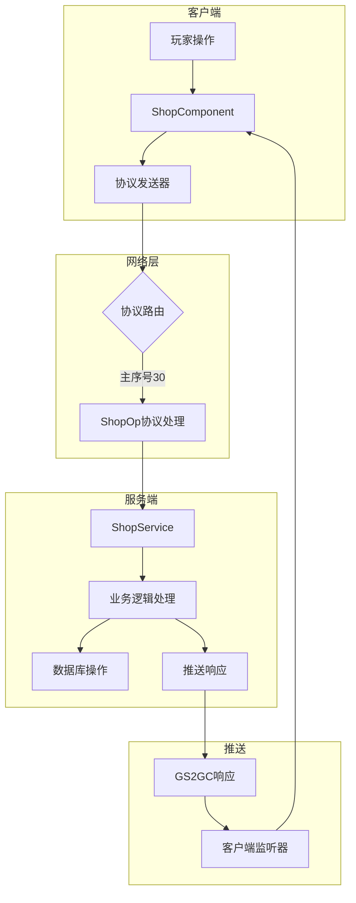

### 1.2 协议序号分配

| 子序号范围 | 用途 | 示例协议 |
|------------|------|----------|
| 001-010 | 商店商品操作 | 001购买, 002免费刷新, 003付费刷新, 004自动刷新 |
| 011-020 | 商店信息查询 | 005商店信息, 006商店列表 |
| 021-030 | 礼包操作 | 021刷新礼包, 022购买礼包 |
| 031-049 | 保留扩展 | - |
| 050-059 | 推送通知 | 050商店刷新推送, 051商品变更推送 |
| 060-069 | 礼包推送 | 060礼包刷新推送, 061-063礼包记录变更 |

### 1.3 协议分类一览表

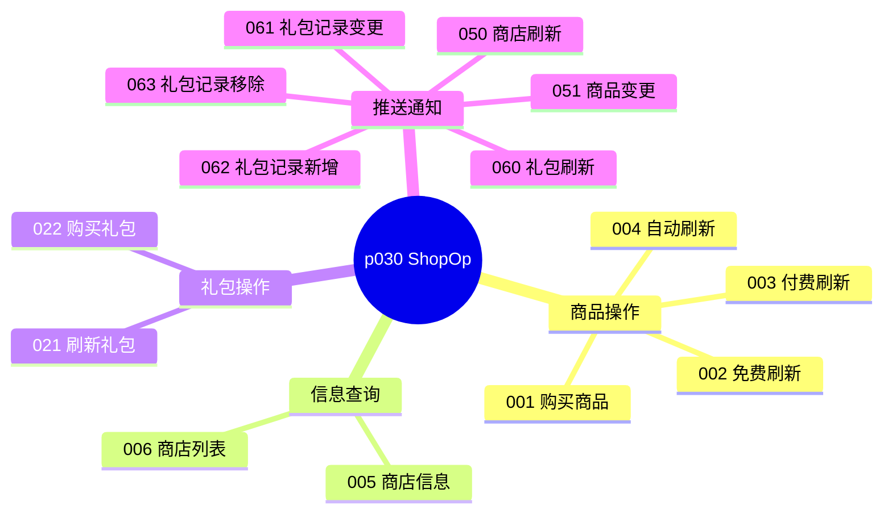

---

## 二、请求协议 (GC2GS)

### 2.1 GC2GS_030_001_ReqBuyShopItem - 购买商品

**主序号**: 30 | **子序号**: 1

#### 协议字段

| 字段名 | 类型 | 说明 | 必填 | 校验规则 |
|--------|------|------|------|----------|
| shopRefId | long | 商店配置ID | 是 | 必须为有效商店ID |
| instanceId | long | 商品实例ID | 是 | 必须存在于商店商品列表 |
| count | long | 购买数量 | 是 | 范围 1-999 |

#### 协议源码

```csharp
public class GC2GS_030_001_ReqBuyShopItem : _IALProtocolStructure
{
    private long shopRefId;   // 商店配置id
    private long instanceId;  // 商品id
    private long count;       // 数量

    public byte getMainOrder() { return (byte)30; }
    public byte getSubOrder() { return (byte)1; }
}
```

#### 请求示例

```csharp
// 通过商店组件发送购买请求
NPPlayer.instance.shopComp.reqBuyShopItem(shopId, instanceId, count, () => {
    // 购买成功回调
    Debug.Log("购买成功");
});
```

---

### 2.2 GC2GS_030_002_ReqFreeRefreshShop - 免费刷新商店

**主序号**: 30 | **子序号**: 2

#### 协议字段

| 字段名 | 类型 | 说明 | 必填 | 校验规则 |
|--------|------|------|------|----------|
| shopRefId | long | 商店配置ID | 是 | 必须为有效商店ID |

#### 协议源码

```csharp
public class GC2GS_030_002_ReqFreeRefreshShop : _IALProtocolStructure
{
    private long shopRefId;  // 商店配置id

    public byte getMainOrder() { return (byte)30; }
    public byte getSubOrder() { return (byte)2; }
}
```

#### 请求示例

```csharp
NPPlayer.instance.shopComp.reqFreeRefreshShop(shopId, () => {
    Debug.Log("免费刷新成功");
});
```

---

### 2.3 GC2GS_030_003_ReqRefreshShop - 付费刷新商店

**主序号**: 30 | **子序号**: 3

#### 协议字段

| 字段名 | 类型 | 说明 | 必填 | 校验规则 |
|--------|------|------|------|----------|
| shopRefId | long | 商店配置ID | 是 | 必须为有效商店ID |

#### 协议源码

```csharp
public class GC2GS_030_003_ReqRefreshShop : _IALProtocolStructure
{
    private long shopRefId;  // 商店配置id

    public byte getMainOrder() { return (byte)30; }
    public byte getSubOrder() { return (byte)3; }
}
```

#### 请求示例

```csharp
NPPlayer.instance.shopComp.reqRefreshShop(shopId, () => {
    Debug.Log("付费刷新成功");
});
```

---

### 2.4 GC2GS_030_004_ReqAutoRefreshShop - 自动刷新商店

**主序号**: 30 | **子序号**: 4

#### 协议字段

| 字段名 | 类型 | 说明 | 必填 | 校验规则 |
|--------|------|------|------|----------|
| shopRefId | long | 商店配置ID | 是 | 必须为有效商店ID |

#### 说明

用于服务器定时刷新触发，客户端通常不直接调用。

---

### 2.5 完整请求协议列表

| 协议名 | 主序号 | 子序号 | 说明 | 触发时机 |
|--------|--------|--------|------|----------|
| GC2GS_030_001_ReqBuyShopItem | 30 | 1 | 购买商店商品 | 玩家点击购买 |
| GC2GS_030_002_ReqFreeRefreshShop | 30 | 2 | 免费刷新商店 | 玩家使用免费刷新 |
| GC2GS_030_003_ReqRefreshShop | 30 | 3 | 付费刷新商店 | 玩家使用付费刷新 |
| GC2GS_030_004_ReqAutoRefreshShop | 30 | 4 | 自动刷新商店 | 定时器触发 |
| GC2GS_030_021_ReqRefreshGiftPack | 30 | 21 | 刷新礼包列表 | 进入礼包界面 |
| GC2GS_030_022_ReqBuyGiftPack | 30 | 22 | 购买礼包 | 玩家购买礼包 |

---

## 三、响应与推送协议 (GS2GC)

### 3.1 GS2GC_030_050_OnShopRefresh - 商店刷新推送

**主序号**: 30 | **子序号**: 50

#### 协议字段

| 字段名 | 类型 | 说明 |
|--------|------|------|
| shop | Shop_Info | 商店完整数据 |

#### 协议源码

```csharp
public class GS2GC_030_050_OnShopRefresh : _IALProtocolStructure
{
    private Shop_Info shop;  // 商店数据

    public byte getMainOrder() { return (byte)30; }
    public byte getSubOrder() { return (byte)50; }
}
```

#### 客户端处理

```csharp
// 监听器处理
public class GSSubDealer_030_050_OnShopRefresh : _AGSSubDealerBase
{
    public override void deal(NPPlayer _player, GS2GC_030_050_OnShopRefresh _msg)
    {
        Shop_Info shopInfo = _msg.getShop();
        _player.shopComp.retOnShopRefresh(shopInfo);
    }
}

// 组件处理
public void retOnShopRefresh(Shop_Info _info)
{
    if (null == _info) return;

    NPPlayerShop shop = getShop(_info.getShopRefId());
    if (null == shop) return;

    shop.update(_info);
    setShopNextRefreshTimeMs(_info.getShopRefId(), _info.getNextRefreshTimeMs());
    _m_redDealer?.refrshRedTip(shop);
}
```

---

### 3.2 GS2GC_030_051_OnShopItemChg - 商品变更推送

**主序号**: 30 | **子序号**: 51

#### 协议字段

| 字段名 | 类型 | 说明 |
|--------|------|------|
| shopRefId | long | 商店配置ID |
| shopItem | Shop_ItemInfo | 变更的商品数据 |

#### 协议源码

```csharp
public class GS2GC_030_051_OnShopItemChg : _IALProtocolStructure
{
    private long shopRefId;              // 商店配置id
    private Shop_ItemInfo shopItem;      // 商品数据变更

    public byte getMainOrder() { return (byte)30; }
    public byte getSubOrder() { return (byte)51; }
}
```

#### 客户端处理

```csharp
// 监听器处理
public class GSSubDealer_030_051_OnShopItemChg : _AGSSubDealerBase
{
    public override void deal(NPPlayer _player, GS2GC_030_051_OnShopItemChg _msg)
    {
        long shopId = _msg.getShopRefId();
        Shop_ItemInfo itemInfo = _msg.getShopItem();
        _player.shopComp.retOnShopItemChg(shopId, itemInfo);
    }
}

// 组件处理
public void retOnShopItemChg(long _shopId, Shop_ItemInfo _item)
{
    if (null == _item) return;

    NPPlayerShop shop = getShop(_shopId);
    if (null == shop) return;

    shop.updateItem(_item);
}

// 商品更新
public void updateItem(Shop_ItemInfo _item)
{
    NPPlayerShopItem temp = null;
    for (int i = 0; i < _m_shopItemList.Count; i++)
    {
        temp = _m_shopItemList[i];
        if (temp.instanceId == _item.getInstanceId())
        {
            temp.update(_item);
            break;
        }
    }
}
```

---

### 3.3 完整推送协议列表

| 协议名 | 主序号 | 子序号 | 说明 | 触发时机 |
|--------|--------|--------|------|----------|
| GS2GC_030_050_OnShopRefresh | 30 | 50 | 商店刷新推送 | 商店刷新后 |
| GS2GC_030_051_OnShopItemChg | 30 | 51 | 商品变更推送 | 商品购买后 |
| GS2GC_030_060_OnGiftPackRefresh | 30 | 60 | 礼包刷新推送 | 礼包列表更新 |
| GS2GC_030_061_OnGiftPackBuyRecordChg | 30 | 61 | 礼包购买记录变更 | 购买记录修改 |
| GS2GC_030_062_OnGiftPackBuyRecordAdd | 30 | 62 | 礼包购买记录新增 | 新增购买记录 |
| GS2GC_030_063_OnGiftPackBuyRecordRemove | 30 | 63 | 礼包购买记录移除 | 移除购买记录 |

---

## 四、协议交互流程

### 4.1 商品购买完整流程

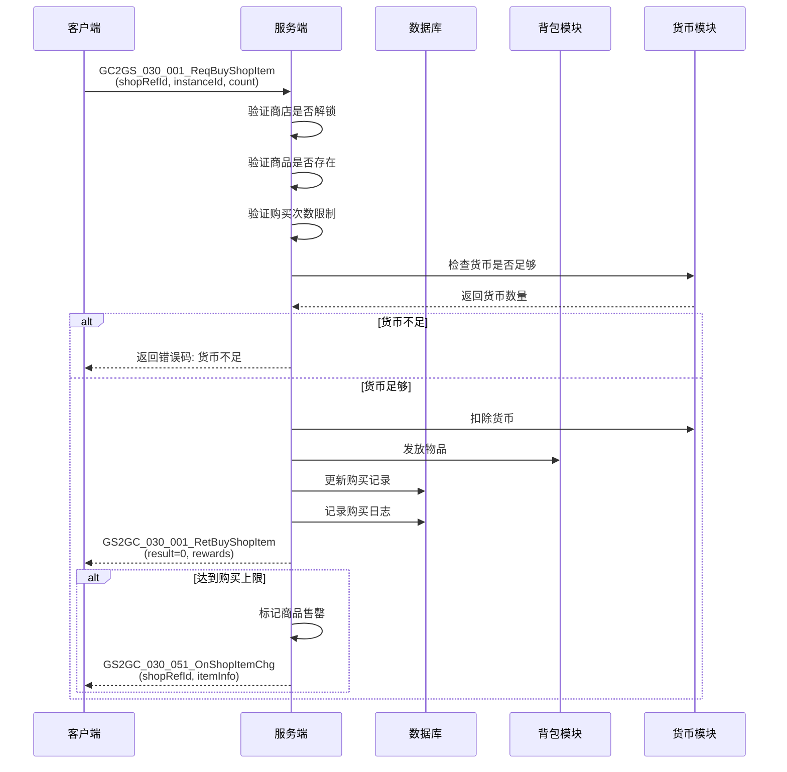

### 4.2 商店刷新完整流程

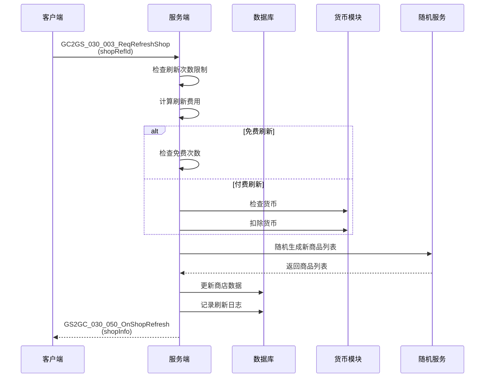

### 4.3 自动刷新定时流程

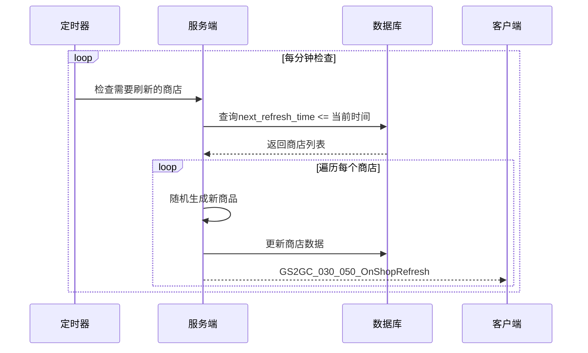

---

## 五、协议错误码

### 5.1 商店模块错误码定义

| 错误码 | 常量名 | 说明 | 触发场景 | 用户提示 |
|--------|--------|------|----------|----------|
| 30001 | SHOP_NOT_FOUND | 商店不存在 | 查询商店时 | "商店不存在" |
| 30002 | SHOP_NOT_UNLOCKED | 商店未解锁 | 访问商店时 | "商店尚未解锁" |
| 30003 | ITEM_NOT_FOUND | 商品不存在 | 查询商品时 | "商品不存在" |
| 30004 | ITEM_SOLD_OUT | 商品已售罄 | 购买商品时 | "商品已售罄" |
| 30005 | BUY_LIMIT_REACHED | 购买次数已达上限 | 购买商品/礼包时 | "购买次数已达上限" |
| 30006 | CURRENCY_NOT_ENOUGH | 货币不足 | 扣除货币时 | "货币不足" |
| 30007 | BAG_FULL | 背包已满 | 发放物品时 | "背包已满" |
| 30008 | REFRESH_LIMIT_REACHED | 刷新次数已达上限 | 刷新商店时 | "今日刷新次数已用完" |
| 30009 | GIFT_PACK_NOT_FOUND | 礼包不存在 | 查询礼包时 | "礼包不存在" |
| 30010 | GIFT_PACK_EXPIRED | 礼包已过期 | 购买限时礼包时 | "礼包已过期" |
| 30011 | GIFT_PACK_OFF_SHELF | 礼包已下架 | 购买礼包时 | "礼包已下架" |
| 30012 | SHOP_REFRESH_ERROR | 商店刷新失败 | 刷新商店时 | "刷新失败，请重试" |
| 30013 | FREE_REFRESH_USED | 免费次数已用完 | 免费刷新时 | "免费刷新次数已用完" |

### 5.2 错误处理流程

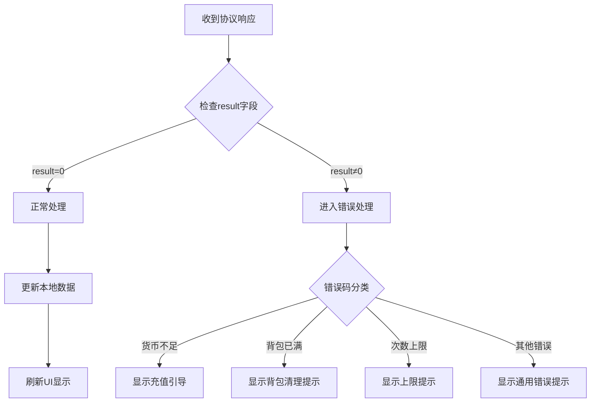

---

## 六、协议安全机制

### 6.1 请求频率限制

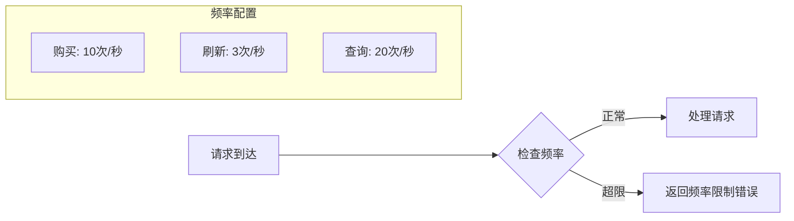

| 协议类型 | 频率限制 | 限制策略 | 超限处理 |
|----------|----------|----------|----------|
| 购买商品 | 10次/秒 | 滑动窗口 | 返回"操作过于频繁" |
| 刷新商店 | 3次/秒 | 滑动窗口 | 返回"操作过于频繁" |
| 购买礼包 | 5次/秒 | 滑动窗口 | 返回"操作过于频繁" |
| 查询信息 | 20次/秒 | 滑动窗口 | 返回"请稍后重试" |

### 6.2 参数校验规则

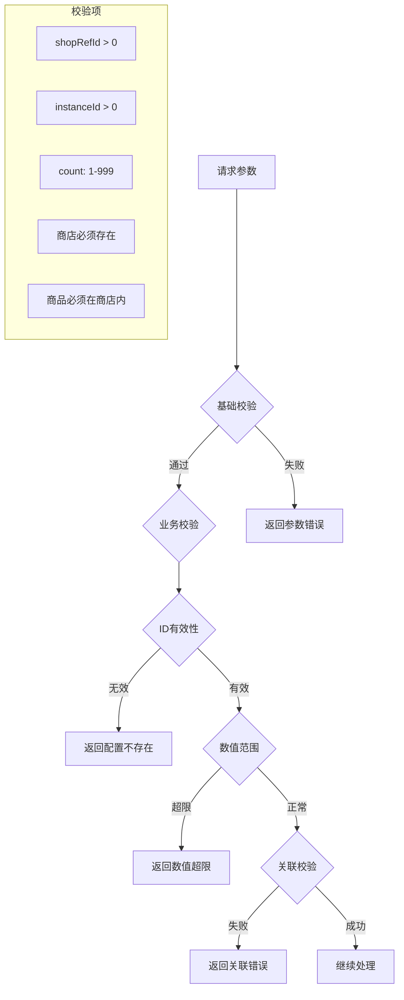

### 6.3 幂等性设计

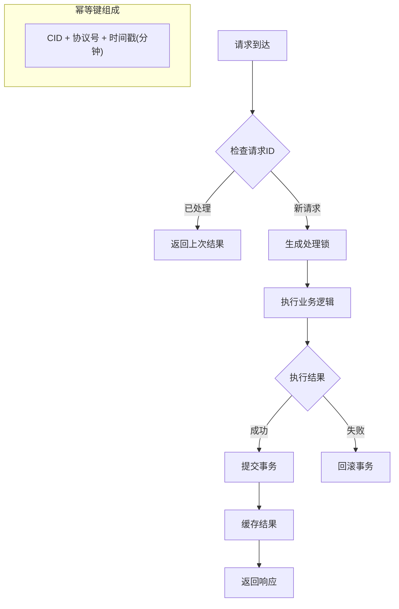

---

## 七、客户端协议封装

### 7.1 协议发送器

```csharp
// GSWriter_030_ShopOp.cs - 协议发送封装
public static class GSWriter_030_ShopOp
{
    /// <summary>
    /// 购买商品
    /// </summary>
    public static GC2GS_030_001_ReqBuyShopItem make_001_ReqBuyShopItem(
        long shopRefId, long instanceId, int count)
    {
        GC2GS_030_001_ReqBuyShopItem req = new GC2GS_030_001_ReqBuyShopItem();
        req.setShopRefId(shopRefId);
        req.setInstanceId(instanceId);
        req.setCount(count);
        return req;
    }

    /// <summary>
    /// 免费刷新商店
    /// </summary>
    public static GC2GS_030_002_ReqFreeRefreshShop make_002_ReqFreeRefreshShop(
        long shopRefId)
    {
        GC2GS_030_002_ReqFreeRefreshShop req = new GC2GS_030_002_ReqFreeRefreshShop();
        req.setShopRefId(shopRefId);
        return req;
    }

    /// <summary>
    /// 付费刷新商店
    /// </summary>
    public static GC2GS_030_003_ReqRefreshShop make_003_ReqRefreshShop(
        long shopRefId)
    {
        GC2GS_030_003_ReqRefreshShop req = new GC2GS_030_003_ReqRefreshShop();
        req.setShopRefId(shopRefId);
        return req;
    }

    /// <summary>
    /// 自动刷新商店
    /// </summary>
    public static GC2GS_030_004_ReqAutoRefreshShop make_004_ReqAutoRefreshShop(
        long shopRefId)
    {
        GC2GS_030_004_ReqAutoRefreshShop req = new GC2GS_030_004_ReqAutoRefreshShop();
        req.setShopRefId(shopRefId);
        return req;
    }
}
```

### 7.2 组件封装调用

```csharp
// NPPlayerShopComponent.cs - 组件层封装
public partial class NPPlayerShopComponent : _ANPBasicPlayerComponent
{
    /// <summary>
    /// 购买商品
    /// </summary>
    public void reqBuyShopItem(long _shopId, long _instanceId, int _count, Action _backAction = null)
    {
        NPGSClientListener.sendRequestByLog(
            GSWriter_030_ShopOp.make_001_ReqBuyShopItem(_shopId, _instanceId, _count),
            new CommonErrCodeRequestCallbackProtocolDealer<GS2GC_030_001_RetBuyShopItem>((info) =>
            {
                WinMsg.SendMsg(WinMsgType.SHOP_ITEM_CHG, _instanceId);
                _backAction?.Invoke();
            }));
    }

    /// <summary>
    /// 免费刷新
    /// </summary>
    public void reqFreeRefreshShop(long _shopId, Action _backAction = null)
    {
        NPGSClientListener.sendRequestByLog(
            GSWriter_030_ShopOp.make_002_ReqFreeRefreshShop(_shopId),
            new CommonErrCodeRequestCallbackProtocolDealer<GS2GC_030_002_RetFreeRefreshShop>((info) =>
            {
                _backAction?.Invoke();
            }));
    }

    /// <summary>
    /// 付费刷新
    /// </summary>
    public void reqRefreshShop(long _shopId, Action _backAction = null)
    {
        NPGSClientListener.sendRequestByLog(
            GSWriter_030_ShopOp.make_003_ReqRefreshShop(_shopId),
            new CommonErrCodeRequestCallbackProtocolDealer<GS2GC_030_003_RetRefreshShop>((info) =>
            {
                _backAction?.Invoke();
            }));
    }

    /// <summary>
    /// 自动刷新
    /// </summary>
    public void reqAutoRefreshShop(long _shopId, Action _backAction = null)
    {
        NPGSClientListener.sendRequestByLog(
            GSWriter_030_ShopOp.make_004_ReqAutoRefreshShop(_shopId),
            new CommonErrCodeRequestCallbackProtocolDealer<GS2GC_030_004_RetAutoRefreshShop>((info) =>
            {
                _backAction?.Invoke();
            }));
    }
}
```

### 7.3 监听器注册

```csharp
// 协议监听器注册
public void RegisterShopProtocolListeners()
{
    // 商店刷新推送
    NPGSClientListener.registSubDealer(
        new GSSubDealer_030_050_OnShopRefresh());

    // 商品变更推送
    NPGSClientListener.registSubDealer(
        new GSSubDealer_030_051_OnShopItemChg());

    // 礼包相关推送
    NPGSClientListener.registSubDealer(
        new GSSubDealer_030_060_OnGiftPackRefresh());
    NPGSClientListener.registSubDealer(
        new GSSubDealer_030_061_OnGiftPackBuyRecordChg());
    NPGSClientListener.registSubDealer(
        new GSSubDealer_030_062_OnGiftPackBuyRecordAdd());
    NPGSClientListener.registSubDealer(
        new GSSubDealer_030_063_OnGiftPackBuyRecordRemove());
}
```

---

## 八、协议监控与日志

### 8.1 协议监控指标

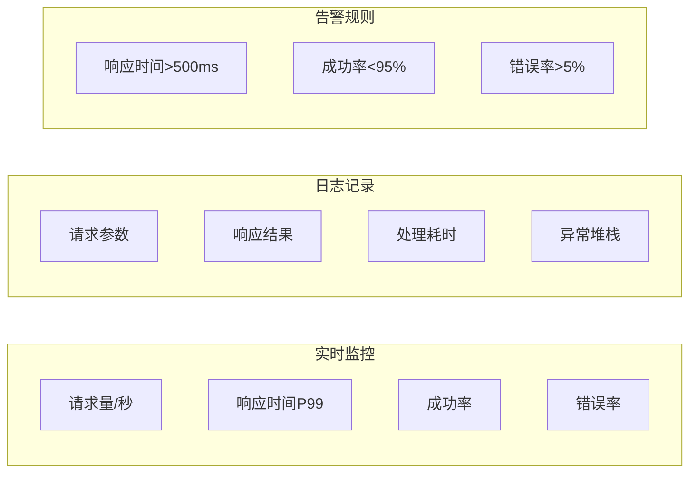

### 8.2 协议日志格式

```json
{
  "timestamp": "2026-04-11T10:30:00.000Z",
  "protocol": "GC2GS_030_001_ReqBuyShopItem",
  "mainOrder": 30,
  "subOrder": 1,
  "cid": 12345678,
  "request": {
    "shopRefId": 1001,
    "instanceId": 98765432,
    "count": 1
  },
  "response": {
    "result": 0,
    "costValue": 400,
    "rewards": [...]
  },
  "duration": 45,
  "serverIp": "192.168.1.100"
}
```

---

## 九、协议版本兼容

### 9.1 版本兼容策略

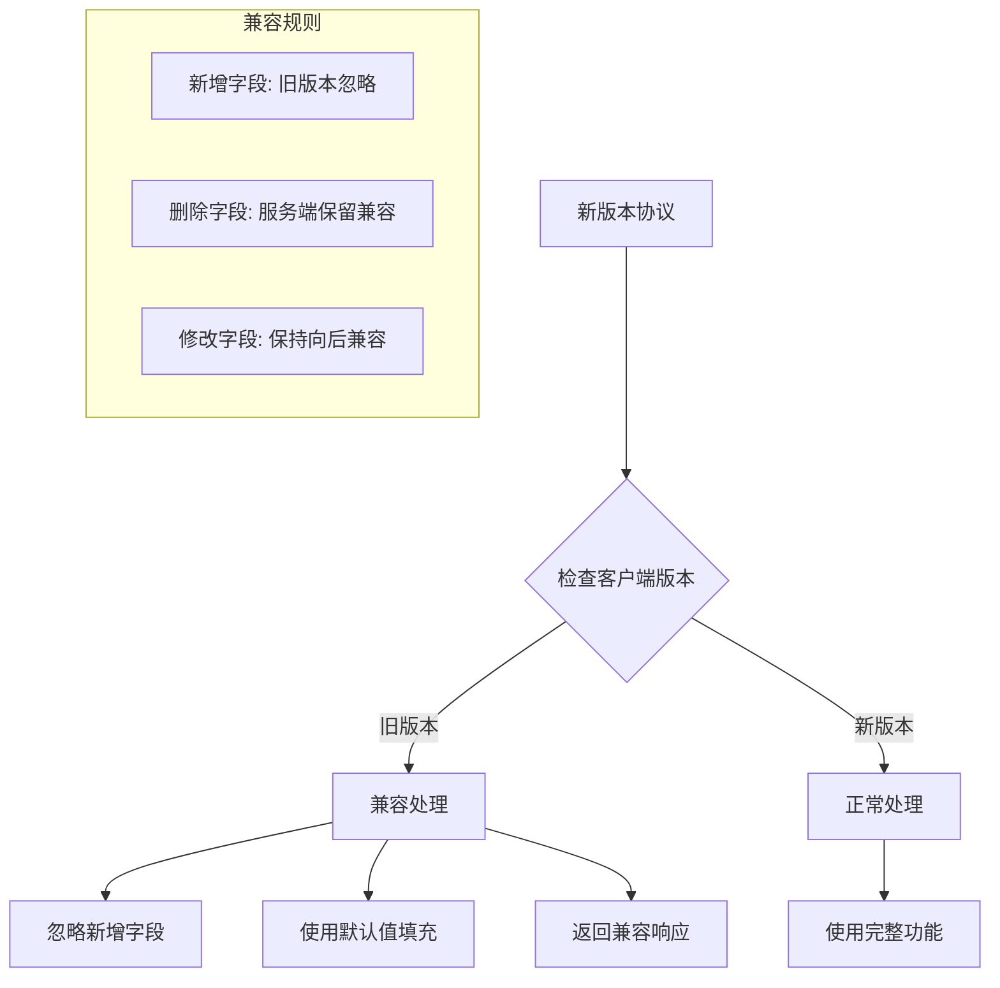

### 9.2 协议升级指南

| 升级类型 | 兼容性 | 处理方式 |
|----------|--------|----------|
| 新增字段 | 向后兼容 | 旧版本忽略，新版本使用 |
| 新增协议 | 向后兼容 | 旧版本不调用，新版本使用 |
| 删除字段 | 不兼容 | 需要强制更新 |
| 修改字段类型 | 不兼容 | 需要强制更新 |

---

*文档生成时间: 2026-04-11*
*源码参考路径: `/ClientProtocol/GC2GS/p030_ShopOp/`*
*源码参考路径: `/ClientProtocol/GS2GC/p030_ShopOp/`*
