# 商店模块协议文档

## 协议模块编号: p030

**源码路径**:
- 客户端请求: `ClientProtocol/GC2GS/p030_ShopOp/`
- 服务端响应: `ClientProtocol/GS2GC/p030_ShopOp/`

---

## 一、协议总览

### 1.1 协议模块架构图

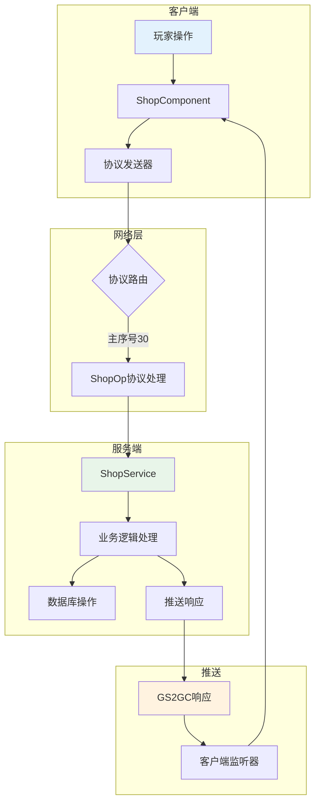
```mermaid
graph TB
    subgraph 客户端
        A[玩家操作] --> B[ShopComponent]
        B --> C[协议发送器]
    end

    subgraph 网络层
        C --> D{协议路由}
        D -->|主序号30| E[ShopOp协议处理]
    end

    subgraph 服务端
        E --> F[ShopService]
        F --> G[业务逻辑处理]
        G --> H[数据库操作]
        G --> I[推送响应]
    end

    subgraph 推送
        I --> J[GS2GC响应]
        J --> K[客户端监听器]
        K --> B
    end

    style A fill:#e3f2fd
    style F fill:#e8f5e9
    style J fill:#fff3e0
```

### 1.2 协议序号分配

| 子序号范围 | 用途 | 示例协议 |
|------------|------|----------|
| 001-010 | 商店商品操作 | 001购买, 002免费刷新, 003付费刷新, 004自动刷新 |
| 011-020 | 商店信息查询 | 005商店信息, 006商店列表 |
| 021-030 | 礼包操作 | 021刷新礼包, 022购买礼包 |
| 031-049 | 保留扩展 | - |
| 050-059 | 推送通知 | 050商店刷新推送, 051商品变更推送 |
| 060-069 | 礼包推送 | 060礼包刷新推送, 061-063礼包记录变更 |

### 1.3 协议分类一览表

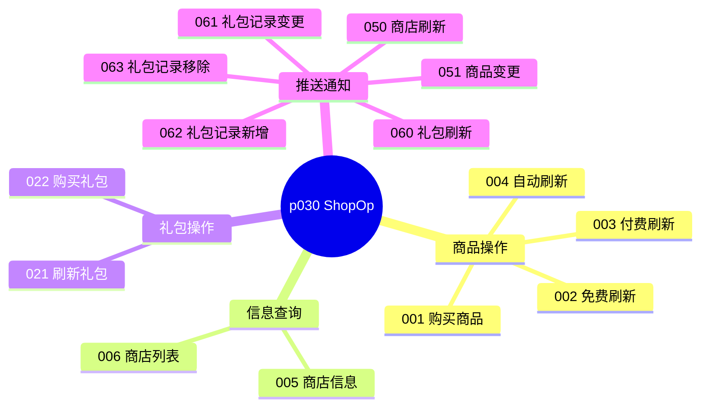
```mermaid
mindmap
  root((p030 ShopOp))
    商品操作
      001 购买商品
      002 免费刷新
      003 付费刷新
      004 自动刷新
    信息查询
      005 商店信息
      006 商店列表
    礼包操作
      021 刷新礼包
      022 购买礼包
    推送通知
      050 商店刷新
      051 商品变更
      060 礼包刷新
      061 礼包记录变更
      062 礼包记录新增
      063 礼包记录移除
```

---

## 二、请求协议 (GC2GS)

### 2.1 GC2GS_030_001_ReqBuyShopItem - 购买商品

**主序号**: 30 | **子序号**: 1

#### 协议字段

| 字段名 | 类型 | 说明 | 必填 | 校验规则 |
|--------|------|------|------|----------|
| shopRefId | long | 商店配置ID | 是 | 必须为有效商店ID |
| instanceId | long | 商品实例ID | 是 | 必须存在于商店商品列表 |
| count | long | 购买数量 | 是 | 范围 1-999 |

#### 协议源码

```csharp
public class GC2GS_030_001_ReqBuyShopItem : _IALProtocolStructure
{
    private long shopRefId;   // 商店配置id
    private long instanceId;  // 商品id
    private long count;       // 数量

    public byte getMainOrder() { return (byte)30; }
    public byte getSubOrder() { return (byte)1; }
}
```

#### 请求示例

```csharp
// 通过商店组件发送购买请求
NPPlayer.instance.shopComp.reqBuyShopItem(shopId, instanceId, count, () => {
    // 购买成功回调
    Debug.Log("购买成功");
});
```

---

### 2.2 GC2GS_030_002_ReqFreeRefreshShop - 免费刷新商店

**主序号**: 30 | **子序号**: 2

#### 协议字段

| 字段名 | 类型 | 说明 | 必填 | 校验规则 |
|--------|------|------|------|----------|
| shopRefId | long | 商店配置ID | 是 | 必须为有效商店ID |

#### 协议源码

```csharp
public class GC2GS_030_002_ReqFreeRefreshShop : _IALProtocolStructure
{
    private long shopRefId;  // 商店配置id

    public byte getMainOrder() { return (byte)30; }
    public byte getSubOrder() { return (byte)2; }
}
```

#### 请求示例

```csharp
NPPlayer.instance.shopComp.reqFreeRefreshShop(shopId, () => {
    Debug.Log("免费刷新成功");
});
```

---

### 2.3 GC2GS_030_003_ReqRefreshShop - 付费刷新商店

**主序号**: 30 | **子序号**: 3

#### 协议字段

| 字段名 | 类型 | 说明 | 必填 | 校验规则 |
|--------|------|------|------|----------|
| shopRefId | long | 商店配置ID | 是 | 必须为有效商店ID |

#### 协议源码

```csharp
public class GC2GS_030_003_ReqRefreshShop : _IALProtocolStructure
{
    private long shopRefId;  // 商店配置id

    public byte getMainOrder() { return (byte)30; }
    public byte getSubOrder() { return (byte)3; }
}
```

#### 请求示例

```csharp
NPPlayer.instance.shopComp.reqRefreshShop(shopId, () => {
    Debug.Log("付费刷新成功");
});
```

---

### 2.4 GC2GS_030_004_ReqAutoRefreshShop - 自动刷新商店

**主序号**: 30 | **子序号**: 4

#### 协议字段

| 字段名 | 类型 | 说明 | 必填 | 校验规则 |
|--------|------|------|------|----------|
| shopRefId | long | 商店配置ID | 是 | 必须为有效商店ID |

#### 说明

用于服务器定时刷新触发，客户端通常不直接调用。

---

### 2.5 GC2GS_030_005_ReqShopInfo - 获取商店信息

**主序号**: 30 | **子序号**: 5

#### 协议字段

| 字段名 | 类型 | 说明 | 必填 | 校验规则 |
|--------|------|------|------|----------|
| shopRefId | long | 商店配置ID | 是 | 必须为有效商店ID |

#### 协议源码

```csharp
public class GC2GS_030_005_ReqShopInfo : _IALProtocolStructure
{
    private long shopRefId;  // 商店配置id

    public byte getMainOrder() { return (byte)30; }
    public byte getSubOrder() { return (byte)5; }
}
```

---

### 2.6 GC2GS_030_006_ReqShopList - 获取商店列表

**主序号**: 30 | **子序号**: 6

#### 协议字段

| 字段名 | 类型 | 说明 | 必填 | 校验规则 |
|--------|------|------|------|----------|
| shopType | int | 商店类型（0表示全部） | 否 | 范围 0-10 |

#### 协议源码

```csharp
public class GC2GS_030_006_ReqShopList : _IALProtocolStructure
{
    private int shopType;  // 商店类型

    public byte getMainOrder() { return (byte)30; }
    public byte getSubOrder() { return (byte)6; }
}
```

---

### 2.7 GC2GS_030_021_ReqRefreshGiftPack - 刷新礼包列表

**主序号**: 30 | **子序号**: 21

#### 协议字段

| 字段名 | 类型 | 说明 | 必填 | 校验规则 |
|--------|------|------|------|----------|
| giftPackType | int | 礼包类型（0表示全部） | 否 | 范围 0-8 |

---

### 2.8 GC2GS_030_022_ReqBuyGiftPack - 购买礼包

**主序号**: 30 | **子序号**: 22

#### 协议字段

| 字段名 | 类型 | 说明 | 必填 | 校验规则 |
|--------|------|------|------|----------|
| giftPackId | long | 礼包配置ID | 是 | 必须为有效礼包ID |
| instanceId | long | 礼包实例ID（限时礼包需要） | 否 | 限时礼包必填 |

#### 协议源码

```csharp
public class GC2GS_030_022_ReqBuyGiftPack : _IALProtocolStructure
{
    private long giftPackId;   // 礼包配置id
    private long instanceId;   // 礼包实例id

    public byte getMainOrder() { return (byte)30; }
    public byte getSubOrder() { return (byte)22; }
}
```

---

### 2.9 完整请求协议列表

| 协议名 | 主序号 | 子序号 | 说明 | 触发时机 |
|--------|--------|--------|------|----------|
| GC2GS_030_001_ReqBuyShopItem | 30 | 1 | 购买商店商品 | 玩家点击购买 |
| GC2GS_030_002_ReqFreeRefreshShop | 30 | 2 | 免费刷新商店 | 玩家使用免费刷新 |
| GC2GS_030_003_ReqRefreshShop | 30 | 3 | 付费刷新商店 | 玩家使用付费刷新 |
| GC2GS_030_004_ReqAutoRefreshShop | 30 | 4 | 自动刷新商店 | 定时器触发 |
| GC2GS_030_005_ReqShopInfo | 30 | 5 | 获取商店信息 | 进入商店界面 |
| GC2GS_030_006_ReqShopList | 30 | 6 | 获取商店列表 | 商店总览界面 |
| GC2GS_030_021_ReqRefreshGiftPack | 30 | 21 | 刷新礼包列表 | 进入礼包界面 |
| GC2GS_030_022_ReqBuyGiftPack | 30 | 22 | 购买礼包 | 玩家购买礼包 |

---

## 三、响应协议 (GS2GC)

### 3.1 GS2GC_030_001_RetBuyShopItem - 购买商品响应

**主序号**: 30 | **子序号**: 1

#### 协议字段

| 字段名 | 类型 | 说明 |
|--------|------|------|
| result | int | 结果码（0表示成功） |
| shopRefId | long | 商店配置ID |
| instanceId | long | 商品实例ID |
| buyCount | int | 本次购买数量 |
| totalBuyCount | int | 累计购买数量 |
| costValue | long | 消耗货币数量 |
| rewardList | List\<NPCommonCostItem\> | 获得的奖励列表 |

#### 协议源码

```csharp
public class GS2GC_030_001_RetBuyShopItem : _IALProtocolStructure
{
    private int result;          // 结果码
    private long shopRefId;      // 商店配置id
    private long instanceId;     // 商品实例id
    private int buyCount;        // 本次购买数量
    private int totalBuyCount;   // 累计购买数量
    private long costValue;      // 消耗货币数量
    private List<NPCommonCostItem> rewardList;  // 奖励列表

    public byte getMainOrder() { return (byte)30; }
    public byte getSubOrder() { return (byte)1; }
}
```

---

### 3.2 GS2GC_030_002_RetFreeRefreshShop - 免费刷新响应

**主序号**: 30 | **子序号**: 2

#### 协议字段

| 字段名 | 类型 | 说明 |
|--------|------|------|
| result | int | 结果码（0表示成功） |
| shopRefId | long | 商店配置ID |
| shopInfo | Shop_Info | 商店完整数据 |

---

### 3.3 GS2GC_030_003_RetRefreshShop - 付费刷新响应

**主序号**: 30 | **子序号**: 3

#### 协议字段

| 字段名 | 类型 | 说明 |
|--------|------|------|
| result | int | 结果码（0表示成功） |
| shopRefId | long | 商店配置ID |
| shopInfo | Shop_Info | 商店完整数据 |
| costValue | long | 消耗货币数量 |

---

### 3.4 GS2GC_030_005_RetShopInfo - 商店信息响应

**主序号**: 30 | **子序号**: 5

#### 协议字段

| 字段名 | 类型 | 说明 |
|--------|------|------|
| result | int | 结果码（0表示成功） |
| shopInfo | Shop_Info | 商店完整数据 |

---

### 3.5 GS2GC_030_006_RetShopList - 商店列表响应

**主序号**: 30 | **子序号**: 6

#### 协议字段

| 字段名 | 类型 | 说明 |
|--------|------|------|
| result | int | 结果码（0表示成功） |
| shopList | List\<Shop_Info\> | 商店列表 |

---

### 3.6 GS2GC_030_022_RetBuyGiftPack - 购买礼包响应

**主序号**: 30 | **子序号**: 22

#### 协议字段

| 字段名 | 类型 | 说明 |
|--------|------|------|
| result | int | 结果码（0表示成功） |
| giftPackId | long | 礼包配置ID |
| instanceId | long | 礼包实例ID |
| rewardList | List\<NPCommonCostItem\> | 获得的奖励列表 |

---

## 四、推送协议 (GS2GC)

### 4.1 GS2GC_030_050_OnShopRefresh - 商店刷新推送

**主序号**: 30 | **子序号**: 50

#### 协议字段

| 字段名 | 类型 | 说明 |
|--------|------|------|
| shop | Shop_Info | 商店完整数据 |

#### 协议源码

```csharp
public class GS2GC_030_050_OnShopRefresh : _IALProtocolStructure
{
    private Shop_Info shop;  // 商店数据

    public byte getMainOrder() { return (byte)30; }
    public byte getSubOrder() { return (byte)50; }
}
```

#### 客户端处理

```csharp
// 监听器处理
public class GSSubDealer_030_050_OnShopRefresh : _AGSSubDealerBase
{
    public override void deal(NPPlayer _player, GS2GC_030_050_OnShopRefresh _msg)
    {
        Shop_Info shopInfo = _msg.getShop();
        _player.shopComp.retOnShopRefresh(shopInfo);
    }
}

// 组件处理
public void retOnShopRefresh(Shop_Info _info)
{
    if (null == _info) return;

    NPPlayerShop shop = getShop(_info.getShopRefId());
    if (null == shop) return;

    shop.update(_info);
    setShopNextRefreshTimeMs(_info.getShopRefId(), _info.getNextRefreshTimeMs());
    _m_redDealer?.refrshRedTip(shop);
}
```

---

### 4.2 GS2GC_030_051_OnShopItemChg - 商品变更推送

**主序号**: 30 | **子序号**: 51

#### 协议字段

| 字段名 | 类型 | 说明 |
|--------|------|------|
| shopRefId | long | 商店配置ID |
| shopItem | Shop_ItemInfo | 变更的商品数据 |

#### 协议源码

```csharp
public class GS2GC_030_051_OnShopItemChg : _IALProtocolStructure
{
    private long shopRefId;              // 商店配置id
    private Shop_ItemInfo shopItem;      // 商品数据变更

    public byte getMainOrder() { return (byte)30; }
    public byte getSubOrder() { return (byte)51; }
}
```

#### 客户端处理

```csharp
// 监听器处理
public class GSSubDealer_030_051_OnShopItemChg : _AGSSubDealerBase
{
    public override void deal(NPPlayer _player, GS2GC_030_051_OnShopItemChg _msg)
    {
        long shopId = _msg.getShopRefId();
        Shop_ItemInfo itemInfo = _msg.getShopItem();
        _player.shopComp.retOnShopItemChg(shopId, itemInfo);
    }
}

// 组件处理
public void retOnShopItemChg(long _shopId, Shop_ItemInfo _item)
{
    if (null == _item) return;

    NPPlayerShop shop = getShop(_shopId);
    if (null == shop) return;

    shop.updateItem(_item);
}

// 商品更新
public void updateItem(Shop_ItemInfo _item)
{
    NPPlayerShopItem temp = null;
    for (int i = 0; i < _m_shopItemList.Count; i++)
    {
        temp = _m_shopItemList[i];
        if (temp.instanceId == _item.getInstanceId())
        {
            temp.update(_item);
            break;
        }
    }
}
```

---

### 4.3 GS2GC_030_060_OnGiftPackRefresh - 礼包刷新推送

**主序号**: 30 | **子序号**: 60

#### 协议字段

| 字段名 | 类型 | 说明 |
|--------|------|------|
| giftPackList | List\<GiftPack_Info\> | 礼包列表 |

---

### 4.4 GS2GC_030_061_OnGiftPackBuyRecordChg - 礼包购买记录变更

**主序号**: 30 | **子序号**: 61

#### 协议字段

| 字段名 | 类型 | 说明 |
|--------|------|------|
| giftPackId | long | 礼包配置ID |
| buyCount | int | 购买次数 |

---

### 4.5 GS2GC_030_062_OnGiftPackBuyRecordAdd - 礼包记录新增

**主序号**: 30 | **子序号**: 62

#### 协议字段

| 字段名 | 类型 | 说明 |
|--------|------|------|
| giftPackInfo | GiftPack_Info | 新增的礼包信息 |

---

### 4.6 GS2GC_030_063_OnGiftPackBuyRecordRemove - 礼包记录移除

**主序号**: 30 | **子序号**: 63

#### 协议字段

| 字段名 | 类型 | 说明 |
|--------|------|------|
| giftPackId | long | 礼包配置ID |
| instanceId | long | 礼包实例ID |

---

### 4.7 完整推送协议列表

| 协议名 | 主序号 | 子序号 | 说明 | 触发时机 |
|--------|--------|--------|------|----------|
| GS2GC_030_050_OnShopRefresh | 30 | 50 | 商店刷新推送 | 商店刷新后 |
| GS2GC_030_051_OnShopItemChg | 30 | 51 | 商品变更推送 | 商品购买后 |
| GS2GC_030_060_OnGiftPackRefresh | 30 | 60 | 礼包刷新推送 | 礼包列表更新 |
| GS2GC_030_061_OnGiftPackBuyRecordChg | 30 | 61 | 礼包购买记录变更 | 购买记录修改 |
| GS2GC_030_062_OnGiftPackBuyRecordAdd | 30 | 62 | 礼包购买记录新增 | 新增购买记录 |
| GS2GC_030_063_OnGiftPackBuyRecordRemove | 30 | 63 | 礼包购买记录移除 | 移除购买记录 |

---

## 五、协议交互流程

### 5.1 商品购买完整流程

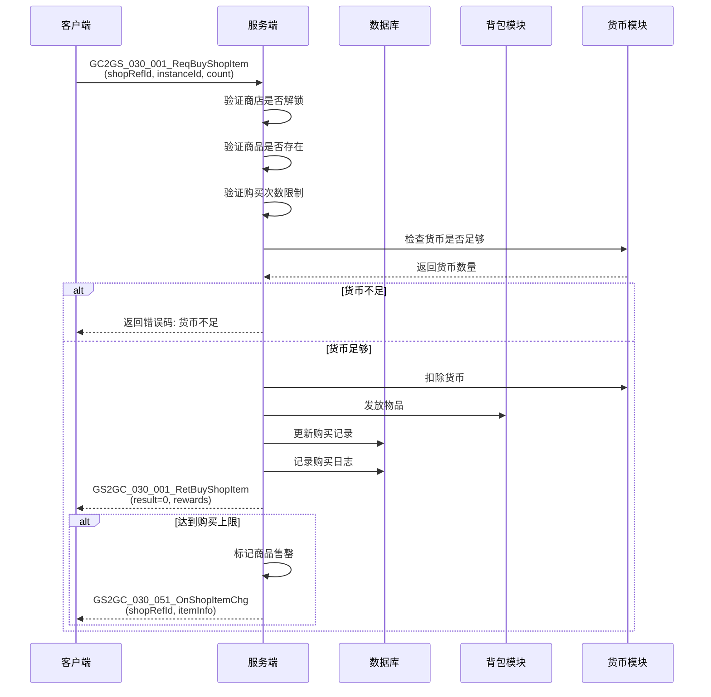
```mermaid
sequenceDiagram
    participant C as 客户端
    participant S as 服务端
    participant DB as 数据库
    participant Bag as 背包模块
    participant Currency as 货币模块

    C->>S: GC2GS_030_001_ReqBuyShopItem<br/>(shopRefId, instanceId, count)

    S->>S: 验证商店是否解锁
    S->>S: 验证商品是否存在
    S->>S: 验证购买次数限制

    S->>Currency: 检查货币是否足够
    Currency-->>S: 返回货币数量

    alt 货币不足
        S-->>C: 返回错误码: 货币不足
    else 货币足够
        S->>Currency: 扣除货币
        S->>Bag: 发放物品
        S->>DB: 更新购买记录
        S->>DB: 记录购买日志

        S-->>C: GS2GC_030_001_RetBuyShopItem<br/>(result=0, rewards)

        alt 达到购买上限
            S->>S: 标记商品售罄
            S-->>C: GS2GC_030_051_OnShopItemChg<br/>(shopRefId, itemInfo)
        end
    end
```

### 5.2 商店刷新完整流程

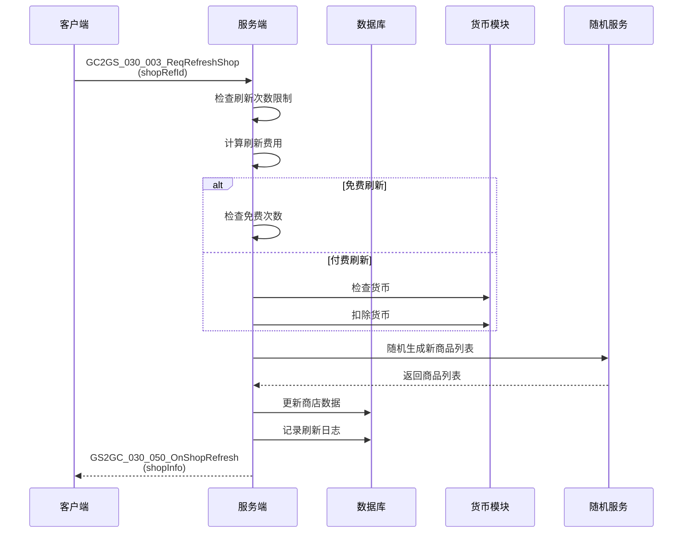
```mermaid
sequenceDiagram
    participant C as 客户端
    participant S as 服务端
    participant DB as 数据库
    participant Currency as 货币模块
    participant Random as 随机服务

    C->>S: GC2GS_030_003_ReqRefreshShop<br/>(shopRefId)

    S->>S: 检查刷新次数限制
    S->>S: 计算刷新费用

    alt 免费刷新
        S->>S: 检查免费次数
    else 付费刷新
        S->>Currency: 检查货币
        S->>Currency: 扣除货币
    end

    S->>Random: 随机生成新商品列表
    Random-->>S: 返回商品列表

    S->>DB: 更新商店数据
    S->>DB: 记录刷新日志

    S-->>C: GS2GC_030_050_OnShopRefresh<br/>(shopInfo)
```

### 5.3 自动刷新定时流程

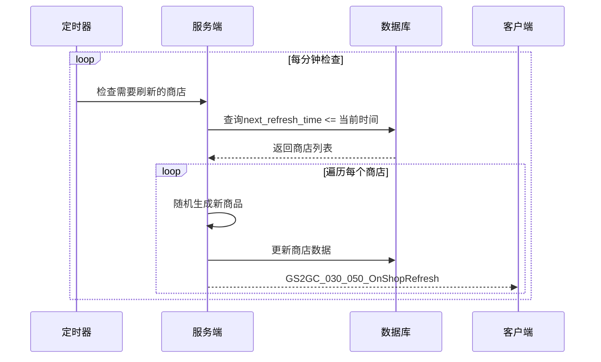
```mermaid
sequenceDiagram
    participant Timer as 定时器
    participant S as 服务端
    participant DB as 数据库
    participant C as 客户端

    loop 每分钟检查
        Timer->>S: 检查需要刷新的商店
        S->>DB: 查询next_refresh_time <= 当前时间
        DB-->>S: 返回商店列表

        loop 遍历每个商店
            S->>S: 随机生成新商品
            S->>DB: 更新商店数据
            S-->>C: GS2GC_030_050_OnShopRefresh
        end
    end
```

### 5.4 礼包购买流程

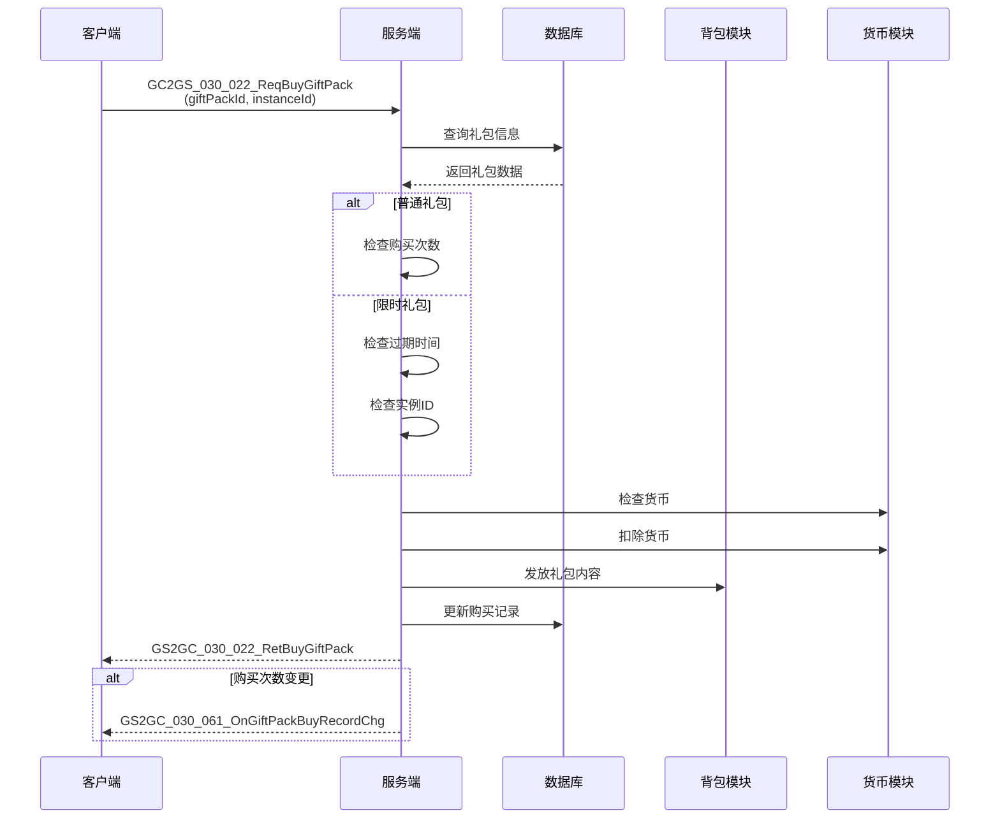
```mermaid
sequenceDiagram
    participant C as 客户端
    participant S as 服务端
    participant DB as 数据库
    participant Bag as 背包模块
    participant Currency as 货币模块

    C->>S: GC2GS_030_022_ReqBuyGiftPack<br/>(giftPackId, instanceId)

    S->>DB: 查询礼包信息
    DB-->>S: 返回礼包数据

    alt 普通礼包
        S->>S: 检查购买次数
    else 限时礼包
        S->>S: 检查过期时间
        S->>S: 检查实例ID
    end

    S->>Currency: 检查货币
    S->>Currency: 扣除货币
    S->>Bag: 发放礼包内容
    S->>DB: 更新购买记录

    S-->>C: GS2GC_030_022_RetBuyGiftPack

    alt 购买次数变更
        S-->>C: GS2GC_030_061_OnGiftPackBuyRecordChg
    end
```

### 5.5 限时礼包触发流程

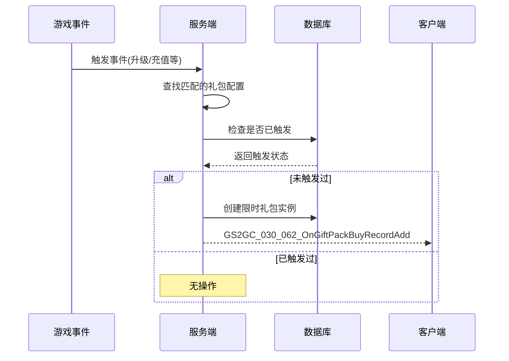
```mermaid
sequenceDiagram
    participant Game as 游戏事件
    participant S as 服务端
    participant DB as 数据库
    participant C as 客户端

    Game->>S: 触发事件(升级/充值等)
    S->>S: 查找匹配的礼包配置
    S->>DB: 检查是否已触发
    DB-->>S: 返回触发状态

    alt 未触发过
        S->>DB: 创建限时礼包实例
        S-->>C: GS2GC_030_062_OnGiftPackBuyRecordAdd
    else 已触发过
        Note over S: 无操作
    end
```

---

## 六、协议错误码

### 6.1 商店模块错误码定义

| 错误码 | 常量名 | 说明 | 触发场景 | 用户提示 |
|--------|--------|------|----------|----------|
| 30001 | SHOP_NOT_FOUND | 商店不存在 | 查询商店时 | "商店不存在" |
| 30002 | SHOP_NOT_UNLOCKED | 商店未解锁 | 访问商店时 | "商店尚未解锁" |
| 30003 | ITEM_NOT_FOUND | 商品不存在 | 查询商品时 | "商品不存在" |
| 30004 | ITEM_SOLD_OUT | 商品已售罄 | 购买商品时 | "商品已售罄" |
| 30005 | BUY_LIMIT_REACHED | 购买次数已达上限 | 购买商品/礼包时 | "购买次数已达上限" |
| 30006 | CURRENCY_NOT_ENOUGH | 货币不足 | 扣除货币时 | "货币不足" |
| 30007 | BAG_FULL | 背包已满 | 发放物品时 | "背包已满" |
| 30008 | REFRESH_LIMIT_REACHED | 刷新次数已达上限 | 刷新商店时 | "今日刷新次数已用完" |
| 30009 | GIFT_PACK_NOT_FOUND | 礼包不存在 | 查询礼包时 | "礼包不存在" |
| 30010 | GIFT_PACK_EXPIRED | 礼包已过期 | 购买限时礼包时 | "礼包已过期" |
| 30011 | GIFT_PACK_OFF_SHELF | 礼包已下架 | 购买礼包时 | "礼包已下架" |
| 30012 | SHOP_REFRESH_ERROR | 商店刷新失败 | 刷新商店时 | "刷新失败，请重试" |
| 30013 | FREE_REFRESH_USED | 免费次数已用完 | 免费刷新时 | "免费刷新次数已用完" |
| 30014 | SHOP_CLOSED | 商店已关闭 | 访问商店时 | "商店已关闭" |
| 30015 | INVALID_COUNT | 无效数量 | 购买数量不合法时 | "购买数量无效" |

### 6.2 错误码分类

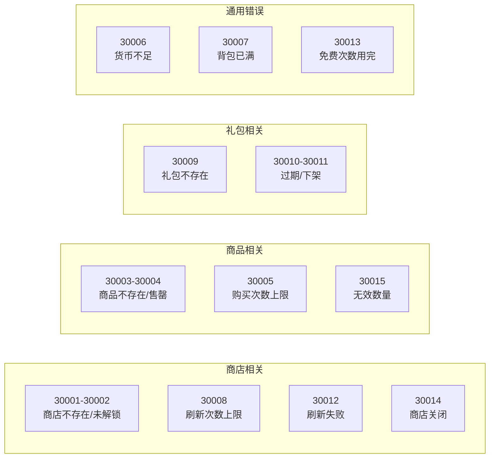
```mermaid
graph LR
    subgraph 商店相关
        A[30001-30002<br/>商店不存在/未解锁]
        B[30008<br/>刷新次数上限]
        C[30012<br/>刷新失败]
        D[30014<br/>商店关闭]
    end

    subgraph 商品相关
        E[30003-30004<br/>商品不存在/售罄]
        F[30005<br/>购买次数上限]
        G[30015<br/>无效数量]
    end

    subgraph 礼包相关
        H[30009<br/>礼包不存在]
        I[30010-30011<br/>过期/下架]
    end

    subgraph 通用错误
        J[30006<br/>货币不足]
        K[30007<br/>背包已满]
        L[30013<br/>免费次数用完]
    end
```

### 6.3 错误处理流程

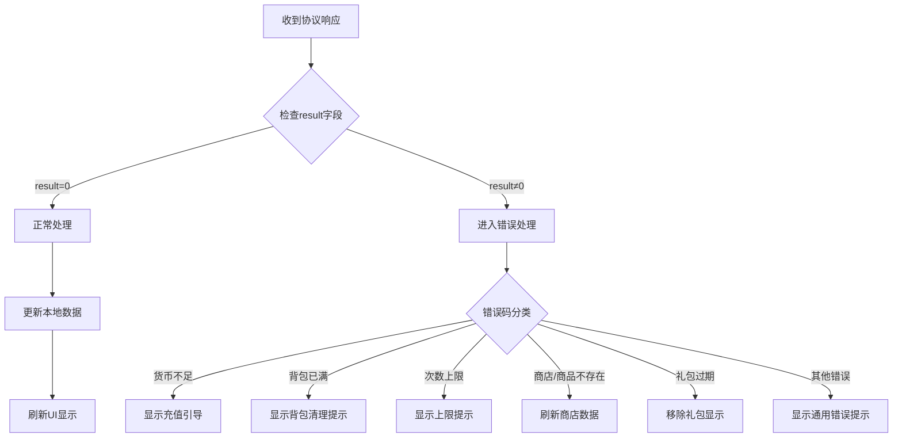
```mermaid
flowchart TD
    A[收到协议响应] --> B{检查result字段}
    B -->|result=0| C[正常处理]
    B -->|result≠0| D[进入错误处理]

    D --> E{错误码分类}
    E -->|货币不足| F[显示充值引导]
    E -->|背包已满| G[显示背包清理提示]
    E -->|次数上限| H[显示上限提示]
    E -->|商店/商品不存在| I[刷新商店数据]
    E -->|礼包过期| J[移除礼包显示]
    E -->|其他错误| K[显示通用错误提示]

    C --> L[更新本地数据]
    L --> M[刷新UI显示]
```

---

## 七、协议安全机制

### 7.1 请求频率限制

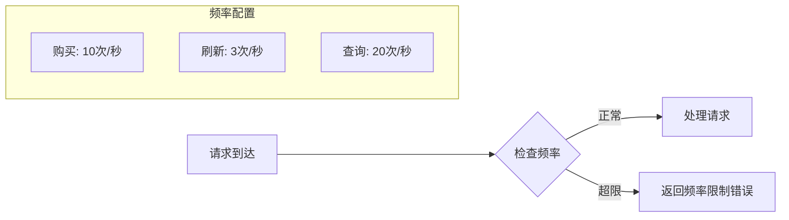
```mermaid
flowchart LR
    A[请求到达] --> B{检查频率}
    B -->|正常| C[处理请求]
    B -->|超限| D[返回频率限制错误]

    subgraph 频率配置
        E["购买: 10次/秒"]
        F["刷新: 3次/秒"]
        G["查询: 20次/秒"]
    end
```

| 协议类型 | 频率限制 | 限制策略 | 超限处理 |
|----------|----------|----------|----------|
| 购买商品 | 10次/秒 | 滑动窗口 | 返回"操作过于频繁" |
| 刷新商店 | 3次/秒 | 滑动窗口 | 返回"操作过于频繁" |
| 购买礼包 | 5次/秒 | 滑动窗口 | 返回"操作过于频繁" |
| 查询信息 | 20次/秒 | 滑动窗口 | 返回"请稍后重试" |

### 7.2 参数校验规则

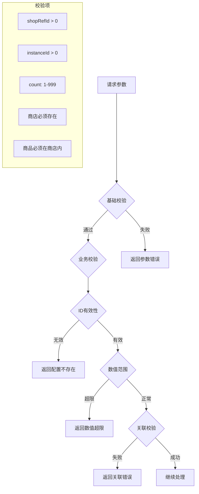
```mermaid
flowchart TD
    A[请求参数] --> B{基础校验}
    B -->|通过| C{业务校验}
    B -->|失败| D[返回参数错误]

    C --> E{ID有效性}
    E -->|无效| F[返回配置不存在]
    E -->|有效| G{数值范围}
    G -->|超限| H[返回数值超限]
    G -->|正常| I{关联校验}
    I -->|失败| J[返回关联错误]
    I -->|成功| K[继续处理]

    subgraph 校验项
        L["shopRefId > 0"]
        M["instanceId > 0"]
        N["count: 1-999"]
        O["商店必须存在"]
        P["商品必须在商店内"]
    end
```

### 7.3 幂等性设计

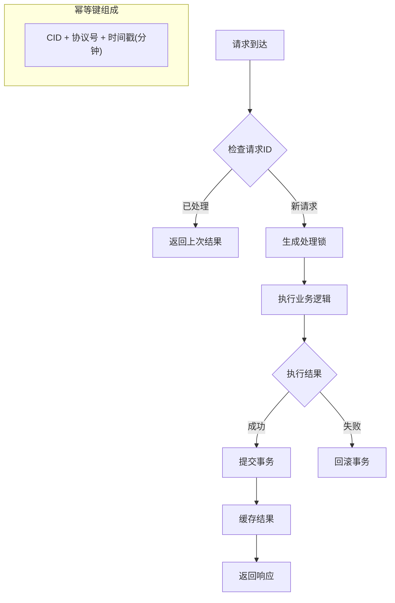
```mermaid
flowchart TD
    A[请求到达] --> B{检查请求ID}
    B -->|已处理| C[返回上次结果]
    B -->|新请求| D[生成处理锁]

    D --> E[执行业务逻辑]
    E --> F{执行结果}
    F -->|成功| G[提交事务]
    F -->|失败| H[回滚事务]

    G --> I[缓存结果]
    I --> J[返回响应]

    subgraph 幂等键组成
        K["CID + 协议号 + 时间戳(分钟)"]
    end
```

---

## 八、客户端协议封装

### 8.1 协议发送器

```csharp
// GSWriter_030_ShopOp.cs - 协议发送封装
public static class GSWriter_030_ShopOp
{
    /// <summary>
    /// 购买商品
    /// </summary>
    public static GC2GS_030_001_ReqBuyShopItem make_001_ReqBuyShopItem(
        long shopRefId, long instanceId, int count)
    {
        GC2GS_030_001_ReqBuyShopItem req = new GC2GS_030_001_ReqBuyShopItem();
        req.setShopRefId(shopRefId);
        req.setInstanceId(instanceId);
        req.setCount(count);
        return req;
    }

    /// <summary>
    /// 免费刷新商店
    /// </summary>
    public static GC2GS_030_002_ReqFreeRefreshShop make_002_ReqFreeRefreshShop(
        long shopRefId)
    {
        GC2GS_030_002_ReqFreeRefreshShop req = new GC2GS_030_002_ReqFreeRefreshShop();
        req.setShopRefId(shopRefId);
        return req;
    }

    /// <summary>
    /// 付费刷新商店
    /// </summary>
    public static GC2GS_030_003_ReqRefreshShop make_003_ReqRefreshShop(
        long shopRefId)
    {
        GC2GS_030_003_ReqRefreshShop req = new GC2GS_030_003_ReqRefreshShop();
        req.setShopRefId(shopRefId);
        return req;
    }

    /// <summary>
    /// 自动刷新商店
    /// </summary>
    public static GC2GS_030_004_ReqAutoRefreshShop make_004_ReqAutoRefreshShop(
        long shopRefId)
    {
        GC2GS_030_004_ReqAutoRefreshShop req = new GC2GS_030_004_ReqAutoRefreshShop();
        req.setShopRefId(shopRefId);
        return req;
    }

    /// <summary>
    /// 获取商店信息
    /// </summary>
    public static GC2GS_030_005_ReqShopInfo make_005_ReqShopInfo(
        long shopRefId)
    {
        GC2GS_030_005_ReqShopInfo req = new GC2GS_030_005_ReqShopInfo();
        req.setShopRefId(shopRefId);
        return req;
    }

    /// <summary>
    /// 获取商店列表
    /// </summary>
    public static GC2GS_030_006_ReqShopList make_006_ReqShopList(
        int shopType)
    {
        GC2GS_030_006_ReqShopList req = new GC2GS_030_006_ReqShopList();
        req.setShopType(shopType);
        return req;
    }

    /// <summary>
    /// 购买礼包
    /// </summary>
    public static GC2GS_030_022_ReqBuyGiftPack make_022_ReqBuyGiftPack(
        long giftPackId, long instanceId)
    {
        GC2GS_030_022_ReqBuyGiftPack req = new GC2GS_030_022_ReqBuyGiftPack();
        req.setGiftPackId(giftPackId);
        req.setInstanceId(instanceId);
        return req;
    }
}
```

### 8.2 组件封装调用

```csharp
// NPPlayerShopComponent.cs - 组件层封装
public partial class NPPlayerShopComponent : _ANPBasicPlayerComponent
{
    /// <summary>
    /// 购买商品
    /// </summary>
    public void reqBuyShopItem(long _shopId, long _instanceId, int _count, Action _backAction = null)
    {
        NPGSClientListener.sendRequestByLog(
            GSWriter_030_ShopOp.make_001_ReqBuyShopItem(_shopId, _instanceId, _count),
            new CommonErrCodeRequestCallbackProtocolDealer<GS2GC_030_001_RetBuyShopItem>((info) =>
            {
                WinMsg.SendMsg(WinMsgType.SHOP_ITEM_CHG, _instanceId);
                _backAction?.Invoke();
            }));
    }

    /// <summary>
    /// 免费刷新
    /// </summary>
    public void reqFreeRefreshShop(long _shopId, Action _backAction = null)
    {
        NPGSClientListener.sendRequestByLog(
            GSWriter_030_ShopOp.make_002_ReqFreeRefreshShop(_shopId),
            new CommonErrCodeRequestCallbackProtocolDealer<GS2GC_030_002_RetFreeRefreshShop>((info) =>
            {
                _backAction?.Invoke();
            }));
    }

    /// <summary>
    /// 付费刷新
    /// </summary>
    public void reqRefreshShop(long _shopId, Action _backAction = null)
    {
        NPGSClientListener.sendRequestByLog(
            GSWriter_030_ShopOp.make_003_ReqRefreshShop(_shopId),
            new CommonErrCodeRequestCallbackProtocolDealer<GS2GC_030_003_RetRefreshShop>((info) =>
            {
                _backAction?.Invoke();
            }));
    }

    /// <summary>
    /// 自动刷新
    /// </summary>
    public void reqAutoRefreshShop(long _shopId, Action _backAction = null)
    {
        NPGSClientListener.sendRequestByLog(
            GSWriter_030_ShopOp.make_004_ReqAutoRefreshShop(_shopId),
            new CommonErrCodeRequestCallbackProtocolDealer<GS2GC_030_004_RetAutoRefreshShop>((info) =>
            {
                _backAction?.Invoke();
            }));
    }

    /// <summary>
    /// 获取商店信息
    /// </summary>
    public void reqShopInfo(long _shopId, Action<Shop_Info> _backAction = null)
    {
        NPGSClientListener.sendRequestByLog(
            GSWriter_030_ShopOp.make_005_ReqShopInfo(_shopId),
            new CommonErrCodeRequestCallbackProtocolDealer<GS2GC_030_005_RetShopInfo>((info) =>
            {
                _backAction?.Invoke(info.getShopInfo());
            }));
    }

    /// <summary>
    /// 获取商店列表
    /// </summary>
    public void reqShopList(int _shopType, Action<List<Shop_Info>> _backAction = null)
    {
        NPGSClientListener.sendRequestByLog(
            GSWriter_030_ShopOp.make_006_ReqShopList(_shopType),
            new CommonErrCodeRequestCallbackProtocolDealer<GS2GC_030_006_RetShopList>((info) =>
            {
                _backAction?.Invoke(info.getShopList());
            }));
    }

    /// <summary>
    /// 购买礼包
    /// </summary>
    public void reqBuyGiftPack(long _giftPackId, long _instanceId, Action _backAction = null)
    {
        NPGSClientListener.sendRequestByLog(
            GSWriter_030_ShopOp.make_022_ReqBuyGiftPack(_giftPackId, _instanceId),
            new CommonErrCodeRequestCallbackProtocolDealer<GS2GC_030_022_RetBuyGiftPack>((info) =>
            {
                _backAction?.Invoke();
            }));
    }
}
```

### 8.3 监听器注册

```csharp
// 协议监听器注册
public void RegisterShopProtocolListeners()
{
    // 商店刷新推送
    NPGSClientListener.registSubDealer(
        new GSSubDealer_030_050_OnShopRefresh());

    // 商品变更推送
    NPGSClientListener.registSubDealer(
        new GSSubDealer_030_051_OnShopItemChg());

    // 礼包相关推送
    NPGSClientListener.registSubDealer(
        new GSSubDealer_030_060_OnGiftPackRefresh());
    NPGSClientListener.registSubDealer(
        new GSSubDealer_030_061_OnGiftPackBuyRecordChg());
    NPGSClientListener.registSubDealer(
        new GSSubDealer_030_062_OnGiftPackBuyRecordAdd());
    NPGSClientListener.registSubDealer(
        new GSSubDealer_030_063_OnGiftPackBuyRecordRemove());
}
```

---

## 九、协议监控与日志

### 9.1 协议监控指标

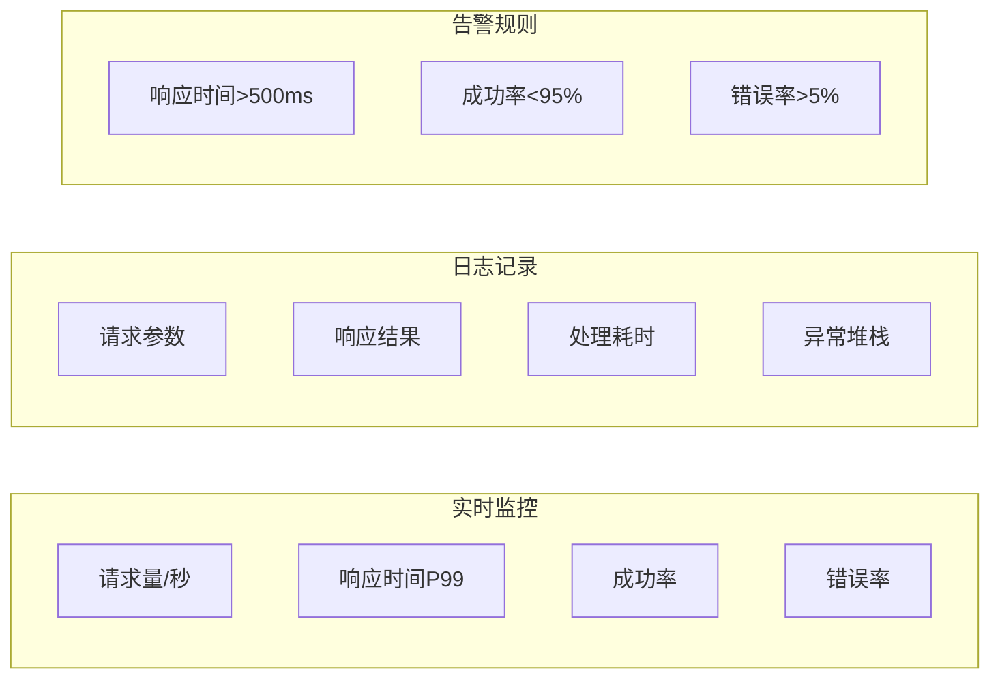
```mermaid
graph LR
    subgraph 实时监控
        A[请求量/秒]
        B[响应时间P99]
        C[成功率]
        D[错误率]
    end

    subgraph 日志记录
        E[请求参数]
        F[响应结果]
        G[处理耗时]
        H[异常堆栈]
    end

    subgraph 告警规则
        I[响应时间>500ms]
        J[成功率<95%]
        K[错误率>5%]
    end
```

### 9.2 协议日志格式

```json
{
  "timestamp": "2026-04-11T10:30:00.000Z",
  "protocol": "GC2GS_030_001_ReqBuyShopItem",
  "mainOrder": 30,
  "subOrder": 1,
  "cid": 12345678,
  "request": {
    "shopRefId": 1001,
    "instanceId": 98765432,
    "count": 1
  },
  "response": {
    "result": 0,
    "costValue": 400,
    "rewards": [...]
  },
  "duration": 45,
  "serverIp": "192.168.1.100"
}
```

### 9.3 关键指标监控

| 指标名称 | 计算方式 | 告警阈值 | 说明 |
|----------|----------|----------|------|
| 购买成功率 | 成功数/总请求数 | <95% | 核心业务指标 |
| 平均响应时间 | 总耗时/请求数 | >200ms | 性能指标 |
| P99响应时间 | 第99百分位耗时 | >500ms | 极端情况监控 |
| 错误率 | 错误数/总请求数 | >5% | 稳定性指标 |

---

## 十、协议版本兼容

### 10.1 版本兼容策略

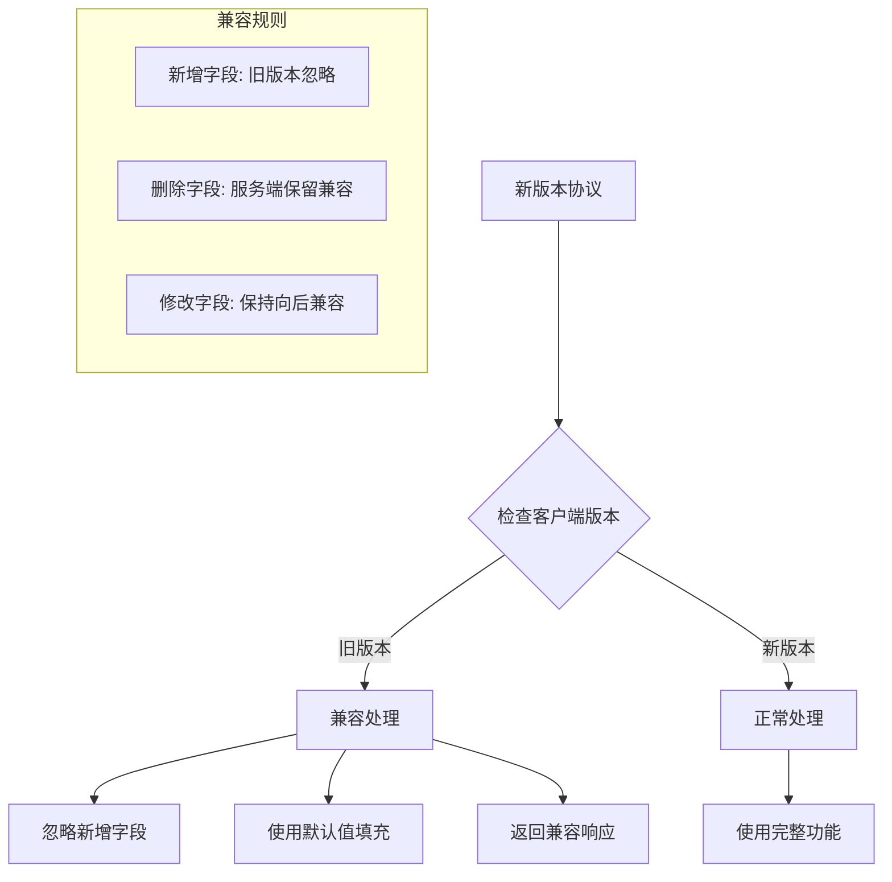
```mermaid
flowchart TD
    A[新版本协议] --> B{检查客户端版本}
    B -->|旧版本| C[兼容处理]
    B -->|新版本| D[正常处理]

    C --> E[忽略新增字段]
    C --> F[使用默认值填充]
    C --> G[返回兼容响应]

    D --> H[使用完整功能]

    subgraph 兼容规则
        I["新增字段: 旧版本忽略"]
        J["删除字段: 服务端保留兼容"]
        K["修改字段: 保持向后兼容"]
    end
```

### 10.2 协议升级指南

| 升级类型 | 兼容性 | 处理方式 |
|----------|--------|----------|
| 新增字段 | 向后兼容 | 旧版本忽略，新版本使用 |
| 新增协议 | 向后兼容 | 旧版本不调用，新版本使用 |
| 删除字段 | 不兼容 | 需要强制更新 |
| 修改字段类型 | 不兼容 | 需要强制更新 |

---

---

## 十一、协议详细字段说明

### 11.1 Shop_Info 完整字段

**路径**: `ClientProtocol/Common/ShopObj/Shop_Info.cs`

| 字段名 | 类型 | 必填 | 默认值 | 说明 |
|--------|------|------|--------|------|
| shopRefId | long | 是 | 0 | 商店配置ID，对应RefShop.id |
| nextRefreshTimeMs | long | 是 | 0 | 下次自动刷新时间戳（毫秒），0表示无自动刷新 |
| refreshNum | int | 是 | 0 | 今日已付费刷新次数 |
| goodsList | List\<Shop_ItemInfo\> | 是 | null | 商品列表，最多20个 |

**字段联动关系**:
- `nextRefreshTimeMs` 与 `RefShop.auto_refresh_time_list` 联动
- `refreshNum` 每日0点重置

```csharp
// 客户端解析示例
public void ParseShopInfo(Shop_Info info)
{
    long shopRefId = info.getShopRefId();
    long nextRefresh = info.getNextRefreshTimeMs();
    int refreshCount = info.getRefreshNum();
    List<Shop_ItemInfo> goods = info.getGoodsList();

    // 计算距离刷新的剩余时间
    long remainMs = nextRefresh - FpsAndPingMgr.instance.serverTimeTag;
    if (remainMs < 0) remainMs = 0;
}
```

### 11.2 Shop_ItemInfo 完整字段

**路径**: `ClientProtocol/Common/ShopObj/Shop_ItemInfo.cs`

| 字段名 | 类型 | 必填 | 默认值 | 说明 |
|--------|------|------|--------|------|
| instanceId | long | 是 | 0 | 商品实例ID（服务端生成，唯一标识） |
| shopItemRefId | long | 是 | 0 | 商品配置ID，对应RefShopItem.id |
| hasBuyNum | long | 是 | 0 | 已购买次数（累计） |
| discountRefId | long | 否 | 0 | 折扣配置ID，对应RefShopItemDiscount.id |
| shopItemGroupId | long | 否 | 0 | 商品组ID，对应RefShopItemGroup.id |
| canBuyNum | long | 是 | 0 | 可购买次数上限（0表示无限制） |

**字段联动关系**:
- `instanceId` 用于购买请求，每次刷新重新生成
- `discountRefId > 0` 表示有折扣
- `canBuyNum > 0 && hasBuyNum >= canBuyNum` 表示售罄

```csharp
// 客户端解析示例
public void ParseShopItem(Shop_ItemInfo item)
{
    long instanceId = item.getInstanceId();      // 购买时需要传这个
    long refId = item.getShopItemRefId();       // 商品配置ID
    long bought = item.getHasBuyNum();          // 已购买次数
    long limit = item.getCanBuyNum();           // 购买上限
    long discountId = item.getDiscountRefId();  // 折扣ID

    // 计算剩余可购买次数
    long remaining = limit > 0 ? limit - bought : -1; // -1表示无限制

    // 检查是否售罄
    bool isSoldOut = limit > 0 && remaining <= 0;
}
```

### 11.3 GiftPack_Info 完整字段

**路径**: `ClientProtocol/Common/ShopObj/GiftPack_Info.cs`

| 字段名 | 类型 | 必填 | 默认值 | 说明 |
|--------|------|------|--------|------|
| giftPackRefId | long | 是 | 0 | 礼包配置ID，对应RefGiftPack.id |
| instanceId | long | 是 | 0 | 礼包实例ID（限时礼包需要） |
| buyCount | int | 是 | 0 | 已购买次数 |
| expireTimeMs | long | 否 | 0 | 过期时间戳（毫秒），0表示永久 |
| status | int | 是 | 0 | 状态：0可购买，1已购买，2已过期 |

**状态转换图**:

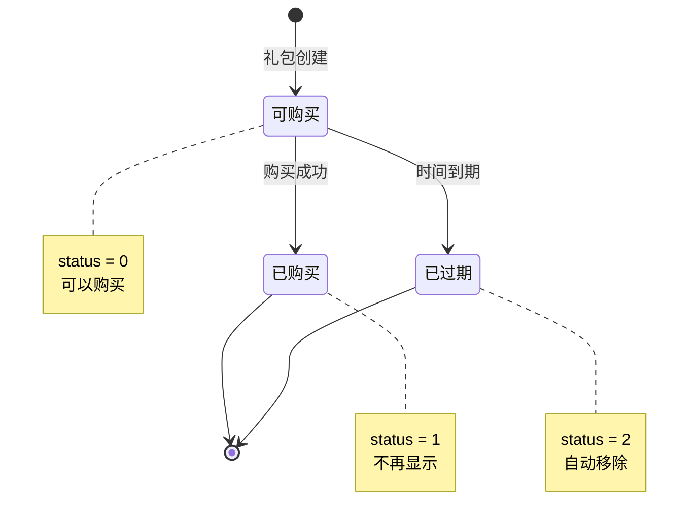
```mermaid
stateDiagram-v2
    [*] --> 可购买: 礼包创建
    可购买 --> 已购买: 购买成功
    可购买 --> 已过期: 时间到期
    已购买 --> [*]
    已过期 --> [*]

    note right of 可购买
        status = 0
        可以购买
    end note

    note right of 已购买
        status = 1
        不再显示
    end note

    note right of 已过期
        status = 2
        自动移除
    end note
```

---

## 十二、协议使用完整示例

### 12.1 商店初始化流程

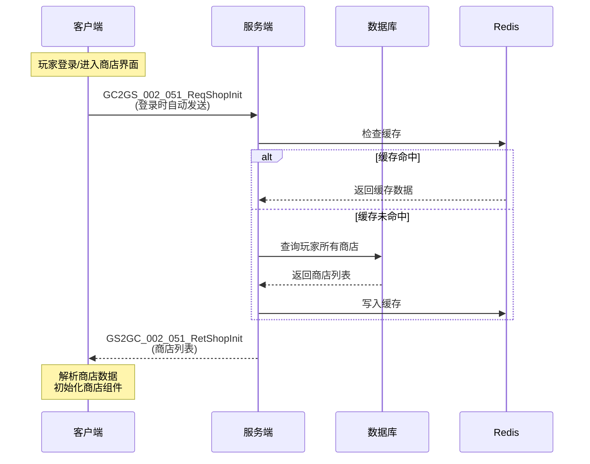
```mermaid
sequenceDiagram
    participant C as 客户端
    participant S as 服务端
    participant DB as 数据库
    participant Cache as Redis

    Note over C: 玩家登录/进入商店界面

    C->>S: GC2GS_002_051_ReqShopInit<br/>(登录时自动发送)
    S->>Cache: 检查缓存

    alt 缓存命中
        Cache-->>S: 返回缓存数据
    else 缓存未命中
        S->>DB: 查询玩家所有商店
        DB-->>S: 返回商店列表
        S->>Cache: 写入缓存
    end

    S-->>C: GS2GC_002_051_RetShopInit<br/>(商店列表)

    Note over C: 解析商店数据<br/>初始化商店组件
```

### 12.2 购买商品完整代码

```csharp
/// <summary>
/// 商店购买管理器
/// </summary>
public class ShopBuyManager
{
    /// <summary>
    /// 购买商品
    /// </summary>
    public void BuyItem(long shopId, long instanceId, int count)
    {
        // 1. 获取商品信息
        NPPlayerShop shop = NPPlayer.instance.shopComp.getShop(shopId);
        if (shop == null)
        {
            UIMessageBox.Show("商店不存在");
            return;
        }

        // 2. 查找商品
        List<NPPlayerShopItem> items = new List<NPPlayerShopItem>();
        shop.getShopItemList(items);
        NPPlayerShopItem item = items.FirstOrDefault(i => i.instanceId == instanceId);

        if (item == null)
        {
            UIMessageBox.Show("商品不存在");
            return;
        }

        // 3. 检查购买次数
        if (item.buyNumMax > 0 && item.lastBuyCount < count)
        {
            UIMessageBox.Show("购买次数超限");
            return;
        }

        // 4. 获取价格
        NPCommonCostItem costItem = item.getCostItem();
        long totalCost = costItem.count * count;

        // 5. 检查货币
        long playerHas = GCommon.getItemCount(costItem.item);
        if (playerHas < totalCost)
        {
            // 显示货币不足弹窗
            ShowCurrencyNotEnoughDialog(costItem.item.itemType, totalCost - playerHas);
            return;
        }

        // 6. 显示确认弹窗
        string itemName = GetItemName(item.gainItem);
        string message = $"确定花费 {totalCost} {GetCurrencyName(costItem.item)} 购买 {itemName} x{count}？";

        UIConfirmBox.Show(message, () =>
        {
            // 7. 发送购买请求
            NPPlayer.instance.shopComp.reqBuyShopItem(shopId, instanceId, count, () =>
            {
                // 8. 购买成功回调
                OnBuySuccess(item, count, totalCost);
            });
        });
    }

    /// <summary>
    /// 购买成功处理
    /// </summary>
    private void OnBuySuccess(NPPlayerShopItem item, int count, long cost)
    {
        // 显示成功提示
        UIMessageBox.Show($"购买成功，获得 {GetItemName(item.gainItem)} x{count}");

        // 播放音效
        AudioManager.PlaySound("buy_success");

        // 刷新UI
        WinMsg.SendMsg(WinMsgType.SHOP_ITEM_CHG, item.instanceId);
    }

    /// <summary>
    /// 显示货币不足弹窗
    /// </summary>
    private void ShowCurrencyNotEnoughDialog(ENPItemType currencyType, long needCount)
    {
        if (currencyType == ENPItemType.CURRENCY && needCount > 0)
        {
            // 钻石不足，跳转充值
            UIConfirmBox.Show("钻石不足，是否前往充值？", () =>
            {
                UIManager.OpenWindow<RechargeWindow>();
            });
        }
        else
        {
            UIMessageBox.Show("货币不足");
        }
    }
}
```

### 12.3 刷新商店完整代码

```csharp
/// <summary>
/// 商店刷新管理器
/// </summary>
public class ShopRefreshManager
{
    /// <summary>
    /// 刷新商店
    /// </summary>
    public void RefreshShop(long shopId)
    {
        NPPlayerShop shop = NPPlayer.instance.shopComp.getShop(shopId);
        if (shop == null)
        {
            UIMessageBox.Show("商店不存在");
            return;
        }

        // 检查刷新选项
        bool hasFreeRefresh = shop.freeRefreshCount > 0;
        bool canPayRefresh = shop.refreshCount < shop.refreshMaxCount;

        if (!hasFreeRefresh && !canPayRefresh)
        {
            UIMessageBox.Show("今日刷新次数已用完");
            return;
        }

        // 显示刷新选项
        if (hasFreeRefresh && canPayRefresh)
        {
            // 同时有免费和付费刷新，显示选择弹窗
            ShowRefreshOptions(shop);
        }
        else if (hasFreeRefresh)
        {
            // 只有免费刷新
            DoFreeRefresh(shopId);
        }
        else
        {
            // 只有付费刷新
            DoPayRefresh(shop);
        }
    }

    /// <summary>
    /// 显示刷新选项
    /// </summary>
    private void ShowRefreshOptions(NPPlayerShop shop)
    {
        NPCommonCostItem cost = shop.getRefreshCostItem();
        string payOption = cost != null ? $"钻石刷新 ({cost.count}钻石)" : "钻石刷新";

        UISelectionBox.Show("选择刷新方式", new string[] { "免费刷新", payOption }, (index) =>
        {
            if (index == 0)
            {
                DoFreeRefresh(shop.shopRefId);
            }
            else
            {
                DoPayRefresh(shop);
            }
        });
    }

    /// <summary>
    /// 执行免费刷新
    /// </summary>
    private void DoFreeRefresh(long shopId)
    {
        NPPlayer.instance.shopComp.reqFreeRefreshShop(shopId, () =>
        {
            UIMessageBox.Show("刷新成功");
            AudioManager.PlaySound("shop_refresh");
        });
    }

    /// <summary>
    /// 执行付费刷新
    /// </summary>
    private void DoPayRefresh(NPPlayerShop shop)
    {
        NPCommonCostItem cost = shop.getRefreshCostItem();
        if (cost == null)
        {
            UIMessageBox.Show("刷新配置错误");
            return;
        }

        long playerDiamond = GCommon.getItemCount(cost.item);
        if (playerDiamond < cost.count)
        {
            UIConfirmBox.Show("钻石不足，是否前往充值？", () =>
            {
                UIManager.OpenWindow<RechargeWindow>();
            });
            return;
        }

        UIConfirmBox.Show($"确定花费 {cost.count} 钻石刷新商店？", () =>
        {
            NPPlayer.instance.shopComp.reqRefreshShop(shop.shopRefId, () =>
            {
                UIMessageBox.Show("刷新成功");
                AudioManager.PlaySound("shop_refresh");
            });
        });
    }
}
```

---

## 十三、协议调试技巧

### 13.1 协议抓包分析

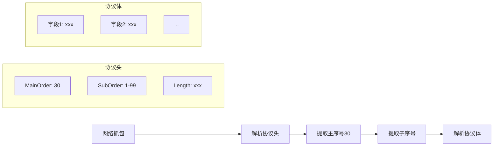
```mermaid
flowchart LR
    A[网络抓包] --> B[解析协议头]
    B --> C[提取主序号30]
    C --> D[提取子序号]
    D --> E[解析协议体]

    subgraph 协议头
        F["MainOrder: 30"]
        G["SubOrder: 1-99"]
        H["Length: xxx"]
    end

    subgraph 协议体
        I[字段1: xxx]
        J[字段2: xxx]
        K[...]
    end
```

### 13.2 常见协议错误排查

| 错误现象 | 可能原因 | 排查方法 |
|----------|----------|----------|
| 协议解析失败 | 版本不匹配 | 检查协议版本号 |
| 字段值异常 | 字节序错误 | 检查大小端配置 |
| 请求无响应 | 协议路由错误 | 检查主序号配置 |
| 响应数据错乱 | 字段类型错误 | 检查协议定义 |

### 13.3 协议测试用例

```java
/**
 * 商店协议测试用例
 */
@Test
public void testBuyShopItem()
{
    // 准备测试数据
    long cid = 123456L;
    long shopRefId = 1001L;
    long instanceId = generateInstanceId();
    int count = 1;

    // 构建请求
    GC2GS_030_001_ReqBuyShopItem req = new GC2GS_030_001_ReqBuyShopItem();
    req.setShopRefId(shopRefId);
    req.setInstanceId(instanceId);
    req.setCount(count);

    // 发送请求
    GS2GC_030_001_RetBuyShopItem res = sendRequest(req);

    // 验证响应
    assertEquals(0, res.getResult());
    assertEquals(count, res.getBuyCount());
    assertTrue(res.getRewardList().size() > 0);
}

@Test
public void testRefreshShop()
{
    // 准备测试数据
    long cid = 123456L;
    long shopRefId = 1001L;

    // 构建请求
    GC2GS_030_003_ReqRefreshShop req = new GC2GS_030_003_ReqRefreshShop();
    req.setShopRefId(shopRefId);

    // 发送请求
    GS2GC_030_003_RetRefreshShop res = sendRequest(req);

    // 验证响应
    assertEquals(0, res.getResult());
    assertNotNull(res.getShopInfo());
    assertTrue(res.getShopInfo().getGoodsList().size() > 0);
}
```

---

## 十四、协议扩展指南

### 14.1 新增协议步骤

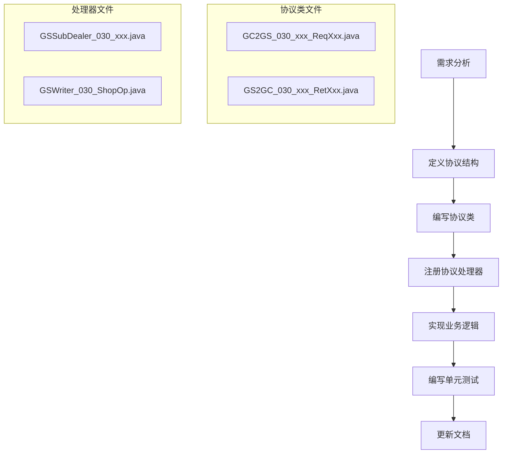
```mermaid
flowchart TD
    A[需求分析] --> B[定义协议结构]
    B --> C[编写协议类]
    C --> D[注册协议处理器]
    D --> E[实现业务逻辑]
    E --> F[编写单元测试]
    F --> G[更新文档]

    subgraph 协议类文件
        H["GC2GS_030_xxx_ReqXxx.java"]
        I["GS2GC_030_xxx_RetXxx.java"]
    end

    subgraph 处理器文件
        J["GSSubDealer_030_xxx.java"]
        K["GSWriter_030_ShopOp.java"]
    end
```

### 14.2 协议兼容性检查清单

- [ ] 新增字段放在协议末尾
- [ ] 新增字段有默认值
- [ ] 不修改已有字段类型
- [ ] 不删除已有字段
- [ ] 版本号正确更新

---

## 十五、协议性能优化指南

### 15.1 协议包大小优化

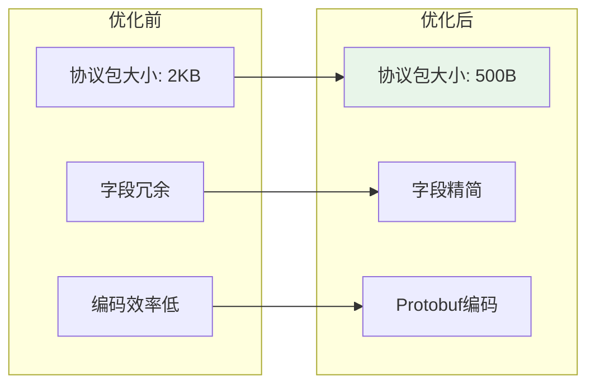
```mermaid
graph LR
    subgraph 优化前
        A1[协议包大小: 2KB]
        A2[字段冗余]
        A3[编码效率低]
    end

    subgraph 优化后
        B1[协议包大小: 500B]
        B2[字段精简]
        B3[Protobuf编码]
    end

    A1 --> B1
    A2 --> B2
    A3 --> B3

    style B1 fill:#e8f5e9
```

### 15.2 协议压缩策略

| 数据大小 | 压缩策略 | 压缩率 | CPU开销 |
|----------|----------|--------|---------|
| < 1KB | 不压缩 | 0% | 无 |
| 1KB - 10KB | LZ4快速压缩 | 40-60% | 低 |
| > 10KB | Zstd标准压缩 | 60-80% | 中 |

### 15.3 批量协议发送优化

```java
/**
 * 批量协议发送器
 */
public class BatchProtocolSender
{
    private static final int BATCH_SIZE = 100;
    private static final int BATCH_TIMEOUT_MS = 50;

    private Queue<ProtocolTask> taskQueue = new ConcurrentLinkedQueue<>();
    private ScheduledExecutorService scheduler;

    /**
     * 添加协议任务
     */
    public void addTask(long cid, Object protocol)
    {
        taskQueue.offer(new ProtocolTask(cid, protocol));

        if (taskQueue.size() >= BATCH_SIZE) {
            flushTasks();
        }
    }

    /**
     * 批量发送
     */
    private void flushTasks()
    {
        List<ProtocolTask> batch = new ArrayList<>();
        ProtocolTask task;
        while (batch.size() < BATCH_SIZE && (task = taskQueue.poll()) != null) {
            batch.add(task);
        }

        if (!batch.isEmpty()) {
            // 按cid分组发送
            Map<Long, List<Object>> groupedProtocols = batch.stream()
                .collect(Collectors.groupingBy(t -> t.cid,
                    Collectors.mapping(t -> t.protocol, Collectors.toList())));

            for (Map.Entry<Long, List<Object>> entry : groupedProtocols.entrySet()) {
                sendBatchProtocols(entry.getKey(), entry.getValue());
            }
        }
    }
}
```

---

## 十六、协议安全加固

### 16.1 协议加密方案

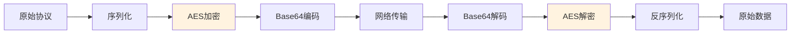
```mermaid
flowchart LR
    A[原始协议] --> B[序列化]
    B --> C[AES加密]
    C --> D[Base64编码]
    D --> E[网络传输]

    E --> F[Base64解码]
    F --> G[AES解密]
    G --> H[反序列化]
    H --> I[原始数据]

    style C fill:#fff3e0
    style G fill:#fff3e0
```

### 16.2 防重放攻击机制

```java
/**
 * 防重放攻击处理器
 */
public class ReplayAttackPreventer
{
    private static final int NONCE_EXPIRE_SECONDS = 60;
    private static final String NONCE_KEY_PREFIX = "protocol:nonce:";

    /**
     * 检查并记录Nonce
     */
    public boolean checkAndRecordNonce(long cid, long timestamp, String nonce)
    {
        // 检查时间戳有效性
        long currentTime = System.currentTimeMillis();
        if (Math.abs(currentTime - timestamp) > NONCE_EXPIRE_SECONDS * 1000) {
            return false;
        }

        // 检查Nonce是否已使用
        String key = NONCE_KEY_PREFIX + cid + ":" + nonce;
        if (RedisClient.exists(key)) {
            return false; // 重放攻击
        }

        // 记录Nonce
        RedisClient.setex(key, NONCE_EXPIRE_SECONDS, "1");
        return true;
    }

    /**
     * 生成Nonce
     */
    public String generateNonce()
    {
        return UUID.randomUUID().toString().replace("-", "");
    }
}
```

### 16.3 敏感数据脱敏

| 字段类型 | 脱敏规则 | 示例 |
|----------|----------|------|
| 玩家ID | 保留前3后4 | 123***4567 |
| 昵称 | 保留首字 | 张** |
| 金额 | 范围显示 | 1000-5000 |
| 时间戳 | 格式化 | 2026-04-11 |

---

## 十七、协议监控与告警

### 17.1 监控指标定义

```java
/**
 * 协议监控指标
 */
public class ProtocolMetrics
{
    // 请求计数器
    private Counter requestCounter;
    // 响应时间直方图
    private Histogram responseTimeHistogram;
    // 错误计数器
    private Counter errorCounter;

    /**
     * 记录协议请求
     */
    public void recordRequest(int mainOrder, int subOrder)
    {
        String metricName = String.format("protocol.%d.%d.request", mainOrder, subOrder);
        requestCounter.labels(metricName).inc();
    }

    /**
     * 记录响应时间
     */
    public void recordResponseTime(int mainOrder, int subOrder, long durationMs)
    {
        String metricName = String.format("protocol.%d.%d.duration", mainOrder, subOrder);
        responseTimeHistogram.labels(metricName).observe(durationMs);
    }

    /**
     * 记录错误
     */
    public void recordError(int mainOrder, int subOrder, int errorCode)
    {
        String metricName = String.format("protocol.%d.%d.error.%d", mainOrder, subOrder, errorCode);
        errorCounter.labels(metricName).inc();
    }
}
```

### 17.2 告警规则配置

```yaml
# prometheus/alert_rules.yml
groups:
  - name: protocol_alerts
    rules:
      # 响应时间告警
      - alert: ProtocolResponseTimeHigh
        expr: |
          histogram_quantile(0.99,
            sum(rate(protocol_duration_bucket[5m])) by (le, name)
          ) > 500
        for: 3m
        labels:
          severity: warning
        annotations:
          summary: "协议响应时间过高"
          description: "协议 {{ $labels.name }} P99响应时间超过500ms"

      # 错误率告警
      - alert: ProtocolErrorRateHigh
        expr: |
          sum(rate(protocol_error_total[5m])) by (name) /
          sum(rate(protocol_request_total[5m])) by (name) > 0.05
        for: 5m
        labels:
          severity: critical
        annotations:
          summary: "协议错误率过高"
          description: "协议 {{ $labels.name }} 错误率超过5%"
```

---

## 十八、协议测试指南

### 18.1 单元测试示例

```java
/**
 * 商店协议单元测试
 */
public class ShopProtocolTest
{
    @Test
    public void testBuyShopItem_Success()
    {
        // 准备测试数据
        long cid = 123456L;
        long shopRefId = 1001L;
        long instanceId = generateInstanceId();
        int count = 1;

        // 设置玩家货币
        setPlayerCurrency(cid, ECurrency.DIAMOND, 10000);

        // 发送请求
        GC2GS_030_001_ReqBuyShopItem req = new GC2GS_030_001_ReqBuyShopItem();
        req.setShopRefId(shopRefId);
        req.setInstanceId(instanceId);
        req.setCount(count);

        GS2GC_030_001_RetBuyShopItem res = sendRequest(cid, req);

        // 验证响应
        assertEquals(0, res.getResult());
        assertEquals(count, res.getBuyCount());
        assertTrue(res.getRewardList().size() > 0);
    }

    @Test
    public void testBuyShopItem_CurrencyNotEnough()
    {
        // 准备测试数据
        long cid = 123456L;
        long shopRefId = 1001L;
        long instanceId = generateInstanceId();

        // 设置货币不足
        setPlayerCurrency(cid, ECurrency.DIAMOND, 10);

        // 发送请求
        GC2GS_030_001_ReqBuyShopItem req = new GC2GS_030_001_ReqBuyShopItem();
        req.setShopRefId(shopRefId);
        req.setInstanceId(instanceId);
        req.setCount(1);

        GS2GC_030_001_RetBuyShopItem res = sendRequest(cid, req);

        // 验证错误码
        assertEquals(CommErr.CURRENCY_NOT_ENOUGH, res.getResult());
    }

    @Test
    public void testRefreshShop_FreeRefreshSuccess()
    {
        // 准备测试数据
        long cid = 123456L;
        long shopRefId = 1001L;

        // 设置免费刷新次数
        setFreeRefreshCount(cid, shopRefId, 1);

        // 发送请求
        GC2GS_030_002_ReqFreeRefreshShop req = new GC2GS_030_002_ReqFreeRefreshShop();
        req.setShopRefId(shopRefId);

        GS2GC_030_002_RetFreeRefreshShop res = sendRequest(cid, req);

        // 验证响应
        assertEquals(0, res.getResult());
        assertNotNull(res.getShopInfo());
        assertTrue(res.getShopInfo().getGoodsList().size() > 0);
    }
}
```

### 18.2 压力测试脚本

```python
#!/usr/bin/env python3
"""
商店协议压力测试脚本
"""
import asyncio
import time
from protocol_client import ProtocolClient

class ShopProtocolStressTest:
    def __init__(self, server_address, concurrent_users=100):
        self.server_address = server_address
        self.concurrent_users = concurrent_users
        self.results = []

    async def buy_item_test(self, user_id):
        """购买商品测试"""
        client = ProtocolClient(self.server_address)
        await client.connect()

        start_time = time.time()
        response = await client.send_buy_request(
            shop_id=1001,
            instance_id=generate_instance_id(),
            count=1
        )
        end_time = time.time()

        self.results.append({
            'user_id': user_id,
            'duration_ms': (end_time - start_time) * 1000,
            'success': response.result == 0
        })

        await client.disconnect()

    async def run_test(self, total_requests=1000):
        """运行压力测试"""
        tasks = []
        for i in range(total_requests):
            user_id = i % self.concurrent_users
            tasks.append(self.buy_item_test(user_id))

        start_time = time.time()
        await asyncio.gather(*tasks)
        total_time = time.time() - start_time

        # 分析结果
        success_count = sum(1 for r in self.results if r['success'])
        avg_duration = sum(r['duration_ms'] for r in self.results) / len(self.results)
        qps = total_requests / total_time

        print(f"总请求数: {total_requests}")
        print(f"成功数: {success_count}")
        print(f"成功率: {success_count / total_requests * 100:.2f}%")
        print(f"平均响应时间: {avg_duration:.2f}ms")
        print(f"QPS: {qps:.2f}")

if __name__ == '__main__':
    test = ShopProtocolStressTest('localhost:8080', concurrent_users=100)
    asyncio.run(test.run_test(total_requests=1000))
```

---

## 十九、协议文档自动生成

### 19.1 自动生成工具

```java
/**
 * 协议文档生成器
 */
public class ProtocolDocGenerator
{
    /**
     * 生成协议文档
     */
    public String generateProtocolDoc(Class<?> protocolClass)
    {
        StringBuilder doc = new StringBuilder();

        // 获取协议注解
        ProtocolDesc desc = protocolClass.getAnnotation(ProtocolDesc.class);
        if (desc != null) {
            doc.append("### ").append(desc.name()).append("\n\n");
            doc.append("**说明**: ").append(desc.description()).append("\n\n");
        }

        // 获取字段列表
        doc.append("#### 协议字段\n\n");
        doc.append("| 字段名 | 类型 | 说明 | 必填 |\n");
        doc.append("|--------|------|------|------|\n");

        for (Field field : protocolClass.getDeclaredFields()) {
            FieldDesc fieldDesc = field.getAnnotation(FieldDesc.class);
            if (fieldDesc != null) {
                doc.append("| ").append(field.getName()).append(" ");
                doc.append("| ").append(field.getType().getSimpleName()).append(" ");
                doc.append("| ").append(fieldDesc.description()).append(" ");
                doc.append("| ").append(fieldDesc.required() ? "是" : "否").append(" |\n");
            }
        }

        return doc.toString();
    }
}
```

---

## 二十、协议版本迁移指南

### 20.1 版本迁移流程

```mermaid
flowchart TD
    A[旧版协议] --> B{版本检测}
    B -->|兼容| C[正常处理]
    B -->|不兼容| D[协议转换]

    D --> E[字段映射]
    E --> F[默认值填充]
    F --> G[业务处理]

    C --> H[返回响应]
    G --> I[响应转换]
    I --> H

    subgraph 版本兼容层
        J[协议适配器]
        K[字段转换器]
        L[默认值处理器]
    end

    D --> J
    J --> K
    K --> L
```

### 20.2 迁移示例代码

```java
/**
 * 协议版本迁移处理器
 */
public class ProtocolMigrationHandler
{
    /**
     * 处理旧版协议
     */
    public Object handleLegacyProtocol(int version, Object legacyProtocol)
    {
        switch (version) {
            case 1:
                return migrateV1ToV2(legacyProtocol);
            case 2:
                return migrateV2ToV3(legacyProtocol);
            default:
                return legacyProtocol;
        }
    }

    /**
     * V1到V2迁移
     */
    private GC2GS_030_001_ReqBuyShopItem_V2 migrateV1ToV2(Object v1Protocol)
    {
        GC2GS_030_001_ReqBuyShopItem_V1 v1 = (GC2GS_030_001_ReqBuyShopItem_V1) v1Protocol;

        GC2GS_030_001_ReqBuyShopItem_V2 v2 = new GC2GS_030_001_ReqBuyShopItem_V2();
        v2.setShopRefId(v1.getShopId()); // 字段重命名
        v2.setInstanceId(v1.getItemId()); // 字段重命名
        v2.setCount(v1.getCount());
        v2.setClientTime(System.currentTimeMillis()); // 新增字段，填充默认值

        return v2;
    }
}
```

---

*文档生成时间: 2026-04-11*
*文档版本: v1.3.0*
