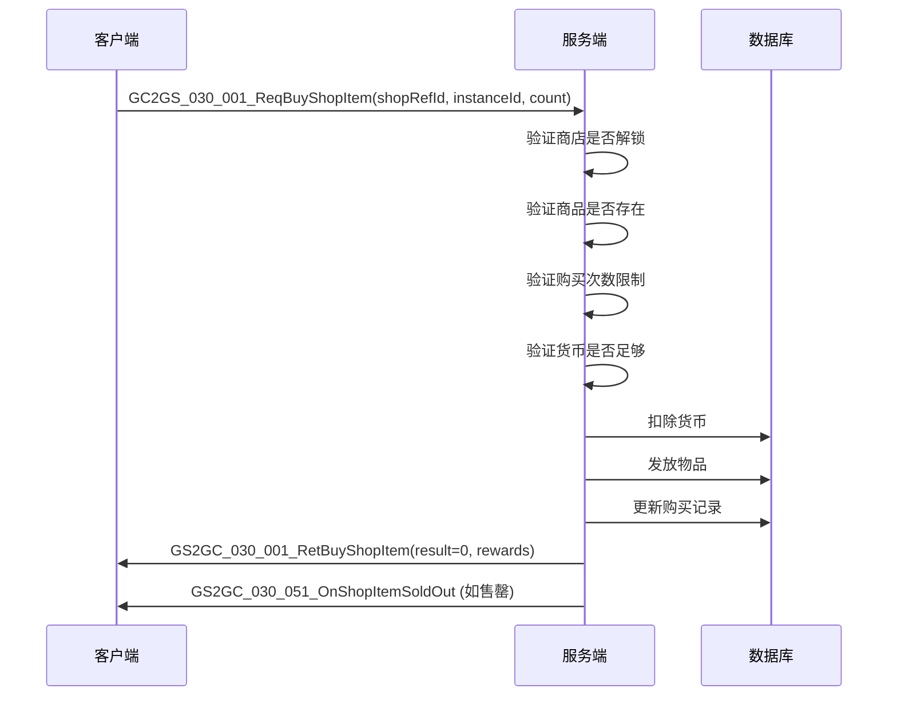
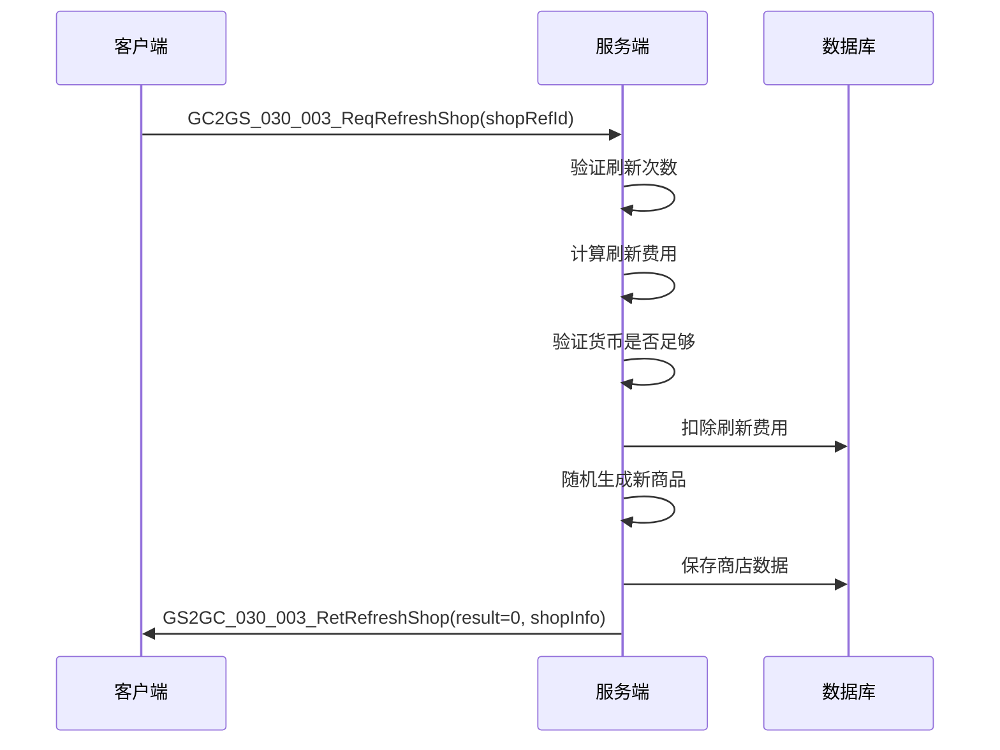
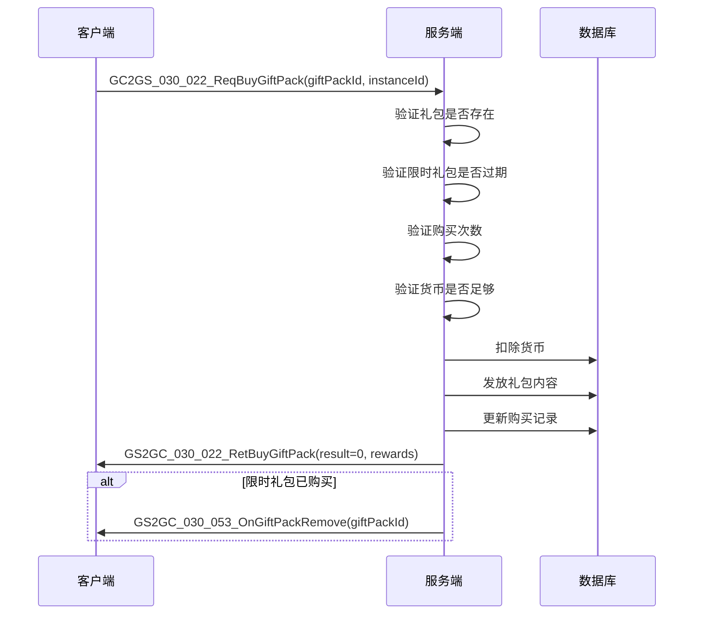
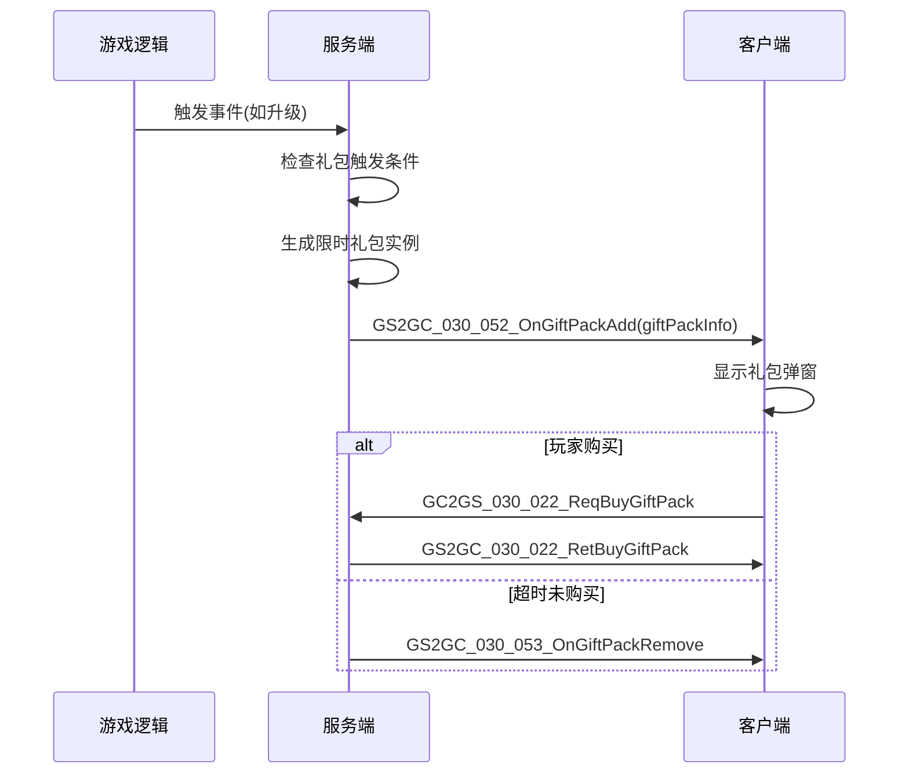
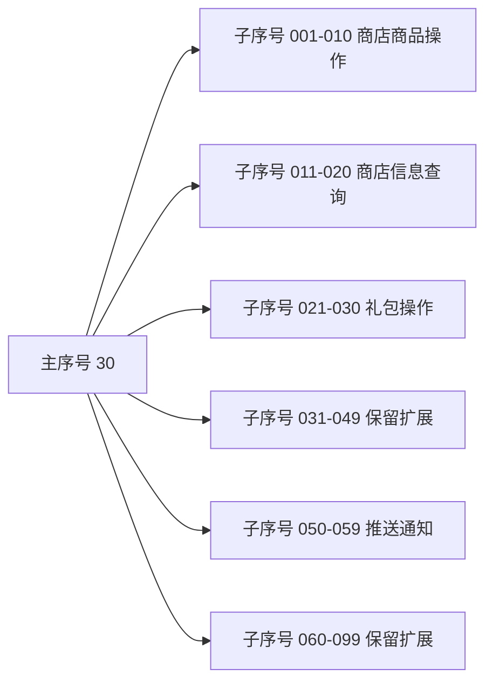

# 商店模块协议文档

## 协议模块编号: p030

**源码路径**:
- 客户端请求: `ClientProtocol/GC2GS/p030_ShopOp/`
- 服务端响应: `ClientProtocol/GS2GC/p030_ShopOp/`

---

## 一、协议总览

### 1.1 协议分类

| 分类 | 主序号 | 说明 |
|------|--------|------|
| 商店操作协议 | 30 | 商店购买/刷新/礼包相关操作 |

### 1.2 协议架构图

```mermaid
graph TB
    subgraph 客户端请求 GC2GS
        A1[001_ReqBuyShopItem 购买商品]
        A2[002_ReqFreeRefreshShop 免费刷新]
        A3[003_ReqRefreshShop 付费刷新]
        A4[004_ReqAutoRefreshShop 自动刷新]
        A5[005_ReqShopInfo 获取商店信息]
        A6[006_ReqShopList 获取商店列表]
        A7[021_ReqRefreshGiftPack 刷新礼包]
        A8[022_ReqBuyGiftPack 购买礼包]
        A9[023_ReqGiftPackList 礼包列表]
        A10[024_ReqLimitGiftPackList 限时礼包列表]
    end

    subgraph 服务端响应 GS2GC
        B1[001_RetBuyShopItem 购买结果]
        B2[002_RetFreeRefreshShop 免费刷新结果]
        B3[003_RetRefreshShop 付费刷新结果]
        B4[004_RetAutoRefreshShop 自动刷新结果]
        B5[005_RetShopInfo 商店信息]
        B6[006_RetShopList 商店列表]
        B7[021_RetRefreshGiftPack 礼包刷新结果]
        B8[022_RetBuyGiftPack 礼包购买结果]
        B9[050_OnShopRefresh 商店刷新推送]
        B10[051_OnShopItemSoldOut 商品售罄推送]
        B11[052_OnGiftPackAdd 礼包新增推送]
        B12[053_OnGiftPackRemove 礼包移除推送]
    end

    A1 --> B1
    A2 --> B2
    A3 --> B3
    A4 --> B4
    A5 --> B5
    A6 --> B6
    A7 --> B7
    A8 --> B8
```



---

## 二、请求协议 (GC2GS)

### 2.1 商品购买

#### GC2GS_030_001_ReqBuyShopItem - 购买商店商品
**主序号**: 30 | **子序号**: 1

| 字段名 | 类型 | 说明 | 必填 | 校验规则 |
|--------|------|------|------|----------|
| shopRefId | long | 商店配置ID | 是 | 必须为有效商店ID |
| instanceId | long | 商品实例ID | 是 | 必须存在于商店商品列表 |
| count | long | 购买数量 | 是 | 范围 1-999 |

**请求示例**:
```csharp
GC2GS_030_001_ReqBuyShopItem req = new GC2GS_030_001_ReqBuyShopItem();
req.setShopRefId(1001);
req.setInstanceId(123456789);
req.setCount(1);
// 发送请求
NetworkManager.Send(req);
```

---

### 2.2 商店刷新

#### GC2GS_030_002_ReqFreeRefreshShop - 免费刷新商店
**主序号**: 30 | **子序号**: 2

| 字段名 | 类型 | 说明 | 必填 | 校验规则 |
|--------|------|------|------|----------|
| shopRefId | long | 商店配置ID | 是 | 必须为有效商店ID |

**请求示例**:
```csharp
GC2GS_030_002_ReqFreeRefreshShop req = new GC2GS_030_002_ReqFreeRefreshShop();
req.setShopRefId(1001);
NetworkManager.Send(req);
```

#### GC2GS_030_003_ReqRefreshShop - 付费刷新商店
**主序号**: 30 | **子序号**: 3

| 字段名 | 类型 | 说明 | 必填 | 校验规则 |
|--------|------|------|------|----------|
| shopRefId | long | 商店配置ID | 是 | 必须为有效商店ID |

**请求示例**:
```csharp
GC2GS_030_003_ReqRefreshShop req = new GC2GS_030_003_ReqRefreshShop();
req.setShopRefId(1001);
NetworkManager.Send(req);
```

#### GC2GS_030_004_ReqAutoRefreshShop - 自动刷新商店
**主序号**: 30 | **子序号**: 4

| 字段名 | 类型 | 说明 | 必填 | 校验规则 |
|--------|------|------|------|----------|
| shopRefId | long | 商店配置ID | 是 | 必须为有效商店ID |

**说明**: 用于服务器定时刷新触发，客户端通常不直接调用。

---

### 2.3 商店信息查询

#### GC2GS_030_005_ReqShopInfo - 获取商店信息
**主序号**: 30 | **子序号**: 5

| 字段名 | 类型 | 说明 | 必填 | 校验规则 |
|--------|------|------|------|----------|
| shopRefId | long | 商店配置ID | 是 | 必须为有效商店ID |

**请求示例**:
```csharp
GC2GS_030_005_ReqShopInfo req = new GC2GS_030_005_ReqShopInfo();
req.setShopRefId(1001);
NetworkManager.Send(req);
```

#### GC2GS_030_006_ReqShopList - 获取商店列表
**主序号**: 30 | **子序号**: 6

| 字段名 | 类型 | 说明 | 必填 | 校验规则 |
|--------|------|------|------|----------|
| - | - | 无参数 | - | - |

**请求示例**:
```csharp
GC2GS_030_006_ReqShopList req = new GC2GS_030_006_ReqShopList();
NetworkManager.Send(req);
```

---

### 2.4 礼包操作

#### GC2GS_030_021_ReqRefreshGiftPack - 刷新礼包
**主序号**: 30 | **子序号**: 21

| 字段名 | 类型 | 说明 | 必填 | 校验规则 |
|--------|------|------|------|----------|
| - | - | 无参数 | - | - |

**说明**: 请求刷新可购买的礼包列表。

**请求示例**:
```csharp
GC2GS_030_021_ReqRefreshGiftPack req = new GC2GS_030_021_ReqRefreshGiftPack();
NetworkManager.Send(req);
```

#### GC2GS_030_022_ReqBuyGiftPack - 购买礼包
**主序号**: 30 | **子序号**: 22

| 字段名 | 类型 | 说明 | 必填 | 校验规则 |
|--------|------|------|------|----------|
| giftPackId | long | 礼包配置ID | 是 | 必须为有效礼包ID |
| instanceId | long | 礼包实例ID(限时礼包) | 否 | 限时礼包必填 |

**请求示例**:
```csharp
GC2GS_030_022_ReqBuyGiftPack req = new GC2GS_030_022_ReqBuyGiftPack();
req.setGiftPackId(30001);
req.setInstanceId(0); // 普通礼包传0
NetworkManager.Send(req);
```

#### GC2GS_030_023_ReqGiftPackList - 获取礼包列表
**主序号**: 30 | **子序号**: 23

| 字段名 | 类型 | 说明 | 必填 | 校验规则 |
|--------|------|------|------|----------|
| - | - | 无参数 | - | - |

#### GC2GS_030_024_ReqLimitGiftPackList - 获取限时礼包列表
**主序号**: 30 | **子序号**: 24

| 字段名 | 类型 | 说明 | 必填 | 校验规则 |
|--------|------|------|------|----------|
| - | - | 无参数 | - | - |

---

### 2.5 完整请求协议列表

| 协议名 | 主序号 | 子序号 | 说明 |
|--------|--------|--------|------|
| GC2GS_030_001_ReqBuyShopItem | 30 | 1 | 购买商店商品 |
| GC2GS_030_002_ReqFreeRefreshShop | 30 | 2 | 免费刷新商店 |
| GC2GS_030_003_ReqRefreshShop | 30 | 3 | 付费刷新商店 |
| GC2GS_030_004_ReqAutoRefreshShop | 30 | 4 | 自动刷新商店 |
| GC2GS_030_005_ReqShopInfo | 30 | 5 | 获取商店信息 |
| GC2GS_030_006_ReqShopList | 30 | 6 | 获取商店列表 |
| GC2GS_030_021_ReqRefreshGiftPack | 30 | 21 | 刷新礼包列表 |
| GC2GS_030_022_ReqBuyGiftPack | 30 | 22 | 购买礼包 |
| GC2GS_030_023_ReqGiftPackList | 30 | 23 | 获取礼包列表 |
| GC2GS_030_024_ReqLimitGiftPackList | 30 | 24 | 获取限时礼包列表 |
| GC2GS_030_025_ReqTriggerGiftPack | 30 | 25 | 触发礼包检查 |

---

## 三、响应协议 (GS2GC)

### 3.1 商品购买响应

#### GS2GC_030_001_RetBuyShopItem - 购买商品结果
**主序号**: 30 | **子序号**: 1

| 字段名 | 类型 | 说明 |
|--------|------|------|
| result | int | 结果码(0=成功) |
| shopRefId | long | 商店配置ID |
| instanceId | long | 商品实例ID |
| buyCount | int | 本次购买数量 |
| totalBuyCount | int | 累计购买数量 |
| costValue | long | 实际花费货币 |
| rewardList | NPCommon_ItemInfoList | 获得的物品列表 |

**响应示例**:
```csharp
// 接收到响应
GS2GC_030_001_RetBuyShopItem res = ...;
if (res.getResult() == 0) {
    int buyCount = res.getBuyCount();
    long costValue = res.getCostValue();
    List<NPCommon_ItemInfo> rewards = res.getRewardList();
    // 处理购买成功逻辑
}
```

---

### 3.2 商店刷新响应

#### GS2GC_030_002_RetFreeRefreshShop - 免费刷新结果
**主序号**: 30 | **子序号**: 2

| 字段名 | 类型 | 说明 |
|--------|------|------|
| result | int | 结果码(0=成功) |
| shopRefId | long | 商店配置ID |
| shopInfo | Shop_Info | 商店信息 |
| freeRefreshUsed | int | 今日已用免费次数 |

#### GS2GC_030_003_RetRefreshShop - 付费刷新结果
**主序号**: 30 | **子序号**: 3

| 字段名 | 类型 | 说明 |
|--------|------|------|
| result | int | 结果码(0=成功) |
| shopRefId | long | 商店配置ID |
| shopInfo | Shop_Info | 商店信息 |
| costValue | long | 消耗货币数量 |

**响应示例**:
```csharp
GS2GC_030_003_RetRefreshShop res = ...;
if (res.getResult() == 0) {
    Shop_Info shopInfo = res.getShopInfo();
    long costValue = res.getCostValue();
    // 更新商店UI
}
```

#### GS2GC_030_004_RetAutoRefreshShop - 自动刷新结果
**主序号**: 30 | **子序号**: 4

| 字段名 | 类型 | 说明 |
|--------|------|------|
| result | int | 结果码(0=成功) |
| shopRefId | long | 商店配置ID |
| shopInfo | Shop_Info | 商店信息 |

---

### 3.3 商店信息响应

#### GS2GC_030_005_RetShopInfo - 商店信息
**主序号**: 30 | **子序号**: 5

| 字段名 | 类型 | 说明 |
|--------|------|------|
| result | int | 结果码(0=成功) |
| shopInfo | Shop_Info | 商店信息 |

**响应示例**:
```csharp
GS2GC_030_005_RetShopInfo res = ...;
Shop_Info shopInfo = res.getShopInfo();
// 获取商品列表
List<Shop_ItemInfo> goodsList = shopInfo.getGoodsList();
```

#### GS2GC_030_006_RetShopList - 商店列表
**主序号**: 30 | **子序号**: 6

| 字段名 | 类型 | 说明 |
|--------|------|------|
| result | int | 结果码(0=成功) |
| shopList | List\<Shop_Info\> | 商店列表 |

**响应示例**:
```csharp
GS2GC_030_006_RetShopList res = ...;
List<Shop_Info> shopList = res.getShopList();
foreach (var shop in shopList) {
    // 处理每个商店
}
```

---

### 3.4 礼包操作响应

#### GS2GC_030_021_RetRefreshGiftPack - 礼包刷新结果
**主序号**: 30 | **子序号**: 21

| 字段名 | 类型 | 说明 |
|--------|------|------|
| result | int | 结果码(0=成功) |
| giftPackList | List\<Shop_GiftPackInfo\> | 礼包列表 |

#### GS2GC_030_022_RetBuyGiftPack - 礼包购买结果
**主序号**: 30 | **子序号**: 22

| 字段名 | 类型 | 说明 |
|--------|------|------|
| result | int | 结果码(0=成功) |
| giftPackId | long | 礼包ID |
| buyCount | int | 已购买次数 |
| costValue | long | 消耗货币 |
| rewardList | NPCommon_ItemInfoList | 获得的物品列表 |

**响应示例**:
```csharp
GS2GC_030_022_RetBuyGiftPack res = ...;
if (res.getResult() == 0) {
    List<NPCommon_ItemInfo> rewards = res.getRewardList();
    // 显示获得物品
}
```

#### GS2GC_030_023_RetGiftPackList - 礼包列表
**主序号**: 30 | **子序号**: 23

| 字段名 | 类型 | 说明 |
|--------|------|------|
| result | int | 结果码(0=成功) |
| giftPackList | List\<Shop_GiftPackInfo\> | 礼包列表 |

#### GS2GC_030_024_RetLimitGiftPackList - 限时礼包列表
**主序号**: 30 | **子序号**: 24

| 字段名 | 类型 | 说明 |
|--------|------|------|
| result | int | 结果码(0=成功) |
| limitGiftPackList | List\<Shop_GiftPackInfo\> | 限时礼包列表 |

---

### 3.5 推送协议

#### GS2GC_030_050_OnShopRefresh - 商店刷新推送
**主序号**: 30 | **子序号**: 50

| 字段名 | 类型 | 说明 |
|--------|------|------|
| shopRefId | long | 商店配置ID |
| shopInfo | Shop_Info | 商店信息 |

**说明**: 服务器定时刷新商店后推送给客户端。

**响应示例**:
```csharp
// 注册监听
NetworkManager.AddListener<GS2GC_030_050_OnShopRefresh>(OnShopRefresh);

void OnShopRefresh(GS2GC_030_050_OnShopRefresh push) {
    long shopRefId = push.getShopRefId();
    Shop_Info shopInfo = push.getShopInfo();
    // 更新商店UI
}
```

#### GS2GC_030_051_OnShopItemSoldOut - 商品售罄推送
**主序号**: 30 | **子序号**: 51

| 字段名 | 类型 | 说明 |
|--------|------|------|
| shopRefId | long | 商店配置ID |
| instanceId | long | 商品实例ID |
| buyCount | int | 已购买数量 |

**说明**: 商品达到购买上限时推送。

#### GS2GC_030_052_OnGiftPackAdd - 礼包新增推送
**主序号**: 30 | **子序号**: 52

| 字段名 | 类型 | 说明 |
|--------|------|------|
| giftPackInfo | Shop_GiftPackInfo | 礼包信息 |

**说明**: 触发限时礼包时推送。

**响应示例**:
```csharp
NetworkManager.AddListener<GS2GC_030_052_OnGiftPackAdd>(OnGiftPackAdd);

void OnGiftPackAdd(GS2GC_030_052_OnGiftPackAdd push) {
    Shop_GiftPackInfo giftPack = push.getGiftPackInfo();
    // 显示礼包弹窗
}
```

#### GS2GC_030_053_OnGiftPackRemove - 礼包移除推送
**主序号**: 30 | **子序号**: 53

| 字段名 | 类型 | 说明 |
|--------|------|------|
| giftPackId | long | 礼包ID |
| instanceId | long | 礼包实例ID |

**说明**: 礼包过期或购买完成后推送移除。

---

### 3.6 完整响应协议列表

| 协议名 | 主序号 | 子序号 | 类型 | 说明 |
|--------|--------|--------|------|------|
| GS2GC_030_001_RetBuyShopItem | 30 | 1 | 响应 | 购买商品结果 |
| GS2GC_030_002_RetFreeRefreshShop | 30 | 2 | 响应 | 免费刷新结果 |
| GS2GC_030_003_RetRefreshShop | 30 | 3 | 响应 | 付费刷新结果 |
| GS2GC_030_004_RetAutoRefreshShop | 30 | 4 | 响应 | 自动刷新结果 |
| GS2GC_030_005_RetShopInfo | 30 | 5 | 响应 | 商店信息 |
| GS2GC_030_006_RetShopList | 30 | 6 | 响应 | 商店列表 |
| GS2GC_030_021_RetRefreshGiftPack | 30 | 21 | 响应 | 礼包刷新结果 |
| GS2GC_030_022_RetBuyGiftPack | 30 | 22 | 响应 | 礼包购买结果 |
| GS2GC_030_023_RetGiftPackList | 30 | 23 | 响应 | 礼包列表 |
| GS2GC_030_024_RetLimitGiftPackList | 30 | 24 | 响应 | 限时礼包列表 |
| GS2GC_030_050_OnShopRefresh | 30 | 50 | 推送 | 商店刷新推送 |
| GS2GC_030_051_OnShopItemSoldOut | 30 | 51 | 推送 | 商品售罄推送 |
| GS2GC_030_052_OnGiftPackAdd | 30 | 52 | 推送 | 礼包新增推送 |
| GS2GC_030_053_OnGiftPackRemove | 30 | 53 | 推送 | 礼包移除推送 |
| GS2GC_030_054_OnShopUnlock | 30 | 54 | 推送 | 商店解锁推送 |

---

## 四、协议交互流程图

### 4.1 商品购买流程



### 4.2 商店刷新流程



### 4.3 礼包购买流程



### 4.4 限时礼包触发流程



---

## 五、协议注册示例

### 5.1 客户端协议注册

```csharp
// 协议处理器注册
public void RegisterProtocols()
{
    // 响应协议监听
    networkManager.AddListener<GS2GC_030_001_RetBuyShopItem>(OnRetBuyShopItem);
    networkManager.AddListener<GS2GC_030_002_RetFreeRefreshShop>(OnRetFreeRefreshShop);
    networkManager.AddListener<GS2GC_030_003_RetRefreshShop>(OnRetRefreshShop);
    networkManager.AddListener<GS2GC_030_005_RetShopInfo>(OnRetShopInfo);
    networkManager.AddListener<GS2GC_030_006_RetShopList>(OnRetShopList);
    networkManager.AddListener<GS2GC_030_022_RetBuyGiftPack>(OnRetBuyGiftPack);

    // 推送协议监听
    networkManager.AddListener<GS2GC_030_050_OnShopRefresh>(OnShopRefresh);
    networkManager.AddListener<GS2GC_030_051_OnShopItemSoldOut>(OnShopItemSoldOut);
    networkManager.AddListener<GS2GC_030_052_OnGiftPackAdd>(OnGiftPackAdd);
    networkManager.AddListener<GS2GC_030_053_OnGiftPackRemove>(OnGiftPackRemove);
}
```

---

## 六、服务端协议处理器实现

### 6.1 购买商品协议处理器

```java
/**
 * 处理购买商店商品请求
 */
public void OnReqBuyShopItem(NPPlayerContext _context, GC2GS_030_001_ReqBuyShopItem _proto)
{
    NPUSUserData userData = _context.getUserData();
    long shopRefId = _proto.getShopRefId();
    long instanceId = _proto.getInstanceId();
    long count = _proto.getCount();

    // 1. 获取商店配置
    RefShop shopRef = RefShop.getMgr().get(shopRefId);
    if (shopRef == null) {
        _context.sendError(CommErr.REF_NOT_FOUND);
        return;
    }

    // 2. 检查商店是否解锁
    if (!userData.getPlayerComponent().checkUnlock(shopRef.unlock_level, shopRef.unlock_vip)) {
        _context.sendError(ShopErr.SHOP_NOT_UNLOCKED);
        return;
    }

    // 3. 获取商店数据
    ShopBO shopBO = shopDao.getByPlayerAndRef(userData.cid, shopRefId);
    if (shopBO == null) {
        _context.sendError(ShopErr.SHOP_NOT_FOUND);
        return;
    }

    // 4. 查找商品
    ShopItemInfo item = shopBO.findItem(instanceId);
    if (item == null) {
        _context.sendError(ShopErr.ITEM_NOT_FOUND);
        return;
    }

    // 5. 获取商品配置
    RefShopItem itemRef = RefShopItem.getMgr().get(item.refId);
    if (itemRef == null) {
        _context.sendError(CommErr.REF_NOT_FOUND);
        return;
    }

    // 6. 检查购买次数
    if (itemRef.buyLimit > 0 && item.buyCount + count > itemRef.buyLimit) {
        _context.sendError(ShopErr.BUY_LIMIT_REACHED);
        return;
    }

    // 7. 计算价格
    long totalCost = (long)(itemRef.price.count * item.discount * count);

    // 8. 检查货币
    if (!userData.getPlayerComponent().hasResource(itemRef.price.type, totalCost)) {
        _context.sendError(CommErr.CURRENCY_NOT_ENOUGH);
        return;
    }

    // 9. 开始事务处理
    try {
        // 扣除货币
        userData.getPlayerComponent().costResource(itemRef.price.type, totalCost, "商店购买");

        // 发放物品
        List<NPCommon_ItemInfo> rewards = new ArrayList<>();
        NPCommon_ItemInfo rewardItem = new NPCommon_ItemInfo();
        rewardItem.itemType = itemRef.item_type;
        rewardItem.itemId = itemRef.item_id;
        rewardItem.count = itemRef.item_count * count;
        rewards.add(rewardItem);

        userData.getBagComponent().addItems(rewards, "商店购买");

        // 更新购买记录
        item.buyCount += count;
        shopDao.updateShopItem(userData.cid, item);

        // 发送响应
        GS2GC_030_001_RetBuyShopItem res = new GS2GC_030_001_RetBuyShopItem();
        res.setResult(0);
        res.setShopRefId(shopRefId);
        res.setInstanceId(instanceId);
        res.setBuyCount((int)count);
        res.setTotalBuyCount(item.buyCount);
        res.setCostValue(totalCost);
        res.setRewardList(rewards);
        userData.sendMsgToGC(res);

        // 检查是否售罄
        if (itemRef.buyLimit > 0 && item.buyCount >= itemRef.buyLimit) {
            item.status = ENPShopItemStatus.SOLD_OUT;
            PushItemSoldOut(userData, shopRefId, item);
        }

    } catch (Exception e) {
        logger.error("购买商品失败", e);
        _context.sendError(CommErr.INTERNAL_ERROR);
    }
}
```

### 6.2 刷新商店协议处理器

```java
/**
 * 处理付费刷新商店请求
 */
public void OnReqRefreshShop(NPPlayerContext _context, GC2GS_030_003_ReqRefreshShop _proto)
{
    NPUSUserData userData = _context.getUserData();
    long shopRefId = _proto.getShopRefId();

    // 1. 获取商店配置
    RefShop shopRef = RefShop.getMgr().get(shopRefId);
    if (shopRef == null) {
        _context.sendError(CommErr.REF_NOT_FOUND);
        return;
    }

    // 2. 获取商店数据
    ShopBO shopBO = shopDao.getByPlayerAndRef(userData.cid, shopRefId);
    if (shopBO == null) {
        shopBO = initShop(userData, shopRefId);
    }

    // 3. 计算刷新费用
    long refreshCost = shopRef.base_refresh_cost +
        shopBO.refreshNum * shopRef.increment_refresh_cost;

    // 4. 检查货币
    if (!userData.getPlayerComponent().hasResource(shopRef.refresh_cost_type, refreshCost)) {
        _context.sendError(CommErr.CURRENCY_NOT_ENOUGH);
        return;
    }

    // 5. 扣除费用
    userData.getPlayerComponent().costResource(shopRef.refresh_cost_type, refreshCost, "商店刷新");

    // 6. 生成新商品
    List<ShopItemInfo> newGoods = generateShopItems(shopRef);

    // 7. 更新商店数据
    shopBO.goodsList = newGoods;
    shopBO.refreshNum++;
    shopBO.nextRefreshTime = calculateNextRefreshTime(shopRef);
    shopDao.updateShop(shopBO);

    // 8. 发送响应
    GS2GC_030_003_RetRefreshShop res = new GS2GC_030_003_RetRefreshShop();
    res.setResult(0);
    res.setShopRefId(shopRefId);
    res.setShopInfo(shopBO.toShopInfo());
    res.setCostValue(refreshCost);
    userData.sendMsgToGC(res);
}
```

### 6.3 购买礼包协议处理器

```java
/**
 * 处理购买礼包请求
 */
public void OnReqBuyGiftPack(NPPlayerContext _context, GC2GS_030_022_ReqBuyGiftPack _proto)
{
    NPUSUserData userData = _context.getUserData();
    long giftPackId = _proto.getGiftPackId();
    long instanceId = _proto.getInstanceId();

    // 1. 获取礼包配置
    RefGiftPack giftRef = RefGiftPack.getMgr().get(giftPackId);
    if (giftRef == null) {
        _context.sendError(CommErr.REF_NOT_FOUND);
        return;
    }

    // 2. 获取礼包数据
    GiftPackBO giftBO = null;
    if (instanceId > 0) {
        giftBO = giftPackDao.getByInstance(userData.cid, instanceId);
        if (giftBO == null) {
            _context.sendError(ShopErr.GIFT_PACK_NOT_FOUND);
            return;
        }

        // 检查是否过期
        if (giftBO.expireTime > 0 && System.currentTimeMillis() > giftBO.expireTime) {
            _context.sendError(ShopErr.GIFT_PACK_EXPIRED);
            return;
        }
    }

    // 3. 检查购买次数
    int buyCount = giftBO != null ? giftBO.buyCount : getBuyCount(userData.cid, giftPackId);
    if (giftRef.buy_limit > 0 && buyCount >= giftRef.buy_limit) {
        _context.sendError(ShopErr.BUY_LIMIT_REACHED);
        return;
    }

    // 4. 检查货币
    if (!userData.getPlayerComponent().hasResource(giftRef.price.type, giftRef.price.count)) {
        _context.sendError(CommErr.CURRENCY_NOT_ENOUGH);
        return;
    }

    // 5. 扣除货币
    userData.getPlayerComponent().costResource(giftRef.price.type, giftRef.price.count, "购买礼包");

    // 6. 发放礼包内容
    userData.getBagComponent().addItems(giftRef.content, "购买礼包");

    // 7. 更新购买记录
    if (giftBO != null) {
        giftBO.buyCount++;
        giftPackDao.update(giftBO);
    } else {
        updateBuyCount(userData.cid, giftPackId, buyCount + 1);
    }

    // 8. 发送响应
    GS2GC_030_022_RetBuyGiftPack res = new GS2GC_030_022_RetBuyGiftPack();
    res.setResult(0);
    res.setGiftPackId(giftPackId);
    res.setBuyCount(buyCount + 1);
    res.setCostValue(giftRef.price.count);
    res.setRewardList(giftRef.content);
    userData.sendMsgToGC(res);

    // 9. 如果是限时礼包，推送移除
    if (giftBO != null && giftRef.buy_limit == 1) {
        PushGiftPackRemove(userData, giftPackId, instanceId);
    }
}
```

---

## 七、协议错误码定义

### 7.1 通用错误码

| 错误码 | 常量名 | 说明 |
|--------|--------|------|
| 0 | SUCC | 成功 |
| 1 | FAIL | 失败 |
| 2 | PARAM_ERROR | 参数错误 |
| 3 | CONDITION_NOT_ENABLE | 条件不满足 |
| 4 | REF_NOT_FOUND | 配置不存在 |
| 5 | PLAYER_CACHE_ERR | 玩家缓存错误 |

### 7.2 商店模块错误码

| 错误码 | 常量名 | 说明 | 触发场景 |
|--------|--------|------|----------|
| 30001 | SHOP_NOT_FOUND | 商店不存在 | 查询商店时 |
| 30002 | SHOP_NOT_UNLOCKED | 商店未解锁 | 访问商店时 |
| 30003 | ITEM_NOT_FOUND | 商品不存在 | 查询商品时 |
| 30004 | ITEM_SOLD_OUT | 商品已售罄 | 购买商品时 |
| 30005 | BUY_LIMIT_REACHED | 购买次数已达上限 | 购买商品/礼包时 |
| 30006 | CURRENCY_NOT_ENOUGH | 货币不足 | 扣除货币时 |
| 30007 | BAG_FULL | 背包已满 | 发放物品时 |
| 30008 | REFRESH_LIMIT_REACHED | 刷新次数已达上限 | 刷新商店时 |
| 30009 | GIFT_PACK_NOT_FOUND | 礼包不存在 | 查询礼包时 |
| 30010 | GIFT_PACK_EXPIRED | 礼包已过期 | 购买限时礼包时 |
| 30011 | GIFT_PACK_OFF_SHELF | 礼包已下架 | 购买礼包时 |
| 30012 | SHOP_REFRESH_ERROR | 商店刷新失败 | 刷新商店时 |

---

## 八、协议调试技巧

### 8.1 协议日志打印

```csharp
// 客户端协议日志
public void LogProtocol<T>(T proto, bool isSend) where T : _IALProtocolStructure
{
    string direction = isSend ? "SEND" : "RECV";
    Debug.Log($"[{direction}] {proto.GetType().Name}: {JsonUtility.ToJson(proto)}");
}

// 使用示例
NetworkManager.OnProtocolReceived += (proto) => LogProtocol(proto, false);
NetworkManager.OnProtocolSent += (proto) => LogProtocol(proto, true);
```

### 8.2 协议模拟测试

```csharp
// 模拟购买商品
public void TestBuyShopItem(long shopRefId, long instanceId, long count)
{
    GC2GS_030_001_ReqBuyShopItem req = new GC2GS_030_001_ReqBuyShopItem();
    req.setShopRefId(shopRefId);
    req.setInstanceId(instanceId);
    req.setCount(count);
    NetworkManager.Send(req);
}

// 模拟刷新商店
public void TestRefreshShop(long shopRefId)
{
    GC2GS_030_003_ReqRefreshShop req = new GC2GS_030_003_ReqRefreshShop();
    req.setShopRefId(shopRefId);
    NetworkManager.Send(req);
}

// 模拟购买礼包
public void TestBuyGiftPack(long giftPackId, long instanceId = 0)
{
    GC2GS_030_022_ReqBuyGiftPack req = new GC2GS_030_022_ReqBuyGiftPack();
    req.setGiftPackId(giftPackId);
    req.setInstanceId(instanceId);
    NetworkManager.Send(req);
}
```

### 8.3 协议抓包分析

使用 Wireshark 或 Fiddler 抓取协议数据：
1. 设置过滤规则：`tcp.port == 游戏端口`
2. 分析协议头：主序号(30) + 子序号
3. 解析协议体：根据协议定义解析字段

---

## 九、协议设计规范

### 9.1 协议序号分配规则



| 子序号范围 | 用途 | 示例协议 |
|------------|------|----------|
| 001-010 | 商店商品操作 | 001购买, 002免费刷新, 003付费刷新 |
| 011-020 | 商店信息查询 | 005商店信息, 006商店列表 |
| 021-030 | 礼包操作 | 021刷新礼包, 022购买礼包, 023礼包列表 |
| 031-049 | 保留扩展 | - |
| 050-059 | 推送通知 | 050商店刷新推送, 051商品售罄推送 |
| 060-099 | 保留扩展 | - |

### 9.2 协议字段命名规范

| 前缀 | 含义 | 示例 |
|------|------|------|
| Req | 请求协议 | ReqBuyShopItem |
| Ret | 响应协议 | RetBuyShopItem |
| On | 推送协议 | OnShopRefresh |
| get | 获取方法 | getShopRefId() |
| set | 设置方法 | setShopRefId(long) |
| has | 检查方法 | hasEnoughCurrency() |
| is | 状态检查 | isShopUnlocked() |
| can | 权限检查 | canBuyItem() |

### 9.3 协议幂等性设计

| 协议类型 | 幂等性要求 | 实现方式 |
|----------|------------|----------|
| 购买商品 | 必须 | 商品种类+实例ID+请求时间戳 |
| 刷新商店 | 必须 | 商店ID+刷新序列号 |
| 购买礼包 | 必须 | 礼包ID+实例ID+购买时间 |
| 查询信息 | 自然幂等 | 无副作用 |

### 9.4 协议版本兼容

```csharp
// 协议版本检查
public class ProtocolVersionChecker
{
    // 当前协议版本
    public const int CURRENT_VERSION = 2;

    // 版本兼容性检查
    public static bool IsCompatible(int clientVersion)
    {
        // 客户端版本必须 >= 最低支持版本
        if (clientVersion < 1) return false;

        // 客户端版本可以高于服务端（新增字段忽略）
        return true;
    }

    // 处理不同版本的协议
    public static void HandleVersionDiff(int clientVersion, ref GS2GC_030_001_RetBuyShopItem res)
    {
        if (clientVersion < 2)
        {
            // v1客户端不支持折扣显示，使用默认字段
            res.setDiscountShow(false);
        }
    }
}
```

---

## 十、协议安全机制

### 10.1 请求频率限制

| 协议类型 | 频率限制 | 限制策略 |
|----------|----------|----------|
| 购买商品 | 10次/秒 | 超限返回频率过快错误 |
| 刷新商店 | 3次/秒 | 超限返回操作过快错误 |
| 购买礼包 | 5次/秒 | 超限返回操作过快错误 |
| 查询信息 | 20次/秒 | 超限返回稍后重试 |

### 10.2 请求签名验证

```csharp
// 协议签名生成
public static string GenerateSign(long cid, long timestamp, string secretKey)
{
    string rawStr = $"{cid}_{timestamp}_{secretKey}";
    using (var md5 = MD5.Create())
    {
        byte[] bytes = md5.ComputeHash(Encoding.UTF8.GetBytes(rawStr));
        return BitConverter.ToString(bytes).Replace("-", "").ToLower();
    }
}

// 协议签名验证
public static bool VerifySign(long cid, long timestamp, string sign)
{
    // 时间戳有效期检查（5分钟）
    if (Math.Abs(DateTime.UtcNow.Ticks / 10000 - timestamp) > 300000)
    {
        return false;
    }

    // 签名验证
    string expectedSign = GenerateSign(cid, timestamp, SECRET_KEY);
    return sign == expectedSign;
}
```

### 10.3 敏感操作二次验证

| 操作类型 | 二次验证要求 | 验证方式 |
|----------|--------------|----------|
| 高价值商品购买 | 单价>1000钻石 | 弹窗确认 |
| 礼包购买 | 礼包价格>500钻石 | 弹窗确认 |
| 批量购买 | 数量>10 | 弹窗确认 |

---

## 十一、协议监控与日志

### 11.1 协议监控指标

| 指标名称 | 监控内容 | 告警阈值 |
|----------|----------|----------|
| 协议响应时间 | RTT延迟 | >500ms告警 |
| 协议成功率 | 成功/总请求 | <95%告警 |
| 协议失败率 | 失败/总请求 | >5%告警 |
| 异常协议 | 未识别协议号 | >0告警 |
| 频率超限 | 频率限制触发 | >100次/分钟告警 |

### 11.2 协议日志示例

```json
{
  "timestamp": "2026-04-11T10:30:00.000Z",
  "protocol": "GC2GS_030_001_ReqBuyShopItem",
  "cid": 12345678,
  "request": {
    "shopRefId": 1001,
    "instanceId": 98765432,
    "count": 1
  },
  "response": {
    "result": 0,
    "costValue": 400,
    "rewardList": [...]
  },
  "duration": 45,
  "serverIp": "192.168.1.100"
}
```

---

*文档生成时间: 2026-04-11*
*源码参考路径: `/game_server/ClientProtocol/GC2GS/p030_ShopOp/`*
*源码参考路径: `/game_server/ClientProtocol/GS2GC/p030_ShopOp/`*
