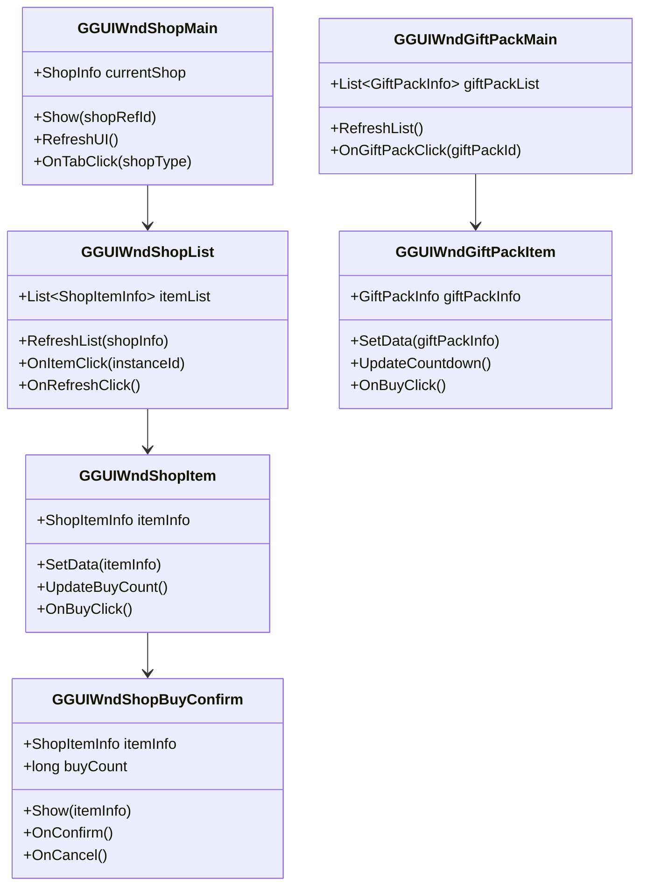

# 商店模块客户端开发文档

## 一、组件数据层

### 1.1 核心组件类

#### NPPlayerShopComponent
**路径**: `GameComponent/NPShop/NPPlayerShopComponent.cs`

**功能**: 商店管理器，管理玩家所有商店数据

**继承关系**:
```
NPPlayerShopComponent : _ANPBasicPlayerComponent
```

**协议模块**: p030_ShopOp

**主要属性**:

| 属性名 | 类型 | 说明 | 访问权限 |
|--------|------|------|----------|
| shopList | List\<ShopInfo\> | 商店列表 | public |
| giftPackList | List\<GiftPackInfo\> | 礼包列表 | public |
| limitGiftPackList | List\<GiftPackInfo\> | 限时礼包列表 | public |
| refreshTimeDic | Dictionary\<long, long\> | 刷新时间字典 | public |

**主要方法**:

| 方法名 | 参数 | 返回值 | 说明 |
|--------|------|--------|------|
| getShopInfo | shopRefId | ShopInfo | 获取商店信息 |
| getShopItem | shopRefId, instanceId | ShopItemInfo | 获取商品信息 |
| isShopUnlocked | shopRefId | bool | 检查商店是否解锁 |
| canBuyItem | shopRefId, instanceId, count | bool | 检查是否可购买 |
| canRefreshShop | shopRefId, isFree | bool | 检查是否可刷新 |
| getFreeRefreshCount | shopRefId | int | 获取剩余免费刷新次数 |
| getRefreshCost | shopRefId | long | 获取付费刷新费用 |
| getBuyCount | shopRefId, instanceId | int | 获取已购买次数 |
| getGiftPackInfo | giftPackId | GiftPackInfo | 获取礼包信息 |
| isGiftPackExpired | giftPackId | bool | 检查礼包是否过期 |

**事件回调**:

| 事件名 | 参数 | 说明 |
|--------|------|------|
| OnShopRefresh | shopRefId | 商店刷新事件 |
| OnItemSoldOut | shopRefId, instanceId | 商品售罄事件 |
| OnGiftPackAdd | giftPackInfo | 礼包新增事件 |
| OnGiftPackRemove | giftPackId | 礼包移除事件 |

---

### 1.2 商店信息类

#### ShopInfo
**路径**: `ClientProtocol/Common/ShopObj/ShopInfo.cs`

**功能**: 商店运行时数据

**主要属性**:

| 属性名 | 类型 | 说明 |
|--------|------|------|
| shopId | long | 商店ID |
| shopRefId | long | 商店配置ID |
| shopType | int | 商店类型 |
| itemList | List\<ShopItemInfo\> | 商品列表 |
| refreshTime | long | 刷新时间(毫秒) |
| refreshNum | int | 已刷新次数 |
| freeRefreshUsed | int | 已用免费刷新次数 |

**主要方法**:

| 方法名 | 返回值 | 说明 |
|--------|--------|------|
| findItem | ShopItemInfo | 根据实例ID查找商品 |
| getAvailableItems | List\<ShopItemInfo\> | 获取可购买商品 |
| getSoldOutItems | List\<ShopItemInfo\> | 获取已售罄商品 |
| isAllSoldOut | bool | 是否全部售罄 |

#### ShopItemInfo
**路径**: `ClientProtocol/Common/ShopObj/ShopItemInfo.cs`

**功能**: 商品运行时数据

**主要属性**:

| 属性名 | 类型 | 说明 |
|--------|------|------|
| instanceId | long | 商品实例ID |
| refId | long | 商品配置ID |
| buyCount | int | 已购买数量 |
| status | int | 商品状态 |
| discount | float | 当前折扣 |

**计算属性**:

| 属性名 | 类型 | 说明 |
|--------|------|------|
| isAvailable | bool | 是否可购买 |
| isSoldOut | bool | 是否已售罄 |
| currentPrice | long | 当前价格(含折扣) |
| originalPrice | long | 原价 |
| remainCount | int | 剩余可购买次数 |

**主要方法**:

| 方法名 | 返回值 | 说明 |
|--------|--------|------|
| getRef | RefShopItem | 获取商品配置 |
| canBuy | bool | 是否可购买 |

---

### 1.3 礼包信息类

#### GiftPackInfo
**路径**: `ClientProtocol/Common/ShopObj/GiftPackInfo.cs`

**功能**: 礼包运行时数据

**主要属性**:

| 属性名 | 类型 | 说明 |
|--------|------|------|
| giftPackId | long | 礼包配置ID |
| instanceId | long | 礼包实例ID(限时礼包) |
| buyCount | int | 已购买次数 |
| expireTime | long | 过期时间(毫秒) |
| status | int | 礼包状态 |
| isLimitGift | bool | 是否限时礼包 |

**计算属性**:

| 属性名 | 类型 | 说明 |
|--------|------|------|
| isExpired | bool | 是否已过期 |
| remainTime | long | 剩余时间(秒) |
| canBuy | bool | 是否可购买 |
| ref | RefGiftPack | 礼包配置引用 |

---

## 二、协议接口

### 2.1 请求协议封装

#### ShopProtocolSender
**路径**: `Network/Protocol/ShopProtocolSender.cs`

**功能**: 封装商店模块所有请求协议发送

```csharp
public static class ShopProtocolSender
{
    /// <summary>
    /// 请求商店列表
    /// </summary>
    public static void ReqShopList()
    {
        GC2GS_030_006_ReqShopList req = new GC2GS_030_006_ReqShopList();
        NetworkManager.Send(req);
    }

    /// <summary>
    /// 请求商店信息
    /// </summary>
    public static void ReqShopInfo(long shopRefId)
    {
        GC2GS_030_005_ReqShopInfo req = new GC2GS_030_005_ReqShopInfo();
        req.setShopRefId(shopRefId);
        NetworkManager.Send(req);
    }

    /// <summary>
    /// 购买商品
    /// </summary>
    public static void ReqBuyShopItem(long shopRefId, long instanceId, long count)
    {
        GC2GS_030_001_ReqBuyShopItem req = new GC2GS_030_001_ReqBuyShopItem();
        req.setShopRefId(shopRefId);
        req.setInstanceId(instanceId);
        req.setCount(count);
        NetworkManager.Send(req);
    }

    /// <summary>
    /// 免费刷新商店
    /// </summary>
    public static void ReqFreeRefreshShop(long shopRefId)
    {
        GC2GS_030_002_ReqFreeRefreshShop req = new GC2GS_030_002_ReqFreeRefreshShop();
        req.setShopRefId(shopRefId);
        NetworkManager.Send(req);
    }

    /// <summary>
    /// 付费刷新商店
    /// </summary>
    public static void ReqRefreshShop(long shopRefId)
    {
        GC2GS_030_003_ReqRefreshShop req = new GC2GS_030_003_ReqRefreshShop();
        req.setShopRefId(shopRefId);
        NetworkManager.Send(req);
    }

    /// <summary>
    /// 购买礼包
    /// </summary>
    public static void ReqBuyGiftPack(long giftPackId, long instanceId = 0)
    {
        GC2GS_030_022_ReqBuyGiftPack req = new GC2GS_030_022_ReqBuyGiftPack();
        req.setGiftPackId(giftPackId);
        req.setInstanceId(instanceId);
        NetworkManager.Send(req);
    }

    /// <summary>
    /// 请求礼包列表
    /// </summary>
    public static void ReqGiftPackList()
    {
        GC2GS_030_023_ReqGiftPackList req = new GC2GS_030_023_ReqGiftPackList();
        NetworkManager.Send(req);
    }

    /// <summary>
    /// 请求限时礼包列表
    /// </summary>
    public static void ReqLimitGiftPackList()
    {
        GC2GS_030_024_ReqLimitGiftPackList req = new GC2GS_030_024_ReqLimitGiftPackList();
        NetworkManager.Send(req);
    }
}
```

### 2.2 响应协议监听

#### ShopProtocolListener
**路径**: `Network/Protocol/ShopProtocolListener.cs`

**功能**: 封装商店模块所有响应协议监听

```csharp
public class ShopProtocolListener : MonoBehaviour
{
    public delegate void OnBuyShopItemHandler(GS2GC_030_001_RetBuyShopItem res);
    public delegate void OnRefreshShopHandler(GS2GC_030_003_RetRefreshShop res);
    public delegate void OnShopInfoHandler(GS2GC_030_005_RetShopInfo res);
    public delegate void OnShopListHandler(GS2GC_030_006_RetShopList res);
    public delegate void OnBuyGiftPackHandler(GS2GC_030_022_RetBuyGiftPack res);
    public delegate void OnShopRefreshPushHandler(GS2GC_030_050_OnShopRefresh push);
    public delegate void OnGiftPackAddPushHandler(GS2GC_030_052_OnGiftPackAdd push);
    public delegate void OnGiftPackRemovePushHandler(GS2GC_030_053_OnGiftPackRemove push);

    public static event OnBuyShopItemHandler OnBuyShopItem;
    public static event OnRefreshShopHandler OnRefreshShop;
    public static event OnShopInfoHandler OnShopInfo;
    public static event OnShopListHandler OnShopList;
    public static event OnBuyGiftPackHandler OnBuyGiftPack;
    public static event OnShopRefreshPushHandler OnShopRefreshPush;
    public static event OnGiftPackAddPushHandler OnGiftPackAddPush;
    public static event OnGiftPackRemovePushHandler OnGiftPackRemovePush;

    void Awake()
    {
        RegisterProtocols();
    }

    void RegisterProtocols()
    {
        NetworkManager.AddListener<GS2GC_030_001_RetBuyShopItem>(HandleBuyShopItem);
        NetworkManager.AddListener<GS2GC_030_002_RetFreeRefreshShop>(HandleFreeRefreshShop);
        NetworkManager.AddListener<GS2GC_030_003_RetRefreshShop>(HandleRefreshShop);
        NetworkManager.AddListener<GS2GC_030_005_RetShopInfo>(HandleShopInfo);
        NetworkManager.AddListener<GS2GC_030_006_RetShopList>(HandleShopList);
        NetworkManager.AddListener<GS2GC_030_022_RetBuyGiftPack>(HandleBuyGiftPack);
        NetworkManager.AddListener<GS2GC_030_050_OnShopRefresh>(HandleShopRefreshPush);
        NetworkManager.AddListener<GS2GC_030_051_OnShopItemSoldOut>(HandleItemSoldOutPush);
        NetworkManager.AddListener<GS2GC_030_052_OnGiftPackAdd>(HandleGiftPackAddPush);
        NetworkManager.AddListener<GS2GC_030_053_OnGiftPackRemove>(HandleGiftPackRemovePush);
    }

    void HandleBuyShopItem(GS2GC_030_001_RetBuyShopItem res)
    {
        if (res.getResult() == 0)
        {
            // 更新本地数据
            NPPlayer.instance.shopComp.UpdateShopItem(
                res.getShopRefId(),
                res.getInstanceId(),
                res.getTotalBuyCount()
            );
        }
        OnBuyShopItem?.Invoke(res);
    }

    void HandleRefreshShop(GS2GC_030_003_RetRefreshShop res)
    {
        if (res.getResult() == 0)
        {
            NPPlayer.instance.shopComp.UpdateShopInfo(res.getShopInfo());
        }
        OnRefreshShop?.Invoke(res);
    }

    void HandleShopRefreshPush(GS2GC_030_050_OnShopRefresh push)
    {
        NPPlayer.instance.shopComp.UpdateShopInfo(push.getShopInfo());
        OnShopRefreshPush?.Invoke(push);
    }

    void HandleGiftPackAddPush(GS2GC_030_052_OnGiftPackAdd push)
    {
        NPPlayer.instance.shopComp.AddLimitGiftPack(push.getGiftPackInfo());
        OnGiftPackAddPush?.Invoke(push);
    }

    // ... 其他处理方法
}
```

---

## 三、UI窗口

### 3.1 UI类结构



### 3.2 商店主界面

#### GGUIWndShopMain
**路径**: `GameWndGui/GGui/Shop/GGUIWndShopMain.cs`

**功能**: 商店模块主界面，管理商店标签页

**主要属性**:

| 属性名 | 类型 | 说明 |
|--------|------|------|
| currentShop | ShopInfo | 当前显示的商店 |
| tabList | List\<ShopTabItem\> | 商店标签列表 |
| itemViewList | List\<GGUIWndShopItem\> | 商品项列表 |

**主要方法**:

| 方法名 | 说明 |
|--------|------|
| Show(shopRefId) | 显示指定商店 |
| RefreshUI() | 刷新界面 |
| OnTabClick(shopType) | 标签点击事件 |
| OnRefreshClick() | 刷新按钮点击 |
| OnCloseClick() | 关闭按钮点击 |

**UI结构**:
```
GGUIWndShopMain
├── TopBar (顶部栏)
│   ├── TabContainer (标签容器)
│   └── RefreshButton (刷新按钮)
├── ItemContainer (商品容器)
│   └── GGUIWndShopItem (商品项) × N
├── BottomBar (底部栏)
│   └── FreeRefreshCount (免费刷新次数)
└── GGUIWndShopBuyConfirm (购买确认弹窗)
```

**代码示例**:

```csharp
public class GGUIWndShopMain : GGUIWndBase
{
    [SerializeField] private Transform tabContainer;
    [SerializeField] private Transform itemContainer;
    [SerializeField] private GameObject itemPrefab;
    [SerializeField] private Text freeRefreshText;
    [SerializeField] private Button refreshBtn;

    private ShopInfo currentShop;
    private List<GGUIWndShopItem> itemViewList = new List<GGUIWndShopItem>();

    public void Show(long shopRefId)
    {
        base.Show();

        // 请求商店信息
        ShopProtocolSender.ReqShopInfo(shopRefId);

        // 注册事件
        ShopProtocolListener.OnShopInfo += OnShopInfoReceived;
        ShopProtocolListener.OnBuyShopItem += OnBuyItemResult;
        ShopProtocolListener.OnRefreshShop += OnRefreshResult;
    }

    void OnShopInfoReceived(GS2GC_030_005_RetShopInfo res)
    {
        if (res.getResult() != 0) return;

        currentShop = NPPlayer.instance.shopComp.getShopInfo(res.getShopInfo().shopRefId);
        RefreshUI();
    }

    void RefreshUI()
    {
        if (currentShop == null) return;

        // 清空商品列表
        ClearItemList();

        // 创建商品项
        foreach (var item in currentShop.itemList)
        {
            CreateShopItem(item);
        }

        // 更新免费刷新次数
        int freeCount = NPPlayer.instance.shopComp.getFreeRefreshCount(currentShop.shopRefId);
        freeRefreshText.text = $"免费刷新: {freeCount}";
    }

    void CreateShopItem(ShopItemInfo itemInfo)
    {
        GameObject go = Instantiate(itemPrefab, itemContainer);
        GGUIWndShopItem itemView = go.GetComponent<GGUIWndShopItem>();
        itemView.SetData(itemInfo);
        itemView.OnBuyClick += OnItemBuyClick;
        itemViewList.Add(itemView);
    }

    void OnItemBuyClick(ShopItemInfo itemInfo)
    {
        // 显示购买确认弹窗
        GGUIWndShopBuyConfirm confirm = GetWindow<GGUIWndShopBuyConfirm>();
        confirm.Show(itemInfo);
    }

    public void OnRefreshClick()
    {
        if (currentShop == null) return;

        int freeCount = NPPlayer.instance.shopComp.getFreeRefreshCount(currentShop.shopRefId);
        if (freeCount > 0)
        {
            // 有免费次数，使用免费刷新
            ShopProtocolSender.ReqFreeRefreshShop(currentShop.shopRefId);
        }
        else
        {
            // 显示付费刷新确认
            long cost = NPPlayer.instance.shopComp.getRefreshCost(currentShop.shopRefId);
            ShowConfirmDialog($"是否消耗{cost}钻石刷新商店？", () => {
                ShopProtocolSender.ReqRefreshShop(currentShop.shopRefId);
            });
        }
    }

    void OnRefreshResult(GS2GC_030_003_RetRefreshShop res)
    {
        if (res.getResult() == 0)
        {
            currentShop = NPPlayer.instance.shopComp.getShopInfo(res.getShopRefId());
            RefreshUI();
            ShowToast("商店刷新成功");
        }
        else
        {
            ShowToast("商店刷新失败");
        }
    }

    void OnBuyItemResult(GS2GC_030_001_RetBuyShopItem res)
    {
        if (res.getResult() == 0)
        {
            // 显示获得物品
            ShowRewardPanel(res.getRewardList());
            RefreshUI();
        }
    }
}
```

### 3.3 商品项组件

#### GGUIWndShopItem
**路径**: `GameWndGui/GGui/Shop/GGUIWndShopItem.cs`

**功能**: 单个商品显示组件

**主要属性**:

| 属性名 | 类型 | 说明 |
|--------|------|------|
| itemInfo | ShopItemInfo | 商品信息 |
| iconImg | Image | 物品图标 |
| nameText | Text | 物品名称 |
| priceText | Text | 价格文本 |
| discountText | Text | 折扣文本 |
| buyBtn | Button | 购买按钮 |
| soldOutImg | Image | 售罄遮罩 |

**代码示例**:

```csharp
public class GGUIWndShopItem : MonoBehaviour
{
    [SerializeField] private Image iconImg;
    [SerializeField] private Text nameText;
    [SerializeField] private Text priceText;
    [SerializeField] private Text originalPriceText;
    [SerializeField] private Text discountText;
    [SerializeField] private Text buyCountText;
    [SerializeField] private Button buyBtn;
    [SerializeField] private GameObject soldOutObj;
    [SerializeField] private GameObject discountObj;

    private ShopItemInfo itemInfo;

    public event Action<ShopItemInfo> OnBuyClick;

    public void SetData(ShopItemInfo info)
    {
        itemInfo = info;

        // 获取配置
        RefShopItem itemRef = RefShopItem.getMgr().get(info.refId);
        if (itemRef == null) return;

        // 设置图标
        iconImg.sprite = ResourceManager.LoadSprite(itemRef.icon);

        // 设置名称
        nameText.text = itemRef.name;

        // 设置价格
        long currentPrice = (long)(itemRef.price.count * info.discount);
        priceText.text = currentPrice.ToString();

        // 设置折扣
        if (info.discount < 1.0f)
        {
            discountObj.SetActive(true);
            discountText.text = $"{(int)(info.discount * 100)}%";
            originalPriceText.text = itemRef.price.count.ToString();
            originalPriceText.gameObject.SetActive(true);
        }
        else
        {
            discountObj.SetActive(false);
            originalPriceText.gameObject.SetActive(false);
        }

        // 设置购买次数
        if (itemRef.buyLimit > 0)
        {
            buyCountText.text = $"{info.buyCount}/{itemRef.buyLimit}";
            buyCountText.gameObject.SetActive(true);
        }
        else
        {
            buyCountText.gameObject.SetActive(false);
        }

        // 设置状态
        soldOutObj.SetActive(info.isSoldOut);
        buyBtn.interactable = info.isAvailable;
    }

    void Awake()
    {
        buyBtn.onClick.AddListener(OnBuyBtnClick);
    }

    void OnBuyBtnClick()
    {
        OnBuyClick?.Invoke(itemInfo);
    }
}
```

### 3.4 购买确认弹窗

#### GGUIWndShopBuyConfirm
**路径**: `GameWndGui/GGui/Shop/GGUIWndShopBuyConfirm.cs`

**功能**: 购买商品确认弹窗

**代码示例**:

```csharp
public class GGUIWndShopBuyConfirm : GGUIWndBase
{
    [SerializeField] private Image iconImg;
    [SerializeField] private Text nameText;
    [SerializeField] private Text descText;
    [SerializeField] private Text countText;
    [SerializeField] private Text totalPriceText;
    [SerializeField] private Button minusBtn;
    [SerializeField] private Button plusBtn;
    [SerializeField] private Button confirmBtn;
    [SerializeField] private Button cancelBtn;

    private ShopItemInfo itemInfo;
    private long buyCount = 1;
    private long maxBuyCount = 1;

    public void Show(ShopItemInfo info)
    {
        base.Show();
        itemInfo = info;
        buyCount = 1;

        // 获取配置
        RefShopItem itemRef = RefShopItem.getMgr().get(info.refId);

        // 设置信息
        iconImg.sprite = ResourceManager.LoadSprite(itemRef.icon);
        nameText.text = itemRef.name;
        descText.text = itemRef.desc;

        // 计算最大购买数量
        if (itemRef.buyLimit > 0)
        {
            maxBuyCount = itemRef.buyLimit - info.buyCount;
        }
        else
        {
            maxBuyCount = 99;
        }

        // 检查货币限制最大购买数
        long currentPrice = (long)(itemRef.price.count * info.discount);
        long playerCurrency = NPPlayer.instance.playerComp.GetCurrency(itemRef.price.type);
        long currencyLimit = playerCurrency / currentPrice;
        maxBuyCount = Math.Min(maxBuyCount, currencyLimit);

        RefreshUI();
    }

    void RefreshUI()
    {
        countText.text = buyCount.ToString();

        RefShopItem itemRef = RefShopItem.getMgr().get(itemInfo.refId);
        long totalPrice = (long)(itemRef.price.count * itemInfo.discount * buyCount);
        totalPriceText.text = totalPrice.ToString();

        minusBtn.interactable = buyCount > 1;
        plusBtn.interactable = buyCount < maxBuyCount;
    }

    void Awake()
    {
        minusBtn.onClick.AddListener(OnMinusClick);
        plusBtn.onClick.AddListener(OnPlusClick);
        confirmBtn.onClick.AddListener(OnConfirmClick);
        cancelBtn.onClick.AddListener(Hide);
    }

    void OnMinusClick()
    {
        if (buyCount > 1)
        {
            buyCount--;
            RefreshUI();
        }
    }

    void OnPlusClick()
    {
        if (buyCount < maxBuyCount)
        {
            buyCount++;
            RefreshUI();
        }
    }

    void OnConfirmClick()
    {
        ShopProtocolSender.ReqBuyShopItem(
            itemInfo.shopRefId,
            itemInfo.instanceId,
            buyCount
        );
        Hide();
    }
}
```

### 3.5 礼包界面

#### GGUIWndGiftPackMain
**路径**: `GameWndGui/GGui/Shop/GGUIWndGiftPackMain.cs`

**功能**: 礼包购买主界面

**代码示例**:

```csharp
public class GGUIWndGiftPackMain : GGUIWndBase
{
    [SerializeField] private Transform giftPackContainer;
    [SerializeField] private GameObject giftPackPrefab;

    private List<GGUIWndGiftPackItem> itemViewList = new List<GGUIWndGiftPackItem>();

    public void Show()
    {
        base.Show();

        // 请求礼包列表
        ShopProtocolSender.ReqGiftPackList();
        ShopProtocolSender.ReqLimitGiftPackList();

        // 注册事件
        ShopProtocolListener.OnGiftPackAddPush += OnGiftPackAdd;
    }

    void RefreshList()
    {
        ClearList();

        var giftPackList = NPPlayer.instance.shopComp.giftPackList;
        var limitGiftPackList = NPPlayer.instance.shopComp.limitGiftPackList;

        // 先显示限时礼包
        foreach (var giftPack in limitGiftPackList)
        {
            if (!giftPack.isExpired)
            {
                CreateGiftPackItem(giftPack);
            }
        }

        // 再显示普通礼包
        foreach (var giftPack in giftPackList)
        {
            CreateGiftPackItem(giftPack);
        }
    }

    void CreateGiftPackItem(GiftPackInfo giftPack)
    {
        GameObject go = Instantiate(giftPackPrefab, giftPackContainer);
        GGUIWndGiftPackItem itemView = go.GetComponent<GGUIWndGiftPackItem>();
        itemView.SetData(giftPack);
        itemView.OnBuyClick += OnGiftPackBuyClick;
        itemViewList.Add(itemView);
    }

    void OnGiftPackAdd(GS2GC_030_052_OnGiftPackAdd push)
    {
        // 显示礼包弹窗
        var giftPack = push.getGiftPackInfo();
        ShowGiftPackPopup(giftPack);
    }

    void OnGiftPackBuyClick(GiftPackInfo giftPack)
    {
        ShopProtocolSender.ReqBuyGiftPack(giftPack.giftPackId, giftPack.instanceId);
    }
}
```

---

## 四、访问方式

### 4.1 获取商店组件

```csharp
// 获取商店组件
NPPlayerShopComponent shopComp = NPPlayer.instance.shopComp;

// 获取商店列表
List<ShopInfo> shops = shopComp.shopList;

// 获取指定商店
ShopInfo shop = shopComp.getShopInfo(1001);

// 获取商品信息
ShopItemInfo item = shopComp.getShopItem(1001, 123456789);

// 检查商店是否解锁
bool unlocked = shopComp.isShopUnlocked(1001);

// 检查是否可购买
bool canBuy = shopComp.canBuyItem(1001, 123456789, 1);

// 检查是否可刷新
bool canRefresh = shopComp.canRefreshShop(1001, true); // 免费刷新
bool canRefreshPaid = shopComp.canRefreshShop(1001, false); // 付费刷新

// 获取免费刷新次数
int freeCount = shopComp.getFreeRefreshCount(1001);

// 获取付费刷新费用
long cost = shopComp.getRefreshCost(1001);

// 获取已购买次数
int buyCount = shopComp.getBuyCount(1001, 123456789);
```

### 4.2 获取礼包数据

```csharp
// 获取礼包列表
List<GiftPackInfo> giftPacks = NPPlayer.instance.shopComp.giftPackList;

// 获取限时礼包列表
List<GiftPackInfo> limitGiftPacks = NPPlayer.instance.shopComp.limitGiftPackList;

// 获取指定礼包
GiftPackInfo giftPack = shopComp.getGiftPackInfo(30001);

// 检查礼包是否过期
bool expired = shopComp.isGiftPackExpired(30001);
```

---

## 五、常见操作示例

### 5.1 打开商店

```csharp
public class ShopManager
{
    public static void OpenShop(long shopRefId)
    {
        // 检查是否解锁
        if (!NPPlayer.instance.shopComp.isShopUnlocked(shopRefId))
        {
            UIMessageBox.Show("商店尚未解锁");
            return;
        }

        // 打开商店界面
        GGUIWndShopMain shopWnd = UIManager.GetWindow<GGUIWndShopMain>();
        shopWnd.Show(shopRefId);
    }

    public static void OpenShopByType(int shopType)
    {
        // 根据类型获取商店
        var shop = NPPlayer.instance.shopComp.shopList
            .FirstOrDefault(s => s.shopType == shopType);

        if (shop != null)
        {
            OpenShop(shop.shopRefId);
        }
    }
}
```

### 5.2 购买商品

```csharp
public void BuyShopItem(long shopRefId, long instanceId, long count)
{
    // 检查是否可购买
    if (!NPPlayer.instance.shopComp.canBuyItem(shopRefId, instanceId, count))
    {
        UIMessageBox.Show("无法购买该商品");
        return;
    }

    // 获取商品信息
    ShopItemInfo item = NPPlayer.instance.shopComp.getShopItem(shopRefId, instanceId);
    RefShopItem itemRef = RefShopItem.getMgr().get(item.refId);

    // 计算价格
    long totalPrice = (long)(itemRef.price.count * item.discount * count);

    // 检查货币
    long playerCurrency = NPPlayer.instance.playerComp.GetCurrency(itemRef.price.type);
    if (playerCurrency < totalPrice)
    {
        UIMessageBox.Show("货币不足");
        // 跳转充值
        UIManager.GetWindow<GGUIWndRecharge>().Show();
        return;
    }

    // 发送购买请求
    ShopProtocolSender.ReqBuyShopItem(shopRefId, instanceId, count);
}
```

### 5.3 刷新商店

```csharp
public void RefreshShop(long shopRefId)
{
    NPPlayerShopComponent shopComp = NPPlayer.instance.shopComp;

    // 检查是否可刷新
    if (!shopComp.canRefreshShop(shopRefId, true) &&
        !shopComp.canRefreshShop(shopRefId, false))
    {
        UIMessageBox.Show("无法刷新商店");
        return;
    }

    // 优先使用免费刷新
    int freeCount = shopComp.getFreeRefreshCount(shopRefId);
    if (freeCount > 0)
    {
        // 显示确认弹窗
        UIMessageBox.ShowConfirm(
            "确认刷新商店？",
            () => ShopProtocolSender.ReqFreeRefreshShop(shopRefId)
        );
    }
    else
    {
        // 付费刷新
        long cost = shopComp.getRefreshCost(shopRefId);
        UIMessageBox.ShowConfirm(
            $"是否消耗{cost}钻石刷新商店？",
            () => ShopProtocolSender.ReqRefreshShop(shopRefId)
        );
    }
}
```

### 5.4 处理限时礼包

```csharp
public class LimitGiftPackHandler : MonoBehaviour
{
    void Start()
    {
        ShopProtocolListener.OnGiftPackAddPush += OnGiftPackAdd;
        ShopProtocolListener.OnGiftPackRemovePush += OnGiftPackRemove;
    }

    void OnGiftPackAdd(GS2GC_030_052_OnGiftPackAdd push)
    {
        GiftPackInfo giftPack = push.getGiftPackInfo();
        RefGiftPack giftRef = RefGiftPack.getMgr().get(giftPack.giftPackId);

        // 显示限时礼包弹窗
        GGUIWndLimitGiftPackPopup popup = UIManager.GetWindow<GGUIWndLimitGiftPackPopup>();
        popup.Show(giftPack);

        // 开始倒计时
        StartCoroutine(CountdownCoroutine(giftPack));
    }

    IEnumerator CountdownCoroutine(GiftPackInfo giftPack)
    {
        while (!giftPack.isExpired)
        {
            yield return new WaitForSeconds(1f);
            // 更新倒计时显示
            UpdateCountdownUI(giftPack);
        }

        // 过期处理
        OnGiftPackExpired(giftPack);
    }

    void OnGiftPackExpired(GiftPackInfo giftPack)
    {
        UIMessageBox.Show("限时礼包已过期");
    }

    void OnGiftPackRemove(GS2GC_030_053_OnGiftPackRemove push)
    {
        // 移除礼包显示
        NPPlayer.instance.shopComp.RemoveLimitGiftPack(push.getGiftPackId());
    }
}
```

---

## 六、事件处理

### 6.1 商店事件监听

```csharp
public class ShopEventListener : MonoBehaviour
{
    void Start()
    {
        // 注册商店事件
        NPPlayer.instance.shopComp.OnShopRefresh += OnShopRefresh;
        NPPlayer.instance.shopComp.OnItemSoldOut += OnItemSoldOut;
        NPPlayer.instance.shopComp.OnGiftPackAdd += OnGiftPackAdd;
        NPPlayer.instance.shopComp.OnGiftPackRemove += OnGiftPackRemove;
    }

    void OnDestroy()
    {
        // 注销事件
        NPPlayer.instance.shopComp.OnShopRefresh -= OnShopRefresh;
        NPPlayer.instance.shopComp.OnItemSoldOut -= OnItemSoldOut;
        NPPlayer.instance.shopComp.OnGiftPackAdd -= OnGiftPackAdd;
        NPPlayer.instance.shopComp.OnGiftPackRemove -= OnGiftPackRemove;
    }

    void OnShopRefresh(long shopRefId)
    {
        // 刷新商店UI
        var shopWnd = UIManager.GetWindow<GGUIWndShopMain>();
        if (shopWnd.IsVisible())
        {
            shopWnd.RefreshUI();
        }
    }

    void OnItemSoldOut(long shopRefId, long instanceId)
    {
        // 更新商品状态
        UIMessageBox.Show("商品已售罄");
    }

    void OnGiftPackAdd(GiftPackInfo giftPack)
    {
        // 显示礼包弹窗
        ShowGiftPackPopup(giftPack);
    }

    void OnGiftPackRemove(long giftPackId)
    {
        // 移除礼包显示
    }
}
```

---

## 七、数据绑定模式

### 7.1 MVVM绑定示例

```csharp
// ShopViewModel.cs
public class ShopViewModel : INotifyPropertyChanged
{
    private ShopInfo _currentShop;
    public ShopInfo CurrentShop
    {
        get => _currentShop;
        set
        {
            _currentShop = value;
            OnPropertyChanged(nameof(CurrentShop));
            OnPropertyChanged(nameof(ItemList));
            OnPropertyChanged(nameof(CanRefresh));
            OnPropertyChanged(nameof(FreeRefreshCount));
        }
    }

    public List<ShopItemInfo> ItemList => CurrentShop?.itemList ?? new List<ShopItemInfo>();
    public bool CanRefresh => CurrentShop != null;
    public int FreeRefreshCount => NPPlayer.instance.shopComp.getFreeRefreshCount(CurrentShop?.shopRefId ?? 0);

    public event PropertyChangedEventHandler PropertyChanged;

    protected void OnPropertyChanged(string propertyName)
    {
        PropertyChanged?.Invoke(this, new PropertyChangedEventArgs(propertyName));
    }

    public void RefreshShop()
    {
        if (CurrentShop == null) return;
        ShopProtocolSender.ReqRefreshShop(CurrentShop.shopRefId);
    }

    public void BuyItem(ShopItemInfo item, long count)
    {
        ShopProtocolSender.ReqBuyShopItem(CurrentShop.shopRefId, item.instanceId, count);
    }
}
```

---

## 八、边界情况处理

### 8.1 商品不存在处理

```csharp
public void BuyItem(long shopRefId, long instanceId, long count)
{
    // 检查商店是否存在
    ShopInfo shop = NPPlayer.instance.shopComp.getShopInfo(shopRefId);
    if (shop == null)
    {
        UIMessageBox.Show("商店数据异常，请重新进入");
        return;
    }

    // 检查商品是否存在
    ShopItemInfo item = shop.findItem(instanceId);
    if (item == null)
    {
        UIMessageBox.Show("商品不存在，可能已被刷新");
        RefreshShopUI(shopRefId);
        return;
    }

    // 正常购买流程
    // ...
}
```

### 8.2 网络异常处理

```csharp
public class ShopNetworkHandler : MonoBehaviour
{
    private float requestTimeout = 10f;
    private int maxRetryCount = 3;

    public void BuyItemWithRetry(long shopRefId, long instanceId, long count)
    {
        StartCoroutine(BuyItemCoroutine(shopRefId, instanceId, count));
    }

    private IEnumerator BuyItemCoroutine(long shopRefId, long instanceId, long count)
    {
        int retryCount = 0;
        bool success = false;

        while (retryCount < maxRetryCount && !success)
        {
            // 发送请求
            ShopProtocolSender.ReqBuyShopItem(shopRefId, instanceId, count);

            // 等待响应
            float elapsedTime = 0f;
            bool responseReceived = false;

            while (elapsedTime < requestTimeout && !responseReceived)
            {
                // 检查是否有响应（简化示例）
                responseReceived = CheckResponseReceived();
                elapsedTime += Time.deltaTime;
                yield return null;
            }

            if (responseReceived)
            {
                success = true;
            }
            else
            {
                retryCount++;
                if (retryCount < maxRetryCount)
                {
                    // 等待后重试
                    yield return new WaitForSeconds(1f * retryCount);
                }
            }
        }

        if (!success)
        {
            UIMessageBox.Show("网络异常，请检查网络后重试");
        }
    }
}
```

### 8.3 数据一致性检查

```csharp
public class ShopDataValidator
{
    /// <summary>
    /// 检查商店数据一致性
    /// </summary>
    public static bool ValidateShopData(ShopInfo shopInfo)
    {
        if (shopInfo == null) return false;

        // 检查商品数量是否匹配配置
        RefShop shopRef = RefShop.getMgr().get(shopInfo.shopRefId);
        if (shopRef == null) return false;

        if (shopInfo.itemList.Count != shopRef.slot_count)
        {
            Debug.LogWarning($"商品数量不匹配: 预期{shopRef.slot_count}, 实际{shopInfo.itemList.Count}");
            return false;
        }

        // 检查商品ID有效性
        foreach (var item in shopInfo.itemList)
        {
            RefShopItem itemRef = RefShopItem.getMgr().get(item.refId);
            if (itemRef == null)
            {
                Debug.LogWarning($"商品配置不存在: {item.refId}");
                return false;
            }
        }

        return true;
    }

    /// <summary>
    /// 检查价格计算正确性
    /// </summary>
    public static bool ValidatePrice(ShopItemInfo item, long expectedPrice)
    {
        RefShopItem itemRef = RefShopItem.getMgr().get(item.refId);
        if (itemRef == null) return false;

        long calculatedPrice = (long)(itemRef.price.count * item.discount);
        return calculatedPrice == expectedPrice;
    }
}
```

### 8.4 本地缓存处理

```csharp
public class ShopLocalCache
{
    private const string CACHE_KEY_SHOP = "shop_cache_{0}";
    private const int CACHE_EXPIRE_SECONDS = 300; // 5分钟缓存

    /// <summary>
    /// 保存商店数据到本地缓存
    /// </summary>
    public static void SaveShopCache(ShopInfo shopInfo)
    {
        string key = string.Format(CACHE_KEY_SHOP, shopInfo.shopRefId);
        var cacheData = new ShopCacheData
        {
            shopInfo = shopInfo,
            cacheTime = DateTime.UtcNow.Ticks
        };
        string json = JsonUtility.ToJson(cacheData);
        PlayerPrefs.SetString(key, json);
        PlayerPrefs.Save();
    }

    /// <summary>
    /// 从本地缓存加载商店数据
    /// </summary>
    public static ShopInfo LoadShopCache(long shopRefId)
    {
        string key = string.Format(CACHE_KEY_SHOP, shopRefId);
        string json = PlayerPrefs.GetString(key, "");

        if (string.IsNullOrEmpty(json)) return null;

        var cacheData = JsonUtility.FromJson<ShopCacheData>(json);

        // 检查缓存是否过期
        long elapsedTicks = DateTime.UtcNow.Ticks - cacheData.cacheTime;
        if (elapsedTicks / TimeSpan.TicksPerSecond > CACHE_EXPIRE_SECONDS)
        {
            return null; // 缓存过期
        }

        return cacheData.shopInfo;
    }

    [Serializable]
    private class ShopCacheData
    {
        public ShopInfo shopInfo;
        public long cacheTime;
    }
}
```

---

## 九、红点提示系统

### 9.1 红点检测逻辑

```csharp
public class ShopRedDotChecker : MonoBehaviour
{
    /// <summary>
    /// 检查商店是否有红点
    /// </summary>
    public static bool CheckShopRedDot(long shopRefId)
    {
        // 检查商店是否解锁
        if (!NPPlayer.instance.shopComp.isShopUnlocked(shopRefId))
        {
            return false;
        }

        // 检查是否有免费刷新次数
        if (NPPlayer.instance.shopComp.getFreeRefreshCount(shopRefId) > 0)
        {
            return true;
        }

        // 检查是否有折扣商品
        ShopInfo shop = NPPlayer.instance.shopComp.getShopInfo(shopRefId);
        if (shop != null)
        {
            foreach (var item in shop.itemList)
            {
                if (item.isAvailable && item.discount < 1.0f)
                {
                    return true;
                }
            }
        }

        return false;
    }

    /// <summary>
    /// 检查礼包是否有红点
    /// </summary>
    public static bool CheckGiftPackRedDot()
    {
        // 检查限时礼包
        var limitGiftPacks = NPPlayer.instance.shopComp.limitGiftPackList;
        foreach (var gift in limitGiftPacks)
        {
            if (!gift.isExpired && gift.buyCount < gift.ref.buy_limit)
            {
                return true;
            }
        }

        // 检查普通礼包
        var giftPacks = NPPlayer.instance.shopComp.giftPackList;
        foreach (var gift in giftPacks)
        {
            if (gift.buyCount < gift.ref.buy_limit)
            {
                return true;
            }
        }

        return false;
    }

    /// <summary>
    /// 获取商店总红点数
    /// </summary>
    public static int GetTotalRedDotCount()
    {
        int count = 0;

        // 遍历所有商店
        foreach (var shop in NPPlayer.instance.shopComp.shopList)
        {
            if (CheckShopRedDot(shop.shopRefId))
            {
                count++;
            }
        }

        // 加上礼包红点
        if (CheckGiftPackRedDot())
        {
            count++;
        }

        return count;
    }
}
```

### 9.2 红点状态更新

```csharp
public class ShopRedDotManager : MonoBehaviour
{
    public static event Action<long> OnShopRedDotChanged;
    public static event Action OnGiftPackRedDotChanged;

    void Start()
    {
        // 监听商店变化
        ShopProtocolListener.OnShopInfo += OnShopInfoReceived;
        ShopProtocolListener.OnRefreshShop += OnShopRefreshed;
        ShopProtocolListener.OnBuyShopItem += OnItemBought;

        // 监听礼包变化
        ShopProtocolListener.OnGiftPackAddPush += OnGiftPackAdded;
        ShopProtocolListener.OnGiftPackRemovePush += OnGiftPackRemoved;
    }

    void OnShopInfoReceived(GS2GC_030_005_RetShopInfo res)
    {
        if (res.getResult() == 0)
        {
            OnShopRedDotChanged?.Invoke(res.getShopInfo().shopRefId);
        }
    }

    void OnShopRefreshed(GS2GC_030_003_RetRefreshShop res)
    {
        if (res.getResult() == 0)
        {
            OnShopRedDotChanged?.Invoke(res.getShopRefId());
        }
    }

    void OnItemBought(GS2GC_030_001_RetBuyShopItem res)
    {
        if (res.getResult() == 0)
        {
            OnShopRedDotChanged?.Invoke(res.getShopRefId());
        }
    }

    void OnGiftPackAdded(GS2GC_030_052_OnGiftPackAdd push)
    {
        OnGiftPackRedDotChanged?.Invoke();
    }

    void OnGiftPackRemoved(GS2GC_030_053_OnGiftPackRemove push)
    {
        OnGiftPackRedDotChanged?.Invoke();
    }
}
```

---

## 十、UI动画与特效

### 10.1 商品刷新动画

```csharp
public class ShopRefreshAnimation : MonoBehaviour
{
    [SerializeField] private Transform itemContainer;
    [SerializeField] private float animationDuration = 0.5f;
    [SerializeField] private AnimationCurve animationCurve;

    public IEnumerator PlayRefreshAnimation(List<ShopItemInfo> newItems)
    {
        // 淡出旧商品
        yield return StartCoroutine(FadeOutItems());

        // 清空并创建新商品
        ClearItems();
        CreateNewItems(newItems);

        // 淡入新商品
        yield return StartCoroutine(FadeInItems());
    }

    private IEnumerator FadeOutItems()
    {
        float elapsed = 0f;
        var items = itemContainer.GetComponentsInChildren<CanvasGroup>();

        while (elapsed < animationDuration)
        {
            float alpha = 1f - animationCurve.Evaluate(elapsed / animationDuration);
            foreach (var item in items)
            {
                item.alpha = alpha;
            }
            elapsed += Time.deltaTime;
            yield return null;
        }
    }

    private IEnumerator FadeInItems()
    {
        float elapsed = 0f;
        var items = itemContainer.GetComponentsInChildren<CanvasGroup>();

        while (elapsed < animationDuration)
        {
            float alpha = animationCurve.Evaluate(elapsed / animationDuration);
            foreach (var item in items)
            {
                item.alpha = alpha;
            }
            elapsed += Time.deltaTime;
            yield return null;
        }
    }
}
```

### 10.2 购买成功特效

```csharp
public class ShopPurchaseEffect : MonoBehaviour
{
    [SerializeField] private ParticleSystem purchaseParticle;
    [SerializeField] private AudioClip purchaseSound;
    [SerializeField] private float shakeIntensity = 5f;
    [SerializeField] private float shakeDuration = 0.2f;

    public void PlayPurchaseEffect(Vector3 position)
    {
        // 播放音效
        if (purchaseSound != null)
        {
            AudioSource.PlayClipAtPoint(purchaseSound, position);
        }

        // 播放粒子特效
        if (purchaseParticle != null)
        {
            var particle = Instantiate(purchaseParticle, position, Quaternion.identity);
            particle.Play();
            Destroy(particle.gameObject, particle.main.duration);
        }

        // 屏幕震动
        StartCoroutine(ShakeScreen());
    }

    private IEnumerator ShakeScreen()
    {
        Vector3 originalPosition = Camera.main.transform.position;
        float elapsed = 0f;

        while (elapsed < shakeDuration)
        {
            float x = Random.Range(-1f, 1f) * shakeIntensity;
            float y = Random.Range(-1f, 1f) * shakeIntensity;
            Camera.main.transform.position = originalPosition + new Vector3(x, y, 0);
            elapsed += Time.deltaTime;
            yield return null;
        }

        Camera.main.transform.position = originalPosition;
    }
}
```

---

## 十一、性能优化

### 11.1 商品列表优化

```csharp
public class ShopItemListOptimizer : MonoBehaviour
{
    [SerializeField] private ScrollRect scrollRect;
    [SerializeField] private GameObject itemPrefab;
    [SerializeField] private Transform content;

    private List<GameObject> itemPool = new List<GameObject>();
    private List<ShopItemInfo> itemDataList = new List<ShopItemInfo>();
    private int visibleItemCount = 10;

    // 对象池管理
    public GameObject GetItemFromPool()
    {
        foreach (var item in itemPool)
        {
            if (!item.activeSelf)
            {
                item.SetActive(true);
                return item;
            }
        }

        // 池中没有可用对象，创建新的
        var newItem = Instantiate(itemPrefab, content);
        itemPool.Add(newItem);
        return newItem;
    }

    public void ReturnItemToPool(GameObject item)
    {
        item.SetActive(false);
    }

    // 虚拟列表实现
    private void OnScroll(Vector2 position)
    {
        // 计算可见范围
        float viewportHeight = scrollRect.viewport.rect.height;
        float contentY = content.localPosition.y;

        // 更新可见项
        UpdateVisibleItems(contentY, viewportHeight);
    }

    private void UpdateVisibleItems(float contentY, float viewportHeight)
    {
        int startIndex = Mathf.FloorToInt(contentY / ItemHeight);
        int endIndex = Mathf.CeilToInt((contentY + viewportHeight) / ItemHeight);

        startIndex = Mathf.Max(0, startIndex);
        endIndex = Mathf.Min(itemDataList.Count, endIndex);

        // 回收不可见项
        foreach (var item in itemPool)
        {
            int index = itemPool.IndexOf(item);
            if (index < startIndex || index >= endIndex)
            {
                ReturnItemToPool(item);
            }
        }

        // 创建可见项
        for (int i = startIndex; i < endIndex; i++)
        {
            var item = GetItemFromPool();
            var itemView = item.GetComponent<GGUIWndShopItem>();
            itemView.SetData(itemDataList[i]);
        }
    }
}
```

### 11.2 图片资源优化

```csharp
public class ShopImageLoader : MonoBehaviour
{
    private Dictionary<string, Sprite> spriteCache = new Dictionary<string, Sprite>();
    private Queue<string> loadingQueue = new Queue<string>();
    private bool isLoading = false;

    /// <summary>
    /// 异步加载商品图标
    /// </summary>
    public void LoadItemIconAsync(string iconPath, Image targetImage)
    {
        // 检查缓存
        if (spriteCache.ContainsKey(iconPath))
        {
            targetImage.sprite = spriteCache[iconPath];
            return;
        }

        // 加入加载队列
        loadingQueue.Enqueue(iconPath);

        // 启动加载协程
        if (!isLoading)
        {
            StartCoroutine(LoadSpritesCoroutine());
        }
    }

    private IEnumerator LoadSpritesCoroutine()
    {
        isLoading = true;

        while (loadingQueue.Count > 0)
        {
            string path = loadingQueue.Dequeue();

            // 检查是否已加载
            if (spriteCache.ContainsKey(path))
            {
                continue;
            }

            // 异步加载资源
            ResourceRequest request = Resources.LoadAsync<Sprite>(path);
            yield return request;

            if (request.asset != null)
            {
                Sprite sprite = request.asset as Sprite;
                spriteCache[path] = sprite;
            }
        }

        isLoading = false;
    }

    /// <summary>
    /// 清理缓存
    /// </summary>
    public void ClearCache()
    {
        spriteCache.Clear();
        Resources.UnloadUnusedAssets();
    }
}
```

---

## 十二、调试工具

### 12.1 商店调试面板

```csharp
#if UNITY_EDITOR || DEVELOPMENT_BUILD
public class ShopDebugPanel : MonoBehaviour
{
    private bool showPanel = false;
    private Vector2 scrollPosition;

    void OnGUI()
    {
        if (GUILayout.Button("Shop Debug Panel", GUILayout.Width(200), GUILayout.Height(30)))
        {
            showPanel = !showPanel;
        }

        if (!showPanel) return;

        GUILayout.BeginArea(new Rect(10, 50, 400, 500));
        scrollPosition = GUILayout.BeginScrollView(scrollPosition);

        GUILayout.Label("=== Shop Debug Panel ===");

        // 商店列表
        GUILayout.Label("Shop List:");
        foreach (var shop in NPPlayer.instance.shopComp.shopList)
        {
            if (GUILayout.Button($"Shop {shop.shopRefId}"))
            {
                Debug.Log(JsonUtility.ToJson(shop, true));
            }
        }

        // 礼包列表
        GUILayout.Label("Gift Pack List:");
        foreach (var gift in NPPlayer.instance.shopComp.giftPackList)
        {
            if (GUILayout.Button($"Gift {gift.giftPackId}"))
            {
                Debug.Log(JsonUtility.ToJson(gift, true));
            }
        }

        // 测试按钮
        GUILayout.Label("Test Actions:");
        if (GUILayout.Button("Test Buy Item"))
        {
            ShopProtocolSender.ReqBuyShopItem(1001, 1, 1);
        }
        if (GUILayout.Button("Test Refresh Shop"))
        {
            ShopProtocolSender.ReqRefreshShop(1001);
        }
        if (GUILayout.Button("Clear Local Cache"))
        {
            ShopLocalCache.ClearAllCache();
        }

        GUILayout.EndScrollView();
        GUILayout.EndArea();
    }
}
#endif
```

### 12.2 协议日志工具

```csharp
public class ShopProtocolLogger : MonoBehaviour
{
    private static List<string> protocolLogs = new List<string>();
    private static int maxLogCount = 100;

    public static void LogProtocol(string direction, string protocolName, string content)
    {
        string log = $"[{DateTime.Now:HH:mm:ss.fff}] [{direction}] {protocolName}: {content}";
        protocolLogs.Add(log);

        // 限制日志数量
        if (protocolLogs.Count > maxLogCount)
        {
            protocolLogs.RemoveAt(0);
        }

        Debug.Log(log);
    }

    public static List<string> GetLogs()
    {
        return new List<string>(protocolLogs);
    }

    public static void ClearLogs()
    {
        protocolLogs.Clear();
    }

    public static string ExportLogs()
    {
        return string.Join("\n", protocolLogs);
    }
}
```

---

*文档生成时间: 2026-04-11*
*源码参考路径: `/game_client/GameComponent/NPShop/`*
*源码参考路径: `/game_client/GameWndGui/GGui/Shop/`*
