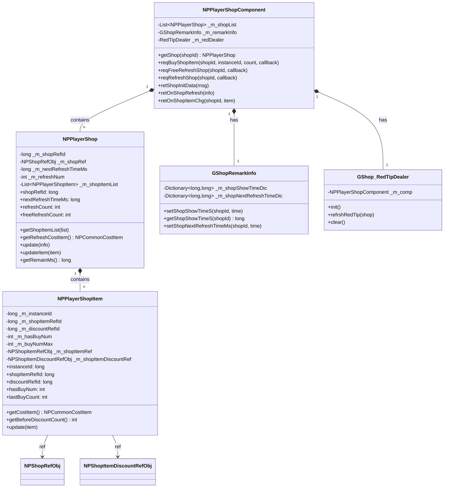
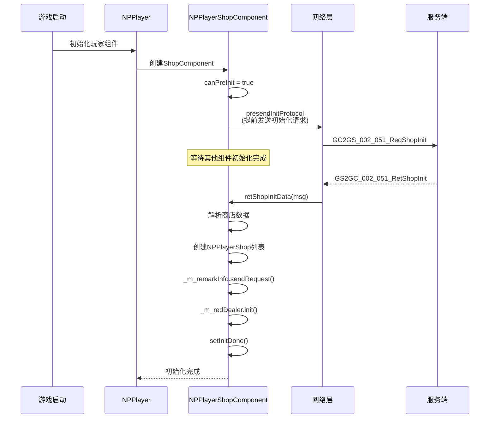
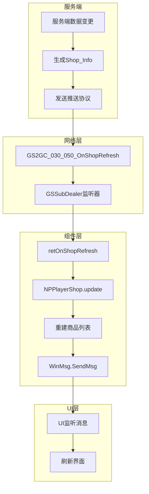
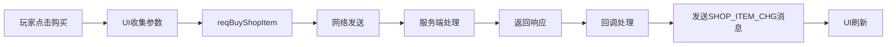
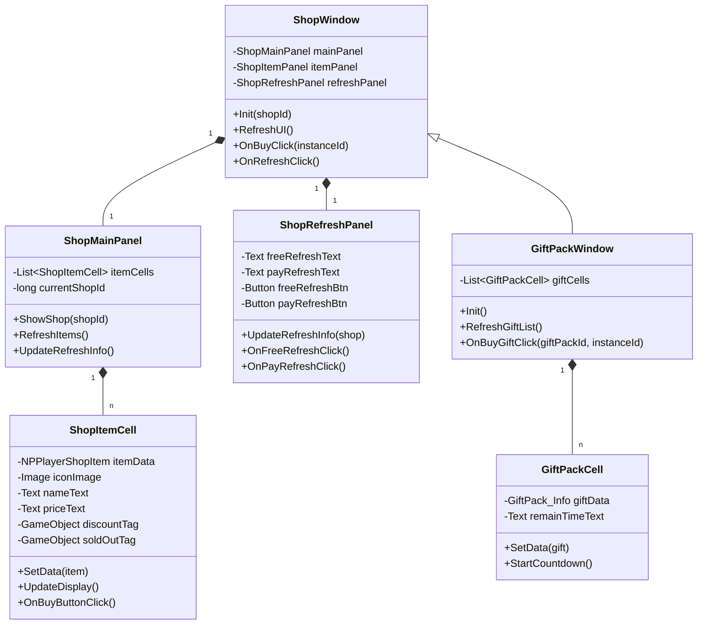
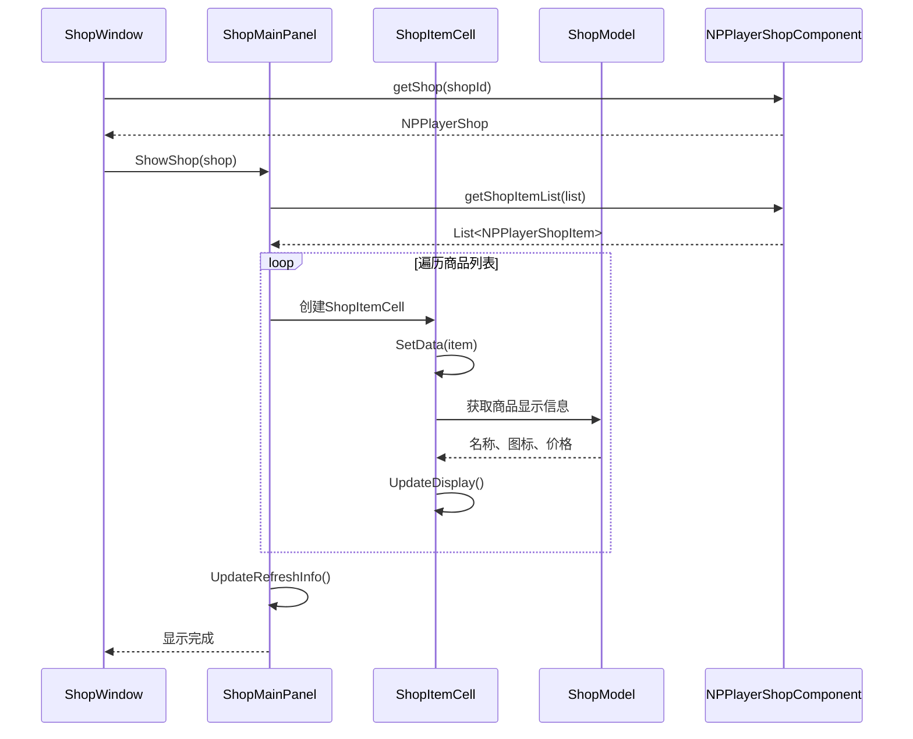

# 商店模块客户端开发文档

## 协议模块编号: p030

**源码路径**:
- 组件层: `/game_client/LogicScripts/GameComponent/NPShop/`
- 协议层: `/game_client/ClientProtocol/GC2GS/p030_ShopOp/`
- UI层: `/game_client/LogicScripts/GameWndGui/GGui/Shop/`

---

## 一、核心类架构

### 1.1 类关系图



### 1.2 模块初始化流程



---

## 二、核心组件详解

### 2.1 NPPlayerShopComponent - 商店管理组件

**路径**: `GameComponent/NPShop/NPPlayerShopComponent.cs`

#### 完整源码

```csharp
using System.Collections.Generic;
using System;
using ALPackage;
using JetBrains.Annotations;
using GS2GC.p002_InitOp;
using Common.ShopObj;
using GS2GC.p030_ShopOp;

namespace GOE
{
    // 商店模块管理类
    public partial class NPPlayerShopComponent : _ANPBasicPlayerComponent
    {
        // 商店列表
        [NotNull] private List<NPPlayerShop> _m_shopList;
        private GShopRemarkInfo _m_remarkInfo;
        private RedTipDealer _m_redDealer;

        // 构造函数
        public NPPlayerShopComponent(NPPlayerComponentMgr _compMgr) : base(_compMgr)
        {
            _m_shopList = new List<NPPlayerShop>();
            _m_redDealer = new RedTipDealer(this);
            _m_remarkInfo = new GShopRemarkInfo();
        }

        #region override
        public override bool isMustInit { get { return true; } }
        public override ENPPlayerCompType compType { get { return ENPPlayerCompType.SHOP; } }
        public override ENPPlayerCompType[] dependCompList { get { return null; } }
        public GShopRemarkInfo remarkInfo { get { return _m_remarkInfo; } }
        #endregion

        #region override 方法
        /// <summary>
        /// 是否允许提前初始化
        /// </summary>
        public override bool canPreInit { get { return true; } }

        /// <summary>
        /// 发送初始化协议提前申请内容
        /// </summary>
        public override void presendInitProtocol()
        {
            _reqShopInitData();
        }

        protected override void _dealInit() { }

        protected override void _onInitDone() { }

        protected override void _onInitFail()
        {
            ALLog.Error("NPPlayerShopComponent init Fail!!!");
        }

        protected override void _discard()
        {
            _m_shopList.Clear();
            _m_redDealer?.clear();
        }
        #endregion

        /// <summary>
        /// 根据id获取对应商店
        /// </summary>
        public NPPlayerShop getShop(long _shopId)
        {
            NPPlayerShop temp = null;
            for (int i = 0; i < _m_shopList.Count; i++)
            {
                temp = _m_shopList[i];
                if (null == temp) continue;
                if (temp.shopRefId == _shopId)
                    return temp;
            }
            return null;
        }

        #region S2C
        public void retShopInitData(GS2GC_002_051_RetShopInit _msg)
        {
            if (null == _msg) return;

            _m_shopList.Clear();
            if (null != _msg.getShopList())
            {
                Shop_Info temp = null;
                for (int i = 0; i < _msg.getShopList().Count; i++)
                {
                    temp = _msg.getShopList()[i];
                    if (null == temp) continue;

                    NPPlayerShop shop = new NPPlayerShop(temp);
                    _m_shopList.Add(shop);
                }
            }
            _m_remarkInfo.sendRequest(() =>
            {
                _m_redDealer.init();
            });

            setInitDone();
        }

        /// <summary>
        /// 更新商店
        /// </summary>
        public void retOnShopRefresh(Shop_Info _info)
        {
            if (null == _info) return;

            NPPlayerShop shop = getShop(_info.getShopRefId());
            if (null == shop) return;

            shop.update(_info);
            setShopNextRefreshTimeMs(_info.getShopRefId(), _info.getNextRefreshTimeMs());
            _m_redDealer?.refrshRedTip(shop);
        }

        /// <summary>
        /// 更新商品
        /// </summary>
        public void retOnShopItemChg(long _shopId, Shop_ItemInfo _item)
        {
            if (null == _item) return;

            NPPlayerShop shop = getShop(_shopId);
            if (null == shop) return;

            shop.updateItem(_item);
        }
        #endregion

        #region C2S
        /// <summary>
        /// 商店组件初始化
        /// </summary>
        private void _reqShopInitData()
        {
            NPGSClientListener.sendMsgByLog(GSWriter_002_InitOp.make_002_051_ReqShopInit());
        }

        /// <summary>
        /// 购买商品
        /// </summary>
        public void reqBuyShopItem(long _shopId, long _instanceId, int _count, Action _backAction = null)
        {
            NPGSClientListener.sendRequestByLog(
                GSWriter_030_ShopOp.make_001_ReqBuyShopItem(_shopId, _instanceId, _count),
                new CommonErrCodeRequestCallbackProtocolDealer<GS2GC_030_001_RetBuyShopItem>((info) =>
                {
                    WinMsg.SendMsg(WinMsgType.SHOP_ITEM_CHG, _instanceId);
                    _backAction?.Invoke();
                }));
        }

        /// <summary>
        /// 免费刷新
        /// </summary>
        public void reqFreeRefreshShop(long _shopId, Action _backAction = null)
        {
            NPGSClientListener.sendRequestByLog(
                GSWriter_030_ShopOp.make_002_ReqFreeRefreshShop(_shopId),
                new CommonErrCodeRequestCallbackProtocolDealer<GS2GC_030_002_RetFreeRefreshShop>((info) =>
                {
                    _backAction?.Invoke();
                }));
        }

        /// <summary>
        /// 付费刷新
        /// </summary>
        public void reqRefreshShop(long _shopId, Action _backAction = null)
        {
            NPGSClientListener.sendRequestByLog(
                GSWriter_030_ShopOp.make_003_ReqRefreshShop(_shopId),
                new CommonErrCodeRequestCallbackProtocolDealer<GS2GC_030_003_RetRefreshShop>((info) =>
                {
                    _backAction?.Invoke();
                }));
        }

        /// <summary>
        /// 自动刷新
        /// </summary>
        public void reqAutoRefreshShop(long _shopId, Action _backAction = null)
        {
            NPGSClientListener.sendRequestByLog(
                GSWriter_030_ShopOp.make_004_ReqAutoRefreshShop(_shopId),
                new CommonErrCodeRequestCallbackProtocolDealer<GS2GC_030_004_RetAutoRefreshShop>((info) =>
                {
                    _backAction?.Invoke();
                }));
        }
        #endregion

        /// <summary>
        /// 设置商店最后一次显示时间
        /// </summary>
        public void setShopShowTimeS(long _shopRefId, long _showTimeS)
        {
            remarkInfo?.setShopShowTimeS(_shopRefId, _showTimeS);
            _m_redDealer?.refrshRedTip(getShop(_shopRefId));
        }

        /// <summary>
        /// 设置商店下次刷新时间
        /// </summary>
        public void setShopNextRefreshTimeMs(long _shopRefId, long _showTimeS)
        {
            remarkInfo?.setShopNextRefreshTimeMs(_shopRefId, _showTimeS);
        }
    }
}
```

---

### 2.2 NPPlayerShop - 商店数据类

**路径**: `GameComponent/NPShop/NPPlayerShop.cs`

#### 完整源码

```csharp
using System.Collections.Generic;
using NPEnum;
using ALPackage;
using Common.ShopObj;

namespace GOE
{
    // 商店数据结构
    public class NPPlayerShop
    {
        // 商店id -配表id
        private long _m_shopRefId;

        // 配表数据
        private NPShopRefObj _m_shopRef;

        // 下一次自动刷新时间戳
        private long _m_nextRefreshTimeMs;

        // 当前付费刷新次数
        private int _m_refreshNum;

        // 商品列表
        private List<NPPlayerShopItem> _m_shopItemList;

        // 构造函数
        public NPPlayerShop(Shop_Info _info)
        {
            if (null == _info) return;

            _m_shopRefId = _info.getShopRefId();
            _m_nextRefreshTimeMs = _info.getNextRefreshTimeMs();
            _m_refreshNum = _info.getRefreshNum();

            _m_shopItemList = new List<NPPlayerShopItem>();
            if (null != _info.getGoodsList())
            {
                Shop_ItemInfo temp = null;
                for (int i = 0; i < _info.getGoodsList().Count; i++)
                {
                    temp = _info.getGoodsList()[i];
                    if (null == temp) continue;

                    NPPlayerShopItem shopItem = new NPPlayerShopItem(temp, this);
                    _m_shopItemList.Add(shopItem);
                }
            }

            _m_shopRef = GRefdataCoreMgr.instance.shopMap.getRef(_m_shopRefId);
            if (null == _m_shopRef)
                ALLog.Error($"can not find {_m_shopRefId}'s NPShopRefObj!");
        }

        public long shopRefId { get { return _m_shopRefId; } }
        public long nextRefreshTimeMs { get { return _m_nextRefreshTimeMs; } }
        public NPShopRefObj shopRefObj { get { return _m_shopRef; } }

        // 免费刷新消耗
        public NPCommonItem freeRefreshCostItem
        {
            get { return null == _m_shopRef ? null : _m_shopRef.free_refresh_cd; }
        }

        // 当前已经刷新的次数
        public int refreshCount { get { return _m_refreshNum; } }

        // 付费刷新上限
        public int refreshMaxCount
        {
            get { return null == _m_shopRef ? 0 : _m_shopRef.pay_refresh_limit; }
        }

        // 剩余免费刷新次数
        public int freeRefreshCount
        {
            get
            {
                if (null == _m_shopRef || null == _m_shopRef.free_refresh_cd)
                    return 0;
                int hasCount = (int)GCommon.getItemCount(_m_shopRef.free_refresh_cd);
                return hasCount;
            }
        }

        // 剩余免费刷新次数上限
        public int freeRefreshMaxCount
        {
            get
            {
                if (null == _m_shopRef || null == _m_shopRef.free_refresh_cd)
                    return 0;

                int max = 0;
                switch (_m_shopRef.free_refresh_cd.itemType)
                {
                    case ENPItemType.LAZY_CD:
                        max = NPPlayer.instance.lazyCdComp.getMaxCount(_m_shopRef.free_refresh_cd.itemId);
                        break;
                    case ENPItemType.FIXED_CD:
                        NPPlayerFixedCDInfo fixedCdInfo = NPPlayer.instance.fixedCdComp.getCDInfoByRefId(_m_shopRef.free_refresh_cd.itemId);
                        if (null != fixedCdInfo)
                        {
                            max = fixedCdInfo.getMaxCount();
                        }
                        break;
                }
                return max;
            }
        }

        /// <summary>
        /// 获取商品列表
        /// </summary>
        public void getShopItemList(List<NPPlayerShopItem> _list)
        {
            if (null == _list) return;
            foreach (NPPlayerShopItem shopItem in _m_shopItemList)
            {
                if (null == shopItem) continue;
                // 检查商品组显示条件
                if (null == shopItem.shopItemGruopRef || shopItem.shopItemGruopRef.show_cond.IsEnable(null))
                    _list.Add(shopItem);
            }
        }

        /// <summary>
        /// 获取当前付费刷新需要消耗的Item
        /// </summary>
        public NPCommonCostItem getRefreshCostItem()
        {
            if (null == _m_shopRef) return null;

            TimesPriceRefObj costRef = GRefdataCoreMgr.instance.getTimesPriceRefObj(
                _m_shopRef.pay_refresh_times_price_id, _m_refreshNum + 1);
            if (null == costRef || null == costRef.cost_item_formula)
                return null;

            return new NPCommonCostItem(costRef.item, costRef.cost_item_formula.CalculateVariableResult(null));
        }

        /// <summary>
        /// 更新商店
        /// </summary>
        public void update(Shop_Info _info)
        {
            if (null == _info) return;

            _m_nextRefreshTimeMs = _info.getNextRefreshTimeMs();
            _m_refreshNum = _info.getRefreshNum();

            _m_shopItemList.Clear();
            if (null != _info.getGoodsList())
            {
                Shop_ItemInfo temp = null;
                for (int i = 0; i < _info.getGoodsList().Count; i++)
                {
                    temp = _info.getGoodsList()[i];
                    if (null == temp) continue;

                    NPPlayerShopItem shopItem = new NPPlayerShopItem(temp, this);
                    _m_shopItemList.Add(shopItem);
                }
            }

            WinMsg.SendMsg(WinMsgType.SHOP_CHG, _m_shopRefId);
        }

        /// <summary>
        /// 更新商店中的商品
        /// </summary>
        public void updateItem(Shop_ItemInfo _item)
        {
            if (null == _item) return;

            NPPlayerShopItem temp = null;
            for (int i = 0; i < _m_shopItemList.Count; i++)
            {
                temp = _m_shopItemList[i];
                if (null == temp) continue;

                if (temp.instanceId == _item.getInstanceId())
                {
                    temp.update(_item);
                    break;
                }
            }
        }

        /// <summary>
        /// 剩余恢复倒计时
        /// </summary>
        public long getRemainMs()
        {
            if (null == freeRefreshCostItem) return 0;
            if (freeRefreshCostItem.itemType == ENPItemType.LAZY_CD)
            {
                return NPPlayer.instance.lazyCdComp.getRemainMs(freeRefreshCostItem.itemId);
            }
            if (freeRefreshCostItem.itemType == ENPItemType.FIXED_CD)
            {
                NPPlayerFixedCDInfo fixedCdInfo = NPPlayer.instance.fixedCdComp.getCDInfoByRefId(freeRefreshCostItem.itemId);
                if (null == fixedCdInfo) return 0;
                long remainTimeMs = fixedCdInfo.getNextCalcTimeTagMs() - FpsAndPingMgr.instance.serverTimeTag;
                if (remainTimeMs < 0) remainTimeMs = 0;
                return remainTimeMs;
            }
            return 0;
        }
    }
}
```

---

### 2.3 NPPlayerShopItem - 商品数据类

**路径**: `GameComponent/NPShop/NPPlayerShopItem.cs`

#### 完整源码

```csharp
using NPEnum;
using ALPackage;
using Common.ShopObj;

namespace GOE
{
    // 商店中的商品数据结构
    public class NPPlayerShopItem
    {
        // 商品实例id
        private long _m_instanceId;

        // 商品配表id
        private long _m_shopItemRefId;

        // 折扣配置id
        private long _m_discountRefId;

        // 已经购买次数
        private int _m_hasBuyNum;

        // 购买次数上限
        private int _m_buyNumMax;

        // 商品配表数据
        private NPShopItemRefObj _m_shopItemRef;

        // 折扣配表数据
        private NPShopItemDiscountRefObj _m_shopItemDiscountRef;

        // 所属商店
        private readonly NPPlayerShop _m_shop;

        // 商品组id
        private long _m_shopItemGroupId;
        private NPShopItemGroupRefObj _m_shopItemGruopRef;

        // 构造函数
        public NPPlayerShopItem(Shop_ItemInfo _info, NPPlayerShop _shop)
        {
            if (null == _info) return;
            _m_shop = _shop;
            _m_instanceId = _info.getInstanceId();
            _m_shopItemRefId = _info.getShopItemRefId();
            _m_discountRefId = _info.getDiscountRefId();
            _m_hasBuyNum = (int)_info.getHasBuyNum();
            _m_buyNumMax = (int)_info.getCanBuyNum();
            _m_shopItemGroupId = _info.getShopItemGroupId();

            _m_shopItemRef = GRefdataCoreMgr.instance.shopItemMap.getRef(_m_shopItemRefId);
            if (null == _m_shopItemRef)
                ALLog.Error($"can not find {_m_shopItemRefId}'s NPShopItemRefObj!");

            _m_shopItemGruopRef = GRefdataCoreMgr.instance.shopItemGroupMap.getRef(_m_shopItemGroupId);
            if (null == _m_shopItemGruopRef)
                ALLog.Error($"can not find {_m_shopItemGroupId}'s NPShopItemGroupRefObj!");

            _m_shopItemDiscountRef = GRefdataCoreMgr.instance.shopItemDiscountMap.getRef(_m_discountRefId);
            if (null == _m_shopItemDiscountRef && _m_discountRefId != 0)
                ALLog.Error($"can not find {_m_discountRefId}'s NPShopItemDiscountRefObj!");
        }

        public long shopItemRefId { get { return _m_shopItemRefId; } }
        public NPShopItemGroupRefObj shopItemGruopRef { get { return _m_shopItemGruopRef; } }
        public NPPlayerShop shop { get { return _m_shop; } }
        public long instanceId { get { return _m_instanceId; } }
        public long discountRefId { get { return _m_discountRefId; } }
        public int hasBuyNum { get { return _m_hasBuyNum; } }
        public int buyNumMax { get { return _m_buyNumMax; } }
        public int lastBuyCount { get { return _m_buyNumMax - _m_hasBuyNum; } }

        // 推荐标识路径id
        public int recommendResId
        {
            get { return null == _m_shopItemRef ? 0 : _m_shopItemRef.ui_res_id; }
        }

        // 折扣资源路径id
        public int discountUIResPathId
        {
            get { return null == _m_shopItemDiscountRef ? 0 : _m_shopItemDiscountRef.ui_res_id; }
        }

        // 折扣
        public long discount
        {
            get { return null == _m_shopItemDiscountRef ? 0 : _m_shopItemDiscountRef.discount; }
        }

        // 获得的物品-展示用
        public NPCommonCostItem gainItem
        {
            get { return null == _m_shopItemRef ? null : _m_shopItemRef.item; }
        }

        // 排序id
        public long sortId
        {
            get { return null == _m_shopItemRef ? 0 : _m_shopItemRef.sort_id; }
        }

        // 次数递增id
        public long timePriceTypeId
        {
            get { return null == _m_shopItemRef ? 0 : _m_shopItemRef.times_price_type_id; }
        }

        // 是否为推荐商品
        public bool isRecommend
        {
            get { return null == _m_shopItemRef ? false : _m_shopItemRef.is_recommend; }
        }

        /// <summary>
        /// 当前购买该商品需要消耗的Item（打折之后）
        /// </summary>
        public NPCommonCostItem getCostItem()
        {
            if (null == _m_shopItemRef) return null;

            long count = 0;
            NPCommonItem item = null;
            TimesPriceRefObj costRef = GRefdataCoreMgr.instance.getTimesPriceRefObj(
                _m_shopItemRef.times_price_type_id, _m_hasBuyNum + 1);

            // 如果有递增消耗配置，则优先使用递增消耗配置，否则使用固定消耗
            if (null != costRef && null != costRef.cost_item_formula)
            {
                count = costRef.cost_item_formula.CalculateVariableResult(null);
                item = costRef.item;
            }
            else
            {
                if (null != _m_shopItemRef.cost_item)
                {
                    count = _m_shopItemRef.cost_item.count;
                    item = _m_shopItemRef.cost_item.item;

                    // 应用折扣
                    if (null != _m_shopItemDiscountRef)
                        count = count * _m_shopItemDiscountRef.discount / 10000;
                }
            }

            if (null == item || item.itemType == ENPItemType.NONE || count == 0)
                return null;

            return new NPCommonCostItem(item, count);
        }

        /// <summary>
        /// 更新商品 - 目前只有购买数量会变动
        /// </summary>
        public void update(Shop_ItemInfo _item)
        {
            if (null == _item) return;

            _m_hasBuyNum = (int)_item.getHasBuyNum();

            WinMsg.SendMsg(WinMsgType.SHOP_ITEM_CHG, _item.getInstanceId());
        }

        /// <summary>
        /// 获取商品原来的价格
        /// </summary>
        public int getBeforeDiscountCount()
        {
            if (null == _m_shopItemRef) return 0;

            TimesPriceRefObj timesPriceRef = GRefdataCoreMgr.instance.getTimesPriceRefObj(
                _m_shopItemRef.times_price_type_id, _m_hasBuyNum + 1);
            if (null != timesPriceRef && null != timesPriceRef.cost_item_formula)
            {
                int curCount = (int)timesPriceRef.cost_item_formula.CalculateVariableResult(null);
                if (timesPriceRef.discount > 0)
                    return (int)(curCount / (timesPriceRef.discount / 10000));
                else
                    return curCount;
            }

            if (null != _m_shopItemRef.cost_item)
                return (int)_m_shopItemRef.cost_item.count;

            return 0;
        }
    }
}
```

---

## 三、数据访问方式

### 3.1 获取商店数据

```csharp
// 获取商店组件
NPPlayerShopComponent shopComp = NPPlayer.instance.shopComp;

// 获取指定商店
NPPlayerShop shop = shopComp.getShop(shopId);
if (shop == null)
{
    Debug.LogError("商店不存在");
    return;
}

// 获取商店配置
NPShopRefObj shopRef = shop.shopRefObj;

// 获取刷新信息
long nextRefreshTime = shop.nextRefreshTimeMs;
int refreshCount = shop.refreshCount;
int refreshMax = shop.refreshMaxCount;

// 获取免费刷新信息
int freeCount = shop.freeRefreshCount;
int freeMax = shop.freeRefreshMaxCount;
long remainMs = shop.getRemainMs();
```

### 3.2 获取商品数据

```csharp
// 获取商品列表
List<NPPlayerShopItem> itemList = new List<NPPlayerShopItem>();
shop.getShopItemList(itemList);

foreach (var item in itemList)
{
    // 商品基本信息
    long instanceId = item.instanceId;
    long refId = item.shopItemRefId;

    // 购买信息
    int hasBuy = item.hasBuyNum;
    int canBuy = item.buyNumMax;
    int lastBuy = item.lastBuyCount;

    // 价格信息
    NPCommonCostItem costItem = item.getCostItem();
    int originalPrice = item.getBeforeDiscountCount();

    // 折扣信息
    long discount = item.discount; // 万分比
    long discountRefId = item.discountRefId;

    // 商品内容
    NPCommonCostItem gainItem = item.gainItem;

    // 推荐标识
    bool isRecommend = item.isRecommend;
}
```

### 3.3 获取刷新费用

```csharp
// 获取付费刷新费用
NPCommonCostItem refreshCost = shop.getRefreshCostItem();
if (refreshCost != null)
{
    ENPItemType itemType = refreshCost.item.itemType;
    long itemId = refreshCost.item.itemId;
    long count = refreshCost.count;

    // 检查玩家是否有足够的货币
    long playerHas = GCommon.getItemCount(refreshCost.item);
    bool canAfford = playerHas >= count;
}
```

---

## 四、业务操作示例

### 4.1 购买商品

```csharp
public class ShopBuyExample
{
    /// <summary>
    /// 购买商品示例
    /// </summary>
    public void BuyItem(long shopId, long instanceId, int count)
    {
        // 1. 获取商店
        NPPlayerShop shop = NPPlayer.instance.shopComp.getShop(shopId);
        if (shop == null)
        {
            UIMessageBox.Show("商店不存在");
            return;
        }

        // 2. 获取商品列表找到目标商品
        List<NPPlayerShopItem> itemList = new List<NPPlayerShopItem>();
        shop.getShopItemList(itemList);

        NPPlayerShopItem targetItem = null;
        foreach (var item in itemList)
        {
            if (item.instanceId == instanceId)
            {
                targetItem = item;
                break;
            }
        }

        if (targetItem == null)
        {
            UIMessageBox.Show("商品不存在");
            return;
        }

        // 3. 检查购买次数
        if (targetItem.lastBuyCount < count)
        {
            UIMessageBox.Show("购买次数超限");
            return;
        }

        // 4. 获取价格
        NPCommonCostItem costItem = targetItem.getCostItem();
        long totalCost = costItem.count * count;

        // 5. 检查货币
        long playerHas = GCommon.getItemCount(costItem.item);
        if (playerHas < totalCost)
        {
            UIMessageBox.Show("货币不足");
            return;
        }

        // 6. 发送购买请求
        NPPlayer.instance.shopComp.reqBuyShopItem(shopId, instanceId, count, () =>
        {
            // 购买成功回调
            UIMessageBox.Show("购买成功");
        });
    }
}
```

### 4.2 刷新商店

```csharp
public class ShopRefreshExample
{
    /// <summary>
    /// 刷新商店示例
    /// </summary>
    public void RefreshShop(long shopId)
    {
        NPPlayerShop shop = NPPlayer.instance.shopComp.getShop(shopId);
        if (shop == null)
        {
            UIMessageBox.Show("商店不存在");
            return;
        }

        // 检查刷新方式
        if (shop.freeRefreshCount > 0)
        {
            // 有免费刷新次数
            ShowConfirmDialog("是否使用免费刷新？", () =>
            {
                NPPlayer.instance.shopComp.reqFreeRefreshShop(shopId, () =>
                {
                    UIMessageBox.Show("刷新成功");
                });
            });
        }
        else if (shop.refreshCount < shop.refreshMaxCount)
        {
            // 付费刷新
            NPCommonCostItem costItem = shop.getRefreshCostItem();
            if (costItem == null)
            {
                UIMessageBox.Show("无法刷新");
                return;
            }

            long playerHas = GCommon.getItemCount(costItem.item);
            if (playerHas < costItem.count)
            {
                UIMessageBox.Show("货币不足");
                return;
            }

            ShowConfirmDialog($"是否消耗{costItem.count}钻石刷新？", () =>
            {
                NPPlayer.instance.shopComp.reqRefreshShop(shopId, () =>
                {
                    UIMessageBox.Show("刷新成功");
                });
            });
        }
        else
        {
            UIMessageBox.Show("今日刷新次数已用完");
        }
    }
}
```

---

## 五、红点提示系统

### 5.1 红点检测逻辑

```csharp
public class GShop_RedTipDealer : RedTipDealer
{
    private NPPlayerShopComponent _m_comp;

    public GShop_RedTipDealer(NPPlayerShopComponent _comp)
    {
        _m_comp = _comp;
    }

    /// <summary>
    /// 检查商店是否有红点
    /// </summary>
    public bool CheckShopRedTip(NPPlayerShop shop)
    {
        if (shop == null) return false;

        // 1. 检查是否有免费刷新次数
        if (shop.freeRefreshCount > 0)
        {
            return true;
        }

        // 2. 检查是否有折扣商品
        List<NPPlayerShopItem> itemList = new List<NPPlayerShopItem>();
        shop.getShopItemList(itemList);

        foreach (var item in itemList)
        {
            // 有折扣且可购买
            if (item.discount > 0 && item.discount < 10000 && item.lastBuyCount > 0)
            {
                return true;
            }
        }

        return false;
    }

    /// <summary>
    /// 刷新红点状态
    /// </summary>
    public void refrshRedTip(NPPlayerShop shop)
    {
        bool hasRedTip = CheckShopRedTip(shop);
        // 更新UI红点显示
        RedTipManager.instance.SetRedTip(ERedTipType.SHOP, shop.shopRefId, hasRedTip);
    }

    public void init()
    {
        // 初始化所有商店红点
        // 遍历所有商店并检查红点
    }

    public void clear()
    {
        // 清理红点状态
    }
}
```

---

## 六、UI消息通信

### 6.1 消息类型定义

```csharp
public enum WinMsgType
{
    SHOP_CHG = 1001,        // 商店数据变更
    SHOP_ITEM_CHG = 1002,   // 商品数据变更
}
```

### 6.2 消息监听示例

```csharp
public class ShopUI : MonoBehaviour
{
    void OnEnable()
    {
        WinMsg.RegisterMsg(WinMsgType.SHOP_CHG, OnShopChg);
        WinMsg.RegisterMsg(WinMsgType.SHOP_ITEM_CHG, OnShopItemChg);
    }

    void OnDisable()
    {
        WinMsg.UnregisterMsg(WinMsgType.SHOP_CHG, OnShopChg);
        WinMsg.UnregisterMsg(WinMsgType.SHOP_ITEM_CHG, OnShopItemChg);
    }

    void OnShopChg(object _param)
    {
        long shopId = (long)_param;
        // 刷新商店UI
        RefreshShopUI(shopId);
    }

    void OnShopItemChg(object _param)
    {
        long instanceId = (long)_param;
        // 刷新商品UI
        RefreshItemUI(instanceId);
    }
}
```

---

## 七、数据流转图

### 7.1 数据更新流程



### 7.2 商品购买数据流



---

## 八、性能优化建议

### 8.1 商品列表缓存

```csharp
public class ShopItemCache
{
    private Dictionary<long, NPPlayerShopItem> _itemCache = new Dictionary<long, NPPlayerShopItem>();

    public void CacheItems(NPPlayerShop shop)
    {
        _itemCache.Clear();
        List<NPPlayerShopItem> items = new List<NPPlayerShopItem>();
        shop.getShopItemList(items);

        foreach (var item in items)
        {
            _itemCache[item.instanceId] = item;
        }
    }

    public NPPlayerShopItem GetItem(long instanceId)
    {
        return _itemCache.TryGetValue(instanceId, out var item) ? item : null;
    }
}
```

### 8.2 UI刷新优化

```csharp
public class ShopUIOptimization
{
    private HashSet<long> _dirtyItems = new HashSet<long>();
    private bool _shopDirty = false;

    void OnShopChg(long shopId)
    {
        _shopDirty = true;
        // 延迟刷新，避免频繁重绘
        if (!IsInvoking(nameof(DelayedRefresh)))
        {
            Invoke(nameof(DelayedRefresh), 0.1f);
        }
    }

    void OnShopItemChg(long instanceId)
    {
        _dirtyItems.Add(instanceId);
        // 延迟刷新
        if (!IsInvoking(nameof(DelayedRefresh)))
        {
            Invoke(nameof(DelayedRefresh), 0.1f);
        }
    }

    void DelayedRefresh()
    {
        if (_shopDirty)
        {
            RefreshEntireShop();
            _shopDirty = false;
            _dirtyItems.Clear();
        }
        else if (_dirtyItems.Count > 0)
        {
            foreach (var instanceId in _dirtyItems)
            {
                RefreshSingleItem(instanceId);
            }
            _dirtyItems.Clear();
        }
    }
}
```

---

## 九、UI层架构

### 9.1 UI类关系图



### 9.2 UI初始化流程



---

## 十、UI完整代码示例

### 10.1 商店窗口主类

```csharp
/// <summary>
/// 商店窗口
/// </summary>
public class ShopWindow : UIBaseWindow
{
    [SerializeField] private Transform itemContainer;
    [SerializeField] private GameObject itemCellPrefab;
    [SerializeField] private Text shopNameText;
    [SerializeField] private Text refreshTimeText;
    [SerializeField] private Button refreshBtn;
    [SerializeField] private Button closeBtn;

    private long currentShopId;
    private NPPlayerShop currentShop;
    private List<ShopItemCell> itemCells = new List<ShopItemCell>();

    protected override void OnInit()
    {
        base.OnInit();

        // 注册按钮事件
        refreshBtn.onClick.AddListener(OnRefreshClick);
        closeBtn.onClick.AddListener(OnCloseClick);

        // 注册消息监听
        WinMsg.RegisterMsg(WinMsgType.SHOP_CHG, OnShopChg);
        WinMsg.RegisterMsg(WinMsgType.SHOP_ITEM_CHG, OnShopItemChg);
    }

    protected override void OnOpen(object param)
    {
        base.OnOpen(param);

        if (param is long shopId)
        {
            currentShopId = shopId;
            RefreshShopUI();
        }
    }

    protected override void OnClose()
    {
        base.OnClose();
        ClearItemCells();
    }

    protected override void OnDestroy()
    {
        base.OnDestroy();

        WinMsg.UnregisterMsg(WinMsgType.SHOP_CHG, OnShopChg);
        WinMsg.UnregisterMsg(WinMsgType.SHOP_ITEM_CHG, OnShopItemChg);
    }

    /// <summary>
    /// 刷新商店UI
    /// </summary>
    private void RefreshShopUI()
    {
        currentShop = NPPlayer.instance.shopComp.getShop(currentShopId);
        if (currentShop == null)
        {
            Debug.LogError($"商店不存在: {currentShopId}");
            return;
        }

        // 设置商店名称
        NPShopRefObj shopRef = currentShop.shopRefObj;
        shopNameText.text = shopRef?.name ?? "商店";

        // 更新刷新时间
        UpdateRefreshTime();

        // 刷新商品列表
        RefreshItemList();

        // 更新刷新按钮状态
        UpdateRefreshButton();
    }

    /// <summary>
    /// 刷新商品列表
    /// </summary>
    private void RefreshItemList()
    {
        ClearItemCells();

        List<NPPlayerShopItem> items = new List<NPPlayerShopItem>();
        currentShop.getShopItemList(items);

        // 按排序ID排序
        items.Sort((a, b) => a.sortId.CompareTo(b.sortId));

        foreach (var item in items)
        {
            GameObject go = Instantiate(itemCellPrefab, itemContainer);
            ShopItemCell cell = go.GetComponent<ShopItemCell>();
            if (cell == null)
            {
                cell = go.AddComponent<ShopItemCell>();
            }

            cell.SetData(item, this);
            itemCells.Add(cell);
        }
    }

    /// <summary>
    /// 更新刷新时间显示
    /// </summary>
    private void UpdateRefreshTime()
    {
        if (currentShop.nextRefreshTimeMs > 0)
        {
            long remainMs = currentShop.nextRefreshTimeMs - FpsAndPingMgr.instance.serverTimeTag;
            if (remainMs > 0)
            {
                int remainSeconds = (int)(remainMs / 1000);
                refreshTimeText.text = $"距离刷新: {FormatTime(remainSeconds)}";
            }
            else
            {
                refreshTimeText.text = "即将刷新";
            }
        }
        else
        {
            refreshTimeText.text = "";
        }
    }

    /// <summary>
    /// 更新刷新按钮状态
    /// </summary>
    private void UpdateRefreshButton()
    {
        bool canRefresh = false;

        // 检查免费刷新
        if (currentShop.freeRefreshCount > 0)
        {
            canRefresh = true;
        }
        // 检查付费刷新
        else if (currentShop.refreshCount < currentShop.refreshMaxCount)
        {
            NPCommonCostItem cost = currentShop.getRefreshCostItem();
            if (cost != null)
            {
                canRefresh = true;
            }
        }

        refreshBtn.interactable = canRefresh;
    }

    /// <summary>
    /// 刷新按钮点击
    /// </summary>
    private void OnRefreshClick()
    {
        if (currentShop.freeRefreshCount > 0)
        {
            // 有免费刷新，弹出选择
            ShowRefreshOptions();
        }
        else
        {
            // 只有付费刷新
            DoPayRefresh();
        }
    }

    /// <summary>
    /// 显示刷新选项
    /// </summary>
    private void ShowRefreshOptions()
    {
        NPCommonCostItem cost = currentShop.getRefreshCostItem();
        string payOption = cost != null ? $"钻石刷新({cost.count})" : "付费刷新";

        UIManager.ShowSelection("选择刷新方式", new string[] { "免费刷新", payOption }, (index) =>
        {
            if (index == 0)
            {
                DoFreeRefresh();
            }
            else
            {
                DoPayRefresh();
            }
        });
    }

    /// <summary>
    /// 执行免费刷新
    /// </summary>
    private void DoFreeRefresh()
    {
        NPPlayer.instance.shopComp.reqFreeRefreshShop(currentShopId, () =>
        {
            RefreshShopUI();
            UIManager.ShowTips("刷新成功");
        });
    }

    /// <summary>
    /// 执行付费刷新
    /// </summary>
    private void DoPayRefresh()
    {
        NPCommonCostItem cost = currentShop.getRefreshCostItem();
        if (cost == null) return;

        long playerDiamond = GCommon.getItemCount(cost.item);
        if (playerDiamond < cost.count)
        {
            UIManager.ShowConfirm("钻石不足，是否前往充值？", () =>
            {
                UIManager.OpenWindow<RechargeWindow>();
            });
            return;
        }

        UIManager.ShowConfirm($"确定花费{cost.count}钻石刷新商店？", () =>
        {
            NPPlayer.instance.shopComp.reqRefreshShop(currentShopId, () =>
            {
                RefreshShopUI();
                UIManager.ShowTips("刷新成功");
            });
        });
    }

    /// <summary>
    /// 商店数据变更
    /// </summary>
    private void OnShopChg(object param)
    {
        if (param is long shopId && shopId == currentShopId)
        {
            RefreshShopUI();
        }
    }

    /// <summary>
    /// 商品数据变更
    /// </summary>
    private void OnShopItemChg(object param)
    {
        if (param is long instanceId)
        {
            // 只刷新变更的商品
            foreach (var cell in itemCells)
            {
                if (cell.ItemData?.instanceId == instanceId)
                {
                    cell.RefreshDisplay();
                    break;
                }
            }
        }
    }

    /// <summary>
    /// 购买商品
    /// </summary>
    public void BuyItem(NPPlayerShopItem item, int count)
    {
        // 检查购买次数
        if (item.buyNumMax > 0 && item.lastBuyCount < count)
        {
            UIManager.ShowTips("购买次数已达上限");
            return;
        }

        // 获取价格
        NPCommonCostItem costItem = item.getCostItem();
        long totalCost = costItem.count * count;

        // 检查货币
        long playerHas = GCommon.getItemCount(costItem.item);
        if (playerHas < totalCost)
        {
            ShowCurrencyNotEnough(costItem.item.itemType, totalCost - playerHas);
            return;
        }

        // 显示确认
        string itemName = ItemHelper.GetName(item.gainItem);
        string msg = $"确定花费 {totalCost} {ItemHelper.GetCurrencyName(costItem.item)} 购买 {itemName} x{count}？";

        UIManager.ShowConfirm(msg, () =>
        {
            NPPlayer.instance.shopComp.reqBuyShopItem(currentShopId, item.instanceId, count, () =>
            {
                OnBuySuccess(item, count);
            });
        });
    }

    /// <summary>
    /// 购买成功
    /// </summary>
    private void OnBuySuccess(NPPlayerShopItem item, int count)
    {
        UIManager.ShowTips("购买成功");

        // 播放特效
        // AudioManager.PlaySound("buy_success");
    }

    /// <summary>
    /// 显示货币不足
    /// </summary>
    private void ShowCurrencyNotEnough(ENPItemType currencyType, long needCount)
    {
        if (currencyType == ENPItemType.CURRENCY)
        {
            UIManager.ShowConfirm("钻石不足，是否前往充值？", () =>
            {
                UIManager.OpenWindow<RechargeWindow>();
            });
        }
        else
        {
            UIManager.ShowTips("货币不足");
        }
    }

    /// <summary>
    /// 清理商品格子
    /// </summary>
    private void ClearItemCells()
    {
        foreach (var cell in itemCells)
        {
            if (cell != null && cell.gameObject != null)
            {
                Destroy(cell.gameObject);
            }
        }
        itemCells.Clear();
    }

    /// <summary>
    /// 格式化时间
    /// </summary>
    private string FormatTime(int seconds)
    {
        int hours = seconds / 3600;
        int minutes = (seconds % 3600) / 60;
        int secs = seconds % 60;

        if (hours > 0)
        {
            return $"{hours}小时{minutes}分钟";
        }
        else if (minutes > 0)
        {
            return $"{minutes}分钟{secs}秒";
        }
        else
        {
            return $"{secs}秒";
        }
    }
}
```

### 10.2 商品格子组件

```csharp
/// <summary>
/// 商店商品格子
/// </summary>
public class ShopItemCell : MonoBehaviour
{
    [Header("UI组件")]
    [SerializeField] private Image iconImage;
    [SerializeField] private Image qualityImage;
    [SerializeField] private Text nameText;
    [SerializeField] private Text countText;
    [SerializeField] private Text priceText;
    [SerializeField] private Text originalPriceText;
    [SerializeField] private Text discountText;
    [SerializeField] private GameObject discountTag;
    [SerializeField] private GameObject recommendTag;
    [SerializeField] private GameObject soldOutTag;
    [SerializeField] private Button buyButton;

    private NPPlayerShopItem itemData;
    private ShopWindow shopWindow;

    /// <summary>
    /// 商品数据
    /// </summary>
    public NPPlayerShopItem ItemData => itemData;

    private void Awake()
    {
        buyButton.onClick.AddListener(OnBuyClick);
    }

    /// <summary>
    /// 设置数据
    /// </summary>
    public void SetData(NPPlayerShopItem item, ShopWindow window)
    {
        itemData = item;
        shopWindow = window;
        RefreshDisplay();
    }

    /// <summary>
    /// 刷新显示
    /// </summary>
    public void RefreshDisplay()
    {
        if (itemData == null) return;

        // 获取商品配置
        NPShopItemRefObj itemRef = GRefdataCoreMgr.instance.shopItemMap.getRef(itemData.shopItemRefId);
        if (itemRef == null)
        {
            Debug.LogError($"商品配置不存在: {itemData.shopItemRefId}");
            return;
        }

        // 设置图标和名称
        NPCommonCostItem gainItem = itemData.gainItem;
        if (gainItem != null)
        {
            iconImage.sprite = ItemHelper.GetIcon(gainItem.item);
            nameText.text = ItemHelper.GetName(gainItem.item);
            countText.text = gainItem.count > 1 ? $"x{gainItem.count}" : "";
        }

        // 设置价格
        NPCommonCostItem costItem = itemData.getCostItem();
        if (costItem != null)
        {
            priceText.text = costItem.count.ToString();

            // 显示原价和折扣
            int originalPrice = itemData.getBeforeDiscountCount();
            if (originalPrice > costItem.count)
            {
                originalPriceText.text = originalPrice.ToString();
                originalPriceText.gameObject.SetActive(true);

                // 计算折扣百分比
                long discountPercent = itemData.discount;
                if (discountPercent > 0 && discountPercent < 10000)
                {
                    int percent = (int)(discountPercent / 100);
                    discountText.text = $"{percent}%OFF";
                    discountTag.SetActive(true);
                }
                else
                {
                    discountTag.SetActive(false);
                }
            }
            else
            {
                originalPriceText.gameObject.SetActive(false);
                discountTag.SetActive(false);
            }
        }

        // 设置推荐标识
        recommendTag.SetActive(itemData.isRecommend);

        // 设置售罄状态
        bool isSoldOut = itemData.buyNumMax > 0 && itemData.lastBuyCount <= 0;
        soldOutTag.SetActive(isSoldOut);
        buyButton.interactable = !isSoldOut;

        // 设置购买次数提示
        if (itemData.buyNumMax > 0)
        {
            countText.text += $" ({itemData.lastBuyCount}/{itemData.buyNumMax})";
        }
    }

    /// <summary>
    /// 购买按钮点击
    /// </summary>
    private void OnBuyClick()
    {
        if (itemData == null || shopWindow == null) return;

        // 显示购买数量选择
        if (itemData.buyNumMax > 1 && itemData.lastBuyCount > 1)
        {
            UIManager.ShowNumberInput("购买数量", 1, itemData.lastBuyCount, (count) =>
            {
                shopWindow.BuyItem(itemData, count);
            });
        }
        else
        {
            shopWindow.BuyItem(itemData, 1);
        }
    }
}
```

---

## 十一、礼物包UI实现

### 11.1 礼物包窗口

```csharp
/// <summary>
/// 礼物包窗口
/// </summary>
public class GiftPackWindow : UIBaseWindow
{
    [SerializeField] private Transform giftContainer;
    [SerializeField] private GameObject giftCellPrefab;

    private List<GiftPackCell> giftCells = new List<GiftPackCell>();

    protected override void OnInit()
    {
        base.OnInit();
        WinMsg.RegisterMsg(WinMsgType.GIFT_PACK_CHG, OnGiftPackChg);
    }

    protected override void OnOpen(object param)
    {
        base.OnOpen(param);
        RefreshGiftList();
    }

    protected override void OnDestroy()
    {
        base.OnDestroy();
        WinMsg.UnregisterMsg(WinMsgType.GIFT_PACK_CHG, OnGiftPackChg);
    }

    /// <summary>
    /// 刷新礼物包列表
    /// </summary>
    private void RefreshGiftList()
    {
        ClearCells();

        // 获取礼物包列表
        List<GiftPack_Info> giftList = GetGiftPackList();

        foreach (var gift in giftList)
        {
            if (gift.status != 0) continue; // 跳过已购买/已过期

            GameObject go = Instantiate(giftCellPrefab, giftContainer);
            GiftPackCell cell = go.GetComponent<GiftPackCell>();
            if (cell == null)
            {
                cell = go.AddComponent<GiftPackCell>();
            }

            cell.SetData(gift, this);
            giftCells.Add(cell);
        }
    }

    /// <summary>
    /// 购买礼物包
    /// </summary>
    public void BuyGiftPack(long giftPackId, long instanceId)
    {
        NPPlayer.instance.shopComp.reqBuyGiftPack(giftPackId, instanceId, () =>
        {
            UIManager.ShowTips("购买成功");
            RefreshGiftList();
        });
    }

    private void OnGiftPackChg(object param)
    {
        RefreshGiftList();
    }

    private void ClearCells()
    {
        foreach (var cell in giftCells)
        {
            if (cell != null && cell.gameObject != null)
            {
                Destroy(cell.gameObject);
            }
        }
        giftCells.Clear();
    }

    private List<GiftPack_Info> GetGiftPackList()
    {
        // 从组件获取礼物包列表
        return new List<GiftPack_Info>();
    }
}
```

### 11.2 礼物包格子

```csharp
/// <summary>
/// 礼物包格子
/// </summary>
public class GiftPackCell : MonoBehaviour
{
    [SerializeField] private Image iconImage;
    [SerializeField] private Text nameText;
    [SerializeField] private Text priceText;
    [SerializeField] private Text remainTimeText;
    [SerializeField] private Transform rewardContainer;
    [SerializeField] private Button buyButton;

    private GiftPack_Info giftData;
    private GiftPackWindow giftWindow;
    private Coroutine countdownCoroutine;

    private void Awake()
    {
        buyButton.onClick.AddListener(OnBuyClick);
    }

    private void OnDestroy()
    {
        if (countdownCoroutine != null)
        {
            StopCoroutine(countdownCoroutine);
        }
    }

    /// <summary>
    /// 设置数据
    /// </summary>
    public void SetData(GiftPack_Info gift, GiftPackWindow window)
    {
        giftData = gift;
        giftWindow = window;

        // 设置基本信息
        RefGiftPack giftRef = GetGiftPackRef(gift.giftPackRefId);
        if (giftRef != null)
        {
            nameText.text = giftRef.name;
            priceText.text = $"{giftRef.price.count}";
        }

        // 设置倒计时
        if (gift.expireTimeMs > 0)
        {
            countdownCoroutine = StartCoroutine(CountdownCoroutine());
        }
        else
        {
            remainTimeText.text = "";
        }
    }

    /// <summary>
    /// 倒计时协程
    /// </summary>
    private IEnumerator CountdownCoroutine()
    {
        while (true)
        {
            long remainMs = giftData.expireTimeMs - FpsAndPingMgr.instance.serverTimeTag;

            if (remainMs <= 0)
            {
                remainTimeText.text = "已过期";
                buyButton.interactable = false;
                yield break;
            }

            int remainSeconds = (int)(remainMs / 1000);
            remainTimeText.text = FormatRemainTime(remainSeconds);

            yield return new WaitForSeconds(1f);
        }
    }

    /// <summary>
    /// 格式化剩余时间
    /// </summary>
    private string FormatRemainTime(int seconds)
    {
        int hours = seconds / 3600;
        int minutes = (seconds % 3600) / 60;
        int secs = seconds % 60;

        if (hours > 24)
        {
            int days = hours / 24;
            return $"{days}天后过期";
        }
        else if (hours > 0)
        {
            return $"{hours:00}:{minutes:00}:{secs:00}";
        }
        else if (minutes > 0)
        {
            return $"{minutes:00}:{secs:00}";
        }
        else
        {
            return $"{secs}秒";
        }
    }

    private void OnBuyClick()
    {
        if (giftData == null || giftWindow == null) return;
        giftWindow.BuyGiftPack(giftData.giftPackRefId, giftData.instanceId);
    }

    private RefGiftPack GetGiftPackRef(long refId)
    {
        // 从配置管理器获取
        return null;
    }
}
```

---

## 十二、UI动画效果

### 12.1 商店刷新动画

```csharp
/// <summary>
/// 商店刷新动画
/// </summary>
public class ShopRefreshAnimation : MonoBehaviour
{
    [SerializeField] private CanvasGroup canvasGroup;
    [SerializeField] private Transform container;

    /// <summary>
    /// 播放刷新动画
    /// </summary>
    public IEnumerator PlayRefreshAnimation()
    {
        // 淡出
        yield return StartCoroutine(FadeOut(0.2f));

        // 缩放效果
        yield return StartCoroutine(ScaleEffect(0.3f));

        // 淡入
        yield return StartCoroutine(FadeIn(0.2f));
    }

    private IEnumerator FadeOut(float duration)
    {
        float elapsed = 0f;
        while (elapsed < duration)
        {
            canvasGroup.alpha = 1f - (elapsed / duration);
            elapsed += Time.deltaTime;
            yield return null;
        }
        canvasGroup.alpha = 0f;
    }

    private IEnumerator FadeIn(float duration)
    {
        float elapsed = 0f;
        while (elapsed < duration)
        {
            canvasGroup.alpha = elapsed / duration;
            elapsed += Time.deltaTime;
            yield return null;
        }
        canvasGroup.alpha = 1f;
    }

    private IEnumerator ScaleEffect(float duration)
    {
        Vector3 originalScale = container.localScale;
        float elapsed = 0f;

        // 缩小
        while (elapsed < duration / 2)
        {
            float scale = 1f - (elapsed / (duration / 2)) * 0.1f;
            container.localScale = originalScale * scale;
            elapsed += Time.deltaTime;
            yield return null;
        }

        // 放大
        elapsed = 0f;
        while (elapsed < duration / 2)
        {
            float scale = 0.9f + (elapsed / (duration / 2)) * 0.1f;
            container.localScale = originalScale * scale;
            elapsed += Time.deltaTime;
            yield return null;
        }

        container.localScale = originalScale;
    }
}
```

---

*文档生成时间: 2026-04-11*
*源码参考路径: `/game_client/LogicScripts/GameComponent/NPShop/`*
