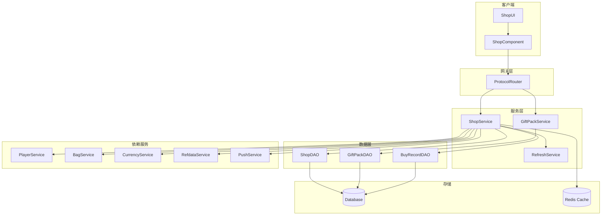
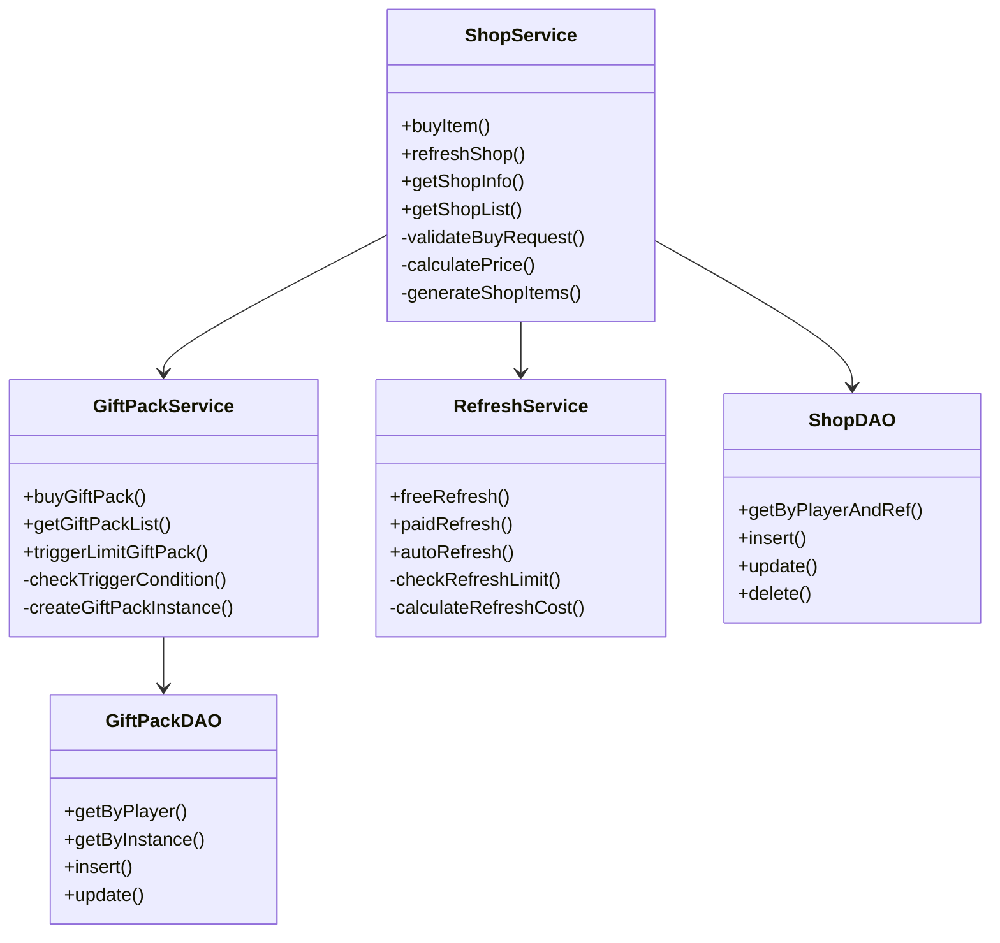
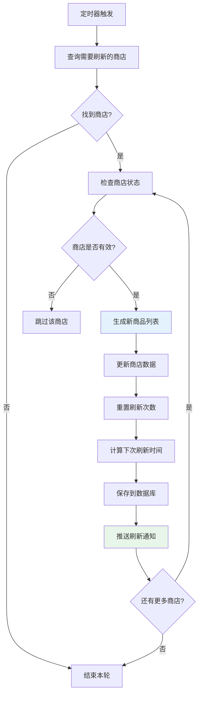
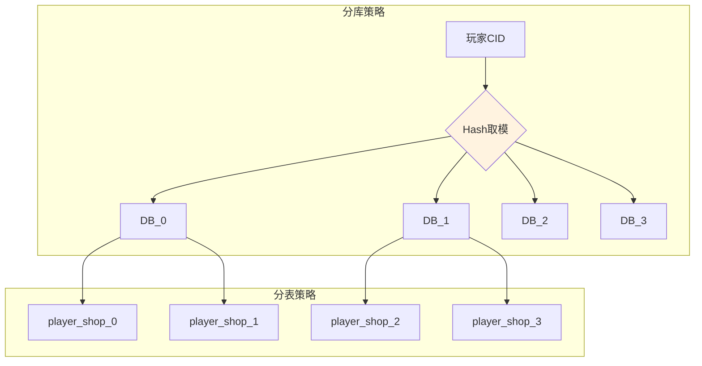

# 商店模块服务端开发文档

## 一、模块架构

### 1.1 模块概述

商店模块（Shop Module）负责管理游戏内商店系统，包括：
- 商品购买管理
- 商店刷新机制
- 礼包系统
- 限时礼包推送
- 购买记录管理

### 1.2 模块编号

协议模块编号: `p030`

---

## 二、核心数据结构

### 2.1 商店信息 (Shop_Info)

**路径**: `ClientProtocol/Common/ShopObj/Shop_Info.cs`

| 字段名 | 类型 | 说明 |
|--------|------|------|
| shopRefId | long | 商店配置ID |
| nextRefreshTimeMs | long | 下一次刷新时间戳 |
| refreshNum | int | 已刷新次数 |
| goodsList | List<Shop_ItemInfo> | 商品列表 |

### 2.2 商品信息 (Shop_ItemInfo)

**路径**: `ClientProtocol/Common/ShopObj/Shop_ItemInfo.cs`

| 字段名 | 类型 | 说明 |
|--------|------|------|
| instanceId | long | 商品实例ID |
| refId | long | 商品配置ID |
| buyCount | int | 已购买数量 |
| status | int | 商品状态 |

---

## 三、协议处理

### 3.1 请求协议 (GC2GS)

| 协议名 | 主序号 | 子序号 | 说明 |
|--------|--------|--------|------|
| GC2GS_030_001_ReqBuyShopItem | 30 | 1 | 购买商店商品 |
| GC2GS_030_002_ReqFreeRefreshShop | 30 | 2 | 免费刷新商店 |
| GC2GS_030_003_ReqRefreshShop | 30 | 3 | 付费刷新商店 |
| GC2GS_030_004_ReqAutoRefreshShop | 30 | 4 | 自动刷新商店 |
| GC2GS_030_021_ReqRefreshGiftPack | 30 | 21 | 刷新礼包 |
| GC2GS_030_022_ReqBuyGiftPack | 30 | 22 | 购买礼包 |

---

## 四、核心逻辑流程

### 4.1 购买商品流程

```
客户端                          服务端
   |                               |
   |--- ReqBuyShopItem ----------->|
   |                               | 1. 验证商店是否开放
   |                               | 2. 验证商品是否存在
   |                               | 3. 验证购买次数限制
   |                               | 4. 验证货币是否足够
   |                               | 5. 扣除货币
   |                               | 6. 发放商品
   |                               | 7. 更新购买记录
   |<-- RetBuyShopItem ------------|
   |<-- OnShopItemSoldOut --------| (如售罄，推送)
   |                               |
```

### 4.2 刷新商店流程

```
客户端                          服务端
   |                               |
   |--- ReqRefreshShop ----------->|
   |                               | 1. 验证刷新次数
   |                               | 2. 扣除刷新消耗
   |                               | 3. 随机生成新商品
   |                               | 4. 更新商店数据
   |<-- RetRefreshShop ------------|
   |<-- OnShopRefresh ------------| (推送商店刷新)
   |                               |
```

---

## 五、数据库设计

### 5.1 商店数据表

| 字段名 | 类型 | 说明 |
|--------|------|------|
| id | BIGINT | 主键 |
| player_id | BIGINT | 玩家ID |
| shop_ref_id | BIGINT | 商店配置ID |
| refresh_num | INT | 刷新次数 |
| goods_data | TEXT | 商品数据（JSON） |
| next_refresh_time | BIGINT | 下次刷新时间 |

### 5.2 购买记录表

| 字段名 | 类型 | 说明 |
|--------|------|------|
| id | BIGINT | 主键 |
| player_id | BIGINT | 玩家ID |
| shop_ref_id | BIGINT | 商店配置ID |
| item_ref_id | BIGINT | 商品配置ID |
| buy_count | INT | 购买数量 |
| buy_time | DATETIME | 购买时间 |

---

## 六、服务配置

### 6.1 协议注册

```csharp
// 协议主序号
public const byte SHOP_MODULE_ORDER = 30;

// 协议处理器注册
protocolHandler.Register<GC2GS_030_001_ReqBuyShopItem>(OnBuyShopItem);
protocolHandler.Register<GC2GS_030_002_ReqFreeRefreshShop>(OnFreeRefreshShop);
// ... 其他协议注册
```

### 6.2 服务依赖

商店模块依赖以下服务：
- 玩家数据服务 (PlayerDataService)
- 资源服务 (ResourceService)
- 配置数据服务 (RefdataService)
- 推送服务 (PushService)
- 随机服务 (RandomService)

---

## 七、服务端架构图

### 7.1 模块架构总览



### 7.2 服务类结构



---

## 八、完整协议处理器实现

### 8.1 商品购买协议处理器（完整版）

```java
/**
 * 处理购买商店商品请求 - 完整版
 */
public void OnReqBuyShopItem(NPPlayerContext _context, GC2GS_030_001_ReqBuyShopItem _proto)
{
    NPUSUserData userData = _context.getUserData();
    long shopRefId = _proto.getShopRefId();
    long instanceId = _proto.getInstanceId();
    long count = _proto.getCount();

    // 参数验证
    if (count <= 0 || count > 999) {
        _context.sendError(CommErr.PARAM_ERROR, "购买数量无效");
        return;
    }

    // 1. 获取商店配置
    RefShop shopRef = RefShop.getMgr().get(shopRefId);
    if (shopRef == null) {
        _context.sendError(CommErr.REF_NOT_FOUND, "商店配置不存在");
        return;
    }

    // 2. 检查商店是否解锁
    if (!checkShopUnlock(userData, shopRef)) {
        _context.sendError(ShopErr.SHOP_NOT_UNLOCKED, "商店未解锁");
        return;
    }

    // 3. 检查商店是否开放
    if (!checkShopOpen(shopRef)) {
        _context.sendError(ShopErr.SHOP_CLOSED, "商店未开放");
        return;
    }

    // 4. 获取商店数据
    ShopBO shopBO = shopDao.getByPlayerAndRef(userData.cid, shopRefId);
    if (shopBO == null) {
        _context.sendError(ShopErr.SHOP_NOT_FOUND, "商店数据不存在");
        return;
    }

    // 5. 查找商品
    ShopItemInfo item = shopBO.findItem(instanceId);
    if (item == null) {
        _context.sendError(ShopErr.ITEM_NOT_FOUND, "商品不存在");
        return;
    }

    // 6. 检查商品状态
    if (item.status != ENPShopItemStatus.AVAILABLE.ordinal()) {
        _context.sendError(ShopErr.ITEM_SOLD_OUT, "商品已售罄");
        return;
    }

    // 7. 获取商品配置
    RefShopItem itemRef = RefShopItem.getMgr().get(item.refId);
    if (itemRef == null) {
        _context.sendError(CommErr.REF_NOT_FOUND, "商品配置不存在");
        return;
    }

    // 8. 检查购买次数
    int totalBuyLimit = getTotalBuyLimit(itemRef);
    if (totalBuyLimit > 0 && item.buyCount + count > totalBuyLimit) {
        _context.sendError(ShopErr.BUY_LIMIT_REACHED, "购买次数已达上限");
        return;
    }

    // 9. 计算价格
    long unitPrice = (long)(itemRef.price.count * item.discount);
    long totalCost = unitPrice * count;

    // 10. 检查货币
    ECurrency currencyType = ECurrency.values()[itemRef.price.type];
    long playerCurrency = userData.getCurrencyComponent().getItemCount(currencyType.ordinal());
    if (playerCurrency < totalCost) {
        _context.sendError(CommErr.CURRENCY_NOT_ENOUGH, "货币不足");
        return;
    }

    // 11. 检查背包空间
    List<NPCommon_ItemInfo> rewards = calculateRewards(itemRef, count);
    if (!userData.getBagComponent().hasSpace(rewards)) {
        _context.sendError(CommErr.BAG_FULL, "背包已满");
        return;
    }

    // 12. 开始事务处理
    userData.lockUser();
    try {
        // 扣除货币
        userData.getCurrencyComponent().costItem(
            currencyType.ordinal(), totalCost, "商店购买", _context);

        // 发放物品
        userData.getBagComponent().addItems(rewards, "商店购买", _context);

        // 更新购买记录
        item.buyCount += count;
        shopDao.updateShopItem(userData.cid, item);

        // 记录购买日志
        logPurchase(userData, shopRefId, item, count, totalCost);

        // 发送响应
        GS2GC_030_001_RetBuyShopItem res = new GS2GC_030_001_RetBuyShopItem();
        res.setResult(0);
        res.setShopRefId(shopRefId);
        res.setInstanceId(instanceId);
        res.setBuyCount((int)count);
        res.setTotalBuyCount(item.buyCount);
        res.setCostValue(totalCost);
        res.setRewardList(rewards);
        userData.sendMsgToGC(res);

        // 检查是否售罄
        if (totalBuyLimit > 0 && item.buyCount >= totalBuyLimit) {
            item.status = ENPShopItemStatus.SOLD_OUT.ordinal();
            pushItemSoldOut(userData, shopRefId, item);
        }

        // 更新缓存
        updateShopCache(userData.cid, shopBO);

    } catch (Exception e) {
        USLog.error(getServer(), "购买商品失败: cid={}, shopRefId={}, instanceId={}",
            userData.cid, shopRefId, instanceId, e);
        _context.sendError(CommErr.INTERNAL_ERROR, "购买失败");
    } finally {
        userData.unlockUser();
    }
}
```

### 8.2 商店刷新协议处理器

```java
/**
 * 处理付费刷新商店请求
 */
public void OnReqRefreshShop(NPPlayerContext _context, GC2GS_030_003_ReqRefreshShop _proto)
{
    NPUSUserData userData = _context.getUserData();
    long shopRefId = _proto.getShopRefId();

    // 1. 获取商店配置
    RefShop shopRef = RefShop.getMgr().get(shopRefId);
    if (shopRef == null) {
        _context.sendError(CommErr.REF_NOT_FOUND);
        return;
    }

    // 2. 检查刷新次数限制
    int maxRefreshCount = getMaxRefreshCount(shopRef, userData);
    ShopBO shopBO = shopDao.getByPlayerAndRef(userData.cid, shopRefId);
    if (shopBO == null) {
        shopBO = initShop(userData, shopRefId);
    }

    if (maxRefreshCount > 0 && shopBO.refreshNum >= maxRefreshCount) {
        _context.sendError(ShopErr.REFRESH_LIMIT_REACHED, "刷新次数已达上限");
        return;
    }

    // 3. 计算刷新费用
    long refreshCost = calculateRefreshCost(shopRef, shopBO.refreshNum);

    // 4. 检查货币
    ECurrency currencyType = ECurrency.values()[shopRef.refresh_cost_type];
    long playerCurrency = userData.getCurrencyComponent().getItemCount(currencyType.ordinal());
    if (playerCurrency < refreshCost) {
        _context.sendError(CommErr.CURRENCY_NOT_ENOUGH, "货币不足");
        return;
    }

    // 5. 开始事务
    userData.lockUser();
    try {
        // 扣除费用
        userData.getCurrencyComponent().costItem(
            currencyType.ordinal(), refreshCost, "商店刷新", _context);

        // 生成新商品
        List<ShopItemInfo> newGoods = generateShopItems(userData, shopRef);

        // 更新商店数据
        shopBO.goodsList = newGoods;
        shopBO.refreshNum++;
        shopBO.nextRefreshTime = calculateNextRefreshTime(shopRef);
        shopDao.updateShop(shopBO);

        // 记录刷新日志
        logRefresh(userData, shopRefId, 1, refreshCost);

        // 发送响应
        GS2GC_030_003_RetRefreshShop res = new GS2GC_030_003_RetRefreshShop();
        res.setResult(0);
        res.setShopRefId(shopRefId);
        res.setShopInfo(shopBO.toShopInfo());
        res.setCostValue(refreshCost);
        userData.sendMsgToGC(res);

        // 更新缓存
        updateShopCache(userData.cid, shopBO);

    } catch (Exception e) {
        USLog.error(getServer(), "刷新商店失败", e);
        _context.sendError(CommErr.INTERNAL_ERROR);
    } finally {
        userData.unlockUser();
    }
}
```

---

## 九、性能优化

### 9.1 缓存策略

```java
/**
 * 商店缓存管理
 */
public class ShopCacheManager
{
    private static final int CACHE_EXPIRE_SECONDS = 300; // 5分钟
    private static final String CACHE_KEY_PREFIX = "shop:";

    /**
     * 获取商店缓存
     */
    public ShopBO getShopCache(long cid, long shopRefId)
    {
        String key = CACHE_KEY_PREFIX + cid + ":" + shopRefId;
        String json = RedisClient.get(key);
        if (json != null) {
            return ShopBO.fromJson(json);
        }
        return null;
    }

    /**
     * 设置商店缓存
     */
    public void setShopCache(long cid, ShopBO shopBO)
    {
        String key = CACHE_KEY_PREFIX + cid + ":" + shopBO.shopRefId;
        RedisClient.setex(key, CACHE_EXPIRE_SECONDS, shopBO.toJson());
    }

    /**
     * 删除商店缓存
     */
    public void deleteShopCache(long cid, long shopRefId)
    {
        String key = CACHE_KEY_PREFIX + cid + ":" + shopRefId;
        RedisClient.del(key);
    }

    /**
     * 批量预热缓存
     */
    public void warmupCache(long cid)
    {
        // 加载玩家所有商店数据到缓存
        List<ShopBO> shops = shopDao.getByPlayer(cid);
        for (ShopBO shop : shops) {
            setShopCache(cid, shop);
        }
    }
}
```

### 9.2 批量操作优化

```java
/**
 * 批量获取商店信息
 */
public List<Shop_Info> batchGetShopInfo(long cid, List<Long> shopRefIds)
{
    List<Shop_Info> result = new ArrayList<>();

    // 先从缓存获取
    Map<Long, ShopBO> cachedShops = new HashMap<>();
    List<Long> uncachedIds = new ArrayList<>();

    for (Long shopRefId : shopRefIds) {
        ShopBO cached = shopCacheManager.getShopCache(cid, shopRefId);
        if (cached != null) {
            cachedShops.put(shopRefId, cached);
        } else {
            uncachedIds.add(shopRefId);
        }
    }

    // 批量从数据库获取未缓存的
    if (!uncachedIds.isEmpty()) {
        List<ShopBO> dbShops = shopDao.batchGetByPlayerAndRefs(cid, uncachedIds);
        for (ShopBO shop : dbShops) {
            cachedShops.put(shop.shopRefId, shop);
            shopCacheManager.setShopCache(cid, shop);
        }
    }

    // 转换为协议对象
    for (Long shopRefId : shopRefIds) {
        ShopBO shop = cachedShops.get(shopRefId);
        if (shop != null) {
            result.add(shop.toShopInfo());
        }
    }

    return result;
}
```

### 9.3 异步日志处理

```java
/**
 * 异步日志写入
 */
public class ShopLogService
{
    private static final BlockingQueue<ShopLogRecord> logQueue =
        new LinkedBlockingQueue<>(10000);
    private static volatile boolean running = true;

    static {
        // 启动日志写入线程
        Thread logThread = new Thread(() -> {
            while (running || !logQueue.isEmpty()) {
                try {
                    List<ShopLogRecord> batch = new ArrayList<>();
                    ShopLogRecord first = logQueue.poll(100, TimeUnit.MILLISECONDS);
                    if (first != null) {
                        batch.add(first);
                        logQueue.drainTo(batch, 100);
                        batchWriteLogs(batch);
                    }
                } catch (InterruptedException e) {
                    Thread.currentThread().interrupt();
                    break;
                }
            }
        }, "ShopLog-Writer");
        logThread.setDaemon(true);
        logThread.start();
    }

    /**
     * 添加日志记录
     */
    public static void addLog(ShopLogRecord record)
    {
        if (!logQueue.offer(record)) {
            USLog.warn("Shop log queue is full, discard log");
        }
    }

    private static void batchWriteLogs(List<ShopLogRecord> logs)
    {
        // 批量写入数据库
        shopLogDao.batchInsert(logs);
    }
}
```

---

## 十、安全检查

### 10.1 输入验证

```java
/**
 * 商店模块输入验证
 */
public class ShopInputValidator
{
    /**
     * 验证购买请求参数
     */
    public static boolean validateBuyRequest(GC2GS_030_001_ReqBuyShopItem req)
    {
        // 商店ID检查
        if (req.getShopRefId() <= 0) {
            return false;
        }

        // 商品实例ID检查
        if (req.getInstanceId() <= 0) {
            return false;
        }

        // 购买数量检查
        if (req.getCount() <= 0 || req.getCount() > 999) {
            return false;
        }

        return true;
    }

    /**
     * 验证刷新请求参数
     */
    public static boolean validateRefreshRequest(GC2GS_030_003_ReqRefreshShop req)
    {
        if (req.getShopRefId() <= 0) {
            return false;
        }
        return true;
    }

    /**
     * 验证礼包购买请求
     */
    public static boolean validateGiftPackRequest(GC2GS_030_022_ReqBuyGiftPack req)
    {
        if (req.getGiftPackId() <= 0) {
            return false;
        }
        // 限时礼包必须有实例ID
        return true;
    }
}
```

### 10.2 频率限制

```java
/**
 * 商店操作频率限制
 */
public class ShopRateLimiter
{
    private static final int BUY_LIMIT_PER_SECOND = 10;
    private static final int REFRESH_LIMIT_PER_SECOND = 3;
    private static final int GIFT_PACK_LIMIT_PER_SECOND = 5;

    /**
     * 检查购买频率
     */
    public static boolean checkBuyRate(long cid)
    {
        String key = "shop:buy:" + cid;
        return checkRate(key, BUY_LIMIT_PER_SECOND, 1);
    }

    /**
     * 检查刷新频率
     */
    public static boolean checkRefreshRate(long cid)
    {
        String key = "shop:refresh:" + cid;
        return checkRate(key, REFRESH_LIMIT_PER_SECOND, 1);
    }

    private static boolean checkRate(String key, int limit, int windowSeconds)
    {
        Long count = RedisClient.incr(key);
        if (count == 1) {
            RedisClient.expire(key, windowSeconds);
        }
        return count <= limit;
    }
}
```

### 10.3 交易安全检查

```java
/**
 * 交易安全检查
 */
public class ShopSecurityChecker
{
    /**
     * 检查交易安全性
     */
    public static SecurityCheckResult checkTransactionSecurity(
        NPUSUserData userData, long totalCost, long shopRefId)
    {
        SecurityCheckResult result = new SecurityCheckResult();

        // 1. 检查交易金额是否合理
        if (totalCost > getDailyTransactionLimit(userData)) {
            result.setRisk(true);
            result.setReason("交易金额超过每日限额");
            return result;
        }

        // 2. 检查交易频率
        long recentTransactionCount = getRecentTransactionCount(userData.cid);
        if (recentTransactionCount > 100) { // 1小时内超过100次
            result.setRisk(true);
            result.setReason("交易频率异常");
            return result;
        }

        // 3. 检查账户状态
        if (userData.getPlayerComponent().isBanned()) {
            result.setRisk(true);
            result.setReason("账户已被封禁");
            return result;
        }

        result.setRisk(false);
        return result;
    }

    /**
     * 获取每日交易限额
     */
    private static long getDailyTransactionLimit(NPUSUserData userData)
    {
        // VIP用户有更高的限额
        int vipLevel = userData.getPlayerComponent().getVipLevel();
        return 10000L + vipLevel * 5000L;
    }

    /**
     * 获取最近交易次数
     */
    private static long getRecentTransactionCount(long cid)
    {
        String key = "shop:transaction:" + cid;
        String count = RedisClient.get(key);
        return count == null ? 0 : Long.parseLong(count);
    }
}
```

---

## 十一、定时任务

### 11.1 商店自动刷新

```java
/**
 * 商店自动刷新定时任务
 */
public class ShopAutoRefreshTask implements Runnable
{
    @Override
    public void run()
    {
        long currentTime = System.currentTimeMillis();

        // 查找需要刷新的商店
        List<ShopBO> shopsToRefresh = shopDao.findShopsNeedRefresh(currentTime);

        for (ShopBO shop : shopsToRefresh) {
            try {
                refreshShop(shop);
            } catch (Exception e) {
                USLog.error("自动刷新商店失败: shopRefId={}", shop.shopRefId, e);
            }
        }
    }

    private void refreshShop(ShopBO shop)
    {
        RefShop shopRef = RefShop.getMgr().get(shop.shopRefId);
        if (shopRef == null) return;

        // 生成新商品
        List<ShopItemInfo> newGoods = generateShopItems(shopRef);

        // 更新商店数据
        shop.goodsList = newGoods;
        shop.refreshNum = 0; // 重置刷新次数
        shop.freeRefreshUsed = 0; // 重置免费刷新次数
        shop.nextRefreshTime = calculateNextRefreshTime(shopRef);
        shopDao.updateShop(shop);

        // 推送刷新通知
        pushShopRefresh(shop);
    }
}
```

### 11.2 礼包过期检查

```java
/**
 * 礼包过期检查定时任务
 */
public class GiftPackExpireTask implements Runnable
{
    @Override
    public void run()
    {
        long currentTime = System.currentTimeMillis();

        // 查找过期的礼包
        List<GiftPackBO> expiredGifts = giftPackDao.findExpired(currentTime);

        for (GiftPackBO gift : expiredGifts) {
            try {
                processExpiredGiftPack(gift);
            } catch (Exception e) {
                USLog.error("处理过期礼包失败: giftPackId={}", gift.giftPackId, e);
            }
        }
    }

    private void processExpiredGiftPack(GiftPackBO gift)
    {
        // 更新状态为过期
        gift.status = ENPGiftPackStatus.EXPIRED.ordinal();
        giftPackDao.update(gift);

        // 推送移除通知
        pushGiftPackRemove(gift);

        // 记录日志
        logGiftPackExpire(gift);
    }
}
```

---

## 十二、监控与告警

### 12.1 性能监控指标

```java
/**
 * 商店模块监控
 */
public class ShopMetrics
{
    private static final Meter buyRequestMeter = MeterBuilder.create("shop.buy.request");
    private static final Meter buySuccessMeter = MeterBuilder.create("shop.buy.success");
    private static final Meter buyFailMeter = MeterBuilder.create("shop.buy.fail");
    private static final Timer buyLatencyTimer = TimerBuilder.create("shop.buy.latency");

    /**
     * 记录购买请求
     */
    public static void recordBuyRequest()
    {
        buyRequestMeter.mark();
    }

    /**
     * 记录购买成功
     */
    public static void recordBuySuccess(long latencyMs)
    {
        buySuccessMeter.mark();
        buyLatencyTimer.update(latencyMs, TimeUnit.MILLISECONDS);
    }

    /**
     * 记录购买失败
     */
    public static void recordBuyFail(int errorCode)
    {
        buyFailMeter.mark();
        CounterBuilder.create("shop.buy.fail." + errorCode).inc();
    }

    /**
     * 获取购买成功率
     */
    public static double getBuySuccessRate()
    {
        return (double) buySuccessMeter.getCount() / buyRequestMeter.getCount();
    }
}
```

### 12.2 异常告警

```java
/**
 * 商店模块告警
 */
public class ShopAlerter
{
    private static final double SUCCESS_RATE_THRESHOLD = 0.95;
    private static final int LATENCY_THRESHOLD_MS = 500;

    /**
     * 检查并告警
     */
    public static void checkAndAlert()
    {
        // 检查成功率
        double successRate = ShopMetrics.getBuySuccessRate();
        if (successRate < SUCCESS_RATE_THRESHOLD) {
            AlertService.sendAlert(
                AlertLevel.WARNING,
                "商店模块购买成功率过低: " + String.format("%.2f%%", successRate * 100)
            );
        }

        // 检查延迟
        long avgLatency = ShopMetrics.getAvgBuyLatency();
        if (avgLatency > LATENCY_THRESHOLD_MS) {
            AlertService.sendAlert(
                AlertLevel.WARNING,
                "商店模块购买延迟过高: " + avgLatency + "ms"
            );
        }
    }
}
```

---

## 十三、定时任务详解

### 13.1 商店自动刷新定时任务



```java
/**
 * 商店自动刷新定时任务
 */
public class ShopAutoRefreshTask implements Runnable
{
    private static final Logger log = LoggerFactory.getLogger(ShopAutoRefreshTask.class);

    @Override
    public void run()
    {
        long currentTime = System.currentTimeMillis();

        try {
            // 查询需要刷新的商店
            List<PlayerShop> shopsToRefresh = shopDao.findShopsNeedRefresh(currentTime);

            log.info("商店自动刷新任务开始，待刷新商店数量: {}", shopsToRefresh.size());

            for (PlayerShop shop : shopsToRefresh) {
                try {
                    refreshSingleShop(shop);
                } catch (Exception e) {
                    log.error("刷新商店失败: cid={}, shopRefId={}",
                        shop.cid, shop.shopRefId, e);
                }
            }

            log.info("商店自动刷新任务完成");

        } catch (Exception e) {
            log.error("商店自动刷新任务异常", e);
        }
    }

    /**
     * 刷新单个商店
     */
    private void refreshSingleShop(PlayerShop shop)
    {
        // 获取商店配置
        RefShop shopRef = RefShop.getMgr().get(shop.shopRefId);
        if (shopRef == null) {
            log.warn("商店配置不存在: {}", shop.shopRefId);
            return;
        }

        // 生成新商品列表
        List<ShopItemInfo> newGoods = generateShopItems(shopRef);

        // 更新商店数据
        shop.goodsList = newGoods;
        shop.refreshNum = 0;
        shop.freeRefreshUsed = 0;
        shop.nextRefreshTime = calculateNextRefreshTime(shopRef);
        shop.updateTime = new Date();

        // 保存到数据库
        shopDao.update(shop);

        // 推送刷新通知（如果玩家在线）
        pushShopRefresh(shop);

        log.info("商店刷新完成: cid={}, shopRefId={}", shop.cid, shop.shopRefId);
    }

    /**
     * 查询需要刷新的商店
     */
    public List<PlayerShop> findShopsNeedRefresh(long currentTime)
    {
        String sql = "SELECT * FROM player_shop WHERE next_refresh_time > 0 AND next_refresh_time <= ?";
        return jdbcTemplate.query(sql, new Object[]{currentTime}, rowMapper);
    }
}
```

### 13.2 礼包过期检查任务

```java
/**
 * 礼包过期检查定时任务
 */
public class GiftPackExpireTask implements Runnable
{
    @Override
    public void run()
    {
        long currentTime = System.currentTimeMillis();

        try {
            // 查询过期的礼包
            List<PlayerGiftPack> expiredGifts = giftPackDao.findExpired(currentTime);

            log.info("礼包过期检查任务开始，过期礼包数量: {}", expiredGifts.size());

            for (PlayerGiftPack gift : expiredGifts) {
                try {
                    processExpiredGiftPack(gift);
                } catch (Exception e) {
                    log.error("处理过期礼包失败: giftPackId={}", gift.giftPackId, e);
                }
            }

        } catch (Exception e) {
            log.error("礼包过期检查任务异常", e);
        }
    }

    /**
     * 处理过期礼包
     */
    private void processExpiredGiftPack(PlayerGiftPack gift)
    {
        // 更新状态为过期
        gift.status = ENPGiftPackStatus.EXPIRED.ordinal();
        gift.updateTime = new Date();
        giftPackDao.update(gift);

        // 推送移除通知
        pushGiftPackRemove(gift);

        log.info("礼包已过期: cid={}, giftPackId={}", gift.cid, gift.giftPackId);
    }
}
```

### 13.3 定时任务注册

```java
/**
 * 商店模块定时任务注册
 */
public class ShopTaskConfig
{
    /**
     * 注册定时任务
     */
    public static void registerTasks()
    {
        // 商店自动刷新任务 - 每分钟执行一次
        TaskScheduler.scheduleAtFixedRate(
            new ShopAutoRefreshTask(),
            1, TimeUnit.MINUTES
        );

        // 礼包过期检查任务 - 每5分钟执行一次
        TaskScheduler.scheduleAtFixedRate(
            new GiftPackExpireTask(),
            5, TimeUnit.MINUTES
        );

        // 每日重置任务 - 每日0点执行
        TaskScheduler.scheduleDaily(
            new ShopDailyResetTask(),
            0, 0  // 00:00
        );

        // 每周重置任务 - 每周一0点执行
        TaskScheduler.scheduleWeekly(
            new ShopWeeklyResetTask(),
            Calendar.MONDAY, 0, 0
        );

        log.info("商店模块定时任务注册完成");
    }
}

/**
 * 商店每日重置任务
 */
public class ShopDailyResetTask implements Runnable
{
    @Override
    public void run()
    {
        log.info("商店每日重置任务开始");

        try {
            // 重置所有玩家的商店购买次数
            resetAllPlayerBuyRecords();

            // 重置刷新次数
            resetAllRefreshCounts();

            log.info("商店每日重置任务完成");

        } catch (Exception e) {
            log.error("商店每日重置任务异常", e);
        }
    }

    private void resetAllPlayerBuyRecords()
    {
        // 清空每日限购记录表
        String sql = "DELETE FROM player_shop_buy_record WHERE buy_limit_type = 1";
        jdbcTemplate.update(sql);
    }

    private void resetAllRefreshCounts()
    {
        // 重置所有商店的刷新次数
        String sql = "UPDATE player_shop SET refresh_num = 0, free_refresh_used = 0";
        jdbcTemplate.update(sql);
    }
}
```

---

## 十四、完整业务服务实现

### 14.1 ShopService 完整实现

```java
/**
 * 商店服务 - 完整实现
 */
@Service
public class ShopService
{
    @Autowired
    private ShopDao shopDao;

    @Autowired
    private ShopBuyRecordDao buyRecordDao;

    @Autowired
    private CurrencyService currencyService;

    @Autowired
    private BagService bagService;

    @Autowired
    private PushService pushService;

    /**
     * 获取商店列表
     */
    public List<Shop_Info> getShopList(long cid)
    {
        List<Shop_Info> result = new ArrayList<>();

        // 获取所有商店配置
        List<RefShop> allShops = RefShop.getMgr().getAll();

        for (RefShop shopRef : allShops) {
            // 检查解锁条件
            if (!checkShopUnlock(cid, shopRef)) {
                continue;
            }

            // 获取玩家商店数据
            PlayerShop shop = shopDao.getByPlayerAndRef(cid, shopRef.id);
            if (shop == null) {
                shop = initPlayerShop(cid, shopRef.id);
            }

            result.add(shop.toShopInfo());
        }

        return result;
    }

    /**
     * 获取商店信息
     */
    public Shop_Info getShopInfo(long cid, long shopRefId)
    {
        PlayerShop shop = shopDao.getByPlayerAndRef(cid, shopRefId);
        if (shop == null) {
            shop = initPlayerShop(cid, shopRefId);
        }
        return shop.toShopInfo();
    }

    /**
     * 购买商品
     */
    public BuyResult buyItem(long cid, long shopRefId, long instanceId, int count)
    {
        BuyResult result = new BuyResult();

        // 参数校验
        if (count <= 0 || count > 999) {
            result.setError(CommErr.PARAM_ERROR, "购买数量无效");
            return result;
        }

        // 获取商店配置
        RefShop shopRef = RefShop.getMgr().get(shopRefId);
        if (shopRef == null) {
            result.setError(CommErr.REF_NOT_FOUND, "商店配置不存在");
            return result;
        }

        // 检查商店解锁
        if (!checkShopUnlock(cid, shopRef)) {
            result.setError(ShopErr.SHOP_NOT_UNLOCKED, "商店未解锁");
            return result;
        }

        // 检查商店是否开放
        if (!checkShopOpen(shopRef)) {
            result.setError(ShopErr.SHOP_CLOSED, "商店已关闭");
            return result;
        }

        // 获取商店数据
        PlayerShop shop = shopDao.getByPlayerAndRef(cid, shopRefId);
        if (shop == null) {
            result.setError(ShopErr.SHOP_NOT_FOUND, "商店数据不存在");
            return result;
        }

        // 查找商品
        ShopItemInfo item = shop.findItem(instanceId);
        if (item == null) {
            result.setError(ShopErr.ITEM_NOT_FOUND, "商品不存在");
            return result;
        }

        // 检查商品状态
        if (item.status == ENPShopItemStatus.SOLD_OUT.ordinal()) {
            result.setError(ShopErr.ITEM_SOLD_OUT, "商品已售罄");
            return result;
        }

        // 获取商品配置
        RefShopItem itemRef = RefShopItem.getMgr().get(item.refId);
        if (itemRef == null) {
            result.setError(CommErr.REF_NOT_FOUND, "商品配置不存在");
            return result;
        }

        // 检查购买次数
        int buyLimit = getTotalBuyLimit(itemRef);
        if (buyLimit > 0 && item.buyCount + count > buyLimit) {
            result.setError(ShopErr.BUY_LIMIT_REACHED, "购买次数已达上限");
            return result;
        }

        // 计算价格
        long unitPrice = calculateItemPrice(item, itemRef);
        long totalCost = unitPrice * count;

        // 检查货币
        ECurrency currencyType = ECurrency.values()[itemRef.cost_item.item.itemId];
        if (!currencyService.hasEnough(cid, currencyType, totalCost)) {
            result.setError(CommErr.CURRENCY_NOT_ENOUGH, "货币不足");
            return result;
        }

        // 检查背包空间
        List<RewardItem> rewards = buildRewardList(itemRef, count);
        if (!bagService.hasSpace(cid, rewards)) {
            result.setError(CommErr.BAG_FULL, "背包已满");
            return result;
        }

        // 执行购买事务
        try {
            // 扣除货币
            currencyService.cost(cid, currencyType, totalCost, "商店购买");

            // 发放商品
            bagService.addItems(cid, rewards, "商店购买");

            // 更新购买记录
            item.buyCount += count;
            shopDao.updateShopItem(cid, item);

            // 记录购买日志
            logPurchase(cid, shopRefId, item, count, totalCost, currencyType);

            // 设置成功结果
            result.setSuccess(rewards, totalCost);

            // 检查是否售罄
            if (buyLimit > 0 && item.buyCount >= buyLimit) {
                item.status = ENPShopItemStatus.SOLD_OUT.ordinal();
                pushItemSoldOut(cid, shopRefId, item);
            }

        } catch (Exception e) {
            log.error("购买商品失败", e);
            result.setError(CommErr.INTERNAL_ERROR, "购买失败");
        }

        return result;
    }

    /**
     * 刷新商店
     */
    public RefreshResult refreshShop(long cid, long shopRefId, boolean isFree)
    {
        RefreshResult result = new RefreshResult();

        // 获取商店配置
        RefShop shopRef = RefShop.getMgr().get(shopRefId);
        if (shopRef == null) {
            result.setError(CommErr.REF_NOT_FOUND, "商店配置不存在");
            return result;
        }

        // 获取商店数据
        PlayerShop shop = shopDao.getByPlayerAndRef(cid, shopRefId);
        if (shop == null) {
            shop = initPlayerShop(cid, shopRefId);
        }

        // 处理免费刷新
        if (isFree) {
            int freeCount = getFreeRefreshCount(cid, shopRef);
            if (freeCount <= 0) {
                result.setError(ShopErr.FREE_REFRESH_USED, "免费刷新次数已用完");
                return result;
            }
        } else {
            // 检查付费刷新限制
            if (shopRef.pay_refresh_limit > 0 && shop.refreshNum >= shopRef.pay_refresh_limit) {
                result.setError(ShopErr.REFRESH_LIMIT_REACHED, "刷新次数已达上限");
                return result;
            }

            // 计算刷新费用
            long cost = calculateRefreshCost(shopRef, shop.refreshNum);
            if (!currencyService.hasEnough(cid, ECurrency.DIAMOND, cost)) {
                result.setError(CommErr.CURRENCY_NOT_ENOUGH, "货币不足");
                return result;
            }

            // 扣除费用
            currencyService.cost(cid, ECurrency.DIAMOND, cost, "商店刷新");
            result.setCost(cost);
        }

        // 生成新商品
        List<ShopItemInfo> newGoods = generateShopItems(shopRef);
        shop.goodsList = newGoods;
        shop.refreshNum++;
        shop.nextRefreshTime = calculateNextRefreshTime(shopRef);

        // 保存数据
        shopDao.update(shop);

        // 记录刷新日志
        logRefresh(cid, shopRefId, isFree ? 0 : 1, result.getCost());

        result.setShopInfo(shop.toShopInfo());
        return result;
    }

    /**
     * 初始化玩家商店
     */
    private PlayerShop initPlayerShop(long cid, long shopRefId)
    {
        RefShop shopRef = RefShop.getMgr().get(shopRefId);
        if (shopRef == null) {
            return null;
        }

        PlayerShop shop = new PlayerShop();
        shop.cid = cid;
        shop.shopRefId = shopRefId;
        shop.goodsList = generateShopItems(shopRef);
        shop.refreshNum = 0;
        shop.freeRefreshUsed = 0;
        shop.nextRefreshTime = calculateNextRefreshTime(shopRef);
        shop.createTime = new Date();
        shop.updateTime = new Date();

        shopDao.insert(shop);
        return shop;
    }

    /**
     * 生成商店商品
     */
    private List<ShopItemInfo> generateShopItems(RefShop shopRef)
    {
        List<ShopItemInfo> items = new ArrayList<>();

        // 获取商品池
        List<RefShopItem> itemPool = RefShopItem.getMgr().getByShopId(shopRef.id);
        if (itemPool == null || itemPool.isEmpty()) {
            return items;
        }

        // 构建权重选择器
        WeightedSelector<RefShopItem> selector = new WeightedSelector<>();
        for (RefShopItem itemRef : itemPool) {
            selector.add(itemRef, itemRef.weight);
        }

        // 随机选择商品
        Set<Long> selectedIds = new HashSet<>();
        for (int i = 0; i < shopRef.slot_count; i++) {
            RefShopItem selected = selector.select();

            // 避免重复
            int attempts = 0;
            while (selectedIds.contains(selected.id) && attempts < 10) {
                selected = selector.select();
                attempts++;
            }

            ShopItemInfo item = createShopItem(selected);
            items.add(item);
            selectedIds.add(selected.id);
        }

        return items;
    }

    /**
     * 创建商品实例
     */
    private ShopItemInfo createShopItem(RefShopItem itemRef)
    {
        ShopItemInfo item = new ShopItemInfo();
        item.instanceId = IdGenerator.nextId();
        item.refId = itemRef.id;
        item.buyCount = 0;
        item.status = ENPShopItemStatus.AVAILABLE.ordinal();

        // 随机折扣
        if (itemRef.discount_id > 0) {
            item.discountId = itemRef.discount_id;
        } else {
            // 随机生成折扣
            item.discountId = randomDiscount();
        }

        return item;
    }

    /**
     * 计算商品价格
     */
    private long calculateItemPrice(ShopItemInfo item, RefShopItem itemRef)
    {
        long basePrice = itemRef.cost_item.count;

        // 应用折扣
        if (item.discountId > 0) {
            RefShopItemDiscount discount = RefShopItemDiscount.getMgr().get(item.discountId);
            if (discount != null) {
                basePrice = basePrice * discount.discount / 10000;
            }
        }

        // 最低价格保护
        return Math.max(basePrice, 1);
    }

    /**
     * 计算刷新费用
     */
    private long calculateRefreshCost(RefShop shopRef, int refreshNum)
    {
        TimesPriceRefObj priceRef = TimesPriceRefObj.getMgr().get(
            shopRef.pay_refresh_times_price_id, refreshNum + 1);

        if (priceRef != null && priceRef.cost_item_formula != null) {
            return priceRef.cost_item_formula.calculate();
        }

        return 50; // 默认50钻石
    }

    /**
     * 计算下次刷新时间
     */
    private long calculateNextRefreshTime(RefShop shopRef)
    {
        if (shopRef.refresh_type == ENPShopRefreshType.MANUAL.ordinal()) {
            return 0; // 手动刷新，无自动刷新时间
        }

        Calendar calendar = Calendar.getInstance();
        int currentHour = calendar.get(Calendar.HOUR_OF_DAY);

        if (shopRef.refresh_type == ENPShopRefreshType.DAILY.ordinal()) {
            // 找到下一个刷新时间点
            for (int hour : shopRef.auto_refresh_time_list) {
                if (hour > currentHour) {
                    calendar.set(Calendar.HOUR_OF_DAY, hour);
                    calendar.set(Calendar.MINUTE, 0);
                    calendar.set(Calendar.SECOND, 0);
                    return calendar.getTimeInMillis();
                }
            }
            // 如果今天的刷新点都过了，设置为明天第一个
            calendar.add(Calendar.DAY_OF_MONTH, 1);
            calendar.set(Calendar.HOUR_OF_DAY, shopRef.auto_refresh_time_list.get(0));
            calendar.set(Calendar.MINUTE, 0);
            calendar.set(Calendar.SECOND, 0);
            return calendar.getTimeInMillis();
        }

        if (shopRef.refresh_type == ENPShopRefreshType.WEEKLY.ordinal()) {
            calendar.set(Calendar.DAY_OF_WEEK, Calendar.MONDAY);
            calendar.set(Calendar.HOUR_OF_DAY, 0);
            calendar.add(Calendar.WEEK_OF_YEAR, 1);
            return calendar.getTimeInMillis();
        }

        return 0;
    }
}
```

---

## 十五、监控与告警配置

### 15.1 监控指标配置

```java
/**
 * 商店模块监控配置
 */
@Configuration
public class ShopMetricsConfig
{
    @Bean
    public MeterRegistryCustomizer<MeterRegistry> shopMetrics()
    {
        return registry -> {
            // 购买请求计数器
            Counter.builder("shop.buy.request")
                .description("商店购买请求数")
                .register(registry);

            // 购买成功计数器
            Counter.builder("shop.buy.success")
                .description("商店购买成功数")
                .register(registry);

            // 购买失败计数器（按错误码分类）
            Counter.builder("shop.buy.fail")
                .description("商店购买失败数")
                .tag("error", "unknown")
                .register(registry);

            // 购买延迟计时器
            Timer.builder("shop.buy.latency")
                .description("商店购买延迟")
                .register(registry);

            // 刷新请求计数器
            Counter.builder("shop.refresh.request")
                .description("商店刷新请求数")
                .register(registry);
        };
    }
}
```

### 15.2 告警规则配置

```yaml
# prometheus/alert_rules.yml
groups:
  - name: shop_alerts
    rules:
      # 购买成功率告警
      - alert: ShopBuySuccessRateLow
        expr: |
          sum(rate(shop_buy_success_total[5m])) /
          sum(rate(shop_buy_request_total[5m])) < 0.95
        for: 5m
        labels:
          severity: warning
        annotations:
          summary: "商店购买成功率过低"
          description: "最近5分钟购买成功率低于95%"

      # 购买延迟告警
      - alert: ShopBuyLatencyHigh
        expr: |
          histogram_quantile(0.99, rate(shop_buy_latency_bucket[5m])) > 500
        for: 5m
        labels:
          severity: warning
        annotations:
          summary: "商店购买延迟过高"
          description: "P99延迟超过500ms"

      # 刷新失败告警
      - alert: ShopRefreshFailHigh
        expr: |
          sum(rate(shop_refresh_fail_total[5m])) > 10
        for: 5m
        labels:
          severity: warning
        annotations:
          summary: "商店刷新失败过多"
          description: "刷新失败率过高"
```

---

## 十六、服务端高级优化

### 16.1 数据库分库分表策略



### 16.2 数据库连接池优化

```java
/**
 * 商店模块数据库连接池配置
 */
@Configuration
public class ShopDataSourceConfig
{
    @Bean
    @ConfigurationProperties(prefix = "spring.datasource.shop")
    public DataSource shopDataSource()
    {
        HikariConfig config = new HikariConfig();

        // 基础配置
        config.setPoolName("ShopPool");
        config.setMaximumPoolSize(50);
        config.setMinimumIdle(10);

        // 超时配置
        config.setConnectionTimeout(30000);      // 获取连接超时: 30秒
        config.setIdleTimeout(600000);           // 空闲超时: 10分钟
        config.setMaxLifetime(1800000);          // 连接最大生命周期: 30分钟

        // 性能优化
        config.setConnectionTestQuery("SELECT 1");
        config.setLeakDetectionThreshold(60000); // 连接泄露检测: 60秒

        // 缓存配置
        config.addDataSourceProperty("cachePrepStmts", "true");
        config.addDataSourceProperty("prepStmtCacheSize", "250");
        config.addDataSourceProperty("prepStmtCacheSqlLimit", "2048");

        return new HikariDataSource(config);
    }
}
```

### 16.3 异步处理框架

```java
/**
 * 商店异步操作处理器
 */
public class ShopAsyncProcessor
{
    private static final ExecutorService executor = Executors.newFixedThreadPool(
        Runtime.getRuntime().availableProcessors() * 2,
        new ThreadFactoryBuilder().setNameFormat("ShopAsync-%d").build()
    );

    private static final ScheduledExecutorService scheduler = Executors.newScheduledThreadPool(
        2,
        new ThreadFactoryBuilder().setNameFormat("ShopScheduler-%d").build()
    );

    /**
     * 异步执行商店操作
     */
    public static <T> CompletableFuture<T> executeAsync(
        long cid, Supplier<T> task, long timeoutMs)
    {
        return CompletableFuture.supplyAsync(() -> {
            try {
                return task.get();
            } catch (Exception e) {
                throw new CompletionException(e);
            }
        }, executor).orTimeout(timeoutMs, TimeUnit.MILLISECONDS);
    }

    /**
     * 批量异步执行
     */
    public static <T> CompletableFuture<List<T>> executeBatchAsync(
        List<Supplier<T>> tasks, long timeoutMs)
    {
        List<CompletableFuture<T>> futures = tasks.stream()
            .map(task -> CompletableFuture.supplyAsync(task, executor))
            .collect(Collectors.toList());

        return CompletableFuture.allOf(futures.toArray(new CompletableFuture[0]))
            .thenApply(v -> futures.stream()
                .map(CompletableFuture::join)
                .collect(Collectors.toList()))
            .orTimeout(timeoutMs, TimeUnit.MILLISECONDS);
    }

    /**
     * 延迟执行
     */
    public static ScheduledFuture<?> scheduleDelay(
        Runnable task, long delayMs)
    {
        return scheduler.schedule(task, delayMs, TimeUnit.MILLISECONDS);
    }

    /**
     * 定时执行
     */
    public static ScheduledFuture<?> scheduleAtFixedRate(
        Runnable task, long initialDelayMs, long periodMs)
    {
        return scheduler.scheduleAtFixedRate(
            task, initialDelayMs, periodMs, TimeUnit.MILLISECONDS);
    }
}
```

### 16.4 服务熔断机制

```java
/**
 * 商店服务熔断器
 */
public class ShopCircuitBreaker
{
    private static final int FAILURE_THRESHOLD = 10;
    private static final int SUCCESS_THRESHOLD = 5;
    private static final long TIMEOUT_MS = 30000;

    private final AtomicInteger failureCount = new AtomicInteger(0);
    private final AtomicInteger successCount = new AtomicInteger(0);
    private final AtomicLong lastFailureTime = new AtomicLong(0);
    private final AtomicBoolean isOpen = new AtomicBoolean(false);

    /**
     * 执行带熔断保护的操作
     */
    public <T> T execute(Supplier<T> operation)
    {
        // 检查熔断状态
        if (isOpen.get())
        {
            if (shouldAttemptReset())
            {
                return attemptReset(operation);
            }
            throw new CircuitBreakerException("商店服务熔断中");
        }

        try
        {
            T result = operation.get();
            recordSuccess();
            return result;
        }
        catch (Exception e)
        {
            recordFailure();
            throw e;
        }
    }

    private void recordSuccess()
    {
        successCount.incrementAndGet();
        if (successCount.get() >= SUCCESS_THRESHOLD)
        {
            isOpen.set(false);
            failureCount.set(0);
            successCount.set(0);
        }
    }

    private void recordFailure()
    {
        int failures = failureCount.incrementAndGet();
        lastFailureTime.set(System.currentTimeMillis());

        if (failures >= FAILURE_THRESHOLD)
        {
            isOpen.set(true);
            log.warn("商店服务熔断器打开，失败次数: {}", failures);
        }
    }

    private boolean shouldAttemptReset()
    {
        return System.currentTimeMillis() - lastFailureTime.get() > TIMEOUT_MS;
    }

    private <T> T attemptReset(Supplier<T> operation)
    {
        try
        {
            T result = operation.get();
            isOpen.set(false);
            failureCount.set(0);
            successCount.set(0);
            log.info("商店服务熔断器重置成功");
            return result;
        }
        catch (Exception e)
        {
            lastFailureTime.set(System.currentTimeMillis());
            throw new CircuitBreakerException("熔断器重置失败", e);
        }
    }
}
```

---

## 十七、服务端日志分析

### 17.1 日志聚合查询

```java
/**
 * 商店日志聚合服务
 */
public class ShopLogAggregator
{
    /**
     * 查询玩家购买日志
     */
    public List<ShopBuyLog> queryPlayerBuyLogs(
        long cid, long startTime, long endTime, int limit)
    {
        String sql = """
            SELECT * FROM log_shop_buy
            WHERE cid = ?
            AND buy_time BETWEEN ? AND ?
            ORDER BY buy_time DESC
            LIMIT ?
            """;

        return jdbcTemplate.query(sql,
            new Object[]{cid, startTime, endTime, limit},
            (rs, rowNum) -> new ShopBuyLog(
                rs.getLong("cid"),
                rs.getLong("shop_ref_id"),
                rs.getLong("item_ref_id"),
                rs.getInt("buy_count"),
                rs.getLong("cost_value"),
                rs.getLong("buy_time")
            ));
    }

    /**
     * 统计商店销售数据
     */
    public ShopSalesStatistics calculateShopSales(
        long shopRefId, long startTime, long endTime)
    {
        String sql = """
            SELECT
                COUNT(*) as total_orders,
                SUM(buy_count) as total_items,
                SUM(cost_value) as total_revenue,
                COUNT(DISTINCT cid) as unique_buyers
            FROM log_shop_buy
            WHERE shop_ref_id = ?
            AND buy_time BETWEEN ? AND ?
            """;

        Map<String, Object> result = jdbcTemplate.queryForMap(
            sql, shopRefId, startTime, endTime);

        return new ShopSalesStatistics(
            shopRefId,
            (Long) result.get("total_orders"),
            (Long) result.get("total_items"),
            (Long) result.get("total_revenue"),
            (Long) result.get("unique_buyers")
        );
    }

    /**
     * 查询热门商品
     */
    public List<HotItemInfo> queryHotItems(long startTime, long endTime, int topN)
    {
        String sql = """
            SELECT
                item_ref_id,
                COUNT(*) as buy_count,
                SUM(cost_value) as total_revenue
            FROM log_shop_buy
            WHERE buy_time BETWEEN ? AND ?
            GROUP BY item_ref_id
            ORDER BY buy_count DESC
            LIMIT ?
            """;

        return jdbcTemplate.query(sql,
            new Object[]{startTime, endTime, topN},
            (rs, rowNum) -> new HotItemInfo(
                rs.getLong("item_ref_id"),
                rs.getInt("buy_count"),
                rs.getLong("total_revenue")
            ));
    }
}
```

---

## 十八、服务端容量规划

### 18.1 容量估算公式

```
每日请求量 = DAU × 每人日均访问次数
峰值QPS = 每日请求量 / 86400 × 峰值系数(3-5)

示例计算：
DAU = 100万
每人日均访问商店次数 = 5
峰值系数 = 4

每日请求量 = 1,000,000 × 5 = 5,000,000
平均QPS = 5,000,000 / 86400 ≈ 58
峰值QPS = 58 × 4 = 232
```

### 18.2 服务器配置建议

| DAU | 峰值QPS | 数据库配置 | 缓存配置 | 服务器数量 |
|-----|---------|------------|----------|------------|
| 10万 | 50 | 4核8G | 4G Redis | 2台 |
| 50万 | 250 | 8核16G | 16G Redis | 4台 |
| 100万 | 500 | 16核32G | 32G Redis | 8台 |
| 500万 | 2500 | 32核64G | 64G Redis集群 | 20台 |

---

## 十九、服务端安全加固

### 19.1 防刷机制

```java
/**
 * 商店防刷检测器
 */
public class ShopAntiCheatDetector
{
    private static final int MAX_BUY_PER_MINUTE = 60;
    private static final int MAX_REFRESH_PER_HOUR = 100;
    private static final long SUSPICIOUS_AMOUNT_THRESHOLD = 100000;

    /**
     * 检测购买行为
     */
    public CheatCheckResult checkBuyBehavior(long cid, long costValue)
    {
        CheatCheckResult result = new CheatCheckResult();

        // 检查购买频率
        int buyCountLastMinute = getBuyCountLastMinute(cid);
        if (buyCountLastMinute > MAX_BUY_PER_MINUTE)
        {
            result.setCheat(true);
            result.setReason("购买频率异常");
            result.setAction(CheatAction.TEMP_BAN);
            return result;
        }

        // 检查异常金额
        if (costValue > SUSPICIOUS_AMOUNT_THRESHOLD)
        {
            result.setCheat(true);
            result.setReason("交易金额异常");
            result.setAction(CheatAction.MANUAL_REVIEW);
            return result;
        }

        // 检查IP关联
        int sameIpCount = getSameIpBuyerCount(cid);
        if (sameIpCount > 10)
        {
            result.setCheat(true);
            result.setReason("IP关联异常");
            result.setAction(CheatAction.INVESTIGATE);
            return result;
        }

        result.setCheat(false);
        return result;
    }

    /**
     * 检测刷新行为
     */
    public CheatCheckResult checkRefreshBehavior(long cid)
    {
        int refreshCountLastHour = getRefreshCountLastHour(cid);
        if (refreshCountLastHour > MAX_REFRESH_PER_HOUR)
        {
            return new CheatCheckResult(true, "刷新频率异常", CheatAction.TEMP_BAN);
        }
        return new CheatCheckResult(false, null, CheatAction.NONE);
    }
}
```

### 19.2 敏感操作审计

```java
/**
 * 商店审计日志服务
 */
public class ShopAuditService
{
    /**
     * 记录审计日志
     */
    public void auditOperation(long cid, String operation, String detail)
    {
        ShopAuditLog log = new ShopAuditLog();
        log.setCid(cid);
        log.setOperation(operation);
        log.setDetail(detail);
        log.setTimestamp(System.currentTimeMillis());
        log.setServerIp(getServerIp());
        log.setClientIp(getClientIp(cid));

        auditLogDao.insert(log);

        // 实时检测异常
        detectAnomaly(log);
    }

    /**
     * 异常检测
     */
    private void detectAnomaly(ShopAuditLog log)
    {
        // 检测短时间内大量操作
        int recentOps = getRecentOperationCount(log.getCid(), 60000);
        if (recentOps > 100)
        {
            alertService.sendAlert(
                AlertLevel.WARNING,
                String.format("玩家 %d 异常操作频率: %d次/分钟", log.getCid(), recentOps)
            );
        }
    }
}
```

---

*文档生成时间: 2026-04-11*
*文档版本: v1.3.0*
