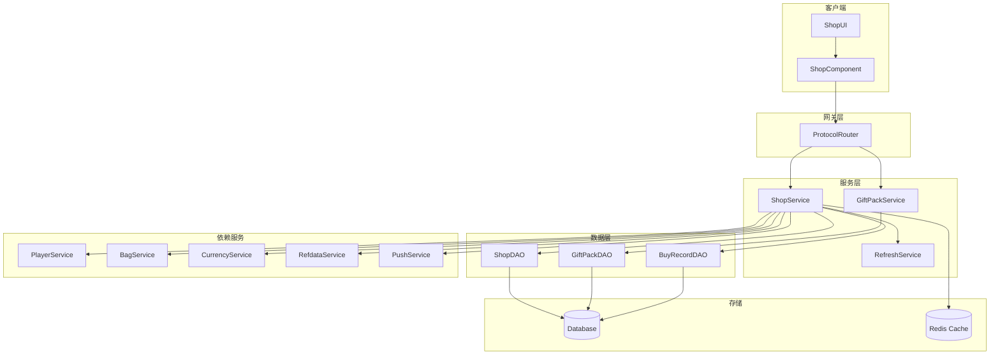
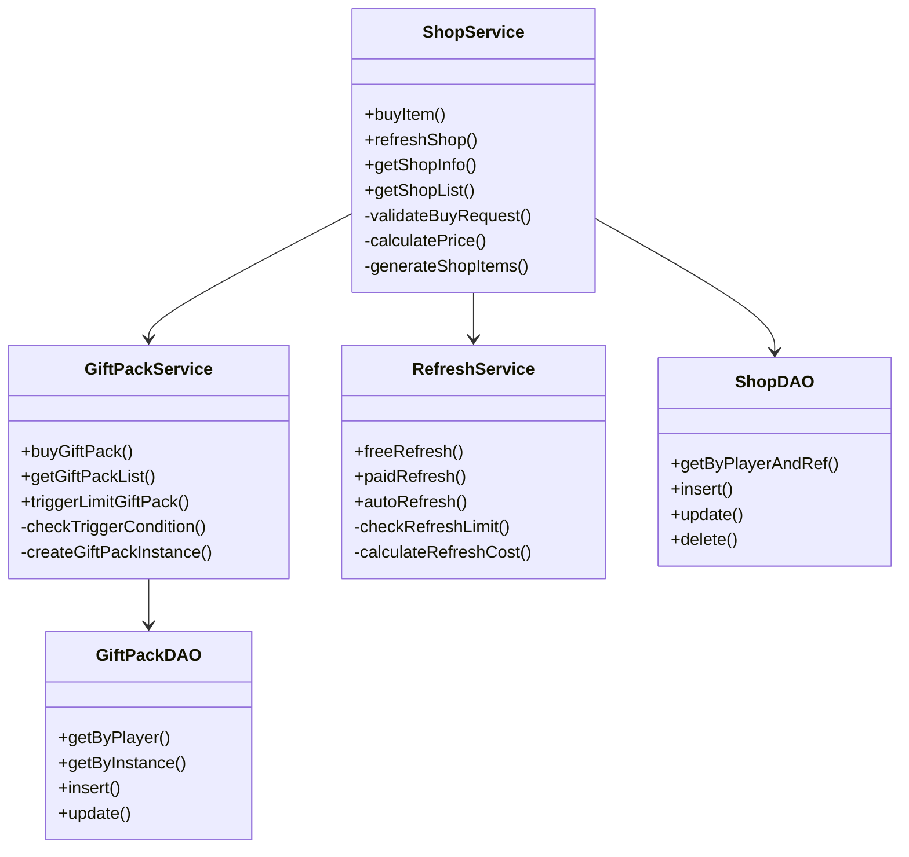

# 商店模块服务端开发文档

## 一、模块架构

### 1.1 模块概述

商店模块（Shop Module）负责管理游戏内商店系统，包括：
- 商品购买管理
- 商店刷新机制
- 礼包系统
- 限时礼包推送
- 购买记录管理

### 1.2 模块编号

协议模块编号: `p030`

---

## 二、核心数据结构

### 2.1 商店信息 (Shop_Info)

**路径**: `ClientProtocol/Common/ShopObj/Shop_Info.cs`

| 字段名 | 类型 | 说明 |
|--------|------|------|
| shopRefId | long | 商店配置ID |
| nextRefreshTimeMs | long | 下一次刷新时间戳 |
| refreshNum | int | 已刷新次数 |
| goodsList | List<Shop_ItemInfo> | 商品列表 |

### 2.2 商品信息 (Shop_ItemInfo)

**路径**: `ClientProtocol/Common/ShopObj/Shop_ItemInfo.cs`

| 字段名 | 类型 | 说明 |
|--------|------|------|
| instanceId | long | 商品实例ID |
| refId | long | 商品配置ID |
| buyCount | int | 已购买数量 |
| status | int | 商品状态 |

---

## 三、协议处理

### 3.1 请求协议 (GC2GS)

| 协议名 | 主序号 | 子序号 | 说明 |
|--------|--------|--------|------|
| GC2GS_030_001_ReqBuyShopItem | 30 | 1 | 购买商店商品 |
| GC2GS_030_002_ReqFreeRefreshShop | 30 | 2 | 免费刷新商店 |
| GC2GS_030_003_ReqRefreshShop | 30 | 3 | 付费刷新商店 |
| GC2GS_030_004_ReqAutoRefreshShop | 30 | 4 | 自动刷新商店 |
| GC2GS_030_021_ReqRefreshGiftPack | 30 | 21 | 刷新礼包 |
| GC2GS_030_022_ReqBuyGiftPack | 30 | 22 | 购买礼包 |

---

## 四、核心逻辑流程

### 4.1 购买商品流程

```
客户端                          服务端
   |                               |
   |--- ReqBuyShopItem ----------->|
   |                               | 1. 验证商店是否开放
   |                               | 2. 验证商品是否存在
   |                               | 3. 验证购买次数限制
   |                               | 4. 验证货币是否足够
   |                               | 5. 扣除货币
   |                               | 6. 发放商品
   |                               | 7. 更新购买记录
   |<-- RetBuyShopItem ------------|
   |<-- OnShopItemSoldOut --------| (如售罄，推送)
   |                               |
```

### 4.2 刷新商店流程

```
客户端                          服务端
   |                               |
   |--- ReqRefreshShop ----------->|
   |                               | 1. 验证刷新次数
   |                               | 2. 扣除刷新消耗
   |                               | 3. 随机生成新商品
   |                               | 4. 更新商店数据
   |<-- RetRefreshShop ------------|
   |<-- OnShopRefresh ------------| (推送商店刷新)
   |                               |
```

---

## 五、数据库设计

### 5.1 商店数据表

| 字段名 | 类型 | 说明 |
|--------|------|------|
| id | BIGINT | 主键 |
| player_id | BIGINT | 玩家ID |
| shop_ref_id | BIGINT | 商店配置ID |
| refresh_num | INT | 刷新次数 |
| goods_data | TEXT | 商品数据（JSON） |
| next_refresh_time | BIGINT | 下次刷新时间 |

### 5.2 购买记录表

| 字段名 | 类型 | 说明 |
|--------|------|------|
| id | BIGINT | 主键 |
| player_id | BIGINT | 玩家ID |
| shop_ref_id | BIGINT | 商店配置ID |
| item_ref_id | BIGINT | 商品配置ID |
| buy_count | INT | 购买数量 |
| buy_time | DATETIME | 购买时间 |

---

## 六、服务配置

### 6.1 协议注册

```csharp
// 协议主序号
public const byte SHOP_MODULE_ORDER = 30;

// 协议处理器注册
protocolHandler.Register<GC2GS_030_001_ReqBuyShopItem>(OnBuyShopItem);
protocolHandler.Register<GC2GS_030_002_ReqFreeRefreshShop>(OnFreeRefreshShop);
// ... 其他协议注册
```

### 6.2 服务依赖

商店模块依赖以下服务：
- 玩家数据服务 (PlayerDataService)
- 资源服务 (ResourceService)
- 配置数据服务 (RefdataService)
- 推送服务 (PushService)
- 随机服务 (RandomService)

---

## 七、服务端架构图

### 7.1 模块架构总览



### 7.2 服务类结构



---

## 八、完整协议处理器实现

### 8.1 商品购买协议处理器（完整版）

```java
/**
 * 处理购买商店商品请求 - 完整版
 */
public void OnReqBuyShopItem(NPPlayerContext _context, GC2GS_030_001_ReqBuyShopItem _proto)
{
    NPUSUserData userData = _context.getUserData();
    long shopRefId = _proto.getShopRefId();
    long instanceId = _proto.getInstanceId();
    long count = _proto.getCount();

    // 参数验证
    if (count <= 0 || count > 999) {
        _context.sendError(CommErr.PARAM_ERROR, "购买数量无效");
        return;
    }

    // 1. 获取商店配置
    RefShop shopRef = RefShop.getMgr().get(shopRefId);
    if (shopRef == null) {
        _context.sendError(CommErr.REF_NOT_FOUND, "商店配置不存在");
        return;
    }

    // 2. 检查商店是否解锁
    if (!checkShopUnlock(userData, shopRef)) {
        _context.sendError(ShopErr.SHOP_NOT_UNLOCKED, "商店未解锁");
        return;
    }

    // 3. 检查商店是否开放
    if (!checkShopOpen(shopRef)) {
        _context.sendError(ShopErr.SHOP_CLOSED, "商店未开放");
        return;
    }

    // 4. 获取商店数据
    ShopBO shopBO = shopDao.getByPlayerAndRef(userData.cid, shopRefId);
    if (shopBO == null) {
        _context.sendError(ShopErr.SHOP_NOT_FOUND, "商店数据不存在");
        return;
    }

    // 5. 查找商品
    ShopItemInfo item = shopBO.findItem(instanceId);
    if (item == null) {
        _context.sendError(ShopErr.ITEM_NOT_FOUND, "商品不存在");
        return;
    }

    // 6. 检查商品状态
    if (item.status != ENPShopItemStatus.AVAILABLE.ordinal()) {
        _context.sendError(ShopErr.ITEM_SOLD_OUT, "商品已售罄");
        return;
    }

    // 7. 获取商品配置
    RefShopItem itemRef = RefShopItem.getMgr().get(item.refId);
    if (itemRef == null) {
        _context.sendError(CommErr.REF_NOT_FOUND, "商品配置不存在");
        return;
    }

    // 8. 检查购买次数
    int totalBuyLimit = getTotalBuyLimit(itemRef);
    if (totalBuyLimit > 0 && item.buyCount + count > totalBuyLimit) {
        _context.sendError(ShopErr.BUY_LIMIT_REACHED, "购买次数已达上限");
        return;
    }

    // 9. 计算价格
    long unitPrice = (long)(itemRef.price.count * item.discount);
    long totalCost = unitPrice * count;

    // 10. 检查货币
    ECurrency currencyType = ECurrency.values()[itemRef.price.type];
    long playerCurrency = userData.getCurrencyComponent().getItemCount(currencyType.ordinal());
    if (playerCurrency < totalCost) {
        _context.sendError(CommErr.CURRENCY_NOT_ENOUGH, "货币不足");
        return;
    }

    // 11. 检查背包空间
    List<NPCommon_ItemInfo> rewards = calculateRewards(itemRef, count);
    if (!userData.getBagComponent().hasSpace(rewards)) {
        _context.sendError(CommErr.BAG_FULL, "背包已满");
        return;
    }

    // 12. 开始事务处理
    userData.lockUser();
    try {
        // 扣除货币
        userData.getCurrencyComponent().costItem(
            currencyType.ordinal(), totalCost, "商店购买", _context);

        // 发放物品
        userData.getBagComponent().addItems(rewards, "商店购买", _context);

        // 更新购买记录
        item.buyCount += count;
        shopDao.updateShopItem(userData.cid, item);

        // 记录购买日志
        logPurchase(userData, shopRefId, item, count, totalCost);

        // 发送响应
        GS2GC_030_001_RetBuyShopItem res = new GS2GC_030_001_RetBuyShopItem();
        res.setResult(0);
        res.setShopRefId(shopRefId);
        res.setInstanceId(instanceId);
        res.setBuyCount((int)count);
        res.setTotalBuyCount(item.buyCount);
        res.setCostValue(totalCost);
        res.setRewardList(rewards);
        userData.sendMsgToGC(res);

        // 检查是否售罄
        if (totalBuyLimit > 0 && item.buyCount >= totalBuyLimit) {
            item.status = ENPShopItemStatus.SOLD_OUT.ordinal();
            pushItemSoldOut(userData, shopRefId, item);
        }

        // 更新缓存
        updateShopCache(userData.cid, shopBO);

    } catch (Exception e) {
        USLog.error(getServer(), "购买商品失败: cid={}, shopRefId={}, instanceId={}",
            userData.cid, shopRefId, instanceId, e);
        _context.sendError(CommErr.INTERNAL_ERROR, "购买失败");
    } finally {
        userData.unlockUser();
    }
}
```

### 8.2 商店刷新协议处理器

```java
/**
 * 处理付费刷新商店请求
 */
public void OnReqRefreshShop(NPPlayerContext _context, GC2GS_030_003_ReqRefreshShop _proto)
{
    NPUSUserData userData = _context.getUserData();
    long shopRefId = _proto.getShopRefId();

    // 1. 获取商店配置
    RefShop shopRef = RefShop.getMgr().get(shopRefId);
    if (shopRef == null) {
        _context.sendError(CommErr.REF_NOT_FOUND);
        return;
    }

    // 2. 检查刷新次数限制
    int maxRefreshCount = getMaxRefreshCount(shopRef, userData);
    ShopBO shopBO = shopDao.getByPlayerAndRef(userData.cid, shopRefId);
    if (shopBO == null) {
        shopBO = initShop(userData, shopRefId);
    }

    if (maxRefreshCount > 0 && shopBO.refreshNum >= maxRefreshCount) {
        _context.sendError(ShopErr.REFRESH_LIMIT_REACHED, "刷新次数已达上限");
        return;
    }

    // 3. 计算刷新费用
    long refreshCost = calculateRefreshCost(shopRef, shopBO.refreshNum);

    // 4. 检查货币
    ECurrency currencyType = ECurrency.values()[shopRef.refresh_cost_type];
    long playerCurrency = userData.getCurrencyComponent().getItemCount(currencyType.ordinal());
    if (playerCurrency < refreshCost) {
        _context.sendError(CommErr.CURRENCY_NOT_ENOUGH, "货币不足");
        return;
    }

    // 5. 开始事务
    userData.lockUser();
    try {
        // 扣除费用
        userData.getCurrencyComponent().costItem(
            currencyType.ordinal(), refreshCost, "商店刷新", _context);

        // 生成新商品
        List<ShopItemInfo> newGoods = generateShopItems(userData, shopRef);

        // 更新商店数据
        shopBO.goodsList = newGoods;
        shopBO.refreshNum++;
        shopBO.nextRefreshTime = calculateNextRefreshTime(shopRef);
        shopDao.updateShop(shopBO);

        // 记录刷新日志
        logRefresh(userData, shopRefId, 1, refreshCost);

        // 发送响应
        GS2GC_030_003_RetRefreshShop res = new GS2GC_030_003_RetRefreshShop();
        res.setResult(0);
        res.setShopRefId(shopRefId);
        res.setShopInfo(shopBO.toShopInfo());
        res.setCostValue(refreshCost);
        userData.sendMsgToGC(res);

        // 更新缓存
        updateShopCache(userData.cid, shopBO);

    } catch (Exception e) {
        USLog.error(getServer(), "刷新商店失败", e);
        _context.sendError(CommErr.INTERNAL_ERROR);
    } finally {
        userData.unlockUser();
    }
}
```

---

## 九、性能优化

### 9.1 缓存策略

```java
/**
 * 商店缓存管理
 */
public class ShopCacheManager
{
    private static final int CACHE_EXPIRE_SECONDS = 300; // 5分钟
    private static final String CACHE_KEY_PREFIX = "shop:";

    /**
     * 获取商店缓存
     */
    public ShopBO getShopCache(long cid, long shopRefId)
    {
        String key = CACHE_KEY_PREFIX + cid + ":" + shopRefId;
        String json = RedisClient.get(key);
        if (json != null) {
            return ShopBO.fromJson(json);
        }
        return null;
    }

    /**
     * 设置商店缓存
     */
    public void setShopCache(long cid, ShopBO shopBO)
    {
        String key = CACHE_KEY_PREFIX + cid + ":" + shopBO.shopRefId;
        RedisClient.setex(key, CACHE_EXPIRE_SECONDS, shopBO.toJson());
    }

    /**
     * 删除商店缓存
     */
    public void deleteShopCache(long cid, long shopRefId)
    {
        String key = CACHE_KEY_PREFIX + cid + ":" + shopRefId;
        RedisClient.del(key);
    }

    /**
     * 批量预热缓存
     */
    public void warmupCache(long cid)
    {
        // 加载玩家所有商店数据到缓存
        List<ShopBO> shops = shopDao.getByPlayer(cid);
        for (ShopBO shop : shops) {
            setShopCache(cid, shop);
        }
    }
}
```

### 9.2 批量操作优化

```java
/**
 * 批量获取商店信息
 */
public List<Shop_Info> batchGetShopInfo(long cid, List<Long> shopRefIds)
{
    List<Shop_Info> result = new ArrayList<>();

    // 先从缓存获取
    Map<Long, ShopBO> cachedShops = new HashMap<>();
    List<Long> uncachedIds = new ArrayList<>();

    for (Long shopRefId : shopRefIds) {
        ShopBO cached = shopCacheManager.getShopCache(cid, shopRefId);
        if (cached != null) {
            cachedShops.put(shopRefId, cached);
        } else {
            uncachedIds.add(shopRefId);
        }
    }

    // 批量从数据库获取未缓存的
    if (!uncachedIds.isEmpty()) {
        List<ShopBO> dbShops = shopDao.batchGetByPlayerAndRefs(cid, uncachedIds);
        for (ShopBO shop : dbShops) {
            cachedShops.put(shop.shopRefId, shop);
            shopCacheManager.setShopCache(cid, shop);
        }
    }

    // 转换为协议对象
    for (Long shopRefId : shopRefIds) {
        ShopBO shop = cachedShops.get(shopRefId);
        if (shop != null) {
            result.add(shop.toShopInfo());
        }
    }

    return result;
}
```

### 9.3 异步日志处理

```java
/**
 * 异步日志写入
 */
public class ShopLogService
{
    private static final BlockingQueue<ShopLogRecord> logQueue =
        new LinkedBlockingQueue<>(10000);
    private static volatile boolean running = true;

    static {
        // 启动日志写入线程
        Thread logThread = new Thread(() -> {
            while (running || !logQueue.isEmpty()) {
                try {
                    List<ShopLogRecord> batch = new ArrayList<>();
                    ShopLogRecord first = logQueue.poll(100, TimeUnit.MILLISECONDS);
                    if (first != null) {
                        batch.add(first);
                        logQueue.drainTo(batch, 100);
                        batchWriteLogs(batch);
                    }
                } catch (InterruptedException e) {
                    Thread.currentThread().interrupt();
                    break;
                }
            }
        }, "ShopLog-Writer");
        logThread.setDaemon(true);
        logThread.start();
    }

    /**
     * 添加日志记录
     */
    public static void addLog(ShopLogRecord record)
    {
        if (!logQueue.offer(record)) {
            USLog.warn("Shop log queue is full, discard log");
        }
    }

    private static void batchWriteLogs(List<ShopLogRecord> logs)
    {
        // 批量写入数据库
        shopLogDao.batchInsert(logs);
    }
}
```

---

## 十、安全检查

### 10.1 输入验证

```java
/**
 * 商店模块输入验证
 */
public class ShopInputValidator
{
    /**
     * 验证购买请求参数
     */
    public static boolean validateBuyRequest(GC2GS_030_001_ReqBuyShopItem req)
    {
        // 商店ID检查
        if (req.getShopRefId() <= 0) {
            return false;
        }

        // 商品实例ID检查
        if (req.getInstanceId() <= 0) {
            return false;
        }

        // 购买数量检查
        if (req.getCount() <= 0 || req.getCount() > 999) {
            return false;
        }

        return true;
    }

    /**
     * 验证刷新请求参数
     */
    public static boolean validateRefreshRequest(GC2GS_030_003_ReqRefreshShop req)
    {
        if (req.getShopRefId() <= 0) {
            return false;
        }
        return true;
    }

    /**
     * 验证礼包购买请求
     */
    public static boolean validateGiftPackRequest(GC2GS_030_022_ReqBuyGiftPack req)
    {
        if (req.getGiftPackId() <= 0) {
            return false;
        }
        // 限时礼包必须有实例ID
        return true;
    }
}
```

### 10.2 频率限制

```java
/**
 * 商店操作频率限制
 */
public class ShopRateLimiter
{
    private static final int BUY_LIMIT_PER_SECOND = 10;
    private static final int REFRESH_LIMIT_PER_SECOND = 3;
    private static final int GIFT_PACK_LIMIT_PER_SECOND = 5;

    /**
     * 检查购买频率
     */
    public static boolean checkBuyRate(long cid)
    {
        String key = "shop:buy:" + cid;
        return checkRate(key, BUY_LIMIT_PER_SECOND, 1);
    }

    /**
     * 检查刷新频率
     */
    public static boolean checkRefreshRate(long cid)
    {
        String key = "shop:refresh:" + cid;
        return checkRate(key, REFRESH_LIMIT_PER_SECOND, 1);
    }

    private static boolean checkRate(String key, int limit, int windowSeconds)
    {
        Long count = RedisClient.incr(key);
        if (count == 1) {
            RedisClient.expire(key, windowSeconds);
        }
        return count <= limit;
    }
}
```

### 10.3 交易安全检查

```java
/**
 * 交易安全检查
 */
public class ShopSecurityChecker
{
    /**
     * 检查交易安全性
     */
    public static SecurityCheckResult checkTransactionSecurity(
        NPUSUserData userData, long totalCost, long shopRefId)
    {
        SecurityCheckResult result = new SecurityCheckResult();

        // 1. 检查交易金额是否合理
        if (totalCost > getDailyTransactionLimit(userData)) {
            result.setRisk(true);
            result.setReason("交易金额超过每日限额");
            return result;
        }

        // 2. 检查交易频率
        long recentTransactionCount = getRecentTransactionCount(userData.cid);
        if (recentTransactionCount > 100) { // 1小时内超过100次
            result.setRisk(true);
            result.setReason("交易频率异常");
            return result;
        }

        // 3. 检查账户状态
        if (userData.getPlayerComponent().isBanned()) {
            result.setRisk(true);
            result.setReason("账户已被封禁");
            return result;
        }

        result.setRisk(false);
        return result;
    }

    /**
     * 获取每日交易限额
     */
    private static long getDailyTransactionLimit(NPUSUserData userData)
    {
        // VIP用户有更高的限额
        int vipLevel = userData.getPlayerComponent().getVipLevel();
        return 10000L + vipLevel * 5000L;
    }

    /**
     * 获取最近交易次数
     */
    private static long getRecentTransactionCount(long cid)
    {
        String key = "shop:transaction:" + cid;
        String count = RedisClient.get(key);
        return count == null ? 0 : Long.parseLong(count);
    }
}
```

---

## 十一、定时任务

### 11.1 商店自动刷新

```java
/**
 * 商店自动刷新定时任务
 */
public class ShopAutoRefreshTask implements Runnable
{
    @Override
    public void run()
    {
        long currentTime = System.currentTimeMillis();

        // 查找需要刷新的商店
        List<ShopBO> shopsToRefresh = shopDao.findShopsNeedRefresh(currentTime);

        for (ShopBO shop : shopsToRefresh) {
            try {
                refreshShop(shop);
            } catch (Exception e) {
                USLog.error("自动刷新商店失败: shopRefId={}", shop.shopRefId, e);
            }
        }
    }

    private void refreshShop(ShopBO shop)
    {
        RefShop shopRef = RefShop.getMgr().get(shop.shopRefId);
        if (shopRef == null) return;

        // 生成新商品
        List<ShopItemInfo> newGoods = generateShopItems(shopRef);

        // 更新商店数据
        shop.goodsList = newGoods;
        shop.refreshNum = 0; // 重置刷新次数
        shop.freeRefreshUsed = 0; // 重置免费刷新次数
        shop.nextRefreshTime = calculateNextRefreshTime(shopRef);
        shopDao.updateShop(shop);

        // 推送刷新通知
        pushShopRefresh(shop);
    }
}
```

### 11.2 礼包过期检查

```java
/**
 * 礼包过期检查定时任务
 */
public class GiftPackExpireTask implements Runnable
{
    @Override
    public void run()
    {
        long currentTime = System.currentTimeMillis();

        // 查找过期的礼包
        List<GiftPackBO> expiredGifts = giftPackDao.findExpired(currentTime);

        for (GiftPackBO gift : expiredGifts) {
            try {
                processExpiredGiftPack(gift);
            } catch (Exception e) {
                USLog.error("处理过期礼包失败: giftPackId={}", gift.giftPackId, e);
            }
        }
    }

    private void processExpiredGiftPack(GiftPackBO gift)
    {
        // 更新状态为过期
        gift.status = ENPGiftPackStatus.EXPIRED.ordinal();
        giftPackDao.update(gift);

        // 推送移除通知
        pushGiftPackRemove(gift);

        // 记录日志
        logGiftPackExpire(gift);
    }
}
```

---

## 十二、监控与告警

### 12.1 性能监控指标

```java
/**
 * 商店模块监控
 */
public class ShopMetrics
{
    private static final Meter buyRequestMeter = MeterBuilder.create("shop.buy.request");
    private static final Meter buySuccessMeter = MeterBuilder.create("shop.buy.success");
    private static final Meter buyFailMeter = MeterBuilder.create("shop.buy.fail");
    private static final Timer buyLatencyTimer = TimerBuilder.create("shop.buy.latency");

    /**
     * 记录购买请求
     */
    public static void recordBuyRequest()
    {
        buyRequestMeter.mark();
    }

    /**
     * 记录购买成功
     */
    public static void recordBuySuccess(long latencyMs)
    {
        buySuccessMeter.mark();
        buyLatencyTimer.update(latencyMs, TimeUnit.MILLISECONDS);
    }

    /**
     * 记录购买失败
     */
    public static void recordBuyFail(int errorCode)
    {
        buyFailMeter.mark();
        CounterBuilder.create("shop.buy.fail." + errorCode).inc();
    }

    /**
     * 获取购买成功率
     */
    public static double getBuySuccessRate()
    {
        return (double) buySuccessMeter.getCount() / buyRequestMeter.getCount();
    }
}
```

### 12.2 异常告警

```java
/**
 * 商店模块告警
 */
public class ShopAlerter
{
    private static final double SUCCESS_RATE_THRESHOLD = 0.95;
    private static final int LATENCY_THRESHOLD_MS = 500;

    /**
     * 检查并告警
     */
    public static void checkAndAlert()
    {
        // 检查成功率
        double successRate = ShopMetrics.getBuySuccessRate();
        if (successRate < SUCCESS_RATE_THRESHOLD) {
            AlertService.sendAlert(
                AlertLevel.WARNING,
                "商店模块购买成功率过低: " + String.format("%.2f%%", successRate * 100)
            );
        }

        // 检查延迟
        long avgLatency = ShopMetrics.getAvgBuyLatency();
        if (avgLatency > LATENCY_THRESHOLD_MS) {
            AlertService.sendAlert(
                AlertLevel.WARNING,
                "商店模块购买延迟过高: " + avgLatency + "ms"
            );
        }
    }
}
```

---

*文档生成时间: 2026-04-11*
