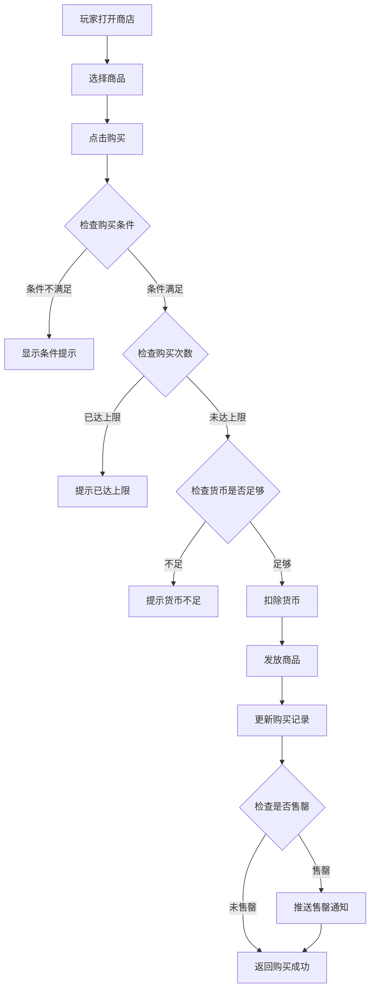
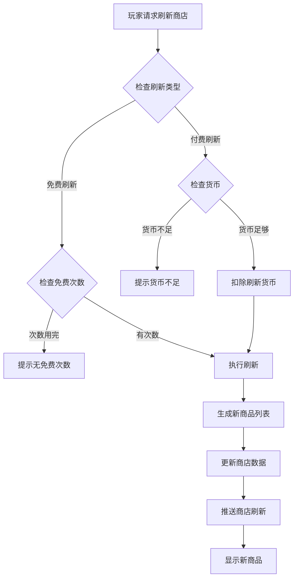
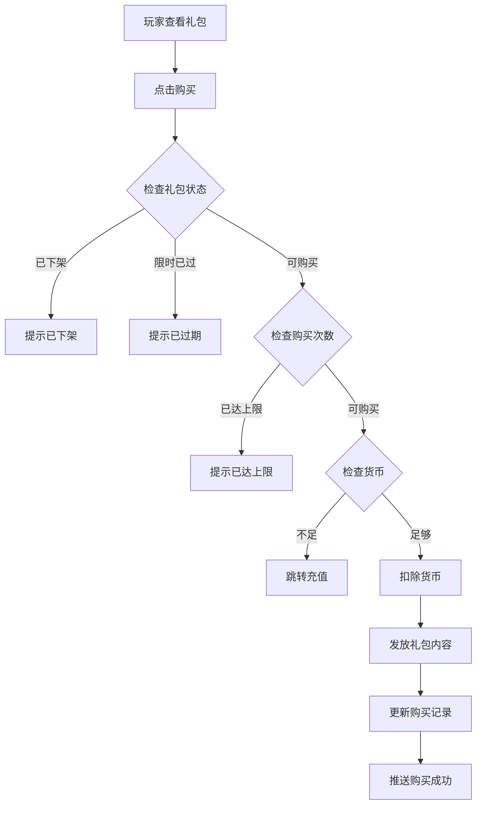
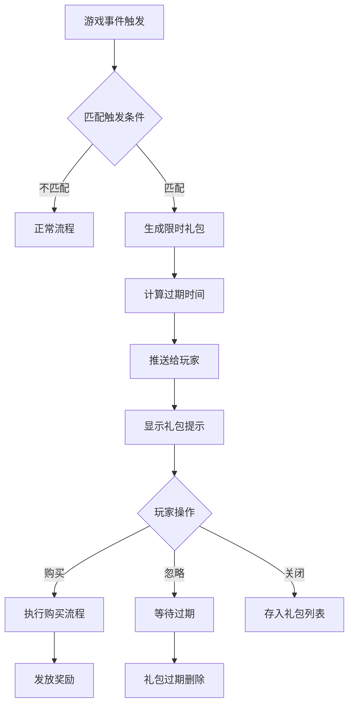
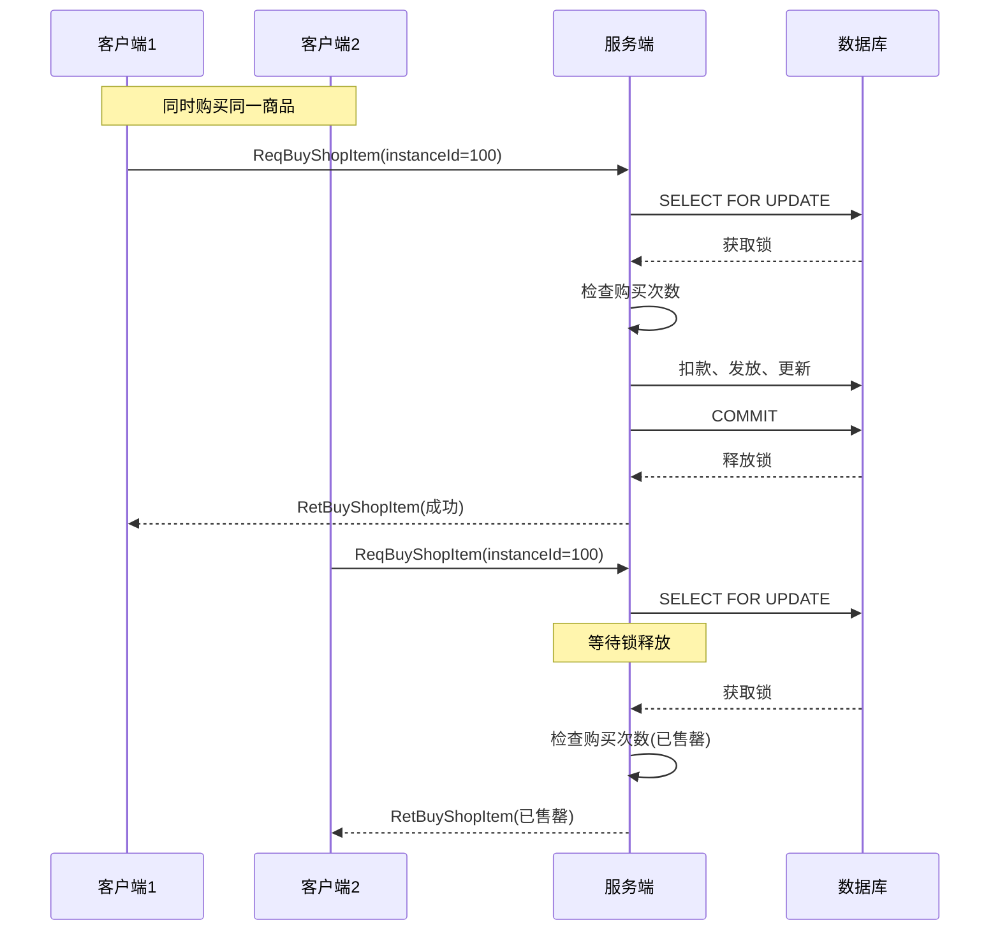
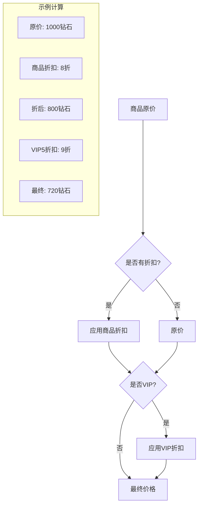
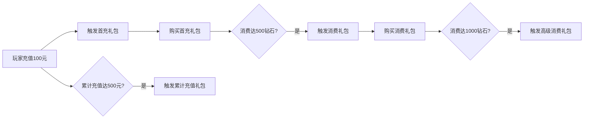
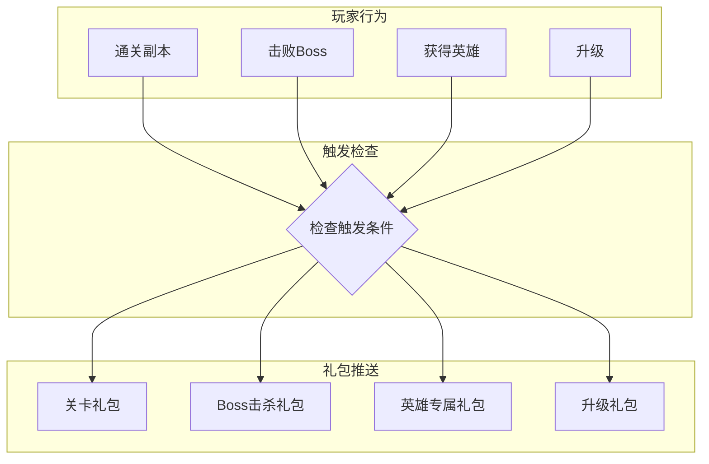
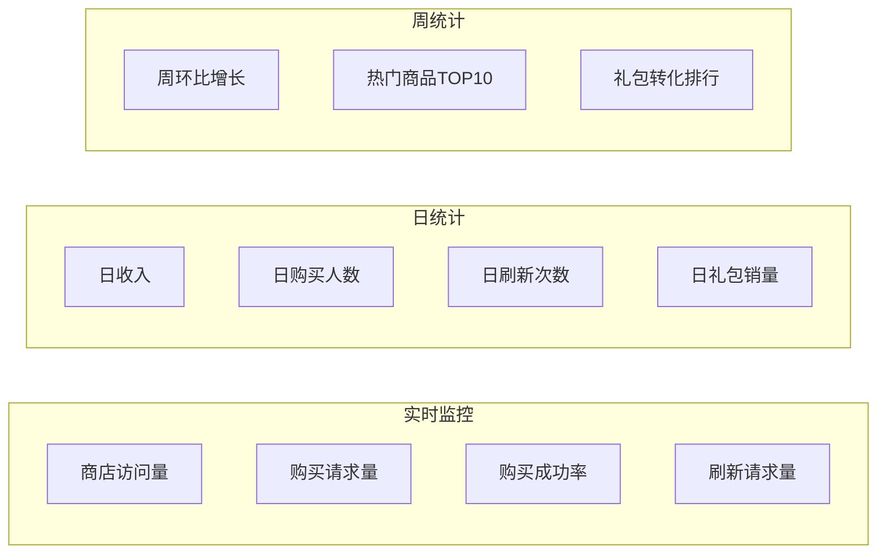
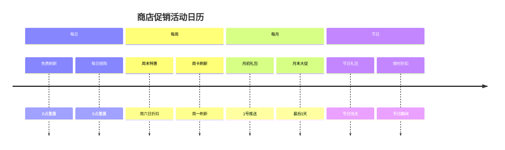

# 商店模块完整说明

## 一、模块概述

### 1.1 业务背景

商店模块是 K2C 游戏的核心经济系统，负责管理游戏内所有商店和礼包的销售业务。玩家可以通过消耗游戏货币购买道具、装备、材料等物品，是游戏变现和资源流通的重要渠道。模块支持多种商店类型、动态刷新、限时礼包等丰富的营销功能。

### 1.2 目标用户

- **所有游戏玩家**：通过商店获取所需资源
- **付费玩家**：购买高级礼包和限定商品
- **运营人员**：配置商店商品和促销活动

### 1.3 核心价值

1. **资源获取**：提供便捷的游戏资源获取渠道
2. **变现渠道**：通过钻石商店实现游戏变现
3. **玩家粘性**：定期刷新保持玩家关注
4. **活动推广**：限时礼包促进玩家消费

---

## 二、功能清单

### 2.1 商店购买功能

| 功能名称 | 功能描述 | 用户价值 |
|---------|---------|---------|
| 商品浏览 | 查看商店所有商品 | 了解商品信息 |
| 商品购买 | 购买指定商品 | 获取所需物品 |
| 购买限制 | 限购数量管理 | 控制商品稀缺性 |
| 折扣显示 | 显示折扣信息 | 吸引购买决策 |

### 2.2 商店刷新功能

| 功能名称 | 功能描述 | 用户价值 |
|---------|---------|---------|
| 免费刷新 | 每日免费刷新次数 | 获取新商品 |
| 付费刷新 | 消耗货币刷新商店 | 自主控制商品 |
| 自动刷新 | 定时自动刷新 | 保持商品更新 |
| 刷新预览 | 预览刷新后商品 | 决策是否刷新 |

### 2.3 礼包系统功能

| 功能名称 | 功能描述 | 用户价值 |
|---------|---------|---------|
| 礼包展示 | 显示礼包内容和价格 | 了解礼包价值 |
| 礼包购买 | 购买礼包获得物品 | 获得超值奖励 |
| 限时礼包 | 限时优惠礼包推送 | 把握优惠机会 |
| 触发礼包 | 条件触发推送礼包 | 精准营销 |

### 2.4 商店类型功能

| 商店类型 | 功能描述 | 用户价值 |
|---------|---------|---------|
| 普通商店 | 基础道具购买 | 日常资源获取 |
| 竞技场商店 | 竞技币兑换商品 | 竞技奖励兑换 |
| 公会商店 | 公会贡献兑换 | 公会福利获取 |
| 活动商店 | 活动货币兑换 | 活动奖励兑换 |
| 神秘商店 | 随机刷新商品 | 稀有物品获取 |

---

## 三、业务流程详解

### 3.1 商品购买流程



**详细步骤说明**：

1. **条件验证**
   - 检查玩家等级是否满足
   - 检查功能是否解锁
   - 检查商店是否开放

2. **购买验证**
   - 检查购买次数限制
   - 检查货币是否足够
   - 检查背包空间是否充足

3. **交易处理**
   - 扣除购买货币
   - 发放商品到背包
   - 记录购买日志

### 3.2 商店刷新流程



**详细步骤说明**：

1. **刷新权限检查**
   - 检查免费刷新次数
   - 检查付费刷新货币
   - 检查刷新次数上限

2. **商品生成**
   - 根据权重随机选择商品
   - 生成商品实例ID
   - 设置商品属性（折扣、限购等）

3. **数据更新**
   - 保存新商品列表
   - 更新刷新次数
   - 推送刷新结果

### 3.3 礼包购买流程



**详细步骤说明**：

1. **礼包验证**
   - 检查礼包是否在售
   - 检查限时礼包时间
   - 检查购买条件

2. **购买处理**
   - 验证货币类型和数量
   - 扣除货币
   - 发放礼包内容

3. **后续处理**
   - 更新购买次数
   - 检查是否触发后续礼包
   - 推送购买结果

### 3.4 限时礼包触发流程



---

## 四、关键规则

### 4.1 购买规则

1. **限购规则**
   - 每日限购：每日0点重置
   - 每周限购：每周一0点重置
   - 永久限购：终身限制购买次数

2. **折扣规则**
   - 折扣以百分比表示
   - 多个折扣取最优
   - 折扣叠加需配置

3. **货币规则**
   - 银两商店：使用银两购买
   - 钻石商店：使用钻石购买
   - 特殊商店：使用专属货币

### 4.2 刷新规则

1. **刷新次数**
   - 免费刷新：每日固定次数
   - 付费刷新：消耗钻石，次数无限制
   - VIP加成：VIP等级增加免费次数

2. **刷新时间**
   - 每日刷新：固定时间点刷新
   - 每周刷新：每周固定时间刷新
   - 固定时间：指定时间点刷新

### 4.3 礼包规则

1. **限时规则**
   - 限时礼包有有效期
   - 过期自动消失
   - 倒计时显示

2. **触发规则**
   - 条件触发：达成条件自动推送
   - 首充触发：首次充值后推送
   - 等级触发：达到等级后推送

---

## 五、用户故事

### 5.1 普通玩家故事

> 作为一名普通玩家，我每天上线第一件事就是查看商店刷新了什么好东西。今天神秘商店刷新了一个稀有装备碎片，原价500钻石，现在打5折只要250钻石！我果断买下了它。我还用竞技币在竞技场商店兑换了一些强化材料，准备给装备升级。

### 5.2 付费玩家故事

> 作为一名付费玩家，我发现商店里有限时礼包推送。这个"新手成长礼包"包含大量钻石和稀有道具，价格也很优惠。我立刻购买，获得了丰厚的奖励。每周我还会刷新神秘商店，期待刷出稀有物品。

### 5.3 运营人员故事

> 作为运营人员，我需要配置下周的商店活动。我在后台设置了新的商品折扣，添加了限时礼包，并配置了触发条件。系统会自动在玩家达到30级时推送一个"进阶礼包"，帮助玩家更好地体验游戏。

---

## 六、示例

### 6.1 商品购买示例

**商品配置**：
```
商品ID：10001
物品：英雄碎片 × 10
原价：500钻石
折扣：8折
限购：每日2次
```

**购买操作**：
- 玩家钻石：1000
- 购买数量：1

**购买结果**：
```
实际价格：400钻石（500 × 0.8）
扣除钻石：400
获得物品：英雄碎片 × 10
剩余钻石：600
今日已购：1/2
```

### 6.2 商店刷新示例

**刷新前商品**：
```
[商品1] 银两 × 10000 - 100钻石
[商品2] 经验药水 × 5 - 50钻石
[商品3] 强化石 × 10 - 80钻石
```

**刷新操作**：付费刷新，消耗100钻石

**刷新后商品**：
```
[商品1] 稀有装备碎片 × 5 - 200钻石（5折）
[商品2] 英雄碎片 × 10 - 150钻石
[商品3] 体力药水 × 3 - 60钻石
[商品4] 技能书 × 1 - 300钻石
```

### 6.3 限时礼包示例

**触发条件**：玩家首次充值达到100元

**礼包配置**：
```
礼包ID：20001
礼包名称：首充大礼包
价格：98钻石（原价980钻石）
内容：
  - 钻石 × 980
  - SSR英雄 × 1
  - 高级装备箱 × 5
限时：24小时
限购：1次
```

**购买结果**：
```
扣除钻石：98
获得物品：
  - 钻石 × 980
  - SSR英雄 "暗影刺客" × 1
  - 高级装备箱 × 5
礼包状态：已购买
```

---

## 七、边界情况处理

### 7.1 购买边界情况

| 边界情况 | 处理方式 | 用户提示 |
|----------|----------|----------|
| 商品刚售罄 | 返回错误码，刷新商品状态 | "商品已售罄" |
| 商品被刷新 | 返回错误码，提示重新查看 | "商品不存在，商店已更新" |
| 货币刚好够扣 | 正常执行购买 | 显示购买成功 |
| 货币差1点 | 返回货币不足 | "钻石不足，还差1钻石" |
| 背包差1格 | 返回背包已满 | "背包已满，请清理1格空间" |
| 购买数量为0 | 参数错误 | "请选择购买数量" |
| 购买数量超限 | 参数错误 | "购买数量超过限制" |

### 7.2 刷新边界情况

| 边界情况 | 处理方式 | 用户提示 |
|----------|----------|----------|
| 免费次数刚用完 | 提示付费刷新 | "免费次数已用完，需花费X钻石刷新" |
| 刷新费用刚够 | 正常执行刷新 | 显示刷新成功 |
| 刷新费用差1钻石 | 返回货币不足 | "钻石不足，还差1钻石" |
| 商店正在刷新中 | 返回操作频繁 | "商店正在刷新，请稍候" |
| 刷新次数已达上限 | 返回次数上限 | "今日刷新次数已用完" |

### 7.3 礼包边界情况

| 边界情况 | 处理方式 | 用户提示 |
|----------|----------|----------|
| 礼包刚过期 | 返回过期错误 | "礼包已过期" |
| 礼包剩余1秒过期 | 允许购买，检查过期时间 | 正常购买流程 |
| 礼包限购1次已购买 | 返回已达上限 | "该礼包已购买过" |
| 礼包被下架 | 返回已下架 | "礼包已下架" |
| 触发条件刚好满足 | 触发礼包推送 | 显示礼包弹窗 |

### 7.4 并发情况处理



---

## 八、高级业务场景

### 8.1 VIP折扣叠加



**折扣叠加规则**：
1. 商品折扣先计算
2. VIP折扣在商品折扣后叠加
3. 折扣最低不超过5折（保护商品价值）
4. 特殊商品不参与VIP折扣

### 8.2 限时礼包触发链



### 8.3 商店联动系统



---

## 九、数据分析指标

### 9.1 核心业务指标

| 指标名称 | 计算公式 | 说明 | 目标值 |
|----------|----------|------|--------|
| 商店渗透率 | 访问商店人数/活跃玩家数 | 商店功能使用情况 | >60% |
| 商品购买率 | 购买商品人数/访问商店人数 | 商品吸引力 | >30% |
| 刷新使用率 | 刷新次数/商店访问次数 | 刷新功能使用情况 | >10% |
| 付费刷新占比 | 付费刷新次数/总刷新次数 | 付费意愿 | >20% |
| 礼包购买率 | 购买礼包人数/推送人数 | 礼包吸引力 | >15% |
| 限时礼包转化率 | 限时礼包购买/触发推送 | 限时礼包效果 | >25% |

### 9.2 收入相关指标

| 指标名称 | 计算公式 | 说明 |
|----------|----------|------|
| 商店ARPU | 商店总收入/活跃玩家数 | 人均商店收入 |
| 礼包ARPU | 礼包总收入/活跃玩家数 | 人均礼包收入 |
| 首充转化率 | 首充人数/新玩家数 | 首充礼包效果 |
| 商品贡献度 | 单商品收入/商店总收入 | 商品价值分析 |
| 折扣敏感度 | 折扣商品销量/原价商品销量 | 折扣效果分析 |

### 9.3 数据监控看板



---

## 十、运营配置指南

### 10.1 商店配置建议

| 配置项 | 建议值 | 说明 |
|--------|--------|------|
| 商品数量 | 6-8个 | 数量适中，避免选择困难 |
| 折扣力度 | 7-9折 | 折扣明显但不过度 |
| 免费刷新次数 | 1-2次 | 提供基础体验 |
| 付费刷新费用 | 50-100钻石 | 低门槛付费引导 |
| 限购数量 | 1-5次 | 创造稀缺感 |

### 10.2 礼包配置建议

| 礼包类型 | 价格建议 | 内容倍率 | 限购建议 |
|----------|----------|----------|----------|
| 首充礼包 | 6-30元 | 5-10倍 | 1次 |
| 月卡礼包 | 30元 | 3-5倍 | 1次 |
| 限时礼包 | 6-30元 | 3-8倍 | 1次 |
| 等级礼包 | 6-30元 | 2-5倍 | 1次 |
| 活动礼包 | 根据活动 | 2-5倍 | 根据活动 |

### 10.3 促销活动建议



---

## 十一、常见问题FAQ

### Q1: 商品刷新后还能买之前的商品吗？
**A**: 不可以。商店刷新后，之前的商品会被新的商品替换，无法购买。如果之前有未购买的商品，建议在刷新前完成购买。

### Q2: 限时礼包过期后还能购买吗？
**A**: 不可以。限时礼包有明确的过期时间，过期后将自动从礼包列表移除，无法再购买。

### Q3: 购买商品时货币不足怎么办？
**A**: 系统会提示货币不足，并显示差额。玩家可以通过充值或参与游戏活动获取所需货币。

### Q4: 免费刷新次数用完怎么办？
**A**: 免费刷新次数每日重置。用完后可以使用钻石进行付费刷新，或等待次日免费刷新次数恢复。

### Q5: 为什么有些商品显示已售罄？
**A**: 商品售罄通常是因为已达到该商品的购买次数上限。售罄的商品在下次商店刷新前无法再次购买。

### Q6: VIP用户有什么额外福利？
**A**: VIP用户通常享有以下额外福利：
- 额外的免费刷新次数
- VIP专属折扣
- VIP专属商品
- VIP专属商店

### Q7: 如何触发限时礼包？
**A**: 限时礼包会在满足特定条件时自动触发，常见触发条件包括：
- 首次充值
- 达到特定等级
- VIP等级提升
- 战力达到阈值
- 击败特定Boss

### Q8: 购买后物品发到哪里？
**A**: 购买成功后，物品会自动发放到玩家背包。如果是英雄、皮肤等特殊物品，会直接添加到对应列表中。

---

## 十二、版本更新日志

### v1.0.0 (初始版本)
- 实现基础商店功能
- 实现商品购买功能
- 实现商店刷新功能

### v1.1.0 (礼包系统)
- 新增礼包系统
- 支持限时礼包推送
- 支持条件触发礼包

### v1.2.0 (VIP优化)
- 新增VIP折扣功能
- 新增VIP专属商店
- 优化刷新费用计算

### v1.3.0 (性能优化)
- 优化商店数据缓存
- 优化协议处理性能
- 新增批量操作接口

---

*文档生成时间: 2026-04-11*
