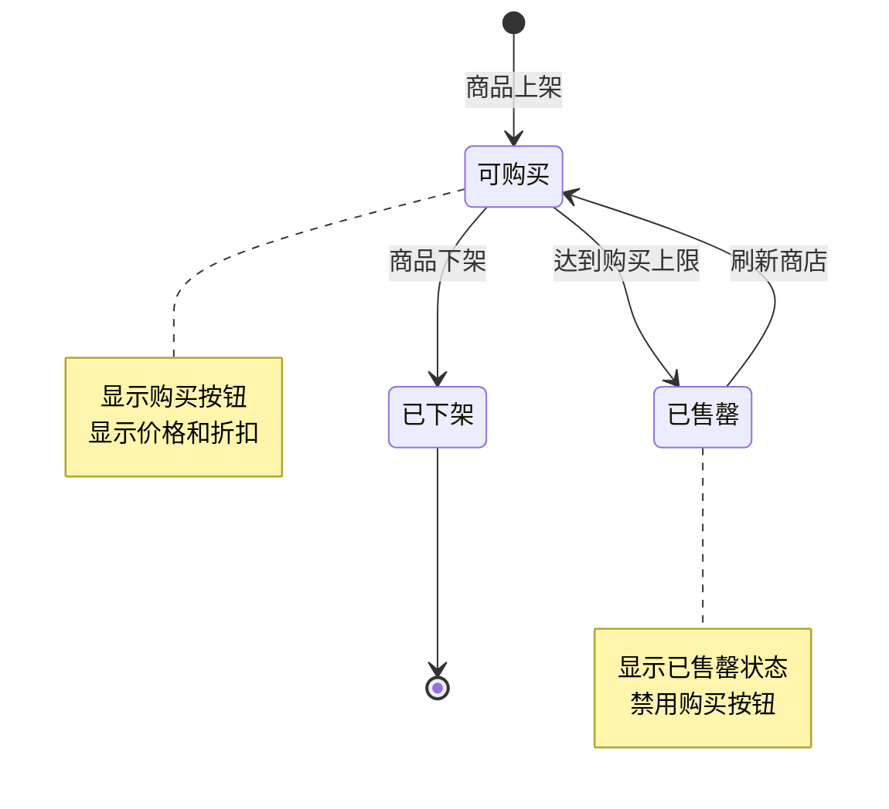
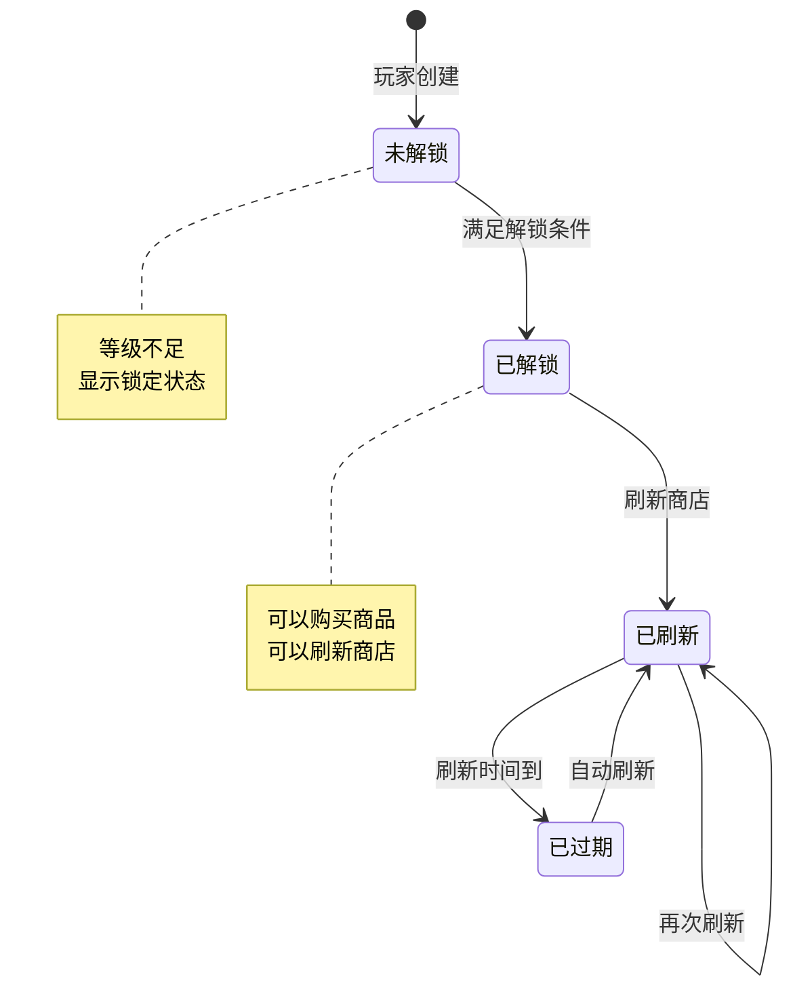
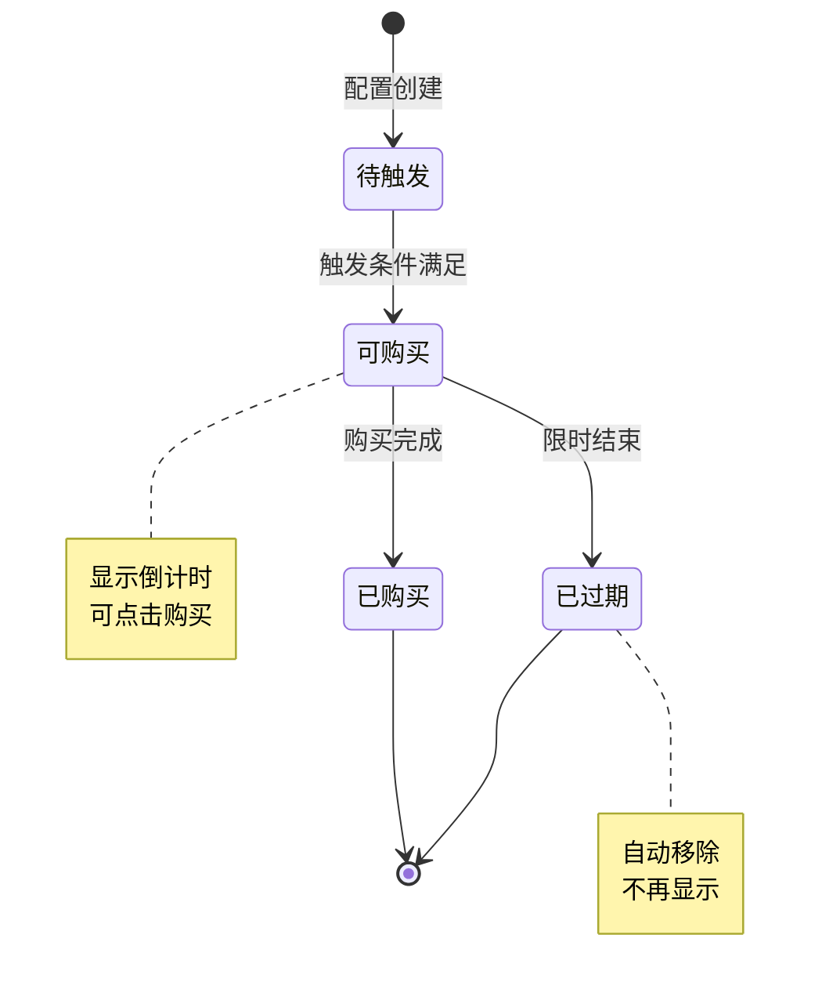
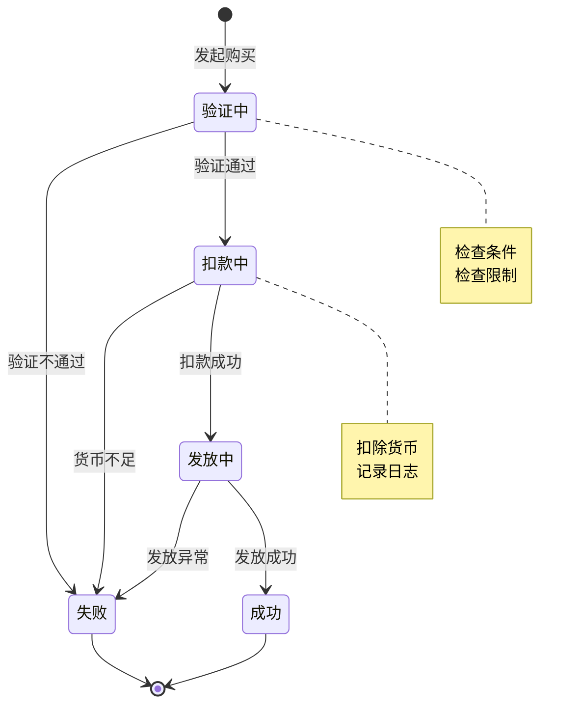
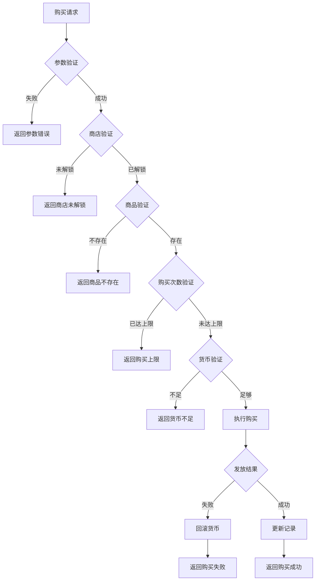

# 商店模块实现细节

## 一、计算公式

### 1.1 商品实际价格计算公式

```
实际价格 = floor(原价 × 折扣)
```

**参数说明**：
- `原价`：配置表中的基础价格
- `折扣`：折扣比例（0.1-1.0）

**示例计算**：
```
原价：500钻石
折扣：0.8（8折）

实际价格 = floor(500 × 0.8) = 400钻石
```

### 1.2 刷新费用计算公式

```
刷新费用 = 基础费用 + (已刷新次数 × 递增费用)
```

**参数说明**：
- `基础费用`：第一次刷新的费用
- `已刷新次数`：今日已刷新次数
- `递增费用`：每次刷新增加的费用

**示例计算**：
```
基础费用：50钻石
递增费用：50钻石
已刷新次数：2

刷新费用 = 50 + (2 × 50) = 150钻石
```

### 1.3 商品权重选择公式

```
选中概率 = 商品权重 / 总权重
```

**示例计算**：
```
商品池：
  - 商品A：权重 30
  - 商品B：权重 50
  - 商品C：权重 20
总权重：100

商品A选中概率 = 30/100 = 30%
商品B选中概率 = 50/100 = 50%
商品C选中概率 = 20/100 = 20%
```

---

## 二、状态机定义

### 2.1 商品状态机



### 2.2 商店状态机



### 2.3 礼包状态机



### 2.4 购买流程状态机



---

## 三、数据约束

### 3.1 商店数据约束

| 字段名 | 数据类型 | 取值范围 | 必填 | 说明 |
|--------|----------|----------|------|------|
| id | bigint | > 0 | 是 | 主键 |
| player_id | bigint | > 0 | 是 | 玩家ID |
| shop_ref_id | bigint | > 0 | 是 | 商店配置ID |
| refresh_num | int | >= 0 | 是 | 刷新次数 |
| goods_data | text | 非空 | 是 | 商品数据（JSON） |
| next_refresh_time | bigint | >= 0 | 是 | 下次刷新时间 |

### 3.2 商品数据约束

| 字段名 | 数据类型 | 取值范围 | 必填 | 说明 |
|--------|----------|----------|------|------|
| instance_id | bigint | > 0 | 是 | 商品实例ID |
| ref_id | bigint | > 0 | 是 | 商品配置ID |
| buy_count | int | >= 0 | 是 | 已购买数量 |
| status | int | 0-2 | 是 | 状态：0可购买，1售罄，2下架 |
| discount | float | 0.1-1.0 | 否 | 折扣比例 |

### 3.3 购买记录约束

| 字段名 | 数据类型 | 取值范围 | 必填 | 说明 |
|--------|----------|----------|------|------|
| id | bigint | > 0 | 是 | 主键 |
| player_id | bigint | > 0 | 是 | 玩家ID |
| shop_ref_id | bigint | > 0 | 是 | 商店配置ID |
| item_ref_id | bigint | > 0 | 是 | 商品配置ID |
| buy_count | int | > 0 | 是 | 购买数量 |
| buy_time | datetime | - | 是 | 购买时间 |

### 3.4 礼包数据约束

| 字段名 | 数据类型 | 取值范围 | 必填 | 说明 |
|--------|----------|----------|------|------|
| id | bigint | > 0 | 是 | 主键 |
| player_id | bigint | > 0 | 是 | 玩家ID |
| gift_pack_id | bigint | > 0 | 是 | 礼包配置ID |
| buy_count | int | >= 0 | 是 | 购买次数 |
| expire_time | datetime | - | 否 | 过期时间 |

---

## 四、错误处理策略

### 4.1 商店模块错误码

| 错误码 | 错误信息 | 处理策略 | 用户提示 |
|--------|----------|----------|----------|
| 30001 | 商店未解锁 | 检查解锁条件 | "商店尚未解锁" |
| 30002 | 商品不存在 | 检查商品配置 | "商品不存在" |
| 30003 | 商品已售罄 | 检查购买次数 | "商品已售罄" |
| 30004 | 货币不足 | 检查玩家货币 | "货币不足，请充值" |
| 30005 | 背包已满 | 检查背包空间 | "背包已满，请清理" |
| 30006 | 刷新次数已达上限 | 检查刷新配置 | "今日刷新次数已用完" |
| 30007 | 礼包已下架 | 检查礼包状态 | "礼包已下架" |
| 30008 | 礼包已过期 | 检查过期时间 | "礼包已过期" |
| 30009 | 购买次数已达上限 | 检查限购配置 | "购买次数已达上限" |

### 4.2 购买错误处理流程



### 4.3 异常处理策略

| 异常场景 | 处理策略 | 数据处理 |
|----------|----------|----------|
| 网络超时 | 重试3次，间隔递增 | 事务保证 |
| 数据库异常 | 回滚事务，记录日志 | 恢复原始状态 |
| 背包空间不足 | 返回错误，提示清理 | 不扣货币 |
| 商品配置缺失 | 跳过该商品，记录日志 | 继续其他商品 |
| 价格配置错误 | 使用默认价格 | 记录告警日志 |

---

## 五、关键代码示例

### 5.1 商品购买伪代码

```csharp
public Result BuyShopItem(long playerId, long shopRefId, long instanceId, int count)
{
    // 1. 获取商店数据
    ShopInfo shop = shopDao.getByPlayerAndRef(playerId, shopRefId);
    if (shop == null)
    {
        return Result.Error(30001, "商店未解锁");
    }

    // 2. 查找商品
    ShopItemInfo item = shop.goodsList.Find(g => g.instanceId == instanceId);
    if (item == null)
    {
        return Result.Error(30002, "商品不存在");
    }

    // 3. 检查购买次数
    ShopItemRefObj itemRef = refService.getShopItemRef(item.refId);
    if (itemRef.buyLimit > 0 && item.buyCount + count > itemRef.buyLimit)
    {
        return Result.Error(30009, "购买次数已达上限");
    }

    // 4. 计算价格
    long totalCost = (long)(itemRef.price.value * item.discount * count);

    // 5. 检查货币
    if (!playerService.HasResource(playerId, itemRef.price.type, totalCost))
    {
        return Result.Error(30004, "货币不足");
    }

    // 6. 检查背包空间
    List<RewardItem> rewards = CalculateRewards(itemRef, count);
    if (!bagService.HasSpace(playerId, rewards))
    {
        return Result.Error(30005, "背包已满");
    }

    // 7. 开始事务
    using (var transaction = db.BeginTransaction())
    {
        try
        {
            // 扣除货币
            playerService.CostResource(playerId, itemRef.price.type, totalCost, "商店购买");

            // 发放商品
            bagService.AddItems(playerId, rewards);

            // 更新购买记录
            item.buyCount += count;
            shopDao.updateShopItem(playerId, item);

            // 记录日志
            logService.LogPurchase(playerId, shopRefId, item.refId, count, totalCost);

            transaction.Commit();
        }
        catch (Exception ex)
        {
            transaction.Rollback();
            return Result.Error(ErrorCode.INTERNAL_ERROR, "购买失败");
        }
    }

    // 8. 检查是否售罄
    if (itemRef.buyLimit > 0 && item.buyCount >= itemRef.buyLimit)
    {
        item.status = 1; // 售罄
        PushItemSoldOut(playerId, item);
    }

    return Result.Success(new { rewards, cost = totalCost });
}
```

### 5.2 商店刷新伪代码

```csharp
public Result RefreshShop(long playerId, long shopRefId, bool isFree)
{
    // 1. 获取商店配置
    ShopRefObj shopRef = refService.getShopRef(shopRefId);
    if (shopRef == null)
    {
        return Result.Error(ErrorCode.CONFIG_ERROR, "商店配置不存在");
    }

    // 2. 获取商店数据
    ShopInfo shop = shopDao.getByPlayerAndRef(playerId, shopRefId);
    if (shop == null)
    {
        // 初始化商店
        shop = InitShop(playerId, shopRefId);
    }

    // 3. 检查刷新权限
    if (isFree)
    {
        int freeRefreshUsed = GetTodayFreeRefreshCount(playerId, shopRefId);
        if (freeRefreshUsed >= shopRef.freeRefreshCount)
        {
            return Result.Error(30006, "免费刷新次数已用完");
        }
    }
    else
    {
        // 计算刷新费用
        long refreshCost = shopRef.baseRefreshCost +
            shop.refreshNum * shopRef.incrementRefreshCost;

        if (!playerService.HasResource(playerId, shopRef.refreshCostType, refreshCost))
        {
            return Result.Error(30004, "货币不足");
        }

        // 扣除费用
        playerService.CostResource(playerId, shopRef.refreshCostType, refreshCost, "商店刷新");
    }

    // 4. 生成新商品
    List<ShopItemInfo> newGoods = GenerateShopItems(shopRef);

    // 5. 更新商店数据
    shop.goodsList = newGoods;
    shop.refreshNum++;
    shop.nextRefreshTime = CalculateNextRefreshTime(shopRef);
    shopDao.updateShop(shop);

    // 6. 推送刷新结果
    PushShopRefresh(playerId, shop);

    return Result.Success(shop);
}
```

### 5.3 商品生成伪代码

```csharp
private List<ShopItemInfo> GenerateShopItems(ShopRefObj shopRef)
{
    List<ShopItemInfo> goods = new List<ShopItemInfo>();

    // 获取商品池
    List<ShopItemRefObj> itemPool = refService.getShopItemPool(shopRef.id);

    // 按权重随机选择
    for (int i = 0; i < shopRef.slotCount; i++)
    {
        ShopItemRefObj selectedItem = WeightedRandomSelect(itemPool);

        ShopItemInfo item = new ShopItemInfo
        {
            instanceId = idGenerator.NextId(),
            refId = selectedItem.id,
            buyCount = 0,
            status = 0,
            discount = CalculateDiscount(selectedItem, shopRef)
        };

        goods.Add(item);
    }

    return goods;
}

private ShopItemRefObj WeightedRandomSelect(List<ShopItemRefObj> items)
{
    int totalWeight = items.Sum(i => i.weight);
    int random = Random.Range(0, totalWeight);

    int accumulated = 0;
    foreach (var item in items)
    {
        accumulated += item.weight;
        if (random < accumulated)
        {
            return item;
        }
    }

    return items[items.Count - 1];
}
```

### 5.4 限时礼包触发伪代码

```csharp
public void CheckAndTriggerGiftPack(long playerId, GiftPackTriggerType triggerType, object param)
{
    // 1. 获取可触发的礼包配置
    List<GiftPackRefObj> configs = refService.GetGiftPackByTrigger(triggerType);

    foreach (var config in configs)
    {
        // 2. 检查触发条件
        if (!CheckTriggerCondition(playerId, config, param))
        {
            continue;
        }

        // 3. 检查是否已触发过
        if (HasTriggeredGiftPack(playerId, config.id))
        {
            continue;
        }

        // 4. 创建限时礼包
        PlayerGiftPack giftPack = new PlayerGiftPack
        {
            playerId = playerId,
            giftPackId = config.id,
            buyCount = 0,
            expireTime = DateTime.Now.AddSeconds(config.duration)
        };

        giftPackDao.insert(giftPack);

        // 5. 推送给客户端
        PushGiftPackAdd(playerId, giftPack);
    }
}
```

---

## 六、跨模块依赖

### 6.1 模块依赖关系

| 依赖模块 | 依赖内容 | 说明 |
|----------|----------|------|
| Player模块 | 玩家基础数据、资源管理 | 货币扣除和检查 |
| Bag模块 | 背包空间检查、物品发放 | 商品发放依赖 |
| Item模块 | 物品配置、物品创建 | 商品内容创建 |
| Notice模块 | 红点提示、推送通知 | 状态变更通知 |
| Vip模块 | VIP等级、VIP特权 | VIP折扣和特权 |

### 6.2 接口依赖

```csharp
// 玩家模块接口
interface IPlayerService
{
    bool HasResource(long playerId, int resourceType, long amount);
    void CostResource(long playerId, int resourceType, long amount, string reason);
    int GetVipLevel(long playerId);
}

// 背包模块接口
interface IBagService
{
    bool HasSpace(long playerId, List<RewardItem> items);
    void AddItems(long playerId, List<RewardItem> items);
}

// 配置模块接口
interface IRefService
{
    ShopRefObj getShopRef(long shopId);
    ShopItemRefObj getShopItemRef(long itemId);
    List<ShopItemRefObj> getShopItemPool(long shopId);
}
```

### 6.3 事件依赖

| 事件类型 | 触发时机 | 处理逻辑 |
|----------|----------|----------|
| 玩家登录 | 玩家进入游戏 | 检查商店刷新、限时礼包 |
| 玩家充值 | 充值成功 | 触发首充礼包、充值返利 |
| 玩家升级 | 等级提升 | 触发等级礼包、解锁新商店 |
| 商店刷新 | 定时刷新 | 自动刷新商店商品 |

---

## 七、边界处理

### 7.1 价格计算边界

```java
/**
 * 价格计算边界处理
 */
public class PriceCalculator
{
    private static final long MIN_PRICE = 1L;      // 最小价格
    private static final long MAX_PRICE = 9999999L; // 最大价格
    private static final float MIN_DISCOUNT = 0.1f; // 最小折扣
    private static final float MAX_DISCOUNT = 1.0f; // 最大折扣

    /**
     * 计算实际价格（含边界处理）
     */
    public static long calculateActualPrice(long basePrice, float discount)
    {
        // 边界检查：基础价格
        if (basePrice <= 0) {
            return MIN_PRICE;
        }
        if (basePrice > MAX_PRICE) {
            basePrice = MAX_PRICE;
        }

        // 边界检查：折扣
        if (discount < MIN_DISCOUNT) {
            discount = MIN_DISCOUNT;
        }
        if (discount > MAX_DISCOUNT) {
            discount = MAX_DISCOUNT;
        }

        // 计算实际价格
        long actualPrice = (long)(basePrice * discount);

        // 边界检查：结果
        return Math.max(MIN_PRICE, actualPrice);
    }

    /**
     * 计算刷新费用（含边界处理）
     */
    public static long calculateRefreshCost(long baseCost, long increment, int refreshCount)
    {
        // 边界检查
        if (baseCost < 0) baseCost = 0;
        if (increment < 0) increment = 0;
        if (refreshCount < 0) refreshCount = 0;

        // 计算费用
        long cost = baseCost + increment * refreshCount;

        // 上限检查
        return Math.min(cost, MAX_PRICE);
    }
}
```

### 7.2 购买数量边界

```java
/**
 * 购买数量边界处理
 */
public class BuyCountValidator
{
    /**
     * 验证购买数量
     */
    public static BuyCountResult validateBuyCount(
        int requestCount, int buyLimit, int alreadyBought, long playerCurrency, long unitPrice)
    {
        BuyCountResult result = new BuyCountResult();

        // 最小数量检查
        if (requestCount <= 0) {
            result.setValid(false);
            result.setError("购买数量必须大于0");
            return result;
        }

        // 最大数量检查
        if (requestCount > 999) {
            result.setValid(false);
            result.setError("单次购买数量不能超过999");
            return result;
        }

        // 限购检查
        if (buyLimit > 0) {
            int remaining = buyLimit - alreadyBought;
            if (requestCount > remaining) {
                result.setValid(false);
                result.setError("购买数量超过限购数量");
                result.setMaxAllowed(remaining);
                return result;
            }
        }

        // 货币检查
        if (playerCurrency < unitPrice * requestCount) {
            result.setValid(false);
            result.setError("货币不足");
            result.setMaxAllowed((int)(playerCurrency / unitPrice));
            return result;
        }

        result.setValid(true);
        return result;
    }
}
```

### 7.3 时间边界处理

```java
/**
 * 时间边界处理
 */
public class TimeValidator
{
    /**
     * 检查限时礼包是否过期
     */
    public static boolean isGiftPackExpired(long expireTimeMs)
    {
        if (expireTimeMs <= 0) {
            return false; // 永久礼包
        }
        return System.currentTimeMillis() > expireTimeMs;
    }

    /**
     * 计算剩余时间（秒）
     */
    public static long calculateRemainingTime(long expireTimeMs)
    {
        if (expireTimeMs <= 0) {
            return -1; // 永久
        }
        long remaining = (expireTimeMs - System.currentTimeMillis()) / 1000;
        return Math.max(0, remaining);
    }

    /**
     * 检查刷新时间是否到达
     */
    public static boolean isRefreshTimeReached(long nextRefreshTimeMs)
    {
        if (nextRefreshTimeMs <= 0) {
            return true; // 无刷新时间限制
        }
        return System.currentTimeMillis() >= nextRefreshTimeMs;
    }

    /**
     * 计算下次刷新时间
     */
    public static long calculateNextRefreshTime(RefShop shopRef)
    {
        Calendar calendar = Calendar.getInstance();
        int currentHour = calendar.get(Calendar.HOUR_OF_DAY);

        // 根据刷新类型计算
        switch (shopRef.refresh_type) {
            case ENPShopRefreshType.DAILY:
                // 找到下一个刷新时间点
                for (int hour : shopRef.auto_refresh_time) {
                    if (hour > currentHour) {
                        calendar.set(Calendar.HOUR_OF_DAY, hour);
                        calendar.set(Calendar.MINUTE, 0);
                        calendar.set(Calendar.SECOND, 0);
                        return calendar.getTimeInMillis();
                    }
                }
                // 如果今天的刷新点都过了，设置为明天第一个
                calendar.add(Calendar.DAY_OF_MONTH, 1);
                calendar.set(Calendar.HOUR_OF_DAY, shopRef.auto_refresh_time[0]);
                return calendar.getTimeInMillis();

            case ENPShopRefreshType.WEEKLY:
                calendar.set(Calendar.DAY_OF_WEEK, Calendar.MONDAY);
                calendar.set(Calendar.HOUR_OF_DAY, 0);
                calendar.add(Calendar.WEEK_OF_YEAR, 1);
                return calendar.getTimeInMillis();

            default:
                return 0;
        }
    }
}
```

---

## 八、性能优化

### 8.1 商品生成优化

```java
/**
 * 商品生成优化 - 权重随机算法
 */
public class WeightedRandomSelector
{
    /**
     * 使用别名方法优化权重随机选择
     * 时间复杂度: O(1)
     */
    public static class AliasMethod
    {
        private final int[] alias;
        private final double[] probability;
        private final Random random;

        public AliasMethod(List<RefShopItem> items)
        {
            int n = items.size();
            alias = new int[n];
            probability = new double[n];
            random = new Random();

            // 计算总权重
            double totalWeight = items.stream().mapToDouble(i -> i.weight).sum();

            // 构建别名表
            double[] scaledProb = new double[n];
            for (int i = 0; i < n; i++) {
                scaledProb[i] = items.get(i).weight * n / totalWeight;
            }

            // 分配到大桶和小桶
            Deque<Integer> small = new ArrayDeque<>();
            Deque<Integer> large = new ArrayDeque<>();

            for (int i = 0; i < n; i++) {
                if (scaledProb[i] < 1.0) {
                    small.add(i);
                } else {
                    large.add(i);
                }
            }

            while (!small.isEmpty() && !large.isEmpty()) {
                int s = small.poll();
                int l = large.poll();

                probability[s] = scaledProb[s];
                alias[s] = l;

                scaledProb[l] = scaledProb[l] + scaledProb[s] - 1.0;
                if (scaledProb[l] < 1.0) {
                    small.add(l);
                } else {
                    large.add(l);
                }
            }

            while (!large.isEmpty()) {
                probability[large.poll()] = 1.0;
            }
            while (!small.isEmpty()) {
                probability[small.poll()] = 1.0;
            }
        }

        public int next()
        {
            int i = random.nextInt(probability.length);
            return random.nextDouble() < probability[i] ? i : alias[i];
        }
    }

    /**
     * 批量生成商品
     */
    public List<ShopItemInfo> generateItemsBatch(RefShop shopRef, int count)
    {
        // 获取商品池并构建选择器
        List<RefShopItem> itemPool = RefShopItem.getMgr().getByShopId(shopRef.id);
        AliasMethod selector = new AliasMethod(itemPool);

        // 批量生成
        List<ShopItemInfo> items = new ArrayList<>(count);
        for (int i = 0; i < count; i++) {
            int selectedIndex = selector.next();
            RefShopItem itemRef = itemPool.get(selectedIndex);
            items.add(createShopItem(itemRef));
        }

        return items;
    }
}
```

### 8.2 数据库查询优化

```java
/**
 * 数据库查询优化
 */
public class ShopDAO
{
    /**
     * 批量查询商店数据
     */
    @Cacheable(value = "shop", key = "#cid + ':' + #shopRefId")
    public ShopBO getByPlayerAndRef(long cid, long shopRefId)
    {
        String sql = "SELECT * FROM player_shop WHERE cid = ? AND shop_ref_id = ?";
        return jdbcTemplate.queryForObject(sql, new Object[]{cid, shopRefId}, rowMapper);
    }

    /**
     * 批量查询多个商店
     */
    public List<ShopBO> batchGetByPlayerAndRefs(long cid, List<Long> shopRefIds)
    {
        if (shopRefIds.isEmpty()) {
            return Collections.emptyList();
        }

        // 使用IN查询
        String placeholders = shopRefIds.stream()
            .map(id -> "?")
            .collect(Collectors.joining(","));
        String sql = "SELECT * FROM player_shop WHERE cid = ? AND shop_ref_id IN (" + placeholders + ")";

        Object[] params = new Object[shopRefIds.size() + 1];
        params[0] = cid;
        for (int i = 0; i < shopRefIds.size(); i++) {
            params[i + 1] = shopRefIds.get(i);
        }

        return jdbcTemplate.query(sql, params, rowMapper);
    }

    /**
     * 异步保存商店数据
     */
    @Async
    public void asyncSave(ShopBO shop)
    {
        save(shop);
    }

    /**
     * 批量保存购买记录
     */
    public void batchInsertBuyRecords(List<PlayerShopBuyRecord> records)
    {
        String sql = "INSERT INTO player_shop_buy_record " +
            "(cid, shop_ref_id, item_ref_id, instance_id, buy_count, cost_value, cost_type) " +
            "VALUES (?, ?, ?, ?, ?, ?, ?)";

        jdbcTemplate.batchUpdate(sql, records, records.size(), (ps, record) -> {
            ps.setLong(1, record.cid);
            ps.setLong(2, record.shopRefId);
            ps.setLong(3, record.itemRefId);
            ps.setLong(4, record.instanceId);
            ps.setInt(5, record.buyCount);
            ps.setLong(6, record.costValue);
            ps.setInt(7, record.costType);
        });
    }
}
```

### 8.3 缓存策略

```java
/**
 * 商店缓存策略
 */
public class ShopCacheStrategy
{
    private static final int CACHE_TTL_SECONDS = 300; // 5分钟
    private static final int HOT_CACHE_TTL_SECONDS = 60; // 热点数据1分钟

    /**
     * 获取商店数据（优先缓存）
     */
    public ShopBO getShopWithCache(long cid, long shopRefId)
    {
        // 1. 尝试从缓存获取
        String cacheKey = buildCacheKey(cid, shopRefId);
        String cached = redisClient.get(cacheKey);

        if (cached != null) {
            return ShopBO.fromJson(cached);
        }

        // 2. 从数据库获取
        ShopBO shop = shopDao.getByPlayerAndRef(cid, shopRefId);

        // 3. 写入缓存
        if (shop != null) {
            redisClient.setex(cacheKey, CACHE_TTL_SECONDS, shop.toJson());
        }

        return shop;
    }

    /**
     * 更新缓存
     */
    public void updateCache(long cid, ShopBO shop)
    {
        String cacheKey = buildCacheKey(cid, shop.shopRefId);
        redisClient.setex(cacheKey, CACHE_TTL_SECONDS, shop.toJson());
    }

    /**
     * 删除缓存
     */
    public void invalidateCache(long cid, long shopRefId)
    {
        String cacheKey = buildCacheKey(cid, shopRefId);
        redisClient.del(cacheKey);
    }

    /**
     * 批量预热缓存
     */
    public void warmupCache(long cid)
    {
        List<ShopBO> shops = shopDao.getByPlayer(cid);
        for (ShopBO shop : shops) {
            updateCache(cid, shop);
        }
    }

    private String buildCacheKey(long cid, long shopRefId)
    {
        return "shop:" + cid + ":" + shopRefId;
    }
}
```

---

## 九、测试用例

### 9.1 商品购买测试用例

```java
@Test
public void testBuyItem_Success()
{
    // 准备数据
    long cid = 123456L;
    long shopRefId = 1001L;
    long instanceId = 10001L;
    int count = 1;

    // 设置玩家货币
    setPlayerCurrency(cid, ECurrency.DIAMOND, 10000);

    // 执行购买
    Result result = shopService.buyItem(cid, shopRefId, instanceId, count);

    // 验证结果
    assertTrue(result.isSuccess());
    assertEquals(9600, getPlayerCurrency(cid, ECurrency.DIAMOND));
    assertEquals(1, getItemCount(cid, 30001));
}

@Test
public void testBuyItem_CurrencyNotEnough()
{
    // 准备数据
    long cid = 123456L;
    long shopRefId = 1001L;
    long instanceId = 10001L;
    int count = 1;

    // 设置玩家货币不足
    setPlayerCurrency(cid, ECurrency.DIAMOND, 100);

    // 执行购买
    Result result = shopService.buyItem(cid, shopRefId, instanceId, count);

    // 验证结果
    assertFalse(result.isSuccess());
    assertEquals(CommErr.CURRENCY_NOT_ENOUGH, result.getErrorCode());
}

@Test
public void testBuyItem_SoldOut()
{
    // 准备数据
    long cid = 123456L;
    long shopRefId = 1001L;
    long instanceId = 10001L;

    // 设置商品已售罄
    setItemSoldOut(cid, shopRefId, instanceId);

    // 执行购买
    Result result = shopService.buyItem(cid, shopRefId, instanceId, 1);

    // 验证结果
    assertFalse(result.isSuccess());
    assertEquals(ShopErr.ITEM_SOLD_OUT, result.getErrorCode());
}

@Test
public void testBuyItem_BuyLimitReached()
{
    // 准备数据
    long cid = 123456L;
    long shopRefId = 1001L;
    long instanceId = 10001L;

    // 设置已购买次数达到上限
    setItemBuyCount(cid, shopRefId, instanceId, 2); // 限购2次

    // 执行购买
    Result result = shopService.buyItem(cid, shopRefId, instanceId, 1);

    // 验证结果
    assertFalse(result.isSuccess());
    assertEquals(ShopErr.BUY_LIMIT_REACHED, result.getErrorCode());
}

@Test
public void testBuyItem_BagFull()
{
    // 准备数据
    long cid = 123456L;
    long shopRefId = 1001L;
    long instanceId = 10001L;

    // 设置背包已满
    setPlayerBagFull(cid);

    // 执行购买
    Result result = shopService.buyItem(cid, shopRefId, instanceId, 1);

    // 验证结果
    assertFalse(result.isSuccess());
    assertEquals(CommErr.BAG_FULL, result.getErrorCode());
}
```

### 9.2 商店刷新测试用例

```java
@Test
public void testRefreshShop_Success()
{
    // 准备数据
    long cid = 123456L;
    long shopRefId = 1001L;

    // 设置玩家货币
    setPlayerCurrency(cid, ECurrency.DIAMOND, 1000);

    // 执行刷新
    Result result = shopService.refreshShop(cid, shopRefId);

    // 验证结果
    assertTrue(result.isSuccess());
    assertEquals(950, getPlayerCurrency(cid, ECurrency.DIAMOND));
}

@Test
public void testFreeRefresh_Success()
{
    // 准备数据
    long cid = 123456L;
    long shopRefId = 1001L;

    // 设置有免费刷新次数
    setFreeRefreshCount(cid, shopRefId, 1);

    // 执行免费刷新
    Result result = shopService.freeRefreshShop(cid, shopRefId);

    // 验证结果
    assertTrue(result.isSuccess());
    assertEquals(0, getFreeRefreshCount(cid, shopRefId));
}

@Test
public void testFreeRefresh_NoFreeCount()
{
    // 准备数据
    long cid = 123456L;
    long shopRefId = 1001L;

    // 设置无免费刷新次数
    setFreeRefreshCount(cid, shopRefId, 0);

    // 执行免费刷新
    Result result = shopService.freeRefreshShop(cid, shopRefId);

    // 验证结果
    assertFalse(result.isSuccess());
    assertEquals(ShopErr.NO_FREE_REFRESH, result.getErrorCode());
}

@Test
public void testRefreshShop_RefreshLimitReached()
{
    // 准备数据
    long cid = 123456L;
    long shopRefId = 1001L;

    // 设置刷新次数已达上限
    setRefreshCount(cid, shopRefId, 10); // 最大10次

    // 执行刷新
    Result result = shopService.refreshShop(cid, shopRefId);

    // 验证结果
    assertFalse(result.isSuccess());
    assertEquals(ShopErr.REFRESH_LIMIT_REACHED, result.getErrorCode());
}
```

### 9.3 礼包购买测试用例

```java
@Test
public void testBuyGiftPack_Success()
{
    // 准备数据
    long cid = 123456L;
    long giftPackId = 30001L;

    // 设置玩家货币
    setPlayerCurrency(cid, ECurrency.DIAMOND, 1000);

    // 执行购买
    Result result = shopService.buyGiftPack(cid, giftPackId, 0);

    // 验证结果
    assertTrue(result.isSuccess());
}

@Test
public void testBuyLimitGiftPack_Expired()
{
    // 准备数据
    long cid = 123456L;
    long giftPackId = 40001L;
    long instanceId = 100001L;

    // 设置礼包已过期
    setGiftPackExpired(cid, instanceId);

    // 执行购买
    Result result = shopService.buyGiftPack(cid, giftPackId, instanceId);

    // 验证结果
    assertFalse(result.isSuccess());
    assertEquals(ShopErr.GIFT_PACK_EXPIRED, result.getErrorCode());
}

@Test
public void testTriggerGiftPack_Success()
{
    // 准备数据
    long cid = 123456L;
    int triggerType = ENPGiftPackTriggerType.LEVEL_UP.ordinal();
    int level = 30;

    // 执行触发检查
    shopService.checkAndTriggerGiftPack(cid, triggerType, level);

    // 验证礼包是否创建
    List<GiftPackInfo> gifts = shopService.getLimitGiftPackList(cid);
    assertTrue(gifts.stream().anyMatch(g -> g.triggerType == triggerType));
}
```

### 9.4 价格计算测试用例

```java
@Test
public void testPriceCalculation_Normal()
{
    long basePrice = 1000L;
    float discount = 0.8f;

    long actualPrice = PriceCalculator.calculateActualPrice(basePrice, discount);

    assertEquals(800L, actualPrice);
}

@Test
public void testPriceCalculation_ZeroPrice()
{
    long basePrice = 0L;
    float discount = 0.8f;

    long actualPrice = PriceCalculator.calculateActualPrice(basePrice, discount);

    assertEquals(1L, actualPrice); // 最小价格
}

@Test
public void testPriceCalculation_ExtremeDiscount()
{
    long basePrice = 1000L;
    float discount = 0.01f; // 1折

    long actualPrice = PriceCalculator.calculateActualPrice(basePrice, discount);

    assertEquals(10L, actualPrice);
}

@Test
public void testRefreshCostCalculation()
{
    long baseCost = 50L;
    long increment = 50L;
    int refreshCount = 3;

    long cost = PriceCalculator.calculateRefreshCost(baseCost, increment, refreshCount);

    assertEquals(200L, cost); // 50 + 50*3 = 200
}
```

---

## 十、日志记录

### 10.1 购买日志

```java
/**
 * 记录购买日志
 */
public void logPurchase(NPUSUserData userData, long shopRefId, ShopItemInfo item,
    int count, long totalCost)
{
    LogShopBuyBO log = new LogShopBuyBO();
    log.setCid(bm, userData.cid);
    log.setShopRefId(bm, shopRefId);
    log.setItemRefId(bm, item.refId);
    log.setInstanceId(bm, item.instanceId);
    log.setBuyCount(bm, count);
    log.setTotalBuyCount(bm, item.buyCount);
    log.setCostValue(bm, totalCost);
    log.setCostType(bm, item.price.type);
    log.setDiscount(bm, item.discount);
    log.setServerTime(bm, System.currentTimeMillis());

    CommLogDB.log(bm, log);
}
```

### 10.2 刷新日志

```java
/**
 * 记录刷新日志
 */
public void logRefresh(NPUSUserData userData, long shopRefId, int refreshType, long costValue)
{
    LogShopRefreshBO log = new LogShopRefreshBO();
    log.setCid(bm, userData.cid);
    log.setShopRefId(bm, shopRefId);
    log.setRefreshType(bm, refreshType); // 0-免费, 1-付费, 2-自动
    log.setCostValue(bm, costValue);
    log.setRefreshNum(bm, getRefreshCount(userData.cid, shopRefId));
    log.setServerTime(bm, System.currentTimeMillis());

    CommLogDB.log(bm, log);
}
```

---

## 十一、扩展点

### 11.1 添加新的商店类型

1. 在 `ENPShopType` 枚举中添加新类型
2. 在配置表 `RefShop` 中添加对应配置
3. 实现对应的商品生成逻辑

```java
// 示例：添加跨服商店
public class CrossServerShopService extends ShopService
{
    @Override
    protected List<ShopItemInfo> generateShopItems(RefShop shopRef)
    {
        // 跨服商店特殊逻辑：从跨服数据获取商品池
        List<RefShopItem> crossServerItems = crossServerService.getShopItemPool(shopRef.id);
        return super.generateItemsFromPool(crossServerItems, shopRef.slot_count);
    }
}
```

### 11.2 添加新的礼包触发类型

1. 在 `ENPGiftPackTriggerType` 枚举中添加新类型
2. 在对应业务逻辑中调用触发检查

```java
// 示例：添加跨服竞技触发
public class CrossServerArenaService
{
    public void onCrossServerArenaWin(long cid, int rank)
    {
        // 触发跨服竞技礼包
        shopService.checkAndTriggerGiftPack(cid,
            ENPGiftPackTriggerType.CROSS_SERVER_ARENA_WIN.ordinal(), rank);
    }
}
```

---

*文档生成时间: 2026-04-11*
