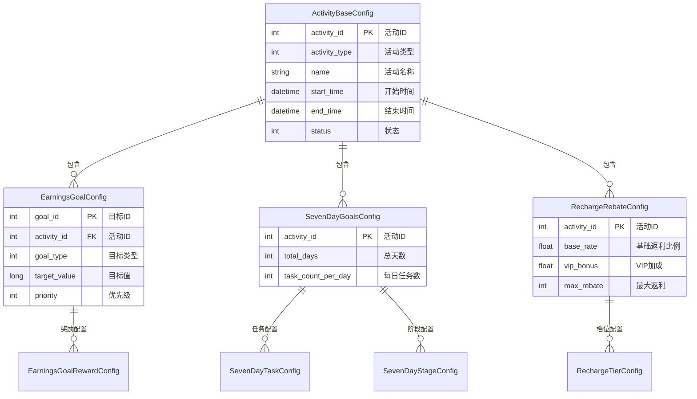
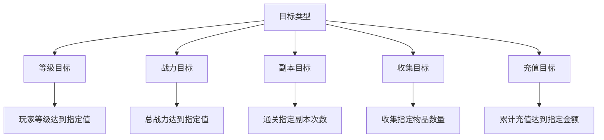
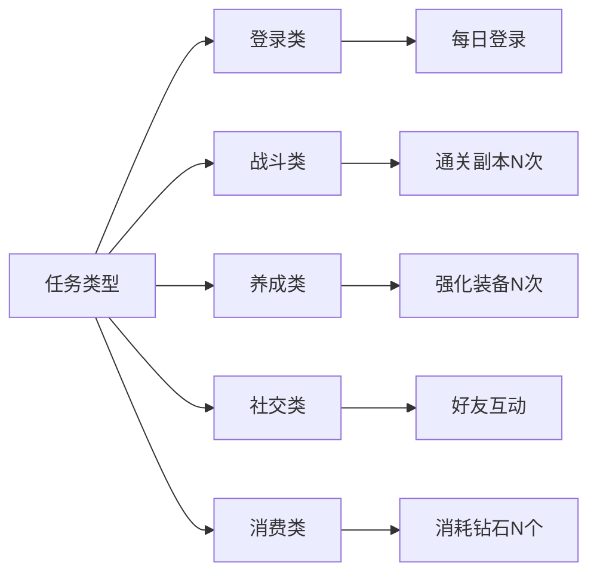
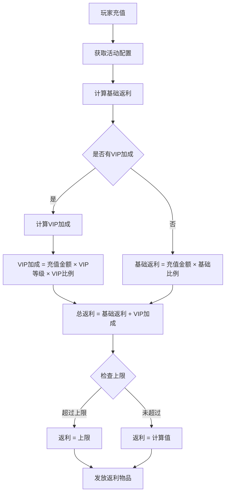
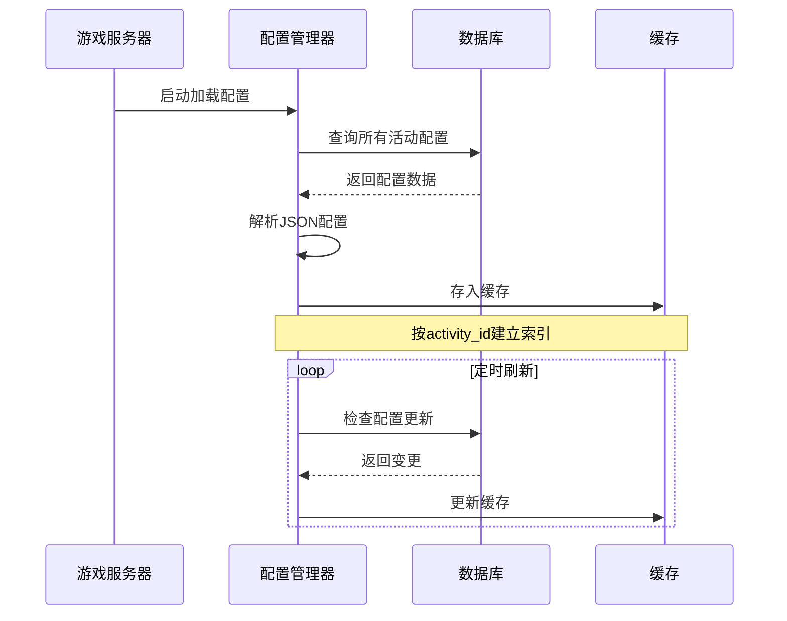

# SimpleActivityOp 模块 - 数据配表文档

## 模块概述

**模块编号**: p033
**模块名称**: SimpleActivityOp (简单活动操作)
**主要功能**: 提供收益目标、七日目标、充值返利等简单活动功能

---

## 配置表结构

### 配置表关系图



---

## 一、活动基础配置表 (ActivityBaseConfig)

### 1.1 完整字段列表

| 字段名 | 类型 | 长度 | 默认值 | 必填 | 说明 |
|--------|------|------|--------|------|------|
| activity_id | int | 11 | - | 是 | 活动ID，主键 |
| activity_type | int | 2 | - | 是 | 活动类型：1-收益目标，2-七日目标，3-充值返利 |
| name | varchar | 64 | - | 是 | 活动名称 |
| description | varchar | 256 | - | 否 | 活动描述 |
| start_time | datetime | - | - | 是 | 活动开始时间 |
| end_time | datetime | - | - | 是 | 活动结束时间 |
| status | int | 1 | 0 | 是 | 状态：0-未开启，1-进行中，2-已结束 |
| icon | varchar | 128 | - | 否 | 活动图标资源路径 |
| bg_image | varchar | 128 | - | 否 | 活动背景图资源路径 |
| show_in_list | int | 1 | 1 | 是 | 是否显示在活动列表：0-否，1-是 |
| sort_order | int | 11 | 0 | 是 | 排序权重，值越大越靠前 |
| condition_type | int | 2 | 0 | 是 | 开启条件类型：0-无，1-等级，2-VIP，3-任务 |
| condition_value | int | 11 | 0 | 是 | 开启条件值 |
| reward_mail_id | int | 11 | 0 | 是 | 活动结束时未领取奖励发送邮件ID |
| create_time | datetime | - | NOW() | 是 | 创建时间 |
| update_time | datetime | - | NOW() | 是 | 更新时间 |

### 1.2 配置示例

```json
{
    "activity_id": 1001,
    "activity_type": 1,
    "name": "战力冲刺活动",
    "description": "达到指定战力即可获得丰厚奖励！",
    "start_time": "2026-04-01 00:00:00",
    "end_time": "2026-04-07 23:59:59",
    "status": 1,
    "icon": "activity/power_sprint_icon",
    "bg_image": "activity/power_sprint_bg",
    "show_in_list": 1,
    "sort_order": 100,
    "condition_type": 1,
    "condition_value": 30,
    "reward_mail_id": 3001
}
```

---

## 二、收益目标配置表 (EarningsGoalConfig)

### 2.1 完整字段列表

| 字段名 | 类型 | 长度 | 默认值 | 必填 | 说明 |
|--------|------|------|--------|------|------|
| goal_id | int | 11 | - | 是 | 目标ID，主键 |
| activity_id | int | 11 | - | 是 | 活动ID，外键 |
| goal_type | int | 2 | - | 是 | 目标类型：1-等级，2-战力，3-副本，4-收集，5-充值 |
| target_value | long | 20 | - | 是 | 目标值 |
| name | varchar | 64 | - | 是 | 目标名称 |
| description | varchar | 256 | - | 否 | 目标描述 |
| priority | int | 11 | 0 | 是 | 显示优先级，值越大越靠前 |
| is_honor | int | 1 | 0 | 是 | 是否荣誉目标：0-否，1-是 |
| honor_name | varchar | 64 | - | 否 | 荣誉名称（荣誉目标时填写） |
| icon | varchar | 128 | - | 否 | 目标图标 |
| progress_type | int | 1 | 1 | 是 | 进度类型：1-累加，2-取最大值 |

### 2.2 目标类型说明



### 2.3 配置示例

```json
{
    "goal_id": 10101,
    "activity_id": 1001,
    "goal_type": 2,
    "target_value": 100000,
    "name": "战力达人",
    "description": "总战力达到100,000",
    "priority": 100,
    "is_honor": 0,
    "icon": "goal/power_icon",
    "progress_type": 2
},
{
    "goal_id": 10102,
    "activity_id": 1001,
    "goal_type": 2,
    "target_value": 500000,
    "name": "战力之星",
    "description": "总战力达到500,000",
    "priority": 90,
    "is_honor": 1,
    "honor_name": "战力之星称号",
    "icon": "goal/power_honor_icon",
    "progress_type": 2
}
```

---

## 三、收益目标奖励配置表 (EarningsGoalRewardConfig)

### 3.1 完整字段列表

| 字段名 | 类型 | 长度 | 默认值 | 必填 | 说明 |
|--------|------|------|--------|------|------|
| reward_id | int | 11 | - | 是 | 奖励ID，主键 |
| goal_id | int | 11 | - | 是 | 目标ID，外键 |
| item_id | int | 11 | - | 是 | 物品ID |
| item_count | int | 11 | 1 | 是 | 物品数量 |
| is_bind | int | 1 | 1 | 是 | 是否绑定：0-否，1-是 |
| show_order | int | 11 | 0 | 是 | 显示顺序 |

### 3.2 配置示例

```json
[
    {
        "reward_id": 20001,
        "goal_id": 10101,
        "item_id": 1001,
        "item_count": 500,
        "is_bind": 0,
        "show_order": 1
    },
    {
        "reward_id": 20002,
        "goal_id": 10101,
        "item_id": 2001,
        "item_count": 100,
        "is_bind": 1,
        "show_order": 2
    }
]
```

---

## 四、七日目标配置表 (SevenDayGoalsConfig)

### 4.1 完整字段列表

| 字段名 | 类型 | 长度 | 默认值 | 必填 | 说明 |
|--------|------|------|--------|------|------|
| activity_id | int | 11 | - | 是 | 活动ID，主键 |
| total_days | int | 2 | 7 | 是 | 活动总天数 |
| task_count_per_day | int | 2 | 4 | 是 | 每日任务数量 |
| refresh_time | int | 4 | 0 | 是 | 每日刷新时间（小时:分钟，如500表示5:00） |
| inherit_progress | int | 1 | 0 | 是 | 未完成任务进度是否继承：0-否，1-是 |

### 4.2 配置示例

```json
{
    "activity_id": 2001,
    "total_days": 7,
    "task_count_per_day": 4,
    "refresh_time": 500,
    "inherit_progress": 0
}
```

---

## 五、七日任务配置表 (SevenDayTaskConfig)

### 5.1 完整字段列表

| 字段名 | 类型 | 长度 | 默认值 | 必填 | 说明 |
|--------|------|------|--------|------|------|
| task_id | int | 11 | - | 是 | 任务ID，主键 |
| activity_id | int | 11 | - | 是 | 活动ID，外键 |
| day_index | int | 1 | - | 是 | 天数索引（1-7） |
| task_type | int | 3 | - | 是 | 任务类型 |
| target_value | int | 11 | - | 是 | 目标值 |
| name | varchar | 64 | - | 是 | 任务名称 |
| description | varchar | 256 | - | 否 | 任务描述 |
| icon | varchar | 128 | - | 否 | 任务图标 |
| jump_type | int | 2 | 0 | 是 | 跳转类型：0-无，1-副本，2-商店，3-其他 |
| jump_param | varchar | 64 | - | 否 | 跳转参数 |

### 5.2 任务类型枚举



### 5.3 配置示例

```json
[
    {
        "task_id": 30001,
        "activity_id": 2001,
        "day_index": 1,
        "task_type": 101,
        "target_value": 1,
        "name": "每日登录",
        "description": "登录游戏",
        "icon": "task/login_icon",
        "jump_type": 0
    },
    {
        "task_id": 30002,
        "activity_id": 2001,
        "day_index": 1,
        "task_type": 201,
        "target_value": 3,
        "name": "副本挑战",
        "description": "完成3次副本挑战",
        "icon": "task/dungeon_icon",
        "jump_type": 1,
        "jump_param": "dungeon_main"
    }
]
```

---

## 六、七日阶段奖励配置表 (SevenDayStageConfig)

### 6.1 完整字段列表

| 字段名 | 类型 | 长度 | 默认值 | 必填 | 说明 |
|--------|------|------|--------|------|------|
| stage_id | int | 11 | - | 是 | 阶段ID，主键 |
| activity_id | int | 11 | - | 是 | 活动ID，外键 |
| stage_index | int | 2 | - | 是 | 阶段索引 |
| name | varchar | 64 | - | 是 | 阶段名称 |
| require_count | int | 11 | - | 是 | 需完成任务数量 |
| description | varchar | 256 | - | 否 | 阶段描述 |
| icon | varchar | 128 | - | 否 | 阶段图标 |

### 6.2 配置示例

```json
[
    {
        "stage_id": 40001,
        "activity_id": 2001,
        "stage_index": 1,
        "name": "初露锋芒",
        "require_count": 5,
        "description": "完成5个任务",
        "icon": "stage/stage_1"
    },
    {
        "stage_id": 40002,
        "activity_id": 2001,
        "stage_index": 2,
        "name": "小有成就",
        "require_count": 12,
        "description": "完成12个任务",
        "icon": "stage/stage_2"
    }
]
```

---

## 七、充值返利配置表 (RechargeRebateConfig)

### 7.1 完整字段列表

| 字段名 | 类型 | 长度 | 默认值 | 必填 | 说明 |
|--------|------|------|--------|------|------|
| activity_id | int | 11 | - | 是 | 活动ID，主键 |
| base_rate | float | 5,2 | 0.10 | 是 | 基础返利比例（0.10表示10%） |
| vip_bonus_rate | float | 5,2 | 0.00 | 是 | 每级VIP额外返利比例 |
| daily_rebate_rate | float | 5,2 | 0.00 | 是 | 每日充值返利比例 |
| daily_max_rebate | long | 20 | 0 | 是 | 每日返利上限（0表示无上限） |
| total_max_rebate | long | 20 | 0 | 是 | 活动期间总返利上限 |
| rebate_item_id | int | 11 | 1001 | 是 | 返利发放物品ID（通常为绑定钻石） |
| rebate_item_rate | int | 11 | 10 | 是 | 返利金额转物品比例 |

### 7.2 返利计算流程



### 7.3 配置示例

```json
{
    "activity_id": 3001,
    "base_rate": 0.10,
    "vip_bonus_rate": 0.01,
    "daily_rebate_rate": 0.05,
    "daily_max_rebate": 1000,
    "total_max_rebate": 10000,
    "rebate_item_id": 1002,
    "rebate_item_rate": 10
}
```

---

## 八、充值返利档位配置表 (RechargeTierConfig)

### 8.1 完整字段列表

| 字段名 | 类型 | 长度 | 默认值 | 必填 | 说明 |
|--------|------|------|--------|------|------|
| tier_id | int | 11 | - | 是 | 档位ID，主键 |
| activity_id | int | 11 | - | 是 | 活动ID，外键 |
| recharge_amount | long | 20 | - | 是 | 累计充值金额要求 |
| name | varchar | 64 | - | 是 | 档位名称 |
| description | varchar | 256 | - | 否 | 档位描述 |
| icon | varchar | 128 | - | 否 | 档位图标 |
| show_order | int | 11 | 0 | 是 | 显示顺序 |

### 8.2 配置示例

```json
[
    {
        "tier_id": 50001,
        "activity_id": 3001,
        "recharge_amount": 100,
        "name": "青铜档位",
        "description": "累计充值100元",
        "icon": "tier/bronze",
        "show_order": 1
    },
    {
        "tier_id": 50002,
        "activity_id": 3001,
        "recharge_amount": 500,
        "name": "白银档位",
        "description": "累计充值500元",
        "icon": "tier/silver",
        "show_order": 2
    },
    {
        "tier_id": 50003,
        "activity_id": 3001,
        "recharge_amount": 1000,
        "name": "黄金档位",
        "description": "累计充值1000元",
        "icon": "tier/gold",
        "show_order": 3
    }
]
```

---

## 九、组件位置

### 9.1 服务端组件目录结构

```
game_server/UserServer/src/NPUSServer/
├── NPUserMsgDispather/p033_SimpleActivityOp/
│   ├── MsgDealer_GC2GS_033_001_ReqEarningsGoalInfo.java
│   ├── MsgDealer_GC2GS_033_002_ReqEarningsGoalDrawReward.java
│   ├── MsgDealer_GC2GS_033_003_ReqEarningsGoalDrawHonorReward.java
│   ├── MsgDealer_GC2GS_033_004_ReqSevenDayGoalsInfo.java
│   ├── MsgDealer_GC2GS_033_005_ReqSevenDayGoalsDrawReward.java
│   ├── MsgDealer_GC2GS_033_006_ReqSevenDayGoalsDrawStepReward.java
│   ├── MsgDealer_GC2GS_033_007_ReqRechargeRebateInfo.java
│   └── MsgDealer_GC2GS_033_008_ReqRechargeRebateDrawReward.java
└── NPUSUserMgr/UserComp/
    ├── SevenDayGoals/
    │   ├── SevenDayGoalsComponent.java
    │   └── SevenDayGoalsTaskCounter.java
    └── CommonActivityMgr/Activities/RechargeRebate/
        ├── _ARechargeRebateInfo.java
        ├── RechargeRebateInfo_Days.java
        ├── RechargeRebateInfo_Daily.java
        └── RechargeRebateGroupData.java
```

### 9.2 配置文件加载流程



---

## 十、数据验证规则

### 10.1 配置验证

| 验证项 | 验证规则 | 错误提示 |
|--------|----------|----------|
| activity_id | 必须大于0且唯一 | 活动ID必须为正整数且不能重复 |
| start_time | 必须小于end_time | 开始时间必须早于结束时间 |
| target_value | 必须大于0 | 目标值必须为正数 |
| base_rate | 0到1之间 | 返利比例必须在0-1之间 |
| day_index | 1到7之间 | 天数索引必须在1-7之间 |

### 10.2 数据完整性约束

```sql
-- 活动配置表约束
ALTER TABLE activity_base_config
ADD CONSTRAINT uk_activity_id UNIQUE (activity_id),
ADD CONSTRAINT chk_time_range CHECK (start_time < end_time);

-- 收益目标配置表约束
ALTER TABLE earnings_goal_config
ADD CONSTRAINT fk_activity_id FOREIGN KEY (activity_id)
REFERENCES activity_base_config(activity_id);

-- 七日任务配置表约束
ALTER TABLE seven_day_task_config
ADD CONSTRAINT chk_day_index CHECK (day_index BETWEEN 1 AND 7);
```

---

*文档生成时间: 2026-04-12*
