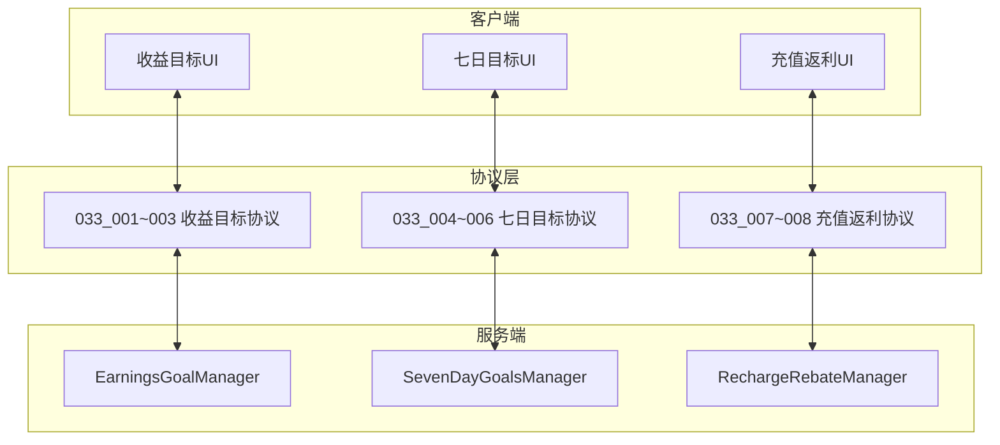
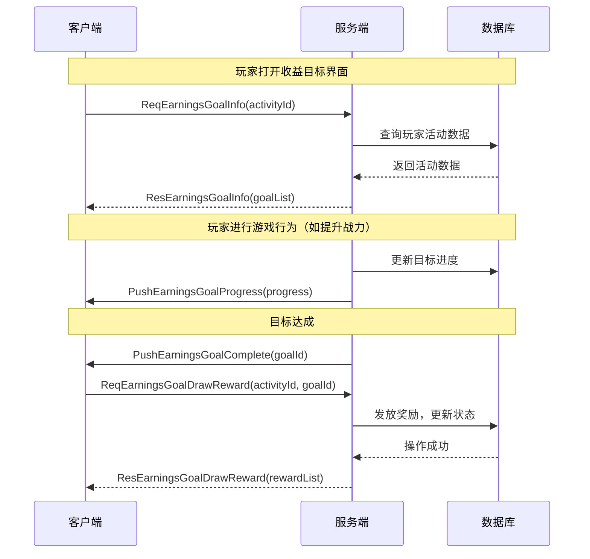
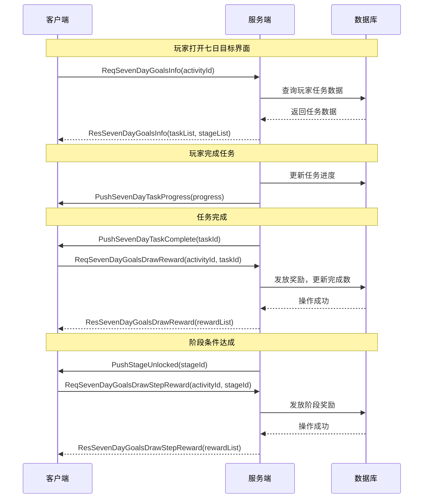
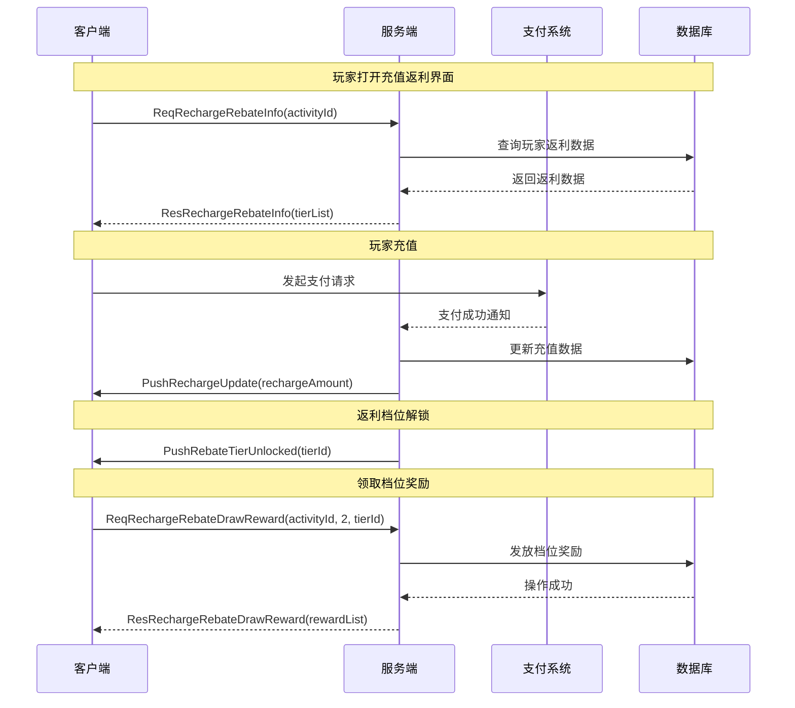
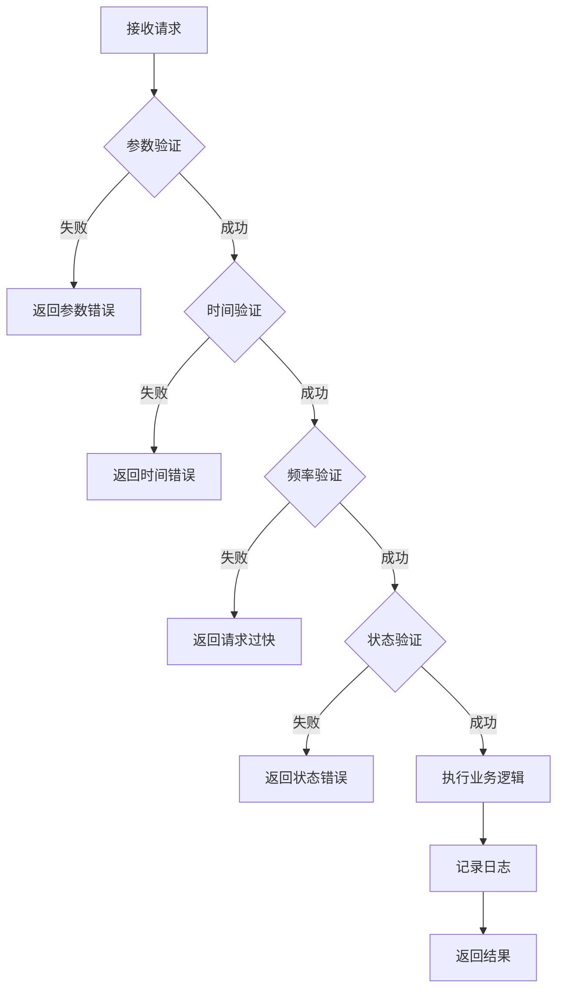

# SimpleActivityOp 模块 - 协议文档

## 协议概览

**协议编号**: p033
**协议方向**: GC2GS (客户端到服务端) / GS2GC (服务端到客户端)
**协议前缀**: Msg_GC2GS_033_xxx / Msg_GS2GC_033_xxx

---

## 协议架构图



---

## 一、客户端请求协议 (GC2GS)

### 1.1 协议列表总览

| 协议号 | 协议名 | 说明 | 触发时机 |
|--------|--------|------|----------|
| 033_001 | ReqEarningsGoalInfo | 请求收益目标信息 | 打开收益目标界面 |
| 033_002 | ReqEarningsGoalDrawReward | 领取收益目标奖励 | 点击领取按钮 |
| 033_003 | ReqEarningsGoalDrawHonorReward | 领取荣誉奖励 | 点击荣誉领取按钮 |
| 033_004 | ReqSevenDayGoalsInfo | 请求七日目标信息 | 打开七日目标界面 |
| 033_005 | ReqSevenDayGoalsDrawReward | 领取七日目标奖励 | 点击任务领取按钮 |
| 033_006 | ReqSevenDayGoalsDrawStepReward | 领取阶段奖励 | 点击阶段领取按钮 |
| 033_007 | ReqRechargeRebateInfo | 请求充值返利信息 | 打开充值返利界面 |
| 033_008 | ReqRechargeRebateDrawReward | 领取充值返利奖励 | 点击返利领取按钮 |

---

## 二、收益目标协议详情

### 2.1 GC2GS_033_001_ReqEarningsGoalInfo

**协议说明**: 请求收益目标活动信息

**请求字段**:

| 字段名 | 类型 | 必填 | 说明 |
|--------|------|------|------|
| activityId | int | 是 | 活动ID |

**请求示例**:
```json
{
    "activityId": 1001
}
```

**响应字段** (GS2GC_033_001_ResEarningsGoalInfo):

| 字段名 | 类型 | 说明 |
|--------|------|------|
| activityId | int | 活动ID |
| goalList | List\<EarningsGoalInfo\> | 目标列表 |
| honorRewardTaken | boolean | 荣誉奖励是否已领取 |

**EarningsGoalInfo 结构**:

| 字段名 | 类型 | 说明 |
|--------|------|------|
| goalId | int | 目标ID |
| progress | long | 当前进度 |
| targetValue | long | 目标值 |
| status | int | 状态：0-进行中，1-已完成，2-已领取 |

**响应示例**:
```json
{
    "activityId": 1001,
    "goalList": [
        {
            "goalId": 10101,
            "progress": 85000,
            "targetValue": 100000,
            "status": 0
        },
        {
            "goalId": 10102,
            "progress": 85000,
            "targetValue": 500000,
            "status": 0
        }
    ],
    "honorRewardTaken": false
}
```

---

### 2.2 GC2GS_033_002_ReqEarningsGoalDrawReward

**协议说明**: 领取收益目标奖励

**请求字段**:

| 字段名 | 类型 | 必填 | 说明 |
|--------|------|------|------|
| activityId | int | 是 | 活动ID |
| goalId | int | 是 | 目标ID |

**请求示例**:
```json
{
    "activityId": 1001,
    "goalId": 10101
}
```

**响应字段** (GS2GC_033_002_ResEarningsGoalDrawReward):

| 字段名 | 类型 | 说明 |
|--------|------|------|
| resultCode | int | 结果码，0表示成功 |
| resultMsg | string | 结果消息 |
| goalId | int | 目标ID |
| rewardList | List\<RewardItem\> | 获得的奖励列表 |

**RewardItem 结构**:

| 字段名 | 类型 | 说明 |
|--------|------|------|
| itemId | int | 物品ID |
| count | int | 物品数量 |
| isBind | boolean | 是否绑定 |

**响应示例**:
```json
{
    "resultCode": 0,
    "resultMsg": "领取成功",
    "goalId": 10101,
    "rewardList": [
        {"itemId": 1001, "count": 500, "isBind": false},
        {"itemId": 2001, "count": 100, "isBind": true}
    ]
}
```

---

### 2.3 GC2GS_033_003_ReqEarningsGoalDrawHonorReward

**协议说明**: 领取荣誉奖励

**请求字段**:

| 字段名 | 类型 | 必填 | 说明 |
|--------|------|------|------|
| activityId | int | 是 | 活动ID |

**请求示例**:
```json
{
    "activityId": 1001
}
```

**响应字段** (GS2GC_033_003_ResEarningsGoalDrawHonorReward):

| 字段名 | 类型 | 说明 |
|--------|------|------|
| resultCode | int | 结果码 |
| resultMsg | string | 结果消息 |
| honorName | string | 荣誉名称 |
| rewardList | List\<RewardItem\> | 获得的奖励列表 |

**响应示例**:
```json
{
    "resultCode": 0,
    "resultMsg": "领取成功",
    "honorName": "战力之星称号",
    "rewardList": [
        {"itemId": 5001, "count": 1, "isBind": false}
    ]
}
```

---

## 三、七日目标协议详情

### 3.1 GC2GS_033_004_ReqSevenDayGoalsInfo

**协议说明**: 请求七日目标活动信息

**请求字段**:

| 字段名 | 类型 | 必填 | 说明 |
|--------|------|------|------|
| activityId | int | 是 | 活动ID |

**请求示例**:
```json
{
    "activityId": 2001
}
```

**响应字段** (GS2GC_033_004_ResSevenDayGoalsInfo):

| 字段名 | 类型 | 说明 |
|--------|------|------|
| activityId | int | 活动ID |
| currentDay | int | 当前天数（1-7） |
| totalCompleteCount | int | 总完成任务数 |
| taskList | List\<SevenDayTaskInfo\> | 任务列表 |
| stageList | List\<StageInfo\> | 阶段奖励信息 |

**SevenDayTaskInfo 结构**:

| 字段名 | 类型 | 说明 |
|--------|------|------|
| taskId | int | 任务ID |
| dayIndex | int | 所属天数 |
| progress | int | 当前进度 |
| targetValue | int | 目标值 |
| status | int | 状态：0-未完成，1-已完成，2-已领取 |

**StageInfo 结构**:

| 字段名 | 类型 | 说明 |
|--------|------|------|
| stageId | int | 阶段ID |
| requireCount | int | 需完成任务数 |
| isUnlocked | boolean | 是否已解锁 |
| isTaken | boolean | 是否已领取 |

**响应示例**:
```json
{
    "activityId": 2001,
    "currentDay": 3,
    "totalCompleteCount": 8,
    "taskList": [
        {
            "taskId": 30001,
            "dayIndex": 1,
            "progress": 1,
            "targetValue": 1,
            "status": 2
        },
        {
            "taskId": 30002,
            "dayIndex": 3,
            "progress": 2,
            "targetValue": 3,
            "status": 0
        }
    ],
    "stageList": [
        {
            "stageId": 40001,
            "requireCount": 5,
            "isUnlocked": true,
            "isTaken": true
        },
        {
            "stageId": 40002,
            "requireCount": 12,
            "isUnlocked": false,
            "isTaken": false
        }
    ]
}
```

---

### 3.2 GC2GS_033_005_ReqSevenDayGoalsDrawReward

**协议说明**: 领取七日目标任务奖励

**请求字段**:

| 字段名 | 类型 | 必填 | 说明 |
|--------|------|------|------|
| activityId | int | 是 | 活动ID |
| taskId | int | 是 | 任务ID |

**请求示例**:
```json
{
    "activityId": 2001,
    "taskId": 30001
}
```

**响应字段** (GS2GC_033_005_ResSevenDayGoalsDrawReward):

| 字段名 | 类型 | 说明 |
|--------|------|------|
| resultCode | int | 结果码 |
| resultMsg | string | 结果消息 |
| taskId | int | 任务ID |
| totalCompleteCount | int | 更新后的总完成数 |
| rewardList | List\<RewardItem\> | 获得的奖励列表 |

**响应示例**:
```json
{
    "resultCode": 0,
    "resultMsg": "领取成功",
    "taskId": 30001,
    "totalCompleteCount": 9,
    "rewardList": [
        {"itemId": 1001, "count": 100, "isBind": true}
    ]
}
```

---

### 3.3 GC2GS_033_006_ReqSevenDayGoalsDrawStepReward

**协议说明**: 领取阶段奖励

**请求字段**:

| 字段名 | 类型 | 必填 | 说明 |
|--------|------|------|------|
| activityId | int | 是 | 活动ID |
| stageId | int | 是 | 阶段ID |

**请求示例**:
```json
{
    "activityId": 2001,
    "stageId": 40001
}
```

**响应字段** (GS2GC_033_006_ResSevenDayGoalsDrawStepReward):

| 字段名 | 类型 | 说明 |
|--------|------|------|
| resultCode | int | 结果码 |
| resultMsg | string | 结果消息 |
| stageId | int | 阶段ID |
| rewardList | List\<RewardItem\> | 获得的奖励列表 |

**响应示例**:
```json
{
    "resultCode": 0,
    "resultMsg": "领取成功",
    "stageId": 40001,
    "rewardList": [
        {"itemId": 1001, "count": 200, "isBind": false},
        {"itemId": 3001, "count": 5, "isBind": false}
    ]
}
```

---

## 四、充值返利协议详情

### 4.1 GC2GS_033_007_ReqRechargeRebateInfo

**协议说明**: 请求充值返利活动信息

**请求字段**:

| 字段名 | 类型 | 必填 | 说明 |
|--------|------|------|------|
| activityId | int | 是 | 活动ID |

**请求示例**:
```json
{
    "activityId": 3001
}
```

**响应字段** (GS2GC_033_007_ResRechargeRebateInfo):

| 字段名 | 类型 | 说明 |
|--------|------|------|
| activityId | int | 活动ID |
| totalRecharge | long | 累计充值金额 |
| dailyRecharge | long | 今日充值金额 |
| dailyRebateTaken | boolean | 今日返利是否已领取 |
| tierList | List\<RebateTierInfo\> | 返利档位列表 |

**RebateTierInfo 结构**:

| 字段名 | 类型 | 说明 |
|--------|------|------|
| tierId | int | 档位ID |
| rechargeAmount | long | 档位充值金额 |
| currentProgress | long | 当前进度 |
| isUnlocked | boolean | 是否已解锁 |
| isTaken | boolean | 是否已领取 |

**响应示例**:
```json
{
    "activityId": 3001,
    "totalRecharge": 500,
    "dailyRecharge": 100,
    "dailyRebateTaken": false,
    "tierList": [
        {
            "tierId": 50001,
            "rechargeAmount": 100,
            "currentProgress": 500,
            "isUnlocked": true,
            "isTaken": true
        },
        {
            "tierId": 50002,
            "rechargeAmount": 500,
            "currentProgress": 500,
            "isUnlocked": true,
            "isTaken": false
        },
        {
            "tierId": 50003,
            "rechargeAmount": 1000,
            "currentProgress": 500,
            "isUnlocked": false,
            "isTaken": false
        }
    ]
}
```

---

### 4.2 GC2GS_033_008_ReqRechargeRebateDrawReward

**协议说明**: 领取充值返利奖励

**请求字段**:

| 字段名 | 类型 | 必填 | 说明 |
|--------|------|------|------|
| activityId | int | 是 | 活动ID |
| drawType | int | 是 | 领取类型：1-每日返利，2-档位返利 |
| tierId | int | 否 | 档位ID（drawType=2时必填） |

**请求示例**:
```json
{
    "activityId": 3001,
    "drawType": 2,
    "tierId": 50002
}
```

**响应字段** (GS2GC_033_008_ResRechargeRebateDrawReward):

| 字段名 | 类型 | 说明 |
|--------|------|------|
| resultCode | int | 结果码 |
| resultMsg | string | 结果消息 |
| drawType | int | 领取类型 |
| tierId | int | 档位ID（档位返利时返回） |
| rebateAmount | long | 返利金额 |
| rewardList | List\<RewardItem\> | 获得的奖励列表 |

**响应示例**:
```json
{
    "resultCode": 0,
    "resultMsg": "领取成功",
    "drawType": 2,
    "tierId": 50002,
    "rebateAmount": 0,
    "rewardList": [
        {"itemId": 1001, "count": 600, "isBind": false}
    ]
}
```

---

## 五、服务端推送协议 (GS2GC)

### 5.1 推送协议列表

| 协议号 | 协议名 | 说明 | 触发时机 |
|--------|--------|------|----------|
| 033_101 | PushEarningsGoalProgress | 推送目标进度更新 | 目标进度变化 |
| 033_102 | PushEarningsGoalComplete | 推送目标完成 | 目标达成 |
| 033_103 | PushSevenDayTaskProgress | 推送任务进度更新 | 任务进度变化 |
| 033_104 | PushSevenDayTaskComplete | 推送任务完成 | 任务完成 |
| 033_105 | PushStageUnlocked | 推送阶段解锁 | 阶段条件达成 |
| 033_106 | PushRechargeUpdate | 推送充值更新 | 充值成功 |
| 033_107 | PushRebateTierUnlocked | 推送档位解锁 | 返利档位解锁 |

---

### 5.2 GS2GC_033_101_PushEarningsGoalProgress

**协议说明**: 推送收益目标进度更新

**推送字段**:

| 字段名 | 类型 | 说明 |
|--------|------|------|
| activityId | int | 活动ID |
| goalId | int | 目标ID |
| progress | long | 最新进度 |

**推送示例**:
```json
{
    "activityId": 1001,
    "goalId": 10101,
    "progress": 95000
}
```

---

### 5.3 GS2GC_033_102_PushEarningsGoalComplete

**协议说明**: 推送收益目标完成通知

**推送字段**:

| 字段名 | 类型 | 说明 |
|--------|------|------|
| activityId | int | 活动ID |
| goalId | int | 目标ID |
| goalName | string | 目标名称 |

**推送示例**:
```json
{
    "activityId": 1001,
    "goalId": 10101,
    "goalName": "战力达人"
}
```

---

### 5.4 GS2GC_033_105_PushStageUnlocked

**协议说明**: 推送阶段解锁通知

**推送字段**:

| 字段名 | 类型 | 说明 |
|--------|------|------|
| activityId | int | 活动ID |
| stageId | int | 阶段ID |
| stageName | string | 阶段名称 |

**推送示例**:
```json
{
    "activityId": 2001,
    "stageId": 40001,
    "stageName": "初露锋芒"
}
```

---

### 5.5 GS2GC_033_106_PushRechargeUpdate

**协议说明**: 推送充值更新通知

**推送字段**:

| 字段名 | 类型 | 说明 |
|--------|------|------|
| activityId | int | 活动ID |
| rechargeAmount | long | 本次充值金额 |
| totalRecharge | long | 累计充值金额 |
| dailyRecharge | long | 今日充值金额 |

**推送示例**:
```json
{
    "activityId": 3001,
    "rechargeAmount": 100,
    "totalRecharge": 600,
    "dailyRecharge": 200
}
```

---

## 六、协议交互时序图

### 6.1 收益目标完整交互流程



### 6.2 七日目标完整交互流程



### 6.3 充值返利完整交互流程



---

## 七、错误码定义

### 7.1 通用错误码

| 错误码 | 错误信息 | 说明 |
|--------|----------|------|
| 0 | 成功 | 操作成功 |
| 33001 | 活动不存在 | 请求的活动ID无效 |
| 33002 | 活动未开始 | 当前时间早于活动开始时间 |
| 33003 | 活动已结束 | 当前时间晚于活动结束时间 |
| 33004 | 活动未开启 | 活动状态为未开启 |

### 7.2 收益目标错误码

| 错误码 | 错误信息 | 说明 |
|--------|----------|------|
| 33101 | 目标不存在 | 目标ID无效 |
| 33102 | 目标未完成 | 进度未达到目标值 |
| 33103 | 奖励已领取 | 目标奖励已领取过 |
| 33104 | 荣誉奖励条件未满足 | 未达成所有荣誉目标 |
| 33105 | 荣誉奖励已领取 | 荣誉奖励已领取过 |

### 7.3 七日目标错误码

| 错误码 | 错误信息 | 说明 |
|--------|----------|------|
| 33201 | 任务不存在 | 任务ID无效 |
| 33202 | 任务未完成 | 任务进度未达标 |
| 33203 | 任务奖励已领取 | 任务奖励已领取过 |
| 33204 | 任务已过期 | 任务所属天数已过 |
| 33205 | 阶段不存在 | 阶段ID无效 |
| 33206 | 阶段未解锁 | 未达到阶段解锁条件 |
| 33207 | 阶段奖励已领取 | 阶段奖励已领取过 |

### 7.4 充值返利错误码

| 错误码 | 错误信息 | 说明 |
|--------|----------|------|
| 33301 | 档位不存在 | 档位ID无效 |
| 33302 | 档位未解锁 | 累计充值未达到档位要求 |
| 33303 | 档位奖励已领取 | 档位奖励已领取过 |
| 33304 | 每日返利已领取 | 今日返利已领取 |
| 33305 | 今日无充值 | 今日未充值，无法领取每日返利 |
| 33306 | 返利已达上限 | 活动期间返利已达上限 |

---

## 八、协议安全验证

### 8.1 请求验证规则

| 验证项 | 验证规则 | 失败处理 |
|--------|----------|----------|
| 玩家登录状态 | 检查sessionId有效性 | 返回错误，断开连接 |
| 活动ID有效性 | 检查活动配置存在 | 返回错误码33001 |
| 活动时间范围 | 检查当前时间在活动期间 | 返回错误码33002/33003 |
| 参数合法性 | 检查必填参数和类型 | 返回参数错误 |
| 操作频率 | 检查请求频率限制 | 返回请求过快 |

### 8.2 防作弊验证



---

*文档生成时间: 2026-04-12*
