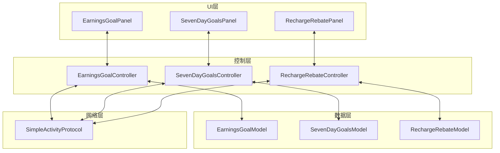
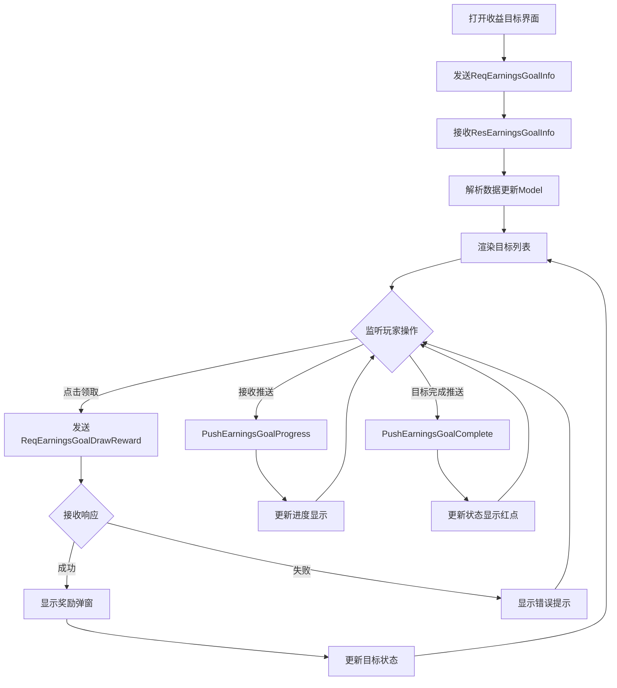
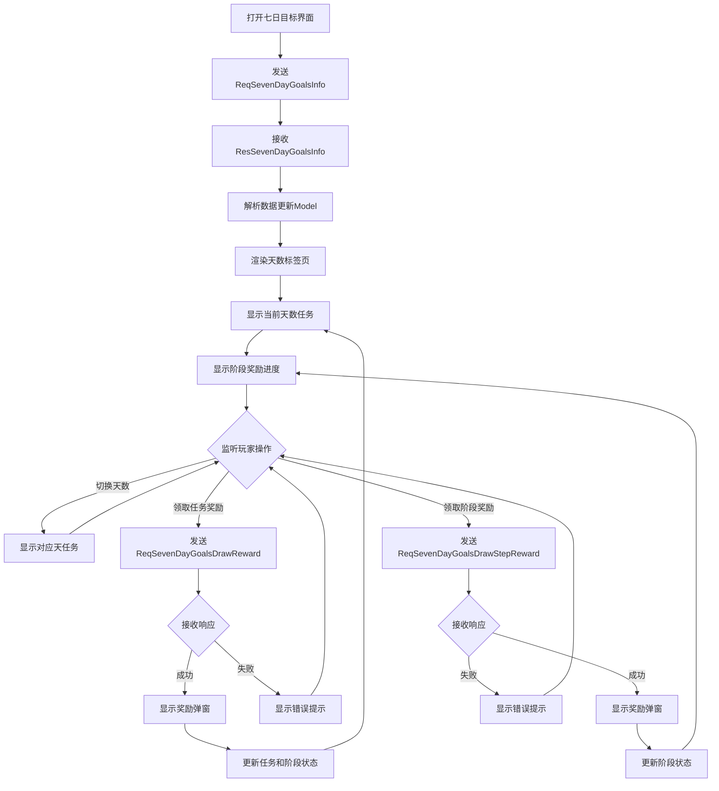
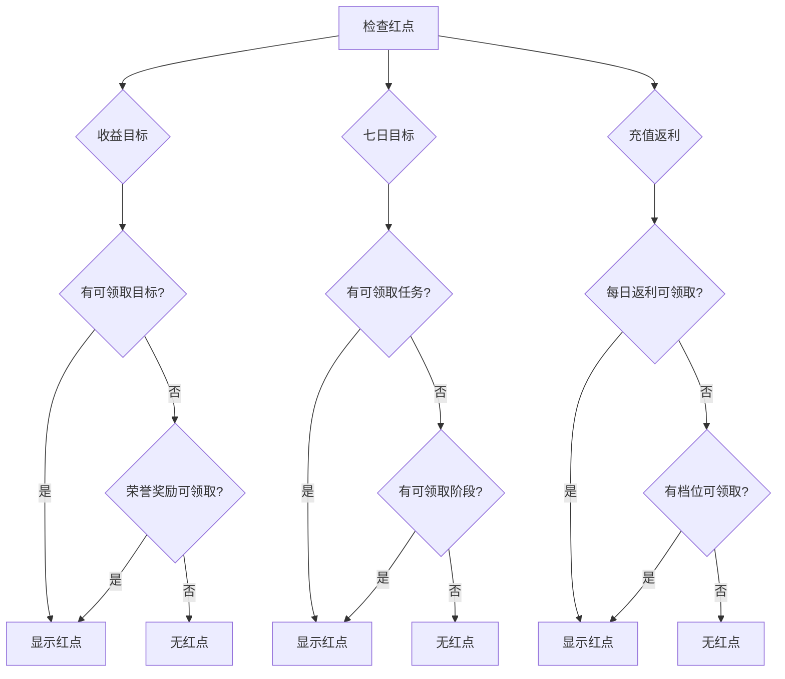

# SimpleActivityOp 模块 - 客户端开发文档

## 模块概述

本模块功能集成在 CommonActivity 组件中，提供收益目标、七日目标、充值返利三大活动功能的客户端实现。

---

## 一、客户端架构

### 1.1 模块架构图



### 1.2 目录结构

```
game_client/Assets/Scripts/LogicScripts/
├── GameWndGui/GGui/
│   ├── EarningsGoal/
│   │   ├── EarningsGoalPanel.cs
│   │   ├── EarningsGoalItem.cs
│   │   └── EarningsGoalController.cs
│   ├── SevenDayGoals/
│   │   ├── SevenDayGoalsPanel.cs
│   │   ├── SevenDayTaskItem.cs
│   │   ├── SevenDayStageItem.cs
│   │   └── SevenDayGoalsController.cs
│   └── RechargeRebate/
│       ├── RechargeRebatePanel.cs
│       ├── RebateTierItem.cs
│       └── RechargeRebateController.cs
├── Model/Activity/
│   ├── EarningsGoalModel.cs
│   ├── SevenDayGoalsModel.cs
│   └── RechargeRebateModel.cs
└── Protocol/
    └── SimpleActivityProtocol.cs
```

---

## 二、数据模型定义

### 2.1 EarningsGoalModel

```csharp
/// <summary>
/// 收益目标数据模型
/// </summary>
public class EarningsGoalModel
{
    /// <summary>活动ID</summary>
    public int ActivityId { get; set; }

    /// <summary>目标列表</summary>
    public List<EarningsGoalInfo> GoalList { get; set; } = new List<EarningsGoalInfo>();

    /// <summary>荣誉奖励是否已领取</summary>
    public bool HonorRewardTaken { get; set; }

    /// <summary>
    /// 获取可领取的目标数量
    /// </summary>
    public int GetCanDrawCount()
    {
        return GoalList.Count(g => g.Status == 1);
    }

    /// <summary>
    /// 检查是否有红点
    /// </summary>
    public bool HasRedDot()
    {
        return GetCanDrawCount() > 0 || (IsHonorAvailable() && !HonorRewardTaken);
    }

    /// <summary>
    /// 检查荣誉奖励是否可用
    /// </summary>
    public bool IsHonorAvailable()
    {
        // 所有荣誉目标都已完成
        var honorGoals = GoalList.Where(g => g.IsHonor).ToList();
        return honorGoals.Any() && honorGoals.All(g => g.Status >= 1);
    }
}

/// <summary>
/// 收益目标信息
/// </summary>
public class EarningsGoalInfo
{
    /// <summary>目标ID</summary>
    public int GoalId { get; set; }

    /// <summary>当前进度</summary>
    public long Progress { get; set; }

    /// <summary>目标值</summary>
    public long TargetValue { get; set; }

    /// <summary>状态：0-进行中，1-已完成，2-已领取</summary>
    public int Status { get; set; }

    /// <summary>是否荣誉目标</summary>
    public bool IsHonor { get; set; }

    /// <summary>目标名称（从配置读取）</summary>
    public string Name { get; set; }

    /// <summary>目标描述（从配置读取）</summary>
    public string Description { get; set; }

    /// <summary>
    /// 获取进度百分比
    /// </summary>
    public float GetProgressPercent()
    {
        if (TargetValue <= 0) return 0;
        return Math.Min((float)Progress / TargetValue, 1f);
    }

    /// <summary>
    /// 获取格式化的进度文本
    /// </summary>
    public string GetProgressText()
    {
        return $"{FormatNumber(Progress)}/{FormatNumber(TargetValue)}";
    }

    private string FormatNumber(long num)
    {
        if (num >= 10000)
            return $"{num / 10000f:F1}万";
        return num.ToString();
    }
}
```

### 2.2 SevenDayGoalsModel

```csharp
/// <summary>
/// 七日目标数据模型
/// </summary>
public class SevenDayGoalsModel
{
    /// <summary>活动ID</summary>
    public int ActivityId { get; set; }

    /// <summary>当前天数</summary>
    public int CurrentDay { get; set; }

    /// <summary>总完成任务数</summary>
    public int TotalCompleteCount { get; set; }

    /// <summary>任务列表</summary>
    public List<SevenDayTaskInfo> TaskList { get; set; } = new List<SevenDayTaskInfo>();

    /// <summary>阶段列表</summary>
    public List<StageInfo> StageList { get; set; } = new List<StageInfo>();

    /// <summary>
    /// 获取指定天数的任务
    /// </summary>
    public List<SevenDayTaskInfo> GetTasksByDay(int dayIndex)
    {
        return TaskList.Where(t => t.DayIndex == dayIndex).ToList();
    }

    /// <summary>
    /// 获取当前天数的任务
    /// </summary>
    public List<SevenDayTaskInfo> GetCurrentDayTasks()
    {
        return GetTasksByDay(CurrentDay);
    }

    /// <summary>
    /// 检查是否有可领取的任务
    /// </summary>
    public bool HasCanDrawTask()
    {
        return GetCurrentDayTasks().Any(t => t.Status == 1);
    }

    /// <summary>
    /// 检查是否有可领取的阶段奖励
    /// </summary>
    public bool HasCanDrawStage()
    {
        return StageList.Any(s => s.IsUnlocked && !s.IsTaken);
    }

    /// <summary>
    /// 获取红点状态
    /// </summary>
    public bool HasRedDot()
    {
        return HasCanDrawTask() || HasCanDrawStage();
    }
}

/// <summary>
/// 七日任务信息
/// </summary>
public class SevenDayTaskInfo
{
    /// <summary>任务ID</summary>
    public int TaskId { get; set; }

    /// <summary>所属天数</summary>
    public int DayIndex { get; set; }

    /// <summary>当前进度</summary>
    public int Progress { get; set; }

    /// <summary>目标值</summary>
    public int TargetValue { get; set; }

    /// <summary>状态：0-未完成，1-已完成，2-已领取</summary>
    public int Status { get; set; }

    /// <summary>
    /// 获取进度百分比
    /// </summary>
    public float GetProgressPercent()
    {
        if (TargetValue <= 0) return 0;
        return Math.Min((float)Progress / TargetValue, 1f);
    }
}

/// <summary>
/// 阶段信息
/// </summary>
public class StageInfo
{
    /// <summary>阶段ID</summary>
    public int StageId { get; set; }

    /// <summary>需完成任务数</summary>
    public int RequireCount { get; set; }

    /// <summary>是否已解锁</summary>
    public bool IsUnlocked { get; set; }

    /// <summary>是否已领取</summary>
    public bool IsTaken { get; set; }

    /// <summary>阶段名称（从配置读取）</summary>
    public string Name { get; set; }
}
```

### 2.3 RechargeRebateModel

```csharp
/// <summary>
/// 充值返利数据模型
/// </summary>
public class RechargeRebateModel
{
    /// <summary>活动ID</summary>
    public int ActivityId { get; set; }

    /// <summary>累计充值金额</summary>
    public long TotalRecharge { get; set; }

    /// <summary>今日充值金额</summary>
    public long DailyRecharge { get; set; }

    /// <summary>今日返利是否已领取</summary>
    public bool DailyRebateTaken { get; set; }

    /// <summary>返利档位列表</summary>
    public List<RebateTierInfo> TierList { get; set; } = new List<RebateTierInfo>();

    /// <summary>
    /// 检查是否有可领取的奖励
    /// </summary>
    public bool HasCanDrawReward()
    {
        // 每日返利
        if (DailyRecharge > 0 && !DailyRebateTaken)
            return true;

        // 档位返利
        return TierList.Any(t => t.IsUnlocked && !t.IsTaken);
    }

    /// <summary>
    /// 获取红点状态
    /// </summary>
    public bool HasRedDot()
    {
        return HasCanDrawReward();
    }

    /// <summary>
    /// 获取进度百分比（基于最高档位）
    /// </summary>
    public float GetMaxProgressPercent()
    {
        if (TierList.Count == 0) return 0;
        var maxTier = TierList.OrderByDescending(t => t.RechargeAmount).First();
        return Math.Min((float)TotalRecharge / maxTier.RechargeAmount, 1f);
    }
}

/// <summary>
/// 返利档位信息
/// </summary>
public class RebateTierInfo
{
    /// <summary>档位ID</summary>
    public int TierId { get; set; }

    /// <summary>档位充值金额</summary>
    public long RechargeAmount { get; set; }

    /// <summary>当前进度</summary>
    public long CurrentProgress { get; set; }

    /// <summary>是否已解锁</summary>
    public bool IsUnlocked { get; set; }

    /// <summary>是否已领取</summary>
    public bool IsTaken { get; set; }

    /// <summary>档位名称（从配置读取）</summary>
    public string Name { get; set; }
}
```

---

## 三、控制器实现

### 3.1 EarningsGoalController

```csharp
using UnityEngine;
using System.Collections.Generic;

/// <summary>
/// 收益目标控制器
/// </summary>
public class EarningsGoalController : MonoBehaviour
{
    private EarningsGoalModel model;
    private EarningsGoalPanel panel;

    private void Awake()
    {
        model = new EarningsGoalModel();
    }

    private void Start()
    {
        // 注册协议回调
        RegisterProtocolCallbacks();
    }

    private void OnDestroy()
    {
        // 注销协议回调
        UnregisterProtocolCallbacks();
    }

    #region 协议注册

    private void RegisterProtocolCallbacks()
    {
        NetworkManager.Instance.RegisterCallback<GS2GC_033_001_ResEarningsGoalInfo>(OnResEarningsGoalInfo);
        NetworkManager.Instance.RegisterCallback<GS2GC_033_002_ResEarningsGoalDrawReward>(OnResEarningsGoalDrawReward);
        NetworkManager.Instance.RegisterCallback<GS2GC_033_003_ResEarningsGoalDrawHonorReward>(OnResEarningsGoalDrawHonorReward);
        NetworkManager.Instance.RegisterCallback<GS2GC_033_101_PushEarningsGoalProgress>(OnPushEarningsGoalProgress);
        NetworkManager.Instance.RegisterCallback<GS2GC_033_102_PushEarningsGoalComplete>(OnPushEarningsGoalComplete);
    }

    private void UnregisterProtocolCallbacks()
    {
        NetworkManager.Instance.UnregisterCallback<GS2GC_033_001_ResEarningsGoalInfo>(OnResEarningsGoalInfo);
        NetworkManager.Instance.UnregisterCallback<GS2GC_033_002_ResEarningsGoalDrawReward>(OnResEarningsGoalDrawReward);
        NetworkManager.Instance.UnregisterCallback<GS2GC_033_003_ResEarningsGoalDrawHonorReward>(OnResEarningsGoalDrawHonorReward);
        NetworkManager.Instance.UnregisterCallback<GS2GC_033_101_PushEarningsGoalProgress>(OnPushEarningsGoalProgress);
        NetworkManager.Instance.UnregisterCallback<GS2GC_033_102_PushEarningsGoalComplete>(OnPushEarningsGoalComplete);
    }

    #endregion

    #region 发送请求

    /// <summary>
    /// 请求收益目标信息
    /// </summary>
    public void RequestEarningsGoalInfo(int activityId)
    {
        var req = new GC2GS_033_001_ReqEarningsGoalInfo
        {
            activityId = activityId
        };
        NetworkManager.Instance.Send(req);
    }

    /// <summary>
    /// 领取目标奖励
    /// </summary>
    public void RequestDrawReward(int activityId, int goalId)
    {
        var req = new GC2GS_033_002_ReqEarningsGoalDrawReward
        {
            activityId = activityId,
            goalId = goalId
        };
        NetworkManager.Instance.Send(req);
    }

    /// <summary>
    /// 领取荣誉奖励
    /// </summary>
    public void RequestDrawHonorReward(int activityId)
    {
        var req = new GC2GS_033_003_ReqEarningsGoalDrawHonorReward
        {
            activityId = activityId
        };
        NetworkManager.Instance.Send(req);
    }

    #endregion

    #region 协议回调

    private void OnResEarningsGoalInfo(GS2GC_033_001_ResEarningsGoalInfo res)
    {
        model.ActivityId = res.activityId;
        model.GoalList.Clear();

        foreach (var goalInfo in res.goalList)
        {
            var goal = new EarningsGoalInfo
            {
                GoalId = goalInfo.goalId,
                Progress = goalInfo.progress,
                TargetValue = goalInfo.targetValue,
                Status = goalInfo.status
            };

            // 从配置读取名称和描述
            var config = ConfigManager.Instance.GetEarningsGoalConfig(goalInfo.goalId);
            if (config != null)
            {
                goal.Name = config.name;
                goal.Description = config.description;
                goal.IsHonor = config.isHonor == 1;
            }

            model.GoalList.Add(goal);
        }

        model.HonorRewardTaken = res.honorRewardTaken;

        // 更新UI
        UpdatePanel();

        // 更新红点
        RedDotManager.Instance.UpdateRedDot(RedDotType.EarningsGoal, model.HasRedDot());
    }

    private void OnResEarningsGoalDrawReward(GS2GC_033_002_ResEarningsGoalDrawReward res)
    {
        if (res.resultCode != 0)
        {
            UIManager.Instance.ShowToast(res.resultMsg);
            return;
        }

        // 更新目标状态
        var goal = model.GoalList.Find(g => g.GoalId == res.goalId);
        if (goal != null)
        {
            goal.Status = 2;
        }

        // 显示奖励
        UIManager.Instance.ShowRewardPanel(res.rewardList);

        // 更新UI
        UpdatePanel();
        RedDotManager.Instance.UpdateRedDot(RedDotType.EarningsGoal, model.HasRedDot());
    }

    private void OnResEarningsGoalDrawHonorReward(GS2GC_033_003_ResEarningsGoalDrawHonorReward res)
    {
        if (res.resultCode != 0)
        {
            UIManager.Instance.ShowToast(res.resultMsg);
            return;
        }

        model.HonorRewardTaken = true;

        // 显示奖励
        UIManager.Instance.ShowRewardPanel(res.rewardList);

        // 更新UI
        UpdatePanel();
        RedDotManager.Instance.UpdateRedDot(RedDotType.EarningsGoal, model.HasRedDot());
    }

    private void OnPushEarningsGoalProgress(GS2GC_033_101_PushEarningsGoalProgress push)
    {
        var goal = model.GoalList.Find(g => g.GoalId == push.goalId);
        if (goal != null)
        {
            goal.Progress = push.progress;
            UpdatePanel();
        }
    }

    private void OnPushEarningsGoalComplete(GS2GC_033_102_PushEarningsGoalComplete push)
    {
        var goal = model.GoalList.Find(g => g.GoalId == push.goalId);
        if (goal != null)
        {
            goal.Status = 1;
            UpdatePanel();
            RedDotManager.Instance.UpdateRedDot(RedDotType.EarningsGoal, model.HasRedDot());

            // 显示完成提示
            UIManager.Instance.ShowToast($"恭喜完成目标【{push.goalName}】！");
        }
    }

    #endregion

    #region UI更新

    private void UpdatePanel()
    {
        if (panel == null || !panel.gameObject.activeSelf) return;
        panel.UpdateView(model);
    }

    #endregion
}
```

### 3.2 SevenDayGoalsController

```csharp
using UnityEngine;
using System.Collections.Generic;
using System.Linq;

/// <summary>
/// 七日目标控制器
/// </summary>
public class SevenDayGoalsController : MonoBehaviour
{
    private SevenDayGoalsModel model;
    private SevenDayGoalsPanel panel;

    private void Awake()
    {
        model = new SevenDayGoalsModel();
    }

    private void Start()
    {
        RegisterProtocolCallbacks();
    }

    private void OnDestroy()
    {
        UnregisterProtocolCallbacks();
    }

    #region 协议注册

    private void RegisterProtocolCallbacks()
    {
        NetworkManager.Instance.RegisterCallback<GS2GC_033_004_ResSevenDayGoalsInfo>(OnResSevenDayGoalsInfo);
        NetworkManager.Instance.RegisterCallback<GS2GC_033_005_ResSevenDayGoalsDrawReward>(OnResSevenDayGoalsDrawReward);
        NetworkManager.Instance.RegisterCallback<GS2GC_033_006_ResSevenDayGoalsDrawStepReward>(OnResSevenDayGoalsDrawStepReward);
        NetworkManager.Instance.RegisterCallback<GS2GC_033_103_PushSevenDayTaskProgress>(OnPushSevenDayTaskProgress);
        NetworkManager.Instance.RegisterCallback<GS2GC_033_104_PushSevenDayTaskComplete>(OnPushSevenDayTaskComplete);
        NetworkManager.Instance.RegisterCallback<GS2GC_033_105_PushStageUnlocked>(OnPushStageUnlocked);
    }

    private void UnregisterProtocolCallbacks()
    {
        NetworkManager.Instance.UnregisterCallback<GS2GC_033_004_ResSevenDayGoalsInfo>(OnResSevenDayGoalsInfo);
        NetworkManager.Instance.UnregisterCallback<GS2GC_033_005_ResSevenDayGoalsDrawReward>(OnResSevenDayGoalsDrawReward);
        NetworkManager.Instance.UnregisterCallback<GS2GC_033_006_ResSevenDayGoalsDrawStepReward>(OnResSevenDayGoalsDrawStepReward);
        NetworkManager.Instance.UnregisterCallback<GS2GC_033_103_PushSevenDayTaskProgress>(OnPushSevenDayTaskProgress);
        NetworkManager.Instance.UnregisterCallback<GS2GC_033_104_PushSevenDayTaskComplete>(OnPushSevenDayTaskComplete);
        NetworkManager.Instance.UnregisterCallback<GS2GC_033_105_PushStageUnlocked>(OnPushStageUnlocked);
    }

    #endregion

    #region 发送请求

    public void RequestSevenDayGoalsInfo(int activityId)
    {
        var req = new GC2GS_033_004_ReqSevenDayGoalsInfo
        {
            activityId = activityId
        };
        NetworkManager.Instance.Send(req);
    }

    public void RequestDrawTaskReward(int activityId, int taskId)
    {
        var req = new GC2GS_033_005_ReqSevenDayGoalsDrawReward
        {
            activityId = activityId,
            taskId = taskId
        };
        NetworkManager.Instance.Send(req);
    }

    public void RequestDrawStageReward(int activityId, int stageId)
    {
        var req = new GC2GS_033_006_ReqSevenDayGoalsDrawStepReward
        {
            activityId = activityId,
            stageId = stageId
        };
        NetworkManager.Instance.Send(req);
    }

    #endregion

    #region 协议回调

    private void OnResSevenDayGoalsInfo(GS2GC_033_004_ResSevenDayGoalsInfo res)
    {
        model.ActivityId = res.activityId;
        model.CurrentDay = res.currentDay;
        model.TotalCompleteCount = res.totalCompleteCount;

        // 解析任务列表
        model.TaskList.Clear();
        foreach (var taskInfo in res.taskList)
        {
            var task = new SevenDayTaskInfo
            {
                TaskId = taskInfo.taskId,
                DayIndex = taskInfo.dayIndex,
                Progress = taskInfo.progress,
                TargetValue = taskInfo.targetValue,
                Status = taskInfo.status
            };
            model.TaskList.Add(task);
        }

        // 解析阶段列表
        model.StageList.Clear();
        foreach (var stageInfo in res.stageList)
        {
            var stage = new StageInfo
            {
                StageId = stageInfo.stageId,
                RequireCount = stageInfo.requireCount,
                IsUnlocked = stageInfo.isUnlocked,
                IsTaken = stageInfo.isTaken
            };

            // 从配置读取名称
            var config = ConfigManager.Instance.GetStageConfig(stageInfo.stageId);
            if (config != null)
            {
                stage.Name = config.name;
            }

            model.StageList.Add(stage);
        }

        UpdatePanel();
        RedDotManager.Instance.UpdateRedDot(RedDotType.SevenDayGoals, model.HasRedDot());
    }

    private void OnResSevenDayGoalsDrawReward(GS2GC_033_005_ResSevenDayGoalsDrawReward res)
    {
        if (res.resultCode != 0)
        {
            UIManager.Instance.ShowToast(res.resultMsg);
            return;
        }

        var task = model.TaskList.Find(t => t.TaskId == res.taskId);
        if (task != null)
        {
            task.Status = 2;
        }

        model.TotalCompleteCount = res.totalCompleteCount;

        UIManager.Instance.ShowRewardPanel(res.rewardList);
        UpdatePanel();
        RedDotManager.Instance.UpdateRedDot(RedDotType.SevenDayGoals, model.HasRedDot());
    }

    private void OnResSevenDayGoalsDrawStepReward(GS2GC_033_006_ResSevenDayGoalsDrawStepReward res)
    {
        if (res.resultCode != 0)
        {
            UIManager.Instance.ShowToast(res.resultMsg);
            return;
        }

        var stage = model.StageList.Find(s => s.StageId == res.stageId);
        if (stage != null)
        {
            stage.IsTaken = true;
        }

        UIManager.Instance.ShowRewardPanel(res.rewardList);
        UpdatePanel();
        RedDotManager.Instance.UpdateRedDot(RedDotType.SevenDayGoals, model.HasRedDot());
    }

    private void OnPushSevenDayTaskProgress(GS2GC_033_103_PushSevenDayTaskProgress push)
    {
        var task = model.TaskList.Find(t => t.TaskId == push.taskId);
        if (task != null)
        {
            task.Progress = push.progress;
            UpdatePanel();
        }
    }

    private void OnPushSevenDayTaskComplete(GS2GC_033_104_PushSevenDayTaskComplete push)
    {
        var task = model.TaskList.Find(t => t.TaskId == push.taskId);
        if (task != null)
        {
            task.Status = 1;
            UpdatePanel();
            RedDotManager.Instance.UpdateRedDot(RedDotType.SevenDayGoals, model.HasRedDot());
        }
    }

    private void OnPushStageUnlocked(GS2GC_033_105_PushStageUnlocked push)
    {
        var stage = model.StageList.Find(s => s.StageId == push.stageId);
        if (stage != null)
        {
            stage.IsUnlocked = true;
            UpdatePanel();
            RedDotManager.Instance.UpdateRedDot(RedDotType.SevenDayGoals, model.HasRedDot());

            UIManager.Instance.ShowToast($"恭喜解锁阶段奖励【{push.stageName}】！");
        }
    }

    #endregion

    #region UI更新

    private void UpdatePanel()
    {
        if (panel == null || !panel.gameObject.activeSelf) return;
        panel.UpdateView(model);
    }

    /// <summary>
    /// 切换到指定天数
    /// </summary>
    public void SwitchToDay(int dayIndex)
    {
        if (panel != null)
        {
            panel.ShowDay(dayIndex, model);
        }
    }

    #endregion
}
```

---

## 四、UI面板实现

### 4.1 EarningsGoalPanel

```csharp
using UnityEngine;
using UnityEngine.UI;
using System.Collections.Generic;

/// <summary>
/// 收益目标面板
/// </summary>
public class EarningsGoalPanel : BasePanel
{
    [Header("UI组件")]
    [SerializeField] private Transform goalContainer;
    [SerializeField] private GameObject goalItemPrefab;
    [SerializeField] private Button honorButton;
    [SerializeField] private GameObject honorRedDot;
    [SerializeField] private Text honorBtnText;
    [SerializeField] private Button closeButton;

    private EarningsGoalController controller;
    private List<EarningsGoalItem> goalItems = new List<EarningsGoalItem>();

    protected override void Awake()
    {
        base.Awake();
        controller = GetComponent<EarningsGoalController>();

        honorButton.onClick.AddListener(OnHonorButtonClick);
        closeButton.onClick.AddListener(OnCloseButtonClick);
    }

    public void UpdateView(EarningsGoalModel model)
    {
        // 清理旧的列表项
        foreach (var item in goalItems)
        {
            Destroy(item.gameObject);
        }
        goalItems.Clear();

        // 创建新的列表项
        foreach (var goal in model.GoalList)
        {
            var itemGo = Instantiate(goalItemPrefab, goalContainer);
            var item = itemGo.GetComponent<EarningsGoalItem>();
            item.SetData(goal, model.ActivityId, controller);
            goalItems.Add(item);
        }

        // 更新荣誉按钮状态
        UpdateHonorButton(model);
    }

    private void UpdateHonorButton(EarningsGoalModel model)
    {
        bool canDraw = model.IsHonorAvailable() && !model.HonorRewardTaken;
        honorButton.interactable = canDraw;
        honorRedDot.SetActive(canDraw);
        honorBtnText.text = model.HonorRewardTaken ? "已领取" : "领取荣誉";
    }

    private void OnHonorButtonClick()
    {
        controller.RequestDrawHonorReward(controller.Model.ActivityId);
    }

    private void OnCloseButtonClick()
    {
        UIManager.Instance.ClosePanel<EarningsGoalPanel>();
    }
}
```

### 4.2 EarningsGoalItem

```csharp
using UnityEngine;
using UnityEngine.UI;

/// <summary>
/// 收益目标列表项
/// </summary>
public class EarningsGoalItem : MonoBehaviour
{
    [Header("UI组件")]
    [SerializeField] private Text nameText;
    [SerializeField] private Text descText;
    [SerializeField] private Text progressText;
    [SerializeField] private Slider progressSlider;
    [SerializeField] private Button drawButton;
    [SerializeField] private Text drawBtnText;
    [SerializeField] private GameObject completedMark;
    [SerializeField] private Image iconImage;

    private EarningsGoalInfo data;
    private int activityId;
    private EarningsGoalController controller;

    public void SetData(EarningsGoalInfo goal, int activityId, EarningsGoalController ctrl)
    {
        data = goal;
        this.activityId = activityId;
        controller = ctrl;

        UpdateView();
    }

    private void UpdateView()
    {
        nameText.text = data.Name;
        descText.text = data.Description;
        progressText.text = data.GetProgressText();
        progressSlider.value = data.GetProgressPercent();

        // 更新按钮状态
        switch (data.Status)
        {
            case 0: // 进行中
                drawButton.interactable = false;
                drawBtnText.text = "进行中";
                completedMark.SetActive(false);
                break;
            case 1: // 已完成可领取
                drawButton.interactable = true;
                drawBtnText.text = "领取";
                completedMark.SetActive(false);
                break;
            case 2: // 已领取
                drawButton.interactable = false;
                drawBtnText.text = "已领取";
                completedMark.SetActive(true);
                break;
        }

        drawButton.onClick.RemoveAllListeners();
        drawButton.onClick.AddListener(OnDrawButtonClick);
    }

    private void OnDrawButtonClick()
    {
        controller.RequestDrawReward(activityId, data.GoalId);
    }
}
```

---

## 五、UI界面流程图

### 5.1 收益目标界面流程



### 5.2 七日目标界面流程



---

## 六、红点系统

### 6.1 红点判断逻辑



### 6.2 红点管理代码

```csharp
/// <summary>
/// 简单活动红点管理器
/// </summary>
public class SimpleActivityRedDotManager
{
    /// <summary>
    /// 更新所有活动红点
    /// </summary>
    public void UpdateAllRedDots()
    {
        // 收益目标红点
        var earningsGoalModel = ModelManager.Instance.GetModel<EarningsGoalModel>();
        RedDotManager.Instance.UpdateRedDot(RedDotType.EarningsGoal,
            earningsGoalModel?.HasRedDot() ?? false);

        // 七日目标红点
        var sevenDayModel = ModelManager.Instance.GetModel<SevenDayGoalsModel>();
        RedDotManager.Instance.UpdateRedDot(RedDotType.SevenDayGoals,
            sevenDayModel?.HasRedDot() ?? false);

        // 充值返利红点
        var rebateModel = ModelManager.Instance.GetModel<RechargeRebateModel>();
        RedDotManager.Instance.UpdateRedDot(RedDotType.RechargeRebate,
            rebateModel?.HasRedDot() ?? false);

        // 更新活动入口红点（任意子活动有红点则显示）
        bool hasAnyRedDot = earningsGoalModel?.HasRedDot() == true
            || sevenDayModel?.HasRedDot() == true
            || rebateModel?.HasRedDot() == true;
        RedDotManager.Instance.UpdateRedDot(RedDotType.SimpleActivity, hasAnyRedDot);
    }
}
```

---

## 七、UI资源清单

### 7.1 收益目标界面资源

| 资源名称 | 资源类型 | 路径 | 说明 |
|----------|----------|------|------|
| EarningsGoalPanel | Prefab | UI/Panels/Activity/ | 收益目标面板预制体 |
| EarningsGoalItem | Prefab | UI/Items/Activity/ | 目标列表项预制体 |
| power_icon | Sprite | UI/Icons/Activity/ | 战力目标图标 |
| level_icon | Sprite | UI/Icons/Activity/ | 等级目标图标 |
| dungeon_icon | Sprite | UI/Icons/Activity/ | 副本目标图标 |
| collect_icon | Sprite | UI/Icons/Activity/ | 收集目标图标 |

### 7.2 七日目标界面资源

| 资源名称 | 资源类型 | 路径 | 说明 |
|----------|----------|------|------|
| SevenDayGoalsPanel | Prefab | UI/Panels/Activity/ | 七日目标面板预制体 |
| SevenDayTaskItem | Prefab | UI/Items/Activity/ | 任务列表项预制体 |
| SevenDayStageItem | Prefab | UI/Items/Activity/ | 阶段奖励项预制体 |
| day_tab_1~7 | Sprite | UI/Icons/Activity/ | 天数标签图标 |
| stage_bg | Sprite | UI/Backgrounds/Activity/ | 阶段背景图 |

### 7.3 充值返利界面资源

| 资源名称 | 资源类型 | 路径 | 说明 |
|----------|----------|------|------|
| RechargeRebatePanel | Prefab | UI/Panels/Activity/ | 充值返利面板预制体 |
| RebateTierItem | Prefab | UI/Items/Activity/ | 返利档位项预制体 |
| bronze_tier | Sprite | UI/Icons/Activity/ | 青铜档位图标 |
| silver_tier | Sprite | UI/Icons/Activity/ | 白银档位图标 |
| gold_tier | Sprite | UI/Icons/Activity/ | 黄金档位图标 |
| diamond_tier | Sprite | UI/Icons/Activity/ | 钻石档位图标 |

---

*文档生成时间: 2026-04-12*
