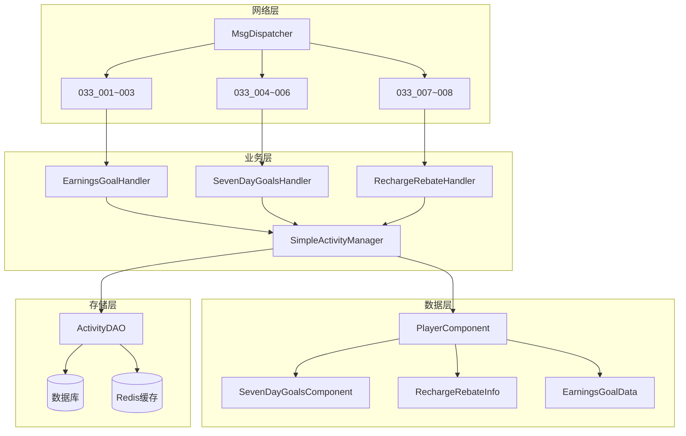
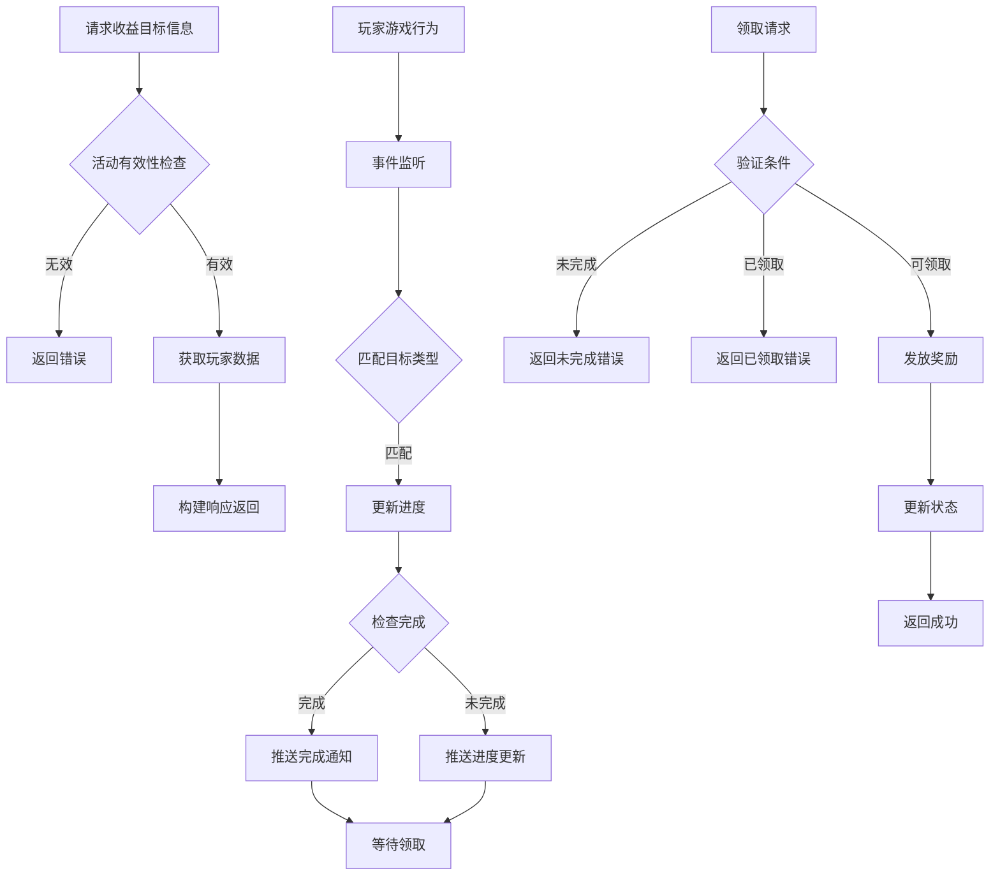
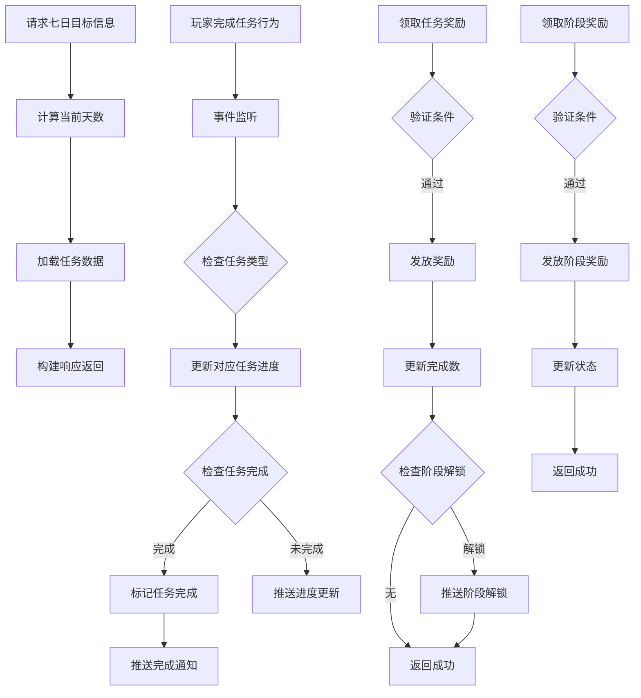
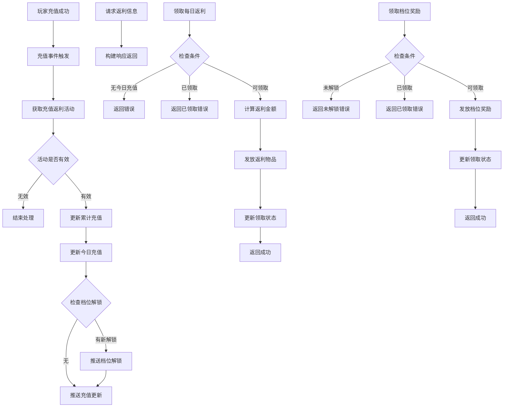

# SimpleActivityOp 模块 - 服务端开发文档

## 模块架构

### 目录结构

```
game_server/UserServer/src/NPUSServer/
├── NPUserMsgDispather/p033_SimpleActivityOp/
│   ├── MsgDealer_GC2GS_033_001_ReqEarningsGoalInfo.java
│   ├── MsgDealer_GC2GS_033_002_ReqEarningsGoalDrawReward.java
│   ├── MsgDealer_GC2GS_033_003_ReqEarningsGoalDrawHonorReward.java
│   ├── MsgDealer_GC2GS_033_004_ReqSevenDayGoalsInfo.java
│   ├── MsgDealer_GC2GS_033_005_ReqSevenDayGoalsDrawReward.java
│   ├── MsgDealer_GC2GS_033_006_ReqSevenDayGoalsDrawStepReward.java
│   ├── MsgDealer_GC2GS_033_007_ReqRechargeRebateInfo.java
│   └── MsgDealer_GC2GS_033_008_ReqRechargeRebateDrawReward.java
└── NPUSUserMgr/UserComp/
    ├── SevenDayGoals/
    │   ├── SevenDayGoalsComponent.java
    │   └── SevenDayGoalsTaskCounter.java
    └── CommonActivityMgr/Activities/RechargeRebate/
        ├── _ARechargeRebateInfo.java
        ├── RechargeRebateInfo_Days.java
        ├── RechargeRebateInfo_Daily.java
        └── RechargeRebateGroupData.java
```

---

## 一、服务端架构图



---

## 二、核心类设计

### 2.1 SimpleActivityManager

```java
package com.game.server.activity;

import java.util.*;
import java.util.concurrent.ConcurrentHashMap;

/**
 * 简单活动管理器
 * 负责活动的初始化、数据管理、状态更新
 */
public class SimpleActivityManager {

    /** 活动配置缓存 */
    private Map<Integer, ActivityConfig> activityConfigCache = new ConcurrentHashMap<>();

    /** 玩家活动数据缓存 */
    private Map<Long, Map<Integer, PlayerActivityData>> playerActivityCache = new ConcurrentHashMap<>();

    /** 活动处理器映射 */
    private Map<Integer, IActivityHandler> handlerMap = new HashMap<>();

    /**
     * 初始化活动管理器
     */
    public void init() {
        // 加载活动配置
        loadActivityConfigs();

        // 注册活动处理器
        registerHandler(ActivityType.EARNINGS_GOAL, new EarningsGoalHandler());
        registerHandler(ActivityType.SEVEN_DAY_GOALS, new SevenDayGoalsHandler());
        registerHandler(ActivityType.RECHARGE_REBATE, new RechargeRebateHandler());

        // 启动定时任务
        startScheduledTasks();
    }

    /**
     * 加载活动配置
     */
    private void loadActivityConfigs() {
        List<ActivityConfig> configs = ActivityDAO.loadAllActivityConfigs();
        for (ActivityConfig config : configs) {
            activityConfigCache.put(config.getActivityId(), config);
        }
        Logger.info("Loaded {} activity configs", configs.size());
    }

    /**
     * 注册活动处理器
     */
    private void registerHandler(int activityType, IActivityHandler handler) {
        handlerMap.put(activityType, handler);
    }

    /**
     * 获取活动配置
     */
    public ActivityConfig getActivityConfig(int activityId) {
        return activityConfigCache.get(activityId);
    }

    /**
     * 获取玩家活动数据
     */
    public PlayerActivityData getPlayerActivityData(long playerId, int activityId) {
        Map<Integer, PlayerActivityData> playerData = playerActivityCache.get(playerId);
        if (playerData == null) {
            playerData = new ConcurrentHashMap<>();
            playerActivityCache.put(playerId, playerData);
        }
        return playerData.computeIfAbsent(activityId,
            id -> loadPlayerActivityData(playerId, id));
    }

    /**
     * 从数据库加载玩家活动数据
     */
    private PlayerActivityData loadPlayerActivityData(long playerId, int activityId) {
        ActivityConfig config = getActivityConfig(activityId);
        if (config == null) {
            return null;
        }

        IActivityHandler handler = handlerMap.get(config.getActivityType());
        if (handler != null) {
            return handler.loadPlayerData(playerId, activityId);
        }
        return null;
    }

    /**
     * 获取活动处理器
     */
    public IActivityHandler getHandler(int activityType) {
        return handlerMap.get(activityType);
    }

    /**
     * 获取进行中的活动列表
     */
    public List<ActivityConfig> getActiveActivities(int activityType) {
        List<ActivityConfig> result = new ArrayList<>();
        long now = System.currentTimeMillis();

        for (ActivityConfig config : activityConfigCache.values()) {
            if (config.getActivityType() == activityType
                && config.isActive(now)) {
                result.add(config);
            }
        }
        return result;
    }

    /**
     * 启动定时任务
     */
    private void startScheduledTasks() {
        // 每日刷新任务
        ScheduledExecutor.scheduleDaily(this::onDailyRefresh, 0, 0);

        // 活动状态检查任务
        ScheduledExecutor.scheduleAtFixedRate(this::checkActivityStatus, 0, 1, TimeUnit.MINUTES);
    }

    /**
     * 每日刷新处理
     */
    private void onDailyRefresh() {
        Logger.info("Daily refresh for simple activities");

        // 刷新所有在线玩家的活动数据
        for (Long playerId : playerActivityCache.keySet()) {
            Player player = PlayerManager.getPlayer(playerId);
            if (player != null && player.isOnline()) {
                for (IActivityHandler handler : handlerMap.values()) {
                    handler.onDailyRefresh(playerId);
                }
            }
        }
    }

    /**
     * 检查活动状态
     */
    private void checkActivityStatus() {
        long now = System.currentTimeMillis();

        for (ActivityConfig config : activityConfigCache.values()) {
            if (config.isExpired(now)) {
                onActivityExpired(config);
            }
        }
    }

    /**
     * 活动过期处理
     */
    private void onActivityExpired(ActivityConfig config) {
        Logger.info("Activity {} expired, sending unclaimed rewards via mail", config.getActivityId());

        // 发送未领取奖励到邮件
        // ... 实现略
    }
}
```

### 2.2 七日目标组件 (SevenDayGoalsComponent)

```java
package com.game.server.activity;

import java.util.*;
import org.json.*;

/**
 * 七日目标玩家数据组件
 */
public class SevenDayGoalsComponent extends PlayerComponent {

    /** 活动ID */
    private int activityId;

    /** 任务数据列表 */
    private List<SevenDayTaskData> taskList = new ArrayList<>();

    /** 已领取的阶段奖励ID列表 */
    private Set<Integer> takenStageRewards = new HashSet<>();

    /** 总完成任务数 */
    private int totalCompleteCount;

    /** 数据库DAO */
    private SevenDayGoalsDAO dao = new SevenDayGoalsDAO();

    /**
     * 获取当前天数
     */
    public int getCurrentDayIndex() {
        ActivityConfig config = ActivityManager.getActivityConfig(activityId);
        if (config == null) return 1;

        long startTime = config.getStartTime().getTime();
        long now = System.currentTimeMillis();
        long diffDays = (now - startTime) / (24 * 60 * 60 * 1000);

        return Math.min((int) diffDays + 1, 7);
    }

    /**
     * 初始化玩家数据
     */
    public void initPlayerData(long playerId, int activityId) {
        this.activityId = activityId;

        // 从数据库加载数据
        JSONObject dbData = dao.loadData(playerId, activityId);
        if (dbData != null) {
            parseFromJson(dbData);
        } else {
            // 创建初始数据
            createInitialData(activityId);
        }
    }

    /**
     * 创建初始数据
     */
    private void createInitialData(int activityId) {
        SevenDayGoalsConfig config = ConfigManager.getSevenDayGoalsConfig(activityId);
        if (config == null) return;

        // 初始化所有任务
        for (int day = 1; day <= config.getTotalDays(); day++) {
            List<SevenDayTaskConfig> dayTasks = config.getDayTasks(day);
            for (SevenDayTaskConfig taskConfig : dayTasks) {
                SevenDayTaskData taskData = new SevenDayTaskData();
                taskData.setTaskId(taskConfig.getTaskId());
                taskData.setDayIndex(day);
                taskData.setProgress(0);
                taskData.setTargetValue(taskConfig.getTargetValue());
                taskData.setStatus(TaskStatus.IN_PROGRESS);
                taskData.setRewardTaken(false);
                taskList.add(taskData);
            }
        }

        totalCompleteCount = 0;
        save();
    }

    /**
     * 更新任务进度
     */
    public UpdateResult updateTaskProgress(int taskType, int value) {
        UpdateResult result = new UpdateResult();
        int currentDay = getCurrentDayIndex();

        for (SevenDayTaskData task : taskList) {
            // 只更新当前天且未完成的任务
            if (task.getDayIndex() == currentDay && task.getStatus() == TaskStatus.IN_PROGRESS) {
                SevenDayTaskConfig config = ConfigManager.getTaskConfig(task.getTaskId());
                if (config != null && config.getTaskType() == taskType) {
                    // 更新进度
                    int oldProgress = task.getProgress();
                    task.setProgress(Math.min(task.getProgress() + value, task.getTargetValue()));

                    // 检查是否完成
                    if (task.getProgress() >= task.getTargetValue()) {
                        task.setStatus(TaskStatus.COMPLETED);
                        result.addCompletedTask(task.getTaskId());
                    } else if (task.getProgress() != oldProgress) {
                        result.addUpdatedTask(task.getTaskId(), task.getProgress());
                    }
                }
            }
        }

        if (result.hasChanges()) {
            save();
        }

        return result;
    }

    /**
     * 领取任务奖励
     */
    public TakeRewardResult takeTaskReward(int taskId) {
        TakeRewardResult result = new TakeRewardResult();

        SevenDayTaskData task = findTask(taskId);
        if (task == null) {
            result.setErrorCode(ErrorCode.TASK_NOT_FOUND);
            return result;
        }

        if (task.getStatus() != TaskStatus.COMPLETED) {
            result.setErrorCode(ErrorCode.TASK_NOT_COMPLETED);
            return result;
        }

        if (task.isRewardTaken()) {
            result.setErrorCode(ErrorCode.REWARD_ALREADY_TAKEN);
            return result;
        }

        // 发放奖励
        SevenDayTaskConfig config = ConfigManager.getTaskConfig(taskId);
        List<RewardItem> rewards = ItemService.giveItems(getPlayerId(), config.getRewardList());
        result.setRewards(rewards);

        // 更新状态
        task.setRewardTaken(true);
        task.setStatus(TaskStatus.REWARD_TAKEN);
        totalCompleteCount++;
        result.setTotalCompleteCount(totalCompleteCount);

        // 检查阶段奖励解锁
        checkStageUnlock(result);

        save();
        return result;
    }

    /**
     * 领取阶段奖励
     */
    public TakeRewardResult takeStageReward(int stageId) {
        TakeRewardResult result = new TakeRewardResult();

        StageConfig stageConfig = ConfigManager.getStageConfig(stageId);
        if (stageConfig == null) {
            result.setErrorCode(ErrorCode.STAGE_NOT_FOUND);
            return result;
        }

        if (totalCompleteCount < stageConfig.getRequireCount()) {
            result.setErrorCode(ErrorCode.STAGE_NOT_UNLOCKED);
            return result;
        }

        if (takenStageRewards.contains(stageId)) {
            result.setErrorCode(ErrorCode.REWARD_ALREADY_TAKEN);
            return result;
        }

        // 发放奖励
        List<RewardItem> rewards = ItemService.giveItems(getPlayerId(), stageConfig.getRewardList());
        result.setRewards(rewards);

        // 记录已领取
        takenStageRewards.add(stageId);

        save();
        return result;
    }

    /**
     * 检查阶段解锁
     */
    private void checkStageUnlock(TakeRewardResult result) {
        List<StageConfig> stages = ConfigManager.getStageConfigs(activityId);
        for (StageConfig stage : stages) {
            if (!takenStageRewards.contains(stage.getStageId())
                && totalCompleteCount >= stage.getRequireCount()) {
                result.addUnlockedStage(stage.getStageId());
            }
        }
    }

    /**
     * 查找任务
     */
    private SevenDayTaskData findTask(int taskId) {
        for (SevenDayTaskData task : taskList) {
            if (task.getTaskId() == taskId) {
                return task;
            }
        }
        return null;
    }

    /**
     * 构建响应数据
     */
    public JSONObject buildResponseData() {
        JSONObject data = new JSONObject();
        data.put("activityId", activityId);
        data.put("currentDay", getCurrentDayIndex());
        data.put("totalCompleteCount", totalCompleteCount);

        JSONArray taskArray = new JSONArray();
        for (SevenDayTaskData task : taskList) {
            JSONObject taskObj = new JSONObject();
            taskObj.put("taskId", task.getTaskId());
            taskObj.put("dayIndex", task.getDayIndex());
            taskObj.put("progress", task.getProgress());
            taskObj.put("targetValue", task.getTargetValue());
            taskObj.put("status", task.getStatus().getValue());
            taskArray.put(taskObj);
        }
        data.put("taskList", taskArray);

        JSONArray stageArray = new JSONArray();
        List<StageConfig> stages = ConfigManager.getStageConfigs(activityId);
        for (StageConfig stage : stages) {
            JSONObject stageObj = new JSONObject();
            stageObj.put("stageId", stage.getStageId());
            stageObj.put("requireCount", stage.getRequireCount());
            stageObj.put("isUnlocked", totalCompleteCount >= stage.getRequireCount());
            stageObj.put("isTaken", takenStageRewards.contains(stage.getStageId()));
            stageArray.put(stageObj);
        }
        data.put("stageList", stageArray);

        return data;
    }

    /**
     * 保存数据到数据库
     */
    private void save() {
        JSONObject data = toJson();
        dao.saveData(getPlayerId(), activityId, data);
    }

    // ... 其他方法省略
}
```

### 2.3 充值返利组件 (RechargeRebateInfo)

```java
package com.game.server.activity;

import java.util.*;
import org.json.*;

/**
 * 充值返利活动信息基类
 */
public abstract class _ARechargeRebateInfo extends PlayerComponent {

    /** 活动ID */
    protected int activityId;

    /** 累计充值金额 */
    protected long totalRecharge;

    /** 今日充值金额 */
    protected long dailyRecharge;

    /** 已领取的返利档位ID列表 */
    protected Set<Integer> takenTierIds = new HashSet<>();

    /** 最后充值时间 */
    protected Date lastRechargeTime;

    /** 今日返利是否已领取 */
    protected boolean dailyRebateTaken;

    /**
     * 处理充值
     */
    public void processRecharge(long rechargeAmount) {
        // 更新累计充值
        this.totalRecharge += rechargeAmount;

        // 更新今日充值
        Date now = new Date();
        if (isSameDay(lastRechargeTime, now)) {
            this.dailyRecharge += rechargeAmount;
        } else {
            this.dailyRecharge = rechargeAmount;
            this.dailyRebateTaken = false;
        }
        this.lastRechargeTime = now;

        // 检查档位解锁
        checkTierUnlock();

        save();
    }

    /**
     * 检查档位解锁
     */
    private void checkTierUnlock() {
        RechargeRebateConfig config = ConfigManager.getRechargeRebateConfig(activityId);
        if (config == null) return;

        for (RebateTierConfig tier : config.getTierList()) {
            if (totalRecharge >= tier.getRechargeAmount()
                && !takenTierIds.contains(tier.getTierId())) {
                // 推送档位解锁通知
                pushTierUnlocked(tier.getTierId());
            }
        }
    }

    /**
     * 领取每日返利
     */
    public TakeRebateResult takeDailyRebate() {
        TakeRebateResult result = new TakeRebateResult();

        if (dailyRecharge <= 0) {
            result.setErrorCode(ErrorCode.NO_DAILY_RECHARGE);
            return result;
        }

        if (dailyRebateTaken) {
            result.setErrorCode(ErrorCode.DAILY_REBATE_TAKEN);
            return result;
        }

        RechargeRebateConfig config = ConfigManager.getRechargeRebateConfig(activityId);
        if (config == null) {
            result.setErrorCode(ErrorCode.ACTIVITY_NOT_FOUND);
            return result;
        }

        // 计算返利
        long rebateAmount = calculateDailyRebate(config);

        // 发放返利
        List<RewardItem> rewards = giveRebateReward(rebateAmount, config);
        result.setRewards(rewards);
        result.setRebateAmount(rebateAmount);

        dailyRebateTaken = true;
        save();

        return result;
    }

    /**
     * 领取档位奖励
     */
    public TakeRebateResult takeTierReward(int tierId) {
        TakeRebateResult result = new TakeRebateResult();

        RebateTierConfig tierConfig = ConfigManager.getRebateTierConfig(tierId);
        if (tierConfig == null) {
            result.setErrorCode(ErrorCode.TIER_NOT_FOUND);
            return result;
        }

        if (totalRecharge < tierConfig.getRechargeAmount()) {
            result.setErrorCode(ErrorCode.TIER_NOT_UNLOCKED);
            return result;
        }

        if (takenTierIds.contains(tierId)) {
            result.setErrorCode(ErrorCode.REWARD_ALREADY_TAKEN);
            return result;
        }

        // 发放档位奖励
        List<RewardItem> rewards = ItemService.giveItems(getPlayerId(), tierConfig.getRewardList());
        result.setRewards(rewards);

        takenTierIds.add(tierId);
        save();

        return result;
    }

    /**
     * 计算每日返利金额
     */
    private long calculateDailyRebate(RechargeRebateConfig config) {
        // 基础返利
        long baseRebate = (long) (dailyRecharge * config.getBaseRate());

        // VIP加成
        int vipLevel = PlayerManager.getPlayer(getPlayerId()).getVipLevel();
        long vipBonus = (long) (dailyRecharge * vipLevel * config.getVipBonusRate());

        long totalRebate = baseRebate + vipBonus;

        // 检查上限
        if (config.getDailyMaxRebate() > 0) {
            totalRebate = Math.min(totalRebate, config.getDailyMaxRebate());
        }

        return totalRebate;
    }

    /**
     * 发放返利奖励
     */
    private List<RewardItem> giveRebateReward(long rebateAmount, RechargeRebateConfig config) {
        int itemCount = (int) (rebateAmount * config.getRebateItemRate());
        return ItemService.giveItem(getPlayerId(), config.getRebateItemId(), itemCount, true);
    }

    /**
     * 构建响应数据
     */
    public JSONObject buildResponseData() {
        JSONObject data = new JSONObject();
        data.put("activityId", activityId);
        data.put("totalRecharge", totalRecharge);
        data.put("dailyRecharge", dailyRecharge);
        data.put("dailyRebateTaken", dailyRebateTaken);

        RechargeRebateConfig config = ConfigManager.getRechargeRebateConfig(activityId);
        JSONArray tierArray = new JSONArray();
        if (config != null) {
            for (RebateTierConfig tier : config.getTierList()) {
                JSONObject tierObj = new JSONObject();
                tierObj.put("tierId", tier.getTierId());
                tierObj.put("rechargeAmount", tier.getRechargeAmount());
                tierObj.put("currentProgress", totalRecharge);
                tierObj.put("isUnlocked", totalRecharge >= tier.getRechargeAmount());
                tierObj.put("isTaken", takenTierIds.contains(tier.getTierId()));
                tierArray.put(tierObj);
            }
        }
        data.put("tierList", tierArray);

        return data;
    }

    // ... 其他方法省略
}

/**
 * 多日累计返利
 */
public class RechargeRebateInfo_Days extends _ARechargeRebateInfo {
    // 实现多日累计返利特殊逻辑
}

/**
 * 每日返利
 */
public class RechargeRebateInfo_Daily extends _ARechargeRebateInfo {
    // 实现每日返利特殊逻辑
}
```

---

## 三、消息处理器实现

### 3.1 请求七日目标信息处理器

```java
package com.game.server.dispatcher;

import com.game.server.activity.*;
import com.game.server.protocol.*;

/**
 * 请求七日目标信息消息处理器
 */
public class MsgDealer_GC2GS_033_004_ReqSevenDayGoalsInfo extends MessageDealer {

    @Override
    public void deal(Player player, JSONObject msg) {
        // 解析请求
        int activityId = msg.optInt("activityId", 0);

        // 参数校验
        if (activityId <= 0) {
            sendErrorResponse(player, ErrorCode.INVALID_PARAM, "参数错误");
            return;
        }

        // 获取活动配置
        ActivityConfig config = ActivityManager.getActivityConfig(activityId);
        if (config == null) {
            sendErrorResponse(player, ErrorCode.ACTIVITY_NOT_FOUND, "活动不存在");
            return;
        }

        // 检查活动时间
        if (!config.isActive(System.currentTimeMillis())) {
            sendErrorResponse(player, ErrorCode.ACTIVITY_NOT_ACTIVE, "活动未开启或已结束");
            return;
        }

        // 获取玩家活动组件
        SevenDayGoalsComponent component = player.getComponent(SevenDayGoalsComponent.class);

        // 如果组件不存在或活动ID不匹配，初始化数据
        if (component == null || component.getActivityId() != activityId) {
            component = new SevenDayGoalsComponent();
            component.initPlayerData(player.getId(), activityId);
            player.addComponent(component);
        }

        // 构建响应
        JSONObject response = component.buildResponseData();
        response.put("resultCode", 0);
        response.put("resultMsg", "success");

        // 发送响应
        sendMessage(player, MsgType.GS2GC_033_004_ResSevenDayGoalsInfo, response);
    }
}
```

### 3.2 领取任务奖励处理器

```java
package com.game.server.dispatcher;

import com.game.server.activity.*;
import com.game.server.protocol.*;

/**
 * 领取七日目标任务奖励处理器
 */
public class MsgDealer_GC2GS_033_005_ReqSevenDayGoalsDrawReward extends MessageDealer {

    @Override
    public void deal(Player player, JSONObject msg) {
        // 解析请求
        int activityId = msg.optInt("activityId", 0);
        int taskId = msg.optInt("taskId", 0);

        // 参数校验
        if (activityId <= 0 || taskId <= 0) {
            sendErrorResponse(player, ErrorCode.INVALID_PARAM, "参数错误");
            return;
        }

        // 获取活动组件
        SevenDayGoalsComponent component = player.getComponent(SevenDayGoalsComponent.class);
        if (component == null || component.getActivityId() != activityId) {
            sendErrorResponse(player, ErrorCode.ACTIVITY_NOT_FOUND, "活动数据不存在");
            return;
        }

        // 领取奖励
        TakeRewardResult result = component.takeTaskReward(taskId);

        // 构建响应
        JSONObject response = new JSONObject();
        response.put("resultCode", result.getErrorCode());
        response.put("resultMsg", result.getErrorMsg());
        response.put("taskId", taskId);

        if (result.isSuccess()) {
            response.put("totalCompleteCount", result.getTotalCompleteCount());
            response.put("rewardList", buildRewardArray(result.getRewards()));

            // 推送阶段解锁通知
            if (result.hasUnlockedStages()) {
                for (Integer stageId : result.getUnlockedStages()) {
                    pushStageUnlocked(player, stageId);
                }
            }
        }

        sendMessage(player, MsgType.GS2GC_033_005_ResSevenDayGoalsDrawReward, response);
    }

    /**
     * 推送阶段解锁
     */
    private void pushStageUnlocked(Player player, int stageId) {
        StageConfig config = ConfigManager.getStageConfig(stageId);
        if (config == null) return;

        JSONObject push = new JSONObject();
        push.put("activityId", config.getActivityId());
        push.put("stageId", stageId);
        push.put("stageName", config.getName());

        sendMessage(player, MsgType.GS2GC_033_105_PushStageUnlocked, push);
    }
}
```

---

## 四、业务流程

### 4.1 收益目标处理流程



### 4.2 七日目标处理流程



### 4.3 充值返利处理流程



---

## 五、事件监听

### 5.1 事件监听配置

```java
package com.game.server.activity;

import java.util.*;

/**
 * 简单活动事件监听器
 */
public class SimpleActivityEventListener {

    private SimpleActivityManager activityManager;

    /**
     * 注册事件监听
     */
    public void registerListeners() {
        // 玩家升级事件
        EventDispatcher.register(EventType.PLAYER_LEVEL_UP, this::onPlayerLevelUp);

        // 战力变化事件
        EventDispatcher.register(EventType.PLAYER_POWER_CHANGE, this::onPlayerPowerChange);

        // 副本通关事件
        EventDispatcher.register(EventType.DUNGEON_COMPLETE, this::onDungeonComplete);

        // 充值成功事件
        EventDispatcher.register(EventType.RECHARGE_SUCCESS, this::onRechargeSuccess);

        // 物品获得事件
        EventDispatcher.register(EventType.ITEM_GAIN, this::onItemGain);
    }

    /**
     * 玩家升级事件处理
     */
    private void onPlayerLevelUp(Player player, EventData data) {
        int level = data.getInt("level");
        updateEarningsGoalProgress(player, GoalType.LEVEL, level);
        updateSevenDayTaskProgress(player, TaskType.LEVEL_UP, 1);
    }

    /**
     * 战力变化事件处理
     */
    private void onPlayerPowerChange(Player player, EventData data) {
        long power = data.getLong("power");
        updateEarningsGoalProgress(player, GoalType.POWER, power);
    }

    /**
     * 副本通关事件处理
     */
    private void onDungeonComplete(Player player, EventData data) {
        int dungeonId = data.getInt("dungeonId");
        updateEarningsGoalProgress(player, GoalType.DUNGEON, 1);
        updateSevenDayTaskProgress(player, TaskType.DUNGEON_COMPLETE, 1);
    }

    /**
     * 充值成功事件处理
     */
    private void onRechargeSuccess(Player player, EventData data) {
        long amount = data.getLong("amount");
        updateEarningsGoalProgress(player, GoalType.RECHARGE, amount);

        // 处理充值返利
        processRechargeRebate(player, amount);
    }

    /**
     * 物品获得事件处理
     */
    private void onItemGain(Player player, EventData data) {
        int itemId = data.getInt("itemId");
        int count = data.getInt("count");
        // ... 收集类目标处理
    }

    /**
     * 更新收益目标进度
     */
    private void updateEarningsGoalProgress(Player player, int goalType, long value) {
        List<ActivityConfig> activities = activityManager.getActiveActivities(ActivityType.EARNINGS_GOAL);
        for (ActivityConfig config : activities) {
            EarningsGoalHandler handler = (EarningsGoalHandler) activityManager.getHandler(ActivityType.EARNINGS_GOAL);
            if (handler != null) {
                handler.updateProgress(player, config.getActivityId(), goalType, value);
            }
        }
    }

    /**
     * 更新七日任务进度
     */
    private void updateSevenDayTaskProgress(Player player, int taskType, int value) {
        List<ActivityConfig> activities = activityManager.getActiveActivities(ActivityType.SEVEN_DAY_GOALS);
        for (ActivityConfig config : activities) {
            SevenDayGoalsComponent component = player.getComponent(SevenDayGoalsComponent.class);
            if (component != null && component.getActivityId() == config.getActivityId()) {
                UpdateResult result = component.updateTaskProgress(taskType, value);
                handleUpdateResult(player, result);
            }
        }
    }

    /**
     * 处理充值返利
     */
    private void processRechargeRebate(Player player, long amount) {
        List<ActivityConfig> activities = activityManager.getActiveActivities(ActivityType.RECHARGE_REBATE);
        for (ActivityConfig config : activities) {
            _ARechargeRebateInfo rebateInfo = player.getComponent(_ARechargeRebateInfo.class);
            if (rebateInfo != null && rebateInfo.getActivityId() == config.getActivityId()) {
                rebateInfo.processRecharge(amount);
            }
        }
    }

    /**
     * 处理更新结果
     */
    private void handleUpdateResult(Player player, UpdateResult result) {
        // 推送进度更新
        for (Integer taskId : result.getUpdatedTasks()) {
            pushTaskProgress(player, taskId, result.getProgress(taskId));
        }

        // 推送完成通知
        for (Integer taskId : result.getCompletedTasks()) {
            pushTaskComplete(player, taskId);
        }
    }

    // ... 其他方法省略
}
```

---

## 六、数据库设计

### 6.1 表结构

```sql
-- 玩家活动数据表
CREATE TABLE player_activity_data (
    id BIGINT PRIMARY KEY AUTO_INCREMENT,
    player_id BIGINT NOT NULL COMMENT '玩家ID',
    activity_id INT NOT NULL COMMENT '活动ID',
    activity_type INT NOT NULL COMMENT '活动类型',
    data_json TEXT NOT NULL COMMENT '活动数据JSON',
    create_time DATETIME DEFAULT CURRENT_TIMESTAMP,
    update_time DATETIME DEFAULT CURRENT_TIMESTAMP ON UPDATE CURRENT_TIMESTAMP,
    UNIQUE KEY uk_player_activity (player_id, activity_id),
    INDEX idx_activity_type (activity_type)
) ENGINE=InnoDB DEFAULT CHARSET=utf8mb4 COMMENT='玩家活动数据表';

-- 活动配置表
CREATE TABLE activity_config (
    activity_id INT PRIMARY KEY COMMENT '活动ID',
    activity_type INT NOT NULL COMMENT '活动类型',
    name VARCHAR(64) NOT NULL COMMENT '活动名称',
    description VARCHAR(256) COMMENT '活动描述',
    start_time DATETIME NOT NULL COMMENT '开始时间',
    end_time DATETIME NOT NULL COMMENT '结束时间',
    status INT DEFAULT 0 COMMENT '状态',
    config_json TEXT NOT NULL COMMENT '配置JSON',
    create_time DATETIME DEFAULT CURRENT_TIMESTAMP,
    update_time DATETIME DEFAULT CURRENT_TIMESTAMP ON UPDATE CURRENT_TIMESTAMP
) ENGINE=InnoDB DEFAULT CHARSET=utf8mb4 COMMENT='活动配置表';
```

---

*文档生成时间: 2026-04-12*
