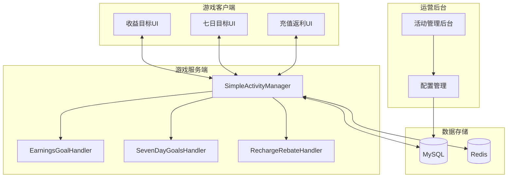
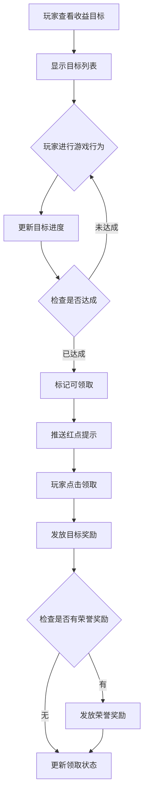
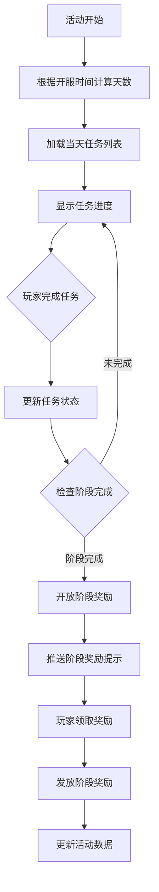
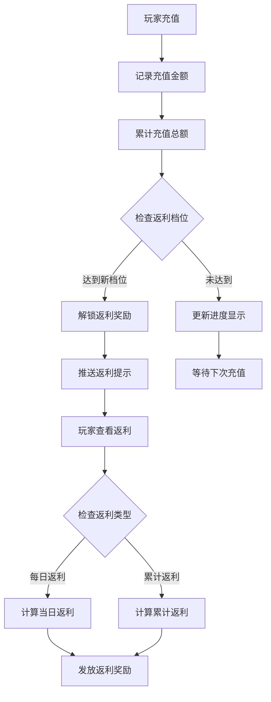
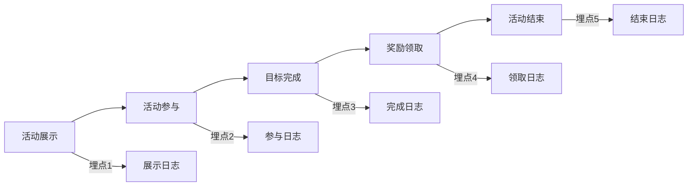

# 简单活动模块完整说明

## 一、模块概述

### 1.1 业务背景

简单活动模块是 K2C 游戏的通用活动框架，提供收益目标、七日目标、充值返利等常见活动玩法的快速实现能力。通过配置驱动的方式，运营人员可以快速创建和管理各类活动，无需开发介入，极大地提升了活动运营效率。

### 1.2 目标用户

- **所有游戏玩家**：参与各类活动获取奖励
- **付费玩家**：享受充值返利等优惠
- **运营人员**：创建和管理游戏活动

### 1.3 核心价值

1. **快速上线**：配置化活动创建，无需开发
2. **灵活定制**：支持多种活动类型和规则
3. **数据驱动**：活动效果可量化分析
4. **用户激励**：多样化的奖励机制

### 1.4 模块整体架构



---

## 二、功能清单

### 2.1 收益目标功能

| 功能名称 | 功能描述 | 用户价值 |
|---------|---------|---------|
| 目标展示 | 显示收益目标及进度 | 了解目标内容 |
| 进度追踪 | 实时更新完成进度 | 追踪完成情况 |
| 目标奖励 | 完成目标领取奖励 | 获得丰厚奖励 |
| 荣誉奖励 | 达成高级目标获得荣誉 | 展示成就 |

### 2.2 七日目标功能

| 功能名称 | 功能描述 | 用户价值 |
|---------|---------|---------|
| 每日任务 | 每日更新的任务列表 | 持续参与动力 |
| 任务进度 | 任务完成进度追踪 | 了解完成情况 |
| 任务奖励 | 完成任务领取奖励 | 获得日常奖励 |
| 阶段奖励 | 完成阶段目标领大奖 | 获得高额奖励 |

### 2.3 充值返利功能

| 功能名称 | 功能描述 | 用户价值 |
|---------|---------|---------|
| 返利展示 | 显示返利比例和进度 | 了解返利信息 |
| 累计充值 | 记录累计充值金额 | 追踪充值进度 |
| 返利领取 | 领取返利奖励 | 获得额外收益 |
| 每日返利 | 每日充值返利 | 持续激励充值 |

### 2.4 活动管理功能

| 功能名称 | 功能描述 | 用户价值 |
|---------|---------|---------|
| 活动列表 | 显示所有进行中的活动 | 了解活动信息 |
| 活动详情 | 查看活动详细规则 | 理解活动玩法 |
| 剩余时间 | 显示活动倒计时 | 把握参与时机 |
| 历史记录 | 查看已结束活动 | 回顾参与情况 |

---

## 三、业务流程详解

### 3.1 收益目标流程



**详细步骤说明**：

1. **目标展示**
   - 获取活动配置的目标列表
   - 计算当前完成进度
   - 显示奖励预览

2. **进度更新**
   - 监听玩家游戏行为
   - 匹配目标类型
   - 更新进度值

3. **奖励发放**
   - 验证领取资格
   - 发放目标奖励
   - 检查荣誉奖励条件

### 3.2 七日目标流程



**详细步骤说明**：

1. **天数计算**
   - 根据服务器开服时间计算当前天数
   - 获取对应天数的任务配置
   - 初始化任务列表

2. **任务追踪**
   - 监听玩家行为
   - 更新任务进度
   - 检查完成状态

3. **阶段判定**
   - 检查阶段内所有任务完成情况
   - 开放阶段奖励领取
   - 记录阶段完成时间

### 3.3 充值返利流程



**详细步骤说明**：

1. **充值记录**
   - 记录单次充值金额
   - 累加到总充值金额
   - 触发返利计算

2. **返利计算**
   - 根据充值金额和配置计算返利
   - 区分每日返利和累计返利
   - 记录返利发放状态

3. **奖励发放**
   - 验证返利资格
   - 发放返利奖励
   - 更新返利记录

---

## 四、关键规则

### 4.1 收益目标规则

1. **目标类型**
   - 等级目标：达到指定等级
   - 战力目标：达到指定战力
   - 副本目标：通关指定副本
   - 收集目标：收集指定物品

2. **奖励规则**
   - 单目标单次奖励
   - 荣誉奖励需达成高级目标
   - 奖励需手动领取

3. **时间规则**
   - 活动期间内完成有效
   - 活动结束后无法领取

### 4.2 七日目标规则

1. **时间计算**
   - 以开服时间为准
   - 每天固定刷新任务
   - 7天为一个周期

2. **任务规则**
   - 任务每天重置
   - 完成任务获得积分
   - 积分累计解锁阶段奖励

3. **阶段规则**
   - 阶段奖励需累计完成指定数量任务
   - 阶段奖励可随时领取
   - 阶段奖励不重置

### 4.3 充值返利规则

1. **返利类型**
   - 每日返利：当日充值按比例返利
   - 累计返利：累计充值达到档位返利
   - 首充返利：首次充值额外返利

2. **返利比例**
   - 基础返利比例由配置决定
   - VIP等级可增加返利比例
   - 特殊活动期间返利翻倍

3. **发放规则**
   - 返利即时发放或次日发放
   - 返利以绑定钻石形式发放
   - 返利有上限限制

---

## 五、用户故事

### 5.1 收益目标玩家故事

> 作为一名追求战力的玩家，我每天都会查看收益目标界面。今天我完成了"战力达到10万"的目标，获得了大量强化材料。还差一点就能完成"收集5件紫色装备"的高级目标，一旦完成就能获得稀有称号和荣誉奖励，这让我充满了动力。

### 5.2 七日目标玩家故事

> 作为一名新玩家，七日目标引导我逐步了解游戏。第一天我完成了"完成3次副本"的任务，获得了新手礼包。现在我已经完成了15个任务，达到了第二阶段，领取了阶段奖励——一个SSR英雄碎片。我期待着完成更多任务，拿到最终的终极大奖。

### 5.3 充值返利玩家故事

> 作为一名付费玩家，我注意到充值返利活动正在进行。充值100元可以获得10%的返利，而且是VIP3还有额外的5%加成。我充值后立刻获得了返利奖励，这让我觉得物超所值。累计充值返利活动也让我有动力继续充值，争取拿到更高档位的返利。

---

## 六、示例

### 6.1 收益目标示例

**目标配置**：
```
目标ID：101
目标类型：战力
目标值：100000
奖励：
  - 钻石 × 500
  - 强化石 × 100
荣誉奖励：称号"战力新星"
```

**玩家状态**：
```
当前战力：95000
进度：95%
状态：进行中
```

**完成操作**：玩家强化装备，战力达到105000

**完成结果**：
```
进度：100%
状态：已完成
可领取奖励：钻石 × 500, 强化石 × 100
荣誉奖励：称号"战力新星"
```

### 6.2 七日目标示例

**第3天任务配置**：
```
任务1：完成5次副本 - 奖励：银两 × 5000
任务2：强化装备3次 - 奖励：强化石 × 20
任务3：英雄升级2次 - 奖励：经验药水 × 10
阶段奖励（完成3个任务）：
  - 钻石 × 200
  - 英雄碎片 × 5
```

**玩家进度**：
```
任务1：5/5 ✓
任务2：3/3 ✓
任务3：1/2 进行中
已完成任务：2/3
阶段奖励：未解锁
```

**完成操作**：玩家完成英雄升级2次

**完成结果**：
```
任务3：2/2 ✓
已完成任务：3/3
阶段奖励：已解锁
可领取：钻石 × 200, 英雄碎片 × 5
```

### 6.3 充值返利示例

**返利配置**：
```
活动期间：2026-04-01 ~ 2026-04-07
基础返利比例：10%
VIP3额外返利：+5%
累计返利档位：
  - 累计100元：钻石 × 100
  - 累计500元：钻石 × 600
  - 累计1000元：钻石 × 1500 + SSR英雄 × 1
```

**充值操作**：
- 玩家VIP等级：3
- 本次充值：200元
- 充值前累计：300元

**返利计算**：
```
基础返利：200 × 10% = 20元
VIP加成：200 × 5% = 10元
总返利：30元（等价钻石 × 300）

累计充值：300 + 200 = 500元
解锁档位：500元档位
档位奖励：钻石 × 600
```

**获得奖励**：
```
返利钻石：300
档位奖励：钻石 × 600
总计获得：钻石 × 900
```

---

## 七、配置参考

### 7.1 活动类型配置

| 类型ID | 类型名称 | 说明 |
|--------|----------|------|
| 1 | EARNINGS_GOAL | 收益目标活动 |
| 2 | SEVEN_DAY_GOALS | 七日目标活动 |
| 3 | RECHARGE_REBATE | 充值返利活动 |

### 7.2 目标类型配置

| 类型ID | 类型名称 | 进度更新方式 |
|--------|----------|--------------|
| 1 | LEVEL | 等级目标，取最大值 |
| 2 | POWER | 战力目标，取最大值 |
| 3 | DUNGEON | 副本目标，累加 |
| 4 | COLLECT | 收集目标，取当前数量 |
| 5 | RECHARGE | 充值目标，累加 |

### 7.3 任务类型配置

| 类型ID | 类型名称 | 说明 |
|--------|----------|------|
| 101 | LOGIN | 每日登录 |
| 201 | DUNGEON_COMPLETE | 通关副本 |
| 202 | DUNGEON_STAR | 获得副本星级 |
| 301 | EQUIP_ENHANCE | 强化装备 |
| 302 | HERO_LEVEL_UP | 英雄升级 |
| 303 | HERO_STAR_UP | 英雄升星 |
| 401 | FRIEND_INTERACT | 好友互动 |
| 501 | DIAMOND_CONSUME | 消耗钻石 |
| 502 | GOLD_CONSUME | 消耗金币 |

---

## 八、常见问题

### 8.1 收益目标常见问题

**Q: 目标进度如何更新？**
A: 目标进度通过监听玩家游戏行为自动更新。根据目标类型，进度更新方式分为累加和取最大值两种。例如等级目标会取当前等级的最大值，而副本目标会累加通关次数。

**Q: 荣誉奖励如何获取？**
A: 荣誉奖励需要达成所有标记为"荣誉目标"的目标后才能领取。通常荣誉目标是难度较高的目标，如超高战力、收集稀有物品等。

### 8.2 七日目标常见问题

**Q: 任务进度会保留吗？**
A: 根据活动配置决定。如果配置了`inherit_progress = 1`，未完成的任务进度会在第二天保留；否则每天进度会重置。

**Q: 阶段奖励何时可以领取？**
A: 当累计完成的任务数量达到阶段要求时，阶段奖励自动解锁。玩家可以在活动期间任意时间领取已解锁的阶段奖励。

### 8.3 充值返利常见问题

**Q: 每日返利如何计算？**
A: 每日返利基于当日充值金额计算。返利金额 = 充值金额 × (基础比例 + VIP等级 × VIP加成比例)。返利金额有上限限制，超过上限按上限发放。

**Q: 档位奖励可以重复领取吗？**
A: 不可以。每个档位奖励只能领取一次。累计充值达到新档位后会解锁对应档位，领取后该档位标记为已领取。

---

## 九、数据统计

### 9.1 关键指标

| 指标名称 | 计算方式 | 说明 |
|----------|----------|------|
| 活动参与率 | 参与人数 / 活跃人数 | 衡量活动吸引力 |
| 目标完成率 | 完成人数 / 参与人数 | 衡量目标难度 |
| 奖励领取率 | 领取人数 / 完成人数 | 衡量用户活跃度 |
| 充值转化率 | 充值人数 / 参与人数 | 衡量活动付费效果 |

### 9.2 数据埋点



---

## 十、版本历史

| 版本号 | 更新日期 | 更新内容 |
|--------|----------|----------|
| 1.0.0 | 2026-01-01 | 初始版本，支持收益目标功能 |
| 1.1.0 | 2026-02-01 | 新增七日目标功能 |
| 1.2.0 | 2026-03-01 | 新增充值返利功能 |
| 1.3.0 | 2026-04-01 | 优化活动配置，支持VIP加成 |

---

*文档生成时间: 2026-04-12*
