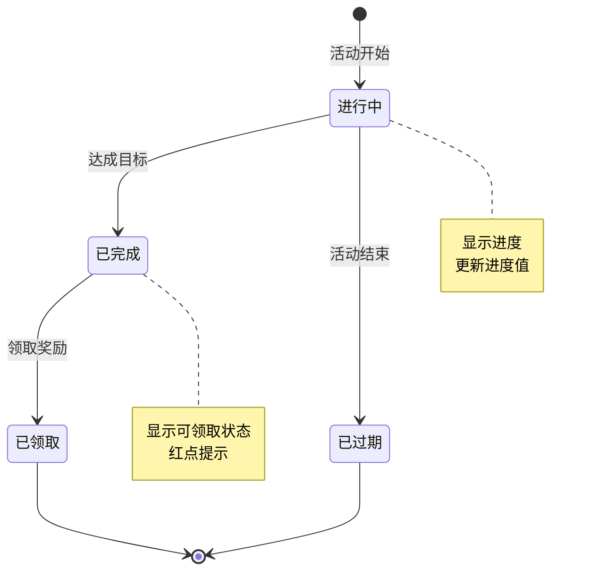
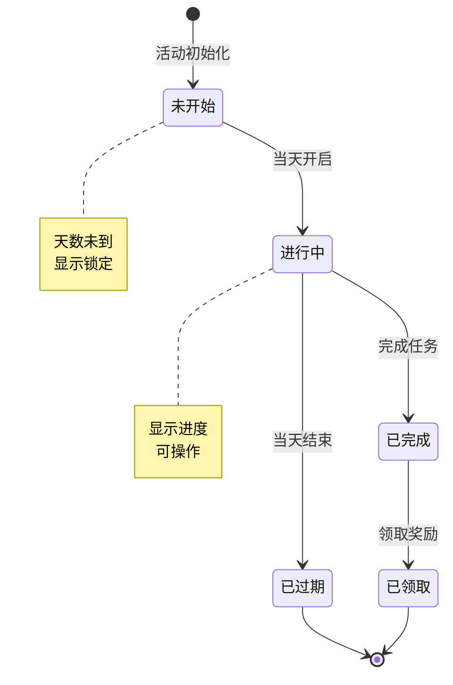
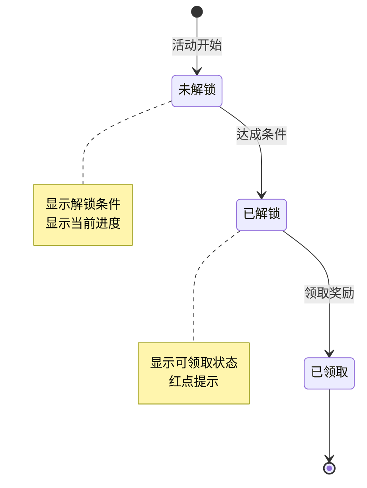
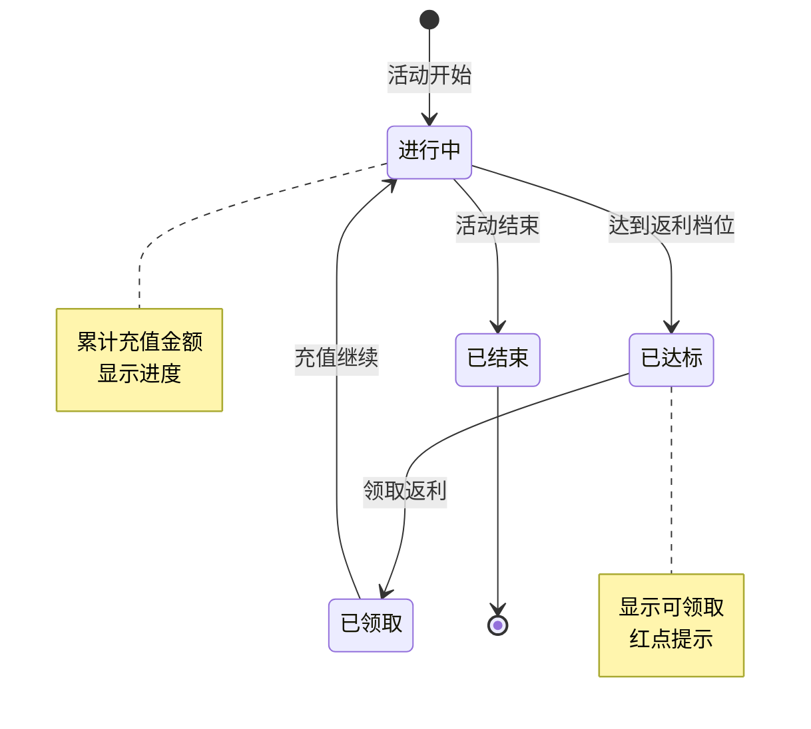
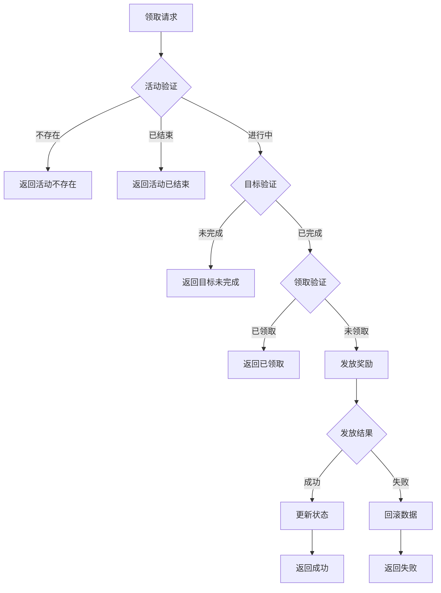
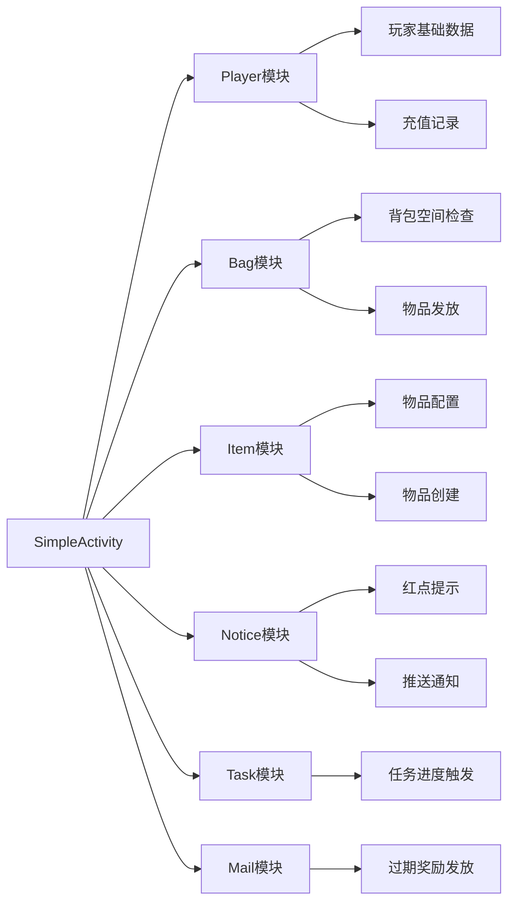
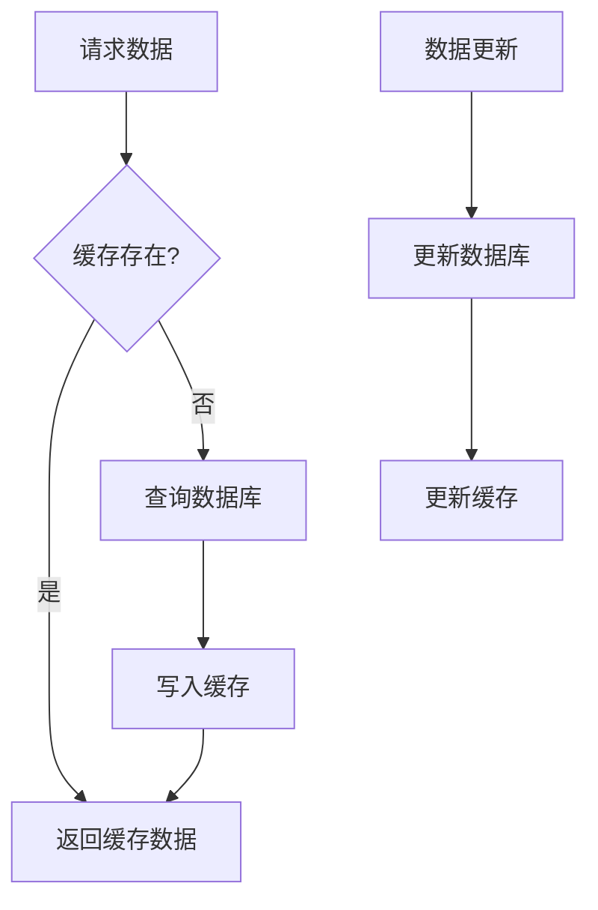

# 简单活动模块实现细节

## 一、计算公式

### 1.1 目标进度计算公式

```
进度百分比 = min(当前值 / 目标值 × 100, 100)
```

**示例计算**：
```
当前战力：85000
目标战力：100000

进度百分比 = min(85000 / 100000 × 100, 100) = 85%
```

### 1.2 充值返利计算公式

```
返利金额 = 充值金额 × (基础比例 + VIP加成比例)
返利钻石 = 返利金额 × 钻石兑换率
```

**示例计算**：
```
充值金额：100元
基础返利比例：10%
VIP3加成比例：5%
钻石兑换率：10钻石/元

返利金额 = 100 × (10% + 5%) = 15元
返利钻石 = 15 × 10 = 150钻石
```

### 1.3 阶段奖励解锁公式

```
阶段解锁条件 = 已完成任务数 >= 阶段要求任务数
```

**示例计算**：
```
阶段要求：完成5个任务
已完成任务：3个

阶段解锁条件 = 3 >= 5 = false（未解锁）
```

### 1.4 七日目标天数计算公式

```
活动天数 = floor((当前时间 - 开服时间) / 86400) + 1
活动天数 = min(活动天数, 7)
```

**示例计算**：
```
开服时间：2026-04-01 00:00:00
当前时间：2026-04-05 15:00:00

经过秒数：4.625天
活动天数 = floor(4.625) + 1 = 5
```

---

## 二、状态机定义

### 2.1 收益目标状态机



### 2.2 七日任务状态机



### 2.3 阶段奖励状态机



### 2.4 充值返利状态机



---

## 三、数据约束

### 3.1 收益目标数据约束

| 字段名 | 数据类型 | 取值范围 | 必填 | 说明 |
|--------|----------|----------|------|------|
| player_id | bigint | > 0 | 是 | 玩家ID |
| activity_id | int | > 0 | 是 | 活动ID |
| goal_id | int | > 0 | 是 | 目标ID |
| progress | long | >= 0 | 是 | 当前进度 |
| target_value | long | > 0 | 是 | 目标值 |
| status | int | 0-2 | 是 | 状态：0进行中，1已完成，2已领取 |

### 3.2 七日目标数据约束

| 字段名 | 数据类型 | 取值范围 | 必填 | 说明 |
|--------|----------|----------|------|------|
| player_id | bigint | > 0 | 是 | 玩家ID |
| activity_id | int | > 0 | 是 | 活动ID |
| day_index | int | 1-7 | 是 | 天数索引 |
| task_list | json | 非空 | 是 | 任务列表 |
| complete_count | int | >= 0 | 是 | 完成任务数 |
| stage_reward_taken | json | - | 是 | 已领取阶段奖励 |

### 3.3 充值返利数据约束

| 字段名 | 数据类型 | 取值范围 | 必填 | 说明 |
|--------|----------|----------|------|------|
| player_id | bigint | > 0 | 是 | 玩家ID |
| activity_id | int | > 0 | 是 | 活动ID |
| total_recharge | long | >= 0 | 是 | 累计充值金额 |
| daily_recharge | long | >= 0 | 是 | 今日充值金额 |
| rebate_taken_list | json | - | 是 | 已领取返利档位列表 |
| last_rebate_time | datetime | - | 否 | 最后领取时间 |

### 3.4 活动配置约束

| 字段名 | 数据类型 | 取值范围 | 必填 | 说明 |
|--------|----------|----------|------|------|
| activity_id | int | > 0 | 是 | 活动ID |
| activity_type | int | 1-3 | 是 | 类型：1收益目标，2七日目标，3充值返利 |
| start_time | datetime | - | 是 | 开始时间 |
| end_time | datetime | - | 是 | 结束时间 |
| config_data | json | 非空 | 是 | 配置数据 |

---

## 四、错误处理策略

### 4.1 简单活动模块错误码

| 错误码 | 错误信息 | 处理策略 | 用户提示 |
|--------|----------|----------|----------|
| 33001 | 活动不存在 | 检查活动配置 | "活动不存在" |
| 33002 | 活动未开始 | 检查活动时间 | "活动尚未开始" |
| 33003 | 活动已结束 | 检查活动时间 | "活动已结束" |
| 33004 | 目标未完成 | 检查目标进度 | "目标尚未完成" |
| 33005 | 奖励已领取 | 检查领取状态 | "奖励已领取" |
| 33006 | 任务未完成 | 检查任务进度 | "任务尚未完成" |
| 33007 | 阶段未解锁 | 检查阶段条件 | "阶段尚未解锁" |
| 33008 | 充值金额不足 | 检查充值记录 | "充值金额未达到要求" |
| 33009 | 返利已领取 | 检查返利记录 | "该档位返利已领取" |

### 4.2 奖励领取错误处理流程



### 4.3 异常处理策略

| 异常场景 | 处理策略 | 数据处理 |
|----------|----------|----------|
| 配置数据缺失 | 使用默认配置，记录日志 | 记录告警 |
| 进度计算异常 | 忽略本次更新，记录日志 | 不更新进度 |
| 奖励发放失败 | 事务回滚 | 恢复原始状态 |
| 活动时间异常 | 以服务器时间为准 | 修正客户端时间 |

---

## 五、关键代码示例

### 5.1 收益目标进度更新伪代码

```csharp
public void UpdateEarningsGoalProgress(long playerId, int goalType, long value)
{
    // 1. 获取进行中的活动
    List<EarningsGoalActivity> activities = activityDao.GetActiveEarningsGoals();

    foreach (var activity in activities)
    {
        // 2. 获取相关目标
        List<EarningsGoalConfig> goals = configService.GetGoalsByType(activity.activityId, goalType);

        foreach (var goalConfig in goals)
        {
            // 3. 获取玩家目标数据
            PlayerEarningsGoal playerGoal = goalDao.GetByPlayerAndGoal(playerId, goalConfig.goalId);

            if (playerGoal == null)
            {
                playerGoal = new PlayerEarningsGoal
                {
                    playerId = playerId,
                    activityId = activity.activityId,
                    goalId = goalConfig.goalId,
                    progress = 0,
                    targetValue = goalConfig.targetValue,
                    status = 0
                };
            }

            // 4. 检查状态
            if (playerGoal.status != 0) continue;

            // 5. 更新进度
            switch (goalConfig.progressType)
            {
                case ProgressType.ADD:
                    playerGoal.progress += value;
                    break;
                case ProgressType.SET:
                    playerGoal.progress = Math.Max(playerGoal.progress, value);
                    break;
            }

            // 6. 检查完成
            if (playerGoal.progress >= playerGoal.targetValue)
            {
                playerGoal.progress = playerGoal.targetValue;
                playerGoal.status = 1; // 已完成

                // 推送完成通知
                PushGoalComplete(playerId, goalConfig);
            }

            goalDao.SaveOrUpdate(playerGoal);
        }
    }
}
```

### 5.2 七日目标处理伪代码

```csharp
public Result TakeSevenDayGoalsReward(long playerId, int activityId, int taskId)
{
    // 1. 获取活动配置
    SevenDayGoalsConfig config = configService.GetSevenDayGoalsConfig(activityId);
    if (config == null)
    {
        return Result.Error(33001, "活动不存在");
    }

    // 2. 检查活动时间
    if (DateTime.Now < config.startTime || DateTime.Now > config.endTime)
    {
        return Result.Error(33003, "活动已结束");
    }

    // 3. 计算当前天数
    int dayIndex = CalculateDayIndex(config.startTime);
    if (dayIndex < 1 || dayIndex > 7)
    {
        return Result.Error(33003, "活动已结束");
    }

    // 4. 获取玩家数据
    PlayerSevenDayGoals playerData = sevenDayGoalsDao.GetByPlayer(playerId, activityId);
    if (playerData == null)
    {
        return Result.Error(ErrorCode.DATA_NOT_FOUND, "玩家数据不存在");
    }

    // 5. 查找任务
    SevenDayTask task = playerData.taskList.Find(t => t.taskId == taskId);
    if (task == null || task.status != 1)
    {
        return Result.Error(33006, "任务未完成");
    }

    // 6. 检查是否已领取
    if (task.rewardTaken)
    {
        return Result.Error(33005, "奖励已领取");
    }

    // 7. 获取任务配置
    SevenDayTaskConfig taskConfig = config.GetTaskConfig(dayIndex, taskId);

    // 8. 发放奖励
    itemService.GiveItems(playerId, taskConfig.rewardList);

    // 9. 更新状态
    task.rewardTaken = true;
    playerData.completeCount++;
    sevenDayGoalsDao.Update(playerData);

    // 10. 检查阶段奖励
    CheckStageReward(playerId, config, playerData);

    return Result.Success(taskConfig.rewardList);
}
```

### 5.3 充值返利处理伪代码

```csharp
public void ProcessRechargeRebate(long playerId, long rechargeAmount)
{
    // 1. 获取进行中的充值返利活动
    List<RechargeRebateActivity> activities = activityDao.GetActiveRechargeRebates();

    foreach (var activity in activities)
    {
        // 2. 获取玩家返利数据
        PlayerRechargeRebate rebateData = rebateDao.GetByPlayer(playerId, activity.activityId);
        if (rebateData == null)
        {
            rebateData = new PlayerRechargeRebate
            {
                playerId = playerId,
                activityId = activity.activityId,
                totalRecharge = 0,
                dailyRecharge = 0,
                rebateTakenList = new List<int>()
            };
        }

        // 3. 更新充值金额
        rebateData.totalRecharge += rechargeAmount;

        // 检查是否同一天
        if (IsSameDay(rebateData.lastRechargeTime, DateTime.Now))
        {
            rebateData.dailyRecharge += rechargeAmount;
        }
        else
        {
            rebateData.dailyRecharge = rechargeAmount;
        }
        rebateData.lastRechargeTime = DateTime.Now;

        // 4. 计算每日返利
        if (activity.dailyRebateRate > 0)
        {
            long dailyRebate = (long)(rebateData.dailyRecharge * activity.dailyRebateRate);
            itemService.GiveItem(playerId, ItemType.BIND_DIAMOND, dailyRebate * 10);
        }

        // 5. 检查累计返利档位
        foreach (var tier in activity.rebateTiers)
        {
            if (rebateData.totalRecharge >= tier.rechargeAmount)
            {
                if (!rebateData.rebateTakenList.Contains(tier.tierId))
                {
                    // 发放档位奖励
                    itemService.GiveItems(playerId, tier.rewardList);
                    rebateData.rebateTakenList.Add(tier.tierId);

                    // 推送通知
                    PushRebateUnlocked(playerId, tier);
                }
            }
        }

        rebateDao.Update(rebateData);
    }
}
```

### 5.4 活动初始化伪代码

```csharp
public void InitPlayerActivityData(long playerId, int activityId)
{
    ActivityConfig config = configService.GetActivityConfig(activityId);
    if (config == null) return;

    switch (config.activityType)
    {
        case ActivityType.EARNINGS_GOAL:
            InitEarningsGoalData(playerId, activityId);
            break;
        case ActivityType.SEVEN_DAY_GOALS:
            InitSevenDayGoalsData(playerId, activityId);
            break;
        case ActivityType.RECHARGE_REBATE:
            InitRechargeRebateData(playerId, activityId);
            break;
    }
}

private void InitSevenDayGoalsData(long playerId, int activityId)
{
    SevenDayGoalsConfig config = configService.GetSevenDayGoalsConfig(activityId);

    PlayerSevenDayGoals data = new PlayerSevenDayGoals
    {
        playerId = playerId,
        activityId = activityId,
        dayIndex = 1,
        taskList = new List<SevenDayTask>(),
        completeCount = 0,
        stageRewardTaken = new List<int>()
    };

    // 初始化所有任务
    for (int day = 1; day <= 7; day++)
    {
        var dayTasks = config.GetDayTasks(day);
        foreach (var taskConfig in dayTasks)
        {
            data.taskList.Add(new SevenDayTask
            {
                taskId = taskConfig.taskId,
                day = day,
                progress = 0,
                targetValue = taskConfig.targetValue,
                status = 0,
                rewardTaken = false
            });
        }
    }

    sevenDayGoalsDao.Insert(data);
}
```

---

## 六、跨模块依赖

### 6.1 模块依赖关系



### 6.2 接口依赖

```csharp
// 玩家模块接口
interface IPlayerService
{
    long GetTotalRecharge(long playerId);
    int GetVipLevel(long playerId);
}

// 背包模块接口
interface IBagService
{
    bool HasSpace(long playerId, List<RewardItem> items);
    void AddItems(long playerId, List<RewardItem> items);
}

// 配置模块接口
interface IConfigService
{
    ActivityConfig GetActivityConfig(int activityId);
    List<EarningsGoalConfig> GetGoalsByType(int activityId, int goalType);
    SevenDayGoalsConfig GetSevenDayGoalsConfig(int activityId);
}
```

### 6.3 事件依赖

| 事件类型 | 触发时机 | 处理逻辑 |
|----------|----------|----------|
| 玩家充值 | 充值成功 | 更新充值返利数据 |
| 玩家升级 | 等级提升 | 更新等级目标进度 |
| 战力变化 | 战力增减 | 更新战力目标进度 |
| 副本通关 | 完成副本 | 更新副本目标进度 |

---

## 七、性能优化

### 7.1 缓存策略



### 7.2 缓存配置

| 缓存类型 | 过期时间 | 更新策略 |
|----------|----------|----------|
| 活动配置 | 永久 | 配置变更时刷新 |
| 玩家活动数据 | 30分钟 | 数据变更时更新 |
| 目标进度 | 5分钟 | 进度变更时更新 |

### 7.3 批量处理

```csharp
/// <summary>
/// 批量更新玩家活动数据
/// </summary>
public void BatchUpdatePlayerActivity(List<PlayerActivityUpdate> updates)
{
    // 批量查询
    var playerIds = updates.Select(u => u.playerId).Distinct().ToList();
    var playerDataDict = activityDao.BatchGetByPlayers(playerIds);

    // 批量处理
    var updateList = new List<PlayerActivityData>();
    foreach (var update in updates)
    {
        var data = playerDataDict.GetValueOrDefault(update.playerId);
        if (data != null)
        {
            ProcessUpdate(data, update);
            updateList.Add(data);
        }
    }

    // 批量保存
    activityDao.BatchUpdate(updateList);
}
```

---

## 八、测试用例

### 8.1 收益目标测试用例

| 用例ID | 测试场景 | 前置条件 | 操作步骤 | 预期结果 |
|--------|----------|----------|----------|----------|
| EG-001 | 查看目标进度 | 活动进行中 | 打开收益目标界面 | 显示正确进度 |
| EG-002 | 完成目标 | 目标进度99% | 进行相应游戏行为 | 目标状态变为已完成 |
| EG-003 | 领取奖励 | 目标已完成 | 点击领取按钮 | 获得奖励，状态变为已领取 |
| EG-004 | 重复领取 | 已领取状态 | 再次点击领取 | 提示奖励已领取 |
| EG-005 | 活动过期 | 活动已结束 | 尝试领取奖励 | 提示活动已结束 |

### 8.2 七日目标测试用例

| 用例ID | 测试场景 | 前置条件 | 操作步骤 | 预期结果 |
|--------|----------|----------|----------|----------|
| SD-001 | 查看当天任务 | 第3天活动 | 打开七日目标界面 | 显示第3天任务列表 |
| SD-002 | 完成任务 | 任务进度99% | 进行相应游戏行为 | 任务状态变为已完成 |
| SD-003 | 阶段解锁 | 完成任务达条件 | 查看阶段奖励 | 阶段显示已解锁 |
| SD-004 | 领取阶段奖励 | 阶段已解锁 | 点击领取按钮 | 获得阶段奖励 |
| SD-005 | 跨天刷新 | 第1天结束 | 第2天登录 | 显示第2天任务 |

### 8.3 充值返利测试用例

| 用例ID | 测试场景 | 前置条件 | 操作步骤 | 预期结果 |
|--------|----------|----------|----------|----------|
| RR-001 | 充值更新 | 活动进行中 | 充值100元 | 累计充值增加100 |
| RR-002 | 档位解锁 | 累计充值接近档位 | 充值达档位金额 | 档位解锁提示 |
| RR-003 | 领取档位奖励 | 档位已解锁 | 点击领取按钮 | 获得档位奖励 |
| RR-004 | 每日返利 | 今日有充值 | 领取每日返利 | 获得每日返利奖励 |
| RR-005 | VIP加成 | VIP3玩家 | 充值并计算返利 | 返利包含VIP加成 |

---

## 九、监控告警

### 9.1 监控指标

| 指标名称 | 计算方式 | 告警阈值 |
|----------|----------|----------|
| 活动请求量 | QPS | > 1000/s |
| 请求响应时间 | 平均响应时间 | > 100ms |
| 错误率 | 错误请求数/总请求数 | > 1% |
| 缓存命中率 | 命中次数/总请求次数 | < 80% |

### 9.2 告警配置

```json
{
    "alerts": [
        {
            "name": "SimpleActivity_HighErrorRate",
            "condition": "error_rate > 0.01",
            "duration": "5m",
            "severity": "critical",
            "message": "简单活动模块错误率过高"
        },
        {
            "name": "SimpleActivity_SlowResponse",
            "condition": "response_time > 100",
            "duration": "5m",
            "severity": "warning",
            "message": "简单活动模块响应时间过长"
        }
    ]
}
```

---

*文档生成时间: 2026-04-12*
