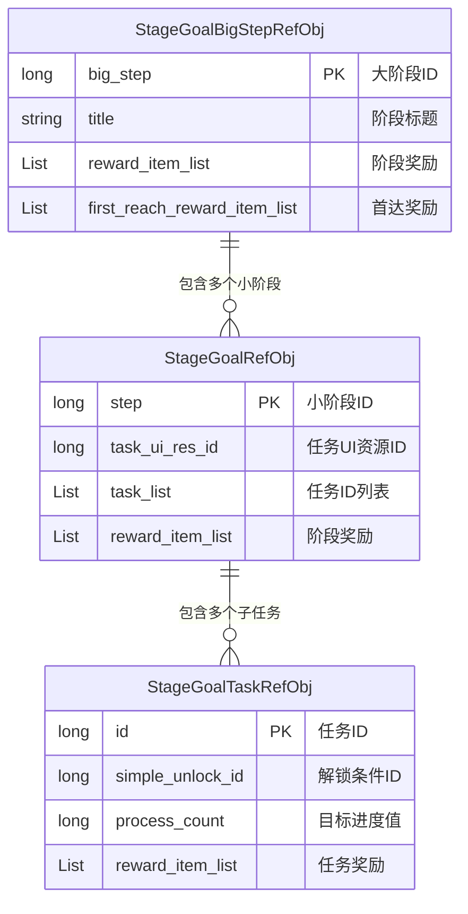
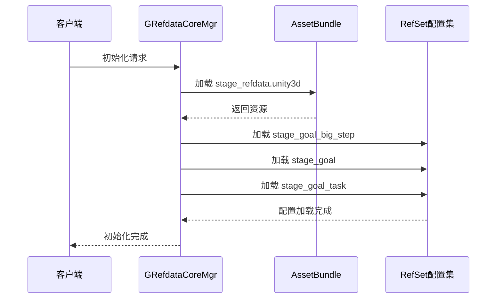
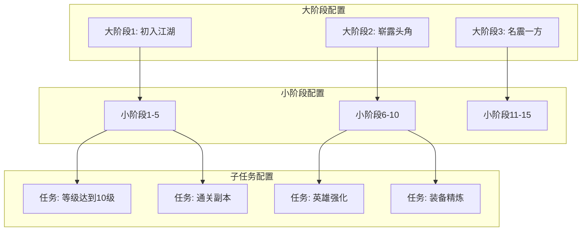

# 阶段目标数据配表文档

## 一、配表概述

阶段目标模块使用三张核心配置表，支撑整个阶段目标系统的运行：



---

## 二、大阶段配置表

### 2.1 StageGoalBigStepRefObj - 大阶段配置

**文件路径**: `refdata/stage_refdata.unity3d` → `stage_goal_big_step`

| 字段名 | 类型 | 必填 | 说明 |
|--------|------|------|------|
| big_step | int | 是 | 大阶段序号（主键） |
| begins_from_small_step | int | 是 | 从哪个小阶段开始（包含） |
| end_small_step | int | 是 | 结束的小阶段序号（包含），运行时计算 |
| icon | NPGTextureIndex | 是 | 大阶段图标 |
| peak_banner | NPGTextureIndex | 否 | 时代之巅大阶段banner图 |
| dialogue_id | long | 否 | 大阶段完成的对话ID |
| title | string | 是 | 标题多语言Key |
| title_args | List\<string\> | 否 | 标题参数列表 |
| desc | string | 否 | 描述多语言Key |
| desc_args | List\<string\> | 否 | 描述参数列表 |
| first_reach_reward_item_list | List\<NPCommonCostItem\> | 否 | 大阶段首达奖励列表 |
| reward_item_list | List\<NPCommonCostItem\> | 是 | 阶段完成奖励列表 |
| func_unlock_item_list | List\<NPCommonCostItem\> | 否 | 任务完成后解锁的功能图片 |
| building_index | NPGGoIndex | 是 | 对应的建筑资源索引 |
| build_sfx_id | long | 否 | 建筑建造时的特效ID |
| build_sfx_delay | float | 否 | 特效播放多久后加载建造完成后的资源 |
| done_need_draw_all_step_reward | bool | 否 | 是否需要领取所有小阶段奖励才可以领奖 |

### 2.2 配置示例

```json
{
  "big_step": 2,
  "begins_from_small_step": 6,
  "end_small_step": 10,
  "icon": { "atlas": "ui_stage_goal", "sprite": "big_step_2" },
  "peak_banner": { "atlas": "ui_stage_goal", "sprite": "peak_banner_2" },
  "dialogue_id": 2002,
  "title": "stage_goal_big_step_2_title",
  "title_args": [],
  "desc": "stage_goal_big_step_2_desc",
  "desc_args": [],
  "first_reach_reward_item_list": [
    { "itemId": 10001, "count": 1000, "type": 1 },
    { "itemId": 20001, "count": 1, "type": 3 }
  ],
  "reward_item_list": [
    { "itemId": 10001, "count": 500, "type": 1 },
    { "itemId": 30001, "count": 20, "type": 2 }
  ],
  "building_index": { "scene": "main", "prefab": "building_stage_2" },
  "done_need_draw_all_step_reward": false
}
```

### 2.3 代码访问方式

```csharp
// 客户端获取大阶段配置
StageGoalBigStepRefObj bigStepRef = GRefdataCoreMgr.instance.stageGoalBigStepRefCore.getRef(bigStepId);
if (bigStepRef != null)
{
    string title = bigStepRef.getTitle;
    List<NPCommonCostItem> rewards = bigStepRef.reward_item_list;
    int beginStep = bigStepRef.begins_from_small_step;
    int endStep = bigStepRef.end_small_step;
}

// 遍历所有大阶段配置
GRefdataCoreMgr.instance.stageGoalBigStepRefCore.dealAllRef(_bigStepRef => {
    Debug.Log($"大阶段: {_bigStepRef.big_step}, 标题: {_bigStepRef.getTitle}");
});

// 根据小阶段ID获取对应的大阶段配置
StageGoalBigStepRefObj GetBigStepBySmallStep(long smallStepId)
{
    StageGoalBigStepRefObj result = null;
    GRefdataCoreMgr.instance.stageGoalBigStepRefCore.dealAllRef(_bigStepRef => {
        if (_bigStepRef.begins_from_small_step <= smallStepId &&
            _bigStepRef.end_small_step >= smallStepId)
        {
            result = _bigStepRef;
        }
    });
    return result;
}
```

---

## 三、小阶段配置表

### 3.1 StageGoalRefObj - 小阶段配置

**文件路径**: `refdata/stage_refdata.unity3d` → `stage_goal`

| 字段名 | 类型 | 必填 | 说明 |
|--------|------|------|------|
| step | long | 是 | 小阶段ID（主键） |
| next_step_need_server_start_day | int | 否 | 进入下一阶段要求的服务器天数 |
| next_step_simple_unlock_id | long | 否 | 进入下一阶段解锁条件ID |
| task_list | List\<long\> | 是 | 子任务ID列表 |
| icon | NPGTextureIndex | 是 | 小阶段图标 |
| title | string | 是 | 标题多语言Key |
| title_args | List\<string\> | 否 | 标题参数列表 |
| dialogue_id | long | 否 | 任务结束时的对话ID |
| show_item_list | List\<NPCommonCostItem\> | 否 | 任务的关键物品图片展示 |
| reward_item_list | List\<NPCommonCostItem\> | 是 | 阶段完成奖励列表 |
| task_ui_res_id | long | 否 | 小阶段的任务面板UI资源ID |
| task_bg | NPGTextureIndex | 否 | 任务的背景图 |

### 3.2 配置示例

```json
{
  "step": 1,
  "next_step_need_server_start_day": 0,
  "next_step_simple_unlock_id": 0,
  "task_list": [101, 102, 103, 104, 105],
  "icon": { "atlas": "ui_stage_goal", "sprite": "step_1" },
  "title": "stage_goal_step_1_title",
  "title_args": [],
  "dialogue_id": 1001,
  "show_item_list": [
    { "itemId": 50001, "count": 1, "type": 4 }
  ],
  "reward_item_list": [
    { "itemId": 10001, "count": 100, "type": 1 }
  ],
  "task_ui_res_id": 10001,
  "task_bg": { "atlas": "ui_stage_goal", "sprite": "bg_step_1" }
}
```

### 3.3 代码访问方式

```csharp
// 客户端获取小阶段配置
StageGoalRefObj stageRef = GRefdataCoreMgr.instance.stageGoalRefCore.getRef(stepId);
if (stageRef != null)
{
    string title = stageRef.getTitle;
    List<long> taskIds = stageRef.task_list;
    int needServerDays = stageRef.next_step_need_server_start_day;
    long unlockId = stageRef.next_step_simple_unlock_id;
}

// 检查是否可以进入下一阶段
bool canEnterNextStep(StageGoalRefObj currentStage)
{
    if (currentStage.next_step_need_server_start_day > 0)
    {
        int serverDays = NPPlayer.instance.playerInfo.getValue(ENPPlayerParam.SERVER_START_DAYS);
        if (serverDays < currentStage.next_step_need_server_start_day)
            return false;
    }

    if (currentStage.next_step_simple_unlock_id > 0)
    {
        return GCommon.isSimpleUnlock(currentStage.next_step_simple_unlock_id);
    }

    return true;
}
```

---

## 四、子任务配置表

### 4.1 StageGoalTaskRefObj - 子任务配置

**文件路径**: `refdata/stage_refdata.unity3d` → `stage_goal_task`

| 字段名 | 类型 | 必填 | 说明 |
|--------|------|------|------|
| id | long | 是 | 唯一识别ID（主键） |
| simple_unlock_id | long | 否 | 解锁条件ID，0表示默认解锁 |
| process_cur_count | _NPPlayerVariableSerializeInfo | 否 | 计数器的高级公式(ENPPlayerVariableType) |
| process_count | long | 是 | 进度条计数目标值 |
| add_msg_type_list | List\<string\> | 否 | 监听消息类型列表，用于刷新进度 |
| process_num_format | EValueFormatType | 否 | 进度值格式化显示方式 |
| icon | NPGTextureIndex | 是 | 任务图标 |
| title | string | 是 | 标题多语言Key |
| title_args | List\<string\> | 否 | 标题参数列表 |
| go_to | _NPPlayerEffectSerializeInfo | 否 | 跳转效果配置 |
| reward_item_list | List\<NPCommonCostItem\> | 是 | 奖励物品列表 |
| desc | string | 否 | 描述多语言Key |
| desc_args | List\<string\> | 否 | 描述参数列表 |

### 4.2 配置示例

```json
{
  "id": 101,
  "simple_unlock_id": 0,
  "process_cur_count": {
    "type": "ENPPlayerVariableType",
    "value": "PLAYER_LEVEL"
  },
  "process_count": 10,
  "add_msg_type_list": ["ON_PLAYER_LEVEL_UP", "ON_NODE_CHG"],
  "process_num_format": "INT",
  "icon": { "atlas": "ui_stage_goal", "sprite": "task_level" },
  "title": "stage_goal_task_level_title",
  "title_args": ["10"],
  "go_to": {
    "type": "OPEN_PANEL",
    "param": "hero_panel"
  },
  "reward_item_list": [
    { "itemId": 10001, "count": 50, "type": 1 },
    { "itemId": 40001, "count": 10, "type": 5 }
  ],
  "desc": "stage_goal_task_level_desc",
  "desc_args": ["10"]
}
```

### 4.3 代码访问方式

```csharp
// 客户端获取子任务配置
StageGoalTaskRefObj taskRef = GRefdataCoreMgr.instance.stageGoalTaskRefCore.getRef(taskId);
if (taskRef != null)
{
    string title = taskRef.getTitle;
    string desc = taskRef.getDesc;
    long targetCount = taskRef.process_count;
    List<NPCommonCostItem> rewards = taskRef.reward_item_list;
}

// 检查任务是否解锁
bool isTaskUnlock(StageGoalTaskRefObj taskRef)
{
    if (taskRef == null)
        return false;

    if (taskRef.simple_unlock_id <= 0)
        return true;

    return GCommon.isSimpleUnlock(taskRef.simple_unlock_id);
}

// 获取任务当前进度
long getTaskProgress(StageGoalTaskRefObj taskRef, long serverCount)
{
    if (taskRef == null || taskRef.process_cur_count == null)
        return serverCount;

    // 客户端额外计算的进度
    long clientCount = taskRef.process_cur_count.CalculateVariableResult(null);
    return serverCount + clientCount;
}
```

---

## 五、配表加载流程



### 5.1 加载代码示例

```csharp
// 初始化引用管理器
public class GRefdataCoreMgr_StageGoal : MonoBehaviour
{
    // 大阶段配置核心
    public GSOStageGoalBigStepRefSet stageGoalBigStepRefCore;

    // 小阶段配置核心
    public GSOStageGoalRefSet stageGoalRefCore;

    // 子任务配置核心
    public GSOStageGoalTaskRefSet stageGoalTaskRefCore;

    // 根据小阶段ID获取大阶段配置
    public StageGoalBigStepRefObj getStageGoalBigStepRefObj(int _smallStep)
    {
        StageGoalBigStepRefObj result = null;
        stageGoalBigStepRefCore.dealAllRef(_bigStepRef => {
            if (_bigStepRef.begins_from_small_step <= _smallStep &&
                _bigStepRef.end_small_step >= _smallStep)
            {
                result = _bigStepRef;
            }
        });
        return result;
    }
}
```

---

## 六、配置关联关系



---

## 七、配置校验规则

| 校验项 | 规则 | 错误等级 |
|--------|------|----------|
| big_step唯一性 | 大阶段ID不能重复 | Error |
| step唯一性 | 小阶段ID不能重复 | Error |
| id唯一性 | 任务ID不能重复 | Error |
| begins_from_small_step | 必须对应有效的小阶段ID | Error |
| task_list引用 | 任务ID必须存在 | Error |
| reward_item_list | 奖励物品ID必须存在 | Warning |
| simple_unlock_id | 解锁条件ID必须存在 | Warning |

---

*文档更新时间: 2026-04-11*
