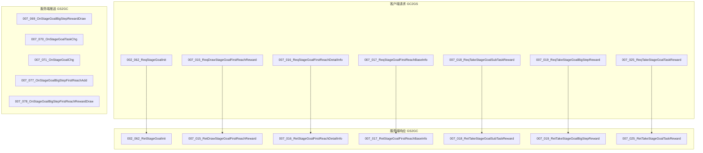
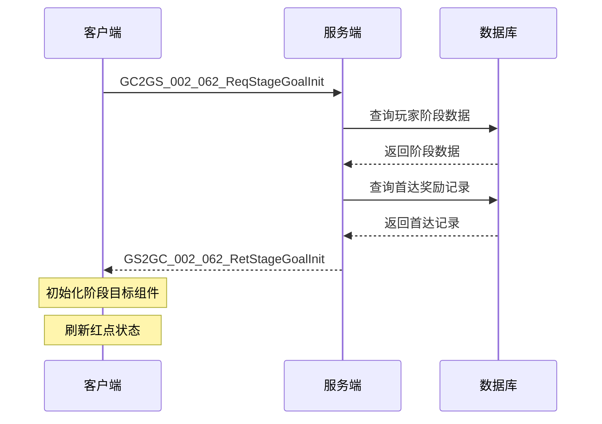
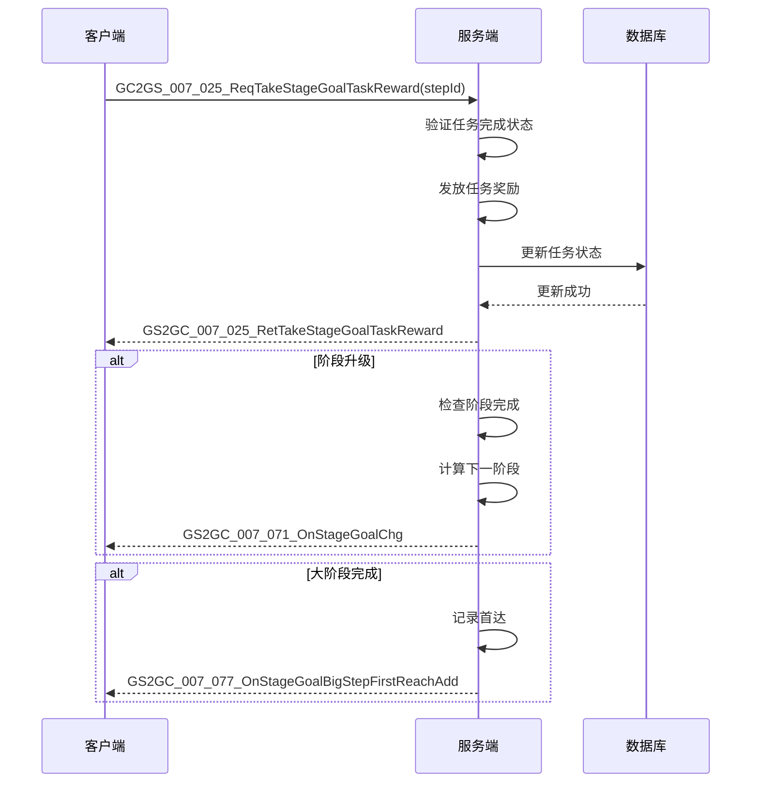
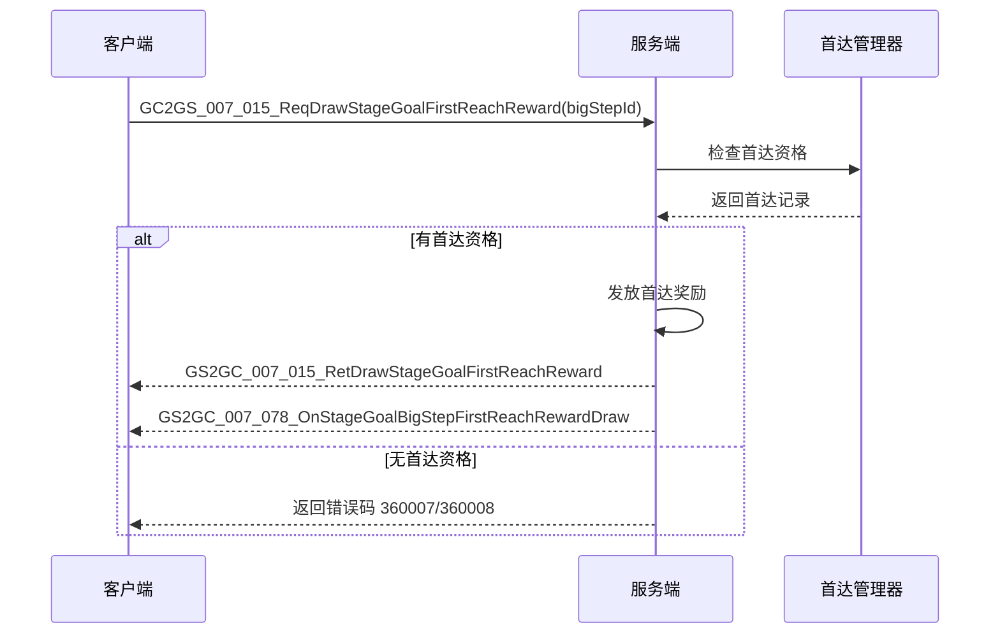

# 阶段目标协议文档

## 协议模块编号

| 模块 | 编号 | 说明 |
|------|------|------|
| p002_InitOp | 002 | 初始化模块 |
| p007_CommOp | 007 | 通用操作模块 |

---

## 一、协议架构总览



---

## 二、公共数据结构

### 2.1 StageGoal_Info - 阶段目标数据

**命名空间**: `Common.StageGoalObj`

| 字段名 | 类型 | 说明 |
|--------|------|------|
| step | long | 阶段ID（小阶段） |
| taskList | List\<StageGoalTask_Info\> | 任务数据列表 |
| isDone | bool | 是否完成（所有阶段任务都已完成并领取奖励） |

**协议结构**:
```csharp
public class StageGoal_Info : _IALProtocolStructure {
    private long step;                                           // 8 bytes
    private List<Common.StageGoalObj.StageGoalTask_Info> taskList; // 2 + N*21 bytes
    private bool isDone;                                         // 1 byte
}
```

### 2.2 StageGoalTask_Info - 阶段目标任务数据

**命名空间**: `Common.StageGoalObj`

| 字段名 | 类型 | 说明 |
|--------|------|------|
| taskId | long | 阶段任务ID |
| counter | long | 计数（当前进度） |
| hadDraw | bool | 是否已领取奖励 |

**协议结构**:
```csharp
public class StageGoalTask_Info : _IALProtocolStructure {
    private long taskId;    // 8 bytes
    private long counter;   // 8 bytes
    private bool hadDraw;   // 1 byte
}
```

### 2.3 StageGoal_BigStepFirstReachInfo - 大阶段首达信息

**命名空间**: `Common.StageGoalObj`

| 字段名 | 类型 | 说明 |
|--------|------|------|
| bigStepId | long | 大阶段ID |
| cid | long | 首达角色ID |
| reachTimeMs | long | 首达时间戳（毫秒） |

**协议结构**:
```csharp
public class StageGoal_BigStepFirstReachInfo : _IALProtocolStructure {
    private long bigStepId;    // 8 bytes
    private long cid;          // 8 bytes
    private long reachTimeMs;  // 8 bytes
}
```

### 2.4 StageGoal_TopPlayerInfo - TOP1玩家信息

**命名空间**: `Common.StageGoalObj`

| 字段名 | 类型 | 说明 |
|--------|------|------|
| cid | long | 首达角色ID |
| stepId | long | 小阶段ID |

**协议结构**:
```csharp
public class StageGoal_TopPlayerInfo : _IALProtocolStructure {
    private long cid;     // 8 bytes
    private long stepId;  // 8 bytes
}
```

---

## 三、客户端请求协议 (GC2GS)

### 3.1 GC2GS_002_062_ReqStageGoalInit - 请求阶段目标初始化

**功能说明**: 请求获取玩家阶段目标数据，在玩家登录时自动调用

| 字段名 | 类型 | 必填 | 说明 |
|--------|------|------|------|
| - | - | - | 无参数 |

**协议编号**: MainOrder=2, SubOrder=62

```csharp
// 发送请求
NPGSClientListener.sendMsgByLog(GSWriter_002_InitOp.make_002_062_ReqStageGoalInit());

// 协议构造
public class GC2GS_002_062_ReqStageGoalInit : _IALProtocolStructure {
    // 无参数
}
```

---

### 3.2 GC2GS_007_015_ReqDrawStageGoalFirstReachReward - 领取首达奖励

**功能说明**: 玩家领取大阶段首达奖励

| 字段名 | 类型 | 必填 | 说明 |
|--------|------|------|------|
| bigStepId | long | 是 | 大阶段ID |

**协议编号**: MainOrder=7, SubOrder=15

```csharp
// 发送请求
NPGSClientListener.sendRequestByLog(
    GSWriter_007_CommOp.make_015_ReqDrawStageGoalFirstReachReward(bigStepId),
    new CommonErrCodeRequestCallbackProtocolDealer<GS2GC_007_015_RetDrawStageGoalFirstReachReward>(null)
);

// 协议构造
public class GC2GS_007_015_ReqDrawStageGoalFirstReachReward : _IALProtocolStructure {
    private long bigStepId;  // 8 bytes
}
```

---

### 3.3 GC2GS_007_016_ReqStageGoalFirstReachDetailInfo - 请求首达详情

**功能说明**: 请求指定大阶段的首达详细信息

| 字段名 | 类型 | 必填 | 说明 |
|--------|------|------|------|
| bigStepId | long | 是 | 大阶段ID |

**协议编号**: MainOrder=7, SubOrder=16

```csharp
// 发送请求
NPGSClientListener.sendRequestByLog(
    GSWriter_007_CommOp.make_016_ReqStageGoalFirstReachDetailInfo(bigStepId),
    new CommonErrCodeRequestCallbackProtocolDealer<GS2GC_007_016_RetStageGoalFirstReachDetailInfo>(callback)
);

// 协议构造
public class GC2GS_007_016_ReqStageGoalFirstReachDetailInfo : _IALProtocolStructure {
    private long bigStepId;  // 8 bytes
}
```

---

### 3.4 GC2GS_007_017_ReqStageGoalFirstReachBaseInfo - 请求首达基础信息

**功能说明**: 请求所有大阶段首达基础信息和TOP1玩家信息

| 字段名 | 类型 | 必填 | 说明 |
|--------|------|------|------|
| - | - | - | 无参数 |

**协议编号**: MainOrder=7, SubOrder=17

```csharp
// 发送请求
NPGSClientListener.sendRequestByLog(
    GSWriter_007_CommOp.make_017_ReqStageGoalFirstReachBaseInfo(),
    new CommonErrCodeRequestCallbackProtocolDealer<GS2GC_007_017_RetStageGoalFirstReachBaseInfo>(callback)
);

// 协议构造
public class GC2GS_007_017_ReqStageGoalFirstReachBaseInfo : _IALProtocolStructure {
    // 无参数
}
```

---

### 3.5 GC2GS_007_018_ReqTakeStageGoalSubTaskReward - 领取子任务奖励

**功能说明**: 领取单个子任务的奖励

| 字段名 | 类型 | 必填 | 说明 |
|--------|------|------|------|
| taskId | long | 是 | 任务ID |

**协议编号**: MainOrder=7, SubOrder=18

```csharp
// 发送请求
NPGSClientListener.sendRequestByLog(
    GSWriter_007_CommOp.make_018_ReqTakeStageGoalSubTaskReward(taskId),
    new CommonErrCodeRequestCallbackProtocolDealer<GS2GC_007_018_RetTakeStageGoalSubTaskReward>(callback)
);

// 协议构造
public class GC2GS_007_018_ReqTakeStageGoalSubTaskReward : _IALProtocolStructure {
    private long taskId;  // 8 bytes
}
```

---

### 3.6 GC2GS_007_019_ReqTakeStageGoalBigStepReward - 领取大阶段奖励

**功能说明**: 领取大阶段的完成奖励

| 字段名 | 类型 | 必填 | 说明 |
|--------|------|------|------|
| bigStep | long | 是 | 大阶段ID |

**协议编号**: MainOrder=7, SubOrder=19

```csharp
// 发送请求
NPGSClientListener.sendRequestByLog(
    GSWriter_007_CommOp.make_019_ReqTakeStageGoalBigStepReward(bigStep),
    new CommonErrCodeRequestCallbackProtocolDealer<GS2GC_007_019_RetTakeStageGoalBigStepReward>(callback)
);

// 协议构造
public class GC2GS_007_019_ReqTakeStageGoalBigStepReward : _IALProtocolStructure {
    private long bigStep;  // 8 bytes
}
```

---

### 3.7 GC2GS_007_025_ReqTakeStageGoalTaskReward - 领取任务奖励（通用）

**功能说明**: 领取当前小阶段的任务奖励，完成后进入下一阶段

| 字段名 | 类型 | 必填 | 说明 |
|--------|------|------|------|
| curStepId | long | 是 | 当前小阶段ID |

**协议编号**: MainOrder=7, SubOrder=25

```csharp
// 发送请求
NPGSClientListener.sendRequestByLog(
    GSWriter_007_CommOp.make_025_ReqTakeStageGoalTaskReward(curStepId),
    new CommonRequestSucFailSameCallbackProtocolDealer<GS2GC_007_025_RetTakeStageGoalTaskReward>(callback)
);

// 协议构造
public class GC2GS_007_025_ReqTakeStageGoalTaskReward : _IALProtocolStructure {
    private long curStepId;  // 8 bytes
}
```

---

## 四、服务端响应协议 (GS2GC)

### 4.1 GS2GC_002_062_RetStageGoalInit - 返回阶段目标初始化数据

**功能说明**: 返回玩家完整的阶段目标数据

| 字段名 | 类型 | 说明 |
|--------|------|------|
| curStageGoal | StageGoal_Info | 当前阶段任务数据 |
| hadDrawBigStepList | List\<long\> | 已领取的大阶段奖励ID列表 |
| hadDrawBigStepFirstReachList | List\<long\> | 已领取的大阶段首达奖励ID列表 |
| canDrawBigStepFirstReachList | List\<long\> | 可领取的大阶段首达奖励ID列表 |

**协议编号**: MainOrder=2, SubOrder=62

```csharp
public class GS2GC_002_062_RetStageGoalInit : _IALProtocolStructure {
    private Common.StageGoalObj.StageGoal_Info curStageGoal;
    private List<long> hadDrawBigStepList;
    private List<long> hadDrawBigStepFirstReachList;
    private List<long> canDrawBigStepFirstReachList;
}

// 客户端处理
public void retStageGoalInit(GS2GC_002_062_RetStageGoalInit _stageInfo)
{
    if (null == _stageInfo)
    {
        setInitDone();
        return;
    }

    _updateStageGoal(_stageInfo.getCurStageGoal());
    _updateBigGoalRewardItemList(_stageInfo.getHadDrawBigStepList());
    _updateHadDrawBigStepFirstReachList(_stageInfo.getHadDrawBigStepFirstReachList());
    _updateCanDrawBigStepFirstReachList(_stageInfo.getCanDrawBigStepFirstReachList());
    setInitDone();
}
```

---

### 4.2 GS2GC_007_016_RetStageGoalFirstReachDetailInfo - 返回首达详情

**功能说明**: 返回指定大阶段的首达详细信息

| 字段名 | 类型 | 说明 |
|--------|------|------|
| bigStepId | long | 大阶段ID |
| detailList | List\<StageGoal_BigStepFirstReachInfo\> | 首达详情列表 |

```csharp
public class GS2GC_007_016_RetStageGoalFirstReachDetailInfo : _IALProtocolStructure {
    private long bigStepId;
    private List<Common.StageGoalObj.StageGoal_BigStepFirstReachInfo> detailList;
}
```

---

### 4.3 GS2GC_007_017_RetStageGoalFirstReachBaseInfo - 返回首达基础信息

**功能说明**: 返回所有大阶段首达基础信息和TOP1玩家

| 字段名 | 类型 | 说明 |
|--------|------|------|
| infoList | List\<StageGoal_BigStepFirstReachInfo\> | 基础信息列表 |
| topInfo | StageGoal_TopPlayerInfo | TOP1玩家信息 |

```csharp
public class GS2GC_007_017_RetStageGoalFirstReachBaseInfo : _IALProtocolStructure {
    private List<Common.StageGoalObj.StageGoal_BigStepFirstReachInfo> infoList;
    private Common.StageGoalObj.StageGoal_TopPlayerInfo topInfo;
}

// 客户端处理
public void reqStageGoalFirstReachBaseInfo(Action<GS2GC_007_017_RetStageGoalFirstReachBaseInfo> _doneAction)
{
    NPGSClientListener.sendRequestByLog(
        GSWriter_007_CommOp.make_017_ReqStageGoalFirstReachBaseInfo(),
        new CommonErrCodeRequestCallbackProtocolDealer<GS2GC_007_017_RetStageGoalFirstReachBaseInfo>(_info => {
            if (_info == null) return;

            // 更新首达信息列表
            if (_info.getInfoList() != null)
            {
                _m_lFirstReachInfoList.Clear();
                for (int i = 0; i < _info.getInfoList().Count; i++)
                {
                    _m_lFirstReachInfoList.Add(new StageGoalFirstReachInfo(_info.getInfoList()[i]));
                }
            }

            // 更新TOP1玩家信息
            if (_m_topPlayerInfo == null)
                _m_topPlayerInfo = new StageGoalTopPlayerInfo(_info.getTopInfo());
            else
                _m_topPlayerInfo.updateInfo(_info.getTopInfo());

            _doneAction?.Invoke(_info);
        }));
}
```

---

## 五、服务端推送协议 (GS2GC)

### 5.1 GS2GC_007_069_OnStageGoalBigStepRewardDraw - 大阶段奖励领取推送

**功能说明**: 推送大阶段奖励领取成功消息

| 字段名 | 类型 | 说明 |
|--------|------|------|
| bigStepId | long | 已领取的大阶段ID |

```csharp
// 客户端处理
public void onStageGoalBigStepRewardDraw(long _bigStepId)
{
    _m_hasGetRewardBigGoalItemList.Add(_bigStepId);
    refreshRed();
    WinMsg.SendMsg(WinMsgType.ON_STAGE_GOAL_BIG_STEP_REWARD_DRAW);
}
```

---

### 5.2 GS2GC_007_070_OnStageGoalTaskChg - 任务变更推送

**功能说明**: 推送任务进度变更消息

| 字段名 | 类型 | 说明 |
|--------|------|------|
| taskInfo | StageGoalTask_Info | 变更的任务信息 |

```csharp
// 客户端处理
public void onStageGoalTaskChg(StageGoalTask_Info _taskInfo)
{
    if (null == _taskInfo) return;

    for (int i = 0; i < _m_taskItemList.Count; i++)
    {
        StageGoalTaskItem item = _m_taskItemList[i];
        if (item.taskId == _taskInfo.getTaskId())
        {
            item.updateTask(_taskInfo);
            break;
        }
    }
    refreshRed();
}
```

---

### 5.3 GS2GC_007_071_OnStageGoalChg - 阶段目标变更推送

**功能说明**: 推送阶段目标整体变更消息（阶段升级）

| 字段名 | 类型 | 说明 |
|--------|------|------|
| info | StageGoal_Info | 变更后的阶段信息 |

```csharp
// 客户端处理
public void onStageGoalChg(StageGoal_Info _info)
{
    if (_info == null) return;

    // 如果阶段变化，清空记录的已读任务完成红点
    if (_m_curStageStepId != _info.getStep())
        AccountSettingMgr.instance.accountSetting.clearStageTaskReadRedTipRecord();

    _updateStageGoal(_info);
    refreshRed();
    _checkNeedStartTickTask();
}
```

---

### 5.4 GS2GC_007_077_OnStageGoalBigStepFirstReachAdd - 可领取首达奖励推送

**功能说明**: 推送有新的首达奖励可领取消息

| 字段名 | 类型 | 说明 |
|--------|------|------|
| bigStepId | long | 可领取首达奖励的大阶段ID |

```csharp
// 客户端处理
public void onStageGoalBigStepFirstReachAdd(GS2GC_007_077_OnStageGoalBigStepFirstReachAdd _msg)
{
    if (_msg == null) return;

    // 增加可领取
    if (!_m_canDrawBigStepFirstReachList.Contains(_msg.getBigStepId()))
        _m_canDrawBigStepFirstReachList.Add(_msg.getBigStepId());

    refreshRed();
    WinMsg.SendMsg(WinMsgType.ON_STAGE_GOAL_FIRST_REACH_ADD, _msg.getBigStepId());
}
```

---

### 5.5 GS2GC_007_078_OnStageGoalBigStepFirstReachRewardDraw - 首达奖励领取推送

**功能说明**: 推送首达奖励领取成功消息

| 字段名 | 类型 | 说明 |
|--------|------|------|
| bigStep | long | 已领取首达奖励的大阶段ID |

```csharp
// 客户端处理
public void onStageGoalBigStepFirstReachRewardDraw(GS2GC_007_078_OnStageGoalBigStepFirstReachRewardDraw _msg)
{
    if (_msg == null) return;

    // 增加已领取
    if (!_m_hadDrawBigStepFirstReachList.Contains(_msg.getBigStep()))
        _m_hadDrawBigStepFirstReachList.Add(_msg.getBigStep());

    // 移除可领取
    if (_m_canDrawBigStepFirstReachList.Contains(_msg.getBigStep()))
        _m_canDrawBigStepFirstReachList.Remove(_msg.getBigStep());

    refreshRed();
    WinMsg.SendMsg(WinMsgType.ON_STAGE_GOAL_FIRST_REACH_DRAW, _msg.getBigStep());
}
```

---

## 六、协议交互时序图

### 6.1 初始化流程



### 6.2 领取任务奖励流程



### 6.3 领取首达奖励流程



---

## 七、错误码定义

### 7.1 StageGoalErr 错误码表

| 错误码 | 错误名称 | 说明 | 处理建议 |
|--------|----------|------|----------|
| 360001 | STAGE_GOAL_STEP_REWARD_DRAWN | 阶段目标阶段奖励已领取 | 检查领取记录 |
| 360002 | STAGE_GOAL_TASK_NOT_FOUND | 阶段目标任务不存在 | 检查任务ID |
| 360003 | STAGE_GOAL_TASK_COMPLETED | 阶段目标任务已完成 | 正常状态 |
| 360004 | STAGE_GOAL_TASK_NOT_COMPLETE | 阶段目标任务未完成 | 提示完成任务 |
| 360005 | STAGE_GOAL_BIG_STEP_REWARD_DRAWN | 阶段目标大阶段奖励已领取 | 检查领取记录 |
| 360006 | STAGE_GOAL_STEP_NOT_COMPLETE | 阶段目标阶段未完成 | 完成所有子任务 |
| 360007 | STAGE_GOAL_FIRST_REACH_REWARD_DRAWN | 阶段目标大阶段首次达成奖励已领取 | 检查首达领取记录 |
| 360008 | STAGE_GOAL_FIRST_REACH_REWARD_NOT_UNLOCK | 阶段目标大阶段首次达成奖励未解锁 | 等待首达产生 |
| 360009 | STAGE_GOAL_SERVER_DAY_NOT_ENOUGH | 阶段目标服务器开服天数不足以解锁下个阶段 | 等待开服天数 |
| 360010 | STAGE_GOAL_UNLOCK_CONDITION_NOT_MET | 阶段目标解锁条件不满足解锁下个阶段 | 完成解锁条件 |

### 7.2 错误码代码定义

```csharp
// 客户端错误码注册
class StageGoalErr
{
    static StageGoalErr()
    {
        ProtocolErrorCodeResult.instance.RegistResult(new RESULT(360001, "阶段目标阶段奖励已领取"));
        ProtocolErrorCodeResult.instance.RegistResult(new RESULT(360002, "阶段目标任务不存在"));
        ProtocolErrorCodeResult.instance.RegistResult(new RESULT(360003, "阶段目标任务已完成"));
        ProtocolErrorCodeResult.instance.RegistResult(new RESULT(360004, "阶段目标任务未完成"));
        ProtocolErrorCodeResult.instance.RegistResult(new RESULT(360005, "阶段目标大阶段奖励已领取"));
        ProtocolErrorCodeResult.instance.RegistResult(new RESULT(360006, "阶段目标阶段未完成"));
        ProtocolErrorCodeResult.instance.RegistResult(new RESULT(360007, "阶段目标大阶段首次达成奖励已领取"));
        ProtocolErrorCodeResult.instance.RegistResult(new RESULT(360008, "阶段目标大阶段首次达成奖励未解锁"));
        ProtocolErrorCodeResult.instance.RegistResult(new RESULT(360009, "阶段目标服务器开服天数不足以解锁下个阶段"));
        ProtocolErrorCodeResult.instance.RegistResult(new RESULT(360010, "阶段目标解锁条件不满足解锁下个阶段"));
    }
}
```

---

*文档更新时间: 2026-04-11*
