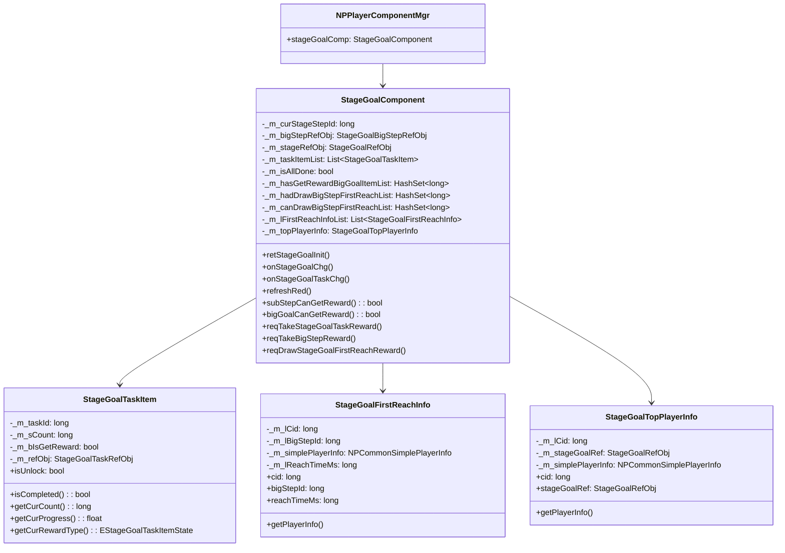
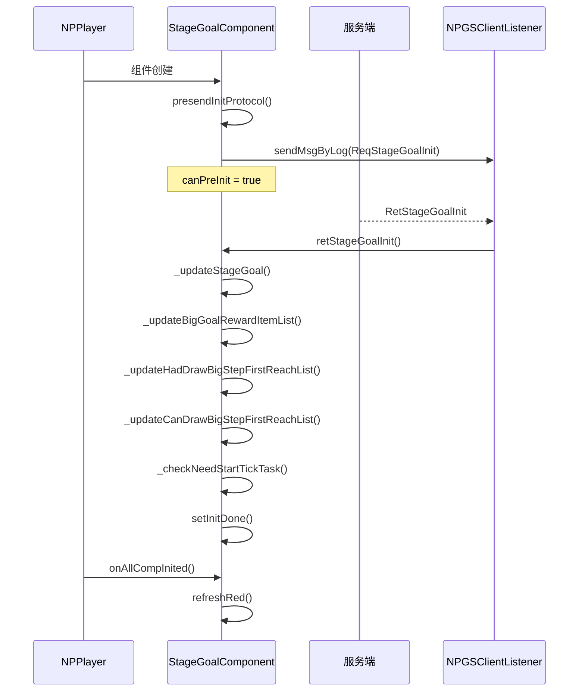

# 阶段目标客户端开发文档

## 一、模块架构

### 1.1 组件层级架构



### 1.2 组件访问方式

```csharp
// 获取阶段目标组件
StageGoalComponent stageGoalComp = NPPlayer.instance.stageGoalComp;

// 访问组件属性
long curStepId = stageGoalComp.curStageStepId;
StageGoalBigStepRefObj bigStepRef = stageGoalComp.bigStepRefObj;
StageGoalRefObj stageRef = stageGoalComp.stageRefObj;
bool isAllDone = stageGoalComp.isAllDone;
```

---

## 二、核心数据结构

### 2.1 StageGoalComponent 组件字段

| 字段名 | 类型 | 说明 |
|--------|------|------|
| curStageStepId | long | 当前阶段ID（小阶段） |
| bigStepRefObj | StageGoalBigStepRefObj | 当前大阶段配置 |
| stageRefObj | StageGoalRefObj | 当前小阶段配置 |
| isAllDone | bool | 所有阶段是否完成 |
| firstReachInfoList | List\<StageGoalFirstReachInfo\> | 大阶段首达玩家信息列表 |
| topPlayerInfo | StageGoalTopPlayerInfo | TOP1玩家信息 |

### 2.2 StageGoalTaskItem 任务项字段

| 字段名 | 类型 | 说明 |
|--------|------|------|
| taskId | long | 任务ID |
| refObj | StageGoalTaskRefObj | 配表数据 |
| isUnlock | bool | 是否已解锁 |
| isReadRedTip | bool | 是否已读红点 |

### 2.3 EStageGoalTaskItemState 任务状态枚举

| 状态值 | 说明 |
|--------|------|
| UNLOCK | 未解锁 |
| CAN_NOT_GET | 未完成，不可领取 |
| CAN_GET | 已完成，可领取 |
| HAS_GET | 已领取 |

---

## 三、组件初始化流程



### 3.1 初始化代码示例

```csharp
public class StageGoalComponent : _ANPBasicPlayerComponent
{
    // 是否允许提前初始化
    public override bool canPreInit { get { return true; } }

    // 发送初始化协议提前申请内容
    public override void presendInitProtocol()
    {
        _reqStageGoalInit();
    }

    // 组件加载完成时的调用
    protected override void _onInitDone()
    {
        WinMsg.RegisterMsgAct(WinMsgType.ON_NODE_CHG, _onNodeChg);
        WinMsg.RegisterMsgAct(WinMsgType.CUSTOM_RELOAD, _onNodeChg);
    }

    // 所有组件初始化完以后
    public override void onAllCompInited()
    {
        // 刷新红点
        refreshRed();
    }
}
```

---

## 四、核心方法详解

### 4.1 判断是否可领取阶段奖励

```csharp
/// <summary>
/// 主任务是否可以领取奖励
/// </summary>
public bool subStepCanGetReward()
{
    if (isAllDone)
        return false;

    // 如果当前阶段配置了需要服务器开服天数才能领取奖励
    if (_m_stageRefObj != null &&
        _m_stageRefObj.next_step_need_server_start_day > 0 &&
        _m_stageRefObj.next_step_need_server_start_day > NPPlayer.instance.playerInfo.getValue(ENPPlayerParam.SERVER_START_DAYS))
        return false;

    // 如果配置了simpleUnlock，并且没有解锁
    if (_m_stageRefObj != null && _m_stageRefObj.next_step_simple_unlock_id > 0 &&
        !GCommon.isSimpleUnlock(_m_stageRefObj.next_step_simple_unlock_id))
        return false;

    // 检查所有任务是否完成
    StageGoalTaskItem temp = null;
    for (int i = 0; i < _m_taskItemList.Count; i++)
    {
        temp = _m_taskItemList[i];
        if (null == temp || !temp.isUnlock)
            continue;

        if (!temp.isCompleted())
            return false;
    }

    return true;
}
```

### 4.2 判断是否可领取大阶段奖励

```csharp
/// <summary>
/// 大阶段是否可以领取奖励
/// </summary>
public bool bigGoalCanGetReward()
{
    if (_m_bigStepRefObj == null)
        return false;

    // 如果没有配置奖励，则当做已领取奖励
    if (_m_bigStepRefObj.reward_item_list == null || _m_bigStepRefObj.reward_item_list.Count <= 0)
        return false;

    int bigStepCheck = _m_bigStepRefObj.big_step;
    for (int i = 1; i <= bigStepCheck; i++)
    {
        if (_m_bigStepRefObj.big_step == i)
        {
            // 如果是当前大阶段，不需要先领小阶段奖励并且已经完成了所有小阶段任务
            if (!_m_hasGetRewardBigGoalItemList.Contains(i) &&
                !_m_bigStepRefObj.done_need_draw_all_step_reward &&
                curIsLastSmallStepOfCurBigStep() &&
                subStepCanGetReward())
                return true;
        }
        else
        {
            if (!_m_hasGetRewardBigGoalItemList.Contains(i))
                return true;
        }
    }

    return false;
}
```

### 4.3 获取大阶段进度

```csharp
/// <summary>
/// 获取大阶段进度百分比
/// </summary>
public float getStageGoalBigProgress()
{
    if (null == _m_bigStepRefObj)
        return 0;

    float smallStepCount = _m_bigStepRefObj.end_small_step - _m_bigStepRefObj.begins_from_small_step + 1;
    float smallStepProcess = (_m_curStageStepId - _m_bigStepRefObj.begins_from_small_step) / smallStepCount;
    float subTaskProcess = getSubStageGoalCompleteCount() / (float)(getSubStageGoalAvailableTaskCount());

    return (float)Math.Round(smallStepProcess + (smallStepCount > 0 ? subTaskProcess / smallStepCount : 0), 2);
}
```

### 4.4 获取首达奖励状态

```csharp
/// <summary>
/// 获取大阶段首达奖励状态
/// </summary>
public ECommonRewardType getFirstReachBigStepRewardType(long _bigStepId)
{
    if (_m_hadDrawBigStepFirstReachList.Contains(_bigStepId))
        return ECommonRewardType.HAS_GET_REWARD;

    if (_m_canDrawBigStepFirstReachList.Contains(_bigStepId))
        return ECommonRewardType.CAN_GET_REWARD;

    return ECommonRewardType.NOT_GET_REWARD;
}
```

---

## 五、请求方法

### 5.1 领取阶段奖励

```csharp
/// <summary>
/// 领取阶段奖励
/// </summary>
public void reqTakeStageGoalTaskReward(Action<GS2GC_007_025_RetTakeStageGoalTaskReward> _doneAtion = null)
{
    StageGoalBigStepRefObj curBigStageGoal = GRefdataCoreMgr.instance.getStageGoalBigStepRefObj((int)_m_curStageStepId);
    StageGoalBigStepRefObj nextBigStageGoal = GRefdataCoreMgr.instance.getStageGoalBigStepRefObj((int)_m_curStageStepId + 1);
    StageGoalRefObj nextSmallStageRefObj = GRefdataCoreMgr.instance.stageGoalRefCore.getRef(_m_curStageStepId + 1);

    NPGSClientListener.sendRequestByLog(
        GSWriter_007_CommOp.make_025_ReqTakeStageGoalTaskReward(_m_curStageStepId),
        new CommonRequestSucFailSameCallbackProtocolDealer<GS2GC_007_025_RetTakeStageGoalTaskReward>((_isSuc, _info) =>
        {
            if (null == _info) return;

            if (_isSuc)
            {
                // 完成大阶段，发送阶段完成埋点
                if (nextBigStageGoal != null && curBigStageGoal != null &&
                    nextBigStageGoal.big_step != curBigStageGoal.big_step &&
                    curBigStageGoal.big_step == 2)
                    GCommon.sendAllThirdCustomEvent(EThirdCustomEventType.STAGE_2);

                if ((nextBigStageGoal == null || nextSmallStageRefObj == null) &&
                    curBigStageGoal != null && curBigStageGoal.big_step == 8)
                    GCommon.sendAllThirdCustomEvent(EThirdCustomEventType.STAGE_8);

                _doneAtion?.Invoke(_info);
            }
        }));
}
```

### 5.2 领取大阶段奖励

```csharp
/// <summary>
/// 领取阶段目标大阶段奖励
/// </summary>
public void reqTakeBigStepReward(long _bigStep, Action<GS2GC_007_019_RetTakeStageGoalBigStepReward> _doneAction = null)
{
    NPGSClientListener.sendRequestByLog(
        GSWriter_007_CommOp.make_019_ReqTakeStageGoalBigStepReward(_bigStep),
        new CommonErrCodeRequestCallbackProtocolDealer<GS2GC_007_019_RetTakeStageGoalBigStepReward>(_info =>
        {
            if (null == _info) return;
            _doneAction?.Invoke(_info);
        }));
}
```

### 5.3 领取子任务奖励

```csharp
/// <summary>
/// 领取阶段目标子任务奖励
/// </summary>
public void reqTakeStageGoalSubTaskReward(long _taskId, Action<GS2GC_007_018_RetTakeStageGoalSubTaskReward> _doneAction = null)
{
    NPGSClientListener.sendRequestByLog(
        GSWriter_007_CommOp.make_018_ReqTakeStageGoalSubTaskReward(_taskId),
        new CommonErrCodeRequestCallbackProtocolDealer<GS2GC_007_018_RetTakeStageGoalSubTaskReward>(_info =>
        {
            if (null == _info) return;
            _doneAction?.Invoke(_info);
        }));
}
```

### 5.4 领取首达奖励

```csharp
/// <summary>
/// 领取阶段目标首达奖励
/// </summary>
public void reqDrawStageGoalFirstReachReward(long _bigStepId)
{
    NPGSClientListener.sendRequestByLog(
        GSWriter_007_CommOp.make_015_ReqDrawStageGoalFirstReachReward(_bigStepId),
        new CommonErrCodeRequestCallbackProtocolDealer<GS2GC_007_015_RetDrawStageGoalFirstReachReward>(null));
}
```

### 5.5 请求首达详情信息

```csharp
/// <summary>
/// 请求阶段目标首达详细信息
/// </summary>
public void reqStageGoalFirstReachDetailInfo(long _bigStepId, Action<GS2GC_007_016_RetStageGoalFirstReachDetailInfo> _doneAction = null)
{
    NPGSClientListener.sendRequestByLog(
        GSWriter_007_CommOp.make_016_ReqStageGoalFirstReachDetailInfo(_bigStepId),
        new CommonErrCodeRequestCallbackProtocolDealer<GS2GC_007_016_RetStageGoalFirstReachDetailInfo>(_info =>
        {
            if (_info == null) return;
            _doneAction?.Invoke(_info);
        }));
}

/// <summary>
/// 请求阶段目标首达基础信息
/// </summary>
public void reqStageGoalFirstReachBaseInfo(Action<GS2GC_007_017_RetStageGoalFirstReachBaseInfo> _doneAction = null)
{
    NPGSClientListener.sendRequestByLog(
        GSWriter_007_CommOp.make_017_ReqStageGoalFirstReachBaseInfo(),
        new CommonErrCodeRequestCallbackProtocolDealer<GS2GC_007_017_RetStageGoalFirstReachBaseInfo>(_info =>
        {
            if (_info == null) return;

            // 更新首达信息列表
            if (_info.getInfoList() != null)
            {
                _m_lFirstReachInfoList.Clear();
                for (int i = 0; i < _info.getInfoList().Count; i++)
                {
                    _m_lFirstReachInfoList.Add(new StageGoalFirstReachInfo(_info.getInfoList()[i]));
                }
            }

            // 更新TOP1玩家信息
            if (_m_topPlayerInfo == null)
                _m_topPlayerInfo = new StageGoalTopPlayerInfo(_info.getTopInfo());
            else
                _m_topPlayerInfo.updateInfo(_info.getTopInfo());

            _doneAction?.Invoke(_info);
        }));
}
```

---

## 六、红点系统

### 6.1 红点刷新方法

```csharp
/// <summary>
/// 刷新红点
/// </summary>
public void refreshRed()
{
    refreshCurStageGoalRedTip();

    // 大阶段奖励红点
    RedTipMgr.instance.setCountByRefRedTipId(
        RedTipConst.RED_STAGE_GOAL_BIG_STEP,
        bigGoalCanGetReward() ? 1 : 0
    );

    // 首达奖励红点
    RedTipMgr.instance.setCountByRefRedTipId(
        RedTipConst.RED_STAGE_GOAL_PEAK,
        _m_canDrawBigStepFirstReachList.Count > 0 ? 1 : 0
    );

    // 子任务红点
    long taskRedCount = 0;
    for (int i = 0; i < _m_taskItemList.Count; i++)
    {
        if (_m_taskItemList[i] != null &&
            !_m_taskItemList[i].isReadRedTip &&
            _m_taskItemList[i].isCompleted())
            taskRedCount++;
    }
    RedTipMgr.instance.setCountByRefRedTipId(RedTipConst.RED_STAGE_GOAL_NOW_TASK, taskRedCount);
}

/// <summary>
/// 刷新当前阶段目标奖励红点
/// </summary>
public void refreshCurStageGoalRedTip()
{
    RedTipMgr.instance.setCountByRefRedTipId(
        RedTipConst.RED_STAGE_GOAL_NOW,
        subStepCanGetReward() ? 1 : 0
    );
}
```

### 6.2 红点类型定义

| 红点常量 | 说明 |
|----------|------|
| RED_STAGE_GOAL_NOW | 当前阶段可领奖 |
| RED_STAGE_GOAL_BIG_STEP | 大阶段可领奖 |
| RED_STAGE_GOAL_PEAK | 首达奖励可领取 |
| RED_STAGE_GOAL_NOW_TASK | 子任务完成可领奖 |

---

## 七、消息事件

### 7.1 WinMsgType 消息类型

| 消息类型 | 说明 | 参数 |
|----------|------|------|
| ON_STAGE_GOAL_CHG | 阶段目标变更 | 无 |
| ON_STAGE_GOAL_TASK_CHG | 任务变更 | taskId |
| ON_STAGE_GOAL_BIG_STEP_REWARD_DRAW | 大阶段奖励领取 | 无 |
| ON_STAGE_GOAL_FIRST_REACH_ADD | 首达奖励可领取 | bigStepId |
| ON_STAGE_GOAL_FIRST_REACH_DRAW | 首达奖励领取 | bigStepId |

### 7.2 消息监听示例

```csharp
// 注册消息监听
WinMsg.RegisterMsgAct(WinMsgType.ON_STAGE_GOAL_CHG, OnStageGoalChanged);
WinMsg.RegisterMsgAct(WinMsgType.ON_STAGE_GOAL_TASK_CHG, OnTaskChanged);

// 消息处理
private void OnStageGoalChanged()
{
    // 刷新界面显示
    RefreshUI();
}

private void OnTaskChanged(object _taskId)
{
    long taskId = (long)_taskId;
    // 更新指定任务显示
    UpdateTaskItem(taskId);
}
```

---

## 八、UI窗口开发

### 8.1 主要UI类

| 类名 | 路径 | 说明 |
|------|------|------|
| GGUIWndStageGoal | StageGoal/GGUIWndStageGoal.cs | 阶段目标主窗口 |
| GGUIWndStageGoalBigStepComplete | StageGoal/GGUIWndStageGoalBigStepComplete.cs | 大阶段完成弹窗 |
| GGUIWndStageGoalBigStepUnlock | StageGoal/GGUIWndStageGoalBigStepUnlock.cs | 大阶段解锁弹窗 |
| GGUIWndStageGoalComplete | StageGoal/GGUIWndStageGoalComplete.cs | 小阶段完成弹窗 |
| GGUIWndStageGoalUnlock | StageGoal/GGUIWndStageGoalUnlock.cs | 小阶段解锁弹窗 |
| GGUIWndStageGoalPagePeak | StageGoal/Peak/GGUIWndStageGoalPagePeak.cs | 时代之巅页面 |
| GGUIPrefabSubWndStageGoalPageTask | StageGoal/Task/GGUIPrefabSubWndStageGoalPageTask.cs | 任务页面 |
| GGUIPrefabSubWndStageGoalPageOverview | StageGoal/Overview/GGUIPrefabSubWndStageGoalPageOverview.cs | 概览页面 |

### 8.2 UI开发示例

```csharp
// 阶段目标主界面
public class GGUIWndStageGoal : GGUIWndBase
{
    // 获取组件引用
    private StageGoalComponent stageGoalComp { get { return NPPlayer.instance.stageGoalComp; } }

    protected override void _onInit()
    {
        base._onInit();
        // 注册消息监听
        WinMsg.RegisterMsgAct(WinMsgType.ON_STAGE_GOAL_CHG, _refreshUI);
    }

    protected override void _onShow()
    {
        base._onShow();
        _refreshUI();
    }

    private void _refreshUI()
    {
        if (stageGoalComp == null) return;

        // 更新阶段显示
        _updateStageInfo();

        // 更新任务列表
        _updateTaskList();

        // 更新红点状态
        _updateRedTip();
    }

    private void _updateStageInfo()
    {
        // 当前阶段ID
        long curStep = stageGoalComp.curStageStepId;
        StageGoalRefObj stageRef = stageGoalComp.stageRefObj;
        StageGoalBigStepRefObj bigStepRef = stageGoalComp.bigStepRefObj;

        if (stageRef != null)
        {
            _stageTitleText.text = stageRef.getTitle;
        }

        if (bigStepRef != null)
        {
            _bigStepTitleText.text = bigStepRef.getTitle;
            _progressText.text = $"{stageGoalComp.getSubStageGoalCompleteCount()}/{stageGoalComp.getSubStageGoalAvailableTaskCount()}";
            _progressBar.value = stageGoalComp.getStageGoalBigProgress();
        }
    }

    private void _updateTaskList()
    {
        List<StageGoalTaskItem> taskList = new List<StageGoalTaskItem>();
        stageGoalComp.getSubStageGoalTaskList(taskList);

        // 刷新任务列表
        _taskGrid.Refresh(taskList, (_item, _data) => {
            _item.SetData(_data);
        });
    }

    // 领取阶段奖励按钮点击
    private void _onTakeRewardBtnClick()
    {
        if (stageGoalComp.subStepCanGetReward())
        {
            stageGoalComp.reqTakeStageGoalTaskReward(_info => {
                // 领取成功，播放特效
                _playRewardEffect();
            });
        }
    }
}
```

### 8.3 任务项UI组件

```csharp
// 任务项组件
public class GGUISubWndStageGoalTaskItem : GGUIWndBase
{
    private StageGoalTaskItem _taskItem;

    public void SetData(StageGoalTaskItem taskItem)
    {
        _taskItem = taskItem;
        _refreshUI();
    }

    private void _refreshUI()
    {
        if (_taskItem == null || _taskItem.refObj == null) return;

        StageGoalTaskRefObj refObj = _taskItem.refObj;

        // 标题
        _titleText.text = refObj.getTitle;

        // 描述
        _descText.text = refObj.getDesc;

        // 图标
        _iconImg.sprite = GResMgr.instance.getSprite(refObj.icon);

        // 进度
        _progressText.text = _taskItem.getCurProgressFormat(Color.green, Color.white);

        // 状态按钮
        EStageGoalTaskItemState state = _taskItem.getCurRewardType();
        switch (state)
        {
            case EStageGoalTaskItemState.UNLOCK:
                _takeBtn.gameObject.SetActive(false);
                _lockObj.SetActive(true);
                break;
            case EStageGoalTaskItemState.CAN_NOT_GET:
                _takeBtn.gameObject.SetActive(true);
                _takeBtn.interactable = false;
                _lockObj.SetActive(false);
                break;
            case EStageGoalTaskItemState.CAN_GET:
                _takeBtn.gameObject.SetActive(true);
                _takeBtn.interactable = true;
                _lockObj.SetActive(false);
                break;
            case EStageGoalTaskItemState.HAS_GET:
                _takeBtn.gameObject.SetActive(false);
                _doneObj.SetActive(true);
                break;
        }
    }

    // 领取按钮点击
    private void _onTakeBtnClick()
    {
        if (_taskItem == null) return;

        NPPlayer.instance.stageGoalComp.reqTakeStageGoalSubTaskReward(_taskItem.taskId, _info => {
            // 领取成功
            _taskItem.isReadRedTip = true;
        });
    }

    // 跳转按钮点击
    private void _onGotoBtnClick()
    {
        if (_taskItem?.refObj?.go_to != null)
        {
            GCommon.executeEffect(_taskItem.refObj.go_to);
        }
    }
}
```

---

## 九、开服天数检查

### 9.1 定时任务检查

```csharp
/// <summary>
/// 检查是否需要开启定时任务
/// </summary>
private void _checkNeedStartTickTask()
{
    _m_iTickTask.setDisable();
    if (_m_stageRefObj == null)
        return;

    // 当前阶段配置了需要服务器开服天数才能领取奖励
    if (_m_stageRefObj.next_step_need_server_start_day > 0 &&
        _m_stageRefObj.next_step_need_server_start_day > NPPlayer.instance.playerInfo.getValue(ENPPlayerParam.SERVER_START_DAYS))
    {
        _m_iTickTask = ALCommonTaskController.CommonEnableDurationActionAddMonoTask(_tickRefreshRedTip, 1.0f);
    }
}

/// <summary>
/// 定时刷新红点
/// </summary>
private void _tickRefreshRedTip()
{
    refreshCurStageGoalRedTip();
}
```

---

*文档更新时间: 2026-04-11*
