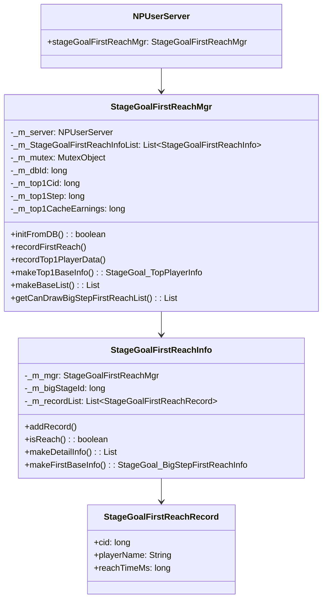
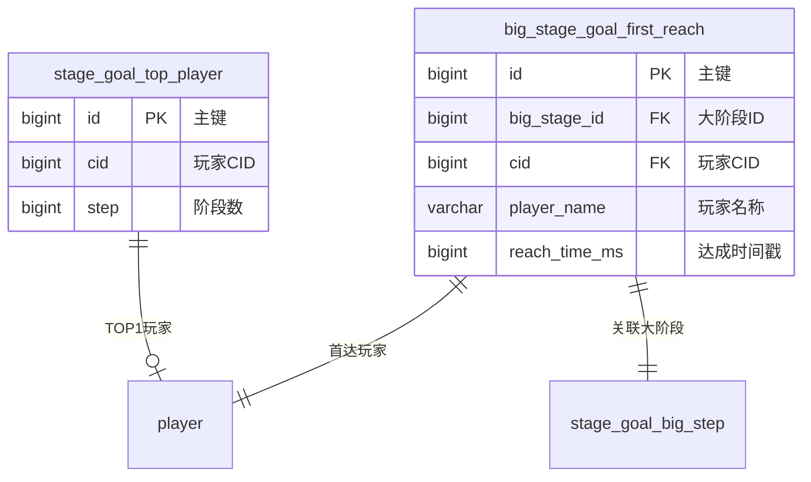
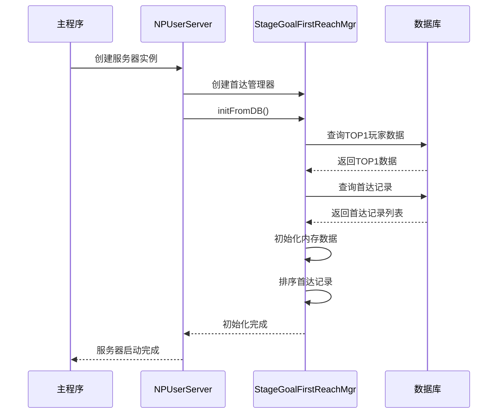

# 阶段目标服务端开发文档

## 一、模块架构

### 1.1 服务端模块架构



### 1.2 全局管理器说明

阶段目标模块使用**全局管理器**管理全服首达数据：

- **单例管理**: 每个服务器一个实例，全服共享
- **线程安全**: 使用 MutexObject 保证并发安全
- **持久化**: 首达记录和TOP1玩家数据存入数据库

---

## 二、核心数据结构

### 2.1 StageGoalFirstReachMgr - 首达管理器

| 字段名 | 类型 | 说明 |
|--------|------|------|
| _m_server | NPUserServer | 服务器实例 |
| _m_StageGoalFirstReachInfoList | List\<StageGoalFirstReachInfo\> | 首达信息列表 |
| _m_mutex | MutexObject | 互斥锁 |
| _m_dbId | long | TOP1数据数据库ID |
| _m_top1Cid | long | TOP1玩家CID |
| _m_top1Step | long | TOP1玩家阶段 |
| _m_top1CacheEarnings | long | TOP1玩家缓存收益 |

### 2.2 StageGoalFirstReachInfo - 大阶段首达信息

| 字段名 | 类型 | 说明 |
|--------|------|------|
| _m_mgr | StageGoalFirstReachMgr | 管理器引用 |
| _m_bigStageId | long | 大阶段ID |
| _m_recordList | List\<StageGoalFirstReachRecord\> | 首达记录列表 |

### 2.3 StageGoalFirstReachRecord - 首达记录

| 字段名 | 类型 | 说明 |
|--------|------|------|
| cid | long | 玩家CID |
| playerName | String | 玩家名称 |
| reachTimeMs | long | 达成时间戳(毫秒) |

---

## 三、数据库设计

### 3.1 数据表关系图



### 3.2 big_stage_goal_first_reach - 大阶段首达表

**表名**: `big_stage_goal_first_reach`

| 字段名 | 类型 | 约束 | 说明 |
|--------|------|------|------|
| id | BIGINT | PRIMARY KEY, AUTO_INCREMENT | 主键 |
| big_stage_id | BIGINT | NOT NULL, INDEX | 大阶段ID |
| cid | BIGINT | NOT NULL | 玩家CID |
| player_name | VARCHAR(50) | NOT NULL | 玩家名称 |
| reach_time_ms | BIGINT | NOT NULL | 达成时间戳(毫秒) |

**建表SQL**:
```sql
CREATE TABLE `big_stage_goal_first_reach` (
    `id` BIGINT NOT NULL AUTO_INCREMENT,
    `big_stage_id` BIGINT NOT NULL COMMENT '大阶段ID',
    `cid` BIGINT NOT NULL COMMENT '玩家CID',
    `player_name` VARCHAR(50) NOT NULL COMMENT '玩家名称',
    `reach_time_ms` BIGINT NOT NULL COMMENT '达成时间戳(毫秒)',
    PRIMARY KEY (`id`),
    INDEX `idx_big_stage_id` (`big_stage_id`),
    INDEX `idx_cid` (`cid`)
) ENGINE=InnoDB DEFAULT CHARSET=utf8mb4 COMMENT='大阶段首达记录表';
```

### 3.3 stage_goal_top_player - TOP1玩家表

**表名**: `stage_goal_top_player`

| 字段名 | 类型 | 约束 | 说明 |
|--------|------|------|------|
| id | BIGINT | PRIMARY KEY, AUTO_INCREMENT | 主键 |
| cid | BIGINT | NOT NULL | 玩家CID |
| step | BIGINT | NOT NULL | 阶段数 |

**建表SQL**:
```sql
CREATE TABLE `stage_goal_top_player` (
    `id` BIGINT NOT NULL AUTO_INCREMENT,
    `cid` BIGINT NOT NULL COMMENT '玩家CID',
    `step` BIGINT NOT NULL COMMENT '阶段数',
    PRIMARY KEY (`id`)
) ENGINE=InnoDB DEFAULT CHARSET=utf8mb4 COMMENT='阶段目标TOP1玩家表';
```

---

## 四、核心代码实现

### 4.1 首达管理器初始化

```java
/**
 * 从数据库初始化数据
 */
public boolean initFromDB()
{
    // 加载TOP1玩家数据
    List<StageGoalTopPlayerBO> topPlayerBoList = getServer().getBM().getBM(StageGoalTopPlayerBO.class).s_findAll();
    if (topPlayerBoList == null)
        return false;

    if (!topPlayerBoList.isEmpty())
    {
        StageGoalTopPlayerBO bo = topPlayerBoList.get(0);
        _m_dbId = bo.getId();
        _m_top1Cid = bo.getCid();
        _m_top1Step = bo.getStep();
        _m_top1CacheEarnings = 0;
    }

    // 加载首达记录
    List<BigStageGoalFirstReachBO> boList = getServer().getBM().getBM(BigStageGoalFirstReachBO.class).s_findAll();
    if (boList == null)
        return false;

    for (BigStageGoalFirstReachBO bo : boList)
    {
        StageGoalFirstReachInfo info = ensure(bo.getBigStageId());
        info.initAddRecord(bo);
    }

    // 排序首达记录
    for (StageGoalFirstReachInfo firstReachInfo : _m_StageGoalFirstReachInfoList)
    {
        firstReachInfo.sort();
    }

    return true;
}
```

### 4.2 记录首达

```java
/**
 * 记录达成大阶段目标的玩家数据
 */
public void recordFirstReach(long _cid, String _name, RefStageGoalBigStep _ref, long _reachTimeMs)
{
    StageGoalFirstReachInfo info = ensure(_ref.big_step);
    info.addRecord(_cid, _name, _ref, _reachTimeMs);
}
```

### 4.3 记录TOP1玩家数据

```java
/**
 * 记录TOP1玩家数据
 */
public void recordTop1PlayerData(long _cid, long _earnings, long _step)
{
    _lock();
    try
    {
        if (_m_dbId == 0)
        {
            // 首次记录，插入新数据
            StageGoalTopPlayerBO bo = new StageGoalTopPlayerBO();
            bo.setCid(_m_server.getBM(), _cid);
            bo.setStep(_m_server.getBM(), _step);
            bo.insert(_m_server.getBM());

            _m_dbId = bo.getId();
            _m_top1Cid = _cid;
            _m_top1Step = _step;
            _m_top1CacheEarnings = _earnings;
        }
        else
        {
            // 更新已有数据
            // 阶段更低则不更新
            if (_step < _m_top1Step)
                return;

            // 阶段相同但收益不更高则不更新
            if (_step == _m_top1Step && _earnings <= _m_top1CacheEarnings)
                return;

            _m_top1Cid = _cid;
            _m_top1Step = _step;
            _m_top1CacheEarnings = _earnings;

            // 更新数据库
            ALMySqlUpdateValue update = new ALMySqlUpdateValue();
            update.addValueObj("cid", _m_top1Cid);
            update.addValueObj("step", _m_top1Step);
            getServer().getBM().getBM(StageGoalTopPlayerBO.class).update("id", _m_dbId, update);
        }
    }
    finally
    {
        _unlock();
    }
}
```

### 4.4 构造首达详情信息

```java
/**
 * 构造大阶段首达详情信息
 */
public List<StageGoal_BigStepFirstReachInfo> makeDetailInfo(long _bigStepId)
{
    StageGoalFirstReachInfo firstReachInfo = lookup(_bigStepId);
    if (firstReachInfo == null)
        return null;

    return firstReachInfo.makeDetailInfo();
}
```

### 4.5 构造TOP1基础信息

```java
/**
 * 构造大阶段目标首达成TOP1玩家基础信息
 */
public StageGoal_TopPlayerInfo makeTop1BaseInfo()
{
    _lock();
    try
    {
        return new StageGoal_TopPlayerInfo(_m_top1Cid, _m_top1Step);
    }
    finally
    {
        _unlock();
    }
}
```

### 4.6 构造首达基础信息列表

```java
/**
 * 构造大阶段目标首达成基础信息列表
 */
public List<StageGoal_BigStepFirstReachInfo> makeBaseList()
{
    List<StageGoal_BigStepFirstReachInfo> list = new ArrayList<>();
    _lock();
    try
    {
        for (StageGoalFirstReachInfo info : _m_StageGoalFirstReachInfoList)
        {
            if (info == null)
                continue;

            StageGoal_BigStepFirstReachInfo proto = info.makeFirstBaseInfo();
            if (proto != null)
                list.add(proto);
        }
        return list;
    }
    finally
    {
        _unlock();
    }
}
```

### 4.7 获取可领取首达列表

```java
/**
 * 获取可以领取的首达列表
 */
public List<Long> getCanDrawBigStepFirstReachList()
{
    List<Long> list = new ArrayList<>();
    _lock();
    try
    {
        for (StageGoalFirstReachInfo info : _m_StageGoalFirstReachInfoList)
        {
            if (info == null)
                continue;

            if (info.isReach())
                list.add(info.getBigStageId());
        }
        return list;
    }
    finally
    {
        _unlock();
    }
}
```

### 4.8 清空所有记录

```java
/**
 * 清空所有记录
 * 清除内存中的所有首达记录和TOP1玩家数据，并从数据库中删除相关记录
 */
public void clearAllRecords()
{
    _lock();
    try
    {
        // 清空内存中的首达记录列表
        _m_StageGoalFirstReachInfoList.clear();

        // 重置TOP1玩家数据
        _m_dbId = 0;
        _m_top1Cid = 0;
        _m_top1Step = 0;
        _m_top1CacheEarnings = 0;

        // 清空数据库中的首达记录
        getServer().getBM().getBM(BigStageGoalFirstReachBO.class).delAll();

        // 清空数据库中的TOP1玩家记录
        getServer().getBM().getBM(StageGoalTopPlayerBO.class).delAll();
    }
    finally
    {
        _unlock();
    }
}
```

---

## 五、协议处理

### 5.1 初始化请求处理

```java
/**
 * 处理阶段目标初始化请求
 */
public void handleReqStageGoalInit(NPUser _user)
{
    // 获取玩家阶段目标数据
    PlayerStageGoalData data = _user.getStageGoalData();

    // 构造响应
    GS2GC_002_062_RetStageGoalInit ret = new GS2GC_002_062_RetStageGoalInit();
    ret.setCurStageGoal(data.makeStageGoalInfo());
    ret.setHadDrawBigStepList(data.getHadDrawBigStepList());
    ret.setHadDrawBigStepFirstReachList(data.getHadDrawFirstReachList());
    ret.setCanDrawBigStepFirstReachList(
        getServer().getStageGoalFirstReachMgr().getCanDrawBigStepFirstReachList()
    );

    _user.sendMsg(ret);
}
```

### 5.2 领取首达奖励处理

```java
/**
 * 处理领取首达奖励请求
 */
public void handleDrawFirstReachReward(NPUser _user, long _bigStepId)
{
    // 检查是否已领取
    if (_user.getStageGoalData().hasDrawnFirstReach(_bigStepId))
    {
        _user.sendError(360007, "首达奖励已领取");
        return;
    }

    // 检查是否有首达资格
    StageGoalFirstReachInfo info = getServer().getStageGoalFirstReachMgr().lookup(_bigStepId);
    if (info == null || !info.isReach())
    {
        _user.sendError(360008, "首达奖励未解锁");
        return;
    }

    // 检查是否为首达玩家
    StageGoalFirstReachRecord record = info.getFirstRecord();
    if (record.cid != _user.getCid())
    {
        _user.sendError(360008, "无首达资格");
        return;
    }

    // 获取首达奖励配置
    RefStageGoalBigStep ref = RefStageGoalBigStep.getMgr().get(_bigStepId);

    // 发放奖励
    _user.getItemMgr().giveItems(ref.first_reach_reward_item_list, "首达奖励");

    // 记录领取
    _user.getStageGoalData().markFirstReachDrawn(_bigStepId);

    // 发送响应
    GS2GC_007_015_RetDrawStageGoalFirstReachReward ret = new GS2GC_007_015_RetDrawStageGoalFirstReachReward();
    ret.setBigStepId(_bigStepId);
    _user.sendMsg(ret);

    // 推送领取结果
    GS2GC_007_078_OnStageGoalBigStepFirstReachRewardDraw push = new GS2GC_007_078_OnStageGoalBigStepFirstReachRewardDraw();
    push.setBigStep(_bigStepId);
    _user.sendMsg(push);
}
```

---

## 六、线程安全设计

### 6.1 锁机制

```java
// 加锁
public void _lock()
{
    _m_mutex.lock();
}

// 解锁
public void _unlock()
{
    _m_mutex.unlock();
}
```

### 6.2 线程安全访问示例

```java
/**
 * 查找大关卡目标首达成信息
 */
public StageGoalFirstReachInfo lookup(long _bigStageId)
{
    _lock();
    try
    {
        for (StageGoalFirstReachInfo info : _m_StageGoalFirstReachInfoList)
        {
            if (info.getBigStageId() == _bigStageId)
            {
                return info;
            }
        }
        return null;
    }
    finally
    {
        _unlock();
    }
}

/**
 * 确保大关卡目标首达成信息存在
 */
public StageGoalFirstReachInfo ensure(long _bigStageId)
{
    _lock();
    try
    {
        StageGoalFirstReachInfo info = lookup(_bigStageId);
        if (info == null)
        {
            info = new StageGoalFirstReachInfo(this, _bigStageId);
            _m_StageGoalFirstReachInfoList.add(info);
        }
        return info;
    }
    finally
    {
        _unlock();
    }
}
```

---

## 七、服务器启动流程



---

## 八、配置加载

### 8.1 服务端配置引用

```java
// 获取大阶段配置
RefStageGoalBigStep ref = RefStageGoalBigStep.getMgr().get(bigStepId);

// 获取小阶段配置
RefStageGoal stageRef = RefStageGoal.getMgr().get(stepId);

// 获取任务配置
RefStageGoalTask taskRef = RefStageGoalTask.getMgr().get(taskId);
```

### 8.2 服务端配置结构

```java
// 大阶段配置
public class RefStageGoalBigStep {
    public int big_step;                    // 大阶段ID
    public int begins_from_small_step;      // 起始小阶段
    public List<RewardItem> first_reach_reward_item_list; // 首达奖励
    public List<RewardItem> reward_item_list;             // 阶段奖励
}

// 小阶段配置
public class RefStageGoal {
    public long step;                       // 小阶段ID
    public List<Long> task_list;            // 任务列表
    public List<RewardItem> reward_item_list; // 阶段奖励
}

// 任务配置
public class RefStageGoalTask {
    public long id;                         // 任务ID
    public long process_count;              // 目标进度
    public List<RewardItem> reward_item_list; // 任务奖励
}
```

---

*文档更新时间: 2026-04-11*
