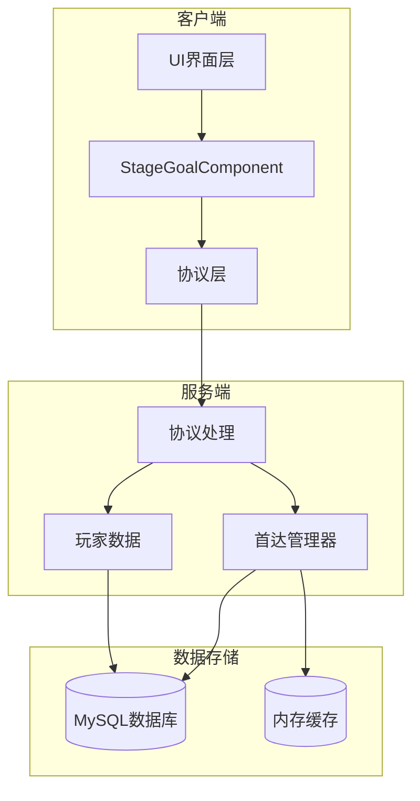
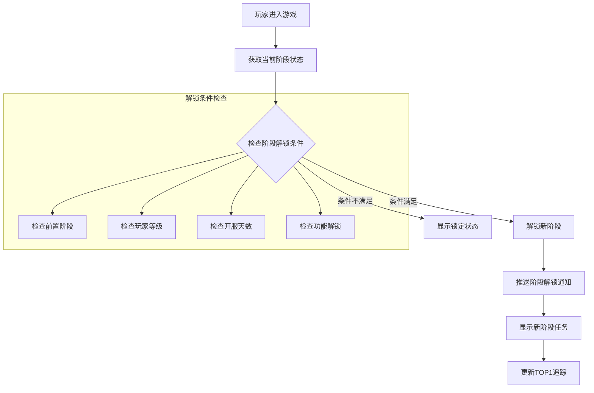
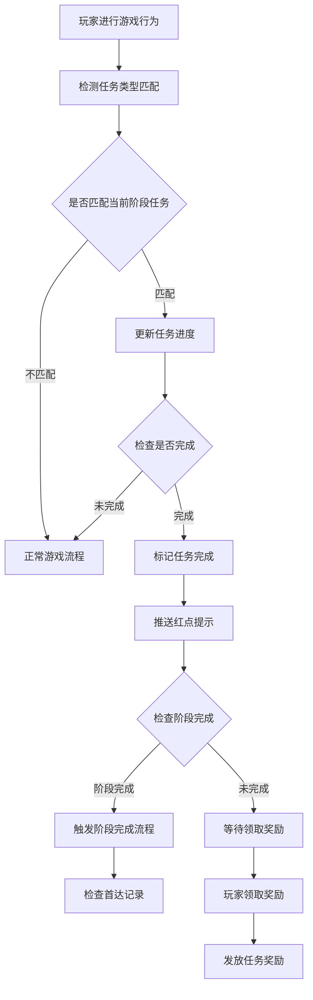
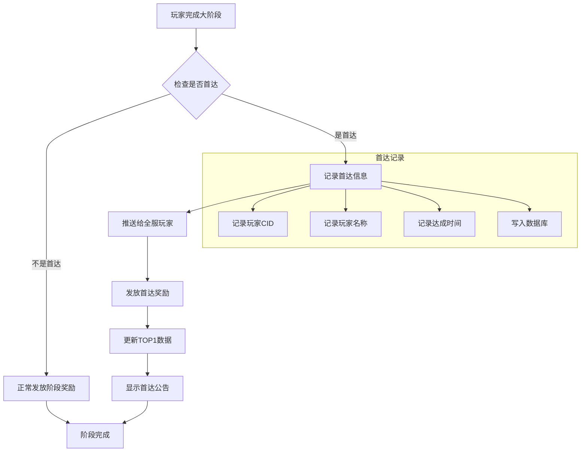
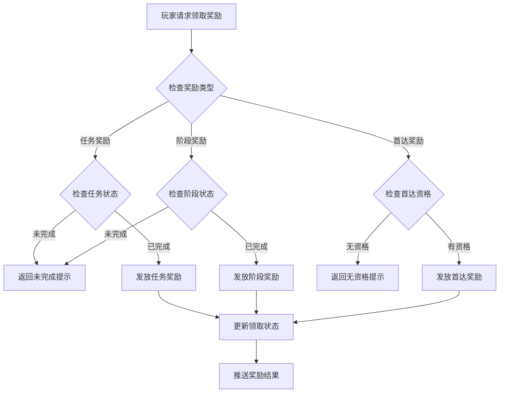
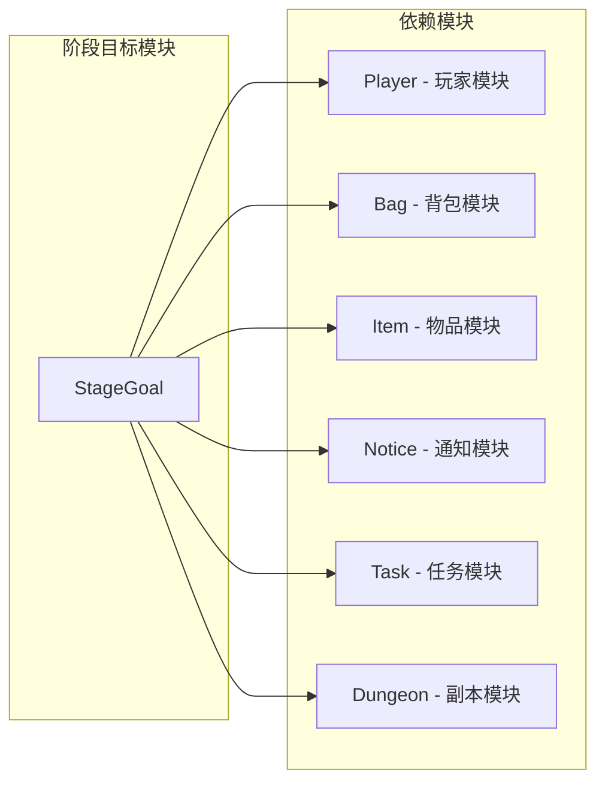

# 阶段目标模块完整说明

## 一、模块概述

### 1.1 业务背景

阶段目标模块是 K2C 游戏的核心成长引导系统，通过将玩家的长期成长目标分解为多个阶段和子任务，引导玩家有节奏地体验游戏内容。模块支持大阶段目标、子任务追踪、首达奖励等机制，为玩家提供清晰的成长路径和竞争激励。

### 1.2 系统架构图



### 1.3 目标用户

| 用户类型 | 需求描述 |
|----------|----------|
| **所有游戏玩家** | 通过阶段目标规划成长路径，了解游戏进程 |
| **竞争型玩家** | 争夺首达奖励和TOP1排名，展示实力 |
| **运营人员** | 配置成长目标和解锁节奏，控制游戏进度 |

### 1.4 核心价值

| 价值点 | 说明 |
|--------|------|
| **成长引导** | 为玩家提供清晰的成长目标和路径 |
| **节奏控制** | 控制玩家成长速度，延长游戏寿命 |
| **竞争激励** | 首达奖励激发玩家竞争欲望 |
| **成就展示** | 阶段完成展示玩家成就 |

---

## 二、功能清单

### 2.1 大阶段功能

| 功能名称 | 功能描述 | 用户价值 | 触发条件 |
|---------|---------|---------|---------|
| 阶段展示 | 显示大阶段列表和进度 | 了解成长路线 | 打开界面 |
| 阶段解锁 | 完成前置阶段解锁后续 | 循序渐进成长 | 完成前置小阶段 |
| 阶段奖励 | 完成阶段获得奖励 | 获得丰厚回报 | 完成最后小阶段 |
| 首达奖励 | 全服首个达成者额外奖励 | 展示顶尖实力 | 首个完成大阶段 |

### 2.2 小阶段功能

| 功能名称 | 功能描述 | 用户价值 | 触发条件 |
|---------|---------|---------|---------|
| 阶段展示 | 显示当前阶段任务 | 了解具体目标 | 打开界面 |
| 进度追踪 | 实时更新任务进度 | 追踪完成情况 | 完成游戏行为 |
| 阶段奖励 | 完成阶段获得奖励 | 获得即时反馈 | 完成所有任务 |

### 2.3 子任务功能

| 功能名称 | 功能描述 | 用户价值 | 触发条件 |
|---------|---------|---------|---------|
| 任务列表 | 显示当前阶段所有任务 | 了解具体目标 | 打开界面 |
| 进度追踪 | 实时更新任务进度 | 追踪完成情况 | 完成游戏行为 |
| 任务奖励 | 完成任务获得奖励 | 获得即时反馈 | 达成任务目标 |
| 任务跳转 | 快速跳转到相关功能 | 提升操作效率 | 点击跳转按钮 |

### 2.4 首达系统功能

| 功能名称 | 功能描述 | 用户价值 | 触发条件 |
|---------|---------|---------|---------|
| 首达记录 | 记录全服首个达成的玩家 | 展示荣誉 | 首个完成大阶段 |
| 首达奖励 | 首达玩家获得额外奖励 | 顶级玩家激励 | 首达玩家领取 |
| 首达展示 | 显示首达玩家信息 | 荣誉展示 | 打开首达界面 |
| TOP1追踪 | 追踪全服领先玩家 | 竞争参考 | 玩家阶段变化 |

### 2.5 红点提示功能

| 功能名称 | 功能描述 | 用户价值 | 触发条件 |
|---------|---------|---------|---------|
| 阶段完成 | 阶段完成时红点提示 | 及时领取奖励 | 任务完成 |
| 任务完成 | 任务完成时红点提示 | 不遗漏奖励 | 任务完成 |
| 首达解锁 | 首达奖励可领取提示 | 把握机会 | 首达产生 |

---

## 三、业务流程详解

### 3.1 阶段解锁流程



**详细步骤说明**：

1. **条件检查**
   - 检查前置阶段是否完成
   - 检查玩家等级是否满足
   - 检查开服天数是否满足
   - 检查功能解锁条件

2. **阶段解锁**
   - 初始化阶段数据
   - 加载子任务列表
   - 推送解锁通知

3. **数据同步**
   - 更新客户端阶段状态
   - 刷新红点显示
   - 同步TOP1信息

### 3.2 任务完成流程



**详细步骤说明**：

1. **进度更新**
   - 监听玩家游戏行为
   - 匹配任务类型
   - 累加任务进度

2. **完成判定**
   - 检查进度是否达标
   - 标记完成状态
   - 推送通知

3. **阶段检查**
   - 检查所有子任务完成状态
   - 判断阶段是否完成
   - 触发后续流程

### 3.3 首达奖励流程



**详细步骤说明**：

1. **首达检查**
   - 查询阶段首达记录
   - 判断是否为首个达成

2. **记录保存**
   - 保存首达玩家信息
   - 记录达成时间
   - 写入数据库

3. **奖励发放**
   - 发放首达专属奖励
   - 推送全服公告
   - 更新排行榜

### 3.4 奖励领取流程



---

## 四、关键规则

### 4.1 阶段规则

| 规则名称 | 规则说明 |
|----------|----------|
| **阶段解锁** | 前置阶段完成 + 玩家等级达标 + 功能解锁条件满足 |
| **阶段完成** | 完成所有子任务 + 完成率100% |
| **阶段奖励** | 每个阶段只能领取一次，奖励需手动领取 |
| **大阶段奖励** | 需完成最后一个小阶段才能领取大阶段奖励 |

### 4.2 任务规则

| 规则名称 | 规则说明 |
|----------|----------|
| **任务类型** | 等级任务、副本任务、收集任务、强化任务等 |
| **进度计算** | 累加型（累加）、替换型（取最大值）、单次型（只计算一次） |
| **任务奖励** | 完成即可领取，与阶段奖励独立 |
| **任务解锁** | 部分任务需要满足解锁条件才能显示和计数 |

### 4.3 首达规则

| 规则名称 | 规则说明 |
|----------|----------|
| **首达判定** | 全服首个完成该阶段的玩家，以服务器时间为准，精确到毫秒级 |
| **首达奖励** | 每个阶段仅一个首达，奖励专属且丰厚 |
| **TOP1规则** | 追踪当前进度最前的玩家，实时更新 |

---

## 五、用户故事

### 5.1 普通玩家故事

> **场景描述**：作为一名普通玩家，我每天都会查看阶段目标界面。当前我正在进行第二阶段，有5个子任务需要完成。我刚完成了"英雄强化10次"的任务，领取了强化材料奖励。界面显示我还差2个任务就能完成本阶段，届时可以领取阶段大奖。
>
> **关键操作**：
> - 查看阶段目标界面
> - 完成游戏行为
> - 领取任务奖励
> - 观察阶段进度

### 5.2 竞争型玩家故事

> **场景描述**：作为一名竞争型玩家，我密切关注着首达奖励。今天我率先完成了第三阶段，系统公告我获得了该阶段的首达奖励！除了常规的阶段奖励，我还获得了专属称号和稀有英雄碎片。看到自己的名字出现在首达榜单上，我感到非常自豪。
>
> **关键操作**：
> - 快速完成阶段任务
> - 争夺首达资格
> - 领取首达奖励
> - 展示首达成就

### 5.3 回流玩家故事

> **场景描述**：作为一名回流玩家，我发现阶段目标系统帮助我快速了解当前游戏进度。通过查看TOP1玩家信息，我了解到领先玩家已经完成了第五阶段。我追赶快赶上，完成阶段任务，领取奖励，逐步追回进度。
>
> **关键操作**：
> - 查看阶段进度
> - 了解TOP1玩家进度
> - 完成阶段任务
> - 领取阶段奖励

---

## 六、配置示例

### 6.1 大阶段配置示例

```json
{
  "big_step": 2,
  "begins_from_small_step": 6,
  "end_small_step": 10,
  "title": "stage_goal_big_step_2_title",
  "desc": "stage_goal_big_step_2_desc",
  "icon": { "atlas": "ui_stage_goal", "sprite": "big_step_2" },
  "peak_banner": { "atlas": "ui_stage_goal", "sprite": "peak_banner_2" },
  "dialogue_id": 2002,
  "first_reach_reward_item_list": [
    { "itemId": 10001, "count": 1000, "type": 1 },
    { "itemId": 20001, "count": 1, "type": 3 }
  ],
  "reward_item_list": [
    { "itemId": 10001, "count": 500, "type": 1 },
    { "itemId": 30001, "count": 20, "type": 2 }
  ],
  "building_index": { "scene": "main", "prefab": "building_stage_2" },
  "done_need_draw_all_step_reward": false
}
```

### 6.2 小阶段配置示例

```json
{
  "step": 6,
  "next_step_need_server_start_day": 3,
  "next_step_simple_unlock_id": 100,
  "task_list": [601, 602, 603, 604, 605],
  "icon": { "atlas": "ui_stage_goal", "sprite": "step_6" },
  "title": "stage_goal_step_6_title",
  "dialogue_id": 1006,
  "reward_item_list": [
    { "itemId": 10001, "count": 100, "type": 1 }
  ],
  "task_ui_res_id": 10006,
  "task_bg": { "atlas": "ui_stage_goal", "sprite": "bg_step_6" }
}
```

### 6.3 子任务配置示例

```json
{
  "id": 601,
  "simple_unlock_id": 0,
  "process_cur_count": {
    "type": "ENPPlayerVariableType",
    "value": "PLAYER_LEVEL"
  },
  "process_count": 30,
  "add_msg_type_list": ["ON_PLAYER_LEVEL_UP", "ON_NODE_CHG"],
  "process_num_format": "INT",
  "icon": { "atlas": "ui_stage_goal", "sprite": "task_level" },
  "title": "stage_goal_task_level_title",
  "title_args": ["30"],
  "go_to": {
    "type": "OPEN_PANEL",
    "param": "hero_panel"
  },
  "reward_item_list": [
    { "itemId": 10001, "count": 50, "type": 1 },
    { "itemId": 40001, "count": 10, "type": 5 }
  ],
  "desc": "stage_goal_task_level_desc",
  "desc_args": ["30"]
}
```

---

## 七、数据统计

### 7.1 阶段完成率示例

```
阶段配置：
大阶段ID：2
阶段名称：崭露头角
子任务：5个

玩家状态：
阶段状态：进行中
完成进度：3/5 (60%)
已完成任务：任务1、任务2、任务3
进行中任务：任务4 (进度 18/20)、任务5 (进度 5/10)
```

### 7.2 首达记录示例

```
首达配置：
阶段ID：3
首达奖励：
  - 专属称号"先锋勇士"
  - 钻石 × 1000
  - SSR英雄 × 1

达成记录：
阶段ID：3
首达玩家：剑舞春秋（CID: 20001）
达成时间：2026-04-07 15:30:25.123
```

### 7.3 TOP1玩家示例

```
TOP1玩家信息：
玩家CID：20001
玩家名称：剑舞春秋
当前阶段：小阶段15 (大阶段3)
更新时间：2026-04-07 15:30:25
```

---

## 八、模块关联

### 8.1 模块依赖图



### 8.2 依赖关系说明

| 依赖模块 | 依赖内容 | 使用场景 |
|----------|----------|----------|
| Player模块 | 玩家基础数据、等级信息 | 解锁条件判断 |
| Bag模块 | 背包空间检查、物品发放 | 奖励发放 |
| Item模块 | 物品配置、物品创建 | 奖励物品创建 |
| Notice模块 | 红点提示、推送通知 | 状态变更通知 |
| Task模块 | 任务进度触发 | 任务类型复用 |
| Dungeon模块 | 副本通关记录 | 副本任务进度 |

---

*文档更新时间: 2026-04-11*
