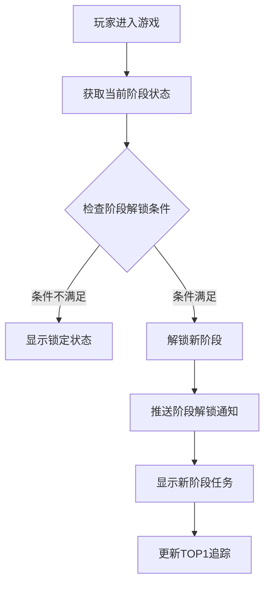
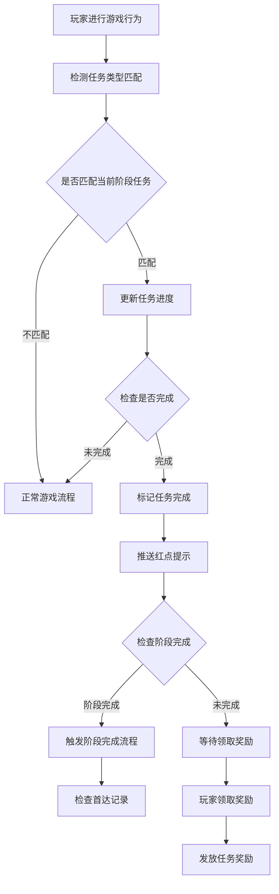
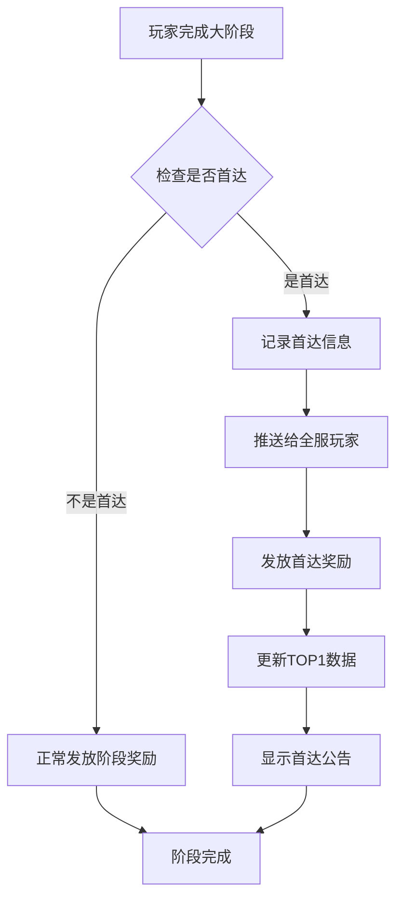
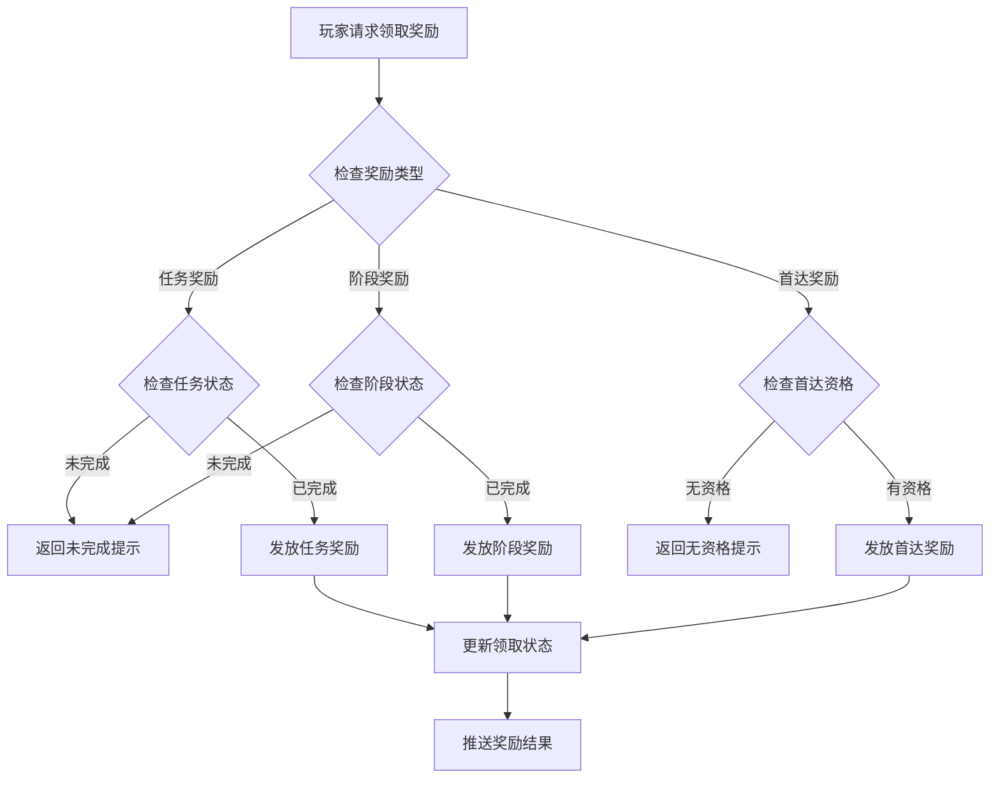

# 阶段目标模块完整说明

## 一、模块概述

### 1.1 业务背景

阶段目标模块是 K2C 游戏的核心成长引导系统，通过将玩家的长期成长目标分解为多个阶段和子任务，引导玩家有节奏地体验游戏内容。模块支持大阶段目标、子任务追踪、首达奖励等机制，为玩家提供清晰的成长路径和竞争激励。

### 1.2 目标用户

- **所有游戏玩家**：通过阶段目标规划成长路径
- **竞争型玩家**：争夺首达奖励和TOP1排名
- **运营人员**：配置成长目标和解锁节奏

### 1.3 核心价值

1. **成长引导**：为玩家提供清晰的成长目标和路径
2. **节奏控制**：控制玩家成长速度，延长游戏寿命
3. **竞争激励**：首达奖励激发玩家竞争欲望
4. **成就展示**：阶段完成展示玩家成就

---

## 二、功能清单

### 2.1 大阶段功能

| 功能名称 | 功能描述 | 用户价值 |
|---------|---------|---------|
| 阶段展示 | 显示大阶段列表和进度 | 了解成长路线 |
| 阶段解锁 | 完成前置阶段解锁后续 | 循序渐进成长 |
| 阶段奖励 | 完成阶段获得奖励 | 获得丰厚回报 |
| 首达奖励 | 全服首个达成者额外奖励 | 展示顶尖实力 |

### 2.2 子任务功能

| 功能名称 | 功能描述 | 用户价值 |
|---------|---------|---------|
| 任务列表 | 显示当前阶段所有任务 | 了解具体目标 |
| 进度追踪 | 实时更新任务进度 | 追踪完成情况 |
| 任务奖励 | 完成任务获得奖励 | 获得即时反馈 |
| 任务跳转 | 快速跳转到相关功能 | 提升操作效率 |

### 2.3 首达系统功能

| 功能名称 | 功能描述 | 用户价值 |
|---------|---------|---------|
| 首达记录 | 记录全服首个达成的玩家 | 展示荣誉 |
| 首达奖励 | 首达玩家获得额外奖励 | 顶级玩家激励 |
| 首达展示 | 显示首达玩家信息 | 荣誉展示 |
| TOP1追踪 | 追踪全服领先玩家 | 竞争参考 |

### 2.4 红点提示功能

| 功能名称 | 功能描述 | 用户价值 |
|---------|---------|---------|
| 阶段完成 | 阶段完成时红点提示 | 及时领取奖励 |
| 任务完成 | 任务完成时红点提示 | 不遗漏奖励 |
| 首达解锁 | 首达奖励可领取提示 | 把握机会 |

---

## 三、业务流程详解

### 3.1 阶段解锁流程



**详细步骤说明**：

1. **条件检查**
   - 检查前置阶段是否完成
   - 检查玩家等级是否满足
   - 检查功能解锁条件

2. **阶段解锁**
   - 初始化阶段数据
   - 加载子任务列表
   - 推送解锁通知

3. **数据同步**
   - 更新客户端阶段状态
   - 刷新红点显示
   - 同步TOP1信息

### 3.2 任务完成流程



**详细步骤说明**：

1. **进度更新**
   - 监听玩家游戏行为
   - 匹配任务类型
   - 累加任务进度

2. **完成判定**
   - 检查进度是否达标
   - 标记完成状态
   - 推送通知

3. **阶段检查**
   - 检查所有子任务完成状态
   - 判断阶段是否完成
   - 触发后续流程

### 3.3 首达奖励流程



**详细步骤说明**：

1. **首达检查**
   - 查询阶段首达记录
   - 判断是否为首个达成

2. **记录保存**
   - 保存首达玩家信息
   - 记录达成时间
   - 写入数据库

3. **奖励发放**
   - 发放首达专属奖励
   - 推送全服公告
   - 更新排行榜

### 3.4 奖励领取流程



---

## 四、关键规则

### 4.1 阶段规则

1. **阶段解锁**
   - 前置阶段完成
   - 玩家等级达标
   - 功能解锁条件满足

2. **阶段完成**
   - 完成所有子任务
   - 完成率100%
   - 可领取阶段奖励

3. **阶段奖励**
   - 每个阶段只能领取一次
   - 奖励需手动领取
   - 可补领过期奖励

### 4.2 任务规则

1. **任务类型**
   - 等级任务：达到指定等级
   - 副本任务：通关指定副本
   - 收集任务：收集指定物品
   - 强化任务：强化指定次数

2. **进度计算**
   - 累加型：进度累加计算
   - 替换型：取最大值
   - 单次型：只计算一次

3. **任务奖励**
   - 完成即可领取
   - 与阶段奖励独立
   - 可跨阶段领取

### 4.3 首达规则

1. **首达判定**
   - 全服首个完成该阶段的玩家
   - 以服务器时间为准
   - 精确到毫秒级

2. **首达奖励**
   - 每个阶段仅一个首达
   - 奖励专属且丰厚
   - 与阶段奖励独立发放

3. **TOP1规则**
   - 追踪当前进度最前的玩家
   - 实时更新
   - 显示玩家信息和进度

---

## 五、用户故事

### 5.1 普通玩家故事

> 作为一名普通玩家，我每天都会查看阶段目标界面。当前我正在进行第二阶段，有5个子任务需要完成。我刚完成了"英雄强化10次"的任务，领取了强化材料奖励。界面显示我还差2个任务就能完成本阶段，届时可以领取阶段大奖。

### 5.2 竞争型玩家故事

> 作为一名竞争型玩家，我密切关注着首达奖励。今天我率先完成了第三阶段，系统公告我获得了该阶段的首达奖励！除了常规的阶段奖励，我还获得了专属称号和稀有英雄碎片。看到自己的名字出现在首达榜单上，我感到非常自豪。

### 5.3 回流玩家故事

> 作为一名回流玩家，我发现阶段目标系统帮助我快速了解当前游戏进度。通过查看TOP1玩家信息，我了解到领先玩家已经完成了第五阶段。我追赶快赶上，完成阶段任务，领取奖励，逐步追回进度。

---

## 六、示例

### 6.1 大阶段示例

**阶段配置**：
```
大阶段ID：2
阶段名称：崭露头角
阶段奖励：
  - 钻石 × 500
  - 英雄碎片 × 20
  - 高级装备箱 × 3
首达奖励：
  - 专属称号"先锋勇士"
  - 钻石 × 1000
解锁条件：完成第1阶段
子任务：
  - 任务1：等级达到30级
  - 任务2：通关精英副本第5章
  - 任务3：英雄强化20次
  - 任务4：装备精炼10次
  - 任务5：收集3件蓝色装备
```

**玩家状态**：
```
阶段状态：进行中
完成进度：3/5
已领取任务奖励：任务1、任务2、任务3
首达状态：已被其他玩家获得
```

### 6.2 任务完成示例

**任务配置**：
```
任务ID：201
任务名称：等级达到30级
任务类型：等级
目标值：30
奖励：
  - 银两 × 10000
  - 经验药水 × 20
```

**初始状态**：
```
玩家等级：28
进度：28/30
状态：进行中
```

**完成操作**：玩家升级到30级

**完成结果**：
```
进度：30/30
状态：已完成
可领取奖励：银两 × 10000, 经验药水 × 20
红点提示：显示
```

### 6.3 首达奖励示例

**首达配置**：
```
阶段ID：3
首达奖励：
  - 专属称号"先锋勇士"
  - 钻石 × 1000
  - SSR英雄 × 1
首达上限：1人
```

**达成操作**：玩家"剑舞春秋"首个完成第3阶段

**首达记录**：
```
阶段ID：3
首达玩家：剑舞春秋（CID: 20001）
达成时间：2026-04-07 15:30:25.123
首达奖励已发放：是
```

**首达展示**：
```
第3阶段首达者：剑舞春秋
达成时间：2026-04-07 15:30:25
获得奖励：专属称号"先锋勇士"、钻石 × 1000、SSR英雄"暗影刺客"
```

---

*文档生成时间: 2026-04-07*
