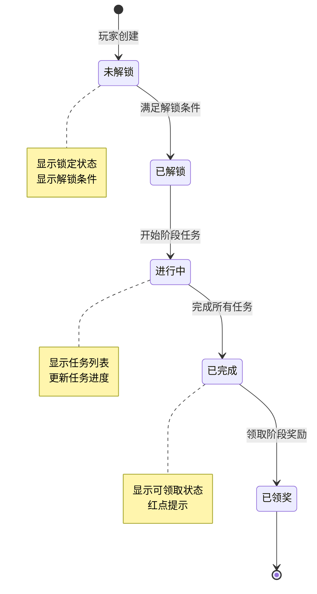
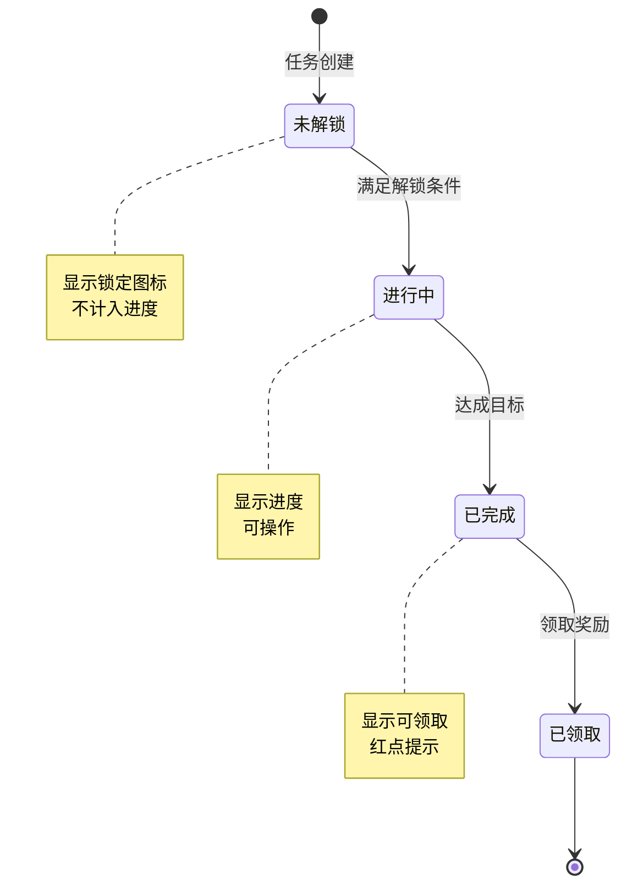
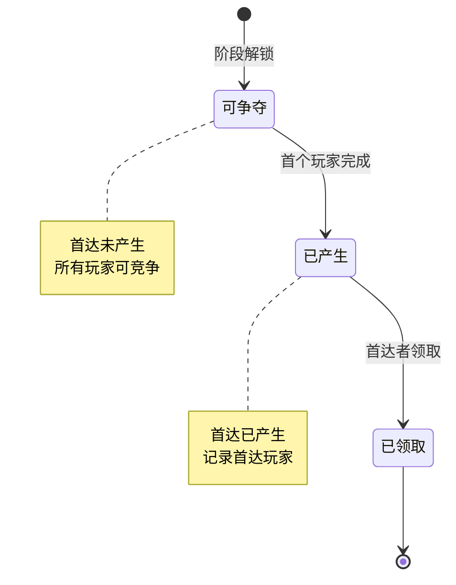
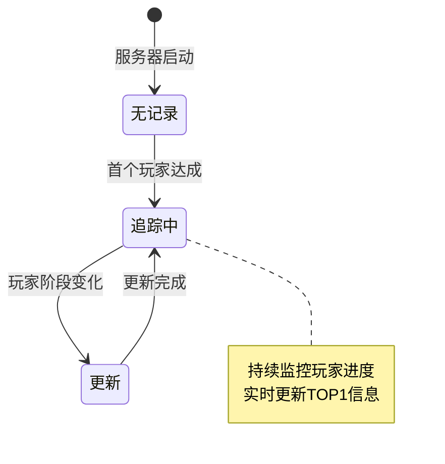
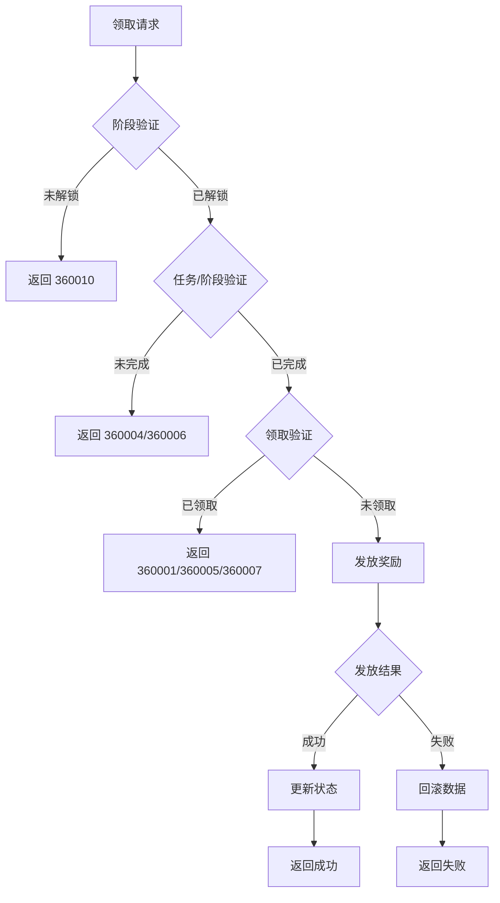
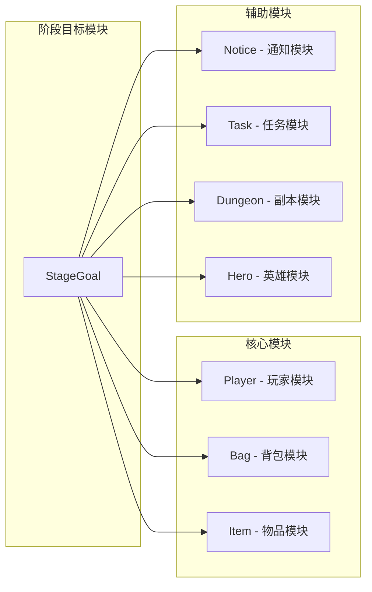

# 阶段目标模块实现细节

## 一、计算公式

### 1.1 阶段进度计算公式

```
阶段完成率 = 已完成任务数 / 总任务数 × 100%
```

**示例计算**：
```
已完成任务：4个
总任务数：5个

阶段完成率 = 4 / 5 × 100% = 80%
```

### 1.2 任务进度计算公式

```
任务进度百分比 = min(当前值 / 目标值 × 100%, 100%)
```

**示例计算**：
```
当前值：强化18次
目标值：强化20次

任务进度百分比 = min(18 / 20 × 100%, 100%) = 90%
```

### 1.3 大阶段进度计算公式

```
大阶段进度 = 小阶段进度 + 子任务进度 / 小阶段总数

其中:
- 小阶段进度 = (当前小阶段ID - 起始小阶段ID) / 小阶段总数
- 子任务进度 = 已完成任务数 / 总任务数
```

**代码实现**：
```csharp
public float getStageGoalBigProgress()
{
    if (null == _m_bigStepRefObj)
        return 0;

    float smallStepCount = _m_bigStepRefObj.end_small_step - _m_bigStepRefObj.begins_from_small_step + 1;
    float smallStepProcess = (_m_curStageStepId - _m_bigStepRefObj.begins_from_small_step) / smallStepCount;
    float subTaskProcess = getSubStageGoalCompleteCount() / (float)(getSubStageGoalAvailableTaskCount());

    return (float)Math.Round(smallStepProcess + (smallStepCount > 0 ? subTaskProcess / smallStepCount : 0), 2);
}
```

### 1.4 TOP1玩家判定公式

```
TOP1 = 当前阶段数最大的玩家
若阶段数相同，则比较玩家收益（赚速）
```

**示例计算**：
```
玩家A：阶段5，收益 10000
玩家B：阶段5，收益 15000
玩家C：阶段4

TOP1 = 玩家B（同阶段，收益更高）
```

### 1.5 首达奖励判定公式

```
首达资格 = 当前阶段无首达记录 AND 玩家完成阶段
```

---

## 二、状态机定义

### 2.1 大阶段状态机



### 2.2 子任务状态机



### 2.3 首达奖励状态机



### 2.4 TOP1追踪状态机



### 2.5 任务项状态枚举

```csharp
public enum EStageGoalTaskItemState
{
    /// <summary>
    /// 未解锁
    /// </summary>
    UNLOCK = 0,

    /// <summary>
    /// 未完成，不可领取
    /// </summary>
    CAN_NOT_GET = 1,

    /// <summary>
    /// 已完成，可领取
    /// </summary>
    CAN_GET = 2,

    /// <summary>
    /// 已领取
    /// </summary>
    HAS_GET = 3
}
```

---

## 三、数据约束

### 3.1 大阶段数据约束

| 字段名 | 数据类型 | 取值范围 | 必填 | 说明 |
|--------|----------|----------|------|------|
| id | bigint | > 0 | 是 | 主键 |
| cid | bigint | > 0 | 是 | 玩家CID |
| big_step_id | bigint | > 0 | 是 | 大阶段ID |
| status | int | 0-3 | 是 | 状态：0未解锁，1进行中，2已完成，3已领奖 |
| complete_time | datetime | - | 否 | 完成时间 |
| reward_time | datetime | - | 否 | 领奖时间 |

### 3.2 子任务数据约束

| 字段名 | 数据类型 | 取值范围 | 必填 | 说明 |
|--------|----------|----------|------|------|
| id | bigint | > 0 | 是 | 主键 |
| cid | bigint | > 0 | 是 | 玩家CID |
| task_id | bigint | > 0 | 是 | 任务ID |
| progress | int | >= 0 | 是 | 当前进度 |
| target_value | int | > 0 | 是 | 目标值 |
| status | int | 0-2 | 是 | 状态：0进行中，1已完成，2已领取 |

### 3.3 首达记录数据约束

| 字段名 | 数据类型 | 取值范围 | 必填 | 说明 |
|--------|----------|----------|------|------|
| id | bigint | > 0 | 是 | 主键 |
| big_stage_id | bigint | > 0 | 是 | 大阶段ID |
| cid | bigint | > 0 | 是 | 玩家CID |
| player_name | varchar | 2-50字符 | 是 | 玩家名称 |
| reach_time_ms | bigint | > 0 | 是 | 达成时间戳(毫秒) |

### 3.4 TOP1数据约束

| 字段名 | 数据类型 | 取值范围 | 必填 | 说明 |
|--------|----------|----------|------|------|
| id | bigint | > 0 | 是 | 主键 |
| cid | bigint | > 0 | 是 | 玩家CID |
| step | bigint | > 0 | 是 | 阶段数 |
| update_time | datetime | - | 是 | 更新时间 |

---

## 四、错误处理策略

### 4.1 阶段目标模块错误码

| 错误码 | 错误信息 | 处理策略 | 用户提示 |
|--------|----------|----------|----------|
| 360001 | 阶段奖励已领取 | 检查领取记录 | "阶段奖励已领取" |
| 360002 | 任务不存在 | 检查任务ID | "任务不存在" |
| 360003 | 任务已完成 | 正常状态 | "任务已完成" |
| 360004 | 任务未完成 | 检查任务进度 | "任务尚未完成" |
| 360005 | 大阶段奖励已领取 | 检查领取记录 | "大阶段奖励已领取" |
| 360006 | 阶段未完成 | 检查阶段状态 | "阶段尚未完成" |
| 360007 | 首达奖励已领取 | 检查首达领取记录 | "首达奖励已被领取" |
| 360008 | 首达奖励未解锁 | 检查首达记录 | "首达奖励未解锁" |
| 360009 | 开服天数不足 | 检查开服天数 | "开服天数不足以解锁" |
| 360010 | 解锁条件不满足 | 检查解锁条件 | "解锁条件不满足" |

### 4.2 奖励领取错误处理流程



### 4.3 异常处理策略

| 异常场景 | 处理策略 | 数据处理 |
|----------|----------|----------|
| 首达并发竞争 | 使用分布式锁保证唯一 | 只记录第一个 |
| 奖励发放失败 | 事务回滚 | 恢复原始状态 |
| 配置数据缺失 | 使用默认值，记录日志 | 继续执行 |
| 进度更新异常 | 忽略本次更新 | 不影响其他任务 |
| 网络超时 | 重试机制 | 幂等处理 |

---

## 五、关键代码示例

### 5.1 阶段初始化伪代码

```csharp
public Result InitStageGoal(long playerId)
{
    // 1. 获取所有大阶段配置
    List<RefStageGoalBigStep> bigSteps = configService.GetAllBigSteps();

    List<StageGoal_BigStepInfo> bigStepList = new List<StageGoal_BigStepInfo>();
    List<StageGoal_TaskInfo> taskList = new List<StageGoal_TaskInfo>();
    List<long> firstReachRewardList = new List<long>();

    foreach (var bigStep in bigSteps)
    {
        // 2. 获取玩家阶段数据
        PlayerBigStep playerStep = stageGoalDao.GetPlayerBigStep(playerId, bigStep.big_step);

        if (playerStep == null)
        {
            // 初始化阶段数据
            playerStep = new PlayerBigStep
            {
                cid = playerId,
                big_step_id = bigStep.big_step,
                status = CheckUnlockCondition(playerId, bigStep) ? 1 : 0
            };
            stageGoalDao.InsertPlayerBigStep(playerStep);
        }

        // 3. 构建阶段信息
        bigStepList.Add(new StageGoal_BigStepInfo
        {
            bigStepId = bigStep.big_step,
            status = playerStep.status,
            progress = CalculateProgress(playerId, bigStep)
        });

        // 4. 获取任务列表
        List<RefStageGoalTask> tasks = configService.GetTasksByBigStep(bigStep.big_step);
        foreach (var task in tasks)
        {
            PlayerStageTask playerTask = stageGoalDao.GetPlayerTask(playerId, task.id);
            if (playerTask == null)
            {
                playerTask = new PlayerStageTask
                {
                    cid = playerId,
                    task_id = task.id,
                    progress = 0,
                    target_value = task.target_value,
                    status = 0
                };
                stageGoalDao.InsertPlayerTask(playerTask);
            }

            taskList.Add(new StageGoal_TaskInfo
            {
                taskId = task.id,
                status = playerTask.status,
                progress = playerTask.progress,
                targetValue = playerTask.target_value
            });
        }
    }

    // 5. 获取已领取的首达奖励
    firstReachRewardList = stageGoalDao.GetFirstReachRewardList(playerId);

    return Result.Success(new StageGoalInitData
    {
        bigStepList = bigStepList,
        taskList = taskList,
        firstReachRewardList = firstReachRewardList
    });
}
```

### 5.2 任务进度更新伪代码

```csharp
public void UpdateTaskProgress(long playerId, int taskType, long value)
{
    // 1. 获取相关任务
    List<PlayerStageTask> tasks = stageGoalDao.GetTasksByType(playerId, taskType);

    foreach (var task in tasks)
    {
        // 2. 检查任务状态
        if (task.status != 0) continue;

        // 3. 获取任务配置
        RefStageGoalTask taskConfig = configService.GetTaskConfig(task.task_id);

        // 4. 更新进度
        switch (taskConfig.progressType)
        {
            case ProgressType.ADD:
                task.progress += (int)value;
                break;
            case ProgressType.SET:
                task.progress = Math.Max(task.progress, (int)value);
                break;
        }

        // 5. 检查完成
        if (task.progress >= task.target_value)
        {
            task.progress = task.target_value;
            task.status = 1; // 已完成

            // 推送任务完成
            PushTaskComplete(playerId, task);

            // 检查阶段完成
            CheckBigStepComplete(playerId, taskConfig.big_step_id);
        }

        stageGoalDao.UpdatePlayerTask(task);
    }
}
```

### 5.3 首达记录处理伪代码

```java
/**
 * 记录达成大阶段目标的玩家数据
 */
public void recordFirstReach(long _cid, String _name, RefStageGoalBigStep _ref, long _reachTimeMs)
{
    // 使用锁保证线程安全
    _lock();
    try
    {
        StageGoalFirstReachInfo info = ensure(_ref.big_step);

        // 检查是否已有首达记录
        if (info.isReach())
        {
            return; // 已有首达，不重复记录
        }

        // 创建首达记录
        BigStageGoalFirstReachBO bo = new BigStageGoalFirstReachBO();
        bo.setBigStageId(_ref.big_step);
        bo.setCid(_cid);
        bo.setPlayerName(_name);
        bo.setReachTimeMs(_reachTimeMs);
        bo.insert(_m_server.getBM());

        // 更新内存数据
        info.addRecord(_cid, _name, _ref, _reachTimeMs);

        // 推送首达通知给全服玩家
        pushFirstReachNotice(_cid, _name, _ref.big_step);
    }
    finally
    {
        _unlock();
    }
}
```

### 5.4 TOP1玩家追踪伪代码

```java
/**
 * 记录TOP1玩家数据
 */
public void recordTop1PlayerData(long _cid, long _earnings, long _step)
{
    _lock();
    try
    {
        if (_m_dbId == 0)
        {
            // 首次记录
            StageGoalTopPlayerBO bo = new StageGoalTopPlayerBO();
            bo.setCid(_m_server.getBM(), _cid);
            bo.setStep(_m_server.getBM(), _step);
            bo.insert(_m_server.getBM());

            _m_dbId = bo.getId();
            _m_top1Cid = _cid;
            _m_top1Step = _step;
            _m_top1CacheEarnings = _earnings;
        }
        else
        {
            // 更新TOP1
            if (_step < _m_top1Step) return;
            if (_step == _m_top1Step && _earnings <= _m_top1CacheEarnings) return;

            _m_top1Cid = _cid;
            _m_top1Step = _step;
            _m_top1CacheEarnings = _earnings;

            // 更新数据库
            ALMySqlUpdateValue update = new ALMySqlUpdateValue();
            update.addValueObj("cid", _m_top1Cid);
            update.addValueObj("step", _m_top1Step);
            getServer().getBM().getBM(StageGoalTopPlayerBO.class).update("id", _m_dbId, update);
        }
    }
    finally
    {
        _unlock();
    }
}
```

### 5.5 领取首达奖励伪代码

```java
/**
 * 领取首达奖励
 */
public Result DrawFirstReachReward(long playerId, long bigStepId)
{
    // 1. 检查首达记录
    BigStageGoalFirstReachBO record = firstReachDao.GetByBigStepId(bigStepId);
    if (record == null)
    {
        return Result.Error(360008, "首达奖励未产生");
    }

    // 2. 检查是否为本人
    if (record.cid != playerId)
    {
        return Result.Error(360008, "无首达资格");
    }

    // 3. 检查是否已领取
    if (firstReachDao.HasDrawnFirstReachReward(playerId, bigStepId))
    {
        return Result.Error(360007, "奖励已领取");
    }

    // 4. 获取首达奖励配置
    RefStageGoalBigStep config = configService.GetBigStepConfig(bigStepId);

    // 5. 发放奖励
    itemService.GiveItems(playerId, config.first_reach_reward_item_list);

    // 6. 记录领取
    firstReachDao.MarkFirstReachRewardDrawn(playerId, bigStepId);

    // 7. 推送领取结果
    PushFirstReachRewardDrawn(playerId, bigStepId, config.first_reach_reward_item_list);

    return Result.Success(config.first_reach_reward_item_list);
}
```

---

## 六、跨模块依赖

### 6.1 模块依赖关系



### 6.2 接口依赖

```csharp
// 玩家模块接口
interface IPlayerService
{
    int GetLevel(long playerId);
    string GetPlayerName(long playerId);
    long GetTotalEarnings(long playerId);
    int GetServerStartDays();
}

// 配置模块接口
interface IConfigService
{
    List<RefStageGoalBigStep> GetAllBigSteps();
    RefStageGoalBigStep GetBigStepConfig(long bigStepId);
    List<RefStageGoalTask> GetTasksByBigStep(long bigStepId);
    RefStageGoalTask GetTaskConfig(long taskId);
}

// 首达管理器接口
interface IFirstReachMgr
{
    bool HasFirstReach(long bigStepId);
    BigStageGoalFirstReachBO GetByBigStepId(long bigStepId);
    void Insert(BigStageGoalFirstReachBO record);
    List<Long> GetCanDrawBigStepFirstReachList();
}
```

### 6.3 事件依赖

| 事件类型 | 触发时机 | 处理逻辑 |
|----------|----------|----------|
| 玩家升级 | 等级提升 | 更新等级任务进度 |
| 副本通关 | 完成副本 | 更新副本任务进度 |
| 英雄强化 | 强化操作 | 更新强化任务进度 |
| 装备精炼 | 精炼操作 | 更新精炼任务进度 |
| 获得物品 | 物品入袋 | 更新收集任务进度 |

---

## 七、性能优化

### 7.1 缓存策略

| 数据类型 | 缓存位置 | 更新策略 |
|----------|----------|----------|
| 配置数据 | 客户端内存 | 版本更新时重载 |
| 玩家阶段数据 | 客户端组件 | 协议推送更新 |
| 首达记录 | 服务端内存 | 首达产生时更新 |
| TOP1数据 | 服务端内存 | 阶段变化时更新 |

### 7.2 数据库优化

- 首达记录表添加 `big_stage_id` 索引
- TOP1表只保留一条记录
- 玩家阶段数据分表存储

---

*文档更新时间: 2026-04-11*
