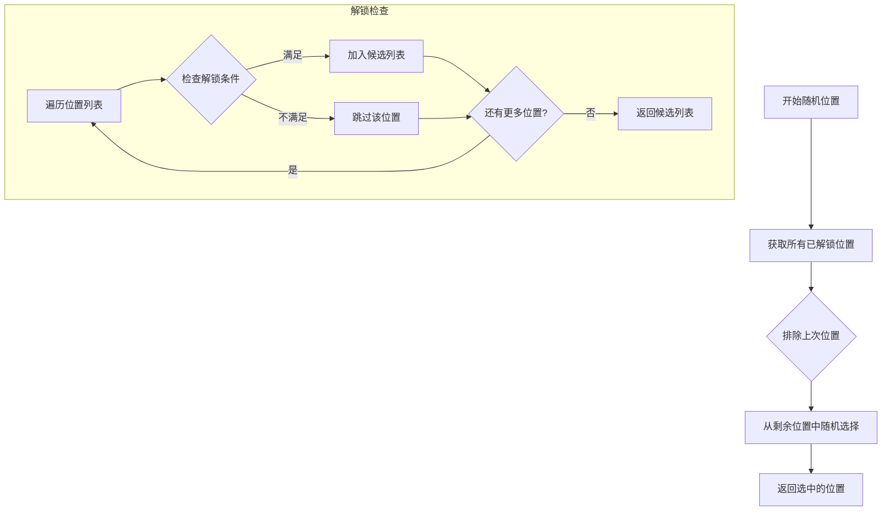
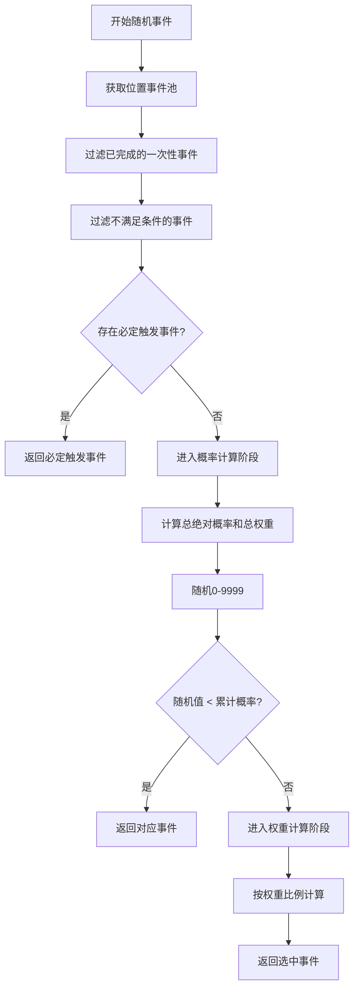
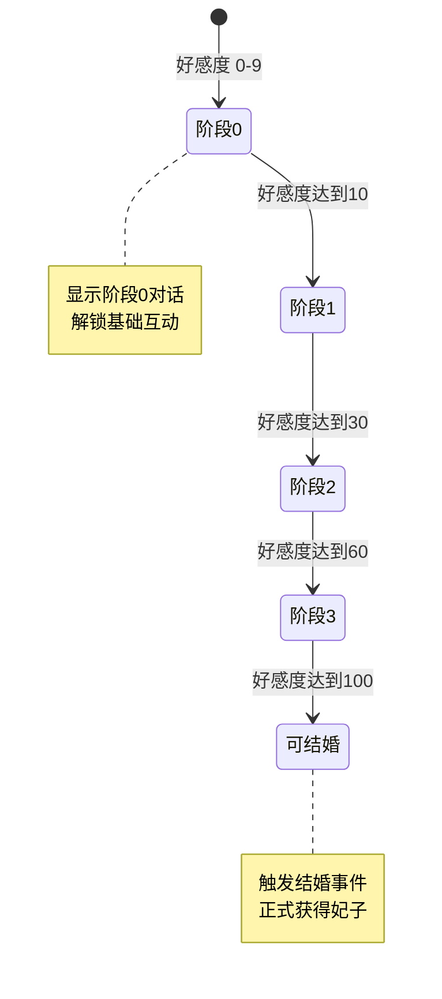
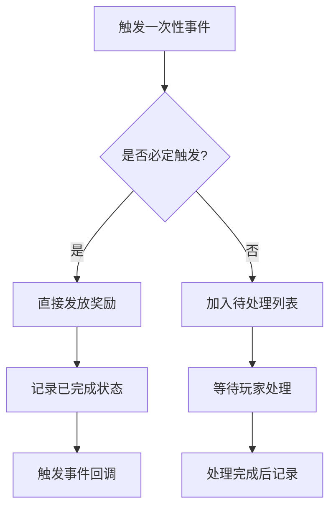
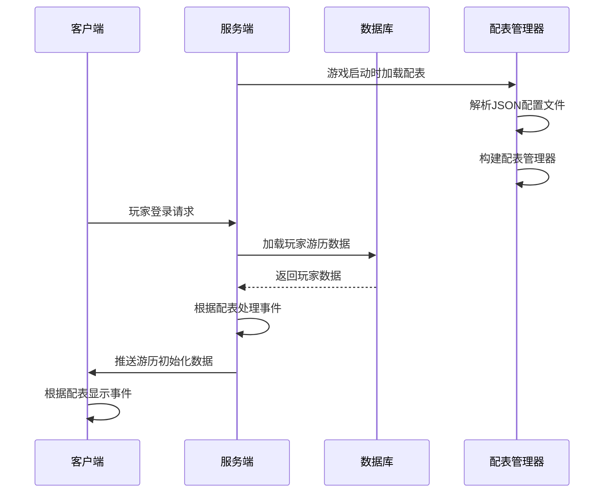
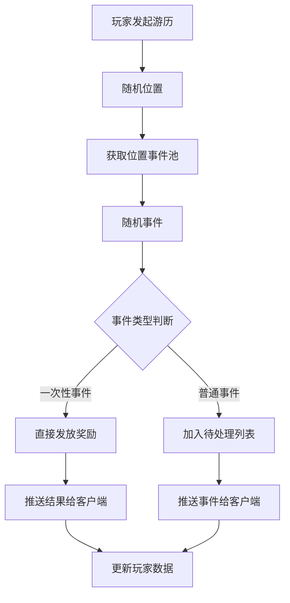

# 游历系统 - 数据配表

## 概述

游历系统 (TravelOp, p008) 是游戏中的核心玩法之一，玩家可以派遣角色进行游历，在游历过程中触发各种事件并获得奖励。模块编号为 p008。

---

## 一、配表文件总览

| 配表名称 | 文件名 | 说明 | 源码路径 |
|---------|--------|------|---------|
| RefTravelPos | travel_pos_ref.json | 游历位置配置 | `NPGameRes/Refs/Travel/RefTravelPos.java` |
| RefTravelEvent | travel_event_ref.json | 游历事件配置 | `NPGameRes/Refs/Travel/RefTravelEvent.java` |
| RefTravelConsort | travel_consort_ref.json | 游历妃子配置 | `NPGameRes/Refs/Travel/RefTravelConsort.java` |
| RefTravelEventAkey | travel_event_akey_ref.json | 一次性事件配置 | `NPGameRes/Refs/Travel/RefTravelEventAkey.java` |

---

## 二、游历位置配表 (RefTravelPos)

**文件**: `travel_pos_ref.json`

### 2.1 字段列表

| 字段名 | 类型 | 说明 | 示例值 |
|--------|------|------|--------|
| id | long | 位置ID | 1, 2, 3... |
| name | String | 位置名称 | "新手平原", "迷雾森林" |
| icon | long | 位置图标ID | 10001 |
| unlock_condition | NPCondition | 解锁条件 | `{condition_list}` |
| eventRefList | ArrayList\<RefTravelEvent\> | 可触发事件列表 | `[event1, event2]` |

### 2.2 位置配置示例

```json
{
  "id": 1,
  "name": "新手平原",
  "icon": 10001,
  "unlock_condition": {
    "condition_list": [
      {"type": "LEVEL", "value": 10}
    ]
  },
  "eventRefList": [
    {"event_id": 101, "rand_pro": 1000, "rand_wei": 500},
    {"event_id": 102, "rand_pro": 500, "rand_wei": 300}
  ]
}
```

### 2.3 位置随机算法



---

## 三、游历事件配表 (RefTravelEvent)

**文件**: `travel_event_ref.json`

### 3.1 字段列表

| 字段名 | 类型 | 说明 | 示例值 |
|--------|------|------|--------|
| event_id | long | 事件ID | 101, 102... |
| event_type | ETravelEventType | 事件类型枚举 | 1-9 |
| event_name | String | 事件名称 | "偶遇宝箱" |
| event_desc | String | 事件描述 | "你在路上发现了一个宝箱" |
| event_icon | long | 事件图标 | 20001 |
| rand_pro | int | 绝对触发概率(万分比) | 1000 = 10% |
| rand_wei | int | 权重值 | 500 |
| effective_condition | NPCondition | 生效条件 | `{condition_list}` |
| event_item_list | NPCommon_ItemInfoList | 事件奖励列表 | `[item1, item2]` |
| onceEventRef | RefTravelEventAkey | 一次性事件配置 | 可为null |

### 3.2 事件类型枚举 (ETravelEventType)

**源码路径**: `ClientProtocol/Common/TravelEnum/ETravelEventType.cs`

| 枚举值 | 数值 | 说明 | 触发场景 |
|--------|------|------|---------|
| NONE | 0 | 无效类型 | - |
| REWARD | 1 | 对话奖励事件 | 游历触发对话获得奖励 |
| CONSORT_LIKE | 2 | 妃子好感度事件 | 与妃子互动提升好感度 |
| CONSORT_INTIMACY | 3 | 妃子亲密度事件 | 提升妃子亲密度 |
| CONSORT_BAR | 4 | 酒馆妃子事件 | 酒馆中遇到妃子 |
| CHANGE | 5 | 兑换事件 | 交换物品或属性 |
| INVITATION | 6 | 指定邀约事件 | 邀约特定妃子 |
| GIFTDE | 7 | 获得卷王事件 | 获得特殊奖励 |
| ADD_POWER | 8 | 增加实力事件 | 增加角色实力 |
| GAMBLING | 9 | 博彩事件 | 赌博小游戏 |

### 3.3 事件配置示例

```json
{
  "event_id": 101,
  "event_type": 1,
  "event_name": "偶遇宝箱",
  "event_desc": "你在路上发现了一个宝箱",
  "event_icon": 20001,
  "rand_pro": 1000,
  "rand_wei": 500,
  "effective_condition": {
    "condition_list": [
      {"type": "LEVEL", "value": 10}
    ]
  },
  "event_item_list": [
    {"itemType": 1, "itemId": 0, "count": 5000},
    {"itemType": 2, "itemId": 0, "count": 50}
  ],
  "onceEventRef": null
}
```

### 3.4 事件随机算法



**核心代码示例**:

```java
// 事件随机算法 (TravelComponent.java:303-374)
private RefTravelEvent _checkEventRefList(ArrayList<RefTravelEvent> _eventRefList) {
    ArrayList<RefTravelEvent> candidateList = new ArrayList<>();

    for (RefTravelEvent eventRef : _eventRefList) {
        // 过滤已完成的
        if (_m_finishedOnceEventIdList.contains(eventRef.event_id)) continue;
        // 过滤不满足条件的
        if (!NPPlayerConditionDealerMgr.IsEnable(eventRef.effective_condition, getUserData(), null)) continue;
        // 优先返回必定触发的一次性事件
        if (eventRef.onceEventRef != null && eventRef.onceEventRef.is_trigger) return eventRef;
        // 跳过概率和权重均为0的事件
        if (eventRef.rand_pro <= 0 && eventRef.rand_wei <= 0) continue;
        candidateList.add(eventRef);
    }

    // 第一轮：绝对概率部分
    int totalPro = 0, totalWei = 0;
    for (RefTravelEvent eventRef : candidateList) {
        totalPro += eventRef.rand_pro;
        totalWei += eventRef.rand_wei;
    }

    int r = CommonFunc.randomInt(9999);
    int accumulated = 0;
    for (RefTravelEvent eventRef : candidateList) {
        accumulated += eventRef.rand_pro;
        if (r < accumulated) return eventRef;
    }

    // 第二轮：权重部分
    if (totalWei > 0) {
        int weightSize = 10000 - totalPro;
        int weightOffset = r - totalPro;
        int accWei = 0;
        for (RefTravelEvent eventRef : candidateList) {
            if (eventRef.rand_wei <= 0) continue;
            accWei += eventRef.rand_wei;
            if ((long) weightOffset * totalWei < (long) weightSize * accWei)
                return eventRef;
        }
    }

    return candidateList.get(candidateList.size() - 1);
}
```

---

## 四、游历妃子配表 (RefTravelConsort)

**文件**: `travel_consort_ref.json`

### 4.1 字段列表

| 字段名 | 类型 | 说明 | 示例值 |
|--------|------|------|--------|
| consort_id | long | 妃子ID | 10001 |
| consort_name | String | 妃子名称 | "小红" |
| like_init | int | 初始好感度 | 0 |
| marry_need_like | int | 结婚所需好感度 | 100 |
| like_step_dialog_list | List\<WCGPairIntLong\> | 好感度阶段对话列表 | `[(10, dialog_id), (30, dialog_id)]` |

### 4.2 妃子配置示例

```json
{
  "consort_id": 10001,
  "consort_name": "小红",
  "like_init": 0,
  "marry_need_like": 100,
  "like_step_dialog_list": [
    {"first": 10, "second": 50001},
    {"first": 30, "second": 50002},
    {"first": 60, "second": 50003},
    {"first": 100, "second": 50004}
  ]
}
```

### 4.3 好感度阶段变化流程



---

## 五、一次性事件配表 (RefTravelEventAkey)

**文件**: `travel_event_akey_ref.json`

### 5.1 字段列表

| 字段名 | 类型 | 说明 | 示例值 |
|--------|------|------|--------|
| event_id | long | 关联事件ID | 201 |
| is_trigger | boolean | 是否必定触发 | true |
| event_item_list | NPCommon_ItemInfoList | 事件奖励列表 | `[item1, item2]` |
| gain_player_exp | long | 获得玩家经验 | 100 |
| event_effect | NPEffect | 事件效果 | `{effect_list}` |

### 5.2 一次性事件处理流程



---

## 六、博彩结果枚举 (ETravelGambleResult)

**源码路径**: `ClientProtocol/Common/TravelEnum/ETravelGambleResult.cs`

| 枚举值 | 数值 | 说明 | 效果 |
|--------|------|------|------|
| NONE | 0 | 无效类型 | - |
| WIN | 1 | 胜利 | 获得下注金额 × 倍率 |
| LOSE | 2 | 失败 | 失去下注金额 |
| JACKPOT | 3 | 特别大奖 | 获得高额奖励 |
| ABANDON | 4 | 放弃 | 不参与赌博 |

---

## 七、配表加载方式

### 7.1 客户端加载

```csharp
// 获取游历位置配置
TravelPosRefObj posRef = GRefdataCoreMgr.instance.travelPosRefCore.getRef(posId);

// 获取游历事件配置
TravelEventRefObj eventRef = GRefdataCoreMgr.instance.travelEventRefCore.getRef(eventId);

// 获取游历妃子配置
TravelConsortRefObj consortRef = GRefdataCoreMgr.instance.travelConsortRefCore.getRef(consortId);
```

### 7.2 服务端加载

```java
// 获取游历位置配置
RefTravelPos posRef = RefTravelPos.getMgr().get(posId);

// 获取游历事件配置
RefTravelEvent eventRef = RefTravelEvent.getMgr().get(eventId);

// 获取游历妃子配置
RefTravelConsort consortRef = RefTravelConsort.getMgr().get(consortId);

// 随机游历位置
RefTravelPos posRef = RefTravelPos.getMgr().randPos(lastPosId, lockedPosIds);
```

---

## 八、配表数据流程图

### 8.1 配表加载流程



### 8.2 事件触发流程



---

## 九、字段校验规则

### 9.1 位置配置校验

| 字段名 | 校验规则 | 异常处理 |
|--------|----------|----------|
| id | 必须唯一，范围 > 0 | 配表加载时去重 |
| name | 非空字符串 | 配表加载时校验 |
| unlock_condition | 可为空 | 空表示默认解锁 |
| eventRefList | 非空，至少一个事件 | 配表加载时校验 |

### 9.2 事件配置校验

| 字段名 | 校验规则 | 异常处理 |
|--------|----------|----------|
| event_id | 必须唯一，范围 > 0 | 配表加载时去重 |
| event_type | 范围 1-9 | 配表加载时校验 |
| rand_pro | 范围 0-9999 | 运行时限制 |
| rand_wei | 范围 >= 0 | 运行时限制 |
| event_item_list | 可为空 | 空表示无奖励 |

### 9.3 妃子配置校验

| 字段名 | 校验规则 | 异常处理 |
|--------|----------|----------|
| consort_id | 必须唯一，范围 > 0 | 配表加载时去重 |
| marry_need_like | 范围 > 0 | 配表加载时校验 |
| like_step_dialog_list | 可为空 | 空表示无阶段对话 |

---

## 十、配表路径汇总

### 10.1 客户端路径

```
game_client/Assets/Scripts/ResScripts/NPSO/GSO/Travel/
├── TravelPosRefObj.cs          # 位置配表对象
├── TravelEventRefObj.cs        # 事件配表对象
└── TravelConsortRefObj.cs      # 妃子配表对象
```

### 10.2 服务端路径

```
game_server/GameRes/src/NPGameRes/Refs/Travel/
├── RefTravelPos.java           # 位置配表类
├── RefTravelEvent.java         # 事件配表类
├── RefTravelConsort.java       # 妃子配表类
└── RefTravelEventAkey.java     # 一次性事件配表类
```

---

*文档生成时间: 2026-04-11*
*源码参考路径: `/game_server/GameRes/src/NPGameRes/Refs/Travel/`*
*源码参考路径: `/game_client/Assets/Scripts/ClientProtocol/Common/TravelEnum/`*
