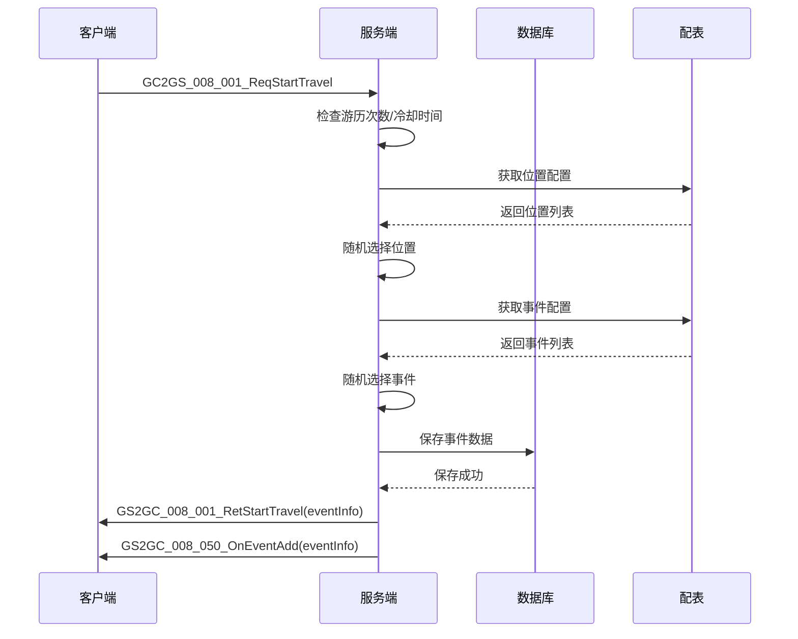
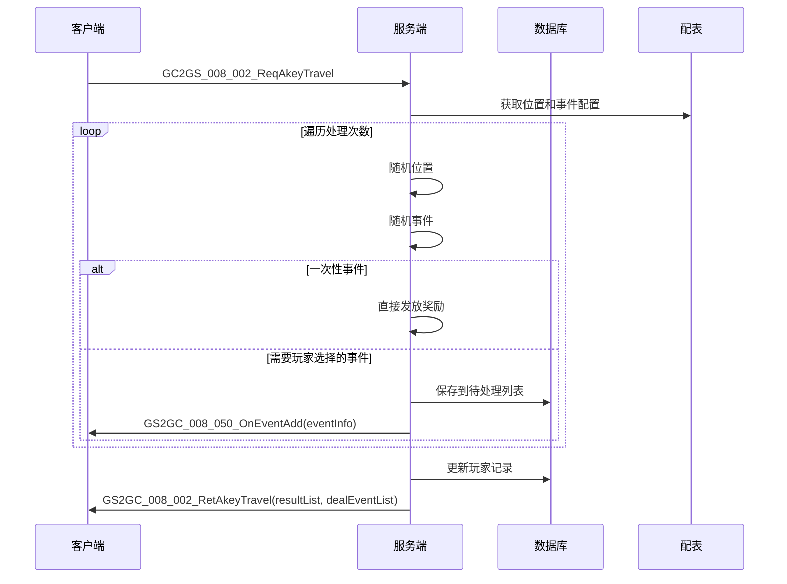
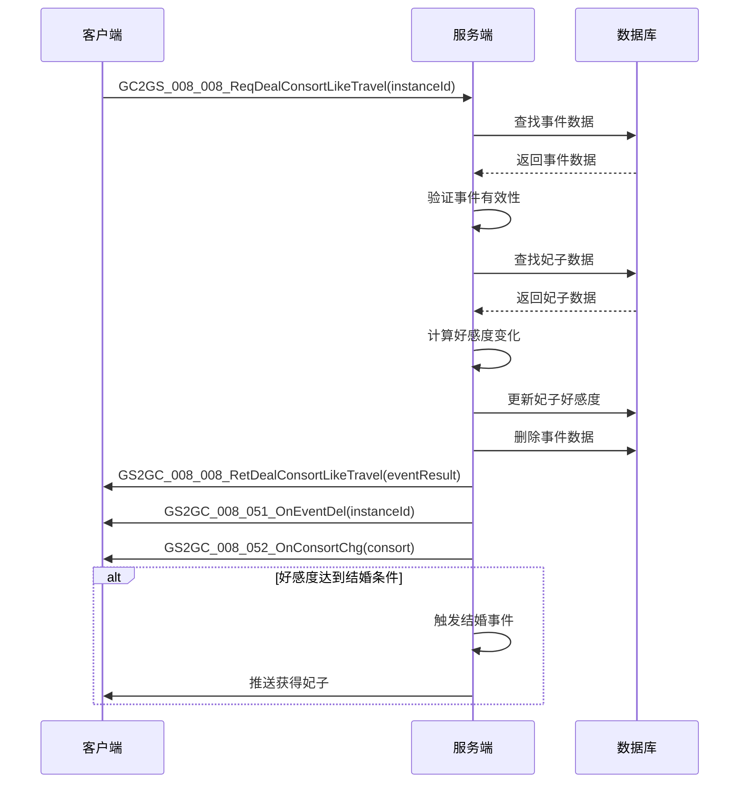
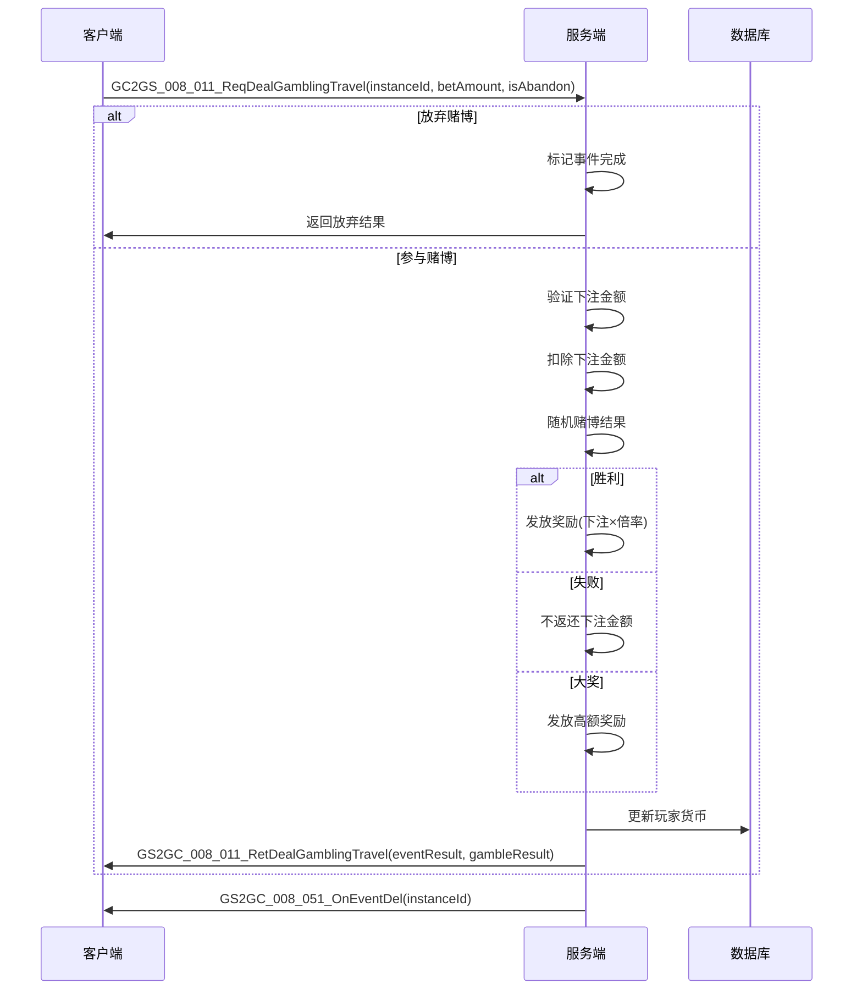

# 游历系统 - 协议文档

## 协议模块编号: p008

**源码路径**:
- 客户端请求: `game_server/ServerProtocol/src/GC2GS/p008_TravelOp/`
- 服务端响应: `game_server/ServerProtocol/src/GS2GC/p008_TravelOp/`

---

## 一、协议总览

### 1.1 协议分类

| 分类 | 主序号 | 说明 |
|------|--------|------|
| 游历操作协议 | 8 | 游历相关操作请求/响应 |

### 1.2 协议架构图

```mermaid
graph TB
    subgraph 客户端请求 GC2GS
        A1[001_ReqStartTravel 开始游历]
        A2[002_ReqAkeyTravel 一键游历]
        A3[003_ReqDealRewardTravel 处理奖励事件]
        A4[004_ReqDealConsortBarTravel 处理酒馆妃子事件]
        A5[005_ReqDealChangeTravel 处理兑换事件]
        A6[006_ReqDealInvitationTravel 处理邀约事件]
        A7[007_ReqDealAddPowerTravel 处理加力事件]
        A8[008_ReqDealConsortLikeTravel 处理妃子好感事件]
        A9[009_ReqDealConsortIntimacyTravel 处理妃子亲密度事件]
        A10[010_ReqDealGiftedTravel 处理卷王事件]
        A11[011_ReqDealGamblingTravel 处理博彩事件]
    end

    subgraph 服务端响应 GS2GC
        B1[001_RetStartTravel 开始游历结果]
        B2[002_RetAkeyTravel 一键游历结果]
        B3[003_RetDealRewardTravel 奖励事件结果]
        B4[004_RetDealConsortBarTravel 酒馆妃子事件结果]
        B5[005_RetDealChangeTravel 兑换事件结果]
        B6[006_RetDealInvitationTravel 邀约事件结果]
        B7[007_RetDealAddPowerTravel 加力事件结果]
        B8[008_RetDealConsortLikeTravel 妃子好感事件结果]
        B9[009_RetDealConsortIntimacyTravel 妃子亲密度事件结果]
        B10[010_RetDealGiftedTravel 卷王事件结果]
        B11[011_RetDealGamblingTravel 博彩事件结果]
        B12[050_OnEventAdd 事件添加推送]
        B13[051_OnEventDel 事件删除推送]
        B14[052_OnConsortChg 妃子变化推送]
    end

    A1 --> B1
    A2 --> B2
    A3 --> B3
    A4 --> B4
    A5 --> B5
    A6 --> B6
    A7 --> B7
    A8 --> B8
    A9 --> B9
    A10 --> B10
    A11 --> B11
```



---

## 二、请求协议 (GC2GS)

### 2.1 游历操作请求

#### GC2GS_008_001_ReqStartTravel - 请求开始游历
**主序号**: 8 | **子序号**: 1

| 字段名 | 类型 | 说明 | 必填 |
|--------|------|------|------|
| - | - | 无参数 | - |

**请求示例**:
```csharp
// 客户端发送
NPGSClientListener.sendMsg(GSWriter_008_TravelOp.make_001_ReqStartTravel());
```

---

#### GC2GS_008_002_ReqAkeyTravel - 请求一键游历
**主序号**: 8 | **子序号**: 2

| 字段名 | 类型 | 说明 | 必填 |
|--------|------|------|------|
| - | - | 无参数 | - |

**请求示例**:
```csharp
NPGSClientListener.sendMsg(GSWriter_008_TravelOp.make_002_ReqAkeyTravel());
```

---

### 2.2 事件处理请求

#### GC2GS_008_003_ReqDealRewardTravel - 处理奖励事件
**主序号**: 8 | **子序号**: 3

| 字段名 | 类型 | 说明 | 必填 |
|--------|------|------|------|
| instanceId | long | 事件实例ID | 是 |

---

#### GC2GS_008_004_ReqDealConsortBarTravel - 处理酒馆妃子事件
**主序号**: 8 | **子序号**: 4

| 字段名 | 类型 | 说明 | 必填 |
|--------|------|------|------|
| instanceId | long | 事件实例ID | 是 |
| consortId | long | 妃子ID | 是 |
| costId | long | 消耗ID | 是 |

---

#### GC2GS_008_005_ReqDealChangeTravel - 处理兑换事件
**主序号**: 8 | **子序号**: 5

| 字段名 | 类型 | 说明 | 必填 |
|--------|------|------|------|
| instanceId | long | 事件实例ID | 是 |
| isChange | boolean | 是否兑换 | 是 |

---

#### GC2GS_008_006_ReqDealInvitationTravel - 处理邀约事件
**主序号**: 8 | **子序号**: 6

| 字段名 | 类型 | 说明 | 必填 |
|--------|------|------|------|
| instanceId | long | 事件实例ID | 是 |
| consortId | long | 邀约的妃子ID | 是 |

---

#### GC2GS_008_007_ReqDealAddPowerTravel - 处理加力事件
**主序号**: 8 | **子序号**: 7

| 字段名 | 类型 | 说明 | 必填 |
|--------|------|------|------|
| instanceId | long | 事件实例ID | 是 |
| consortId | long | 妃子ID | 是 |

---

#### GC2GS_008_008_ReqDealConsortLikeTravel - 处理妃子好感事件
**主序号**: 8 | **子序号**: 8

| 字段名 | 类型 | 说明 | 必填 |
|--------|------|------|------|
| instanceId | long | 事件实例ID | 是 |

---

#### GC2GS_008_009_ReqDealConsortIntimacyTravel - 处理妃子亲密度事件
**主序号**: 8 | **子序号**: 9

| 字段名 | 类型 | 说明 | 必填 |
|--------|------|------|------|
| instanceId | long | 事件实例ID | 是 |

---

#### GC2GS_008_010_ReqDealGiftedTravel - 处理卷王事件
**主序号**: 8 | **子序号**: 10

| 字段名 | 类型 | 说明 | 必填 |
|--------|------|------|------|
| instanceId | long | 事件实例ID | 是 |

---

#### GC2GS_008_011_ReqDealGamblingTravel - 处理博彩事件
**主序号**: 8 | **子序号**: 11

| 字段名 | 类型 | 说明 | 必填 |
|--------|------|------|------|
| instanceId | long | 事件实例ID | 是 |
| betAmount | int | 下注金额 | 是 |
| isAbandon | boolean | 是否放弃 | 是 |

---

### 2.3 完整请求协议列表

| 协议名 | 主序号 | 子序号 | 说明 |
|--------|--------|--------|------|
| GC2GS_008_001_ReqStartTravel | 8 | 1 | 开始游历 |
| GC2GS_008_002_ReqAkeyTravel | 8 | 2 | 一键游历 |
| GC2GS_008_003_ReqDealRewardTravel | 8 | 3 | 处理奖励事件 |
| GC2GS_008_004_ReqDealConsortBarTravel | 8 | 4 | 处理酒馆妃子事件 |
| GC2GS_008_005_ReqDealChangeTravel | 8 | 5 | 处理兑换事件 |
| GC2GS_008_006_ReqDealInvitationTravel | 8 | 6 | 处理邀约事件 |
| GC2GS_008_007_ReqDealAddPowerTravel | 8 | 7 | 处理加力事件 |
| GC2GS_008_008_ReqDealConsortLikeTravel | 8 | 8 | 处理妃子好感事件 |
| GC2GS_008_009_ReqDealConsortIntimacyTravel | 8 | 9 | 处理妃子亲密度事件 |
| GC2GS_008_010_ReqDealGiftedTravel | 8 | 10 | 处理卷王事件 |
| GC2GS_008_011_ReqDealGamblingTravel | 8 | 11 | 处理博彩事件 |

---

## 三、响应协议 (GS2GC)

### 3.1 游历操作响应

#### GS2GC_008_001_RetStartTravel - 开始游历结果
**主序号**: 8 | **子序号**: 1

| 字段名 | 类型 | 说明 |
|--------|------|------|
| eventInfo | Travel_Event | 生成的事件信息 |

---

#### GS2GC_008_002_RetAkeyTravel - 一键游历结果
**主序号**: 8 | **子序号**: 2

| 字段名 | 类型 | 说明 |
|--------|------|------|
| resultList | List\<Travel_EventResult\> | 事件结果列表 |
| dealEventList | List\<Travel_Event\> | 需手动处理的事件列表 |

---

### 3.2 事件处理响应

#### GS2GC_008_003_RetDealRewardTravel - 奖励事件结果
**主序号**: 8 | **子序号**: 3

| 字段名 | 类型 | 说明 |
|--------|------|------|
| eventResult | Travel_EventResult | 事件结果 |

---

#### GS2GC_008_011_RetDealGamblingTravel - 博彩事件结果
**主序号**: 8 | **子序号**: 11

| 字段名 | 类型 | 说明 |
|--------|------|------|
| eventResult | Travel_EventResult | 事件结果 |
| gambleResult | Travel_GambleResult | 博彩结果详情 |

---

### 3.3 推送协议

#### GS2GC_008_050_OnEventAdd - 事件添加推送
**主序号**: 8 | **子序号**: 50

| 字段名 | 类型 | 说明 |
|--------|------|------|
| eventInfo | Travel_Event | 添加的事件信息 |

**响应示例**:
```csharp
// 客户端接收处理
public void onEventAdd(GS2GC_008_050_OnEventAdd _msg) {
    _ATravelEventInfo eventInfo = TravelEventUtil.makeTravelEventInfo(_msg.getEventInfo());
    _m_travelEventList.Add(eventInfo);
}
```

---

#### GS2GC_008_051_OnEventDel - 事件删除推送
**主序号**: 8 | **子序号**: 51

| 字段名 | 类型 | 说明 |
|--------|------|------|
| instanceId | long | 删除的事件实例ID |

---

#### GS2GC_008_052_OnConsortChg - 妃子变化推送
**主序号**: 8 | **子序号**: 52

| 字段名 | 类型 | 说明 |
|--------|------|------|
| consort | Travel_Consort | 妃子信息 |

---

### 3.4 完整响应协议列表

| 协议名 | 主序号 | 子序号 | 类型 | 说明 |
|--------|--------|--------|------|------|
| GS2GC_008_001_RetStartTravel | 8 | 1 | 响应 | 开始游历结果 |
| GS2GC_008_002_RetAkeyTravel | 8 | 2 | 响应 | 一键游历结果 |
| GS2GC_008_003_RetDealRewardTravel | 8 | 3 | 响应 | 奖励事件结果 |
| GS2GC_008_004_RetDealConsortBarTravel | 8 | 4 | 响应 | 酒馆妃子事件结果 |
| GS2GC_008_005_RetDealChangeTravel | 8 | 5 | 响应 | 兑换事件结果 |
| GS2GC_008_006_RetDealInvitationTravel | 8 | 6 | 响应 | 邀约事件结果 |
| GS2GC_008_007_RetDealAddPowerTravel | 8 | 7 | 响应 | 加力事件结果 |
| GS2GC_008_008_RetDealConsortLikeTravel | 8 | 8 | 响应 | 妃子好感事件结果 |
| GS2GC_008_009_RetDealConsortIntimacyTravel | 8 | 9 | 响应 | 妃子亲密度事件结果 |
| GS2GC_008_010_RetDealGiftedTravel | 8 | 10 | 响应 | 卷王事件结果 |
| GS2GC_008_011_RetDealGamblingTravel | 8 | 11 | 响应 | 博彩事件结果 |
| GS2GC_008_050_OnEventAdd | 8 | 50 | 推送 | 事件添加通知 |
| GS2GC_008_051_OnEventDel | 8 | 51 | 推送 | 事件删除通知 |
| GS2GC_008_052_OnConsortChg | 8 | 52 | 推送 | 妃子变化通知 |

---

## 四、数据结构对象

### 4.1 Travel_Event - 游历事件
**路径**: `ClientProtocol/Common/TravelObj/Travel_Event.cs`

| 字段名 | 类型 | 说明 | 示例值 |
|--------|------|------|--------|
| instanceId | long | 实例ID(唯一标识) | 12345 |
| eventId | long | 事件配置ID | 101 |
| pos | long | 位置ID | 1 |

**源码定义**:
```csharp
public class Travel_Event : _IALProtocolStructure {
    private long instanceId;   // 实例ID
    private long eventId;      // 事件ID
    private long pos;          // 位置

    public long getInstanceId() { return instanceId; }
    public long getEventId() { return eventId; }
    public long getPos() { return pos; }
}
```

---

### 4.2 Travel_Consort - 游历妃子数据
**路径**: `ClientProtocol/Common/TravelObj/Travel_Consort.cs`

| 字段名 | 类型 | 说明 | 示例值 |
|--------|------|------|--------|
| consortId | long | 妃子ID | 10001 |
| like | int | 好感度 | 50 |

**源码定义**:
```csharp
public class Travel_Consort : _IALProtocolStructure {
    private long consortId;    // 妃子ID
    private int like;          // 好感度

    public long getConsortId() { return consortId; }
    public int getLike() { return like; }
}
```

---

### 4.3 Travel_EventResult - 事件结果
**路径**: `ClientProtocol/Common/TravelObj/Travel_EventResult.cs`

| 字段名 | 类型 | 说明 | 示例值 |
|--------|------|------|--------|
| eventId | long | 事件ID | 101 |
| itemList | List\<NPCommon_ItemInfo\> | 奖励物品列表 | `[item1, item2]` |
| ext | byte[] | 额外数据(序列化) | - |

**源码定义**:
```csharp
public class Travel_EventResult : _IALProtocolStructure {
    private long eventId;                              // 事件ID
    private List<NPCommon.NPCommon_ItemInfo> itemList; // 奖励物品列表
    private byte[] ext;                                // 额外数据

    public long getEventId() { return eventId; }
    public List<NPCommon.NPCommon_ItemInfo> getItemList() { return itemList; }
    public byte[] getExt() { return ext; }
}
```

---

### 4.4 Travel_GambleResult - 博彩结果
**路径**: `ClientProtocol/Common/TravelObj/Travel_GambleResult.cs`

| 字段名 | 类型 | 说明 | 示例值 |
|--------|------|------|--------|
| resultType | ETravelGambleResult | 结果类型 | WIN(1) |
| diamondChange | long | 钻石变化量(正获得负损失) | 500 |
| betAmount | long | 下注金额 | 100 |

**源码定义**:
```csharp
public class Travel_GambleResult : _IALProtocolStructure {
    private Common.TravelEnum.ETravelGambleResult resultType;  // 结果类型
    private long diamondChange;   // 钻石变化量
    private long betAmount;       // 下注金额

    public ETravelGambleResult getResultType() { return resultType; }
    public long getDiamondChange() { return diamondChange; }
    public long getBetAmount() { return betAmount; }
}
```

---

### 4.5 Travel_EventResultExt_ConsoleLike - 妃子好感度额外数据
**路径**: `ClientProtocol/Common/TravelObj/Travel_EventResultExt_ConsoleLike.cs`

| 字段名 | 类型 | 说明 |
|--------|------|------|
| preLike | long | 变化前的好感度 |

---

### 4.6 Travel_EventResultExt_ConsoleIntimacy - 妃子亲密度额外数据
**路径**: `ClientProtocol/Common/TravelObj/Travel_EventResultExt_ConsoleIntimacy.cs`

| 字段名 | 类型 | 说明 |
|--------|------|------|
| preIntimacy | long | 变化前的亲密度 |

---

## 五、协议交互时序图

### 5.1 开始游历流程



### 5.2 一键游历流程



### 5.3 处理妃子事件流程



### 5.4 博彩事件流程



---

## 六、错误码定义

### 6.1 游历模块错误码 (TravelErr)

**源码路径**: `game_server/Common/src/NPCommon/ErrMain/TravelErr.java`

| 错误码 | 常量名 | 说明 | 触发场景 |
|--------|--------|------|---------|
| 170001 | TRAVEL_EVENT_CREATE_FAIL | 游历事件创建失败 | 创建事件时 |
| 170002 | TRAVEL_EVENT_NOT_FOUND | 游历事件未找到 | 查找事件时 |
| 170003 | TRAVEL_EVENT_NOT_DEAL | 游历事件未处理 | 事件状态异常 |
| 170004 | TRAVEL_EVENT_CONSORT_NOT_IN | 游历事件不属于指定妃子列表 | 妃子事件验证 |
| 170005 | TRAVEL_COST_NOT_ENOUGH | 游历事件消耗不足 | 处理事件时 |
| 170006 | TRAVEL_COST_FAIL | 游历事件消耗失败 | 扣除资源时 |
| 170007 | TRAVEL_GAMBLE_BET_INVALID | 博彩押注额度不合法 | 博彩下注时 |

**源码定义**:
```java
public class TravelErr implements _IErrHolder {
    public static final Result TRAVEL_EVENT_CREATE_FAIL = Result.constInit(170001, "游历事件创建失败");
    public static final Result TRAVEL_EVENT_NOT_FOUND = Result.constInit(170002, "游历事件未找到");
    public static final Result TRAVEL_EVENT_NOT_DEAL = Result.constInit(170003, "游历事件未处理");
    public static final Result TRAVEL_EVENT_CONSORT_NOT_IN = Result.constInit(170004, "游历事件不属于指定妃子列表");
    public static final Result TRAVEL_COST_NOT_ENOUGH = Result.constInit(170005, "游历事件消耗不足");
    public static final Result TRAVEL_COST_FAIL = Result.constInit(170006, "游历事件消耗失败");
    public static final Result TRAVEL_GAMBLE_BET_INVALID = Result.constInit(170007, "博彩押注额度不合法");
}
```

---

## 七、协议注册示例

### 7.1 客户端注册

```csharp
// 协议监听注册
public void RegisterProtocols() {
    // 响应协议监听
    networkManager.AddListener<GS2GC_008_001_RetStartTravel>(OnRetStartTravel);
    networkManager.AddListener<GS2GC_008_002_RetAkeyTravel>(OnRetAkeyTravel);
    networkManager.AddListener<GS2GC_008_050_OnEventAdd>(OnEventAdd);
    networkManager.AddListener<GS2GC_008_051_OnEventDel>(OnEventDel);
    networkManager.AddListener<GS2GC_008_052_OnConsortChg>(OnConsortChg);
}
```

### 7.2 服务端处理器

```java
// 协议处理器注册
public void registerHandlers() {
    registerHandler(GC2GS_008_001_ReqStartTravel.class, this::onReqStartTravel);
    registerHandler(GC2GS_008_002_ReqAkeyTravel.class, this::onReqAkeyTravel);
    registerHandler(GC2GS_008_003_ReqDealRewardTravel.class, this::onReqDealRewardTravel);
    // ... 其他处理器
}
```

---

## 八、调试技巧

### 8.1 协议日志打印

```csharp
// 客户端协议日志
public void LogTravelProtocol<T>(T proto, bool isSend) where T : _IALProtocolStructure {
    string direction = isSend ? "SEND" : "RECV";
    Debug.Log($"[Travel][{direction}] {proto.GetType().Name}: {JsonUtility.ToJson(proto)}");
}
```

### 8.2 协议模拟测试

```csharp
// 模拟开始游历
public void TestStartTravel() {
    NPPlayer.instance.travelComp.reqStartTravel((res) => {
        Debug.Log($"开始游历成功，事件数量: {res.eventInfo != null ? 1 : 0}");
    }, () => {
        Debug.Log("开始游历失败");
    });
}
```

---

*文档生成时间: 2026-04-11*
*源码参考路径: `/game_server/ServerProtocol/src/GC2GS/p008_TravelOp/`*
*源码参考路径: `/game_server/ServerProtocol/src/GS2GC/p008_TravelOp/`*
