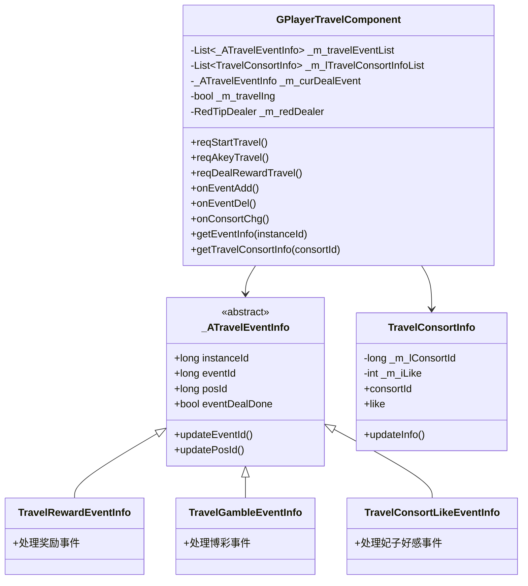
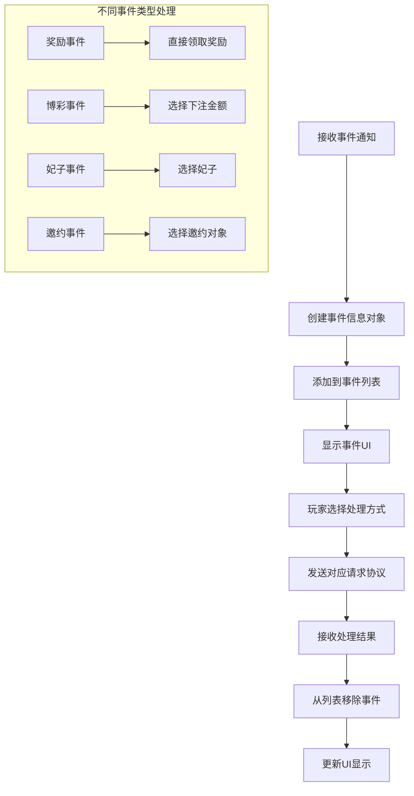
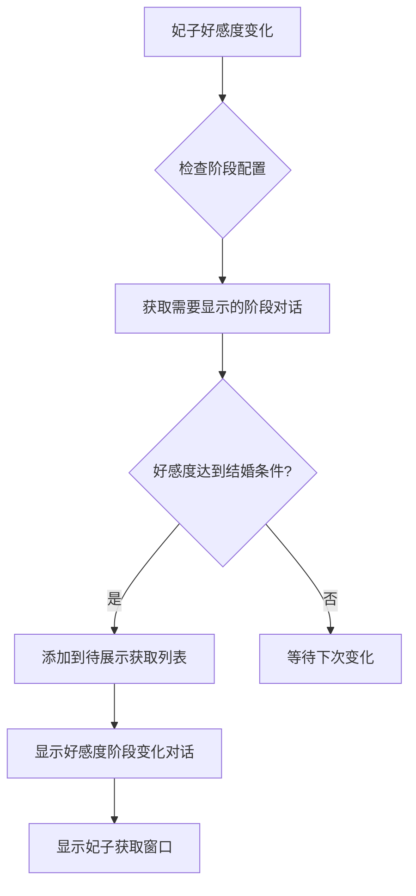

# 游历系统 - 客户端开发

## 组件架构

### 核心组件

游历系统客户端主要包含以下组件：

```
GameComponent/Travel/
├── GPlayerTravelComponent.cs      # 游历模块管理类(核心)
├── TravelConsortInfo.cs           # 游历妃子信息
├── GTravel_RedTipDealer.cs        # 红点提示处理
├── Event/
│   ├── TravelEventUtil.cs         # 事件工具类
│   ├── TravelEventRole/           # 事件角色
│   │   ├── TravelEventConsortRole.cs
│   │   ├── TravelEventNpcRole.cs
│   │   └── _ITravelEventRole.cs
│   ├── EventResult/               # 事件结果
│   │   ├── CommonTravelEventResultInfo.cs
│   │   ├── ConsortEventResult/
│   │   │   ├── TravelConsortBarEventResultInfo.cs
│   │   │   ├── TravelConsortIntimacyEventResultInfo.cs
│   │   │   ├── TravelConsortLikeEventResultInfo.cs
│   │   │   └── _ATravelConsortEventResultInfo.cs
│   │   └── _ATravelEventResultInfo.cs
│   └── EventInfo/                 # 事件信息
│       ├── _ATravelEventInfo.cs   # 事件基类
│       ├── TravelRewardEventInfo.cs
│       ├── TravelGambleEventInfo.cs
│       ├── TravelInvitationEventInfo.cs
│       ├── TravelGiftdeEventInfo.cs
│       ├── TravelConsortLikeEventInfo.cs
│       ├── TravelConsortIntimacyEventInfo.cs
│       ├── TravelConsortBarEventInfo.cs
│       ├── TravelAddPowerEventInfo.cs
│       └── TravelChangeEventInfo.cs
```

---

## 一、组件架构图



---

## 二、核心类详解

### 2.1 GPlayerTravelComponent - 游历模块管理类

**源码路径**: `GameComponent/Travel/GPlayerTravelComponent.cs`

**主要职责**:
- 管理游历事件列表
- 管理游历妃子信息
- 处理服务端推送
- 发送客户端请求

**核心属性**:

| 属性名 | 类型 | 说明 |
|--------|------|------|
| eventList | List\<_ATravelEventInfo\> | 当前事件列表 |
| curDealEvent | _ATravelEventInfo | 当前正在处理的事件 |
| isTraveling | bool | 是否正在游历中 |

**核心方法**:

```csharp
public partial class GPlayerTravelComponent : _ANPRemarkInfoComponent
{
    // 获取事件信息
    public _ATravelEventInfo getEventInfo(long _instanceId) {
        foreach (var eventInfo in _m_travelEventList) {
            if (eventInfo != null && eventInfo.instanceId == _instanceId)
                return eventInfo;
        }
        return null;
    }

    // 设置当前处理事件
    public void setCurDealEvent(_ATravelEventInfo _dealEvent) {
        if (_m_curDealEvent != null && !_m_curDealEvent.eventDealDone) {
            Debug.LogError_EditorOnly($"当前还有事件正在处理");
        }
        _m_curDealEvent = _dealEvent;
    }

    // 获取妃子信息
    public TravelConsortInfo getTravelConsortInfo(long consortId) {
        foreach (var consortInfo in _m_lTravelConsortInfoList) {
            if (consortInfo != null && consortInfo.consortId == consortId)
                return consortInfo;
        }
        return null;
    }
}
```

---

### 2.2 TravelConsortInfo - 游历妃子信息

**源码路径**: `GameComponent/Travel/TravelConsortInfo.cs`

```csharp
public class TravelConsortInfo
{
    private long _m_lConsortId;      // 妃子ID
    private int _m_iLike;           // 好感度
    private ConsortRefShowInfo _m_rConsortRefShowInfo;      // 妃子显示信息
    private TravelConsortRefObj _m_rTravelConsortRefObj;    // 游历妃子配表数据

    public long consortId { get => _m_lConsortId; }
    public int like { get => _m_iLike; }

    // 更新妃子信息
    public void updateInfo(Travel_Consort _serverTravelConsort) {
        if (_serverTravelConsort == null) return;
        _m_lConsortId = _serverTravelConsort.getConsortId();
        _m_iLike = _serverTravelConsort.getLike();
    }
}
```

---

### 2.3 _ATravelEventInfo - 事件基类

**源码路径**: `GameComponent/Travel/Event/EventInfo/_ATravelEventInfo.cs`

```csharp
public abstract class _ATravelEventInfo
{
    protected long _m_lInstanceId;   // 实例ID
    protected long _m_lEventId;     // 事件配置ID
    protected long _m_lPosId;       // 位置ID
    protected bool _m_bEventDealDone; // 事件是否处理完成

    public long instanceId { get => _m_lInstanceId; }
    public long eventId { get => _m_lEventId; }
    public long posId { get => _m_lPosId; }
    public bool eventDealDone { get => _m_bEventDealDone; }

    // 更新事件ID
    public virtual void updateEventId(long eventId) {
        _m_lEventId = eventId;
    }

    // 更新位置ID
    public virtual void updatePosId(long posId) {
        _m_lPosId = posId;
    }
}
```

---

## 三、事件处理流程

### 3.1 事件类型枚举

**源码路径**: `ClientProtocol/Common/TravelEnum/ETravelEventType.cs`

```csharp
public enum ETravelEventType {
    NONE,              // 0 - 无效
    REWARD,            // 1 - 对话奖励事件
    CONSORT_LIKE,      // 2 - 妃子好感度事件
    CONSORT_INTIMACY,  // 3 - 妃子亲密度事件
    CONSORT_BAR,       // 4 - 酒馆妃子事件
    CHANGE,            // 5 - 兑换事件
    INVITATION,        // 6 - 指定邀约事件
    GIFTDE,            // 7 - 获得卷王事件
    ADD_POWER,         // 8 - 增加实力事件
    GAMBLING,          // 9 - 博彩事件
}
```

### 3.2 事件处理流程图



---

## 四、UI 窗口结构

### 4.1 窗口层级

```
GameWndGui/GGui/Travel/
├── GGUIWndTravelMain.cs           # 游历主界面
├── GGUIWndRandomTravelProcess.cs  # 随机游历过程
├── GGUIWndTravelProcessSkip.cs    # 跳过游历过程
├── GGUIWndConsortLikeStageChangeTip.cs  # 妃子好感阶段变化提示
├── TravelEvent/                   # 事件处理窗口
│   ├── RewardEvent/
│   │   └── GGUIWndTravelRewardEvent.cs
│   ├── GambleEvent/
│   │   ├── GGUIWndTravelGambleEvent.cs
│   │   └── GGUIWndTravelGambleAnte.cs
│   ├── ConsortBarEvent/
│   │   ├── GGUIWndTravelConsortBarEventChooseConsort.cs
│   │   └── GGUIWndTravelConsortBarEventChooseCost.cs
│   ├── InvitationEvent/
│   │   └── GGUIWndTravelInvitationEventSelectConsort.cs
│   ├── AddPowerEvent/
│   │   └── GGUIWndTravelAddPowerEvent.cs
│   └── DealEvent/
│       └── GGUIWndTravelDealEventBg.cs
├── TravelResult/                  # 结果展示窗口
│   ├── TravelResult/
│   │   ├── GGUIWndTravelCommonResult.cs
│   │   ├── GGUIWndTravelGambleEventResult.cs
│   │   ├── GGUIWndTravelConsortEventResult.cs
│   │   └── ...
│   └── AkeyResult/
│       ├── GGUIWndAkeyTravelResult.cs
│       └── GGUIWndAkeyTravelResultItemContainer.cs
├── TravelPos/                     # 位置相关
│   ├── GGUIWndTravelPosInfo.cs
│   ├── GGUIWndTravelPosEventContainer.cs
│   └── GGUIWndTravelPosUnlock.cs
├── TravelMap/                     # 地图相关
│   ├── GGUIWndTravelMapList.cs
│   └── GGUIWndTarvelMapItem.cs
├── TarvelConsortList/             # 妃子列表
│   ├── GGUIWndTarvelConsortList.cs
│   └── GGUIWndTarvelConsortItem.cs
└── Common/                        # 公共组件
    ├── GGUIWndTravelConsortItem.cs
    ├── GGUIWndTravelNpcItem.cs
    └── GGUIWndTravelMessActorContainer.cs
```

### 4.2 主要窗口功能

| 窗口类 | 功能说明 |
|--------|---------|
| GGUIWndTravelMain | 游历主界面，显示当前位置和事件 |
| GGUIWndRandomTravelProcess | 随机游历动画过程 |
| GGUIWndAkeyTravelResult | 一键游历结果展示 |
| GGUIWndTravelGambleEvent | 博彩事件处理界面 |
| GGUIWndTravelConsortBarEventChooseConsort | 酒馆妃子选择 |
| GGUIWndTarvelConsortList | 游历妃子列表 |

---

## 五、协议对接

### 5.1 发送请求

```csharp
// 请求开始游历
public void reqStartTravel(Action<GS2GC_008_001_RetStartTravel> _backAction = null, Action _failAction = null) {
    if (!GCommon.lazycdEnough(GRefdataCoreMgr.instance.npGeneral.travel_cost_lazycd_id, 1, true)) {
        _failAction?.Invoke();
        return;
    }
    NPGSClientListener.sendRequestByLog(GSWriter_008_TravelOp.make_001_ReqStartTravel(),
        new CommonRequestCallbackProtocolDealer<GS2GC_008_001_RetStartTravel>((info) => {
            _backAction?.Invoke(info);
        }, (_errCode) => {
            NPGUIAddSceneCenterTip.instance.showErrorInfo(_errCode);
            _failAction?.Invoke();
        }));
}

// 请求一键游历
public void reqAkeyTravel(Action<GS2GC_008_002_RetAkeyTravel> _backAction = null, Action _failAction = null) {
    NPGSClientListener.sendRequestByLog(GSWriter_008_TravelOp.make_002_ReqAkeyTravel(),
        new CommonRequestCallbackProtocolDealer<GS2GC_008_002_RetAkeyTravel>((info) => {
            _backAction?.Invoke(info);
        }, (_errCode) => {
            NPGUIAddSceneCenterTip.instance.showErrorInfo(_errCode);
            _failAction?.Invoke();
        }));
}

// 请求处理奖励事件
public void reqDealRewardTravel(long instanceId, Action<GS2GC_008_003_RetDealRewardTravel> _backAction = null, Action _failAction = null) {
    NPGSClientListener.sendRequestByLog(GSWriter_008_TravelOp.make_003_ReqDealRewardTravel(instanceId),
        new CommonRequestCallbackProtocolDealer<GS2GC_008_003_RetDealRewardTravel>((info) => {
            _backAction?.Invoke(info);
        }, (_errCode) => {
            NPGUIAddSceneCenterTip.instance.showErrorInfo(_errCode);
            _failAction?.Invoke();
        }));
}

// 请求处理博彩事件
public void reqDealGambleTravel(long instanceId, int betAmount, bool isAbandon, Action<bool, GS2GC_008_011_RetDealGamblingTravel> _backAction = null) {
    NPGSClientListener.sendRequestByLog(GSWriter_008_TravelOp.make_011_ReqDealGamblingTravel(instanceId, betAmount, isAbandon),
        new CommonRequestSucFailSameCallbackProtocolDealer<GS2GC_008_011_RetDealGamblingTravel>((_isSucc, _info) => {
            _backAction?.Invoke(_isSucc, _info);
        }));
}
```

### 5.2 接收响应

```csharp
// 增加游历事件
public void onEventAdd(GS2GC_008_050_OnEventAdd _msg) {
    if (!isInited || _msg == null || _msg.getEventInfo() == null) return;

    _ATravelEventInfo eventInfo = getEventInfo(_msg.getEventInfo().getInstanceId());
    if (eventInfo == null) {
        eventInfo = TravelEventUtil.makeTravelEventInfo(_msg.getEventInfo());
        _m_travelEventList.Add(eventInfo);
    } else {
        eventInfo.updateEventId(_msg.getEventInfo().getEventId());
        eventInfo.updatePosId(_msg.getEventInfo().getPos());
    }
}

// 删除游历事件
public void onEventDel(GS2GC_008_051_OnEventDel _msg) {
    if (!isInited || _msg == null) return;

    _m_travelEventList.Remove((_eventInfo) => {
        return _eventInfo != null && _eventInfo.instanceId == _msg.getInstanceId();
    });
}

// 游历妃子数据变化
public void onConsortChg(GS2GC_008_052_OnConsortChg _msg) {
    if (!isInited || _msg == null || _msg.getConsort() == null) return;

    TravelConsortInfo travelConsortInfo = getTravelConsortInfo(_msg.getConsort().getConsortId());
    int oldLike = travelConsortInfo?.like ?? 0;

    if (travelConsortInfo == null) {
        travelConsortInfo = new TravelConsortInfo(_msg.getConsort());
        _m_lTravelConsortInfoList.Add(travelConsortInfo);
    } else {
        travelConsortInfo.updateInfo(_msg.getConsort());
    }

    // 好感度变化处理
    if (oldLike != travelConsortInfo.like)
        _onConsortLikeChg(travelConsortInfo.consortId, oldLike, travelConsortInfo.like);
}
```

---

## 六、红点系统

### 6.1 红点触发条件

| 红点类型 | 触发条件 | 说明 |
|---------|---------|------|
| 有新事件 | 事件列表不为空 | 待处理事件 |
| 游历完成 | 游历状态变化 | 可领取奖励 |
| 妃子好感度 | 好感度阶段变化 | 可解锁新剧情 |

### 6.2 红点处理代码

```csharp
// GTravel_RedTipDealer.cs
public class RedTipDealer {
    private GPlayerTravelComponent _m_comp;

    public void init() {
        // 注册红点检查
        RedPointManager.Register(ERedPointType.TRAVEL_EVENT, checkHasEvent);
    }

    private bool checkHasEvent() {
        return _m_comp.eventList.Count > 0;
    }
}
```

---

## 七、妃子好感度阶段变化

### 7.1 好感度变化处理

```csharp
private void _onConsortLikeChg(long _consortId, int _oldLike, int _newLike) {
    TravelConsortRefObj travelConsortRefObj = GRefdataCoreMgr.instance.travelConsortRefCore.getRef(_consortId);
    if (travelConsortRefObj == null) return;

    if (travelConsortRefObj.like_step_dialog_list != null) {
        List<WCGPairIntLong> needShowLikeStageChgDialogList = getNeedShowLikeStageChgList(_consortId, true);
        foreach (WCGPairIntLong likeStepDialog in travelConsortRefObj.like_step_dialog_list) {
            // 遍历的好感度阶段所需好感度 <= 旧的好感度时, 继续遍历
            if (likeStepDialog == null || likeStepDialog.first() <= _oldLike) continue;
            // 遍历的好感度阶段所需好感度 > 新的好感度时, 直接返回
            if (likeStepDialog.first() > _newLike) return;
            needShowLikeStageChgDialogList?.Add(likeStepDialog);
        }
    }

    // 当妃子当前好感度 >= 结婚所需好感度时
    if (_newLike >= travelConsortRefObj.marry_need_like &&
        !AccountSettingMgr.instance.accountSetting.alreadyShowGainConsortList.Contains(_consortId) &&
        !_m_lNeedShowGainConsortIdList.Contains(_consortId)) {
        _m_lNeedShowGainConsortIdList.Add(_consortId);
    }
}
```

### 7.2 好感度阶段变化展示流程



---

## 八、注意事项

1. **事件处理需要根据事件类型选择对应的请求协议**
2. **妃子事件需要先解锁对应妃子**
3. **一键游历会自动处理所有可处理的事件**
4. **注意处理网络异常情况，避免重复请求**
5. **好感度阶段变化需要按顺序展示对话**
6. **博彩事件需要验证下注金额范围**

---

## 九、调试技巧

### 9.1 模拟点击事件

```csharp
// 模拟点击游历交换事件交换按钮
private void _simulateClickTravelChangeEventChange() {
    if (curDealEvent == null || !(curDealEvent is TravelChangeEventInfo _changeEventInfo)) return;
    _changeEventInfo.needChange = true;
}

// 模拟点击游历交换事件不交换按钮
private void _simulateClickTravelChangeEventNotChange() {
    if (curDealEvent == null || !(curDealEvent is TravelChangeEventInfo _changeEventInfo)) return;
    _changeEventInfo.needChange = false;
}
```

### 9.2 位置解锁监听

```csharp
// 游历地点解锁
private void _onTravelPosUnlock(params object[] _objs) {
    if (_objs == null || !(_objs[0] is TravelPosRefObj unlockPosRefObj)) return;
    NPGUIAddSceneCenterTip.instance.showIconTextTip(
        unlockPosRefObj.icon,
        TextTranslate.instance.getLanguage(unlockPosRefObj.name),
        GRefdataCoreMgr.instance.npGeneral.travel_pos_unlock_center_tip_id);
}
```

---

*文档生成时间: 2026-04-11*
*源码参考路径: `/game_client/Assets/Scripts/LogicScripts/GameComponent/Travel/`*
