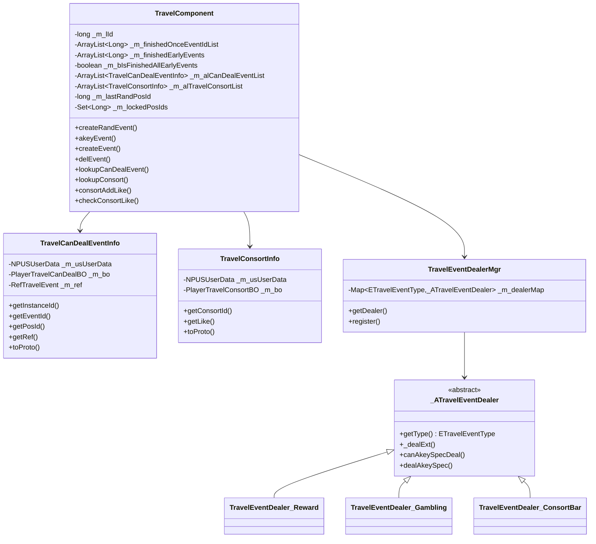
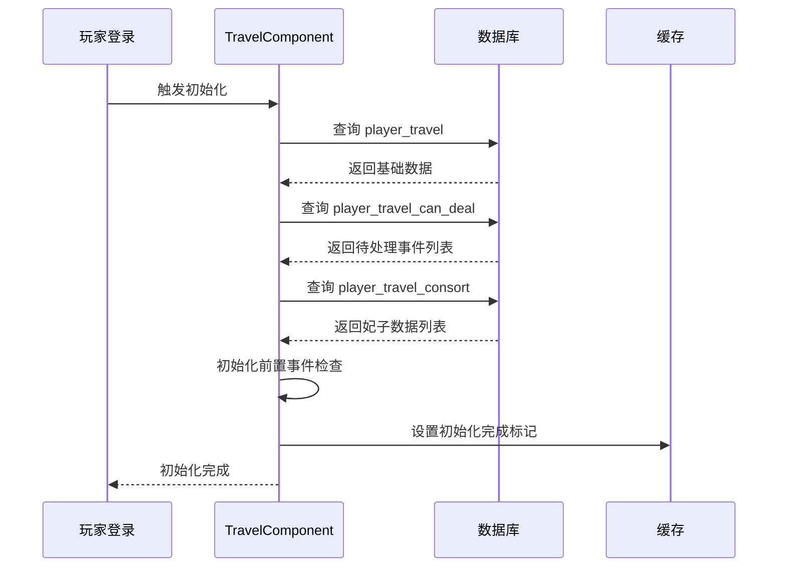
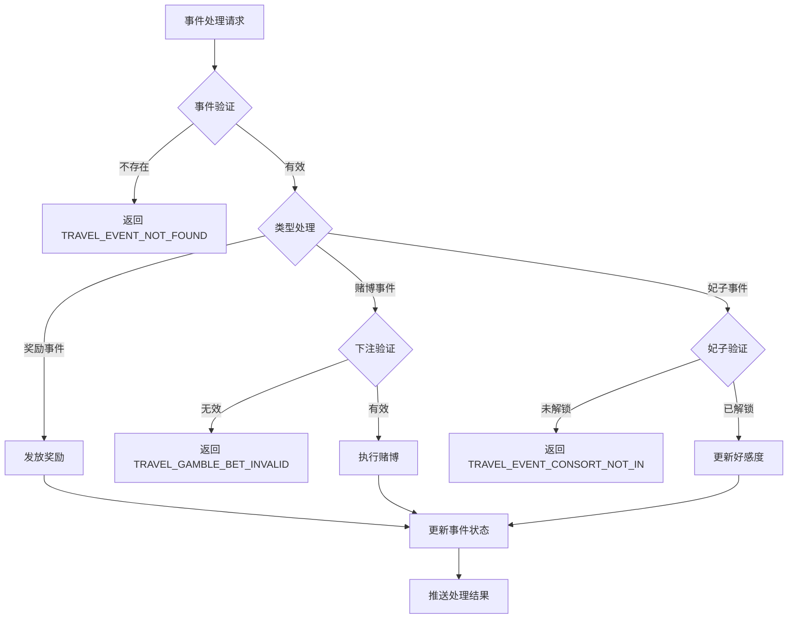

# 游历系统 - 服务端开发

## 模块架构

### 目录结构

```
GameServer/UserServer/src/NPUSServer/NPUSUserMgr/UserComp/TravelComp/
├── TravelComponent.java            # 游历组件主类
├── TravelConsortInfo.java          # 游历妃子信息
├── TravelCanDealEventInfo.java     # 待处理事件信息
└── Dealer/                         # 事件处理器
    ├── TravelEventDealerMgr.java   # 事件处理器管理器
    ├── TravelEventDealerResult.java
    ├── _ATravelEventDealer.java    # 事件处理器基类
    ├── TravelEventDealer_Reward.java
    ├── TravelEventDealer_Gambling.java
    ├── TravelEventDealer_ConsortBar.java
    ├── TravelEventDealer_ConsortLike.java
    ├── TravelEventDealer_ConsortIntimacy.java
    ├── TravelEventDealer_Invitation.java
    ├── TravelEventDealer_Giftde.java
    ├── TravelEventDealer_Change.java
    └── TravelEventDealer_AddPower.java
```

---

## 一、模块架构图



---

## 二、数据库表结构

### 2.1 游历基础数据表 (player_travel)

```sql
CREATE TABLE IF NOT EXISTS `player_travel` (
    `id` bigint(20) NOT NULL AUTO_INCREMENT COMMENT '自增主键',
    `cid` bigint(20) NOT NULL DEFAULT '0' COMMENT '玩家CID',
    `finishedOnceEvents` blob COMMENT '已完成一次性事件列表(序列化)',
    `finishedEarlyEvents` blob COMMENT '已完成的前置事件列表(序列化)',
    `isFinishedAllEarlyEvents` tinyint(1) NOT NULL DEFAULT '0' COMMENT '是否完成所有前置事件',
    `lastRandPosId` bigint(20) NOT NULL DEFAULT '0' COMMENT '上次随机位置ID',
    PRIMARY KEY (`id`),
    KEY `cid` (`cid`)
) COMMENT='玩家游历基础数据' ENGINE=InnoDB DEFAULT CHARSET=utf8mb4;
```

**字段说明**:

| 字段名 | 类型 | 说明 |
|--------|------|------|
| id | bigint(20) | 自增主键 |
| cid | bigint(20) | 玩家CID |
| finishedOnceEvents | blob | 已完成一次性事件列表(序列化) |
| finishedEarlyEvents | blob | 已完成的前置事件列表(序列化) |
| isFinishedAllEarlyEvents | tinyint(1) | 是否完成所有前置事件 |
| lastRandPosId | bigint(20) | 上次随机位置ID(避免连续重复) |

---

### 2.2 待处理事件表 (player_travel_can_deal)

```sql
CREATE TABLE IF NOT EXISTS `player_travel_can_deal` (
    `id` bigint(20) NOT NULL AUTO_INCREMENT COMMENT '自增主键',
    `cid` bigint(20) NOT NULL DEFAULT '0' COMMENT '玩家CID',
    `eventId` bigint(20) NOT NULL DEFAULT '0' COMMENT '事件配置ID',
    `posId` bigint(20) NOT NULL DEFAULT '0' COMMENT '位置ID',
    `createTime` datetime DEFAULT CURRENT_TIMESTAMP COMMENT '创建时间',
    PRIMARY KEY (`id`),
    KEY `cid` (`cid`),
    KEY `eventId` (`eventId`)
) COMMENT='玩家游历待处理事件' ENGINE=InnoDB DEFAULT CHARSET=utf8mb4;
```

**字段说明**:

| 字段名 | 类型 | 说明 |
|--------|------|------|
| id | bigint(20) | 自增主键(作为事件实例ID) |
| cid | bigint(20) | 玩家CID |
| eventId | bigint(20) | 事件配置ID |
| posId | bigint(20) | 位置ID |
| createTime | datetime | 创建时间 |

---

### 2.3 游历妃子数据表 (player_travel_consort)

```sql
CREATE TABLE IF NOT EXISTS `player_travel_consort` (
    `id` bigint(20) NOT NULL AUTO_INCREMENT COMMENT '自增主键',
    `cid` bigint(20) NOT NULL DEFAULT '0' COMMENT '玩家CID',
    `consortId` bigint(20) NOT NULL DEFAULT '0' COMMENT '妃子ID',
    `like` int(11) NOT NULL DEFAULT '0' COMMENT '好感度',
    `updateTime` datetime DEFAULT CURRENT_TIMESTAMP ON UPDATE CURRENT_TIMESTAMP COMMENT '更新时间',
    PRIMARY KEY (`id`),
    UNIQUE KEY `cid_consortId` (`cid`, `consortId`),
    KEY `cid` (`cid`)
) COMMENT='玩家游历妃子数据' ENGINE=InnoDB DEFAULT CHARSET=utf8mb4;
```

**字段说明**:

| 字段名 | 类型 | 说明 |
|--------|------|------|
| id | bigint(20) | 自增主键 |
| cid | bigint(20) | 玩家CID |
| consortId | bigint(20) | 妃子ID |
| like | int(11) | 好感度 |
| updateTime | datetime | 更新时间 |

---

## 三、核心组件实现

### 3.1 TravelComponent - 游历组件

**源码路径**: `UserComp/TravelComp/TravelComponent.java`

```java
public class TravelComponent extends _ANPUserComponent {
    // 数据实例ID
    private long _m_lId;
    // 已完成的一次性事件列表
    private ArrayList<Long> _m_finishedOnceEventIdList;
    // 待处理事件列表
    private ArrayList<TravelCanDealEventInfo> _m_alCanDealEventList;
    // 游历妃子数据
    private ArrayList<TravelConsortInfo> _m_alTravelConsortList;
    // 上次随机位置ID(避免连续重复)
    private long _m_lastRandPosId;
    // 未解锁的位置ID集合
    private Set<Long> _m_lockedPosIds;

    @Override
    protected void _init() {
        // 步骤1: 游历基础数据
        process.addResDelegateProcess(action -> _initTravelFromDB(action::dealAction), "travel_init");
        // 步骤2: 游历待处理数据
        process.addResDelegateProcess(action -> _initTravelCanDealFromDB(action::dealAction), "travel_can-deal_init");
        // 步骤3: 游历妃子数据
        process.addResDelegateProcess(action -> _initTravelConsortFromDB(action::dealAction), "travel_consort_init");
    }
}
```

### 3.2 创建随机事件

```java
/**
 * 创建随机游历事件（先随机位置，再随机事件）
 */
public TravelCanDealEventInfo createRandEvent(NPPlayerContext _context) {
    getUserData().lockUser();

    try {
        // 1. 随机位置（排除上次位置，避免连续重复；仅在满足解锁条件的位置中随机）
        RefTravelPos posRef = RefTravelPos.getMgr().randPos(_m_lastRandPosId, _buildLockedPosIds());
        if (null == posRef) {
            USLog.error(getUSServer(), "player:{} rand travel pos fail.", getUserData().getCid());
            return null;
        }
        _m_lastRandPosId = posRef.id;

        // 2. 从位置随机事件
        RefTravelEvent eventRef = _checkEventRefList(posRef.eventRefList);
        if (null == eventRef) {
            USLog.error(getUSServer(), "player:{} rand travel event from pos:{} fail.", getUserData().getCid(), posRef.id);
            return null;
        }

        // 3. 创建事件
        return createEvent(eventRef, posRef.id, _context);
    } finally {
        getUserData().unlockUser();
    }
}
```

### 3.3 一键游历处理

```java
/**
 * 一键游历事件
 */
public void akeyEvent(int _dealCount, ArrayList<Travel_EventResult> _resultList,
                      ArrayList<TravelCanDealEventInfo> _dealEventList, NPPlayerContext _context) {
    getUserData().lockUser();

    try {
        ArrayList<RefTravelEvent> eventRefList = new ArrayList<>();
        ArrayList<Long> posIdList = new ArrayList<>();
        long lastPosId = _m_lastRandPosId;
        Set<Long> lockedPosIds = _buildLockedPosIds();

        for (int i = 0; i < _dealCount; i++) {
            // 1. 先随机位置
            RefTravelPos posRef = RefTravelPos.getMgr().randPos(lastPosId, lockedPosIds);
            if (null == posRef) continue;
            lastPosId = posRef.id;

            // 2. 再随机事件
            RefTravelEvent eventRef = _checkEventRefList(posRef.eventRefList);
            if (null == eventRef) continue;
            eventRefList.add(eventRef);
            posIdList.add(posRef.id);
        }

        // 批量处理完毕后，更新最后随机位置记录
        _m_lastRandPosId = lastPosId;
        _processAkeyEventList(eventRefList, posIdList, _resultList, _dealEventList, _context);
    } finally {
        getUserData().unlockUser();
    }
}
```

### 3.4 妃子好感度处理

```java
/**
 * 对指定妃子增加好感度
 */
public void consortAddLike(long _consortId, int _addValue, NPPlayerContext _context) {
    getUserData().lockUser();

    try {
        TravelConsortInfo consort = lookupConsort(_consortId);
        if (null == consort) {
            // 创建新的妃子数据
            PlayerTravelConsortBO bo = new PlayerTravelConsortBO();
            bo.setCid(getUSServer().getBM(), getUserData().getCid());
            bo.setConsortId(getUSServer().getBM(), _consortId);
            bo.setLike(getUSServer().getBM(), _addValue);
            bo.insert(getUSServer().getBM());

            consort = new TravelConsortInfo(getUserData(), bo);
            _m_alTravelConsortList.add(consort);
        } else {
            consort._addLike(_addValue);
        }

        // 推送数据
        getUserData().sendMsgToGC(US2GCWriter_008_TravelOp.make_052_OnConsortChg(consort));

        // 检查妃子好感度是否达到结婚条件
        checkConsortLike(consort.getConsortId(), _context);
    } finally {
        getUserData().unlockUser();
    }
}

/**
 * 检查游历妃子好感度，如果超过获取额度，可以直接获取对应妃子
 */
public void checkConsortLike(long _consortId, NPPlayerContext _context) {
    RefTravelConsort ref = RefTravelConsort.getMgr().get(_consortId);
    if (null == ref) return;

    TravelConsortInfo consort = lookupConsort(_consortId);
    if (null == consort) return;

    // 好感度不足，不予处理
    if (consort.getLike() < ref.marry_need_like) return;

    // 移除妃子好感度数据
    delConsort(_consortId);

    // 获取妃子数据
    NPPlayerContext context = NPPlayerContext.createNew(ENPGameEvent.TRAVEL_GAIN_CONSORT);
    context.setGuid(_context.getGuid());
    getUserData().gainItem(ENPItemType.CONSORT, _consortId, context);
}
```

---

## 四、事件处理器架构

### 4.1 处理器基类

```java
public abstract class _ATravelEventDealer<T extends _IALProtocolStructure> {
    /**
     * 获取事件类型
     */
    public abstract ETravelEventType getType();

    /**
     * 处理事件额外逻辑
     */
    protected abstract void _dealExt(TravelEventDealerResult _result, TravelCanDealEventInfo _info,
                                     T _msgParam, NPPlayerContext _context);

    /**
     * 是否可以一键处理
     */
    public abstract boolean canAkeySpecDeal();

    /**
     * 一键处理逻辑
     */
    public abstract Travel_EventResult dealAkeySpec(NPUSUserData _userData, RefTravelEvent _ref,
                                                    NPPlayerContext _context);
}
```

### 4.2 奖励事件处理器

```java
public class TravelEventDealer_Reward extends _ATravelEventDealer<GC2GS_008_003_ReqDealRewardTravel> {
    @Override
    public ETravelEventType getType() {
        return ETravelEventType.REWARD;
    }

    @Override
    protected void _dealExt(TravelEventDealerResult _result, TravelCanDealEventInfo _info,
                           GC2GS_008_003_ReqDealRewardTravel _msgParam, NPPlayerContext _context) {
        // 无需额外处理
    }

    @Override
    public boolean canAkeySpecDeal() {
        return false;
    }

    @Override
    public Travel_EventResult dealAkeySpec(NPUSUserData _userData, RefTravelEvent _ref, NPPlayerContext _context) {
        return null;
    }
}
```

### 4.3 处理器管理器

```java
public class TravelEventDealerMgr {
    private static TravelEventDealerMgr _instance;
    private Map<ETravelEventType, _ATravelEventDealer> _m_dealerMap;

    public static TravelEventDealerMgr getInstance() {
        if (_instance == null) _instance = new TravelEventDealerMgr();
        return _instance;
    }

    public _ATravelEventDealer getDealer(ETravelEventType type) {
        return _m_dealerMap.get(type);
    }

    public void register(_ATravelEventDealer dealer) {
        _m_dealerMap.put(dealer.getType(), dealer);
    }
}
```

---

## 五、协议处理实现

### 5.1 协议处理器注册

```java
@Handler(module = 8, sub = 1)
public void handleStartTravel(NPPlayerContext _context, GC2GS_008_001_ReqStartTravel req) {
    NPUSUserData userData = _context.getUserData();
    TravelComponent travelComp = userData.getTravelComponent();

    // 创建随机事件
    TravelCanDealEventInfo eventInfo = travelComp.createRandEvent(_context);
    if (eventInfo == null) {
        _context.sendError(TravelErr.TRAVEL_EVENT_CREATE_FAIL);
        return;
    }

    // 返回结果
    userData.sendMsgToGC(US2GCWriter_008_TravelOp.make_001_RetStartTravel(eventInfo.toProto()));
}
```

### 5.2 一键游历处理器

```java
@Handler(module = 8, sub = 2)
public void handleAkeyTravel(NPPlayerContext _context, GC2GS_008_002_ReqAkeyTravel req) {
    NPUSUserData userData = _context.getUserData();
    TravelComponent travelComp = userData.getTravelComponent();

    int dealCount = GRefdataCoreMgr.instance.npGeneral.travel_akey_count;
    ArrayList<Travel_EventResult> resultList = new ArrayList<>();
    ArrayList<TravelCanDealEventInfo> dealEventList = new ArrayList<>();

    travelComp.akeyEvent(dealCount, resultList, dealEventList, _context);

    // 返回结果
    userData.sendMsgToGC(US2GCWriter_008_TravelOp.make_002_RetAkeyTravel(resultList, dealEventList));
}
```

---

## 六、初始化流程

### 6.1 初始化时序图



### 6.2 初始化代码

```java
@Override
protected void _init() {
    final ALProcess process = ALProcess.CreateProcess("travel_comp_init");

    // 步骤1: 游历基础数据
    process.addResDelegateProcess(action -> _initTravelFromDB(action::dealAction), "travel_init",
            () -> USLog.error(getUSServer(), "player:{} load travel fail.", getUserData().getCid()), false);

    // 步骤2: 游历待处理数据
    process.addResDelegateProcess(action -> _initTravelCanDealFromDB(action::dealAction), "travel_can-deal_init",
            () -> USLog.error(getUSServer(), "player:{} load travel can-deal fail.", getUserData().getCid()), false);

    // 步骤3: 游历妃子数据
    process.addResDelegateProcess(action -> _initTravelConsortFromDB(action::dealAction), "travel_consort_init",
            () -> USLog.error(getUSServer(), "player:{} load travel consort fail.", getUserData().getCid()), false);

    // 开启执行
    process.dealProcess(new _IEZProcessMonitor() {
        @Override
        public void onRootProecssStop() {
            USLog.error(getUSServer(), "player:{} init travel fail.", getUserData().getCid());
            getUserData().setDataLoadFail();
        }

        @Override
        public void onRootProecssSuc() {
            setInited();
        }
    });
}
```

---

## 七、错误处理

### 7.1 错误码定义

```java
public class TravelErr implements _IErrHolder {
    public static final Result TRAVEL_EVENT_CREATE_FAIL = Result.constInit(170001, "游历事件创建失败");
    public static final Result TRAVEL_EVENT_NOT_FOUND = Result.constInit(170002, "游历事件未找到");
    public static final Result TRAVEL_EVENT_NOT_DEAL = Result.constInit(170003, "游历事件未处理");
    public static final Result TRAVEL_EVENT_CONSORT_NOT_IN = Result.constInit(170004, "游历事件不属于指定妃子列表");
    public static final Result TRAVEL_COST_NOT_ENOUGH = Result.constInit(170005, "游历事件消耗不足");
    public static final Result TRAVEL_COST_FAIL = Result.constInit(170006, "游历事件消耗失败");
    public static final Result TRAVEL_GAMBLE_BET_INVALID = Result.constInit(170007, "博彩押注额度不合法");
}
```

### 7.2 错误处理流程



---

## 八、注意事项

1. **事件生成需要考虑权重和概率**
2. **妃子事件需要验证妃子是否已解锁**
3. **奖励发放需要事务保证**
4. **注意处理并发问题，避免重复处理事件**
5. **定时任务需要处理服务器重启后的数据恢复**
6. **使用锁机制保护并发访问**
7. **数据库操作需要异步处理**

---

*文档生成时间: 2026-04-11*
*源码参考路径: `/game_server/UserServer/src/NPUSServer/NPUSUserMgr/UserComp/TravelComp/`*
