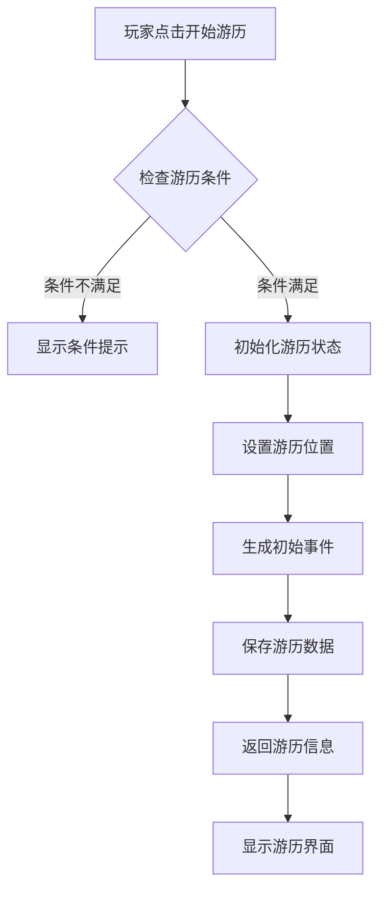
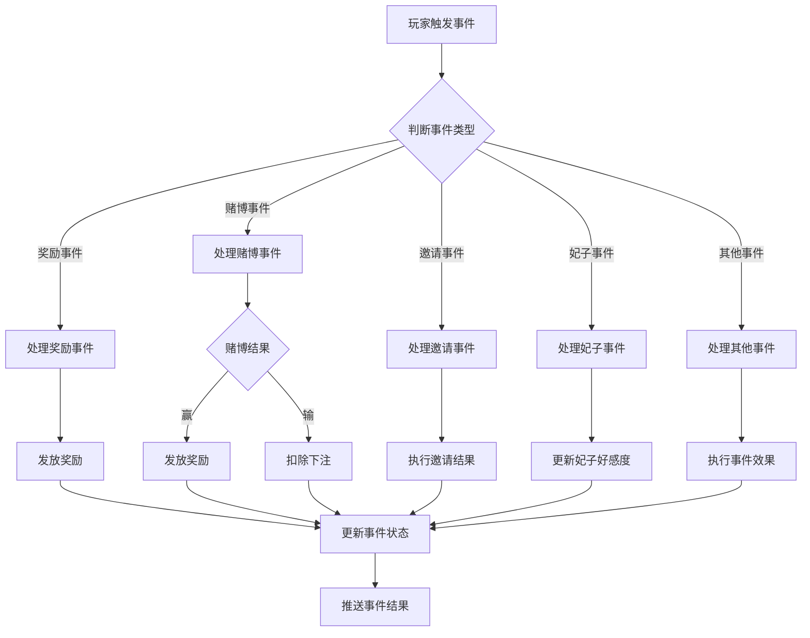
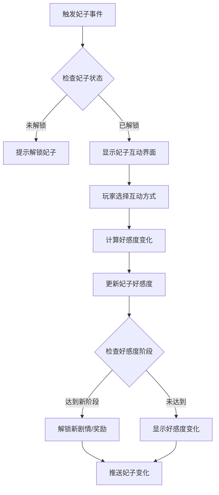
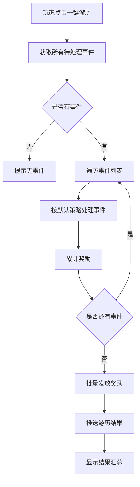

# 旅行模块完整说明

## 一、模块概述

### 1.1 业务背景

旅行模块是 K2C 游戏的特色探索玩法，玩家派遣角色在游戏世界中进行游历探索，在旅途中触发各种随机事件，获得奖励和与妃子互动的机会。模块融合了Roguelike元素和养成玩法，为玩家提供轻松有趣的游戏体验。

### 1.2 目标用户

- **休闲玩家**：享受轻松的挂机探索体验
- **收集玩家**：通过旅行收集妃子和物品
- **社交玩家**：与妃子互动提升好感度

### 1.3 核心价值

1. **轻松玩法**：低操作成本，高收益回报
2. **随机惊喜**：丰富的随机事件带来惊喜感
3. **角色养成**：通过妃子互动提升角色好感度
4. **资源获取**：稳定获取游戏资源的渠道

---

## 二、功能清单

### 2.1 游历基础功能

| 功能名称 | 功能描述 | 用户价值 |
|---------|---------|---------|
| 开始游历 | 发起一次游历探索 | 开始探索旅程 |
| 一键游历 | 自动处理所有待处理事件 | 简化操作流程 |
| 游历状态 | 显示当前游历进度和位置 | 了解探索状态 |
| 游历历史 | 查看过往游历记录 | 回顾探索经历 |

### 2.2 事件处理功能

| 功能名称 | 功能描述 | 用户价值 |
|---------|---------|---------|
| 奖励事件 | 触发获得奖励的事件 | 获取资源奖励 |
| 赌博事件 | 参与赌博赢取奖励 | 获得高额回报 |
| 邀请事件 | 接受或拒绝邀请 | 触发社交互动 |
| 赠礼事件 | 收到或赠送礼物 | 获取物品奖励 |

### 2.3 妃子互动功能

| 功能名称 | 功能描述 | 用户价值 |
|---------|---------|---------|
| 妃子酒吧事件 | 与妃子在酒吧互动 | 提升好感度 |
| 妃子好感事件 | 提升妃子好感度 | 解锁妃子剧情 |
| 妃子亲密度事件 | 提升妃子亲密度 | 获得妃子加成 |
| 妃子信息 | 查看妃子好感度进度 | 了解养成进度 |

### 2.4 其他事件功能

| 功能名称 | 功能描述 | 用户价值 |
|---------|---------|---------|
| 变换事件 | 事件结果发生变化 | 增加随机性 |
| 加力事件 | 获得力量加成 | 提升角色属性 |

---

## 三、业务流程详解

### 3.1 开始游历流程



**详细步骤说明**：

1. **条件检查**
   - 检查游历功能是否解锁
   - 检查是否有足够的游历次数
   - 检查是否有进行中的游历

2. **初始化**
   - 设置游历起始位置
   - 初始化游历状态
   - 生成初始事件池

3. **事件生成**
   - 根据位置获取事件配置
   - 按权重随机选择事件
   - 创建事件实例

### 3.2 事件处理流程



**详细步骤说明**：

1. **事件识别**
   - 获取事件类型
   - 匹配处理逻辑
   - 验证事件状态

2. **事件处理**
   - 执行对应处理逻辑
   - 计算事件结果
   - 更新相关数据

3. **结果推送**
   - 更新事件状态
   - 发放奖励/惩罚
   - 推送客户端更新

### 3.3 妃子互动流程



**详细步骤说明**：

1. **妃子验证**
   - 检查妃子是否已解锁
   - 获取妃子当前状态
   - 验证互动权限

2. **互动处理**
   - 计算好感度变化值
   - 更新妃子好感度数据
   - 检查阶段解锁

3. **结果推送**
   - 推送好感度变化
   - 推送解锁奖励
   - 更新妃子信息

### 3.4 一键游历流程



---

## 四、关键规则

### 4.1 游历规则

1. **游历条件**
   - 玩家等级达到解锁条件
   - 有可用的游历次数
   - 无进行中的游历

2. **游历次数**
   - 每日固定恢复次数
   - 可通过道具补充次数
   - VIP增加每日次数上限

3. **游历位置**
   - 不同位置解锁条件不同
   - 高级位置奖励更丰厚
   - 位置间有进度关联

### 4.2 事件规则

1. **事件类型**
   - 奖励事件：直接获得奖励
   - 赌博事件：下注赢取奖励
   - 邀请事件：社交互动触发
   - 妃子事件：妃子相关互动
   - 变换事件：结果随机变化
   - 加力事件：获得属性加成

2. **事件权重**
   - 每种事件有触发权重
   - 稀有事件权重较低
   - 位置影响事件权重分布

3. **事件时效**
   - 事件有存在时间限制
   - 超时未处理自动消失
   - 特殊事件时效更长

### 4.3 妃子规则

1. **好感度系统**
   - 好感度有阶段划分
   - 每阶段有对应奖励
   - 好感度可累积

2. **互动规则**
   - 每次互动增加好感度
   - 不同互动方式增加量不同
   - 高好感度解锁特殊互动

3. **妃子解锁**
   - 通过特定事件解锁妃子
   - 完成指定任务解锁
   - 使用道具解锁

---

## 五、用户故事

### 5.1 休闲玩家故事

> 作为一名休闲玩家，我每天上线都会进行游历。点击开始游历后，我的角色就开始在游戏世界中探索。偶尔收到事件通知，我会简单处理一下获得奖励。有时候触发了妃子事件，我会和妃子互动，看着好感度慢慢上涨，感觉很温馨。

### 5.2 收集玩家故事

> 作为一名收集玩家，我专注于通过游历收集各种妃子。今天我在游历中遇到了一位新妃子，通过互动成功解锁了她！她的好感度已经达到了第二阶段，解锁了一段专属剧情。我会继续游历，争取收集更多的妃子。

### 5.3 社交玩家故事

> 作为一名社交玩家，我喜欢邀请事件带来的社交互动。今天我收到了一个邀请事件，选择了邀请好友一起探索。我们获得了一份特别的奖励，还增加了好友的亲密度。游历系统让我的社交体验更加丰富。

---

## 六、示例

### 6.1 游历开始示例

**初始状态**：
```
玩家等级：25
游历次数：5/10
游历状态：空闲
```

**开始游历**：
- 选择起始位置：新手平原

**游历结果**：
```
游历ID：1001
当前位置：新手平原 - 第1站
游历状态：进行中
触发事件：
  - 事件1：奖励事件（银两 × 5000）
  - 事件2：妃子好感事件（妃子：小红，好感度 +10）
剩余游历次数：4/10
```

### 6.2 奖励事件示例

**事件配置**：
```
事件ID：301
事件类型：奖励事件
事件描述：你在路上发现了一个宝箱
奖励列表：
  - 银两 × 3000
  - 经验药水 × 5
权重：100
```

**处理操作**：玩家选择打开宝箱

**处理结果**：
```
获得奖励：银两 × 3000, 经验药水 × 5
事件状态：已完成
事件从列表移除
```

### 6.3 赌博事件示例

**事件配置**：
```
事件ID：302
事件类型：赌博事件
事件描述：遇到了一个赌徒，是否参与？
下注范围：100-1000银两
胜利概率：40%
胜利倍率：3倍
```

**处理操作**：
- 玩家下注：500银两
- 赌博结果：胜利

**处理结果**：
```
下注金额：500银两
获胜金额：1500银两（500 × 3）
净收益：1000银两
事件状态：已完成
```

### 6.4 妃子互动示例

**妃子配置**：
```
妃子ID：1001
妃子名称：小红
当前好感度：50/100
好感阶段：1（0-30为阶段0，31-70为阶段1）
阶段奖励：专属剧情"初识"
```

**触发事件**：妃子好感事件

**互动结果**：
```
好感度变化：+15
更新后好感度：65/100
当前阶段：1
距下一阶段进度：65/70（还差5点）
```

---

*文档生成时间: 2026-04-07*
