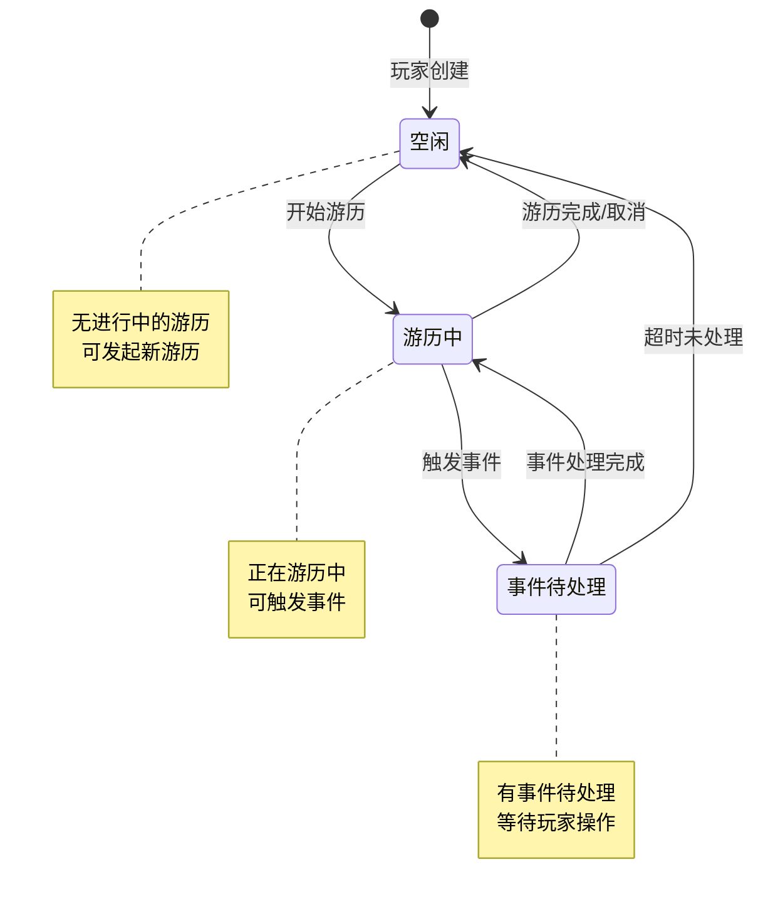
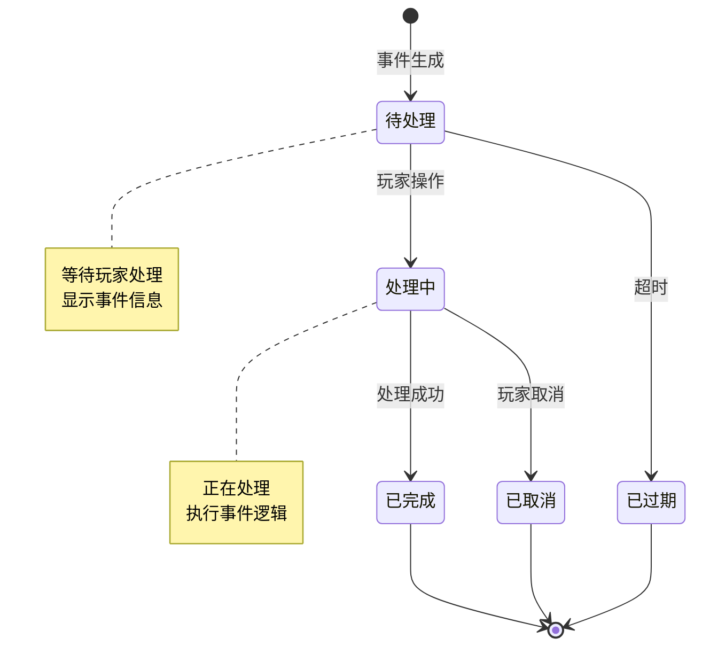
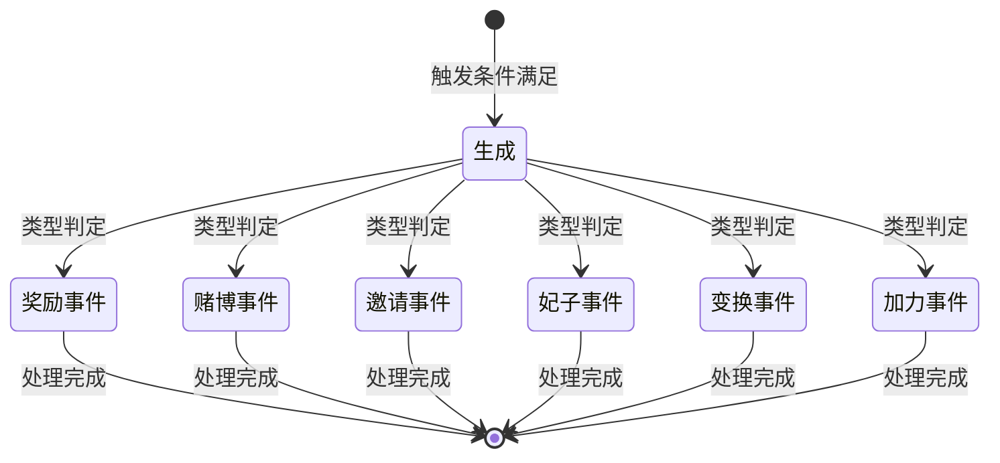
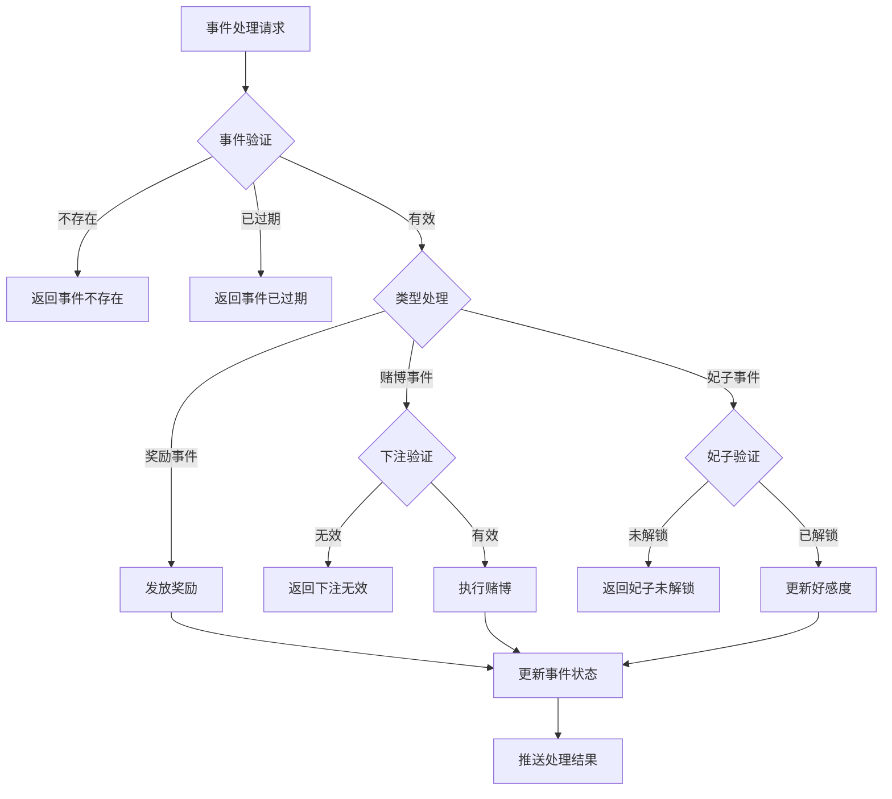

# 旅行模块实现细节

## 一、计算公式

### 1.1 事件触发概率计算公式

```
触发概率 = 事件权重 / 位置总权重 × 100%
```

**示例计算**：
```
位置总权重：1000
事件权重：100

触发概率 = 100 / 1000 × 100% = 10%
```

### 1.2 赌博胜率计算公式

```
实际胜率 = 基础胜率 + 玩家幸运加成
```

**示例计算**：
```
基础胜率：40%
玩家幸运加成：5%（来自装备/技能）

实际胜率 = 40% + 5% = 45%
```

### 1.3 妃子好感度计算公式

```
好感度变化 = 基础变化值 × (1 + 好感加成)
```

**示例计算**：
```
基础变化值：10
好感加成：20%（来自VIP）

好感度变化 = 10 × (1 + 0.2) = 12
```

### 1.4 阶段判定公式

```
当前阶段 = floor(当前好感度 / 阶段跨度)
```

**示例计算**：
```
当前好感度：65
阶段跨度：30

当前阶段 = floor(65 / 30) = 2（第三阶段）
```

---

## 二、状态机定义

### 2.1 游历状态机



### 2.2 事件状态机



### 2.3 妃子状态机

```mermaid
stateDiagram-v2
    [*] --> 未解锁: 初始状态
    未解锁 --> 已解锁: 解锁条件满足
    已解锁 --> 阶段0: 好感度0-30
    阶段0 --> 阶段1: 好感度31-70
    阶段1 --> 阶段2: 好感度71-100
    阶段2 --> 满好感: 好感度100

    note right of 未解锁
        妃子未获得
        显示解锁条件
    end note

    note right of 阶段N
        可互动
        可触发事件
    end note
```

### 2.4 事件类型状态机



---

## 三、数据约束

### 3.1 游历数据约束

| 字段名 | 数据类型 | 取值范围 | 必填 | 说明 |
|--------|----------|----------|------|------|
| id | bigint | > 0 | 是 | 主键 |
| player_id | bigint | > 0 | 是 | 玩家ID |
| current_pos | int | >= 1 | 是 | 当前位置 |
| travel_state | int | 0-2 | 是 | 状态：0空闲，1游历中，2事件待处理 |
| event_list | json | - | 是 | 事件列表 |
| start_time | datetime | - | 是 | 开始时间 |
| update_time | datetime | - | 是 | 更新时间 |

### 3.2 事件数据约束

| 字段名 | 数据类型 | 取值范围 | 必填 | 说明 |
|--------|----------|----------|------|------|
| event_id | int | > 0 | 是 | 事件ID |
| event_type | int | 1-9 | 是 | 事件类型枚举 |
| event_state | int | 0-3 | 是 | 状态：0待处理，1处理中，2已完成，3已过期 |
| trigger_time | long | > 0 | 是 | 触发时间戳 |
| expire_time | long | - | 否 | 过期时间戳 |
| event_data | json | - | 否 | 事件数据（如赌博下注金额等） |

### 3.3 妃子游历数据约束

| 字段名 | 数据类型 | 取值范围 | 必填 | 说明 |
|--------|----------|----------|------|------|
| id | bigint | > 0 | 是 | 主键 |
| player_id | bigint | > 0 | 是 | 玩家ID |
| consort_id | bigint | > 0 | 是 | 妃子ID |
| like | int | 0-100 | 是 | 好感度 |
| stage | int | >= 0 | 是 | 当前阶段 |
| update_time | datetime | - | 是 | 更新时间 |

### 3.4 游历位置配置约束

| 字段名 | 数据类型 | 取值范围 | 必填 | 说明 |
|--------|----------|----------|------|------|
| pos_id | int | > 0 | 是 | 位置ID |
| pos_name | string | 非空 | 是 | 位置名称 |
| unlock_condition | int | - | 是 | 解锁条件ID |
| event_pool | json | 非空 | 是 | 事件池配置 |
| total_weight | int | > 0 | 是 | 总权重 |

---

## 四、错误处理策略

### 4.1 旅行模块错误码

| 错误码 | 错误信息 | 处理策略 | 用户提示 |
|--------|----------|----------|----------|
| 80001 | 游历功能未解锁 | 检查功能解锁 | "游历功能尚未解锁" |
| 80002 | 游历次数不足 | 检查游历次数 | "游历次数不足" |
| 80003 | 已有进行中的游历 | 检查游历状态 | "已有进行中的游历" |
| 80004 | 事件不存在 | 检查事件ID | "事件不存在" |
| 80005 | 事件已过期 | 检查事件时间 | "事件已过期" |
| 80006 | 妃子未解锁 | 检查妃子状态 | "该妃子尚未解锁" |
| 80007 | 下注金额不合法 | 检查下注金额 | "下注金额不合法" |
| 80008 | 银两不足 | 检查玩家银两 | "银两不足" |

### 4.2 事件处理错误处理流程



### 4.3 异常处理策略

| 异常场景 | 处理策略 | 数据处理 |
|----------|----------|----------|
| 奖励发放失败 | 记录日志，重试机制 | 不更新事件状态 |
| 赌博计算异常 | 返还下注金额 | 事件标记为异常 |
| 妃子数据异常 | 忽略本次更新 | 记录告警日志 |
| 事件超时处理 | 自动移除事件 | 不发放奖励 |

---

## 五、关键代码示例

### 5.1 开始游历伪代码

```csharp
public Result StartTravel(long playerId)
{
    // 1. 检查功能解锁
    if (!playerService.IsFunctionUnlock(playerId, FunctionType.TRAVEL))
    {
        return Result.Error(80001, "游历功能未解锁");
    }

    // 2. 检查游历次数
    int travelCount = GetTravelCount(playerId);
    if (travelCount <= 0)
    {
        return Result.Error(80002, "游历次数不足");
    }

    // 3. 检查是否有进行中的游历
    PlayerTravel activeTravel = travelDao.GetActiveTravel(playerId);
    if (activeTravel != null)
    {
        return Result.Error(80003, "已有进行中的游历");
    }

    // 4. 消耗游历次数
    UseTravelCount(playerId);

    // 5. 初始化游历数据
    PlayerTravel travel = new PlayerTravel
    {
        player_id = playerId,
        current_pos = 1,
        travel_state = 1, // 游历中
        event_list = new List<TravelEvent>(),
        start_time = DateTime.Now,
        update_time = DateTime.Now
    };

    // 6. 生成初始事件
    List<TravelEvent> events = GenerateEvents(playerId, 1);
    travel.event_list = events;

    // 7. 保存数据
    travelDao.Insert(travel);

    // 8. 推送游历开始
    PushTravelStart(playerId, travel);

    return Result.Success(travel);
}
```

### 5.2 事件生成伪代码

```csharp
private List<TravelEvent> GenerateEvents(long playerId, int posId)
{
    List<TravelEvent> events = new List<TravelEvent>();

    // 1. 获取位置配置
    TravelPosConfig posConfig = configService.GetTravelPosConfig(posId);

    // 2. 确定生成事件数量
    int eventCount = Random.Range(posConfig.minEventCount, posConfig.maxEventCount + 1);

    // 3. 按权重随机选择事件
    for (int i = 0; i < eventCount; i++)
    {
        TravelEventConfig eventConfig = WeightedSelectEvent(posConfig.eventPool);

        TravelEvent travelEvent = new TravelEvent
        {
            event_id = idGenerator.NextId(),
            event_type = eventConfig.event_type,
            event_state = 0, // 待处理
            trigger_time = DateTimeOffset.UtcNow.ToUnixTimeMilliseconds(),
            expire_time = DateTimeOffset.UtcNow.ToUnixTimeMilliseconds() + eventConfig.expire_duration * 1000,
            event_data = GenerateEventData(eventConfig)
        };

        events.Add(travelEvent);
    }

    return events;
}

private TravelEventConfig WeightedSelectEvent(List<EventPoolItem> pool)
{
    int totalWeight = pool.Sum(p => p.weight);
    int random = Random.Range(0, totalWeight);

    int accumulated = 0;
    foreach (var item in pool)
    {
        accumulated += item.weight;
        if (random < accumulated)
        {
            return configService.GetEventConfig(item.event_id);
        }
    }

    return configService.GetEventConfig(pool[0].event_id);
}
```

### 5.3 处理奖励事件伪代码

```csharp
public Result DealRewardEvent(long playerId, int eventId)
{
    // 1. 获取游历数据
    PlayerTravel travel = travelDao.GetActiveTravel(playerId);
    if (travel == null)
    {
        return Result.Error(80003, "无进行中的游历");
    }

    // 2. 查找事件
    TravelEvent evt = travel.event_list.Find(e => e.event_id == eventId);
    if (evt == null)
    {
        return Result.Error(80004, "事件不存在");
    }

    // 3. 检查事件状态
    if (evt.event_state != 0)
    {
        return Result.Error(80005, "事件已处理");
    }

    // 4. 检查是否过期
    if (evt.expire_time > 0 && DateTimeOffset.UtcNow.ToUnixTimeMilliseconds() > evt.expire_time)
    {
        evt.event_state = 3; // 已过期
        travelDao.Update(travel);
        return Result.Error(80005, "事件已过期");
    }

    // 5. 获取事件配置
    TravelEventConfig config = configService.GetEventConfig(evt.event_type);

    // 6. 发放奖励
    List<RewardItem> rewards = CalculateRewards(config);
    itemService.GiveItems(playerId, rewards);

    // 7. 更新事件状态
    evt.event_state = 2; // 已完成
    travel.update_time = DateTime.Now;
    travelDao.Update(travel);

    // 8. 检查是否需要生成新事件
    CheckAndGenerateNewEvents(playerId, travel);

    // 9. 推送处理结果
    PushEventResult(playerId, evt, rewards);

    return Result.Success(new { rewards });
}
```

### 5.4 处理赌博事件伪代码

```csharp
public Result DealGamblingEvent(long playerId, int eventId, int betAmount)
{
    // 1-4. 同奖励事件验证流程...

    // 5. 验证下注金额
    TravelGamblingConfig gamblingConfig = configService.GetGamblingConfig(evt.event_type);
    if (betAmount < gamblingConfig.min_bet || betAmount > gamblingConfig.max_bet)
    {
        return Result.Error(80007, "下注金额不合法");
    }

    // 6. 检查银两是否足够
    if (!playerService.HasSilver(playerId, betAmount))
    {
        return Result.Error(80008, "银两不足");
    }

    // 7. 执行赌博
    int winRate = gamblingConfig.base_win_rate + playerService.GetLuckBonus(playerId);
    bool isWin = Random.Range(0, 100) < winRate;

    long resultAmount;
    if (isWin)
    {
        resultAmount = betAmount * gamblingConfig.win_multiplier;
        playerService.AddSilver(playerId, resultAmount, "游历赌博获胜");
    }
    else
    {
        resultAmount = -betAmount;
        playerService.CostSilver(playerId, betAmount, "游历赌博失败");
    }

    // 8. 更新事件状态
    evt.event_state = 2;
    evt.event_data = new { betAmount, isWin, resultAmount };
    travelDao.Update(travel);

    // 9. 推送结果
    PushGamblingResult(playerId, evt, isWin, resultAmount);

    return Result.Success(new { isWin, resultAmount });
}
```

### 5.5 处理妃子事件伪代码

```csharp
public Result DealConsortEvent(long playerId, int eventId, long consortId)
{
    // 1-4. 同奖励事件验证流程...

    // 5. 检查妃子是否解锁
    PlayerConsort consort = consortDao.GetConsort(playerId, consortId);
    if (consort == null)
    {
        return Result.Error(80006, "妃子未解锁");
    }

    // 6. 计算好感度变化
    TravelConsortConfig config = configService.GetConsortConfig(evt.event_type);
    int likeChange = (int)(config.base_like_change * (1 + playerService.GetVipBonus(playerId)));

    // 7. 更新好感度
    int oldLike = consort.like;
    consort.like = Math.Min(100, consort.like + likeChange);

    // 8. 检查阶段变化
    int oldStage = CalculateStage(oldLike);
    int newStage = CalculateStage(consort.like);

    consortDao.Update(consort);

    // 9. 阶段升级处理
    if (newStage > oldStage)
    {
        // 发放阶段奖励
        List<RewardItem> stageRewards = GetStageRewards(consortId, newStage);
        itemService.GiveItems(playerId, stageRewards);

        // 推送阶段升级
        PushStageUp(playerId, consortId, newStage, stageRewards);
    }

    // 10. 更新事件状态
    evt.event_state = 2;
    travelDao.Update(travel);

    // 11. 推送妃子变化
    PushConsortChange(playerId, consort);

    return Result.Success(new { likeChange, newLike = consort.like, newStage });
}
```

### 5.6 一键游历伪代码

```csharp
public Result AkeyTravel(long playerId)
{
    // 1. 获取游历数据
    PlayerTravel travel = travelDao.GetActiveTravel(playerId);
    if (travel == null)
    {
        return Result.Error(80003, "无进行中的游历");
    }

    // 2. 获取所有待处理事件
    List<TravelEvent> pendingEvents = travel.event_list.Where(e => e.event_state == 0).ToList();
    if (pendingEvents.Count == 0)
    {
        return Result.Error(80004, "无待处理事件");
    }

    // 3. 批量处理事件
    List<RewardItem> totalRewards = new List<RewardItem>();
    List<ConsortLikeChange> likeChanges = new List<ConsortLikeChange>();

    foreach (var evt in pendingEvents)
    {
        // 检查是否过期
        if (evt.expire_time > 0 && DateTimeOffset.UtcNow.ToUnixTimeMilliseconds() > evt.expire_time)
        {
            evt.event_state = 3;
            continue;
        }

        // 按默认策略处理
        var result = ProcessEventByDefaultStrategy(playerId, evt);
        totalRewards.AddRange(result.Rewards);
        if (result.LikeChange != null)
        {
            likeChanges.Add(result.LikeChange);
        }

        evt.event_state = 2;
    }

    // 4. 批量发放奖励
    itemService.GiveItems(playerId, totalRewards);

    // 5. 更新数据
    travel.update_time = DateTime.Now;
    travelDao.Update(travel);

    // 6. 推送一键游历结果
    PushAkeyTravelResult(playerId, totalRewards, likeChanges);

    return Result.Success(new { rewards = totalRewards, likeChanges });
}
```

---

## 六、跨模块依赖

### 6.1 模块依赖关系

| 依赖模块 | 依赖内容 | 说明 |
|----------|----------|------|
| Player模块 | 玩家基础数据、银两管理 | 游历次数、银两扣除 |
| Bag模块 | 背包空间检查、物品发放 | 奖励发放 |
| Item模块 | 物品配置、物品创建 | 奖励物品创建 |
| Notice模块 | 红点提示、推送通知 | 事件通知 |
| Consort模块 | 妃子数据、好感度管理 | 妃子互动 |

### 6.2 接口依赖

```csharp
// 玩家模块接口
interface IPlayerService
{
    bool HasSilver(long playerId, long amount);
    void AddSilver(long playerId, long amount, string reason);
    void CostSilver(long playerId, long amount, string reason);
    int GetLuckBonus(long playerId);
    int GetVipBonus(long playerId);
}

// 妃子模块接口
interface IConsortService
{
    PlayerConsort GetConsort(long playerId, long consortId);
    void UpdateConsort(PlayerConsort consort);
    List<RewardItem> GetStageRewards(long consortId, int stage);
}

// 配置模块接口
interface IConfigService
{
    TravelPosConfig GetTravelPosConfig(int posId);
    TravelEventConfig GetEventConfig(int event_type);
    TravelGamblingConfig GetGamblingConfig(int event_type);
    TravelConsortConfig GetConsortConfig(int event_type);
}
```

### 6.3 事件依赖

| 事件类型 | 触发时机 | 处理逻辑 |
|----------|----------|----------|
| 定时刷新 | 定时触发 | 检查游历进度，生成新事件 |
| 事件超时 | 超时触发 | 自动移除过期事件 |
| 玩家登录 | 登录触发 | 恢复游历状态，推送待处理事件 |

---

## 七、关键实现细节

### 7.1 位置解锁检查优化

```java
/**
 * 获取当前需要传给randPos的锁定位置ID集合
 * 首次调用时扫描全部配表初始化；后续只检查集合内剩余ID，满足条件则移出
 */
private Set<Long> _buildLockedPosIds() {
    if (_m_lockedPosIds == null) {
        // 首次初始化：扫描配表，收集有条件且当前未满足的位置ID
        _m_lockedPosIds = new HashSet<>();
        for (RefTravelPos posRef : RefTravelPos.getMgr().getList()) {
            if (posRef.unlock_condition != null &&
                !NPPlayerConditionDealerMgr.IsEnable(posRef.unlock_condition, getUserData(), null))
                _m_lockedPosIds.add(posRef.id);
        }
    } else {
        // 后续调用：只检查剩余锁定ID，条件已满足则移出
        _m_lockedPosIds.removeIf(posId -> {
            RefTravelPos posRef = RefTravelPos.getMgr().get(posId);
            return posRef == null || NPPlayerConditionDealerMgr.IsEnable(posRef.unlock_condition, getUserData(), null);
        });
    }
    return _m_lockedPosIds.isEmpty() ? null : _m_lockedPosIds;
}
```

### 7.2 避免连续位置重复

```java
// RefTravelPos.java
public static RefTravelPos randPos(long _excludePosId, Set<Long> _lockedPosIds) {
    List<RefTravelPos> candidateList = new ArrayList<>();
    for (RefTravelPos posRef : getMgr().getList()) {
        // 排除上次位置，避免连续重复
        if (posRef.id == _excludePosId) continue;
        // 排除未解锁位置
        if (_lockedPosIds != null && _lockedPosIds.contains(posRef.id)) continue;
        candidateList.add(posRef);
    }
    if (candidateList.isEmpty()) return null;
    return candidateList.get(CommonFunc.randomInt(candidateList.size()));
}
```

### 7.3 前置事件处理机制

```java
/**
 * 弹出首个可以处理的前置事件
 */
public WCGPairLong popFirstUnFinishedEarlyEvent(NPPlayerContext _context) {
    getUserData().lockUser();

    try {
        if (_m_unFinishedEarlyEvents.isEmpty()) return null;

        for (int i = 0; i < _m_unFinishedEarlyEvents.size(); i++) {
            WCGPairLong eventInfo = _m_unFinishedEarlyEvents.get(i);
            long eventId = eventInfo.first();

            RefTravelEvent eventRef = RefTravelEvent.getMgr().get(eventId);
            if (null == eventRef) continue;

            // 检查条件是否满足
            if (!NPPlayerConditionDealerMgr.IsEnable(eventRef.effective_condition, getUserData(), null))
                continue;

            // 事件ID处理
            _m_unFinishedEarlyEvents.remove(eventInfo);
            _m_finishedEarlyEvents.add(eventId);

            // 再次检查前置事件是否全部完成
            _checkIsAllEarlyEventsFinished(_context);

            return new WCGPairLong(eventInfo.first(), eventInfo.second());
        }

        return null;
    } finally {
        getUserData().unlockUser();
    }
}
```

---

## 八、性能优化要点

### 8.1 配表缓存

```java
// 事件配置缓存
private Map<Long, RefTravelEvent> _m_eventCache = new HashMap<>();

public RefTravelEvent getEventRef(long eventId) {
    return _m_eventCache.computeIfAbsent(eventId, id -> RefTravelEvent.getMgr().get(id));
}
```

### 8.2 批量处理优化

```java
// 一键游历时批量处理，减少数据库操作
public void _processAkeyEventList(...) {
    // 批量创建事件数据
    List<PlayerTravelCanDealBO> boList = new ArrayList<>();
    for (...) {
        PlayerTravelCanDealBO bo = new PlayerTravelCanDealBO();
        bo.setCid(...);
        bo.setEventId(...);
        bo.setPosId(...);
        boList.add(bo);
    }
    // 批量插入
    getUSServer().getBM().getBM(PlayerTravelCanDealBO.class).batchInsert(boList);
}
```

### 8.3 锁粒度控制

```java
// 使用细粒度锁，减少锁持有时间
public void dealEvent(long instanceId, NPPlayerContext _context) {
    TravelCanDealEventInfo eventInfo;
    // 读操作，快速获取
    getUserData().lockUser();
    try {
        eventInfo = lookupCanDealEvent(instanceId);
    } finally {
        getUserData().unlockUser();
    }

    // 处理逻辑，不需要持有锁
    if (eventInfo != null) {
        processEvent(eventInfo, _context);
    }
}
```

---

*文档生成时间: 2026-04-11*
