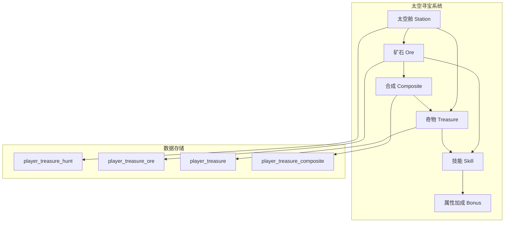
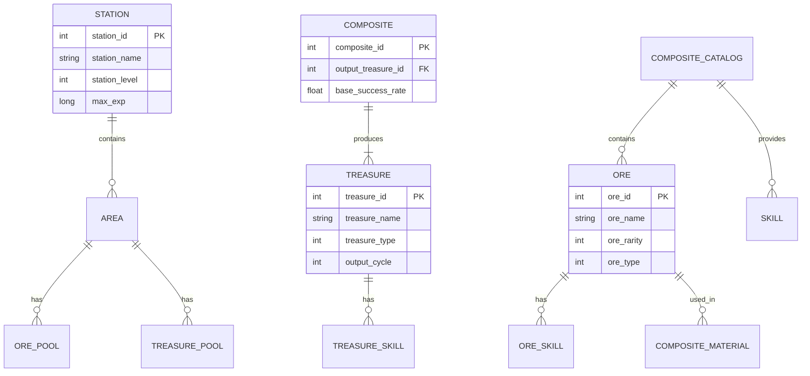

# 太空寻宝系统 - 数据配表

## 概述

太空寻宝系统 (TreasureHuntOp, p036) 是游戏中的探索玩法，玩家可以在太空中探索获取矿石和宝藏，通过合成系统将矿石转化为奇物，获得丰厚的奖励。

## 模块架构图



---

## 配表文件

### 1. 太空舱配置 (TreasureStation)

| 字段名 | 类型 | 说明 | 示例值 |
|-------|------|------|--------|
| station_id | int | 站点ID | 1 |
| station_name | string | 站点名称 | 初级太空舱 |
| station_type | int | 站点类型 | 1 |
| station_level | int | 站点等级 | 1 |
| max_exp | long | 升级所需经验 | 1000 |
| unlock_level | int | 解锁等级 | 1 |
| unlock_condition | json | 解锁条件 | {} |
| area_list | array | 区域列表 | [1,2,3] |

**配置示例**:
```json
{
    "station_id": 1,
    "station_name": "初级太空舱",
    "station_type": 1,
    "station_level": 1,
    "max_exp": 1000,
    "unlock_level": 1,
    "area_list": [1001, 1002, 1003]
}
```

---

### 2. 矿石配置 (TreasureOre)

| 字段名 | 类型 | 说明 | 示例值 |
|-------|------|------|--------|
| ore_id | int | 矿石ID | 1001 |
| ore_name | string | 矿石名称 | 星辰石 |
| ore_rarity | int | 稀有度 (1普通/2稀有/3史诗/4传说) | 1 |
| ore_type | int | 矿石类型 (1普通/2高级) | 1 |
| base_value | int | 基础价值 | 100 |
| max_record | int | 最大记录上限 | 999999 |
| record_reward_list | array | 记录奖励档位 | [] |
| skill_id_normal | int | 普通技能ID | 10001 |
| skill_id_advanced | int | 高级技能ID | 10002 |
| icon | string | 图标路径 | "Textures/Ore/ore_1001" |
| desc | string | 描述 | "闪耀着星光的神秘矿石" |

**配置示例**:
```json
{
    "ore_id": 1001,
    "ore_name": "星辰石",
    "ore_rarity": 1,
    "ore_type": 1,
    "base_value": 100,
    "max_record": 999999,
    "record_reward_list": [
        {"record": 100, "reward": [{"type": 1, "id": 101, "count": 100}]},
        {"record": 500, "reward": [{"type": 1, "id": 101, "count": 500}]}
    ]
}
```

---

### 3. 奇物配置 (Treasure)

| 字段名 | 类型 | 说明 | 示例值 |
|-------|------|------|--------|
| treasure_id | int | 奇物ID | 2001 |
| treasure_name | string | 奇物名称 | 星空宝箱 |
| treasure_type | int | 奇物类型 | 1 |
| rarity | int | 稀有度 | 2 |
| skill_id | int | 技能ID | 20001 |
| output_cycle | int | 产出周期(秒) | 14400 |
| output_gem | int | 产出钻石数量 | 50 |
| output_gem_level_bonus | float | 等级加成系数 | 0.1 |
| max_accumulate | int | 最大累积次数 | 3 |
| related_lab_id | int | 关联实验室ID | 1 |
| icon | string | 图标路径 | "Textures/Treasure/treasure_2001" |
| desc | string | 描述 | "神秘的星空宝箱" |

**配置示例**:
```json
{
    "treasure_id": 2001,
    "treasure_name": "星空宝箱",
    "treasure_type": 1,
    "rarity": 2,
    "skill_id": 20001,
    "output_cycle": 14400,
    "output_gem": 50,
    "output_gem_level_bonus": 0.1,
    "max_accumulate": 3,
    "related_lab_id": 1
}
```

---

### 4. 矿石技能配置 (TreasureOreSkill)

| 字段名 | 类型 | 说明 | 示例值 |
|-------|------|------|--------|
| skill_id | int | 技能ID | 10001 |
| skill_name | string | 技能名称 | 矿石精通 |
| skill_type | int | 技能类型 | 1 |
| max_level | int | 最大等级 | 10 |
| effect_type | int | 效果类型 | 1 |
| effect_value | array | 各等级效果值 | [10, 20, 30...] |
| upgrade_cost | array | 升级消耗 | [] |
| unlock_cost | array | 激活消耗 | [] |

**配置示例**:
```json
{
    "skill_id": 10001,
    "skill_name": "矿石精通",
    "skill_type": 1,
    "max_level": 10,
    "effect_type": 1,
    "effect_value": [10, 20, 30, 40, 50, 60, 70, 80, 90, 100],
    "unlock_cost": [
        {"type": 1, "id": 101, "count": 100}
    ],
    "upgrade_cost": [
        {"type": 1, "id": 101, "count": 50}
    ]
}
```

---

### 5. 奇物技能配置 (TreasureTreasureSkill)

| 字段名 | 类型 | 说明 | 示例值 |
|-------|------|------|--------|
| skill_id | int | 技能ID | 20001 |
| skill_name | string | 技能名称 | 宝藏增效 |
| skill_type | int | 技能类型 | 1 |
| max_level | int | 最大等级 | 10 |
| effect_type | int | 效果类型 | 1 |
| effect_value | array | 各等级效果值 | [5, 10, 15...] |
| upgrade_cost | array | 升级消耗 | [] |
| unlock_cost | array | 激活消耗 | [] |

---

### 6. 合成配置 (TreasureComposite)

| 字段名 | 类型 | 说明 | 示例值 |
|-------|------|------|--------|
| composite_id | int | 合成ID | 3001 |
| composite_name | string | 合成名称 | 星空宝箱合成 |
| material_list | array | 材料列表 | [] |
| output_treasure_id | int | 产出奇物ID | 2001 |
| base_success_rate | float | 基础成功率 | 0.8 |
| daily_limit | int | 每日次数限制 | 3 |
| unlock_condition | json | 解锁条件 | {} |

**配置示例**:
```json
{
    "composite_id": 3001,
    "composite_name": "星空宝箱合成",
    "material_list": [
        {"ore_id": 1001, "count": 10},
        {"ore_id": 1002, "count": 5}
    ],
    "output_treasure_id": 2001,
    "base_success_rate": 0.8,
    "daily_limit": 3
}
```

---

### 7. 组合图鉴配置 (TreasureCompositeCatalog)

| 字段名 | 类型 | 说明 | 示例值 |
|-------|------|------|--------|
| catalog_id | int | 图鉴ID | 4001 |
| catalog_name | string | 图鉴名称 | 星辰组合 |
| ore_list | array | 包含矿石ID列表 | [1001, 1002, 1003] |
| normal_skill_id | int | 普通技能ID | 40001 |
| advanced_skill_id | int | 高级技能ID | 40002 |
| normal_unlock_cost | array | 普通激活消耗 | [] |
| advanced_unlock_cost | array | 高级激活消耗 | [] |

---

### 8. 区域配置 (TreasureArea)

| 字段名 | 类型 | 说明 | 示例值 |
|-------|------|------|--------|
| area_id | int | 区域ID | 1001 |
| area_name | string | 区域名称 | 星云区域 |
| area_type | int | 区域类型 | 1 |
| unlock_station_level | int | 解锁太空舱等级 | 1 |
| ore_pool | array | 矿石池配置 | [] |
| treasure_pool | array | 奇物池配置 | [] |
| reward_pool | array | 奖励池配置 | [] |

**矿石池配置示例**:
```json
{
    "area_id": 1001,
    "area_name": "星云区域",
    "unlock_station_level": 1,
    "ore_pool": [
        {"ore_id": 1001, "weight": 50, "min_count": 1, "max_count": 3},
        {"ore_id": 1002, "weight": 30, "min_count": 1, "max_count": 2},
        {"ore_id": 1003, "weight": 15, "min_count": 1, "max_count": 1},
        {"ore_id": 1004, "weight": 5, "min_count": 1, "max_count": 1}
    ]
}
```

---

## 配表路径

| 配表类型 | 客户端路径 | 服务端路径 |
|---------|-----------|-----------|
| 太空舱 | `NPSO/GSO/TreasureHunt/Station/` | `Config/treasure_hunt/station/` |
| 矿石 | `NPSO/GSO/TreasureHunt/Ore/` | `Config/treasure_hunt/ore/` |
| 奇物 | `NPSO/GSO/TreasureHunt/Treasure/` | `Config/treasure_hunt/treasure/` |
| 技能 | `NPSO/GSO/TreasureHunt/Skill/` | `Config/treasure_hunt/skill/` |
| 合成 | `NPSO/GSO/TreasureHunt/Composite/` | `Config/treasure_hunt/composite/` |
| 区域 | `NPSO/GSO/TreasureHunt/Area/` | `Config/treasure_hunt/area/` |

---

## 数据关系图



---

*文档生成时间: 2026-04-12*
